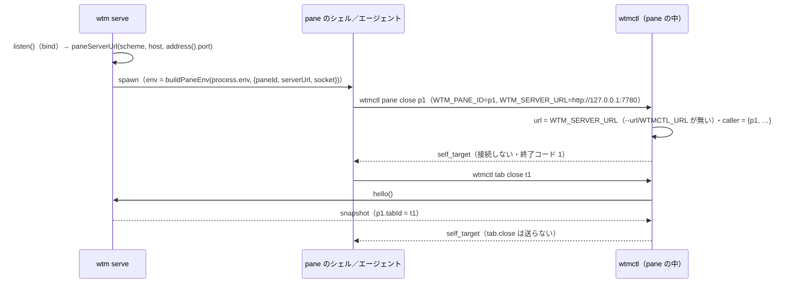

# 仕様: agent skill ファイル・pane の環境変数・自分の pane への操作の歯止め

## 概要

1. **skill ファイル** `packages/cli/skills/wtmctl/SKILL.md`（日本語・front matter つき）を wtmctl と一緒に置き、`wtmctl skill` がそれを標準出力へ書く。
   skill に書いたコマンドと wtmctl のコマンドの一覧の食い違いはテストで検出する。
2. **pane の環境**: サーバは待ち受けた後に「pane から自分へつなげる URL」を決め、pane を起動するたびに `WTM_SERVER_URL` として入れる。
   サーバの環境から受け継いだ `WTMCTL_URL`・`WTMCTL_TOKEN` と、サーバが管理する `WTM_*` の古い値は pane へ渡さない。
3. **接続先**: wtmctl は `--url` → `WTMCTL_URL` → `WTM_SERVER_URL` → 既定の順に決める。
4. **歯止め**: wtmctl は `WTM_PANE_ID`・`WTM_SERVER_URL` があり接続先がそのサーバ（origin が一致）なら、自分の pane（とそれを含む tab・workspace）を
   対象にする破壊的・自己参照的な 9 コマンドを、操作の要求を送る前に `self_target` で断る。

サーバ・プロトコルの RPC とイベントは変えない。

## 設計方針

- **環境変数**（decisions.md D4）: 新しく足すのは `WTM_SERVER_URL` だけ。「pane の中にいる」印は既存の `WTM_PANE_ID` で兼ねる。
  サーバが管理する変数（`WTM_PANE_ID`・`WTM_SERVER_URL`・`WTM_AGENT_REPORT_SOCKET`）はサーバが入れた値だけが pane に届くよう、受け継いだ値を先に消す
  （herdr の「管理する変数は herdr の値が勝つ」と同じ考え方。research.md F2.2）。
- **秘密を入れない**（decisions.md D3）: token・cookie は入れない。受け継いだ `WTMCTL_TOKEN` は消す。消すのは wtmctl の設定の 2 つ（`WTMCTL_URL`・
  `WTMCTL_TOKEN`）と、サーバが管理する 3 つだけで、それ以外の環境（`PATH`・利用者の変数）は今までどおり写す。
- **URL の決め方**: 待ち受けのホストが全インタフェースならループバック（`0.0.0.0` → `127.0.0.1`、`::` → `[::1]`）、それ以外は待ち受けのホストそのもの
  （Origin の検査は `localhost`・`127.0.0.1`・`::1` と `--host` の値を常に許す。research.md F5.1）。ポートは `server.address()` の実際の値、スキームは
  TLS なら `https`。URL にできなければ（ゾーン付きの IPv6 等）入れない。`--origin`（外向けの URL）は使わない——ポート転送・リバースプロキシの先は
  サーバのマシンの中から届くとは限らない。
  - 代替案「全インタフェースのときも `localhost`」: `localhost` は `::1` と `127.0.0.1` の両方に引けうる。つなぐ側は両方を試す（「依拠する既存の事実」の
    `autoSelectFamily`）ので多くは届くが、試す順とアドレスの族の違いに頼る理由が無い。待ち受けている族のループバックのアドレスを直接書くほうが確実。不採用。
  - `--host localhost` で待ち受けたときは `localhost` のまま入れる。待ち受けは `localhost` を引いた 1 つのアドレスにあり、つなぐ側も同じ名前を引いて全部のアドレスを
    試すので届く（アドレスを 1 つに決め打つと、待ち受けた側と違う族を選んで届かないことがある）。
- **優先順位**: 利用者が明示した設定（`--url`・`WTMCTL_URL`）を、サーバが入れた推定（`WTM_SERVER_URL`）より上にする。TLS の証明書に `127.0.0.1` が無い構成等、
  推定が外れたときに利用者が `WTMCTL_URL` で直せる。
- **歯止めの置き場は CLI**（decisions.md D4）。判定は「`WTM_PANE_ID` と `WTM_SERVER_URL` が空でなく、接続先の URL の origin が `WTM_SERVER_URL` の origin と一致する」
  ときだけ有効（呼び出し元の情報 `CallerPane`）。pane 単位の 5 コマンド（`pane close`・`pane input`・`pane run`・`pane attach`・`agent start`）は対象の pane ID が引数で
  決まるので**サーバへつなぐ前に**判定する。`tab close`・`workspace close` は接続時の snapshot（`hello()`）で自分の pane の tab・workspace を引いてから、
  `agent prompt`・`agent send-keys` は名前を pane ID に解決してから、操作の要求の前に判定する。
- **抜け道は環境変数**: `WTM_PANE_ID=` を付けて打てば効かない（フラグは足さない——9 コマンドにフラグを足すと、エージェントが「断られたらフラグを付けて
  やり直す」ことを覚えやすくなる。環境変数を空にするのは人が意図してやる操作として残す）。メッセージがそれを案内する。
- **skill の置き場と配り方**: `packages/cli/skills/wtmctl/SKILL.md`。`wtmctl skill` は実行中のモジュールからの相対（`src`・`dist` のどちらからも `../skills/wtmctl/SKILL.md`）で
  読む（サーバの `agentHookScriptFor` と同じ形。research.md F7.2）。tsc は `.md` を dist に写さない（research.md F7.1）が、パッケージの中の固定の位置にあるので写す必要が無い。
  - 代替案「TS の文字列定数に埋め込む（herdr の `include_str!` 相当）」: 生成の手順（ビルド前のスクリプト）が要り、Markdown として版管理・レビューしにくい。不採用。
- **skill の言語は日本語**（本製品の利用者向けの文書の流儀。エージェントは日本語の指示を読める）。コマンド・環境変数・エラーの code は原文のまま。
- **コマンドの一覧を 1 つにする**: `main.ts` の `printHelp` が持っていた一覧を、`cliArgs.ts` が export する `USAGE_LINES` から出す（一覧が 2 か所にあると、
  skill の食い違いのテストがどちらを見るかで結果が変わる。research.md F7.3）。今の 2 つの一覧は同じ 22 行（`cliArgs.ts:12-33` と `main.ts:27-48` を `diff` で確認）なので、
  一覧の部分は `wtmctl skill` の行が 1 行増えるだけ。一覧の後の説明文は、既存の「環境変数」の行を接続先の優先順位の形に書き換え、歯止めの 1 文を足す（「振る舞いの詳細」の help の項）。

## 対象範囲

- server
  - `packages/server/src/util/net.ts`: `paneServerUrl` を追加。
  - `packages/server/src/session/paneEnv.ts`（新規）: `buildPaneEnv`。
  - `packages/server/src/session/SessionService.ts`: オプション `serverUrlForPanes` と、`envForPane` を `buildPaneEnv` に置き換え。
  - `packages/server/src/composeServer.ts`: 待ち受けた後に URL を決め、`serverUrlForPanes` で渡す。
- cli
  - `packages/cli/skills/wtmctl/SKILL.md`（新規）。
  - `packages/cli/src/skill.ts`（新規）: `skillFilePath`・`readSkill`・`runSkill`。
  - `packages/cli/src/selfGuard.ts`（新規）: `assertNotSelfPane`・`assertNotSelfTab`・`assertNotSelfWorkspace`（呼び出し元の情報 `caller` は `cliArgs.ts` の `globalOptsFrom` が組み立てる）。
  - `packages/cli/src/cliArgs.ts`: `USAGE_LINES` の export・`skill` の解釈・`GlobalOpts.caller`・接続先の優先順位。
  - `packages/cli/src/main.ts`: help を `USAGE_LINES` から・`skill` の分岐・環境変数の説明。
  - `packages/cli/src/commands/{pane,attach,agentStart,tab,workspace,agent}.ts`: 歯止めの呼び出し。
- docs: `docs/wtmctl.md`・`docs/herdr-parity.md`。
- テスト（新規・変更）: `packages/server/src/util/net.test.ts`・`packages/server/src/session/paneEnv.test.ts`（新規）・`packages/cli/src/skill.test.ts`（新規）・
  `packages/cli/src/selfGuard.test.ts`（新規）・`packages/cli/src/cliArgs.test.ts`・`packages/cli/src/commands/{pane,attach,agentStart,tab,workspace,agent,agentRename}.test.ts`・
  `packages/cli/src/paneEnv.integration.test.ts`（新規。実サーバ・実 PTY）。

## 依拠する既存の事実

- pane の環境は `envForPane` がサーバの `process.env` を写して `WTM_PANE_ID` 等を足したもの（`packages/server/src/session/SessionService.ts:1039-1043`）で、全 pane の起動が
  `spawnForPane` を通る（同 `:1066-1076`。呼び出し元 `:270, 541, 621, 657, 1176`）。
- `listen()` は bind（`packages/server/src/composeServer.ts:236-241`）の後に復元・最初の workspace の作成（同 `:254-260`）を行う。`SessionService` は `listen()` の前に
  組み立てる（同 `:153`）。TLS かどうかは同 `:109` の `secure`。
- Origin/Host の検査は `localhost`・`127.0.0.1`・`::1` と `--host` を常に許す（`packages/server/src/auth/OriginPolicy.ts:33-59`）。wtmctl は Origin・Host を接続先の URL から
  作る（`packages/cli/src/wsClient.ts:203-204`・`packages/cli/src/httpAuth.ts:9-14`）。
- `isWildcardHost`・`formatUrlHost` は `packages/server/src/util/net.ts` にある。
- 接続先は `globalOptsFrom`（`packages/cli/src/cliArgs.ts:154-159`）で決まる。
- 変更系のコマンドは操作の前に `hello()` を呼ぶ（research.md F6.1 の各行）。snapshot の pane は `tabId`、tab は `workspaceId` を持つ（`packages/protocol/src/model.ts:50-53`）。
  名前は `resolveAgentTarget`（`packages/cli/src/agentTarget.ts:16`）で pane ID に解決する。
- `RpcFailure` は stderr の JSON・終了コード 1 になる（`packages/cli/src/output.ts` の `classify`・`reportAndExit`）。
- `pane attach` は `runPaneAttach`（`packages/cli/src/commands/attach.ts:95`）の中で端末を raw モードにする。`agent start` は `runAgentStart`（`packages/cli/src/commands/agentStart.ts`）。
- テストの `GlobalOpts` は `{ url, token }` のリテラル（例 `packages/cli/src/commands/pane.test.ts` の `OPTS`）。
- 接続は `withSession`（`packages/cli/src/withSession.ts:15`）の中で行う。既定の URL は `DEFAULT_URL`（`packages/cli/src/cliArgs.ts:37`）。
- 引数の解釈は `parseFlags`（`packages/cli/src/cliArgs.ts:122-151`。`spec` に無い `--` 始まりは `CliUsageError`）と `rejectExtra`（同 `:183-185`）。`CliUsageError` は
  `reportAndExit`（`packages/cli/src/output.ts:55`）で終了コード 2。
- 標準出力へそのまま書くのは `printRaw`（`packages/cli/src/output.ts:23`）。
- Node は v24（`node --version`）で、`net` の `autoSelectFamily` は既定で有効（`node -e 'require("net").getDefaultAutoSelectFamily()'` が `true`）——名前が
  複数のアドレスに引けるとき、つなぐ側は全部を試す。

## インターフェース / データ構造

### server

```ts
// util/net.ts
/** pane の中の wtmctl が、このサーバへつなげる URL（`scheme://host:port`。末尾の `/` なし）。URL にできなければ undefined。 */
export function paneServerUrl(scheme: "http" | "https", host: string, port: number): string | undefined;
//  0.0.0.0 → 127.0.0.1 / :: → [::1] / それ以外は formatUrlHost(host)。new URL() で解釈できなければ undefined。

// session/paneEnv.ts
/** サーバが管理する変数と、pane に渡さない wtmctl の設定（比べ方は下の buildPaneEnv）。 */
export const PANE_ENV_DROPPED: readonly string[] = ["WTMCTL_URL", "WTMCTL_TOKEN", "WTM_PANE_ID", "WTM_SERVER_URL", "WTM_AGENT_REPORT_SOCKET"];
export interface PaneEnvManaged { paneId: string; serverUrl?: string | undefined; agentReportSocketPath?: string | undefined }
export function buildPaneEnv(base: NodeJS.ProcessEnv, managed: PaneEnvManaged, platform: NodeJS.Platform = process.platform): Record<string, string>;
//  base の値が undefined のキーは写さない。PANE_ENV_DROPPED に一致するキーは写さない——Windows（`win32`）では大文字小文字を区別せずに比べる
//  （Windows の環境変数は大文字小文字を区別せず、`wtmctl_token` も wtmctl に `WTMCTL_TOKEN` として読まれる）。それ以外では完全一致（小文字の別の変数は利用者のもの）。
//  その後 WTM_PANE_ID、あれば WTM_SERVER_URL・WTM_AGENT_REPORT_SOCKET を入れる。

// SessionServiceOptions に追加
serverUrlForPanes?: (() => string | undefined) | undefined;  // 省略時は入れない
```

### cli

```ts
// cliArgs.ts
export const USAGE_LINES: readonly string[];  // 各コマンドの 1 行（今の USAGE の各行 + "wtmctl skill"）
export interface CallerPane { paneId: string; serverUrl: string }
export interface GlobalOpts { url: string; token: string | undefined; caller?: CallerPane }
export type Command = … | { kind: "skill" };
// url = --url ?? WTMCTL_URL ?? (WTM_SERVER_URL が空でなければそれ) ?? DEFAULT_URL
// caller = WTM_PANE_ID と WTM_SERVER_URL がどちらも空でないときだけ（それ以外はキーごと無い）

// selfGuard.ts
export function assertNotSelfPane(opts: GlobalOpts, paneId: string, action: string): void;
export function assertNotSelfTab(opts: GlobalOpts, snapshot: SessionSnapshot, tabId: string, action: string): void;
export function assertNotSelfWorkspace(opts: GlobalOpts, snapshot: SessionSnapshot, workspaceId: string, action: string): void;
//  opts.caller が無い、または originOf(opts.url) !== originOf(caller.serverUrl)（どちらかが URL として解釈できなければ一致しない扱い）なら何もしない。
//  一致して対象が自分なら RpcFailure("self_target", message) を投げる。

// skill.ts
export function skillFilePath(): string;       // fileURLToPath(new URL("../skills/wtmctl/SKILL.md", import.meta.url))
export function readSkill(): Promise<string>;
export async function runSkill(): Promise<void>; // readSkill() を printRaw
```

エラーのメッセージ（`self_target`）:
`refusing to <action> <対象> because it is the pane this wtmctl runs in (WTM_PANE_ID=<id>) [or contains it]; to do it on purpose, run with WTM_PANE_ID unset, e.g. "WTM_PANE_ID= wtmctl …"`

## 振る舞いの詳細



- 歯止めを呼ぶ位置（各コマンド）:
  | コマンド | 位置 | 判定 |
  |---|---|---|
  | `pane close`／`input`／`run` | `withSession` の前 | `assertNotSelfPane(cmd.paneId)` |
  | `pane attach` | `runPaneAttach` の先頭（端末を raw にする前・接続の前） | `assertNotSelfPane(cmd.paneId)` |
  | `agent start` | `runAgentStart` の先頭（接続の前） | `assertNotSelfPane(cmd.paneId)` |
  | `tab close` | `hello()` の後・`tab.close` の前 | `assertNotSelfTab` |
  | `workspace close` | `hello()` の後・`workspace.close` の前 | `assertNotSelfWorkspace` |
  | `agent prompt`／`send-keys` | `resolveAgentTarget` の後・`agent.prompt`／`agent.send_keys` の前 | `assertNotSelfPane(target.paneId)` |
- 自分の pane が snapshot に無い（閉じた・環境が古い）とき、`tab close`・`workspace close` は断らない（自分を含むとは言えない）。
- `wtmctl skill`: 引数を取らない。`parseFlags(argv.slice(1), {})` で未知のオプションは使い方の誤り、位置引数があれば使い方の誤り（終了コード 2）。サーバへつながない。
  出力は skill ファイルのバイト列そのまま（末尾に改行を足さない）。
- help: `USAGE_LINES` を並べ（一覧の部分は今と同じ 22 行＋`wtmctl skill`）、その後の説明文の「環境変数」の行を「WTMCTL_URL（無ければ WTM_SERVER_URL、それも無ければ
  http://127.0.0.1:7780）・WTMCTL_TOKEN」にし、「pane の中（WTM_PANE_ID と WTM_SERVER_URL があり、そのサーバにつなぐとき）は、自分の pane とそれを含む tab・workspace を
  閉じる・入力する・直結する・エージェントを動かす操作を self_target で断る（WTM_PANE_ID を空にすると効かない）」を足す。

### skill ファイルの構成（FR1 との対応）

1. front matter: `name: wtmctl`、`description`（wtm の pane の中から wtmctl で workspace・tab・pane・エージェントを調べて操作する。利用者が wtm／wtmctl を明示したときか、
   隣の pane でのコマンド実行・別のエージェントへの依頼を頼まれたときだけ使う。`WTM_PANE_ID` が要る）。
2. まず確かめる（FR1 (a)）: `test -n "${WTM_PANE_ID:-}"`。失敗したら「wtm の pane の中ではない」と伝えて止まる。
3. CLI を知る（(b)）: 構文の正典は `wtmctl help`。引数を省いた変更系のコマンド（`workspace create` 等は既定値で実行される）で探らない。出力は JSON、エラーは stderr の JSON と終了コード 1、使い方の誤りは 2。
4. 接続と認証（(g)）: pane の中では何も付けずにその pane のサーバへつながる（`WTM_SERVER_URL`）。`unauthenticated`・`invalid_token` なら、利用者に自分の端末で
   `wtmctl login --url "$WTM_SERVER_URL" --token <TOKEN>` を打ってもらうよう頼んで止まる。token をコマンド行・会話に書かない・探さない。
5. ID と自分の位置（(c)(d)）: ID の形（`w1`・`t1`・`p1`。推測せず応答の JSON から読む）、自分の pane は `$WTM_PANE_ID`、tab・workspace は
   `wtmctl snapshot | jq` で引く。エージェントの状態（5 値）と名前。
6. 隣の pane でコマンドを走らせる（(e)）: `pane split "$WTM_PANE_ID" --direction right|down` → `.pane.id`、`pane run`（場所は `cd` で明示）、終わりの印を出して `pane read` で確かめる。
7. エージェントを起動して頼む（(e)）: `agent start`（前面がシェルだけの pane・対応シェル）→ `agent prompt --wait --timeout` → `agent read`。`blocked` の扱い。
8. 作法（(f)）: 自分が作っていないものを閉じない・利用者に頼まれない限り workspace／tab を作らない・`timeout`／`agent_prompt_stalled` の後は `agent read` で確かめてから・
   `blocked` のダイアログは利用者に確かめてから答える・token を書かない・`pane attach`／`watch`／`pane read --follow` は人が使う対話的なもので、エージェントは使わない。
9. 自分の pane の歯止め（(h)）: 9 コマンドの `self_target`。歯止めは誤操作を止めるだけで安全の境界ではない。回避しない（利用者に頼まれた場合を除く）。
10. コマンドの一覧（FR2 のため、`wtmctl help` の全コマンドを 1 行ずつ）。

## ドメイン固有の考慮

- herdr との違い（docs に書く）: 印は `HERDR_ENV=1` ではなく `WTM_PANE_ID`・接続先は socket ではなく URL（と利用者の login のキャッシュ）・`--current` と対象の省略は無い・
  自分の pane への歯止めは本製品だけ・skill は `herdr --skill` に対して `wtmctl skill`。
- AGENTS.md の条項: E2E は書かない・動かさない（利用者の指示）。回帰テストの負の確認は `.aidev/conventions/regression-negative-control.md` に従い、実装を変異させて
  テストが落ちることを確かめる。

## docs の構成（AC16）

`docs/wtmctl.md` に節「エージェントに wtmctl を教える（skill）と pane の中からの利用」を足す:
- skill の取り出し方（`wtmctl skill`）と入れ方: Claude Code は `mkdir -p ~/.claude/skills/wtmctl && wtmctl skill > ~/.claude/skills/wtmctl/SKILL.md`
  （プロジェクトだけなら `.claude/skills/wtmctl/`）、skill の仕組みの無いエージェント（Codex 等）はプロジェクトか利用者の指示（`AGENTS.md` 等）に貼る。wtmctl を
  更新したら取り出し直す。
- pane の環境変数の表（`WTM_PANE_ID`・`WTM_SERVER_URL`・`WTM_AGENT_REPORT_SOCKET`）と、pane に渡さないもの（`WTMCTL_URL`・`WTMCTL_TOKEN`・古い `WTM_*`）。
- 接続先の優先順位（`--url` > `WTMCTL_URL` > `WTM_SERVER_URL` > 既定）。TLS で全インタフェースに待ち受けるときは証明書に `127.0.0.1` が要る（無ければ `WTMCTL_URL` で
  証明書の名前の URL を指す）。自己署名・mkcert の CA は Node に教える（`NODE_EXTRA_CA_CERTS`）。
- 認証: pane の中でも利用者の `wtmctl login` のキャッシュ（`~/.wtmctl`）を使う。環境に token は入らない。
- 歯止め（`self_target`）の対象の 9 コマンド・条件・抜け道・安全の境界ではないこと。
- 「herdr との対応と違い」に skill・環境変数・歯止めの項を足す。
`docs/herdr-parity.md` の H39 の行に本 work を足し、「残り」から agent skill ファイルを外して、`--current` 等を残りに書く。

## エラー処理 / 異常系

- `WTM_SERVER_URL` が URL として解釈できない値 → 接続先に使えば、不正な `WTMCTL_URL` を渡したときと同じ経路（`withSession` → `login`/`connect` の `new URL`）で失敗する（未確認: 実際のエラーの code は確かめていない。サーバが入れる値は `paneServerUrl` が `new URL` で確かめたものだけなので、利用者が手で書き換えた場合に限る）。歯止めは origin を比べられないので効かない。
- skill ファイルが読めない（パッケージが壊れている）→ `readFile` の例外が `reportAndExit` の `classify` で `internal`（終了コード 1）になる（`packages/cli/src/output.ts` の `classify` は `Error` を `internal` にする）。
- `server.address()` が文字列（パイプ）・null → `options.port` を使う（通常は TCP の待ち受けなので起きない。`address()` を先に見るのは、テストの補助が `listen(0)` した後に `opts.port` を書き換える流儀があるため。research.md F4.3）。

## 受け入れ基準との対応

- AC1: skill ファイルの構成 1〜10（入力: FR1 の各項）。review で (a)〜(h) を突き合わせる。
- AC2: 構成 2（入力: FR1 (a)）。`skill.test.ts` で、本文の最初の節（front matter の後の最初の `##`）に `test -n "${WTM_PANE_ID:-}"` と「止まる」の指示があることを検査する。
- AC3: `skill.test.ts` が SKILL.md の全文から `wtmctl` に続く語を抜き出して照合する（入力: `cliArgs.ts` の `USAGE_LINES`）。規則: `wtmctl` の直後の語が
  グループ（`workspace`・`tab`・`pane`・`agent`）なら次の語までの 2 語、それ以外は 1 語をコマンドとする（`wtmctl snapshot | jq`・`wtmctl login --url` は 1 語目で決まる）。
  許すコマンドの集合は `USAGE_LINES` の各行の先頭のコマンドと `help`。グループの後の語が無い・記号なら不一致とする。skill の手順のコマンドはすべて `wtmctl` を付けて書く
  （付けずに書いた散文の中のコマンド名は検査しない。一覧の節に全コマンドを `wtmctl` 付きで並べるので、AC4 はそこで満たす）。
- AC4: 同じテストが `USAGE_LINES` の各コマンドの組が SKILL.md に出てくることを検査する。help は `USAGE_LINES` から出す（一覧は 1 つ）。
- AC5: `skill.test.ts` で `readSkill()` がファイルの内容と一致すること。test 工程で**サーバを起動していない状態で**、`WTMCTL_URL` に誰も待ち受けていないポートを指して、ビルド済みの `node packages/cli/dist/main.js skill` を `cmp` でファイルと比べ、終了コード 0 を確かめる（つなぎに行けば失敗するので、成功は接続しないことの確認を兼ねる。`runSkill` は `withSession` を呼ばない）（入力: `skillFilePath`）。
- AC6: `cliArgs.test.ts` に `skill extra`・`skill --x` が `CliUsageError` になるテスト。`main` の終了コード 2 は `reportAndExit` の既存の経路（`CliUsageError` → 2）。
- AC7: `packages/cli` の結合テスト（実サーバ・実 PTY）で、pane に `printf` させた `WTM_SERVER_URL` が `http://127.0.0.1:<待ち受けているポート>`（`server.httpServer.server.address().port`）であることを `pane read` で確かめる
  （入力: `composeServer` の `serverUrlForPanes`）。
- AC8: `net.test.ts` に `paneServerUrl` の表のテスト（入力: `scheme`・`host`・`port` の引数。実物では `composeServer` が `secure`・`options.host`・`address().port` を渡す）。
- AC9: `paneEnv.test.ts` に `buildPaneEnv` のテスト（受け継いだ 5 つの変数が消え、管理する値が入り、socket が無ければ無い。小文字の変種は `platform: "win32"` なら消え、`linux` なら残る）。結合テストでも
  テストのプロセスの環境に `WTMCTL_TOKEN` を置いてから作った pane で、それが見えないことを確かめる。
- AC10: `cliArgs.test.ts` に優先順位の 4 段のテスト（入力: `parseArgs` の `argv` の `--url` と `env` の `WTMCTL_URL`・`WTM_SERVER_URL`。`globalOptsFrom` が決める）。
- AC11: （入力: `caller` は `globalOptsFrom` が `WTM_PANE_ID`・`WTM_SERVER_URL` から組み立て、対象は引数か `resolveAgentTarget` の結果）各コマンドのテスト（`commands/*.test.ts`・`selfGuard.test.ts`）で、`caller: { paneId: "p1", serverUrl: 同じ origin }` のとき `self_target` を投げ、メッセージに
  `WTM_PANE_ID=` の案内があり、`withSession`（接続）または該当の `request`・`sendInput` が呼ばれないことを確かめる。名前で指したエージェントも同じ。
- AC12: `tab close`・`workspace close` のテストで、snapshot の自分の pane の tab・workspace なら `self_target` で断り（メッセージに `WTM_PANE_ID=` の案内があり、
  `tab.close`・`workspace.close` を呼ばない）、別のものなら呼ぶことを確かめる。
- AC13: （入力: AC11 と同じ）`selfGuard.test.ts` で caller が無い・origin が違う・対象が別の pane のときに投げないこと。`cliArgs.test.ts` で `WTM_PANE_ID` が空・無い、`WTM_SERVER_URL` が無いとき caller が無いこと。
- AC14: FR7 の「断らない」コマンドは歯止めを呼ばない（コードに呼び出しが無い）。代表として `pane read`・`pane split`・`agent get`・`agent rename` のテストに caller つきの opts で
  断られないことを足す（`agent wait`・`agent read` 等はコードに呼び出しが無いことを review で確かめる）。
- AC15: （入力: `buildPaneEnv` の `base`＝実物ではサーバの `process.env`）AC9 の `buildPaneEnv` のテストで、base に token を置いても結果のどの値にも含まれないことを確かめる。
- AC16: docs を更新する（review で突き合わせる）。
- AC17: 既存の wtmctl のテストを期待値を変えずに通す（`pnpm -s test`）。`GlobalOpts.caller` は任意のプロパティで、既存のリテラルは変えない。
