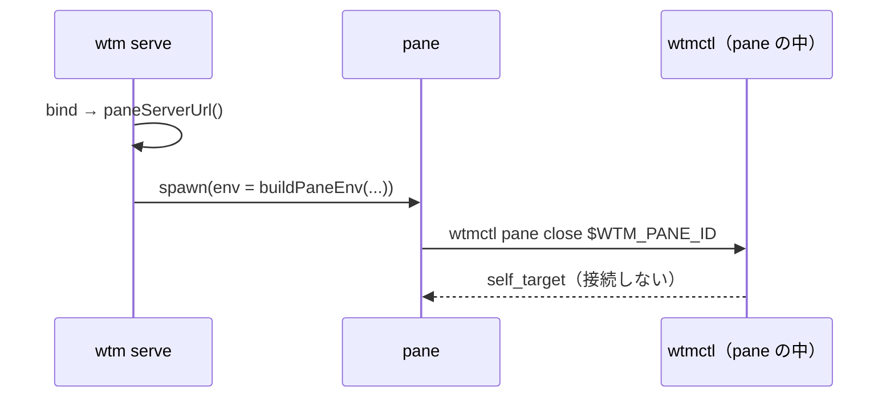

# レビューガイド: agent skill ファイル・pane の環境変数・自分の pane への操作の歯止め

## 変更概要 / 目的
pane の中のコーディングエージェントが wtmctl で隣の pane・エージェントを安全に扱えるようにする（herdr の agent skill・`HERDR_ENV` 相当。H39 の残り）。

## 重要ポイント
- サーバ（pane の環境）と CLI（接続先・歯止め）にまたがる。RPC・プロトコルは変えていない。
- `WTM_SERVER_URL` は `listen()` で待ち受けた直後・復元の前に決める（順序を誤ると起動時の pane に入らない。結合テストで検出）。
- 秘密を pane に入れない: 受け継いだ `WTMCTL_TOKEN`・`WTMCTL_URL`・古い `WTM_*` を取り除く（decisions D3）。
- 歯止めは CLI 側・安全の境界ではない。同じサーバかはループバックの名前を正規化した URL で比べる（D7）。非ループバックの名前では効かないことを docs・skill に明記（D8）。

## 処理フロー

## 主要な変更箇所
- `packages/server/src/session/paneEnv.ts` — `buildPaneEnv`
- `packages/server/src/util/net.ts` — `paneServerUrl`
- `packages/server/src/composeServer.ts` — URL を決める位置
- `packages/cli/src/cliArgs.ts` — `USAGE_LINES`・`skill`・接続先の優先順位・`caller`
- `packages/cli/src/selfGuard.ts` と 9 コマンドの呼び出し
- `packages/cli/skills/wtmctl/SKILL.md`・`packages/cli/src/skill.ts`
- `docs/wtmctl.md`・`docs/herdr-parity.md`

## リスク / 確認したい点
- 本物のエージェントに skill を入れた振る舞い・Windows・TLS は未検証（test-result.md「未検証の穴」）。
- サーバを起動した環境で `WTMCTL_URL`/`WTMCTL_TOKEN` を export していた利用者は、pane の中でそれが見えなくなる（意図した変更）。
