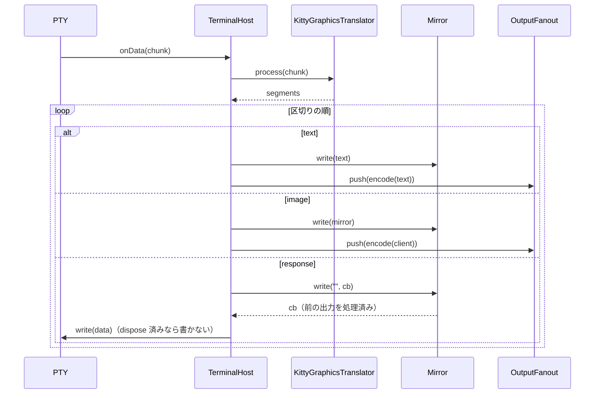

# 仕様: 端末内の画像表示（Kitty graphics。herdr H13）

## 概要

- ブラウザの xterm.js に `@xterm/addon-image` 0.9.0 を読み込み、Sixel と iTerm2 形式（OSC 1337 `File=`）の画像を描く（D2）。
- サーバの `TerminalHost` で PTY の出力を新しい `KittyGraphicsTranslator` に通す。Kitty graphics の APC `G` を取り除いて解釈し、
  - ブラウザへは、画像を**セル数を指定した iTerm2 形式**に作り直して送る（中身はサーバが作り直した PNG の base64）。
  - ミラーへは、ブラウザで画像を置いたときと同じだけのカーソル移動（改行・`CSI A`・`CSI C`）を送る。
  - 応答（`OK`・エラー）はサーバから PTY へ 1 回だけ、ミラーがそれより前の出力を処理し終えた後に返す（D1・D6）。
- ミラーが `CSI 14 t`・`CSI 16 t` に基準のセルの大きさ（9×17 px。D3）で答え、PTY の大きさを変えるときに画素の大きさも設定する（D9）。
- ブラウザの addon が出す問い合わせの応答（DA1・`XTSMGRAPHICS`・画素の大きさ）はブラウザから出さない（D4・D8）。

## 設計方針

- Kitty の解釈はサーバの 1 か所（D1）。ブラウザ側は安定版の addon を設定して読み込むだけにする。
- 画像を含まない出力は、今までと**同じ文字列**をミラーとブラウザへ渡す（区切りは変えても中身は連結すれば同じ。AC12）。
- 信頼できない出力として扱う: ファイル・共有メモリの転送は開かない、上限を超えたら捨てる、ブラウザへ埋め込むのはサーバが作った base64 と数値だけ（AC9〜AC11）。
- 退けた案（beta の xterm.js・ブラウザでの自前実装）と理由は decisions D1。

## 対象範囲

- 追加: `packages/server/src/terminal/KittyGraphics.ts`（翻訳器）・`packages/server/src/terminal/cellPixels.ts`（基準のセルの大きさ）・
  `packages/server/src/terminal/png.ts`（生の画素の PNG 化と PNG の検査）・各テスト。
- 変更: `packages/server/src/terminal/TerminalHost.ts`・`Mirror.ts`・`packages/server/src/pty/PtyBackend.ts`・`NodePtyBackend.ts`。
- 変更: `packages/web/src/term/TerminalRegistry.ts`・`QueryFilter.ts`・追加 `packages/web/src/term/imageAddon.ts`・`packages/web/package.json`・`pnpm-lock.yaml`。
- docs: `docs/herdr-parity.md` H13。backlog: `.aidev/backlog/product-roadmap.md`。

## 依拠する既存の事実

- PTY の出力は `TerminalHost` のコンストラクタの `pty.onData` で、同じ呼び出しの中で `mirror.write(chunk)` と `fanout.push(enc.encode(chunk))` に渡る
  （`packages/server/src/terminal/TerminalHost.ts` のコンストラクタ。research F8）。
- ミラーの応答は `mirror.onResponse` → `pty.write`（同上）。`Mirror.write(chunk, done)` の `done` は、それより前の書き込みをミラーが処理し終えた後に呼ばれる
  （`packages/server/src/terminal/Mirror.ts` `write`・`flush` のコメント。research F7）。空の文字列の書き込みでも `done` は呼ばれる（`Mirror.flush` が
  `term.write("", resolve)` で待ち、`OutputFanout.startBuffering` が `mirror.write("", cb)` で継ぎ目を取っている）。
- 流量制御: `Mirror.write` は書いた文字列の UTF-8 のバイト数を `pendingBytes` に足し、`TerminalHost` は各出力の後に `pendingBytes` が 1MB を超えたら PTY を止める
  （`Mirror.ts` `write`・`TerminalHost.ts` の `PAUSE_THRESHOLD_BYTES`。research F8）。
- xterm.js のハンドラは後から登録したものが先に呼ばれ、`true` で止まる（`Mirror.ts` の `CSI ? h/l` の登録のコメント。research F5）。
- ブラウザの握りつぶしは `installQueryFilter`（`packages/web/src/term/QueryFilter.ts:13`。DA1 の `CSI c` を含む。`CSI t` は含まない）、呼び出しは
  `TerminalRegistry.create` の `term.open` の直後（`packages/web/src/term/TerminalRegistry.ts:209-212`）。
- addon 0.9.0 の IIP は `inline=1`・`size` 必須で、`width`/`height` をセル数で、`preserveAspectRatio=0` を付けると画像をちょうどそのセル数の画素に拡縮し、
  置いた後はカーソルを画像の最後の行・画像の左端の列に置く（行数−1 回の `lineFeed`）（addon 0.9.0 `src/IIPHandler.ts` `_resize`・`src/ImageStorage.ts` `addImage`。research F11・F12）。
- addon 0.9.0 は `activate` で DA1（`CSI c` に `?62;4;9;22c`）と `XTSMGRAPHICS`（`CSI ? … S`）のハンドラを登録して `onData` へ応答を出す（research F5）。
  `enableSizeReports` が真だと xterm.js 本体の `windowOptions` の画素・文字数の報告を有効にし、偽なら触らない（xterm.js の既定は無効なので `CSI 14/16/18 t` に答えない）
  （research F4）。
- Kitty の応答の形・`q`・`C=1`・カーソル移動の規約は、xterm.js の作者による beta の実装を参照実装として読んだ（research F16）。
- node-pty の `resize(cols, rows, pixelSize?)`（research F13）。本製品の偽の PTY（テスト）が `resize` の第 3 引数をどう扱うかは未確認（coding で確認）。
- 配信の継ぎ目（SNAPSHOT の後に溜めた出力を流す）と stale（research F9）。SNAPSHOT に画像は含まれない（research F10）。

## インターフェース / データ構造

```ts
// packages/server/src/terminal/cellPixels.ts
export const CELL_PIXELS = { width: 9, height: 17 } as const; // D3
export function windowPixels(cols: number, rows: number): { width: number; height: number };

// packages/server/src/terminal/KittyGraphics.ts
export type TranslatedSegment =
  | { kind: "text"; text: string }                    // ミラーとブラウザの両方へ同じ文字列
  | { kind: "image"; client: string; mirror: string } // ブラウザへ client、ミラーへ mirror
  | { kind: "response"; data: string };               // PTY へ（ミラーの処理の後）
export interface KittyLimits { maxApcBytes; maxPayloadBytes; maxPixels; maxSide; maxRawBytes; maxBoxPixels; maxBoxCells; maxStoredBytes; maxStoredImages }
export const DEFAULT_KITTY_LIMITS: KittyLimits; // D5 の値（coding で maxPngBytes 1.25MiB を追加）: maxApcBytes 16MiB・maxPayloadBytes 16MiB・maxPixels 4194304・maxSide 8192・
// maxRawBytes 16MiB・maxBoxPixels 4194304・maxBoxCells 1000・maxStoredBytes 32MiB・maxStoredImages 64（全て number）
export class KittyGraphicsTranslator {
  constructor(opts?: { limits?: Partial<KittyLimits>; cell?: { width: number; height: number } });
  process(chunk: string): TranslatedSegment[];
  dispose(): void; // 途中の分割送信と保存した画像を捨てる
}

// packages/server/src/terminal/png.ts
export function isPng(bytes: Uint8Array): boolean;                         // 署名＋チャンクの並びと CRC の検査（IHDR 始まり・IEND 終わり）
export function pngSize(bytes: Uint8Array): { width: number; height: number } | null; // IHDR
export function encodePng(pixels: Uint8Array, width: number, height: number, channels: 3 | 4): Uint8Array;

// packages/server/src/pty/PtyBackend.ts
resize(cols: number, rows: number, pixels?: { width: number; height: number }): void;

// packages/web/src/term/imageAddon.ts
export const IMAGE_ADDON_OPTIONS: { enableSizeReports: false; storageLimit: 16; pixelLimit: 16777216; sixelSupport: true; sixelSizeLimit: 12000000; iipSupport: true; iipSizeLimit: 20000000 };
export function createImageAddon(): ITerminalAddon;
// TerminalRegistryOptions に createImageAddon?: () => ITerminalAddon（テストで差し替え）
```

## 振る舞いの詳細

### 1. 出力の読み分け（`KittyGraphicsTranslator.process`）

状態は `ground`・`apc`（`ESC _ G` の後。中身を溜める）・`apcEsc`（`apc` の中で `ESC` を読んだ直後）・`discard`（長すぎる APC を ST まで捨てる）・`discardEsc`。
加えて、直前の出力が `ESC` / `ESC _` で終わったかを覚える（D7）。

- `ground`: `ESC _ G` を探す。見つかるまでの文字列は `text` にする（連結すれば元のまま）。見つかったら `apc` へ（`ESC _ G` 自体は出さない）。
  `ESC _` の後が `G` でない APC はそのまま `text`（xterm.js が読み捨てる。今までと同じ）。
- 出力の末尾が `ESC` / `ESC _` で終わったら、それも `text` として流し、覚えておく。次の出力の先頭が続き（`_G` / `G`）なら、`text` の `\x18`（CAN）を出してから `apc` へ（D7）。
- `apc`: `ESC \`（ST）で終わる。途中の `ESC` の後が `\` 以外なら APC を捨てて `ground` に戻り、その `ESC` から読み直す（xterm.js の parser と同じく新しい列の始まり）。
  CAN・SUB で APC を捨てて `ground` に戻る（CAN・SUB は `text` として流す）。溜めた長さが `maxApcBytes` を超えたら `discard` へ（途中の分割送信も捨てる）。
- APC の中身 `<制御>[;<中身>]`: 制御は `,` 区切りの `key=value`（key は英字 1 文字、value は符号付きの整数か英字 1 文字）。形の誤りは無視（応答しない）。

### 2. Kitty のコマンド

`i`（id）・`I`（番号）・`q`（0/1/2）を読む（`i`・`I` の 0 は指定なし）。`i` と `I` の両方は `EINVAL`。応答は `i` か `I` があるときだけで、`q=1` は OK を、`q=2` は全てを抑止する。
応答の形は `ESC _ G i=<id>[,I=<番号>];<OK|ECODE:説明> ESC \`（配置の id `p` は扱わないので付けない）。`I` で送られた画像には、サーバが id（2^31 以上の連番）を振り、
番号から id への対応表に入れ（同じ番号は最後のものが勝つ）、`i=<振った id>,I=<番号>` で答える。`a=p`・`d=I` の `I` はこの表で id を引く。
この節で名前を挙げていないキー（`x`・`y`・`w`・`h`・`X`・`Y`・`z`・`P`・`Q`・`p` 等）は読まずに無視する（エラーにしない。表示は画像全体）。

- 分割送信: `m=1` の APC は中身（base64）を溜め、最初の APC の制御を保持する。分割送信の途中に来た APC は、制御のキーが `m`・`q` だけなら**続き**
  （`m=1` なら更に溜め、`m=0` か `m` 無しなら完了。溜めた中身をまとめて最初の制御の 1 つのコマンドとして扱う）。それ以外のキーを 1 つでも持てば**新しいコマンド**
  で、途中の分割送信は応答せずに捨てる（混ぜない）。復号後の合計が `maxPayloadBytes` を超えたら中身を捨て、完了時に `EFBIG` で答える。
- 中身の復号: base64（`Buffer.from(…, "base64")`。base64 以外の文字を含めば `EINVAL:invalid base64 data`）。`o=z` なら `inflateSync(…, { maxOutputLength: maxRawBytes })`
  （超過・失敗は `EINVAL`/`EFBIG`）。
- 転送方法 `t`: `d`（既定）だけ。`f`/`t`/`s` は**中身をパスとして解釈せず**（開かない・消さない）`EINVAL:unsupported transmission medium`。
- 形式 `f`: `100`（PNG。`isPng` が偽なら `EINVAL:invalid png`）・`24`/`32`（生の画素。`s`・`v` が必須、`s*v*(3|4)` バイト以上が要る。`encodePng` で PNG にする）。
  それ以外は `EINVAL:unsupported format`。`s`・`v` は 1 以上（0・無しは `EINVAL:width and height required for raw pixel data`）、PNG の幅・高さが 0 なら
  `EINVAL:invalid image size`（以降の割り算に 0 が来ない）。画素数が `maxPixels` を超える・1 辺が `maxSide` を超えるなら `EFBIG`。
- 動作 `a`:
  - `q`: 上の検査だけ行い（中身が空なら OK）、表示も保存もしない。
  - `t`（既定）: 画像を作り、`i`/`I` があれば保存して OK。
  - `T`: 画像を作り、保存（`i`/`I` があれば）し、表示して OK。
  - `p`: `i`/`I` の保存した画像を表示して OK（無ければ `ENOENT:image not found`）。`i`/`I` が無ければ何もしない。
  - `d`: 表示は消せない（D1）。`d=A` は保存した画像を全て、`d=I` は `i`/`I` の画像を捨てる（Kitty の「大文字は保存も捨てる」）。`d` 無し（既定の `d=a`）・
    小文字・その他の指定は何もしない。応答しない（参照実装の `_handleDelete` も応答しない。research F16）。
  - その他（`f`/`a`/`c`）: `EINVAL:unsupported action`。
  - `U=1`（Unicode placeholder）の表示: `EINVAL:unicode placeholders not supported`（`a=T` の保存はする）。
- 保存: PNG のバイト列と画素の大きさを id ごとに持つ。合計が `maxStoredBytes` か枚数が `maxStoredImages` を超えたら古いものから捨てる。同じ id は置き換える。

### 3. 表示（`image` の区切り）

画像の画素 `w`×`h`、基準のセル `cw`×`ch` から、セル数 `c`×`r` を決める（AC5）:

`c`・`r` の 0 以下は指定なしとして扱う。

| 指定 | c | r |
|---|---|---|
| `c` と `r` | `c` | `r` |
| `c` だけ | `c` | `max(1, ceil(c*cw*h / (w*ch)))` |
| `r` だけ | `max(1, ceil(r*ch*w / (h*cw)))` | `r` |
| どちらも無し | `max(1, ceil(w/cw))` | `max(1, ceil(h/ch))` |

`c`・`r` が `maxBoxCells` を超える、または `c*cw*r*ch` が `maxBoxPixels` を超えるなら表示せず `EFBIG:placement too large`。

- ブラウザへ（`client`）: `ESC ] 1337 ; File=inline=1;size=<PNG のバイト数>;width=<c>;height=<r>;preserveAspectRatio=0 : <PNG の base64> BEL`、
  続けて `C=0` なら `CSI <c> C`、`C=1` なら `r>1` のとき `CSI <r-1> A`。
- ミラーへ（`mirror`）: `"\n"` を `r-1` 個、続けて `C=0` なら `CSI <c> C`、`C=1` なら `r>1` のとき `CSI <r-1> A`。
- これで、ブラウザ（addon が `r-1` 回 `lineFeed` して x を左端の列に戻す）とミラー（`r-1` 回の LF は x を変えない）の、画像の後のカーソルが一致する（AC7）。
  `C=1` は、スクロールした場合も含めて Kitty の参照実装と同じく「元の位置（スクロールした分だけ上）」に戻る（research F16）。
- `base64` は `Buffer.toString("base64")` でサーバが作る（元の出力の文字列を埋め込まない。AC11）。

### 4. `TerminalHost` の組み込み



- 流量制御（`pendingBytes` による PTY の停止）は、区切りを全部処理した後に今までどおり判定する。`pendingBytes` はミラーへ書いた文字列（`text` と `mirror`）の
  バイト数で数える（ブラウザへの `client` の大きさは数えない。ブラウザ側の滞りは今までどおり配信の stale が扱う）。
- `dispose` で翻訳器も `dispose` する。

### 5. ミラーの画素の問い合わせ

- `CSI 14 t`（`CSI 14 ; Ps t` を含む）→ `CSI 4 ; <rows*17> ; <cols*9> t`。`CSI 16 t` → `CSI 6 ; 17 ; 9 t`。どちらも `true`（処理済み）。他の `CSI … t` は `false`（xterm.js に委ねる。今までどおり）。
- `TerminalHost.resize(cols, rows)` は `pty.resize(cols, rows, windowPixels(cols, rows))`。`NodePtyBackend.resize` はそれを node-pty に渡す。

### 6. ブラウザ

- `TerminalRegistry.create`: `term.open` の直後（今 `installQueryFilter` がある位置）で `createImageAddon()` を `loadAddon` する（例外なら画像無しで続ける）。
  `installQueryFilter(term)` は画像の addon・unicode11・search を読み込んだ後へ移す（D8。握りつぶしが addon の DA1・`XTSMGRAPHICS` のハンドラより先に呼ばれる）。
- `CSI 14 t` 等はブラウザでは握りつぶさない（`enableSizeReports: false` で xterm.js が答えない）。
- `installQueryFilter` に `CSI ? … S`（`XTSMGRAPHICS`）の握りつぶしを足す。
- addon の設定は `IMAGE_ADDON_OPTIONS`（D5）。`enableSizeReports: false`。

## ドメイン固有の考慮

- D17（応答はサーバだけ）を守る。ブラウザの addon の応答は全て握りつぶす（AC6）。Kitty の応答はサーバの翻訳器が 1 回だけ出す（AC3）。
- 再接続・stale からの回復・後から開いたブラウザでは画像は出ない（SNAPSHOT は文字だけ。RIS で addon の画像も消える。対象外）。
- 画面履歴（`historyAnsi`）はミラーの文字だけ（画像の部分は空白の行として残る）。
- Windows（ConPTY）は APC を落としうる（herdr の windows-beta も未検証と書く。research F15）。未検証として docs に書く。
- LNM（`CSI 20 h`）が有効な pane では、xterm.js の `lineFeed` が x を 0 に戻す。addon は各行の後に x を左端の列に戻し、ミラーは戻さないので、左端の列が 0 以外のとき
  ずれる（まれ。既知の制約として docs に書く）。
- プログラムが直接出した Sixel・iTerm2 形式の画像は、ミラーのカーソルが動かない（research F11。対象外。docs と backlog）。

## エラー処理 / 異常系

- 翻訳器は投げない（`TerminalHost` の `onData` で投げると出力が止まる）。内部の例外（復号・展開・PNG 化）はそのコマンドの失敗（`EINVAL`）として扱う。
- PNG の中身が壊れていて検査（署名・チャンクの CRC）をすり抜けた場合、ブラウザの addon は画像を置かず、ミラーだけカーソルが動く（既知の制約）。
- dispose の後に応答のコールバックが来たら PTY へ書かない。
- 途中の分割送信が完了しないまま残った分は、次の分割送信の始まり・`dispose` で捨てる（上限 `maxPayloadBytes` まで）。

## 受け入れ基準との対応

- AC1: 振る舞い 1〜4。入力は `TerminalHost` の `pty.onData` の出力（PNG の `a=T,f=100,t=d`、1 回と `m=1` の分割）。`KittyGraphicsTranslator` の単体テストで
  ブラウザ向けの文字列（OSC 1337・セル数）とミラー向けの改行の数を、`TerminalHost` の結合テストで両者に届く文字列を確かめる。
- AC2: 振る舞い 2（`f=24`/`f=32`・`o=z` → `encodePng`）。入力は同上。`png.ts` の単体テスト（作った PNG を検査して読み直す）と翻訳器のテスト。
- AC3: 振る舞い 2 の応答の規則と 4 の `response`。入力は `a=q` の APC。翻訳器のテスト（`i` 無し・`q=1`・`q=2`・非対応）と、`TerminalHost` のテスト
  （応答が 1 回・DA1 の応答より後に PTY へ書かれる）。
- AC4: 振る舞い 2 の `a=t`/`a=p`・保存。翻訳器のテスト。
- AC5: 振る舞い 3 の表と `C=1`。翻訳器のテスト。
- AC6: 振る舞い 6。入力は xterm.js の端末へ書いた `CSI c`・`CSI ? 1 ; 1 ; 0 S`・`CSI 14 t`。`TerminalRegistry`/`QueryFilter` のテストで、実物の addon を
  読み込んだ端末から `onData` が出ないことと、addon を読み込むことを確かめる。
- AC7: 振る舞い 3。入力は同じ PNG の画像。ミラー（実物の headless）へ `mirror` を書いたカーソルと、実物の xterm.js＋addon 0.9.0 へ `client` を書いたカーソルを比べたいが、
  addon の画像の復号（`createImageBitmap`）は jsdom/happy-dom に無い。**ミラー側はテストで確かめ、ブラウザ側は addon のコード（`ImageStorage.addImage`）の読解に依る**
  （test-result の未検証の穴に書く）。
- AC8: 振る舞い 5。ミラーのテスト（`CSI 14 t`/`16 t` の応答が 1 回）、`TerminalHost` のテスト（`resize` が画素を渡す）、`NodePtyBackend` の実物の PTY の結合テスト（`stty size` では
  画素は見えないので、node-pty に渡った引数を確かめる。可能なら実 PTY で `TIOCGWINSZ` を読む）。
- AC9: 振る舞い 2 の転送方法。翻訳器のテストで、`t=f` の中身に実在するファイルのパスを入れても、ファイルを開かず（`fs` を呼ばず）エラーで答えることを確かめる。
- AC10: 振る舞い 1（`maxApcBytes`）・2（`maxPayloadBytes`・`maxPixels`・`maxRawBytes`・保存）・3（箱）。翻訳器のテストで上限の境目の前後、ブラウザは `IMAGE_ADDON_OPTIONS` のテスト。
- AC11: 振る舞い 3 の base64。翻訳器のテストで、中身に制御文字を混ぜた不正な base64 が `EINVAL` になり、表示の文字列が `[A-Za-z0-9+/=]` と数値だけであることを確かめる。
- AC12: 振る舞い 1。翻訳器のテストで、Kitty を含まない出力（他の APC・`ESC` で割れる境目を含む）が連結すれば元と同じで、`TerminalHost` の既存のテストが通る。
- AC13: `pnpm -s build`・`pnpm -s typecheck`・`pnpm -s test`・`aidev smoke`。
- AC14: `docs/herdr-parity.md` H13 の行と、未検証・既知の制約の項。
