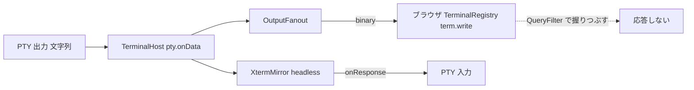

# 調査: 端末内の画像表示（Kitty graphics。herdr H13）

調べた版: `@xterm/xterm` 6.0.0・`@xterm/headless` 6.0.0（`node_modules/.pnpm`）、`@xterm/addon-image` 0.9.0 と
0.10.0-beta.301（npm registry から `npm pack` で取得して展開。`scratchpad/research/`。コミットには含めない）、
herdr v0.9.1 のドキュメントとソース（本体の作業ツリーの `scratchpad/herdr`。読むだけ）。

## 調査の問い

- Q1: ブラウザの xterm.js で画像を描く手段は何か。どの版が何（Kitty・Sixel・iTerm2）に対応し、いまの xterm.js 6.0.0 と組めるか。
- Q2: Kitty graphics（APC `G`）は、いまのブラウザ・サーバの xterm.js を通るか。
- Q3: サーバの出力の経路（ミラー・配信・流量制御・SNAPSHOT）で、画像のシーケンスはどう扱われるか。再接続で画像はどうなるか。
- Q4: 端末の問い合わせへの応答の仕組みと、画像の addon を足したときの重複の危険。
- Q5: 画像のツールが画素の大きさを知る手段（PTY の `ws_xpixel`・`CSI 14/16 t`）を用意できるか。
- Q6: herdr H13 はどう振る舞うか。上限の値は。
- Q7: Kitty graphics の応答・カーソル移動の規約（実装の参照）。

## 判明した事実

- F1（Q1）: `@xterm/addon-image` の最新の安定版は **0.9.0**（dist-tags `latest: 0.9.0`、`beta: 0.10.0-beta.301`）。0.9.0 は
  `@xterm/xterm` 6.0.0 と**同じコミット `f447274`** から同時（2025-12-22）に公開された組（0.9.0 の `package.json` の `commit`、
  `@xterm/xterm@6.0.0` の `package.json:110`、`@xterm/addon-serialize@0.14.0` の `package.json:28`）。
  0.9.0 の `src/` は `SixelHandler.ts`・`IIPHandler.ts`（iTerm2 のインライン画像。OSC 1337）で、**Kitty の実装は無い**。
- F2（Q1）: Kitty graphics の実装（`src/kitty/KittyGraphicsHandler.ts` 819 行ほか）は **0.10.0-beta** にだけあり、
  `peerDependencies: { "@xterm/xterm": "^6.1.0-beta.304" }`。登録は `terminal._core._inputHandler._parser.registerApcHandler({ final: 'G' }, …)`
  （beta の `src/ImageAddon.ts:205`）で、**xterm.js 本体の APC ハンドラの口に依存する**。
- F3（Q2）: `@xterm/xterm` 6.0.0 の `lib/xterm.js` に `registerApcHandler` は無い（`grep -c Apc` = 0）。`@xterm/headless` 6.0.0 も同じ。
  6.0.0 の parser は APC を「無視する文字列」として読み捨てる（Kitty の画像はブラウザにもミラーにも何も起こさない）。
  → **安定版だけでは、ブラウザ側で Kitty graphics を解釈できない**。
- F4（Q1）: 0.9.0 の既定値（`src/ImageAddon.ts` の `DEFAULT_OPTIONS`）: `enableSizeReports: true`・`pixelLimit: 16777216`・
  `sixelSizeLimit: 25000000`・`storageLimit: 128`（MB。端末 1 つあたり）・`iipSupport: true`・`iipSizeLimit: 20000000`。
  `activate` は `enableSizeReports` が真だと `terminal.options.windowOptions` の `getWinSizePixels`・`getCellSizePixels`・
  `getWinSizeChars` を真にする（xterm.js 本体が `CSI 14/16/18 t` に答えるようになる）。
- F5（Q4）: 0.9.0 は `activate` で `CSI c`（DA1。`?62;4;9;22c` を返す）・`CSI ? … S`（XTSMGRAPHICS）のハンドラを登録し、
  応答を `coreService.triggerDataEvent`（＝`term.onData`）へ出す（`src/ImageAddon.ts` の `_da1`・`_xtermGraphicsAttributes`・`_report`）。
  xterm.js のハンドラは**後から登録したものが先に呼ばれ、`true` を返すとそこで止まる**（`Mirror.ts:130-136` のコメントと同じ性質）。
- F6（Q4）: 本製品は、端末の問い合わせに**サーバのミラーだけが答え**、ブラウザ側は `installQueryFilter`（`packages/web/src/term/QueryFilter.ts:13`）で
  DA1・DA2・DSR・DECRQM・XTVERSION・DECRQSS・色の問い合わせを握りつぶす（D17。ブラウザの台数ぶん応答が重複するため）。
  `installQueryFilter` は `TerminalRegistry.create` で addon より**先に**呼ばれる（`packages/web/src/term/TerminalRegistry.ts:212`）。
  → 画像の addon をこの後に読み込むと、addon の DA1・XTSMGRAPHICS のハンドラが握りつぶしより先に呼ばれ、ブラウザから応答が出る。
- F7（Q4）: ミラーの応答は headless の `term.onData` を `emitResponse` で流し（`Mirror.ts:103`）、`TerminalHost` が PTY へ書く
  （`TerminalHost.ts` の `this.mirror.onResponse((data) => this.pty.write(data))`）。応答はミラーが出力を**処理した時点**で出る
  （`write` は非同期に処理され、`write(chunk, done)` の `done` はそれより前の書き込みを処理し終えた後に呼ばれる。`Mirror.flush()` のコメント・research F1 の実測）。
- F8（Q3）: PTY の出力（node-pty は文字列で渡す）は、`TerminalHost` のコンストラクタで**同じ呼び出しの中で** `mirror.write(chunk)` と
  `fanout.push(enc.encode(chunk))` に渡る（`packages/server/src/terminal/TerminalHost.ts` の `pty.onData`）。ミラーの未処理が 1MB を超えると PTY を止める
  （`PAUSE_THRESHOLD_BYTES`）。
- F9（Q3）: 配信（`packages/server/src/terminal/OutputFanout.ts`）は購読者ごとに buffering → live ⇄ stale。新しい購読者は `mirror.write("", cb)` の後に
  `mirror.serialize` の SNAPSHOT を送り、その間の出力を溜めて後に流す。送信の滞り（`bufferedAmount`）が 2MB を超えると stale にして捨て、回復したら
  SNAPSHOT からやり直す（`STALE_THRESHOLD_BYTES`）。出力のフレームは圧縮しない binary（`packages/server/src/ws/WsGateway.ts:74`）。
  ブラウザは受けた `Uint8Array` をそのまま `term.write` する（`TerminalRegistry.onOutput`）。
- F10（Q3）: SNAPSHOT は `@xterm/addon-serialize` の出力で、画像を書き出さない（`.aidev/works/20260918-web-terminal-multiplexer/research.md` R2・F8.4）。
  ブラウザは SNAPSHOT を `\x1bc`（RIS）の後に書く（`TerminalRegistry.onSnapshot`）。0.9.0 は RIS で `reset()` する（ESC c のハンドラ）ので、
  **再接続・stale からの回復で画像は消える**。画面履歴（`Mirror.historyAnsi()`）もミラーの文字だけ。
- F11（Q3）: headless のミラーは OSC 1337 と Sixel（DCS `q`）のハンドラを持たず読み捨てる。**ミラーのカーソルは動かない**。一方ブラウザの 0.9.0 は
  画像を置いた後、画像の行数−1 回 `lineFeed()` し、x を画像の左端の列に戻す（`src/ImageStorage.ts` `addImage` の 238-289 行、`sixelScrolling` 真のとき）。
  画像の行数は `ceil(画像の高さ px / ブラウザのセルの高さ px)`（同 247-248 行）で、**ブラウザのセルの大きさ（フォント）に依存する**。
- F12（Q1）: 0.9.0 の IIP（`src/IIPHandler.ts`）は `File=` の `inline=1` と `size` が必須で、`size > iipSizeLimit` は捨てる。`width`/`height` は
  `auto`・`N`（セル数）・`Npx`・`N%`。`preserveAspectRatio=0` で幅と高さの両方をセル数で指定すると、画像は**ちょうど幅×高さのセル**の画素に拡縮される
  （`_resize` の最後の分岐 `[rw, rh]`）。画像の中身は PNG・JPEG・GIF を先頭のバイトで判別（`IIPMetrics.ts`）し、`createImageBitmap` で復号する。
  URL から取りに行く経路は無い。OSC は BEL・ST のどちらで終わってもよい（xterm.js の OSC の扱い）。
- F13（Q5）: node-pty 1.2.0-beta.15 の `resize(columns, rows, pixelSize?: { width, height })` は Unix で `ws_xpixel`/`ws_ypixel` を設定する
  （Windows は無視）（`node-pty/typings/node-pty.d.ts:162-166`）。本製品の `PtyProcess.resize(cols, rows)`（`packages/server/src/pty/PtyBackend.ts:19`）は
  画素を渡しておらず、`NodePtyBackend.resize`（`packages/server/src/pty/NodePtyBackend.ts:48-50`）も渡していない。
- F14（Q5）: ブラウザの端末は xterm.js の既定のフォント（`fontSize` 15・`fontFamily` の指定なし。`packages/web/src/main.ts:129` の `terminalOptions` は空、
  `TerminalRegistry.create` もフォントを指定しない）。サーバはブラウザのセルの画素の大きさを知らない（`pane.attach_resize` は `cols`/`rows` だけ。
  `packages/protocol/src/messages.ts:92-96`）。
- F15（Q6）: herdr は pane の Kitty graphics をサーバ側の VT（libghostty-vt）で解釈し、外側の端末へ Kitty graphics で描き直す。既定で有効、
  `[terminal].kitty_graphics = false` で無効（herdr 0.9.1 `configuration.mdx`「Kitty graphics」513-526 行）。ポップアップ等に重なる配置は一時的に隠す。
  上限は画像の保存 64MiB（`KITTY_IMAGE_STORAGE_LIMIT_BYTES`）・APC 1 つ 16MiB（`APC_MAX_BYTES_KITTY`）（herdr `src/ghostty/mod.rs:196-198`）。
  Sixel の描画の実装は見当たらない（`GHOSTTY_DA_FEATURE_SIXEL` の定数だけ。`src/ghostty/bindings.rs:40`）。外部操作 API に `pane.graphics.*` がある
  （`socket-api.mdx:178-220`）。
- F16（Q7）: beta の Kitty 実装（xterm.js の作者による。参照実装として読む）の規約の扱い:
  応答は `ESC _ G i=<id>[,p=<pid>];<msg> ESC \`、`q=1` は OK を抑止、`q=2` はエラーも抑止（`_sendResponse`）。`a=q` は転送方法が `d` 以外なら
  `EINVAL:unsupported transmission medium`、中身が空なら OK、生の画素は幅と高さが要る（`_handleQuery`）。`t=f/t/s` はファイルを開かず
  `EINVAL:unsupported transmission medium`（`_handleTransmit`）。`a=p` で id が無ければ `ENOENT:image not found`（`_handlePlacement`）。
  既定（`C=0`）では**カーソルは画像の最後の行の、画像の右隣の列**へ動き、`C=1` なら元の位置に戻る（`_decodeAndDisplay` 667-680 行）。
  `c`/`r` の指定があれば画像をその数のセルに拡縮する。
- F17（Q4）: ミラーは `CSI t`（画素の大きさ）に答えていない（`Mirror.ts` の登録は OSC 4/7/9/10/11/12・`CSI ? n/h/l`・`ESC c` だけ。headless 自体も
  描画が無いので画素を持たない）。
- F18（Q2）: 本製品の PTY 出力は node-pty の UTF-8 文字列（`PtyProcess.onData(cb: (chunk: string) => void)`）。Kitty の APC の中身は ASCII（制御部の
  `key=value` と base64）。1 つの APC が node-pty の読み取りの境目で割れて届きうる。

## 影響範囲

- サーバ: `packages/server/src/terminal/TerminalHost.ts`（出力の分岐点）・`Mirror.ts`（画素の問い合わせ）・`pty/PtyBackend.ts`・`pty/NodePtyBackend.ts`（画素の大きさ）。
- ブラウザ: `packages/web/src/term/TerminalRegistry.ts`（addon の読み込み順）・`QueryFilter.ts`（XTSMGRAPHICS の握りつぶし）・`packages/web/package.json`（依存）。
- docs: `docs/herdr-parity.md` H13。

## 実現性 / リスク

- 案 A（ブラウザで Kitty を解釈）: 0.10.0-beta と `@xterm/xterm` 6.1.0-beta への更新が要る（F2・F3）。xterm.js 本体・headless・serialize・webgl・search・
  unicode11・web-links を beta にそろえる大きな判断で、自律では安全に決められない。応答もブラウザから出るので D17 の握りつぶしと衝突する。
- 案 B（Kitty を自前でブラウザに実装）: 6.0.0 は APC を捨てるので、ブラウザでも `term.write` の手前で出力を読み分ける必要があり、配置・スクロール・消去を
  自前で持つことになる（beta の実装で 1,100 行超）。応答はやはりブラウザから出る。
- 案 C（サーバで Kitty を解釈し、ブラウザには 0.9.0 が描ける iTerm2 形式で送る）: 0.9.0 は安定版で 6.0.0 と組（F1）。応答はサーバだけから出せる（D17 と一致）。
  ファイル転送の拒否・上限・zlib の展開・生の画素の PNG 化を Node（`node:zlib`）で行える。F12 の「幅と高さをセル数で指定すると、ちょうどその数のセル」を使えば、
  画像の行数をサーバが決められ、ミラーのカーソルも同じだけ動かせる（F11 のずれを Kitty については解消できる）。**削除・アニメーション・Unicode placeholder は
  iTerm2 形式で表せない**ので対象外になる。
- 共通のリスク: 画像の描画そのもの（canvas・WebGL との重ね）は jsdom/happy-dom では確かめられず、実物のブラウザでの確認は E2E を走らせない指示のため
  この work ではできない（test-result に未検証の穴として残す）。

## 実装アンカー

- A1: PTY の出力の分岐点（`packages/server/src/terminal/TerminalHost.ts` のコンストラクタ `pty.onData`）— `mirror.write(chunk)` と `fanout.push(enc.encode(chunk))`。
- A2: ミラーの問い合わせのハンドラの登録（`packages/server/src/terminal/Mirror.ts` `XtermMirror` のコンストラクタ 102-148 行）。
- A3: PTY の大きさの変更（`packages/server/src/terminal/TerminalHost.ts` `resize`、`packages/server/src/pty/PtyBackend.ts:19` `PtyProcess.resize`、
  `packages/server/src/pty/NodePtyBackend.ts:48` `resize`）。
- A4: ブラウザの端末の生成（`packages/web/src/term/TerminalRegistry.ts:201-218` `create`）— `installQueryFilter` の後に unicode11・search を読み込む。
- A5: 握りつぶし（`packages/web/src/term/QueryFilter.ts:13` `installQueryFilter`）。テストは `QueryFilter.test.ts`。
- A6: PTY の偽物（テスト）: `packages/server/src/terminal/TerminalHost.test.ts` で使う偽の `PtyProcess`（未特定 — coding で `resize` の呼び出しの扱いを確認）。

## 実装時の注意

- xterm.js のハンドラは LIFO。**握りつぶしは画像の addon を読み込んだ後に登録する**（F5・F6）。
- 0.9.0 の `enableSizeReports` の既定は真（F4）。偽にしないとブラウザが `CSI 14/16/18 t` に答える。
- ミラーのハンドラで投げると書き込みの列が止まる（`Mirror.ts:88` のコメント）。問い合わせのハンドラは投げない。
- ミラーの `CSI ? … h/l` のハンドラは束ねたモードを殺さないよう常に `false` を返している（`Mirror.ts:130-136`）。`CSI t` も対象外の Ps は `false` で委譲する。
- ミラーへ書く文字列の長さは流量制御（`pendingBytes`）の数え方に効く（F8）。
- `@xterm/headless`・`@xterm/addon-serialize` は CJS で default から取り出す（`Mirror.ts:1-4`）。0.9.0 の addon はブラウザ側だけで使うので関係しない。

## design への申し送り

- 案 C を推す（安定版だけ・応答はサーバだけ・カーソルの一致をサーバで保証できる）。案 A は xterm.js 6.1 の安定版が出たら見直す（backlog）。
- 決めること: iTerm2 形式への変換の形（ヘッダ・大きさの決め方）、基準のセルの大きさ、ミラーへ書く代わりの文字列、応答の順序の保ち方、
  分割の境目（`ESC` だけで割れたとき）の扱い、上限の値、ブラウザの addon の設定値、DA1 を変えるかどうか。
- Sixel・iTerm2 をプログラムが直接出した場合のミラーのずれ（F11）は残る。docs と backlog に残す。
