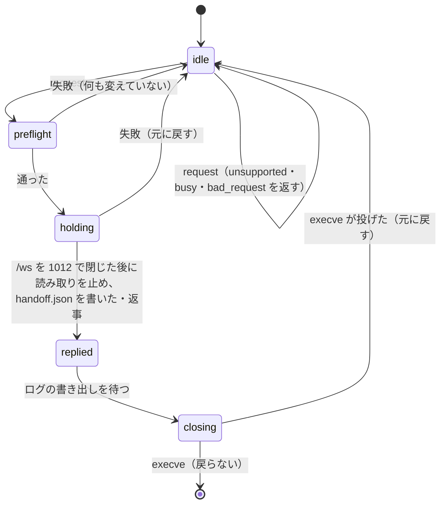

# 仕様: 更新時の引き継ぎ（live handoff）

## 概要

`wtm handoff` が状態ディレクトリの `handoff.sock` でサーバに指示し、サーバは新しい版を確かめてから（preflight）、各 pane の読み取りを止めて
画面を取り、受け渡しの中身（`handoff.json`）を書き、`process.execve` で**同じプロセスのまま**ディスク上の wtm に入れ替わる。PTY の master の fd は
execve をまたいで開いたまま残り、新しい版は起動時に `handoff.json` を読んで、`session.json` の復元の中で新しいシェルの代わりにその fd を使う。
方式の選択と理由は decisions D2（D3〜D9 も参照）。

## 設計方針

- 引き継ぎの経路は、指示されない限り既存の起動・停止・復元に入らない。普通の起動で足すのは「残っていた `handoff.json` を消す」ことと、
  Linux/macOS での受け口 `handoff.sock` の待ち受け（D8。0600 のローカル socket で、指示が来るまで何もしない）の 2 つだけ。
- execve の前（戻れる区間）に、失敗しうることを全部済ませる: preflight（D5）→ poller の停止 → 読み取りの停止とミラーの待ち → pane ごとの fd の取り出し →
  `session.json` の保存 → `handoff.json` の書き込み。どれかが失敗したら元に戻す（下の「元に戻す」）。
- `/ws` は preflight の直後（読み取りを止める前）に閉じる（1012）——止めてから execve までの間に pane が増減しないように（cross の点検）。
- 戻れない区間（execve）に入る直前に行うのは、CLI への返事・ログの書き出しを待つ（`FileLogger.flush()` を足す）だけ。
- 新しい版は、渡された fd を PTY の master だと確かめてから使い（Linux は `/proc/self/fd/<fd>` が `/dev/ptmx`。macOS は下の `isPtyMaster` の注）、使わなかった fd は閉じて
  そのプロセスに SIGHUP を送る（見えないまま残さない）。
- 引き継いだ PTY は `PtyProcess` の新しい実装（`AdoptedPtyProcess`）で扱い、`TerminalHost` 以降は今までと同じ経路を通る。

## 対象範囲

- 追加: `packages/server/src/handoff/HandoffManifest.ts`（受け渡しの中身の型・書き込み・読み取りと検査・残りの削除）
- 追加: `packages/server/src/handoff/HandoffController.ts`（古い版の側: 指示を受けて確認・停止・書き込み・execve、失敗なら元に戻す。`status` の答え）
- 追加: `packages/server/src/handoff/HandoffSocket.ts`（`handoff.sock` の受け口）
- 追加: `packages/server/src/handoff/preflight.ts`（`__handoff-preflight` の 1 段目・2 段目と、親の側の起動と判定）
- 追加: `packages/server/src/handoff/handoffCommand.ts`（`wtm handoff` の CLI の処理）
- 追加: `packages/server/src/pty/AdoptedPtyProcess.ts`（引き継いだ PTY の `PtyProcess`）
- 追加: `packages/server/src/pty/socketReading.ts`（handle の段で読み取りを止める・再開する）・`packages/server/src/pty/nodePtyNative.ts`（node-pty のネイティブの `resize`）
- 追加: `packages/server/src/handoff/startup.ts`（新しい版の起動での後始末）
- 変更: `pty/PtyBackend.ts`（`PtyProcess.handoffFd?()`・`PtyBackend.adopt?()`）・`pty/NodePtyBackend.ts`
- 変更: `terminal/TerminalHost.ts`（読み取りの停止と再開・fd と大きさの取り出し）・`terminal/TerminalManager.ts`（`adopt`）
- 変更: `session/SessionService.ts`（復元で引き継いだ端末を使う・スクロールバックのエディタの対応の受け渡し）
- 変更: `composeServer.ts`（受け口の起動・引き継ぎの受け取り・結果の保持）・`main.ts`・`cliArgs.ts`
- 変更: `log/Logger.ts`（`FileLogger.flush()`: それまでのファイルへの書き込みを待つ）
- docs: `docs/` の利用者向けの説明（起動オプションの説明がある `docs/tls-setup.md`・`docs/verification.md`）・`docs/herdr-parity.md` H32

## 依拠する既存の事実

- execve の後も close-on-exec の無い fd は残り、pid は同じ・libuv の socket は閉じて同じポートに待ち受け直せる（research F2.2・F2.4。`[P]` の実測）。
- node-pty の master の fd に close-on-exec が付かず、`UnixTerminal.fd` で読める（research F2.3。`node-pty/src/unix/pty.cc:132-146,439-495`・`lib/unixTerminal.js:160-164`）。
- node-pty のネイティブの `resize(fd, cols, rows, pw, ph)` を `lib/utils.js` の `loadNativeModule('pty')` で呼べる（research F3.3）。
- `tty.ReadStream(fd)` で master を読め、終了で `end`/`close`/`error(EIO)` が来る（research F3.1・F3.4）。
- `StateDirLock` は同じ pid の残ったロックを取り直す（research F4.4。`persist/StateDirLock.ts` の `isInUse`）。
- 復元の経路 `restore` → `restorePaneProcess` → `spawnForPane`（`seed` でミラーへ先に書く）・`wireExit`・`maybeResumeAgentSession`（research F5.2。`session/SessionService.ts:1085-1223`）。
- 停止の順（`persist.flush` → 画面履歴 → 端末の破棄 → WebSocket の終了 → ロック）（research F5.3。`composeServer.ts` の `close`）。
- 端末の流量制御が `pty.pause()`/`resume()` を使い、`mirror.onDrained` で再開する（research A4。`terminal/TerminalHost.ts:80-100`）。
- ミラーの `historyAnsi()`・`flush()`（research F5.5。`terminal/Mirror.ts:173-229`）、安全化 `sanitizeHistoryAnsi`（`terminal/historyAnsi.ts`）。
- ブラウザは 4401 以外の終了コードで繋ぎ直す（research F5.6。`packages/web/src/net/Connection.ts:335-362`）。
- スクロールバックのエディタの対応は `SessionService` のメモリの `scrollbackEditors`（research F5.7。`SessionService.ts:142,449-458,658-707`）。
- 名前付き session の状態ディレクトリの解決と `WTM_SESSION` の適用（research F5.8。`sessionCommands.ts:81`・`cliArgs.ts` の `applySessionEnv`）。
- ローカル socket の手本（0600・残ったファイルの消し直し）とパスの長さの検査（research F5.9。`agent/AgentReportSocket.ts`・`config.ts:157-166`）。
- `writeFileAtomic` は 0700 の一時ディレクトリに書いて 0600 にしてから rename する（`persist/atomicFile.ts:9-23`）。
- `StateDirLock.inspect()` は読み取り専用で、持ち主が使用中ならその pid（別のホストならホスト名も）を返す（`persist/StateDirLock.ts` の `inspect`）。
- 指定の誤りは `ConfigError` で投げ、`main.ts` が終了コード 2 にする（`config.ts` の `ConfigError`・`main.ts` の `main` の catch）。
- `listen()` の最初の段がロックの取得（research F5.1。`composeServer.ts` の `listen` の「0.」）。
- `FileLogger` のファイルへの書き込みは fire-and-forget で、書き終わりを待つ口が無い（`log/Logger.ts` の `FileLogger.emit`）。
- 注: `[P]` は research.md の冒頭で定義した本 work の実測（`scratchpad/probe/`）。
- pane の環境は `buildPaneEnv(process.env, …)` で作る（`session/paneEnv.ts`・`SessionService.envForPane`）ので、`process.env` から消した変数は pane に渡らない。

## インターフェース / データ構造

### 受け渡しの中身 `handoff.json`（状態ディレクトリ・0600）

```ts
export const HANDOFF_FORMAT_VERSION = 1;
export const HANDOFF_FILE_NAME = "handoff.json";
export const HANDOFF_NONCE_ENV = "WTM_HANDOFF_NONCE";
export const HANDOFF_MAX_AGE_MS = 60_000;

export interface HandoffPane {
  paneId: string;
  fd: number;      // PTY の master（>= 3 の整数）
  pid: number;     // pane のプロセス（シェル）
  cols: number; rows: number;
  screen: string;  // ミラーの historyAnsi()（空なら ""）
}
export interface HandoffScrollbackEditor { paneId: string; sourcePaneId: string; previousZoomedPaneId: string | null; dir: string }
export interface HandoffManifest {
  format: 1;
  id: string;          // 要求の id（CLI の status の突き合わせ。ランダムの 16 進 16 文字）
  nonce: string;       // 環境変数で渡す 16 進 32 文字（この execve が書いたものかの確認）
  pid: number;         // 書いたプロセス（= execve の後の自分）
  createdAt: string;   // ISO
  port: number;        // 待ち受けていたポート
  panes: HandoffPane[];
  scrollbackEditors: HandoffScrollbackEditor[];
}
```

- `writeHandoffManifest(stateDir, m)`（`writeFileAtomic`）・`removeHandoffManifest(stateDir)`（無ければ何もしない）
- `parseHandoffManifest(raw): HandoffManifest | undefined`（形が合わなければ undefined。fd は整数 3〜65535・pid は正の整数・cols/rows は 1〜1000）
- `takeHandoff(stateDir, env, deps): Promise<TakenHandoff | undefined>`:
  1. `env[WTM_HANDOFF_NONCE]` を読み、**あってもなくても `env` から消す**。
  2. `handoff.json` を読み、**読めても読めなくても消す**。
  3. nonce が無い → `{ kind: "none" }`（ファイルがあったら「残っていた handoff.json を消した」と info）。
  4. nonce はあるが、ファイルが無い・読めない・形が合わない → `{ kind: "broken", reason }`。どの fd がどの pane かが分からないので、呼び出し側は
     `closeOrphanPtyMasters()`（Linux: `/proc/self/fd` の 3 以上で `/dev/ptmx` を指す fd をすべて閉じる——この時点では自分で開いた PTY はまだ無い。
     閉じると各シェルに hangup が届く。macOS: 列挙できないので何もしない＝既知の制約）を呼び、普通の起動を続ける。
  5. `nonce` が違う・`pid !== process.pid`・`createdAt` から `HANDOFF_MAX_AGE_MS` を過ぎた → `{ kind: "taken", …, panes: [], rejected: 全 pane }`（形は読めているので fd は分かる）。
  6. それ以外は各 pane の fd を `isPtyMaster(fd)` で確かめ、通らないものは `rejected` へ。
  - 戻り値 `TakenHandoff = { kind: "none" } | { kind: "broken"; reason: string } | { kind: "taken"; id; port; panes: HandoffPane[]; rejected: HandoffPane[]; scrollbackEditors }`。
- `isPtyMaster(fd, platform)`: Linux は `readlinkSync('/proc/self/fd/<fd>') === '/dev/ptmx'`。それ以外は `fstatSync(fd).isCharacterDevice() && tty.isatty(fd)`
  ——**macOS では master と slave を見分けられない**（`/proc` が無い）。nonce と pid の一致（この execve が書いた受け渡しであること）と合わせた弱い確認で、
  AC8 の「PTY の端末であると確かめる」は満たすが「master であること」までは確かめない（未検証として docs に書く）。

### `PtyProcess` / `PtyBackend` の追加（`pty/PtyBackend.ts`）

```ts
interface PtyProcess { …; /** 引き継ぎで渡す master の fd（渡せない実装・Windows は undefined）。 */ handoffFd?(): number | undefined }
interface PtyBackend { …; /** 引き継いだ master の fd から作る（Unix だけ）。 */ adopt?(opts: { fd: number; pid: number }): PtyProcess }
```

### `AdoptedPtyProcess`（`pty/AdoptedPtyProcess.ts`）

- `constructor(fd, pid, deps = { resize: nodePtyNativeResize, readExitStatus: readProcExitStatus, kill: process.kill })`
- 読み取り: `tty.ReadStream(fd)`・`setEncoding("utf8")`。`pause`/`resume` はこの stream。
- 書き込み: 待ち行列＋`fs.write`。`EAGAIN` は 5ms 後に同じ残りを書き直す。その他の失敗は待ち行列を捨てる（node-pty と同じ）。
- `resize(cols, rows)`: `deps.resize(fd, max(1,cols), max(1,rows))`。失敗は投げない（終わった端末）。
- 終了: stream の `close`（`end`・`error` の後に来る）で 1 度だけ `onExit({ exitCode, signal })`。`readExitStatus(pid)` が waitpid の形の値を返せば、
  下位 7 ビットが 0 なら `exitCode = status >> 8`、そうでなければ `signal = status & 0x7f`・`exitCode = 0`。読めなければ `exitCode = 0`。
- `kill()`: stream を壊して fd を閉じ、`kill(pid, "SIGHUP")`（失敗は無視）。
- `handoffFd()`: 閉じていなければ `fd`（引き継いだ pane をもう一度引き継げる）。
- `readProcExitStatus(pid)`: Linux だけ。`/proc/<pid>/stat` の最後の `)` の後ろを空白で割り、状態が `Z` なら 50 番目（0 始まりで 49）の値。それ以外は undefined。

### `TerminalHost`（`terminal/TerminalHost.ts`）

- `DefaultTerminalHost` に `cols`/`rows` の記録（コンストラクタと `resize` で更新）を足し、次を足す（`TerminalHost` の interface では任意のメソッド）:
  - `holdForHandoff(): Promise<{ fd: number; cols: number; rows: number; screen: string } | undefined>` — `handoffFd()` か `holdReading()` が無ければ undefined。
    「止めている」印を立て（流量制御の再開 `onDrained` で読み取りを再開しない）、`pty.holdReading()`（下記。libuv の handle の段で読み取りを止め、読み取り済みの分を
    `onData` へ流し切る）、`await mirror.flush()` の後に `mirror.historyAnsi()`。待つ間に捨てられたら undefined。
  - `releaseHandoffHold(): void` — 印を下ろして `pty.releaseReading()`、流量制御で止めていなければ `pty.resume()`。
  - `nudgeRedraw(): void` — `rows > 2` なら `pty.resize(cols, rows - 1)`、**100ms 後に** `pty.resize(cols, rows)`（同じ瞬間だと SIGWINCH が畳まれて描き直さないことがある。
    その間に大きさが変わったら戻さない）。そうでなければ cols で同じことをする（ミラーは変えない）。
  - `PtyProcess.holdReading?(): boolean`・`releaseReading?(): void`（`pty/socketReading.ts`）: `Readable.pause()` だけでは handle が読み続けて JS の buffer に溜まり、execve で失われる。
    buffer を `read()` で流し切ってから `_handle.readStop()`（Node の内部）。内部の形が違う版では false を返し、引き継ぎを断る（decisions D14）。

### `TerminalManager.adopt`（`terminal/TerminalManager.ts`）

- `adopt(paneId, { fd, pid, cols, rows }): TerminalHost` — `ptyBackend.adopt` で `PtyProcess` を作り、`create` と同じく `DefaultTerminalHost` と終了の後始末を配線する。
  `ptyBackend.adopt` が無ければ投げる。

### `SessionService`

- `restore(data, opts: { paneHistory?; adopted?: ReadonlyMap<PaneId, AdoptedPaneSpec> })`（`AdoptedPaneSpec = { fd, pid, cols, rows, screen }`）。
  `restorePaneProcess` は、その pane の `adopted` があれば `adoptForPane` を使う:
  `terminals.adopt(...)` → **同じ同期区間で** `screen` を `sanitizeHistoryAnsi` してミラーへ書く（PTY の出力は非同期のイベントで届くので、
  画面が必ず先に並ぶ。`spawnForPane` の `seed` と同じ理由——`SessionService.ts:1100-1102` のコメント）→ `wireExit` → `nudgeRedraw()`。会話の再開・画面履歴は流さない。
  使った pane の id を `restore` の戻り値 `{ adoptedPaneIds: Set<PaneId> }` で返す。`adopt` が投げたら（fd が使えない）その pane は普通に新しいシェルを起動する。
- `handoffScrollbackEditors(): HandoffScrollbackEditor[]`・`adoptScrollbackEditors(entries, adoptedPaneIds)`（引き継いだ pane のものだけ登録し、それ以外は一時ディレクトリを消す）。

### `HandoffController`（古い版の側。`handoff/HandoffController.ts`）

```ts
type HandoffReply =
  | { ok: true; id: string; panes: number }
  | { ok: false; reason: "unsupported" | "busy" | "preflight_failed" | "pane_unavailable" | "prepare_failed" | "exec_failed" | "bad_request"; message: string };
class HandoffController {
  constructor(deps: {
    stateDir; logger; session; terminals; boundPort(): number;
    pausePollers(): Promise<void>; resumePollers(): void; flushSession(): Promise<void>;
    closeClients(): void; reopenClients(): void; flushLog(): Promise<void>;
    preflight(): Promise<{ ok: true } | { ok: false; message: string }>;
    execve(nonce: string): never;  // 既定は process.execve(process.execPath, [execPath, ...execArgv, ...argv.slice(1)], { ...process.env, WTM_HANDOFF_NONCE: nonce })
    platform: NodeJS.Platform; hasExecve: boolean;
  });
  request(sendReply: (r: HandoffReply) => Promise<void>): Promise<void>;
  status(): { lastHandoff: { id: string; adopted: number; dropped: number; at: string } | null };
  recordTaken(result): void; // 新しい版の起動時に呼ぶ
}
```

### `handoff.sock`（`handoff/HandoffSocket.ts`）

- 状態ディレクトリの `handoff.sock`。Windows では作らない。待ち受け後に 0600。残ったファイルは `EADDRINUSE` で消して待ち受け直す（report socket と同じ）。
- 1 接続 1 行（上限 4096 バイト）: `{"op":"handoff"}` → `HandoffReply` を 1 行返す／`{"op":"status"}` → `status()` を 1 行返す／それ以外 → `{"ok":false,"reason":"bad_request","message":…}`。

### CLI（`wtm handoff [--state-dir DIR] [--session NAME]`）

- `cliArgs.ts`: コマンド `handoff`（`--json` は無い。`serve` 専用の指定は誤り）。`applySessionEnv` の対象に `handoff` を足す。
- 隠しコマンド `__handoff-preflight [--stage 2 --probe <dev:ino>]`（ヘルプに出さない）。
- 終了コード: 0 成功（全 pane を引き継いだ）／1 失敗（拒否・preflight の失敗・時間切れ・一部の pane を引き継げなかった・別のホストで動いている・受け口に繋げない）／
  2 指定の誤り・非対応（CLI が Windows で動いている、またはサーバが `unsupported` を返した。`ConfigError`）／3 サーバが動いていない。

## 振る舞いの詳細

### `wtm handoff`

1. Windows → 「非対応」を表示して終了コード 2。
2. 状態ディレクトリ = `resolveSessionStateDir(base, session)`。名前付き session が無ければ `wtm token reset` と同じ案内で 2。
3. `new StateDirLock(dir).inspect()` が undefined → 「動いていない」で 3（何も作らない）。別のホスト → 1。
4. `handoff.sock` に繋ぐ。`ENOENT`/`ECONNREFUSED` → 「引き継ぎに対応していない版か、起動の途中」で 1。
5. `{"op":"handoff"}` を送り、返事を待つ（preflight を含め 60 秒で打ち切り）。`ok: false` → 理由を表示して 1（`unsupported` だけは 2）。
6. `ok: true` → 「pid P の N 個の pane を引き継ぎます」を表示し、200ms ごとに繋ぎ直して `{"op":"status"}`。`lastHandoff.id` が一致したら結果を表示
   （`dropped > 0` なら 1、そうでなければ 0）。60 秒で来なければ「server.log を確かめて」で 1。

### サーバ（古い版）の `request`

1. `platform === "win32"` か `process.execve` が無い → `unsupported`。実行中 → `busy`。
2. preflight（D5。20 秒）。失敗 → `preflight_failed`（理由つき）。**ここまでは何も変えていない**。失敗の判定と理由:
   子が 20 秒で終わらない（「時間切れ」）／子が 0 以外で終わる・標準出力に JSON の行が無い（「新しい版を読み込めない、または引き継ぎに対応していない」
   ——`__handoff-preflight` を知らない古い版は `unknown command` で終了コード 2）／`ok: false`（「この Node では execve で PTY が残らない」）／
   `format` が `HANDOFF_FORMAT_VERSION` と違う（「引き継ぎの形式の版が違う（新しい版 N・このサーバ M）」）。
3. `/ws` を閉じる（1012 "server restarting"。受け付けも止める）。poller（git・エージェントの判定・画面履歴の定期保存）を止める。
4. 全 pane（`session.snapshot().panes`）について `terminals.get(id)?.holdForHandoff()`。端末の無い pane（起動に失敗した pane）は飛ばす
   （新しい版では普通の復元になる）。端末があるのに fd を渡せない → `pane_unavailable`（元に戻す）。
5. `session.json` を保存（`persist.flush()`）。`handoff.json` を書く。失敗 → `prepare_failed`（元に戻す）。
6. CLI に `ok: true` を返し、書き終えるのを待つ（返せなくても続ける——CLI は status で確かめる）。
7. `flushLog()` を待つ。
8. `execve(nonce)`。**投げたら**（戻ってきたら）`handoff.json` を消し、`/ws` の受け付け・読み取り・poller を戻して `exec_failed` をログに残す
   （返事は既に送ってあるので、CLI は時間切れで 1）。

元に戻す: `releaseHandoffHold()`（全 pane）→ poller の再開 → `handoff.json` を消す → （閉じていれば）`reopenClients()` で `/ws` の受け付けを戻す → 実行中の印を下ろす。

### サーバ（新しい版）の起動

`listen()` の「ロック」の直後に `takeHandoff`。

- 引き継ぎでない起動（`none`）: 残っていた `handoff.json` を消すだけ（AC8）。以降は今までどおり。
- 受け渡しが壊れていた（`broken`）: `closeOrphanPtyMasters()` の後、普通の起動（error をログ）。`status` の `lastHandoff` は `id` が分からないので記録しない（CLI は時間切れ）。
- 引き継ぎの起動:
  - PTY を開く前に、確かめに通らなかった fd（PTY の master のものだけ）と、受け渡しに載らない PTY の master（Linux。`closeOrphanPtyMasters({ keep: 受け渡しの fd })`。
    読み取りを止めた後に作られた pane 等）を閉じる（cross の点検・review ラウンド 1）。
  - 待ち受けのポートは起動の指定のまま（同じ引数で起動し直すので `taken.port` と一致する。違えば warn。decisions D12）。確かめに通らなかった pane の fd は、
    自分で PTY を開く前に、PTY の master のものだけ閉じる（番号が再利用されているかもしれないのでシグナルは送らない）。
  - `session.json` を読めた → `session.restore(data, { paneHistory, adopted })`。`adoptedPaneIds` に入らなかった pane の fd（と `rejected`）は、
    `closeSync(fd)` して `kill(pid, "SIGHUP")`（見えないプロセスを残さない）。`session.json` を読めない → 全部をそう扱い、今までどおり新しく始める（error をログ）。
  - `adoptScrollbackEditors`。
  - 結果（`id`・`adopted`・`dropped = rejected + 使わなかった数`・時刻）を `HandoffController.recordTaken` に入れ、info をログ。
  - `main.ts` は起動の表示の後に「wtm: handoff complete: N panes kept」（dropped があれば warn の行）を出す。

### 状態遷移（古い版の `HandoffController`）



## ドメイン固有の考慮

- 秘密: `handoff.json` は画面の内容を含む（D7）。0600・0700 の一時ディレクトリ経由の rename（`writeFileAtomic`）・新しい版が読んだらすぐ消す・
  普通の起動は消す・元に戻すときも消す。`WTM_HANDOFF_NONCE` は新しい版が最初に `process.env` から消す（pane に渡らない）。
- 同じ利用者に限る: 指示は 0600 の socket（D3）。fd はプロセスの外へ出ない（D2・research F7.1）。新しい TCP の待ち受けは作らない（HTTP は同じポートに待ち受け直すだけ）。
- Windows: 受け口を作らない・CLI は非対応を答える・`PtyBackend.adopt` は Unix だけ。
- 起動した端末・systemd から見て pid が変わらない（D2）。

## エラー処理 / 異常系

- preflight の子が 20 秒で終わらない → kill して `preflight_failed`。
- preflight の 2 段目が `dev:ino` の不一致を答える → `preflight_failed`（「この Node では execve で fd が残らない」）。
- `handoff.json` の書き込みの失敗・`session.json` の保存の失敗 → `prepare_failed`（元に戻す）。
- 新しい版で fd が PTY でない・pid が違う・古い → 使わず、閉じて SIGHUP（その pane は新しいシェルで復元）、`dropped` に数える。
- 新しい版の起動の後段の失敗（待ち受けの失敗等）→ 今までどおり終了する（pane の fd はプロセスの終了で閉じ、シェルは SIGHUP で終わる）。
  `session.json` は保存済みなので、次の普通の起動でレイアウトは戻る（D2 の破綻 A-2）。
- 引き継いだ pane が終わる → `AdoptedPtyProcess` の `close` → 今までの `wireExit`（pane を閉じる）。

## 受け入れ基準との対応

- AC1: `wtm handoff` → `HandoffController.request` → execve → 新しい版の `takeHandoff`・`restore(adopted)`。pane のプロセスの pid は `AdoptedPtyProcess.pid`＝manifest の `HandoffPane.pid`（古い版の `TerminalHost.pid`）、
  pane の id・レイアウト・フォーカスは execve の前に保存した `session.json` から（入力の出所: 古い版の `session.snapshot()` と端末）。CLI は `status` の `adopted` を表示。
- AC2: `AdoptedPtyProcess` の読み書き・`resize`（node-pty のネイティブ）。`TerminalHost` 以降は既存の経路。
- AC3: `holdForHandoff` の `screen`（ミラーの `historyAnsi()`）→ manifest → 新しい版のミラーへ先に書く。
- AC4: preflight（D5）の失敗は何も変えずに `preflight_failed`。CLI は 1。
- AC5: 同じ引数で起動し直すので同じポートで待ち受け直す（decisions D12）。Cookie は `auth.json` から（既存）。ブラウザは 1012 で繋ぎ直す（research F5.6）。
- AC6: `handoff.sock` 0600・Windows では作らない。CLI は Windows で 2。TCP の待ち受けは増やさない。
- AC7: `AdoptedPtyProcess` の `close` → `onExit` → `wireExit`。
- AC8: `writeFileAtomic`（0600）・`takeHandoff` が必ず消す・nonce の無い起動は消すだけ・`isPtyMaster` で確かめる。
- AC9: `restorePaneProcess` の引き継ぎの分岐は `maybeResumeAgentSession` も `seed` の画面履歴も使わない。
- AC10: CLI が `resolveSessionStateDir` と `applySessionEnv` で状態ディレクトリを決め、その `handoff.sock` に繋ぐ。`--state-dir` も同じ。
- AC11: docs（利用者向け・`docs/herdr-parity.md` H32）。
- AC12: `StateDirLock.inspect()` が undefined なら 3。socket もファイルも作らない。
- AC13: 普通の起動の差は `takeHandoff`（ファイルの有無を見る）と `handoff.sock` の待ち受け（指示が来るまで何もしない）だけ。既存のテスト一式と smoke を通す。
- AC14: `handoffScrollbackEditors` を manifest に入れ、新しい版の `adoptScrollbackEditors` で登録し直す（閉じたときの後始末は既存の経路）。
