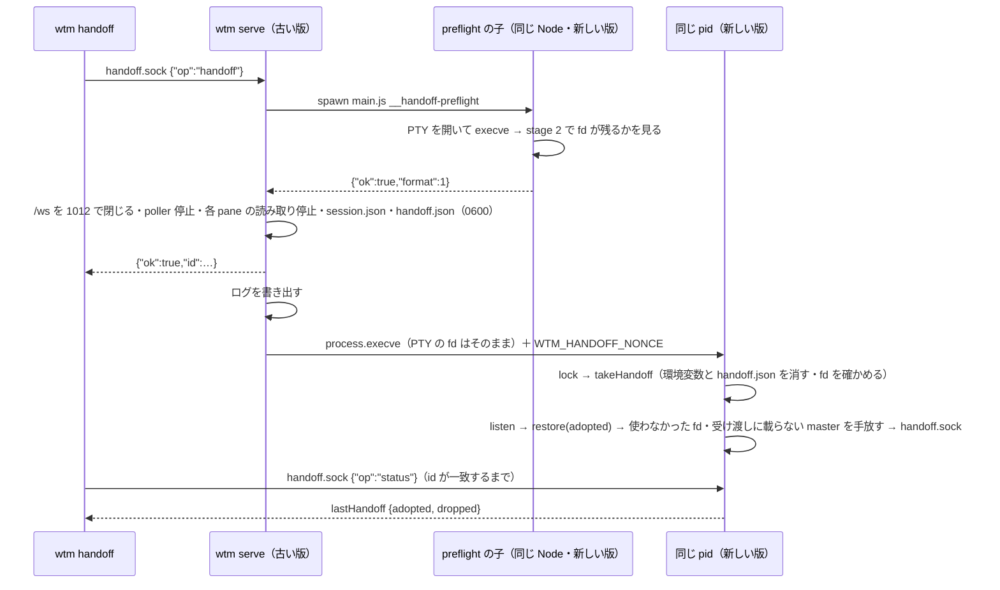

# レビューガイド: 更新時の引き継ぎ（live handoff。`wtm handoff`）

## 変更概要 / 目的

動いている `wtm serve` を、pane のプロセス（シェル・エージェント・ビルド）を止めずにディスク上の新しい版へ入れ替える（herdr H32 の残り）。
Linux で実機確認・macOS は未検証・Windows は非対応。requirements.md / design.md / decisions.md（D1〜D13）。

## 重要ポイント

- **方式は `process.execve` による同じプロセスの置き換え**（decisions D2）。herdr のように別のプロセスへ fd を `SCM_RIGHTS` で送るのではない。
  node-pty の PTY の master は close-on-exec が付いていないので、execve をまたいで開いたまま残る（research F2.2・F2.3）。**Node の文書はこれを保証していない**
  ので、毎回 execve の前に preflight（D5）で「その Node で PTY が残るか」を実物の PTY と execve で確かめる。
- **戻れない区間は execve だけ**。preflight・読み取りの停止・`session.json` の保存・`handoff.json` の書き込みはすべて execve の前で、失敗したら元に戻す
  （`HandoffController.run` の `rollback`）。execve の後に新しい版が落ちたら、普通の再起動と同じ結果（D2 の破綻 A-2）。
- **読み取りの停止は libuv の handle の段で行う**（`pty/socketReading.ts`）。`Readable.pause()` だけでは handle が読み続け、読んだ分が JS の buffer に溜まって
  execve で失われる。buffer を流し切ってから `readStop`（順序が逆だと `read()` が handle を再び読ませる——実測で見つけた）。Node の内部（`_handle.reading` 等）を使う。
- **新しい版は PTY を開く前に受け渡しを受け取る**（`composeServer.listen` の 0''）。確かめに通らなかった fd を後で閉じると、同じ番号を新しいシェルの
  master が使っていてそれを閉じてしまう（T7 の点検の must。統合テストで再現）。
- 引き継いだ PTY は `AdoptedPtyProcess`（`PtyProcess` の新しい実装）で、`TerminalHost` 以降は今までと同じ経路。終了は読み取りの終わりとゾンビの検出で知る。
  ゾンビは回収できない（D6）。
- 画面の続きは、古い版のミラーの `historyAnsi()` を受け渡しの中身に入れ、新しいミラーへ先に書き、大きさを 1 行減らして 100ms 後に戻して TUI に描き直させる（D7）。

## 処理フロー

## 主要な変更箇所

- `packages/server/src/handoff/HandoffController.ts` — 古い版の手順と元に戻す経路・status。
- `packages/server/src/handoff/HandoffManifest.ts` — 受け渡しの形・`takeHandoff`（必ず消す・nonce/pid/期限/PTY の確認）・`closeOrphanPtyMasters`。
- `packages/server/src/handoff/preflight.ts` — 2 段の確認（`dev:ino` と `/dev/ptmx`）。
- `packages/server/src/composeServer.ts` の `listen` — 受け取りの順序（0''）・受け口の位置（4.5）・execve の引数。
- `packages/server/src/pty/AdoptedPtyProcess.ts`・`socketReading.ts` — 引き継いだ PTY と読み取りの停止。
- `packages/server/src/terminal/TerminalHost.ts` — `holdForHandoff`・`releaseHandoffHold`・`nudgeRedraw`（流量制御との関係）。
- `packages/server/src/session/SessionService.ts` — `restore(…, { adopted })`・`adoptForPane`・エディタの pane の対応。
- `packages/server/src/handoff/handoffCommand.ts`・`cliArgs.ts`・`main.ts` — CLI。
- `packages/server/src/handoffSmoke.ts` — 実物の通し（smoke の 6 本目）。

## リスク / 確認したい点

- `process.execve` は Experimental。fd の持ち越しは文書に無い振る舞い（preflight で毎回確かめるが、将来の Node で変わりうる）。
- Node の内部（`net.Socket._handle.reading`・`readStop`）に依存する（無ければ引き継ぎを断る）。
- 引き継いだ pane のゾンビ・macOS 未検証・execve の後の失敗は戻れない（docs の既知の制約）。
