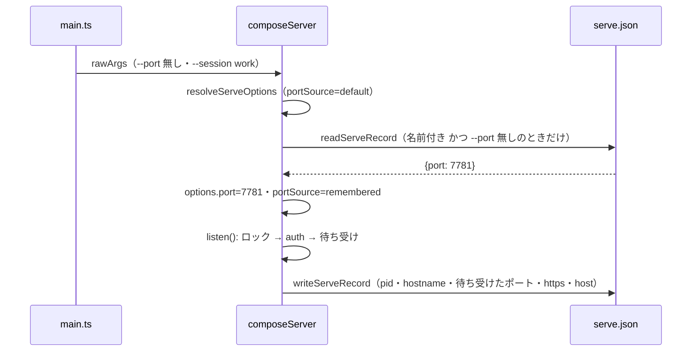
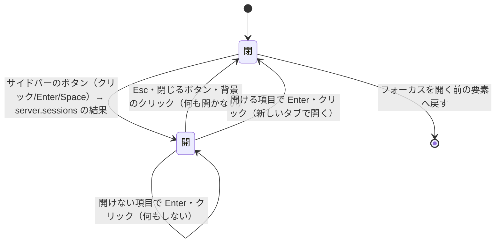

# 仕様: 名前付き session の残り（画面での表示と切り替え・ポートの記憶・環境変数の既定）

## 概要

- サーバは、待ち受けに成功したら状態ディレクトリに**起動の記録** `serve.json`（pid・ホスト名・ポート・TLS か・待ち受けのホスト）を
  書く（全 session）。名前付き session は `--port` の無い起動でその記録のポートを使う（ポートの記憶）。
- サーバは session の一覧を新しい WebSocket の方式 `server.sessions` で返す（認証済みの接続だけ）。各項目の開くための情報は、
  記録の pid・ホスト名が `wtm.lock` の持ち主と一致するときだけ付ける。
- hello の結果の `snapshot.host` に、名前付き session のときだけ `sessionName` を載せる。ブラウザはタイトルとサイドバーの上端に出し、
  サイドバーの上端のボタンから session の一覧のダイアログ（既存の一覧のダイアログと同じ形）を開き、選んだ session を新しいタブで開く。
- 名前付き session の Cookie の名前を `wtm_session_<名前>` にする（既定の session は `wtm_session` のまま）。
- CLI は `--session` が無ければ `WTM_SESSION` を使い（`wtm serve`・`wtm token reset`）、名前付き session の pane には
  `WTM_SESSION=<名前>` を入れる（受け継いだ値は落とす）。

## 設計方針

- **記録は 1 ファイルで 2 役**（ポートの記憶と一覧の開くための情報）。書くのは待ち受けの直後（`listen()` の 1'。実際に待ち受けた
  ポートが分かる所。research F7）。止まっても消さない（次の起動のポートの記憶に使う）。「いま動いている」かは記録ではなく `wtm.lock`
  の持ち主で決め、記録はその持ち主の pid とホスト名が一致するときだけ信じる（前の起動の記録・古い版の起動を取り違えない）。
  - 代替案「一覧の方式がサーバどうしで問い合わせる」: 別の session の token が要り、秘密を扱う経路が増える。退けた。
  - 代替案「ロックのファイル（`wtm.lock`）にポートを書く」: ロックは `wtm token reset`（`sessionCommands.ts:89`）・`wtm session delete`
    （`namedSession.ts:148`）も取るので、その間はポートを持たない。止まった後に残らない（ポートの記憶に使えない）。退けた。
- **名前を載せる場所は `HostInfo` の省略可能な項目**（research F6。hello の結果・スナップショットの型は増やさない）。既定の session では
  項目ごと入れない（`exactOptionalPropertyTypes`。research「実装時の注意」）。
- **一覧は WebSocket の方式**（認証・Origin の検査が既にかかっている。HTTP の経路は `HttpServer.ts:93-96` で 1 本ずつ Cookie と Host の検査を
  書いている——`/api/session` の `handleSession` `:157-172`——ので、足すとその検査をもう 1 か所に書くことになる）。
  名前は `server.sessions`（`session` はこの PJ では workspace・tab・pane の状態を指す語——`SessionSnapshot`（`model.ts`）・`SessionService`——なので避けた）。
- **ブラウザが開く URL はブラウザで決める**（いまのページのホスト名はブラウザしか知らない。research F9）。サーバは待ち受けのホスト・
  ポート・TLS かの生の値だけを返す。判定は web の純関数に小さく持つ（server の `util/net.ts` は使えない）。
- **ダイアログは既存の一覧のダイアログの形**（research F2：ネイティブの `<dialog>`＋`role="listbox"`＋↑↓/j/k・Enter・Esc・背景のクリック）に、
  AC-I1 の閉じるボタンを足す。フォーカスの戻りは APG に揃えて**開いたボタン**（research F1）。既存の `closeDialog()` は開く前の pane を
  `focusedPaneId` に書き戻すが、値が変わらなければ端末はフォーカスを奪わない（端末が `term.focus()` するのは `focusedPaneId` の watch
  ——`TerminalPane.vue:62-68`——で、Vue の watch は同じ値の代入では動かない。後者は Vue の仕様・記憶による）ので、ダイアログが
  開く前のフォーカスの要素を覚えて閉じた後に明示的に戻す（happy-dom でネイティブの戻りを確かめられないため、明示にしてテストする）。
- **開くのは新しいタブ**（`window.open(url, "_blank", "noopener,noreferrer")`）。いまの画面を残し、開いた先から元のページを操作させない。
  herdr の `attach` はクライアントを繋ぎ直すが、Web では別の session は別のオリジンで、同じタブで移ると戻るのに再びログインが要る場面がある。
- **Cookie の名前は名前付き session だけ変える**（decisions D1）。session の名前の文字は Cookie の名前の token に収まる（research F5）。
- **`WTM_SESSION` の適用は CLI の入口だけ**（`main.ts` が `parseArgs` の結果に当てる）。`composeServer`・`resolveServeOptions` は環境変数の
  session を見ない——テストや smoke がサーバを組み立てるときに、開発者のシェル（名前付き session の pane の中かもしれない）の
  `WTM_SESSION` で状態ディレクトリが変わらないようにする。

## 対象範囲

- server（`packages/server/src/`）
  - `persist/ServeRecordFile.ts`（新規）: 記録の読み書き。
  - `config.ts`: `ServeOptions` に `sessionRoot`・`portSource`・`sessionSource`。待ち受けの失敗の案内に記録したポートの説明。
    `stateDirInUseError` に `WTM_SESSION` の説明。
  - `cliArgs.ts`: `applySessionEnv`（新規）。`ParsedArgs`/`RawServeArgs` に `sessionSource`。
  - `main.ts`: `applySessionEnv` を当てる。記録したポートの案内・表示。
  - `sessionCommands.ts`: `runTokenReset` の案内に `WTM_SESSION` の説明。
  - `composeServer.ts`: 記録の読み（ポートの記憶）・書き、`HostInfo.sessionName`、Cookie の名前、`server.sessions` の依存、pane の `WTM_SESSION`。
  - `auth/AuthService.ts`: Cookie の名前を選べるようにする（`sessionCookieName`）。
  - `persist/namedSession.ts`: `listServerSessions`（一覧に開くための情報・いま繋いでいる session か）と `SESSION_NAME_RULE` の export。
  - `session/paneEnv.ts`・`session/SessionService.ts`: `WTM_SESSION`。
  - `surface/methods/serverSessions.ts`（新規）・`surface/methods/index.ts`・`surface/methods/deps.ts`: 方式 `server.sessions`。
  - `startupBanner.ts`: 記録したポート・`WTM_SESSION` の行。
- protocol（`packages/protocol/src/`）: `model.ts`（`HostInfo.sessionName`・`ServerSessionEntry`）、`messages.ts`（`ServerSessionsParams`・結果・方式の表）。
- web（`packages/web/src/`）
  - `serverSession/sessionTarget.ts`（新規）: 一覧の項目 → 開く URL か開けない理由。
  - `serverSession/documentTitle.ts`（新規）: タイトルの組み立て（`main.ts` から移す）。
  - `components/SessionSwitchDialog.vue`（新規）・`App.vue`（置く）。
  - `components/Sidebar.vue`: 上端の session のボタン。
  - `store/session.ts`: `namedSessionCount`。`store/view.ts`: `DialogContext` に `sessionSwitch`。
  - `actions/ActionDispatcher.ts`: `openSessionSwitcher`・`openServerSession`・`refreshServerSessions`。
  - `main.ts`: タイトル・hello のたびの `refreshServerSessions`。
- docs: `docs/herdr-parity.md` H33・`docs/tls-setup.md`・`docs/verification.md`。

## 依拠する既存の事実

- Cookie は固定の名前 `wtm_session`・`Path=/`・Domain なし（`packages/server/src/auth/AuthService.ts:9`・`:200-210`）。読むのは名前が一致する最初の 1 つ（`:182-198`）。Cookie を読む経路は `HttpServer.ts:137`（logout）・`:158`（`/api/session`）・`AuthService.ts:65`（`authorizeUpgrade`）で、いずれも同じ `AuthService` の実体の `parseSessionIdFromCookie` を呼ぶ。
- Cookie はポートで分かれない（RFC 6265 8.5。research F5。この環境では原典を取得していない・記憶による）。
- wtmctl はログインの `Set-Cookie` の先頭のセグメント（`名前=値`）を名前を問わずそのまま使い（`packages/cli/src/httpAuth.ts:23-26`）、URL（ポートを含む）ごとに
  保存する（`packages/cli/src/session.test.ts:40-43`）ので、Cookie の名前が変わっても wtmctl は変えなくてよい。
- 名前の規則は `sessionNameProblem`（`packages/server/src/persist/namedSession.ts:21-30`。ASCII 英数字と `.` `_` `-`）、規則文は `SESSION_NAME_RULE`（`:15-16`。未 export）。
- 一覧は `listSessions(base)`（`namedSession.ts:79-93`）で、各項目の `running`・`pid`・`host`（別ホストのときだけ）は `StateDirLock.inspect()` から（`:59-68` `entryFor`）。
- 起動の順序（ロック → auth → 待ち受け → 待ち受けたポートの取得 → token → …）は `composeServer.ts` の `listen()`（`:264-331`。待ち受けたポートは `:289-290`）。オプションは `composeServer.ts:105` で `resolveServeOptions(rawArgs)`（`config.ts:120`。同期）から決まる。
- `resolveServeOptions` の `stateDir` は `resolveSessionStateDir(args.stateDir ?? defaultStateDir(env, os), args.session)`（`config.ts:139`）、`sessionName` は `default`・指定なしで `undefined`（`config.ts:140`）。
- 原子的な書き込みは `writeFileAtomic`（`packages/server/src/persist/atomicFile.ts:9-24`。0600）。
- pane の環境は `buildPaneEnv`（`packages/server/src/session/paneEnv.ts:15-49`）を `SessionService.ts:1052` が呼ぶ。管理する値は SessionService の opts（`serverUrlForPanes`。`SessionService.ts:110`・`:182`）。
- `HostInfo`（`packages/protocol/src/model.ts:130-134`）はスナップショット（`SessionModel.ts:884-896`）にそのまま載り、ブラウザは `store/session.ts` の `applySnapshot` で `host` に持つ。タイトルは `packages/web/src/main.ts:298-303`、スモークはこれを完全一致で見る（`packages/server/src/smoke.ts:144`）。
- 方式は `surface.register`＋`registerAllMethods`（`packages/server/src/surface/methods/index.ts`）、依存は `MethodDeps`（`surface/methods/deps.ts`。省略可能な依存 `agentStarter` の前例あり）、表は `packages/protocol/src/messages.ts:540`・`:600` 付近。
- 一覧のダイアログの形は `packages/web/src/components/GroupPickerDialog.vue`（research F2）、サーバへ聞いてから開くのは `ActionDispatcher.openWorktree`（`packages/web/src/actions/ActionDispatcher.ts:251-262`）、閉じるのは `view.closeDialog()`（`store/view.ts:367-372`）、ダイアログの間のキーの扱いは `main.ts:267-283`（`KeyRouter` を `"dialog"` にする watch と、`view.openDialog` があれば何もしない window の keydown。research F4）、サイドバーのボタンの Enter/Space は `onButtonKeydown`（`Sidebar.vue:205-209`）。
- hello のたびの処理は `Connection.onOpened`（`packages/web/src/net/Connection.ts:165-170`）。
- 起動の表示は `startupLines`（`packages/server/src/startupBanner.ts:27-53`）、待ち受けの失敗の案内は `bindFailureHint`／`listenFailureHint`（`config.ts`）を `main.ts` の `runServe` が `ConfigError` にする（`main.ts:77-84` 付近）。
- `main.ts` は読み込むと起動するので単体テストしない（`cliArgs.ts` の冒頭のコメント）。

## インターフェース / データ構造

### 記録（`<状態ディレクトリ>/serve.json`。0600）

```ts
// persist/ServeRecordFile.ts
export const SERVE_RECORD_FILE_NAME = "serve.json";
export interface ServeRecord {
  schema: 1;
  pid: number;        // 書いたプロセス（process.pid）
  hostname: string;   // 書いたホスト（os.hostname()。StateDirLock と同じ）
  port: number;       // 実際に待ち受けたポート（1〜65535 の整数）
  https: boolean;     // TLS で待ち受けたか
  host: string;       // 待ち受けのホスト（--host。角括弧なし）
  savedAt: string;    // ISO 8601
}
export function writeServeRecord(stateDir: string, record: Omit<ServeRecord, "schema" | "savedAt">): Promise<void>;
/** 無い・読めない・JSON でない・形が合わない（ポートが範囲外を含む）なら undefined。投げない。 */
export function readServeRecord(stateDir: string): Promise<ServeRecord | undefined>;
```

### サーバのオプション（`config.ts`）

```ts
interface ServeOptions {
  // 既存に足す
  /** session の根（既定の session の状態ディレクトリ。`--state-dir` か OS の既定）。一覧の走査に使う。 */
  sessionRoot: string;
  /** "flag"=--port・"default"=既定の 7780・"remembered"=記録（composeServer が差し替える） */
  portSource: "flag" | "default" | "remembered";
  /** 名前付き session の名前の出所。名前付きのときだけ値を持ち、既定の session（指定なし・`default`。`WTM_SESSION=default` を含む）は undefined。"env"=WTM_SESSION */
  sessionSource: "flag" | "env" | undefined;
}
interface RawServeArgs { /* 既存 */ sessionSource?: "flag" | "env" }
export function bindFailureHint(err: unknown, remembered?: { port: number; sessionName: string }): string | undefined;
// main.ts の runServe は composeServer の戻り値の `server.options`（`ComposedServer.options: ServeOptions`。既存）から portSource・port・sessionName・
// sessionSource を読み、`portSource === "remembered"` のときだけ `bindFailureHint` に `remembered` を、`startupLines` に `portRemembered: true` を渡す。
export function stateDirInUseError(inUse, stateDir, command, sessionFromEnv?: string): ConfigError;
```

### CLI（`cliArgs.ts`）

```ts
export const SESSION_ENV_VAR = "WTM_SESSION";
/** serve・token-reset で --session が無ければ WTM_SESSION を当てる（空は無いのと同じ・default は既定）。規則外は ConfigError（終了コード 2）。 */
export function applySessionEnv(parsed: ParsedArgs, env: NodeJS.ProcessEnv): ParsedArgs;
interface ParsedArgs { /* 既存 */ sessionSource?: "flag" | "env" }
```

### 起動の表示（`startupBanner.ts`）

```ts
interface StartupInfo { /* 既存 */ portRemembered?: boolean }          // 記録したポートで待ち受けたときだけ true
interface NamedSessionInfo { /* 既存 */ fromEnv?: boolean }            // WTM_SESSION から選んだ名前付き session のときだけ true
```

### Cookie（`auth/AuthService.ts`）

```ts
export const SESSION_COOKIE_NAME = "wtm_session"; // 既存（既定の session）
export function sessionCookieName(sessionName: string | undefined): string; // 名前付きは `wtm_session_<名前>`
new DefaultAuthService(file, { cookieName?: string })  // 省略時は SESSION_COOKIE_NAME
```

### protocol

```ts
// model.ts
export interface HostInfo { os; windowsBuild; hostname; /** 名前付き session のときだけ */ sessionName?: string }
export interface ServerSessionEndpoint { port: number; https: boolean; host: string }
export interface ServerSessionEntry {
  name: string;          // 既定の session は "default"
  default: boolean;
  running: boolean;
  current: boolean;      // この接続のサーバか
  endpoint?: ServerSessionEndpoint; // 動いていて、記録の pid・ホスト名がロックの持ち主と一致するときだけ
}
// messages.ts
export const ServerSessionsParams = z.object({});
export interface ServerSessionsResult { sessions: ServerSessionEntry[] }
// 方式の表: "server.sessions": ServerSessionsParams / ServerSessionsResult
```

### server の一覧（`persist/namedSession.ts`）

```ts
export async function listServerSessions(
  root: string,
  currentSessionName: string | undefined,
  readRecord: (stateDir: string) => Promise<ServeRecord | undefined> = readServeRecord,
  thisHost: string = os.hostname(),
): Promise<ServerSessionEntry[]>;
export { SESSION_NAME_RULE };
```

`MethodDeps.serverSessions?: () => Promise<ServerSessionEntry[]>`（省略可。無ければ空の一覧を返す）。

### pane の環境（`session/paneEnv.ts`）

`PANE_ENV_DROPPED` に `"WTM_SESSION"` を足し、`PaneEnvManaged.sessionName?: string` があれば `WTM_SESSION` に入れる。
`SessionService` の opts に `sessionName?: string | undefined`（名前付きのときだけ）。

### web

```ts
// serverSession/sessionTarget.ts
export type SessionTarget =
  | { kind: "open"; url: string }
  | { kind: "current" }
  | { kind: "stopped"; command: string }   // "wtm serve" / "wtm serve --session <名前>"
  | { kind: "unreachable" }                // ループバックで待ち受けていて、いまのホスト名がループバックでない
  | { kind: "unknown" };                   // 動いているが開くための情報が無い（記録が無い・持ち主と一致しない）・URL にできない
export function sessionTarget(entry: ServerSessionEntry, hereHostname: string): SessionTarget;
// 待ち受けのホスト（記録の host。`--host` の値から角括弧を外したもの。省略時は既定の `127.0.0.1`——`config.ts:10` `DEFAULTS.host`）の分類：
//   全インタフェース = "0.0.0.0" | "::"（server の `isWildcardHost` と同じ集合。`util/net.ts:24`）
//   ループバック     = "localhost" | "127.0.0.1" | "::1" | "*.localhost"（大文字小文字を区別しない。server の `isLoopbackHost` と同じ集合。`util/net.ts:18`）
//   それ以外         = 特定のアドレスか名前。そのまま URL のホストにする（IPv6 は角括弧で囲む）
// いまのホスト名（`location.hostname`。IPv6 は角括弧つきで来る）は角括弧を外し小文字にしてから同じ集合で判定する。
// URL は `new URL()` が受け付けなければ unknown。
// serverSession/documentTitle.ts
export function documentTitle(hostname: string | undefined, sessionName: string | undefined, workspaceLabel: string | undefined | null): string;
// store/view.ts DialogContext に | { kind: "sessionSwitch"; sessions: ServerSessionEntry[] }
// store/session.ts: namedSessionCount: Ref<number>・setNamedSessionCount(n)
// actions/ActionDispatcher.ts:
//   refreshServerSessions(): Promise<void>      — 一覧を取って namedSessionCount を更新（失敗は黙って前の値のまま。初期値 0）
//   openSessionSwitcher(): void                 — 一覧を取ってダイアログを開く（失敗は toast）
//   openServerSession(url: string): void        — window.open(url, "_blank", "noopener,noreferrer") して閉じる
```

## 振る舞いの詳細

### ポートの記憶と記録



- 読むのは `options.sessionName !== undefined && rawArgs.port === undefined` のときだけ。記録が使えなければ（`undefined`）今までどおり 7780（`portSource: "default"`）。
- 書くのは全 session（既定の session も）。書けなくても起動は続ける（`logger.warn("cannot write serve.json", …)`）。
- 起動の表示（`startupLines`）: `portSource === "remembered"` のとき
  `wtm: session <名前> が前回使ったポート <P> で待ち受けています（別のポートにするには --port。次からはそのポートを使います）` を足す。
- 待ち受けの失敗（`EADDRINUSE`）で `portSource === "remembered"` なら、`bindFailureHint(err, { port, sessionName })`（`main.ts` の `runServe` が
  呼ぶ唯一の入口。中で `listenFailureHint(code)` を呼ぶ——`config.ts:183-185`）が、`listenFailureHint` の案内の先頭に
  `ポート <P> は session <名前> が前回使ったポートです（記録: serve.json）。--port で別のポートを指定すると、次からはそのポートを使います。` を足す。

### 一覧（`server.sessions`）

- `listSessions(root)` の各項目について、`current` は「既定の項目なら `currentSessionName === undefined`、名前付きなら名前が一致」。
- `endpoint` は `running && host（別ホスト）が無い` かつ記録があり `record.pid === entry.pid && record.hostname === thisHost` のときだけ `{ port, https, host }`。
- 返すのは `name`・`default`・`running`・`current`・`endpoint` だけ（状態ディレクトリ・pid・ホスト名は返さない。AC5）。
- `composeServer` は `serverSessions: () => listServerSessions(options.sessionRoot, options.sessionName)` を渡す。

### Cookie

- `composeServer` は `new DefaultAuthService(authFile, { cookieName: sessionCookieName(options.sessionName) })`。`Set-Cookie`・消す Cookie・読む Cookie のすべてがこの名前。
- `wtm token reset`（`runTokenReset`）は Cookie を扱わないので変えない。

### `WTM_SESSION`

- `applySessionEnv`: `command` が `serve`・`token-reset` で `parsed.session === undefined` のときだけ。値が `undefined`・空なら何もしない。
  `default` なら session を `default` にする（`resolveSessionStateDir` が既定にする）。それ以外で `sessionNameProblem` が理由を返せば
  `ConfigError("invalid WTM_SESSION: \"<値>\" (<理由>)", "環境変数 WTM_SESSION の値が session の名前の規則に合いません。<規則文>WTM_SESSION を外すか空にするか、--session で名前を指定してください。")`。
  合えば（`default` を含む）`session`・`serve.session` に入れ、`sessionSource`・`serve.sessionSource` を `"env"` にする。`resolveServeOptions` は
  名前付きのときだけ `ServeOptions.sessionSource` に写す（`default` なら undefined なので、既定の session の表示・案内は変わらない）。`--session` があれば `"flag"`（`parseArgs` が入れる）。
- `wtm serve` の同じ状態ディレクトリの使用中の案内（`stateDirInUseError`）と `wtm token reset` の「その session はありません」の案内は、
  `sessionSource === "env"` のとき `session <名前> は環境変数 WTM_SESSION から選びました（既定の session なら --session default）。` を足す。
- 起動の表示の session の行は `sessionSource === "env"` のとき末尾に `（WTM_SESSION）` を足す。
- `wtm session list`・`delete` は `applySessionEnv` の対象外（名前を明示して受け取る）。

### pane の環境

- `buildPaneEnv(base, { paneId, serverUrl, agentReportSocketPath, sessionName })`: `WTM_SESSION` はサーバの環境から写さず（win32 は大文字小文字を区別しない）、`sessionName` があれば `WTM_SESSION=<名前>`。

### 画面

- タイトル（`documentTitle`）: `hostname` と `workspaceLabel` が揃えば、名前付きは `{hostname} [{名前}]: {workspace}`、既定は今までどおり `{hostname}: {workspace}`。揃わなければ名前付きは `wtm [{名前}]`、既定は `wtm`。
- hello のたび（`onOpened`）に `refreshServerSessions()`：`server.sessions` を取り、`default` でない項目の数を `namedSessionCount` に入れる。失敗は無視（前の値のまま。初期値は 0）。
- サイドバーの最上段に、`host.sessionName !== undefined || namedSessionCount > 0` のとき
  `session: <名前または default>` のボタン（折りたたんでいるときは、他の行と同じく文字を出さず `⇄` だけのボタンにし、名前は
  `aria-label` と `title`（ツールチップ）に出す——折りたたみは利用者が文字を隠す操作で、workspace の名前も同じく隠れる。`Sidebar.vue:428`）（`aria-haspopup="dialog"`・`aria-label="session: <名前>（押すと session の一覧）"`）を出す。
  クリック（Enter・Space はネイティブのボタンの活性化）で `openSessionSwitcher()`。Enter/Space は `onButtonKeydown` で window へ二重に渡さない。
- `openSessionSwitcher()`: `server.sessions` を取り、`namedSessionCount` を更新し、`view.openDialogWithContext({ kind: "sessionSwitch", sessions })`
  （既存。`store/view.ts:352`）。失敗は `view.toast("session の一覧を取れませんでした")`（既存。`store/view.ts:504`）。

### ダイアログ（`SessionSwitchDialog.vue`）



- 各項目: 名前・状態の文（`sessionTarget` の結果から：開ける → `ポート <P> を新しいタブで開く`、current → `いま開いている session`、
  stopped → `止まっています（起動: <コマンド>）`、unreachable → `このマシンのブラウザからだけ開けます（ループバックで待ち受け）`、
  unknown → `開く先が分かりません（待ち受けの記録が無いか、URL にできません）`）。開けない項目は `aria-disabled="true"`。
- 開いたとき: 開く前の `document.activeElement` を覚え、`showModal()`。最初の開ける項目があれば選択をそこにして一覧（listbox）へ、無ければ閉じるボタンへフォーカス。
- キーは `<dialog>` の `@keydown` で受ける（既存の形）: Esc→取り消し、Enter→選択中が開けるなら開く、↑↓・j/k→選択の移動（`preventDefault`）。
  閉じるボタンの上の Enter/Space はネイティブのボタンのクリック（`@keydown` の Enter の処理はフォーカスが一覧にあるときだけ）。
- 閉じるとき（取り消し・確定のどちらも）: `view.closeDialog()` → `dialog.close()` → 覚えた要素がまだ文書にあれば `focus()`。
- 開いている間は `view.openDialog === "sessionSwitch"` なので、`main.ts` の window の keydown はキーを処理せず（プレフィックス・navigate へ渡さない）、`KeyRouter` は `"dialog"` モード（research F4）。

## ドメイン固有の考慮

- herdr との違い（docs に書く）: ① 切り替えは同じ画面の繋ぎ直しではなく別の URL を新しいタブで開く（別のオリジン・別のログイン）
  ② 一覧の入口はサイドバーのボタンだけ（キーは後続） ③ ポートの記憶は本製品だけの概念（herdr は socket なのでポートが無い）
  ④ `WTM_SESSION` の空は「無い」扱い（herdr は空を誤りにする。シェルの `export WTM_SESSION=` で解除できるようにした）。
- 秘密: 一覧・hello に token・Cookie・状態ディレクトリのパスを載せない。一覧を見られる相手（その session にログインした人）は
  pane でシェルを使え、同じ利用者の権限で `wtm session list` も打てるので、一覧が新たな権限を与えることは無い。

## エラー処理 / 異常系

- 記録が無い・読めない・壊れている・ポートが範囲外 → 読みは `undefined`（ポートは 7780）。書けない → warn のログ・起動は続ける。
- 記録の pid が持ち主と違う（前の起動・古い版が動いている・`wtm token reset` がロックを持っている間）→ `endpoint` を付けない（unknown）。
- 一覧の走査の失敗（`sessions/` が読めない等）→ `server.sessions` はその失敗を返す（`ControlSurface` の既定の失敗の形：想定外の例外は
  `{ code: "internal" }`。`surface/ControlSurface.ts:41-48`）。ブラウザは入口の判定では無視、ダイアログを開くときは toast。
- `WTM_SESSION` が規則外 → 終了コード 2（何も作らない・読まない）。
- `window.open` がブラウザに止められた等で `null` が返っても何もしない（`noopener` の指定では常に `null` を返すので区別できない。
  HTML の `window.open` の仕様・記憶による）。

## 受け入れ基準との対応

- AC1: 入力は `options.sessionName`（`--session`・`WTM_SESSION` から）。`composeServer` が `HostInfo` に名前付きのときだけ `sessionName` を入れ、hello の `snapshot.host` に載る。結合テストで名前付き・既定の両方を確かめる。
- AC2: 入力は hello の `snapshot.host.sessionName` と `server.sessions` の件数（`namedSessionCount`）。`Sidebar.vue` のボタンの表示条件。コンポーネントのテスト（展開時は文字 `session: <名前>`、折りたたみ時は `aria-label`・`title` に名前、の両方）。
- AC3: 入力は同上の `sessionName`・`hostname`・workspace の名前。`documentTitle` の単体テスト（既定は今の文字列と完全一致）。
- AC4: 入力は `listSessions(root)`（ロック）と各状態ディレクトリの `serve.json`。`listServerSessions` の単体テスト（持ち主一致・不一致・記録なし・止まっている・別ホスト・current）。
- AC5: 入力は `ServerSessionEntry` の型と `listServerSessions` の返す項目。返す項目に秘密が無いことをテスト（キーの集合を完全一致）し、方式は WebSocket（認証済み）でだけ登録されることを結合テストで確かめる（未ログインの `/ws` は既存の認証で弾かれる）。
- AC6: 入力は `endpoint`（サーバ）と `location.hostname`（ブラウザ）。`sessionTarget` の単体テスト（全インタフェース・ループバック×いまのホスト名がループバック/でない・特定のアドレス・IPv6・TLS）。
- AC7: 入力は `sessionTarget` の結果。ダイアログのテスト（開ける項目で Enter → `openServerSession(url)`、current・stopped・unreachable・unknown は何もせず理由が出る）と `ActionDispatcher.openServerSession` のテスト（`window.open` を `_blank`・`noopener,noreferrer` で呼ぶ）。
- AC8: 入力は `options.sessionName`。`sessionCookieName` と `DefaultAuthService` の単体テスト（名前付きの Set-Cookie の名前・自分の名前だけを読む・別の名前の Cookie だけなら未ログイン）。
- AC9: 同上で `sessionName === undefined` なら `wtm_session`（既存のテストがそのまま通る）。
- AC10: 入力は `--port`（`rawArgs.port`）と `serve.json`。結合テスト：名前付き session を空きポート P で起動→閉じる→`--port` 無しで起動すると P。`--port Q` で起動すると記録が Q。
- AC11: 入力は `serve.json` の中身。`readServeRecord` の単体テスト（無い・JSON でない・形が違う・範囲外）と、壊れた記録で `composeServer` の `options.port` が 7780 になるテスト。読めない（権限）は Windows 以外で chmod 000 のテスト。
- AC12: 入力は `options.sessionName === undefined`。結合テスト：既定の session に記録（別ポート）を置いても `options.port` が 7780、起動後は記録が書かれる。
- AC13: 入力は `WTM_SESSION` と `--session`。`applySessionEnv` の単体テスト（env・flag 優先・空・default）と、`runTokenReset` を env 由来の名前で呼ぶテスト。
- AC14: 入力は `WTM_SESSION` の値。`applySessionEnv` の単体テスト（規則外で ConfigError・案内に WTM_SESSION・list/delete は見ない）。
- AC15: 入力は `sessionName`（SessionService の opts）とサーバの環境。`buildPaneEnv` の単体テスト（名前付き・既定・受け継いだ値を落とす・win32 の大文字小文字）。
- AC16: 入力は `portSource`。`startupLines` と `bindFailureHint` の単体テスト。
- AC17: 入力は `--session`・`WTM_SESSION` の無い起動（`sessionName === undefined`）と名前付き session の数 0。既存のテスト（`config.test.ts`・`startupBanner.test.ts`・`AuthService.test.ts`・smoke のタイトル）がそのまま通ること、と既定の session の表示・Cookie・タイトル・サイドバー（名前付きが 0 件）のテスト。
- AC18: 入力はこの design の「ドメイン固有の考慮」の herdr との違いと requirements の対象外。docs の該当箇所を更新（review で目視）。
- AC-I1: 入力はサイドバーのボタンのクリック（Enter・Space はネイティブのクリック）と、ダイアログの Esc・閉じるボタン・背景のクリック。ダイアログのテスト（クリックで開く・Esc・閉じるボタン・背景のクリックで閉じて何も開かない・開いた後に閉じる）。サイドバーのボタンのクリックで `openSessionSwitcher` が呼ばれるテスト。
- AC-I2: 入力は選択中の項目の `sessionTarget` の結果と Enter・クリック・Esc。ダイアログのテスト（開ける項目の Enter/クリックで `openServerSession`、Esc で呼ばれない）。
- AC-I3: 入力は `<dialog>` の keydown（↑↓・j/k・Enter・Esc）。ダイアログのテスト（↑↓・j/k で選択が移り、Enter で開く、Esc で閉じる。Tab の巡回は `showModal` のネイティブの挙動で、happy-dom では確かめない＝未検証の穴）。
- AC-I4: 入力は開く時点の `document.activeElement` と `sessionTarget` の結果（最初の開ける項目）。ダイアログのテスト（開くと最初の開ける項目が選択されて一覧にフォーカス、無ければ閉じるボタン、閉じると開く前の要素へフォーカス）。
- AC-I5: 入力は `<dialog>` の中の keydown と `view.openDialog`。ダイアログのテスト（開いている間 `view.openDialog === "sessionSwitch"`・扱うキーの `preventDefault`）と、`main.ts:267-283` の既存のゲート（research F4）。
