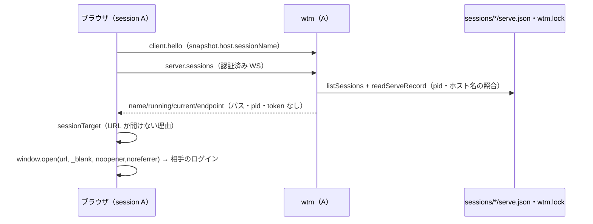

# レビューガイド: 名前付き session の残り（画面での表示と切り替え・ポートの記憶・WTM_SESSION）

## 変更概要 / 目的
名前付き session を画面で見分け（サイドバーの `session: <名前> ⇄`・タイトルの `[名前]`）、画面から別の session を新しいタブで開き
（herdr の `session attach` 相当）、同じブラウザで複数の session にログインしたままにでき（Cookie の名前を session ごとに）、
名前だけで前回のポートで起動し直せ（`serve.json`）、`WTM_SESSION` で既定の session を選べる（herdr の `HERDR_SESSION`）。

## 重要ポイント
- 起動の記録 `serve.json` は 2 役（ポートの記憶・一覧の開くための情報）。一覧は `wtm.lock` の持ち主と pid・ホスト名が一致するときだけ信じる（decisions D3）。
- 開く URL はブラウザが決める。相手の Origin の方針に合わせてループバックは待ち受けのホストそのもの（D6）。ページから判定できない限界は docs に明記（D7）。
- `WTM_SESSION` は CLI の入口（`main.ts` の `applySessionEnv`）だけで見る。`composeServer` は環境変数を見ない（テストが開発者のシェルに引きずられない）。
- 既定の session の Cookie 名・ポート・タイトル・（名前付きが 0 件なら）サイドバーは不変。

## 処理フロー

## 主要な変更箇所
- `packages/server/src/persist/ServeRecordFile.ts` — 記録の読み書き（壊れていれば undefined）。
- `packages/server/src/persist/namedSession.ts` `listServerSessions` — 一覧・current・endpoint の照合。
- `packages/server/src/composeServer.ts` — 記録の読み（`withRememberedPort`）と書き・Cookie の名前・`HostInfo.sessionName`・pane の名前。
- `packages/server/src/cliArgs.ts` `applySessionEnv`・`packages/server/src/auth/AuthService.ts` `sessionCookieName`・`session/paneEnv.ts`。
- `packages/web/src/serverSession/sessionTarget.ts`・`components/SessionSwitchDialog.vue`・`components/Sidebar.vue`。

## リスク / 確認したい点
- 実機のブラウザは未検証（E2E は方針で未実行）。`docs/verification.md` の手動確認を参照。
- 名前付き session の pane に `WTM_SESSION` が入るため、pane の中の素の `wtm serve` は同じ session を選んで `wtm.lock` で止まる（案内あり）。
- 大文字小文字を区別しない FS で綴りを変えて開くと current にならない（許容）。
