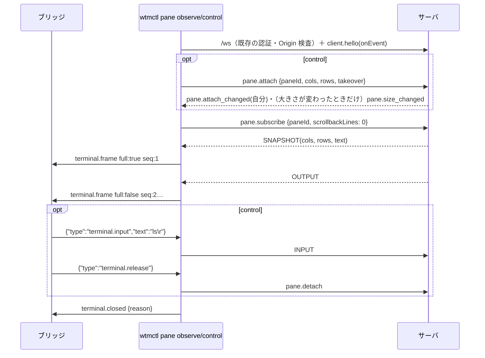

# 仕様: `wtmctl pane observe` / `wtmctl pane control`——pane の NDJSON 閲覧ストリームと制御ストリーム

## 概要

`packages/cli` にだけ、2 つのコマンドを足す。

- `wtmctl pane observe <paneId>`: 既存の `pane.subscribe` で受けた SNAPSHOT（`full: true`）と OUTPUT（`full: false`）を、
  1 行 1 記録の NDJSON（herdr の `terminal.frame` と同じ形）で stdout へ書く。pane の終わり・接続断で `terminal.closed` を書いて終わる。
- `wtmctl pane control <paneId> [--takeover] [--cols N] [--rows N]`: 既存の `pane.attach`（20260926-pane-direct-connect の所有者と大きさの鍵）で所有者になってから
  observe と同じフレームを書き、stdin の NDJSON（`terminal.input`・`terminal.resize`・`terminal.release`）を INPUT フレーム・`pane.attach_resize`・`pane.detach` に写す。

サーバ・protocol・web は変えない。部品は、純粋な処理（記録の組み立て・行の切り出し・コマンドの検査）を `packages/cli/src/sessionStream.ts` に、
接続と終わり方の組み立てを `packages/cli/src/commands/sessionStream.ts` に置く。

## 設計方針

- **既存の RPC・イベント・フレームだけで作る**（decisions D1）。所有者と大きさは `pane.attach`/`attach_resize`/`detach` に載せるので、control と `pane attach` は
  同じ所有者の表を共有し、互いに `pane_attached`・`--takeover`・`attach_taken_over` が効く（research F4）。observe は `pane.subscribe` だけを送る。
- **フレームは生の出力から作る**（D2）。herdr はサーバで描き直した画面を観測者の大きさで送るが、ここでは pane の出力をそのまま区切って送り、`width`/`height` は pane の実際の大きさ。
  したがって observe は `--cols/--rows` を持たない（受け付けると効かない値を受け付けることになる）。
- **フレームから端末への問い合わせを取り除く**（D3）。`pane attach` の `TerminalQueryFilter` をそのまま通す。herdr のフレームは描き直した画面で問い合わせを含まない。
  ブリッジが受け取った列を端末エミュレータに流すと、エミュレータの答えが `terminal.input` で pane に戻りサーバのミラーの答えと二重になる（`pane attach` と同じ理由）。
- **読み手が遅いときは `ws` の受信を止める**（D4）。stdout の書き出し待ちが 1 MiB を超えたら `WtmClient.pause()`、stdout の `drain` で `resume()`。
  止めている間はサーバの既存の流量制御が出力を捨て、再開すると SNAPSHOT（`full: true`）から続く（research F1・F3）。wtmctl のメモリは上限の範囲に留まり、
  一時的に遅いだけの読み手を殺さない。
- **不正な入力行は読み飛ばして続ける**（D5。herdr と同じ）。ただし検査は herdr より厳しくする——知らないキー・型の違い・base64 の非正規形・範囲外の値も弾く。
  1 行は 1 MiB まで（INPUT フレームの上限と同じ。research F5）。
- **大きさは 1〜1000**（D6）。`--cols/--rows` と `terminal.resize` の両方。サーバのスキーマに上限が無い（research F4）ので CLI で絞る。
- **`terminal.scroll` は未対応**（D7）。サーバ側のスクロールの土台が無い。種類としては知っているので「未対応」と理由を分けて stderr に出す。

## 対象範囲

- `packages/cli/src/sessionStream.ts`（新）: 記録の組み立て・行の切り出し・コマンドの検査・定数。
- `packages/cli/src/commands/sessionStream.ts`（新）: `runPaneObserve`・`runPaneControl`・`processStreamIo`。
- `packages/cli/src/wsClient.ts`: `WtmClient` に `pause()`/`resume()` を足す（`WsWtmClient` は `ws` の `pause`/`resume` を呼ぶ）。
- `packages/cli/src/cliArgs.ts`: `pane observe`・`pane control` の引数・`Command`・`USAGE`。
- `packages/cli/src/main.ts`: 入口の `switch` と `printHelp`。
- `packages/cli/src/smoke.ts`: ビルド済みの `wtmctl` で observe と control を子プロセス（stdin/stdout はパイプ）として一巡させる手順。
- `docs/wtmctl.md`・`docs/herdr-parity.md`（H40）・`.aidev/backlog/product-roadmap.md`。
- **変えない**: `packages/server`・`packages/protocol`・`packages/web`・既存の `pane attach`/`pane read` の振る舞い。

## 依拠する既存の事実

- SNAPSHOT は購読の開始時と、流量制御で止めた購読の再開時に送られ、止めている間の出力は捨てられる（`packages/server/src/terminal/OutputFanout.ts:46-57`・`:65-101`・`:108-123`。research F1）。
  止める判定は接続の `bufferedAmount` > 2 MB（`:23`・`:69`）。
- サーバのイベントは全接続へ送られる（`packages/server/src/ws/WsGateway.ts:81-84`）。`pane.size_changed {paneId, cols, rows}`（`packages/protocol/src/events.ts:89-92`）・
  `pane.attach_changed {paneId, clientId|null}`（`events.ts:98` の `PaneAttachChangedEvent`）・`pane.exited`/`pane.closed`（`events.ts:71`・`:75`。`paneId` を持ち、
  `packages/cli/src/commands/attach.ts` の `onEvent` が使っている）。
- `client.hello` の結果は自分の `clientId` を持つ（`packages/protocol/src/messages.ts:33-36` `ClientHelloResult`）。`WtmClient.hello(onEvent)` はそれを返し、応答と同時にイベントの購読を始める
  （`packages/cli/src/wsClient.ts` の `hello`）。
- `pane.subscribe` の引数は `{paneId, scrollbackLines: 0 以上の整数}`（`messages.ts:60-63` `PaneSubscribeParams`）。
- 大きさを変えるのは `SessionService.resizePane` で、変えたときだけ `pane.size_changed` を publish する（`packages/server/src/session/SessionService.ts:890-897`）。
  `SizeAuthority.attach` は所有者を記録して `resizePane` を呼び、所有者が変わったときだけ `pane.attach_changed` を publish する（`packages/server/src/clients/SizeAuthority.ts:136-148`）。
  `resizeAttached` も `resizePane`（`:150-155`）。所有者の表は `SizeAuthority` の `attachments`（clientId ごと）で、`attachOwner(paneId)` で読める（`:161-163`。サーバの内側だけ）。
- `pane.subscribe` は pane が無ければ `not_found` を返し、SNAPSHOT は送らない（`packages/server/src/surface/methods/subscribe.ts:6-16`）。
- `pane.attach` は別の所有者がいて takeover が無ければ `pane_attached`、pane が無ければ `not_found`。所有者になると `pane.attach_changed`（自分）を publish する。
  `pane.attach_resize` は所有者でなければ `not_attached`。`pane.detach` は所有者でなければ何もしない（`packages/server/src/surface/methods/attach.ts:14-48` `registerAttachMethods`・
  `SizeAuthority.ts:136-159`）。接続が切れると所有は `onClientGone` で解放される（`WsGateway.ts:124-131`）。
- INPUT フレームの上限は 1 MiB（`WsGateway.ts:15`・`:105-110`）。
- `ws` 8.21.3 の `WebSocket.pause()`/`resume()`（`node_modules/.pnpm/ws@8.21.3/node_modules/ws/lib/websocket.js:347`・`:428`）。
- `WsWtmClient` は自分で `close()` すると `onClose` を呼ばない（`packages/cli/src/wsClient.ts` の `closedBySelf`）。`withSession` は `fn` の後に接続を閉じる（`packages/cli/src/withSession.ts`）。
- `TerminalQueryFilter`（`packages/cli/src/attachOutput.ts:23`）は文字列を受け、`reset()` で持ち越しを捨てる。
- CLI のエラーは `RpcFailure(code)` → stderr に JSON・終了コード 1、`CliUsageError` → 2（`packages/cli/src/output.ts` の `reportAndExit`）。

## インターフェース / データ構造

### 記録（stdout。1 行 1 JSON）

```jsonc
{"type":"terminal.frame","seq":1,"encoding":"ansi","width":120,"height":40,"full":true,"bytes":"<base64>"}
{"type":"terminal.closed","reason":"pane_closed"}   // reason: pane_closed | released | taken_over | connection_closed | output_closed
```

- `seq` は 1 から、書いたフレームごとに 1 増える（`terminal.closed` には付けない）。
- `full: true` は SNAPSHOT（最初と、流量制御からの再開）。`full: false` は OUTPUT。
- `width`/`height` は最後に知った pane の大きさ（SNAPSHOT の `cols/rows`、または `pane.size_changed`）。
- `bytes` は問い合わせを取り除いた後の列を UTF-8 にして base64。OUTPUT から取り除いた結果が空ならフレームを書かない（SNAPSHOT は空でも書く）。

### コマンド（control の stdin。1 行 1 JSON）

| type | キー（これ以外があれば不正） | 検査 | 動作 |
|---|---|---|---|
| `terminal.input` | `text?: string`・`bytes?: string` | ちょうど 1 つ。`bytes` は正規の base64（`=` の埋め草を含め 4 文字単位） | UTF-8／復号した列を INPUT で送る（空なら何もしない） |
| `terminal.resize` | `cols`・`rows`・`cell_width_px?`・`cell_height_px?` | `cols/rows` は 1〜1000 の整数、`cell_*` は 0 以上の整数（使わない） | `pane.attach_resize`（失敗は無視） |
| `terminal.scroll` | （見ない） | 常に不正（未対応） | 何もしない |
| `terminal.release` | なし | — | 所有を返して終わる |

- 行は `\n` 区切り。末尾の `\r` を含め前後の空白だけの行は黙って無視。UTF-8 として正しくない行・JSON でない行・オブジェクトでない行・`type` が文字列でない／未知の行は不正。
- 1 行（`\n` を除く）が 1 MiB を超えたら、次の `\n` まで捨てて 1 回だけ不正として報告する。
- 不正な行は stderr に `wtmctl: pane control input ignored: <理由>` を 1 行書いて続ける。

### cli（`packages/cli/src/sessionStream.ts`）

```ts
export const MAX_CONTROL_LINE_BYTES = 1024 * 1024;
export const MAX_STREAM_DIMENSION = 1000;
export const DEFAULT_CONTROL_SIZE = { cols: 120, rows: 40 };
export const OUTPUT_HIGH_WATERMARK_BYTES = 1024 * 1024;
export type ClosedReason = "pane_closed" | "released" | "taken_over" | "connection_closed" | "output_closed";

export class FrameWriter {               // seq を持ち、記録の 1 行（改行付き）を返す
  frame(text: string, full: boolean, width: number, height: number): string;
  closed(reason: ClosedReason): string;
}
export type LineEvent = { kind: "line"; bytes: Uint8Array } | { kind: "too_long" };
export class LineSplitter {             // 読み取りの境界をまたいで行を切り出す
  feed(chunk: Uint8Array): LineEvent[];
  end(): LineEvent[];                   // 終わりに残った改行の無い最後の行
}
export type ControlCommand =
  | { type: "terminal.input"; data: Uint8Array }
  | { type: "terminal.resize"; cols: number; rows: number }
  | { type: "terminal.release" };
export function parseControlLine(line: Uint8Array): { ok: true; command: ControlCommand } | { ok: false; reason: string } | { ok: "empty" };
export function isCanonicalBase64(s: string): boolean;
```

### cli（`packages/cli/src/commands/sessionStream.ts`）

```ts
export interface StreamIo {
  writeOut(line: string): void;          // stdout
  outPending(): number;                   // stdout の書き出し待ちのバイト数
  onOutDrain(cb: () => void): () => void;
  onOutError(cb: () => void): () => void; // 読み手が閉じた（EPIPE 等）
  warn(line: string): void;               // stderr
  onIn(cb: (chunk: Uint8Array) => void): () => void;
  onInEnd(cb: () => void): () => void;
  stopIn(): void;                         // stdin を止める（プロセスが終われるように）
  onSignal(cb: () => void): () => void;   // SIGINT・SIGTERM・SIGHUP（control だけが使う）
}
export function processStreamIo(): StreamIo;
export async function runPaneObserve(cmd: PaneObserveCmd, store: SessionStore, io?: StreamIo): Promise<void>;
export async function runPaneControl(cmd: PaneControlCmd, store: SessionStore, io?: StreamIo): Promise<void>;
```

### wsClient

```ts
interface WtmClient {
  // 既存 …
  /** 受信を止める（読み手が遅いとき。サーバの流量制御に任せる）。既に受け取ったぶんのイベントは届きうる。 */
  pause(): void;
  resume(): void;
}
```

### cliArgs

```ts
| { kind: "pane-observe"; opts: GlobalOpts; paneId: string }
| { kind: "pane-control"; opts: GlobalOpts; paneId: string; takeover: boolean; cols: number; rows: number }
```

- `--cols`/`--rows` は `parsePositiveInt` の後に 1000 以下を確かめ、外れたら `CliUsageError`（終了コード 2）。

## 振る舞いの詳細

### 共通のストリーム（observe と control）



- SNAPSHOT を受けたら、`TerminalQueryFilter.reset()` と出力の `TextDecoder` の作り直しをしてから、`width/height` をその `cols/rows` にしてフレームを書く。
- OUTPUT は stream の `TextDecoder` で文字列にし、問い合わせを取り除き、空でなければフレームを書く。
- `pane.size_changed`（同じ paneId）で `width/height` を更新する。
- フレームを書いた後に `outPending() > OUTPUT_HIGH_WATERMARK_BYTES` なら `client.pause()`（既に止めていれば何もしない）。`onOutDrain` で止めていれば `client.resume()`。
- 終わりは最初の 1 回だけ有効。終わるとき `terminal.closed` を書き（`output_closed` のときは書かない）、stdin・シグナル・drain の購読を外し、stdin を止めてから返る。

### 終わり方

| きっかけ | observe | control | 記録の reason | 終了 |
|---|---|---|---|---|
| `pane.exited`/`pane.closed`（同じ paneId） | ○ | ○ | `pane_closed` | 0 |
| `terminal.release`・stdin の終わり・SIGINT/SIGTERM/SIGHUP | — | `pane.detach` の応答（失敗も）を待って | `released` | 0 |
| `pane.attach_changed` で paneId が同じ・clientId が自分以外（null 以外。自分が所有者になった後） | — | ○ | `taken_over` | 1 `attach_taken_over` |
| `onClose`（サーバ側からの切断） | ○ | ○ | `connection_closed` | 1 `connection_closed` |
| stdout の書き込みの失敗（読み手が閉じた） | ○ | ○（所有は接続を閉じれば解放） | 書かない | 1 `output_closed` |
| 開始前の失敗（未認証・`not_found`。control は `pane_attached` も） | ○ | ○ | 書かない（stdout に何も書かない） | 1 |
| control で所有者になった後の `pane.subscribe` の失敗（その間に pane が閉じた等） | — | ○（所有は接続を閉じれば解放） | 書かない（フレームはまだ無い） | 1（そのエラーの code） |

- control で解放を始めた後（`releasing`）に届いた奪取・pane の終了・切断は `released` として終える（どれが先に届くかで終了コードを変えない。`pane attach` の D9 と同じ）。
  stdout の書き込みの失敗だけは解放中でも `output_closed` で終える（書けない先へ `terminal.closed` を書こうとしない）。どちらも「終わりは最初の 1 回だけ」に従い、先に確定した方が残る。
- 終了コード 1 の終わり方は `RpcFailure(code)` を投げ、`reportAndExit` が stderr に `{"error":{"code","message"}}` を書く（依拠する事実の `reportAndExit`）。
  `terminal.closed` はその前に stdout に書く。
- stdin の行の処理は解放を始めた後・終わった後は行わない。

### 行の切り出し（`LineSplitter`）

- 状態: 溜めている行の断片（合計バイト数）と「捨て中か」。
- `feed`: `\n` ごとに区切る。断片＋区切りまでの長さが上限を超えたら、その行は `too_long`（捨て中なら報告済みなので何も出さない）。区切りが無く溜めが上限を超えたら
  捨て中にして `too_long` を 1 回出し、溜めを空にする。捨て中は次の `\n` までを捨て、`\n` で捨て中を解く。
- `end`: 捨て中でなく溜めが空でなければ最後の行として出す。

## ドメイン固有の考慮

- 新しい入口は作らない。両コマンドとも `withSession` → `/ws`（Cookie のセッション認証・Origin/Host の検査）→ 既存の RPC だけ。未認証なら接続の段階で失敗し、
  stdout に何も書かない（AC13）。
- 所有者は**安全の境界ではない**（`pane attach` と同じ。認証済みの接続は誰でも INPUT を送れる）。control の排他は、2 つの書き手が大きさを取り合う混乱を防ぐための調停。
  observe も認証済みの利用者なら誰でも画面を読める（ブラウザ・`pane read` と同じ権限）。
- stdin の入力は信頼しない: 行の上限・UTF-8・JSON・キーの白リスト・値の型と範囲・base64 の正規形を全て確かめ、不正ならサーバに何も送らない。
  `text` の中の制御文字（ESC・Ctrl-C 等）はそのまま送る——端末への入力そのものが目的（herdr も `text` をそのまま送る）。
- herdr との違い（`docs/wtmctl.md` に書く）: フレームが生の出力の区切り（描き直した画面ではない）・observe の `--cols/--rows` 無し・`terminal.scroll` 未対応・
  対象は pane ID だけ・大きさの上限 1000・不正な行の検査が厳しい（知らないキーも弾く）・遅い読み手は切らずに受信を止めて描き直しから再開。

## エラー処理 / 異常系

- 未認証・トークン誤り・Origin の拒否: 既存の `withSession`/`connect` の扱い（`unauthenticated`・`invalid_token`・`forbidden`）。stdout には何も書かない。
- pane が無い: observe は `pane.subscribe` の、control は `pane.attach` の `not_found` → 終了コード 1。stdout には何も書かない。
- 所有者がいる: control は `pane_attached` → 終了コード 1。stdout には何も書かない。
- `pane.subscribe` が control の所有の後に失敗（その間に pane が閉じた）: そのエラーで終わる（所有は接続を閉じれば解放）。
- 奪われた（control）: `terminal.closed {reason: "taken_over"}` の後に `RpcFailure("attach_taken_over")` → 終了コード 1。
- サーバ側からの切断: `terminal.closed {reason: "connection_closed"}` の後に `RpcFailure("connection_closed")` → 終了コード 1。
- stdout の書き込みの失敗: `RpcFailure("output_closed")` → 終了コード 1（`terminal.closed` は書かない）。
- `pane.attach_resize` の失敗（`not_attached` 等）: 無視する（奪われたことはイベントで分かる）。
- `pane.detach` の失敗: 無視して `released` で終える。
- stdout の 'error'（EPIPE 等）: `output_closed`。受け手を張っておかないとプロセスが落ちるので、`processStreamIo` が常に受ける。
- stdin の 'error': stdin の終わりと同じに扱う（control は解放）。

## 受け入れ基準との対応

- AC1: SNAPSHOT → `FrameWriter.frame(text, true, cols, rows)`。入力の出所: `pane.subscribe` の SNAPSHOT（research F1）。単体テスト（記録の形・seq・base64 を戻すと画面）と、
  結合テスト（実サーバで observe の最初の行が `full: true`・`width/height` が pane の大きさ）。
- AC2: OUTPUT → `full: false`、seq が 1 ずつ。2 回目の SNAPSHOT も `full: true`。入力の出所: OUTPUT フレームと再開時の SNAPSHOT（research F1）。
  単体テスト（偽の client で SNAPSHOT → OUTPUT → SNAPSHOT）と結合テスト（`pane input` 相当の INPUT の出力が `full:false` の連結に含まれる）。
- AC3: `pane.size_changed` で `width/height` を更新。入力の出所: `pane.size_changed` イベント（依拠する事実）。単体テストと、結合テスト（control の resize の後の observe のフレーム）。
- AC4: 終わり方の表。入力の出所: `pane.exited`/`pane.closed`・`onClose`・`pane.subscribe` の `not_found`。単体テストと、結合テスト（シェルに `exit` → observe が `pane_closed` で 0）。
- AC5: observe は `pane.subscribe` 以外を送らない（単体テストで `requests` を見る）。結合テストで observe 2 本と control 1 本を同時に動かし、所有者が control のままで、
  両方の observe に同じ印が届くこと。入力の出所: 所有者の変化を知らせる `pane.attach_changed`（依拠する事実の `SizeAuthority.attach`/`releaseAttachment` が publish）を
  別の接続で記録したもの（observe の開始・終了で 1 件も増えない）と、サーバのモデルの pane の大きさ（`resizePane` の結果）。`attachOwner` はサーバの内側だけなので使わない。
- AC6: `pane.attach {cols, rows}`。入力の出所: `--cols/--rows`（`cliArgs`）・既定 `DEFAULT_CONTROL_SIZE`。単体テスト（引数・既定・範囲外で `CliUsageError`）と結合テスト（pane の大きさ）。
- AC7: `terminal.input` → `sendInput`。入力の出所: stdin の行（`StreamIo.onIn`）。単体テスト（text・bytes）と結合テスト（印の往復）。
- AC8: `terminal.resize` → `pane.attach_resize`。入力の出所: stdin の行。単体テストと結合テスト（pane の大きさ）。
- AC9: release・`onInEnd`・`onSignal` → `pane.detach` → `released`・終了コード 0。入力の出所: stdin の行・stdin の終わり・シグナル（`StreamIo`）。単体テスト（3 通り）・
  結合テスト（release の後に pane が残り、別の control が `--takeover` 無しで所有者になれる）・smoke（子プロセスが release で 0）。control 中の pane の終了・切断は AC4 と同じ単体テスト。
- AC10: `pane.attach` の `pane_attached`・takeover・`pane.attach_changed`。入力の出所: `--takeover` と hello の `clientId`（依拠する事実の `ClientHelloResult`）。単体テストと結合テスト（control → control・
  control → `pane attach`（偽の端末）・`pane attach` → control の奪取）。
- AC11: `parseControlLine` の単体テスト（表の全ての不正の種類）と、コマンドの単体テスト（不正な行の後の正しい行が処理され、不正な行では `sendInput`/`request` が呼ばれず、warn が 1 行）。
  空行で warn しない。入力の出所: stdin の行。
- AC12: `LineSplitter` の単体テスト（上限ちょうど・超え・行の途中での分割・捨て中の次の行）と、コマンドの単体テスト（1 MiB 超の行の後の行が処理される）。
- AC13: 結合テストで、キャッシュもトークンも無い `withSession` の observe/control が `unauthenticated` で失敗し、stdout に何も書かれず、pane の画面に印が出ないこと。
  入力の出所: `SessionStore` と `--token`。
- AC14: 単体テストで `outPending` を上限超えにすると `client.pause()`、`onOutDrain` で `resume()`、その後の SNAPSHOT が `full: true`。入力の出所: `StreamIo.outPending`/`onOutDrain`（stdout の `writableLength`/`drain`）。
- AC15: `docs/wtmctl.md` に「pane の NDJSON ストリーム（`pane observe`・`pane control`）」の節と herdr との違い、`docs/herdr-parity.md` の H40 の更新、
  backlog の消し込みと残りの `[ ]`。
