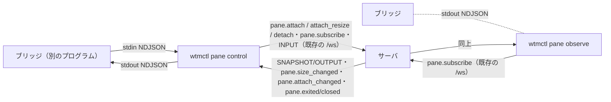

# 調査: `wtmctl pane observe` / `pane control` の土台（既存の購読・流量制御・所有者・CLI）

発火条件（protocol.md「4.5」）: **未検証の既存挙動に依存**——SNAPSHOT が最初の 1 回以外にも届く条件（`full: true` の再送）・大きさの変化のイベントが外部クライアントに届くか・
読み手が遅いときの wtmctl 側のメモリ（stdout の書き出し待ち）・受信を止める手段が `ws` にあるか。autonomous なので実施。
herdr の一次資料は requirements.md「herdr の仕様」に主エージェントが直読した結果を置いた（ここでは繰り返さない）。

## 調査の問い

- Q1: 購読の SNAPSHOT は最初の 1 回だけか。再送されるならその条件は。
- Q2: pane の大きさの変化・終了・所有者の変化は外部クライアント（`wtmctl`）に届くか。その形は。
- Q3: 読み手が遅いとき、サーバと wtmctl のどちらにデータが溜まるか。wtmctl からサーバへの受信を止める手段はあるか。
- Q4: 所有者と大きさの RPC（20260926-pane-direct-connect）は端末（TTY）を前提にしているか。control からそのまま使えるか。
- Q5: 入力の上限・フレームの上限は。
- Q6: 端末への問い合わせの扱い（`pane attach` の既存の部品）は流用できるか。
- Q7: 既存のテストの足場（実サーバ・実 PTY の結合テスト・smoke）は。

## 判明した事実

- F1（Q1）: SNAPSHOT は購読の開始時（`OutputFanout.subscribe` → `startBuffering`）に加え、**流量制御で止めた購読を再開するとき**にも送られる
  （`packages/server/src/terminal/OutputFanout.ts:94-101` の `retryStale` → `startBuffering` → `:113-121` で `sendSnapshot`）。止める条件は、live の購読で
  接続の `bufferedAmount` が 2 MB を超えたとき（`:23`・`:69-73`）か、ミラーの遅れで溜め置きが 2 MB を超えたとき（`:79-85`）。止めている間の出力は捨てる（`:87-89`）。
  再開は `bufferedAmount` とミラーの未処理が 256 KB を下回ったとき（`:24`・`:97`）で、一定間隔で確かめられる（`packages/server/src/ws/WsServerWs.ts:143-156` の `onDrain`・
  `packages/server/src/ws/WsGateway.ts:86-91`）。→ 捨てた出力の代わりに SNAPSHOT（描き直し）が届く。これが `full: true` の 2 回目以降の出所。
- F2（Q2）: サーバのイベントは bus から**全接続へ**送られる（`WsGateway.ts:81-84`）。外部クライアントも受け取る（`pane attach` が `pane.attach_changed`・`pane.exited`・
  `pane.closed` をこの経路で受けている。`packages/cli/src/commands/attach.ts` の `onEvent`）。大きさの変化は `pane.size_changed {paneId, cols, rows}`
  （`packages/protocol/src/events.ts:89-92`・publish は `packages/server/src/session/SessionService.ts:896`）。SNAPSHOT のフレームにもその時点の `cols/rows` がある
  （`packages/cli/src/wsClient.ts` の `onSnapshot(paneId, cols, rows, text)`）。
- F3（Q3）: `WsWtmClient` は `ws` の `message` を受けるたびにすぐ listener を呼ぶ（`wsClient.ts` の constructor）。`process.stdout.write` は書き出し待ちを
  メモリに溜めるだけで止まらない（Node の Writable。戻り値 false と `writableLength`・`drain` イベントで分かる）。→ 何もしないと、読まない読み手のぶんだけ wtmctl のメモリが
  増え続け、サーバの流量制御（F1）は効かない（wtmctl が socket を読み続けるのでサーバの `bufferedAmount` は増えない）。
  `ws` 8.21.3 は `WebSocket.pause()`／`resume()`／`isPaused` を持つ（`node_modules/.pnpm/ws@8.21.3/node_modules/ws/lib/websocket.js:136`・`:347`・`:428`）——socket の読み取りを止める。
  止めれば TCP の背圧でサーバの `bufferedAmount` が増え、F1 の流量制御が働く（出力を捨て、再開時に SNAPSHOT）。止めた後も、既に受け取って溜めてあるぶんのイベントは出うる
  （同 `:347` の pause の実装は socket を止めるだけ）。`WsWtmClient` の constructor の型は `Pick<WebSocket, "on" | "send" | "close">`（`wsClient.ts`）で、pause/resume はまだ使っていない。
- F4（Q4）: `pane.attach {paneId, cols, rows, takeover?}`・`pane.attach_resize`・`pane.detach` はサーバでは端末を前提にしない（`packages/server/src/surface/methods/attach.ts`。
  TTY の検査は CLI の `runPaneAttach` の最初にだけある——`packages/cli/src/commands/attach.ts` の `not_a_tty`）。所有者の表は `SizeAuthority`（`packages/server/src/clients/SizeAuthority.ts`）で
  clientId ごとなので、control と `pane attach` は同じ所有者の表を共有する。奪われると `pane.attach_changed` の `clientId` が別の値になる。接続が切れると `onClientGone` で解放される
  （`WsGateway.ts:124-131`）。`cols/rows` はスキーマで正の整数だけ（上限なし。`packages/protocol/src/messages.ts` の `PaneAttachParams`）。
- F5（Q5）: INPUT フレームは 1 MiB を超えると捨てられ、`registerInvalidFrame`（10 秒 10 回のフラッド対策）に数えられる（`WsGateway.ts:15`・`:105-110`）。
  WebSocket の上限は 4 MB（`WsServerWs.ts:16`）。`MAX_AGENT_PROMPT_BYTES = 1 MiB` は同じ値を protocol に持つ（`messages.ts` の agent への入力の節）。
- F6（Q6）: `TerminalQueryFilter`（`packages/cli/src/attachOutput.ts:23`）は文字列の出力から端末への問い合わせを取り除き、列が区切りをまたいでも持ち越す。`reset()` で持ち越しを捨てる
  （SNAPSHOT のとき）。問い合わせに答えるのはサーバのミラーだけ（同ファイルの冒頭の説明・20260926-pane-direct-connect の decisions D8）。
- F7（Q7）: `packages/cli/src/attach.integration.test.ts` が `composeServerOnFreePort`（`@wtm/server`）の実サーバ・実 PTY の上で `runPaneAttach` を偽の端末で動かしている。
  smoke は `packages/cli/src/smoke.ts` がビルド済みの `dist/main.js` を子プロセスで起動する（`.aidev/config.yml` の 2 本目）。CLI のエラーは `RpcFailure(code)` →
  `reportAndExit` が stderr に JSON・終了コード 1、`CliUsageError` は 2（`packages/cli/src/output.ts`）。

## 影響範囲

- 変えるのは `packages/cli` だけ（新しいコマンド 2 つ・引数・`WtmClient` の受信の一時停止）。サーバ・protocol・web は変えない。

## 実現性 / リスク

- 実現できる（必要な RPC・イベント・フレームは全て既存）。
- リスク: 受信を止めている間はイベント（奪取・pane の終了）の到着も遅れる——読み手が追いつくまで終わりの判定が遅れる。読み手が永久に読まなければ wtmctl は残り続ける
  （サーバ側は F1 で出力を捨てるのでメモリは増えない。イベントのテキストは捨てられず溜まるが量は少ない）。herdr は 30 秒で切る。
- リスク: `pane.attach` の大きさに上限が無い（F4）ので、CLI で絞らないと巨大なミラーを作らせられる（認証済みの利用者に限る。既存の `client.view` も同じ）。

## 実装アンカー

- A1: 購読と SNAPSHOT/OUTPUT の受け取り（`packages/cli/src/commands/attach.ts` の `attachSession`）— `onSnapshot`/`onOutput`/`hello(onEvent)`/`onClose` の使い方と終わり方の組み立て。
- A2: 問い合わせの除去（`packages/cli/src/attachOutput.ts:23` `TerminalQueryFilter`）。
- A3: 受信の一時停止を足す先（`packages/cli/src/wsClient.ts` の `WtmClient` インターフェース・`WsWtmClient` の constructor の型）。
- A4: 引数（`packages/cli/src/cliArgs.ts` の `parsePane` の `attach` の分岐・`USAGE`・`Command`）と入口（`packages/cli/src/main.ts` の `switch`・`printHelp`）。
- A5: 結合テストの足場（`packages/cli/src/attach.integration.test.ts` の `composeServerOnFreePort` の使い方）。smoke（`packages/cli/src/smoke.ts` の attach の手順）。
- A6: 文書（`docs/wtmctl.md` の `pane attach` の節・`docs/herdr-parity.md` の H40 の行）。

## 実装時の注意

- stdin を読み終えたら（終わりの処理で）listener を外して `pause()` する——残すと Node のプロセスが終わらない（`pane attach` の `setRawMode(false)` が `stdin.pause()` しているのと同じ理由）。
- `process.stdout.write` の失敗（読み手が先に閉じた EPIPE）は 'error' で出る。受け手が無いと落ちる（`pane attach` の `processTerminal` は `ignoreError` を張っている）。
- SNAPSHOT の text は文字列、OUTPUT は bytes。UTF-8 の複数バイト文字が OUTPUT の区切りをまたぐので、文字列に戻すなら stream の `TextDecoder` を使い、SNAPSHOT で作り直す
  （`attachSession` の `decoder` と同じ）。
- 自分で `close()` したときは `onClose` が呼ばれない（`wsClient.ts` の `closedBySelf`）。

## design への申し送り

- `full: true` は最初の SNAPSHOT と、流量制御から戻ったときの SNAPSHOT（F1）。
- 読み手が遅いときは wtmctl が `ws` の受信を止めれば、サーバの既存の流量制御に乗る（F3）。書き出し待ちの上限の値を決める。
- `--cols/--rows`・`terminal.resize` の上限は CLI で絞る（F4）。行の上限は INPUT の上限（F5）と揃える。
- control と `pane attach` は所有者の表を共有する（F4）ので、互いに `pane_attached`／`--takeover` が効く。
