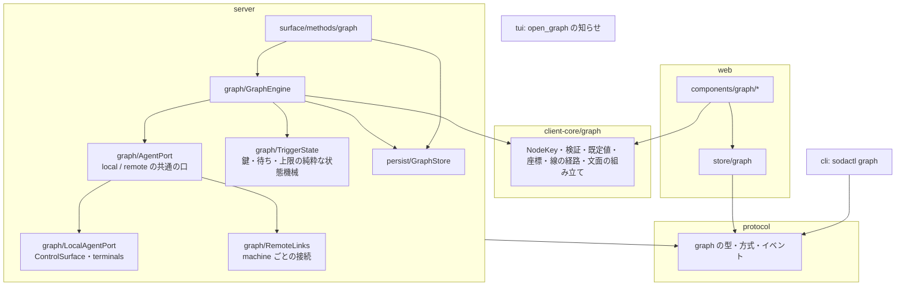
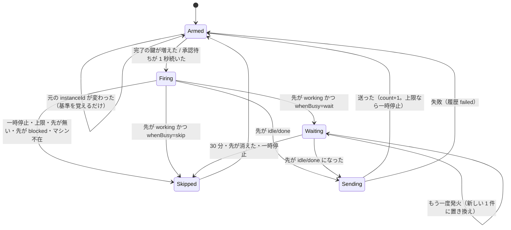

# 設計: agent-graph の構造

## アーキテクチャ概要



- **純粋な部品を分ける**: 「いつ・何を送るか」の判定（`TriggerState`）と文面の組み立て（client-core）は I/O を持たない純粋な関数・クラスにし、単体試験で網羅する。`GraphEngine` は購読と I/O の配線だけ。
- **手元と別のマシンを同じ口で扱う**: `AgentPort`（状態の購読・今の状態・画面の末尾・prompt の送信）を `LocalAgentPort` と `RemoteAgentPort`（`RemoteLinks` の中）が実装する。`GraphEngine` はノードの鍵のマシン部分で口を選ぶだけ。
- **依存の向き**: server → protocol・client-core（`RemoteLinks` が client-core の `Connection` を使う。server はこれまで client-core に依存していなかったので**新しい依存**。client-core は DOM も Node も使わない純粋な TS なので server から使える）。循環なし（client-core は server に依存しない）。

## コンポーネント / モジュール

### server

| モジュール | 責務 | 依存 |
|---|---|---|
| `persist/GraphStore.ts` | `graph.json` の読み書き（0600・原子的・rev・待ち行列・退避）、`stale` の付与、`onChange` | fs・protocol |
| `graph/TriggerState.ts` | 線ごとの実行の状態機械（下の図）。入力: 状態の変化・時刻・先の状態。出力: 「送る／待つ／見送る（理由）」の決定。純粋 | client-core/graph |
| `graph/SupervisorNotifier.ts` | 監督役ごとの「知らせが要る」印・2 秒のまとめ・手が空いたときの送信の決定。純粋 | client-core/graph |
| `graph/AgentPort.ts` | 口の interface（`subscribe(onStatus)`・`status(paneId)`・`tail(paneId, lines)`・`prompt(paneId, text)`・`available()`） | protocol |
| `graph/LocalAgentPort.ts` | 手元: `bus` の `pane.agent_status_changed`・`SessionService` の今の状態・`terminals.get().mirror.bottomLines`・`ControlSurface.invoke("agent.prompt")` | server 内 |
| `graph/RemoteLinks.ts` | マシンごとの `RemoteAgentPort`。`MachineManager.route(id).link.openChannel()` の `LinkChannel` を `WebSocketLike` に合わせる adapter の上に client-core の `Connection`（hello は `external`）。グラフに載っているマシンだけ開き、外れたら閉じる。切断中は `available()=false` | machine・client-core/net |
| `graph/GraphEngine.ts` | 配線: GraphStore の変化で購読の対象を更新、口からの状態の変化を `TriggerState`/`SupervisorNotifier` に流し、決定を実行（prompt・履歴・`count`・上限での一時停止・イベント）。待ちのタイマー。履歴（線ごと直近 50 件、メモリ） | 上の全部・bus |
| `surface/methods/graph.ts` | `graph.get|update|pause|resume|history`。`update` の検証は client-core/graph | GraphStore・GraphEngine |
| `composeServer.ts`（変更） | 読み込み（ロックの後・`agentMonitor.start()` の前）・`session.json` の読み込みの結果で `stale`・flush（handoff・終了） | — |

### client-core/graph

| モジュール | 責務 |
|---|---|
| `nodeKey.ts` | `NodeKey` の組み立て・分解 |
| `validate.ts` | 線とノードの検証（自己参照・重複・監督役 1 つ・上限・prompt の長さ） |
| `defaults.ts` | 既定値（limit 10・whenBusy wait・output 80 行・approval notify） |
| `message.ts` | 文面の組み立て（`{output}` の差し込み・制御文字の除去・監督の知らせ・承認の代理の文面） |
| `geometry.ts` | スナップ・ズームの範囲・全体表示の計算・線の経路（ノードの矩形の縁から縁、重なる線のずらし）・当たり判定 |

### web

| モジュール | 責務 |
|---|---|
| `store/graph.ts` | サーバのグラフ・楽観的な配置（ドラッグ中は上書きしない）・`rev_conflict` での作り直し・履歴 |
| `store/view.ts`（変更） | `graphOpen`（ダイアログとは別の状態）・マシン切り替えで閉じない（グラフは手元のもの） |
| `main.ts`（変更） | `graphOpen` の間は dialog モード・keydown の抑止・閉じるキーの判定 |
| `components/graph/GraphView.vue` | 全画面・ツールバー・パン/ズームの変換・Esc の段階・フォーカスの管理・接続モード |
| `GraphNode.vue`・`GraphEdge.vue`・`LinkPanel.vue`・`PaneChecklist.vue`・`HistoryPanel.vue`・`MobileGraphSheet.vue` | design の表のとおり |
| `components/graph/usePointerDrag.ts` | ドラッグの型（閾値・capture・Esc・lostpointercapture）。ノードの移動と線の作成で使う |
| `actions/ActionDispatcher.ts`（変更） | `open_graph` |

## インターフェース / データモデル

- protocol の型は design のとおり。`AgentPort`:

```ts
interface AgentStatusEvent { paneId: PaneId; agent: AgentInfo | null } // AgentInfo は既存（state・instanceId・completionSeq・kind・name）
interface AgentPort {
  readonly machine: "local" | MachineId;
  available(): boolean;
  onStatus(cb: (e: AgentStatusEvent) => void): Disposable;
  onAvailability(cb: (up: boolean) => void): Disposable;
  status(paneId: PaneId): AgentInfo | null;
  tail(paneId: PaneId, lines: number): Promise<string>;   // 手元は mirror.bottomLines。リモートは sodactl の agent read と同じく pane.subscribe → SNAPSHOT → pane.unsubscribe（packages/cli/src/commands/agent.ts:169-184）
  prompt(paneId: PaneId, text: string): Promise<void>;     // agent.prompt。blocked は例外で返る
}
```

- `TriggerState` の入出力:

```ts
type Input =
  | { kind: "source"; agent: AgentInfo | null; at: number }   // 元の状態の変化
  | { kind: "target"; agent: AgentInfo | null; at: number }   // 先の状態の変化
  | { kind: "tick"; at: number }                              // 1 秒の見回り（承認待ちの 1 秒・待ちの 30 分）
  | { kind: "config"; link: GraphLink; graphPaused: boolean };
type Decision = { kind: "send" } | { kind: "skip"; reason: SkipReason } | { kind: "wait" } | null;
```

## 処理フロー / シーケンス

### トリガの状態機械（線ごと）



### 別のマシン

1. `GraphStore` の変化 → `GraphEngine` が載っているマシンの集合を計算 → `RemoteLinks.ensure(ids)`。
2. `RemoteAgentPort` は開いたら snapshot で各 pane の今の状態を得て、`TriggerState` に「基準」として流す（切れている間の完了で動かない。D1-6）。
3. 切れたら `available()=false` → 発火は `skipped/machine_unavailable`。

## 設計判断

- **`TriggerState` を純粋にする**: 「1 回だけ」「待ち」「上限」の組み合わせが最大のリスク（research の実現性）。時刻を入力にした純粋な状態機械にすれば、変化の列を与えて決定を確かめる試験で網羅でき、負の確認（変異の網羅）もしやすい。退けた案: `GraphEngine` の中にタイマーと if を散らす。
- **`AgentPort` で手元と別のマシンをそろえる**: 手元だけの実装を先に作ってリモートを後から足しても、`GraphEngine` を変えずに済む。退けた案: リモートは中継の上に `sodactl --machine` 相当を呼ぶ（プロセスを起動することになる）。
- **server → client-core の依存を足す**: リモートの接続の再接続・hello・振り分けを写さない。client-core は純粋な TS なので server から使える。
- **履歴はメモリ**: 保存すると `graph.json` が肥大し、送った文面（画面の内容）がディスクに残る。再起動で履歴は消える（docs に書く）。

## tasks への申し送り

subtask に分ける（高結合で 1 PR だが大きい）。直列:

1. **01-graph-core**: protocol の型と方式・client-core/graph（検証・既定値・文面・座標）・`GraphStore`・`graph.*` の方式（実行なし）。`open_graph` の操作表と tui の知らせ。
2. **02-engine-local**: `TriggerState`・`SupervisorNotifier`・`AgentPort`・`LocalAgentPort`・`GraphEngine`（手元の pane だけ）・履歴・上限・一時停止・`stale`。
3. **03-web-graph**: グラフ画面（表示・配置・線の作成と設定・削除・一時停止・履歴・接続モード・モバイルの閲覧）と入口。
4. **04-remote**: `RemoteLinks`・`RemoteAgentPort`・別のマシンのノード（チェックリスト・呼び名）。
5. **05-cli-docs**: `sodactl graph …`・SKILL.md・docs・性能（16 ノード・32 線）の測定。

- 02 は 01 の後、03 は 01 の後（02 と並行できるが、実行の表示〔graph.fired〕の確認は 02 の後）、04 は 02 の後、05 は最後。
- 04 のリモートの画面の末尾は、SNAPSHOT（スクロールバック込み）を 1 回受けて末尾を切り出す。受け渡しのたびに購読するので重い——受け渡しの行数の上限（500）とタイムアウト（5 秒）を置く。
- 各 subtask で `pnpm build`・`typecheck`・vitest を緑に保つ。E2E は依頼が無いので回さない。
