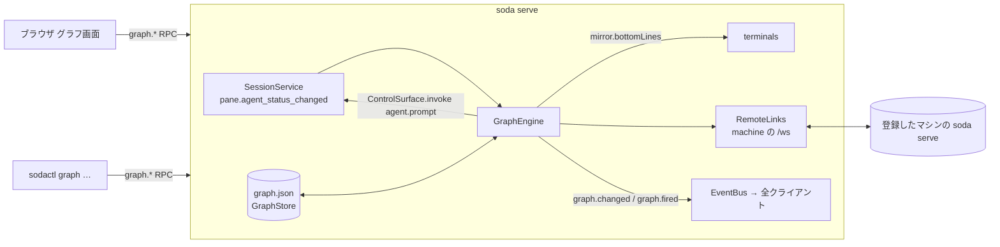
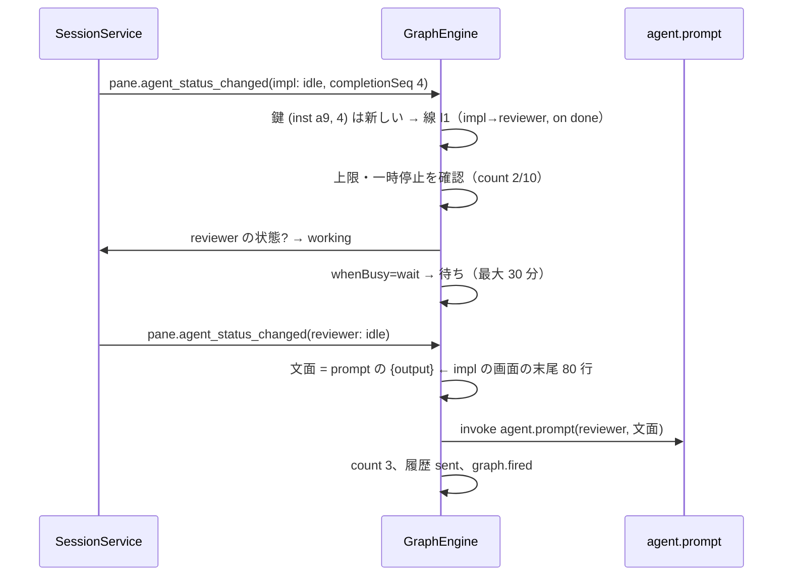

# 仕様: エージェントの連携をノードとして画面で設定する（agent-graph）

## 概要

session（`soda serve`）ごとに 1 枚の**グラフ**をサーバが持つ。ノードは pane（手元か登録したマシンの pane）、線は 3 種類（**トリガ**・**監督**・**承認の代理**）。
サーバの**実行の仕組み（GraphEngine）**がエージェントの状態の変化を購読し、線の設定に従って既存の `agent.prompt` / 画面の末尾の読み取りをサーバの中から呼ぶ。
ブラウザには全画面の**グラフ画面**を足し、ノードの配置・線の作成と設定・一時停止・履歴を扱う。`sodactl graph …` でも同じ操作ができる。方針は decisions D1。



## 設計方針

- **D-1 実行はサーバ**。ブラウザを閉じても動く（要件）。状態の変化は `SessionService.updatePaneRuntime` の 1 か所から出る `pane.agent_status_changed` を購読する（research F2.3）。
- **D-2 既存の方式を中から呼ぶ**。送信は `ControlSurface.invoke({clientId:"graph"}, "agent.prompt", …)`、承認の返答の材料は `mirror.bottomLines(n)`（research F3.1・F3.2）。新しい送信の経路を作らない。
- **D-3 「1 回だけ」は鍵で決める**。完了は `(instanceId, completionSeq)` の増加、承認待ちは blocked が 1 秒続いたこと（research F2.4・D1-2）。鍵は線ごとに覚え、同じ鍵では二度動かない。
- **D-4 保存は `PrefsStore` の形**（`graph.json`・0600・原子的・rev・`graph.changed` を配る。research F4.1）。
- **D-5 別のマシンはサーバからリモートへ接続**。グラフに載っているマシンにだけ、`machines.route(id).link.openChannel()` の上に `client.hello{kind:"external"}` の接続を張り、状態の購読と `agent.prompt` を行う（research F5.1）。切れている間の変化は見送り（D1-6）。
- **D-6 グラフ画面は全画面の重ねもの**（`App.vue` の重ねもの群、`view.graphOpen` の別状態。research F7.1・F7.2）。描画は DOM のノード＋背面の SVG 1 枚、外部ライブラリなし（MVP の D10・research F8.2）。
- **D-7 操作は共有の操作表に `open_graph` を 1 つ足す**。端末版は「ブラウザで開けます」と知らせる（D1-8）。

## 対象範囲

| 区分 | 変更/追加 |
|---|---|
| protocol | `graph.get`・`graph.update`（ノード・線・配置の変更）・`graph.pause`／`graph.resume`（全体・線）・`graph.history`・イベント `graph.changed`・`graph.fired`。`Graph`・`GraphNode`・`GraphLink`・`LinkRun` の型 |
| server | `persist/GraphStore.ts`・`graph/GraphEngine.ts`（状態の購読・鍵・待ち・上限・履歴・監督の知らせ）・`graph/RemoteLinks.ts`（リモートの接続）・`surface/methods/graph.ts`・`composeServer.ts` の配線 |
| client-core | `keys/bindings.ts` に `open_graph`。グラフの純粋な部品（`graph/`：ノードの鍵・線の検証・既定値・座標の計算〔スナップ・ズーム・線の経路〕） |
| web | `components/graph/`（GraphView・GraphNode・GraphEdge・LinkPanel・PaneChecklist・HistoryPanel）・`store/graph.ts`・`store/view.ts`（`graphOpen`）・`main.ts`（キーの経路）・入口（サイドバーのメニュー・モバイルの上部バー）・`ActionDispatcher`（`open_graph`） |
| tui | `TuiDispatcher` の `open_graph`（知らせ） |
| cli | `sodactl graph show|link add|link rm|link pause|link resume|pause|resume|history`・`skills/sodactl/SKILL.md` |
| docs | `docs/graph.md`（使い方）・`docs/sodactl.md`（graph）・`docs/herdr-parity.md`（参照）・`docs/tui-parity.md`（open_graph） |

## 依拠する既存の事実

- pane ID は移動・再起動・handoff で変わらず、`session.json` が無い・壊れていると 1 から振り直す（`packages/server/src/session/SessionModel.ts:96-105`・`:777-806`・`packages/server/src/composeServer.ts:543-548`。research F1.1・F1.2）。
- 状態・完了の数・instanceId の規則と判定の周期（research F2.1・F2.2。`research-server.md` §2 の行）。
- `pane.agent_status_changed` は `SessionService.ts:1050` の 1 か所から出る。
- `ControlSurface.invoke` で方式を中から呼べる。`agent.prompt` は blocked を断り working を断らない（`research-server.md` §3・`packages/server/src/surface/methods/agent.ts`）。
- `EventBus` は購読者の例外を捕まえない（`research-server.md` §3）。
- 保存の手本（`packages/server/src/persist/PrefsStore.ts`）と配線（`composeServer.ts` の prefs の読み込みと flush）。
- リモートへの接続の口（`packages/server/src/machine/MachineManager.ts` の `route`・`link.openChannel()`）と手本（`packages/client-core/src/net/MachineSummaryClient.ts`）（research F5.1）。
- web の差し込み口・ダイアログの 1 枠・dialog モードのキー・ドラッグの型・描画の色（research F7.1〜F7.6・`research-web.md` の各行）。
- 操作の追加で tui の網羅（`packages/tui/src/actions/TuiDispatcher.ts:237-239`）と件数の試験が壊れる（research F7.4）。
- sodactl の USAGE と SKILL.md の一致の試験（`packages/cli/src/skill.test.ts`。research A10）。
- **未確認**: リモートの接続を常時張ったときの負荷（登録マシンが多い場合）。→ グラフに載っているマシンだけに張る。

## インターフェース / データ構造

### protocol

```ts
type NodeKey = `${"local" | MachineId}:${PaneId}`;         // 例 "local:p3"・"a1b2…(32hex):p7"
interface GraphNode { key: NodeKey; x: number; y: number }  // 位置はグリッド 20px 単位の座標（ズーム前）
type LinkKind = "trigger" | "supervise" | "approval";
interface TriggerConfig {
  on: "done" | "blocked";
  prompt: string;                   // {output} を含めば、そこへ元の画面の末尾を差し込む
  output: { lines: number } | null; // null = 受け渡さない。lines は 1〜500（既定 80）
  whenBusy: "wait" | "skip";        // 既定 "wait"（D1-1）
}
interface ApprovalConfig { mode: "delegate" | "notify"; lines: number } // 監督役に返答まで任せる／知らせるだけ
interface GraphLink {
  id: string;                       // "l1"…（サーバが採番）
  kind: LinkKind;
  from: NodeKey;                    // trigger: 元 / supervise・approval: 配下
  to: NodeKey;                      // trigger: 先 / supervise・approval: 監督役
  trigger?: TriggerConfig;
  approval?: ApprovalConfig;
  limit: number;                    // 1〜100、既定 10（D1-4）
  count: number;                    // 今の実行回数（サーバが数える）
  paused: "user" | "limit" | null;
}
interface Graph { rev: number; paused: boolean; nodes: GraphNode[]; links: GraphLink[] }
interface LinkRun {                 // 履歴（サーバのメモリに線ごと直近 50 件＋graph.json には保存しない）
  linkId: string; at: number;
  result: "sent" | "waiting" | "skipped" | "failed";
  reason?: "busy_timeout" | "target_absent" | "blocked" | "paused" | "machine_unavailable" | "limit" | "error";
  text?: string;                    // 送った文面の先頭 200 文字
}
"graph.get": {} → Graph
"graph.update": { baseRev: number; ops: GraphOp[] } → Graph   // 配置の移動・ノードの追加/除去・線の追加/変更/削除（まとめて 1 rev）
"graph.pause" / "graph.resume": { linkId?: string } → Graph   // linkId 無し＝全体。resume は count を 0 に戻す
"graph.history": { linkId?: string; limit?: number } → { runs: LinkRun[] }
event "graph.changed": { graph: Graph; byClientId: string | null }
event "graph.fired": { run: LinkRun }
```

- `graph.update` は `baseRev` が今の rev と違えば `rev_conflict` で断る（配置のドラッグが他のブラウザの変更を黙って消さないため。クライアントは受け取った最新で作り直して送り直す）。
- 線の検証: 自分自身への線は不可。同じ `(kind, from, to)` の重複は不可。監督・承認の代理は `to`（監督役）が 1 つの `from` につき 1 本まで。ノードの上限 64・線の上限 128・prompt 8KB。

### server

- `GraphStore`: `graph.json`（状態ディレクトリ・0600）。`PrefsStore` と同じ待ち行列・原子的な書き込み・壊れていれば退避。
  **起動時に `session.json` が読めなかった（ID を振り直した）なら、手元のノードをすべて「無効」にして読み込む**（`GraphNode` に `stale: true` を付け、線は動かさない。利用者がノードを選び直すか除去するまで。research F1.2）。
- `GraphEngine`:
  - 購読: `pane.agent_status_changed`（手元）と各 `RemoteLink` のイベント。購読者は try/catch（research F3.3）。
  - 鍵の記録: 線ごとに `lastDone: {instanceId, completionSeq}`・`blockedSince`。完了は同じ instanceId で completionSeq が前より大きいときだけ。instanceId が変わった直後の値は「基準」として覚えるだけで動かない（再起動・再検出で 0 に戻るため）。承認待ちは blocked が 1 秒続いたら 1 回、blocked を抜けたら次に備える。
  - 実行（トリガ）: 上限と一時停止を確かめ → 先のエージェントの状態を見る → working なら `whenBusy` に従い待つ（最大 30 分。先が idle/done になった時点で送る。待つ間の新しい発火は 1 件に置き換え）／見送る → 文面を作る（`{output}` に元の `mirror.bottomLines(lines)`〔ANSI を除く〕） → `agent.prompt` → 結果を履歴に。`count` を増やし、上限なら `paused:"limit"` にして `graph.changed` と知らせ。
  - 監督: 監督の線の追加・削除・配下のノードの無効化があったら「知らせが要る」に印を付け、監督役の手が空いたら（idle/done）次の文面を `agent.prompt` で送る。続く変化は 1 回にまとめる（2 秒の待ち）。
    文面（日本語）: 「あなたは Sodashitsu の監督役です。配下: impl（pane p3・claude・手元）, reviewer（pane p7・codex・マシン box）。`sodactl agent prompt|wait|read|send-keys <pane>`（別のマシンは `--machine <名前>` を付ける）で指示・待機・読み取りができます。詳しくは `sodactl skill`。」
  - 承認の代理: 配下が blocked（1 秒）になったら、監督役へ「配下 impl（p3）が承認待ちです。画面の末尾: …（lines 行）。」＋ `delegate` なら「`sodactl agent send-keys p3 <キー>` で答えてください」／`notify` なら「返答は利用者が行います」。人への通常の通知は既存のまま。
  - 別のマシン: 元・先・配下・監督役がリモートなら `RemoteLinks` 経由で購読・送信。接続が無い間の発火は `skipped/machine_unavailable`（D1-6）。
- `RemoteLinks`: グラフに載っているマシンごとに 1 本、`openChannel()` の上に `WebSocketLike` の adapter を置き、client-core の接続で `client.hello{kind:"external"}`・イベントの購読・`agent.prompt`。マシンが外れたら閉じる。
- 方式: `surface/methods/graph.ts`（`graph.get|update|pause|resume|history`）。認証済みの接続だけ（既存の surface と同じ）。
- 終了・handoff: `GraphStore` を flush。待ちのタイマーは止める（待っていた発火は履歴に `skipped/error` として残らないよう、停止の前に「待ちを取り消した」を記録）。

### web

| 部品 | 役割 |
|---|---|
| `store/graph.ts` | `graph.get`・`graph.changed`・`graph.fired` を受ける。楽観的な配置の変更（ドラッグ中はサーバの値で上書きしない。Splitter と同じ） |
| `GraphView.vue` | 全画面の `role="dialog"`。ツールバー（全体の一時停止/再開・pane を載せる・全体表示・ズーム・閉じる）、SVG の線の層、DOM のノードの層、右のパネル（線の設定・履歴） |
| `GraphNode.vue` | pane の呼び名・マシン・エージェント名と種類・状態の印（`StateIcon`）・入口のハンドル（線を作る）・「pane へ移動」。`role="group"`＋`aria-roledescription="ノード"` |
| `GraphEdge.vue` | 線（種類ごとに色・線種・矢印の形・ラベル）、中点のチップ（`<button>`。回数/上限・一時停止の印） |
| `LinkPanel.vue` | 線の設定（種類・トリガの状態・prompt・受け渡す行数・作業中の扱い・上限・承認の扱い）。保存・取り消し・削除 |
| `PaneChecklist.vue` | pane を載せる/外すチェックリスト（手元・マシンごと） |
| `HistoryPanel.vue` | 履歴（時刻・線・結果・理由・文面の先頭） |
| `client-core/graph/` | 座標（スナップ 20px・ズーム 0.25〜2・全体表示）・線の経路（直線＋矢印。重なる線はずらす）・検証・既定値 |

- 入口: 操作 `open_graph`（既定のキーは prefix+`a`。空きキーの候補から。research F7.4）・サイドバーのメニュー「連携（グラフ）」・モバイルの上部バーのメニュー。
- キーの経路: `view.graphOpen` の間は dialog モード。グラフ画面の keydown で「開いたのと同じ prefix＋キー」を keymap で判定して閉じる（research F7.3）。
- 別のマシンを見ている間も、グラフは手元のサーバのもの（手元の軽い接続で `graph.*`）。

## 振る舞いの詳細

### 操作（research-ui の推奨）

- 開く: `open_graph`（prefix+a）・メニュー。開くと直前の pane のノード（無ければ先頭）へフォーカス。閉じる: 同じキー・`Esc`（1 段ずつ：接続中の取り消し → パネル → 選択 → 画面）・閉じるボタン。閉じたら開く前の pane へ。
- ノードを載せる: ツールバーの「pane を載せる」→ チェックリスト。外すときは確認（消える線の本数を書く）。
- 移動: ドラッグ（4px から）で 20px グリッドにスナップ（`Alt` で外す）。選んだノードは矢印キーで 1 グリッド、`Shift`＋矢印で 5。
- パン・ズーム: 空白のドラッグ／ホイールでパン、`Ctrl`/`⌘`＋ホイール・ピンチでズーム。`1` で全体表示、`+`/`-`/`0`。
- 線を作る: ノードの右のハンドルからドラッグ → 別のノードの上で離す → 右のパネルが「新しい線」で開く（保存するまでサーバへ送らない）。空白で離す・`Esc` は作らない。
  キーだけ: ノードを選んで `c` → 接続モード（先の候補を Tab/矢印で選ぶ）→ `Enter` でパネル、`Esc` で取り消し。
- 選択: クリック・Tab。単一選択。
- 設定の保存: 保存ボタン・`Ctrl+Enter`（prompt の欄の Enter は改行）。`Esc`・外側のクリックは取り消し（変更があれば「変更を捨てますか」の確認）。
- 削除: 線を選んで `Delete`/`Backspace` またはパネルの削除 → 確認（既定のフォーカスは「取り消す」）。
- 一時停止: ツールバーの全体、線のチップ・パネルの線ごと。上限に達した線は `⏸ 上限` の印と、画面の下の知らせ（既存のトースト）。
- 実行の表示: `graph.fired` で線が 1.5 秒光り、チップの回数が増える。`prefers-reduced-motion` では動かさず太さと色だけ。
- ノードから pane へ: ノードのボタン・`Enter`（ノード選択中）で、そのマシンのその pane へ移動（グラフ画面を閉じる）。
- モバイル: 閲覧（1 本指パン・2 本指ピンチ・ボタン）と、線/全体の一時停止・再開だけ（タップで下からのシート）。編集はしない（要件）。

### 線の種類の見た目（色だけに頼らない。WCAG 1.4.1）

| 種類 | 線 | 矢印 | ラベル |
|---|---|---|---|
| トリガ | 実線（受け渡しありは太線） | ▶ | 「完了→」「承認待ち→」 |
| 監督 | 破線（監督役→配下の向きで描く） | ◆ | 「監督」 |
| 承認の代理 | 点線 | ● | 「承認」 |

色はテーマの既存の値（accent・warn・state-*。research F7.5）。無効（pane が無い・`stale`）は灰色＋`⚠`。

### 状態の変化と実行（sequence）



## ドメイン固有の考慮

- プロンプトの注入: 受け渡す出力は元のエージェントの画面そのもの（元が出した文章が先の指示になる）。これは利用者が線で明示した連携の本質で、防げない。docs に「受け渡しは画面の文章をそのまま次のエージェントへ渡す」と書き、上限と一時停止で止められることを明記する。制御文字は落とす（ANSI・C0・C1）。
- 監督役の `delegate` は、監督役のエージェントが承認に答える＝人の承認を機械に任せること。既定は `notify`（知らせるだけ）にし、`delegate` を選ぶときパネルに注意を出す。
- 別のマシンでのサーバの接続は、手元の `soda serve` の権限でリモートを操作する（既存の `--machine` の中継と同じ信頼の範囲）。

## エラー処理 / 異常系

| 事象 | 扱い |
|---|---|
| 先のエージェントが居ない（pane が無い・エージェントが検出されていない） | `skipped/target_absent` |
| 先が blocked | `skipped/blocked`（承認待ちのエージェントへ prompt を送らない。既存の `agent_blocked`） |
| 待ち 30 分超え | `skipped/busy_timeout` |
| リモートが繋がっていない | `skipped/machine_unavailable` |
| `agent.prompt` の失敗 | `failed/error`（メッセージを履歴に） |
| `graph.update` の rev の不一致 | `rev_conflict`（web は最新で作り直して再送、パネルの編集中なら「他で変わりました」の知らせ） |
| `session.json` が読めなかった起動 | 手元のノードを `stale`（線は動かない）（research F1.2） |
| `graph.json` が壊れている | 退避して空のグラフで起動、warn ログ |
| 線が参照するノードが除かれた | 線も一緒に削除（除く前の確認で本数を示す） |

## 受け入れ基準との対応

- AC1: `GraphView`・`open_graph`・サイドバーのメニュー。ノードの中身は `store/session`・`machines` の要約（呼び名が無い別のマシンの pane は `pane <id>`）と `StateIcon`。2 秒以内は既存の状態の反映の周期（research F2.1）。
- AC2: ノードのドラッグ → `graph.update`（配置）→ `graph.json`。pane への移動は既存の focus の方式。
- AC3: ハンドルのドラッグ・接続モード → `LinkPanel` → `graph.update`（線の追加・変更・削除）。
- AC4: `GraphEngine` の完了の鍵（D-3）と `agent.prompt`。ブラウザ不要（サーバで動く）。
- AC5: `whenBusy`（wait/skip）・`target_absent`・`blocked` の扱いと履歴。
- AC6: `TriggerConfig.output`（`mirror.bottomLines`）と `{output}`。
- AC7: 監督の線 → 監督役への prompt（手が空いたとき・変化で知らせ直し）。監督役は既存の sodactl で操作。
- AC8: 承認の代理 `delegate` → 監督役への prompt（材料＋send-keys の指示）→ 監督役の `sodactl agent send-keys` で解ける。
- AC9: `notify` → 知らせだけ。人への通知は既存の web の通知のまま。
- AC10: `graph.fired` → 線の光りとチップ、`graph.history` → `HistoryPanel`。
- AC11: `limit`・`count`・`paused:"limit"`・トースト。
- AC12: `graph.pause`/`resume`（全体・線）。一時停止中は GraphEngine が発火を `skipped/paused` にする。
- AC13: `GraphStore`（再起動で復元）・`stale` の扱い・ノードの除去で線も除去（確認つき）。閉じられた pane の線は「無効」表示。
- AC14: `RemoteLinks` と `NodeKey` の machineId、`machine_unavailable`。
- AC15: `sodactl graph …` と SKILL.md。
- AC16: `graph.changed` を全クライアントへ。
- AC17: 16 ノード・32 線の描画（SVG 1 枚＋DOM）と、状態の変化から発火までの測定（試験で時刻を測る）。
- AC18: `graph.*` は認証済みの surface だけ。
- AC19: 既存の試験がそのまま通る。操作表の件数の試験は 1 増やす。
- AC20: モバイルの閲覧と一時停止・再開（下からのシート）。
- AC-I1: prefix+a／メニューで開き、同じキー・Esc（段階）・閉じるボタンで閉じる。パネル・チェックリストは Esc・外側で閉じ、保存しなければ変わらない。
- AC-I2: 保存（ボタン・Ctrl+Enter）・Esc で取り消し。削除・ノードの除去は確認。ドラッグ中の Esc・空白で離すは作らない。
- AC-I3: Tab でノード・チップ、矢印で移動、`c` の接続モード、Enter で設定、Delete で削除、ツールバーのボタン。
- AC-I4: 開いたら直前の pane のノード、パネルを閉じたら線のチップ、画面を閉じたら開く前の pane、ノードから移動したらその pane。
- AC-I5: `graphOpen` の間は dialog モード（キーは xterm へ行かない）、ホイールはグラフのパン/ズームだけ（`passive:false` で preventDefault）。
