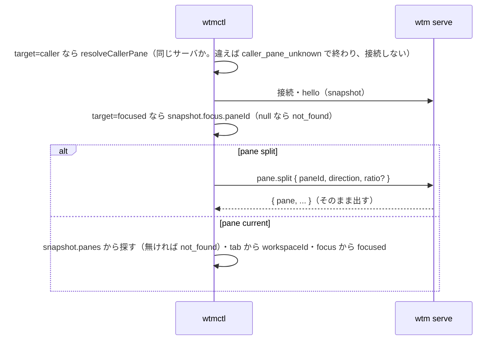

# 仕様: 呼び出し元の pane を既定の対象にする（`wtmctl pane current`・`pane split` の対象の省略・`--pane`・`--current`）

## 概要

wtmctl の CLI（`packages/cli`）だけを変える。`pane split` と新しい `pane current` の対象を、位置引数・`--pane <paneId>`・`--current`・省略の 4 通りで受け、
引数の解釈の段階で「明示の ID」「呼び出し元の pane」「フォーカスの pane」の 3 種類の**対象の指定**（`PaneTarget`）にする。実行の段階で、呼び出し元の pane は
接続する前に同じサーバかを確かめて（`self_target` と同じ判定）ID に解決し、フォーカスの pane は接続後の hello の snapshot（`focus.paneId`）で解決する。
`pane current` はその pane を hello の snapshot から探し、今の `tabId`・`workspaceId`・`focused` を付けて出す。サーバ・プロトコル・web は変えない。
`WTM_WORKSPACE_ID`・`WTM_TAB_ID` は足さない（decisions.md D2）。

## 設計方針

- **対象の指定を引数の解釈で決め、ID への解決は実行時に行う**。解釈の段階は環境（`WTM_PANE_ID`）を知っているが接続先の snapshot を知らない。実行の段階は
  snapshot を知る。`--machine` の前置き（`parseMachinePrefixed`）は内側のコマンドを解釈した後に `caller` を外す作りなので、そこで対象の指定も
  「呼び出し元 → フォーカス」に置き換える（`--current` なら使い方の誤り）。
- **同じサーバかの判定は `self_target` のものをそのまま使う**（`selfGuard.ts` の `selfPaneId`。URL の origin の比較・ループバックの名前は同じとみなす）。
  判定を 2 つ持つと、片方だけ直されて「歯止めは効くのに `--current` は別のサーバの pane を指す」等の食い違いが起きる。確かめられないとき、
  `self_target` は「効かせない」側に倒す（歯止めを外す）が、呼び出し元の pane の解決は「断る」側に倒す（別のサーバの同じ ID の pane を操作しないため）。
  向きが逆なのは、どちらも「確かでないときに、別のサーバの pane を自分とみなさない」という同じ原則から出る。
- **pane の中での省略は、確かめられなければ断る**（フォーカスの pane に落とさない）。具体的な破綻例: pane の中で `WTMCTL_URL=https://myhost.lan:7780`
  （証明書の名前。同じサーバだが判定では確かめられない）を export しているエージェントが `pane split --direction right` を打つと、フォーカスに落とす作りでは
  **利用者が今ブラウザで見ている別の workspace の pane** が分かれる。herdr は接続先を socket のパス（`HERDR_SOCKET_PATH`）で決め、URL の名前の違いで同じサーバが別に見えることが無い（推論。decisions.md D1 の直読の範囲外）。
- `--current` と対象の明示（位置引数・`--pane`）は 1 つだけ受ける（herdr は後に書いたものが勝つ。本製品は取り違えを防ぐため誤りにする。docs の違いに書く）。
- `pane current` の出力は、既存の `Pane`（camelCase。`snapshot` の `.panes[]` と同じ）に `workspaceId`・`focused` を足した `{"pane": {...}}`。
  herdr の `.result.pane` は `.pane` に当たる（既存の agent の出力と同じ読み替え）。

## 対象範囲

- `packages/cli/src/cliArgs.ts`: `PaneTarget` 型・`Command` の `pane-split` の `paneId` を `target` に置き換え・`pane-current` を追加・`parsePaneTarget`・
  `USAGE_LINES` の `pane split` の行の変更と `pane current` の行の追加・`parseMachinePrefixed` での置き換え。
- `packages/cli/src/paneTarget.ts`（新規）: 実行時の解決（`resolveCallerPane`・`resolveFocusedPane`・`paneTargetIdBeforeConnect`）。
- `packages/cli/src/selfGuard.ts`: `selfPaneId` を export（中身は変えない）。
- `packages/cli/src/commands/pane.ts`: `runPaneSplit` を `target` に対応・`runPaneCurrent`（新規）。
- `packages/cli/src/main.ts`: `pane-current` の分岐・help の説明の行。
- `packages/cli/src/smoke.ts`: pane の中の環境を与えた `pane current`・対象を省いた `pane split` の確認。
- `cliArgs.ts` の既存の `parsePane`（`split`・`current` の分岐）。既存の結合テストの `pane-split` の組み立て（`main.integration.test.ts`・`agent.integration.test.ts`）も `target` に直す。
- テスト: `cliArgs.test.ts`・`cliArgs.machine.test.ts`・`commands/pane.test.ts`・`paneTarget.test.ts`（新規）・`paneCurrent.integration.test.ts`（新規）。`skill.test.ts` は変えない（`USAGE_LINES` から自動で拾う）。
- 文書: `packages/cli/skills/wtmctl/SKILL.md`・`docs/wtmctl.md`・`docs/herdr-parity.md`（H39）。

## 依拠する既存の事実

- pane の環境の `WTM_PANE_ID`・`WTM_SERVER_URL` はサーバが入れ、サーバを起動した環境の古い値は取り除く（`packages/server/src/session/paneEnv.ts` の
  `PANE_ENV_DROPPED`・`buildPaneEnv`）。workspace・tab の ID は入れない（同）。
- wtmctl は `WTM_PANE_ID` と `WTM_SERVER_URL` がどちらも空でないときだけ `opts.caller` を持つ（`packages/cli/src/cliArgs.ts` の `globalOptsFrom`）。
  既存のテストが `WTM_SERVER_URL` だけ欠けた環境で `caller` を持たないことを確かめている（`packages/cli/src/cliArgs.test.ts` の「なら caller を持たない（AC13）」）。
- 同じサーバかの判定は `selfPaneId`（`packages/cli/src/selfGuard.ts`。`serverKeyOf` で origin を比べ、ループバックの名前を同一視、読めなければ undefined）。
- `--machine <sel>`（`local` 以外）は内側のコマンドを `parseArgs(rest, env)` で解釈した後、`opts.caller` を外して `opts.machine` を付ける
  （`packages/cli/src/cliArgs.ts` の `parseMachinePrefixed`）。`local` はそのまま返す。
- pane を別の tab・workspace へ移しても pane の ID は変わらず `tabId` だけが変わる（`packages/server/src/session/SessionService.ts` の `moveToTab`・`moveToNewTab`。
  移動後に同じ ID の `pane.updated` を配る）。hello の snapshot は接続した時点のサーバの状態（`packages/cli/src/wsClient.ts` の `hello`。未確認: 移動を
  hello で読み直す結合テストは本 work で足す〔AC6〕）。
- RPC `pane.move_to_new_tab` がある（`packages/server/src/surface/methods/pane.ts` の `surface.register("pane.move_to_new_tab"`）。結合テストのサーバは
  既存の結合テストと同じ `composeServerOnFreePort`（`@wtm/server`。`packages/cli/src/paneEnv.integration.test.ts` が使っている）。
- `selfPaneId` は `opts.caller` が無い（`WTM_SERVER_URL` が無い・空）とき undefined を返し、`assertNotSelfPane` 等はそのとき何もしない＝歯止めを外す
  （`packages/cli/src/selfGuard.ts` の `selfPaneId` の `if (caller === undefined) return undefined` と `assertNotSelfPane` の `self !== undefined &&`）。
- サーバ全体のフォーカスは `SessionSnapshot.focus`（`{workspaceId, tabId, paneId} | null`。`packages/protocol/src/model.ts` の `SessionFocus`）。フォーカスの
  workspace を閉じると残りの最初の workspace に移り、workspace が 1 つも残らなければ null（`packages/server/src/session/SessionModel.ts` の workspace の削除の
  `this.focus = null` の直後）。null は起動直後の短い間等に限られる（未確認: 実運用で null になる経路の網羅はしていない。単体テストで null を与えて確かめる）。
- `pane.split` は存在しない pane に `not_found` を返す（未確認: サーバの `pane.split` のエラーの code は本 work では変えず、そのまま出す）。
- `Tab.workspaceId` がある（`packages/protocol/src/model.ts` の `Tab`）。agent の出力は tab から workspace を引いて `workspaceId` を足している
  （`packages/cli/src/commands/agent.ts` の `workspacesByTab`・`viewOf`。tab が見つからなければ `workspaces.get(...) ?? null` で null）。
- `skill.test.ts` は `USAGE_LINES` の各行の先頭のコマンドが skill の本文に出ること・本文のコマンドが実在することを確かめる（`packages/cli/src/skill.test.ts` の AC3・AC4）。
- herdr の挙動は decisions.md D1 の直読のとおり。

## インターフェース / データ構造

```ts
// cliArgs.ts
/** pane の対象の指定（20260927-caller-pane-default）。 */
export type PaneTarget =
  | { kind: "id"; paneId: string }                          // 位置引数・--pane
  | { kind: "caller"; paneId: string; explicit: boolean }   // --current（explicit）・pane の中での省略。paneId は WTM_PANE_ID
  | { kind: "focused" };                                    // pane の外・--machine（local 以外）での省略

// Command に
| { kind: "pane-split"; opts: GlobalOpts; target: PaneTarget; direction: "right" | "down"; ratio: number | undefined }   // paneId → target
| { kind: "pane-current"; opts: GlobalOpts; target: PaneTarget }

// USAGE_LINES
"wtmctl pane split [<paneId>|--pane <paneId>|--current] --direction right|down [--ratio <0.05-0.95>] [--url <URL>] [--token <TOKEN>]"
"wtmctl pane current [--pane <paneId>|--current] [--url <URL>] [--token <TOKEN>]"   // pane split の次に置く
```

```ts
// paneTarget.ts
/** 呼び出し元の pane の ID。接続先がその pane のサーバだと確かめられなければ caller_pane_unknown（接続前に呼ぶ）。 */
export function resolveCallerPane(opts: GlobalOpts, target: Extract<PaneTarget, { kind: "caller" }>): string;
/** snapshot のフォーカスの pane の ID。無ければ not_found。 */
export function resolveFocusedPane(snapshot: SessionSnapshot): string;
/** 接続前に決まる ID（id・caller）。focused なら undefined（接続後に resolveFocusedPane）。 */
export function paneTargetIdBeforeConnect(opts: GlobalOpts, target: PaneTarget): string | undefined;
```

`pane current` の出力（1 行の JSON）:

```json
{"pane": { "id": "p3", "tabId": "t2", "label": null, "cwd": "...", "...": "（Pane の全項目）", "workspaceId": "w2", "focused": false }}
```

```ts
// commands/pane.ts（既存の run* と同じ形。client は withSession が渡す WtmClient。テストは withSession を差し替えて偽の client を渡し、request の呼び出しを観測する）
export async function runPaneSplit(cmd: Extract<Command, { kind: "pane-split" }>, store: SessionStore): Promise<void>;
export async function runPaneCurrent(cmd: Extract<Command, { kind: "pane-current" }>, store: SessionStore): Promise<void>;
```

`workspaceId` は snapshot の tab から引き、見つからなければ `null`（agent の出力と同じ）。`focused` は `snapshot.focus?.paneId === pane.id`。

## 振る舞いの詳細

### 引数の解釈（`parsePaneTarget(positional, values, bools, env)`）

| 位置引数 | `--pane` | `--current` | `WTM_PANE_ID` | 結果 |
|---|---|---|---|---|
| あり | — | — | — | `id`（位置引数） |
| — | あり | — | — | `id`（`--pane` の値） |
| — | — | あり | 空でない | `caller`（explicit） |
| — | — | あり | 無い・空 | 使い方の誤り「`--current requires WTM_PANE_ID (run inside a wtm pane)`」 |
| — | — | — | 空でない | `caller`（explicit でない） |
| — | — | — | 無い・空 | `focused` |
| 2 つ以上 | | | | 使い方の誤り「`use only one of <paneId>, --pane and --current`」 |

- `pane current` は位置引数を取らない（herdr と同じ。余れば使い方の誤り）。`pane split` は位置引数を 1 つまで。
- `--pane` の値が無い・`--` で始まるのは既存の `parseFlags` の「値が要る」誤り。

### `--machine` の前置き

`parseMachinePrefixed` で、選んだマシンが `local` 以外のとき、内側のコマンドが `target` を持てば:
- `caller` かつ explicit → 使い方の誤り「`--current cannot be used with --machine (the calling pane belongs to this machine)`」。
- `caller` かつ explicit でない → `focused` に置き換える（そのマシンのフォーカス。herdr の `caller_pane_id` が None になるのと同じ）。
`local` では置き換えない。

### 実行（`runPaneSplit`・`runPaneCurrent`）



- `pane split` は分けた結果（サーバの応答）をそのまま出す（既存と同じ）。自分の pane を分けるのは断らない（`self_target` の対象外のまま）。
- `pane current` は読むだけで、hello 以外の要求を送らない。
- `caller_pane_unknown` の文面: `cannot use the calling pane (WTM_PANE_ID=<id>): cannot confirm that <url> is the server running this pane (WTM_SERVER_URL=<値 か (unset)>); pass the pane ID with --pane`。

## ドメイン固有の考慮

- 自分の pane の歯止め（`self_target`）: `pane split`・`pane current` は元から歯止めの対象外（分ける・読むだけ）。歯止めの対象の 10 コマンド
  （`pane close`・`input`・`run`・`attach`・`control`・`tab close`・`workspace close`・`agent prompt`・`send-keys`・`start`）には `--current` を足さない
  （足しても必ず断られる。decisions.md D1 の代替案 A）。`selfGuard.ts` の判定の中身は変えない。
- 秘密: 追加の環境変数・出力に token・cookie は入らない。
- 後方互換: `pane split <paneId> --direction …` は今までどおり `id` になる。

## エラー処理 / 異常系

| 状況 | 結果 |
|---|---|
| 対象の指定が 2 つ以上 | 使い方の誤り（終了コード 2）・接続しない |
| `pane current` に位置引数・`pane split` に位置引数が 2 つ以上・`--pane` の値が無い（`--` で始まる） | 使い方の誤り（2）・接続しない |
| `--current` で `WTM_PANE_ID` が無い | 使い方の誤り（2）・接続しない |
| `--machine`（local 以外）で `--current` | 使い方の誤り（2）・接続しない |
| 呼び出し元の pane を使うが同じサーバだと確かめられない（別の origin・`WTM_SERVER_URL` が無い・読めない URL） | `caller_pane_unknown`（1）・接続しない |
| フォーカスの pane が無い | `not_found`（1）・`pane.split` を送らない |
| `pane current` の対象が snapshot に無い | `not_found`（1） |
| `pane split` の対象が無い | サーバの `pane.split` の誤りをそのまま（既存と同じ） |

## 受け入れ基準との対応

- AC1: 入力は環境の `WTM_PANE_ID`・`WTM_SERVER_URL` と接続先の URL。解釈で `caller`（explicit でない）→ `resolveCallerPane` が `selfPaneId` で同じサーバを確かめて
  `WTM_PANE_ID` → `pane.split` の `paneId`。単体テスト（`commands/pane.test.ts`）と smoke（AC17）で確かめる。
- AC2: 入力は argv。解釈表のとおり `--current`→`caller`（explicit）、`--pane p2`・位置引数 `p2` → `id`。`cliArgs.test.ts` と `commands/pane.test.ts`。
- AC3: 入力は argv。解釈表の「2 つ以上」。`cliArgs.test.ts`（`CliUsageError`）。解釈で投げるので接続しない。
- AC4: 入力は argv と環境（`WTM_PANE_ID` 無し）。解釈表。`cliArgs.test.ts`（文面に `WTM_PANE_ID`）。
- AC5: 入力は hello の snapshot（`panes`・`tabs`・`focus`）。`runPaneCurrent` の出力の形。`commands/pane.test.ts`。
- AC6: 入力は接続時のサーバの状態。実サーバで pane を別の tab へ移した後の `pane current` を結合テスト（`paneCurrent.integration.test.ts`。実サーバ〔`composeServerOnFreePort`〕と CLI の `runPaneCurrent`。`pane.move_to_new_tab` で移す）で
  確かめる。環境変数は起動時の値のまま変わらないが、`tabId`・`workspaceId` は hello の snapshot から毎回引くので移動後の値になる。
- AC7: 入力は argv の `--pane p2` と snapshot。snapshot に無い pane は `not_found`。`commands/pane.test.ts`。
- AC8: `runPaneCurrent` は `client.request` を呼ばない（hello だけ）。`commands/pane.test.ts` で `request` が呼ばれないことを確かめる。
- AC9: 入力は `opts.url`・`opts.caller`（`WTM_SERVER_URL`）。`resolveCallerPane` が `selfPaneId` の undefined を `caller_pane_unknown` にする。接続前に投げるので
  `withSession` を呼ばない。`paneTarget.test.ts`・`commands/pane.test.ts`（別の origin・`WTM_SERVER_URL` 無し・明示の ID なら通る）。
- AC10: 入力は argv の `--machine` と環境。`parseMachinePrefixed` の置き換え。`cliArgs.machine.test.ts`。
- AC11: 同上（`local` は置き換えない）。`cliArgs.machine.test.ts`。
- AC12: 入力は環境（`WTM_PANE_ID` 無し）と hello の snapshot の `focus`。解釈で `focused` → `resolveFocusedPane`。`commands/pane.test.ts`・`paneTarget.test.ts`。
- AC13: 入力は snapshot の `focus: null`。`resolveFocusedPane` が `not_found`。`pane split` は `pane.split` を送らない。`commands/pane.test.ts`。
- AC14: `selfGuard.ts` の判定は変えず export だけ。既存の歯止めのテスト（`selfGuard.test.ts`・各 `commands/*.test.ts`）が変更なしで通ること、`pane split` の `caller` で
  自分の pane を分けられることを `commands/pane.test.ts` で確かめる。
- AC15: `USAGE_LINES`・help の説明・skill・`docs/wtmctl.md` を更新。`skill.test.ts`（AC3・AC4）が `pane current` の行を自動で拾って食い違いを検査する。
- AC16: `docs/wtmctl.md` の「skill ファイル・pane の環境変数」の herdr との違いと新しい節、`docs/herdr-parity.md` の H39。目視と grep。
- AC17: 入力はビルド済みの `dist/main.js` と、smoke のサーバの URL・pane の ID を入れた環境（`WTM_PANE_ID`・`WTM_SERVER_URL`）。`smoke.ts` で `pane current` の
  `.pane.tabId`・`.pane.workspaceId` と、対象を省いた `pane split` の新しい pane が同じ tab に居ることを確かめる（`aidev smoke`）。
