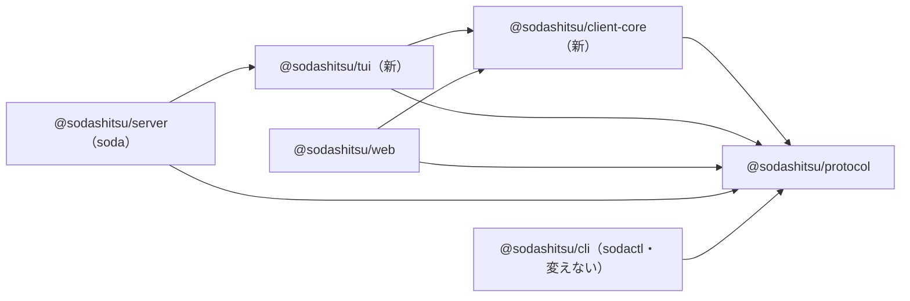
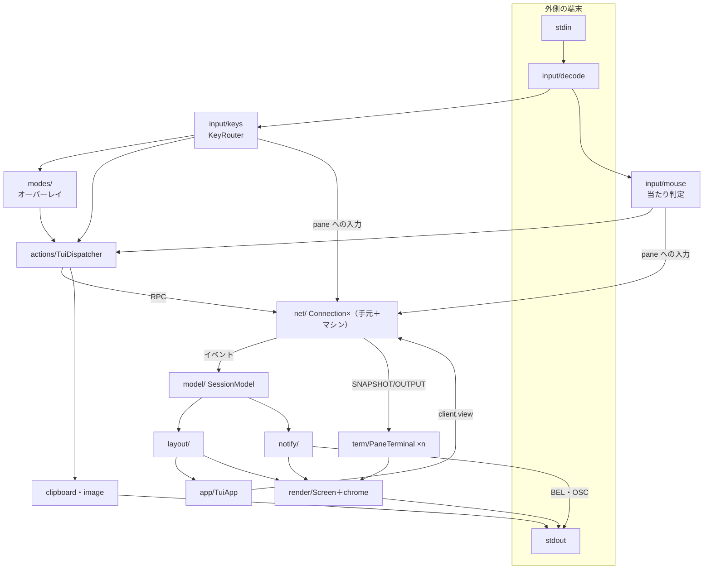
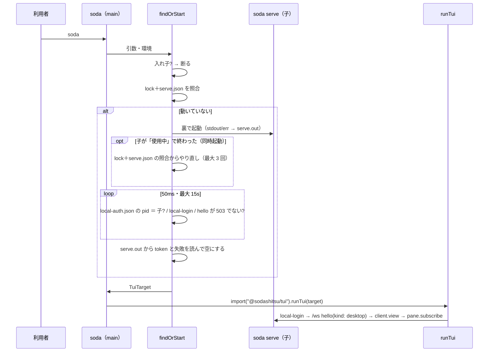
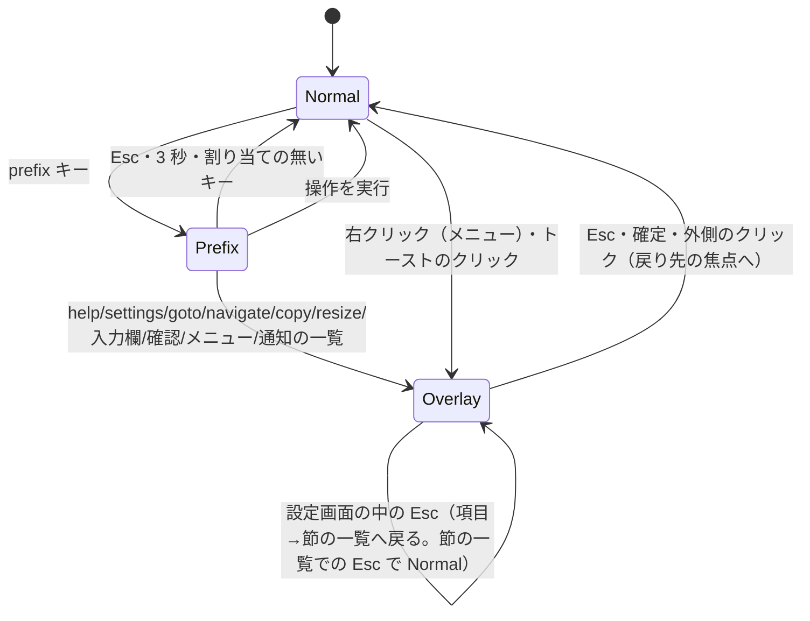

# 設計: CLI 版の画面（端末版）の構造

## アーキテクチャ概要

パッケージの依存（矢印は「依存する」）。循環は無い。



- **client-core** は Node とブラウザの両方で動く純粋な TS（`lib: ES2023`。DOM も Node の組み込みも使わない）。WebSocket は型も値も持たず、`net/ports.ts` の最小の interface（`send`・`close`・`onmessage` 等）で受け、生成は呼び出し側が注入する（web はブラウザの `WebSocket`、tui は `ws`）。`tsc -b` で `dist` へ出し、protocol と同じ形で配る。
- **tui** は Node で動く端末版。`ws`・`@xterm/headless`・`@xterm/addon-unicode11` に依存する。server に依存しない（サーバの発見と起動は server 側に置き、結果を `TuiTarget` で渡す）。
- **server** は `soda` の入口。引数なしのときだけ tui を動的 import する（`soda serve` の起動に tui の読み込みの費用を足さない）。

## コンポーネント / モジュール

### server（追加分）

| モジュール | 責務 | 依存 |
|---|---|---|
| `persist/PrefsStore.ts` | `prefs.json` の読み書き（0600・原子的）・rev・変更の通知 | fs |
| `ws` の方式の登録（既存の RPC の表へ） | `prefs.get`・`prefs.set`（`prefs.changed` を全クライアントへ）・`server.stop` | PrefsStore・既存の停止処理 |
| `auth/LocalLogin.ts` | 秘密の生成・`local-auth.json` の書き出しと削除・照合（定数時間） | crypto・fs |
| `http/HttpServer.ts`（変更） | `POST /api/local-login`（同じマシンからの接続だけ）→ 既存のセッションの発行 | LocalLogin・既存の AuthService |
| `launch/findOrStart.ts` | 引数なしの `soda`: 入れ子の検出・lock/`serve.json` の照合・裏での起動・準備完了の待ち・`TuiTarget` の組み立て | 既存の StateDirLock・namedSession・config |
| `persist/serveInfo`（既存の `serve.json` の書き出し。変更） | https のとき証明書の SHA-256 指紋 `certSha256` を足す |
| `launch/spawnDetached.ts` | OS ごとの裏での起動（POSIX: detached＋setsid、Windows: WMI→失敗なら detached） | child_process |
| `cliArgs.ts`・`main.ts`（変更） | 引数なし（先頭がオプションの場合を含む）の解釈と振り分け | 上 |

### protocol（追加分）

| モジュール | 責務 |
|---|---|
| `messages.ts`・`events.ts`（変更） | `prefs.get`・`prefs.set`・`prefs.changed`・`server.stop` の型（zod）。`SharedPrefs` のスキーマ（中身は client-core の `Prefs` と同じ形を protocol に置き、client-core は protocol から型を受ける） |

### web（変更分）

| モジュール | 責務 |
|---|---|
| `store/view.ts`・`store/settings.ts`（変更） | 設定の読み書きを `prefs.*` へ。起動時は localStorage のキャッシュで表示し、`prefs.get` で置き換える。rev 0 なら初回の移行。端末ごとの項目は localStorage のまま |
| `net` の配線（変更） | `prefs.changed` を settings の store へ |
| `actions/ActionDispatcher.ts`（変更） | D-7 の操作（`switch_workspace_1..9`・`open_worktree`・`remove_worktree`・`swap_with_focused`・`stop_server`）の実装 |
| import の付け替え | client-core へ移したモジュールの参照先 |

### client-core

| 区分 | 中身（web から移すもの） |
|---|---|
| `keys/` | `actions`・`KeyRouter`・`chord`・`chordDisplay`・`keymap`・`bindings`（D-7 の操作を足す）・`keyPrefs`・`assign`・`presets`・`navigateKeys`・`navigateKeymap`・`NavigateMode`・`CopyMode`・`ResizeMode`・`commandKeys` |
| `agent/` | `agentState`（`seen.ts` から移す純粋な関数）・`stateIndicator`・`agentOrder` |
| `workspace/` | `workspaceGrouping`・`workspaceOrder`・`paneName`・`viewRepair` |
| `sidebar/`・`tabbar/`・`layout/` | `rowLayout`・`resolveRows`・`tabBarRight`・`layoutOrder` |
| `notify/` | `policy`・`describe` |
| `theme/` | `themes`・`uiTokens` |
| `net/` | `Connection`・`ports`・`clientError`・`retryAfter`・`InputGate`・`machineUrl`・`MachineSummaryClient` |
| `prefs/` | `Prefs` の型・既定値・正規化・共有と端末ごとの分け方 |

web の側は同名のファイルを消し、import を `@sodashitsu/client-core` へ付け替える（パスの付け替えだけ。中身は変えない）。**D-7 の操作の追加は 01 ではしない**（02 で web の実装と一緒に足す。表に実装の無い id を載せない）。
**モードの境界**: `NavigateMode`・`CopyMode`・`ResizeMode` は「キー→コマンド」の解釈（純粋）だけを持ち、client-core に置く。tui の `modes/` はそれを呼び、オーバーレイの開閉・描画・戻り先の焦点を持つ（web の Vue の部品と同じ役割分担）。移したテストは client-core の下で走る。
**DOM に触れていた箇所**（`themeOverrides.ts` の 1 箇所など）は移さない（web に残す）。

### tui



| モジュール | 責務 | 依存 |
|---|---|---|
| `runTui.ts` | 公開の入口。`TuiApp` を作って走らせ、終了コードを返す |
| `app/TuiApp.ts` | 組み立て（下の全部を作って繋ぐ）・描画の予約（dirty になったら次の tick＝最短 16ms 間隔でまとめて描く）・割り付けが変わったら `client.view` を送る・終了処理 | 全部 |
| `app/terminalModes.ts` | 外側の端末のモードの有効化と、終了・シグナル・例外での復元 | process |
| `net/` | client-core の `Connection` に `ws` を注入（Cookie・Origin・Host・証明書の指紋）。再ログイン。マシンの接続の束 | client-core・ws |
| `model/SessionModel.ts` | workspace/tab/pane/エージェント/マシン・焦点・既読。イベントの適用（web の `StoreAdapter` と同じ規則）。変更を `onChange` で知らせる | client-core・protocol |
| `model/PrefsModel.ts` | 共有の設定（`prefs.*`）と、`local/tuiState.ts` から受けた手元の状態を合わせて、解決したキーマップ・テーマ・サイドバーの幅を出す（`tui-state.json` の読み書きは `local/tuiState.ts` だけ） | client-core |
| `term/PaneTerminal.ts` | pane の headless。SNAPSHOT で作り直し・OUTPUT の書き込み・モード（マウス・カーソル）の追跡・dirty の印 | @xterm/headless・unicode11 |
| `layout/computeLayout.ts` | (端末の大きさ・モデル・設定) → 矩形の集合（サイドバー・tab バー・各 pane の中身と枠・境界）。純粋な関数 | client-core |
| `render/Screen.ts` | セル格子と差分の ANSI 化。純粋（入力は格子、出力は文字列） | — |
| `render/color.ts` | テーマの色→SGR（truecolor/256 色）、pane の ANSI 16 色と既定色をテーマの配色の RGB へ | client-core |
| `render/paintPane.ts`・`render/chrome/*` | 格子へ描く: pane の中身（headless のバッファ→セル。切り取り）・chrome（design の `render/chrome/`：サイドバー・tab バー・枠）・オーバーレイ（モード・トースト） | layout・model・term・color |
| `input/decode.ts` | バイト列→入力の事象（キー・マウス・貼り付け・フォーカス）。状態を持つ分解器（途中で切れた列） | — |
| `input/keys.ts`・`input/encode.ts` | 事象→`KeyInput`→`KeyRouter`／pane へ送る列の符号化 | client-core |
| `input/mouse.ts` | 当たり判定と、ドラッグの状態機械（境界・tab・名前・選択） | layout |
| `actions/TuiDispatcher.ts` | `Action`→RPC と画面の操作 | net・model・modes |
| `modes/` | オーバーレイの状態機械（下の「状態遷移」）。navigate/copy/resize は client-core の解釈を呼ぶ。戻り先の焦点を覚える | client-core |
| `notify/` | 経路の決定（`routesFor`）・端末の判定・トースト・BEL/OSC | client-core |
| `clipboard.ts`・`image/`・`local/`・`bench/` | design のとおり | — |

## インターフェース / データモデル

```ts
// server → tui
export interface TuiTarget {
  baseUrl: string;               // http(s)://127.0.0.1:<port> など（serve.json の host が 0.0.0.0/:: なら 127.0.0.1）
  origin: string;                // Origin ヘッダ（サーバの検査を通る値）
  certSha256?: string;           // https のとき。指紋が一致した証明書だけ受ける
  login(): Promise<string>;      // ローカルログインして cookie を返す。最初の接続と 4401 の再ログインの両方（design の cookie/relogin をこれにまとめた）
  stateDir: string;              // tui-state.json を置く場所
  session?: string;              // 名前付き session の名前（表示用）
  startupNotice?: string;        // 初回の token など、画面に出す知らせ
  stopHint?: string;             // Windows の WMI 失敗時の注意など
}
export function runTui(target: TuiTarget, io?: TuiIo): Promise<number>;   // 終了コードを返す。io は stdin/stdout/環境の注入（テスト用）

// tui の中の主な型
interface Rect { x: number; y: number; w: number; h: number }
interface LayoutResult { sidebar?: Rect; tabBar: Rect; panes: Array<{ paneId: string; frame: Rect; content: Rect }>; dividers: Divider[]; narrow: boolean }
interface Cell { ch: string; width: 0 | 1 | 2; fg: Color; bg: Color; attrs: number }   // width 0 = 全角の右隣
type Color = { kind: "default" } | { kind: "palette"; index: number } | { kind: "rgb"; r: number; g: number; b: number };
type InputEvent =
  | { kind: "key"; key: KeyInput; raw: string }
  | { kind: "mouse"; action: "down" | "up" | "move" | "wheel"; button: number; x: number; y: number; mods: Mods }
  | { kind: "paste"; text: string }
  | { kind: "focus"; focused: boolean };
```

## 処理フロー / シーケンス

### 起動



### 描画

1. イベント・SNAPSHOT/OUTPUT・入力・端末の大きさの変化が、モデルか pane の headless を変え、`dirty` の印を付ける。
2. `TuiApp` は `dirty` なら次の描画を予約する（前の描画から 16ms 未満なら残りを待つ。まとめて 1 回）。
3. 描画: `computeLayout` → 格子を作り直し（chrome と、`dirty` な pane はバッファから、そうでない pane は前の格子の該当部分を写す）→ `Screen.diff` → stdout に 1 回で書く。
4. 大きさが変わったら `client.view` を送る（同じ値なら送らない）。

### 状態遷移（オーバーレイのモード）



- オーバーレイは 1 つずつ（入れ子にしない。確認から入力欄へ進むときは置き換える）。オーバーレイの間のキー・ホイール・ドラッグは pane へ流さない（AC-I5）。

## 設計判断

- **client-core に移す（写さない）**: 写すと web と端末版でキーの解釈・状態の集約・通知の方針がずれる。移動は import の付け替えだけで、web の既存のテストが移した先で同じく通ることで挙動の不変を確かめる（AC19）。
  退けた案: tui が web の `src` を tsconfig の `include` で直接読む（web は `lib: DOM`・`noEmit` で、tsc の rootDir と出力が壊れる）。
- **server → tui の依存（動的 import）**: `soda` の入口を 1 つに保つ（herdr と同じく `soda` だけで開く）。tui は server に依存しないので循環しない。退けた案: `soda-tui` の別コマンド（requirements の入口に反する）。
- **サーバの発見と起動は server 側**: 状態ディレクトリ・lock・`serve.json` の規則が server にある（research F7.2・F7.3）。tui へ写すと二重管理になる。
- **描画の予約は最短 16ms**: 性能の実測（research F4.4）で 16 pane の全読み直しが 4ms 程度なので、60fps に抑えれば入力の遅延（p95 50ms）に収まり、大量出力の pane でも描画が他を止めない。
- **pane の headless はクライアントごと**: サーバのミラーを使い回さず、SNAPSHOT を起点に手元で解釈する（web と同じ）。

## tasks への申し送り

分割（subtask）を前提にする。順序と境界:

1. **01-client-core**: パッケージの新設と web からの移動（挙動不変。web の全テストが緑）。
2. **02-server**: protocol の型（`prefs.*`・`server.stop`）、server の `prefs.*`・`server.stop`・ローカルログイン・`serve.json` の指紋・引数なしの解釈・`findOrStart`・裏での起動。web の設定の置き場所の移動（初回の移行を含む）、D-7 の操作の操作表への追加と web 側の実装。`findOrStart` は tui の代わりに仮の入口（`runTui` の形の関数）を呼べる形にしておく。
3. **03-tui-core**: tui パッケージ・接続・モデル・headless・割り付け・差分描画・入力の分解と pane への送出・切り離し・大きさ。`soda` で開いて pane が使える所まで。
4. **04-tui-ops**: 全操作（51＋D-7）・モード（prefix・navigate・goto・copy・resize・入力欄・確認・メニュー・ヘルプ）・マウスの全操作・サイドバーと tab バーの操作・狭い幅の 1 列表示。
5. **05-tui-features**: 設定画面・通知・複数ホスト・テーマの配色・クリップボード・画像・独自コマンド（popup）。
6. **06-docs-verify**: `docs/tui.md`・`docs/tui-parity.md`・herdr-parity・verification・移行の説明・性能の測定（bench）。

- 順序は 01 → 02 → 03 → 04 → 05 → 06 の直列（依存: 03 の「`soda` で開いて pane が使える」は 02 の `findOrStart`・ローカルログインが要る。04 の `stop_server` と 05 の設定画面は 02 の `server.stop`・`prefs.*` が要る）。
- 各 subtask で `pnpm build`・`pnpm typecheck`・vitest を緑に保つ（E2E は依頼時だけ。memory）。
