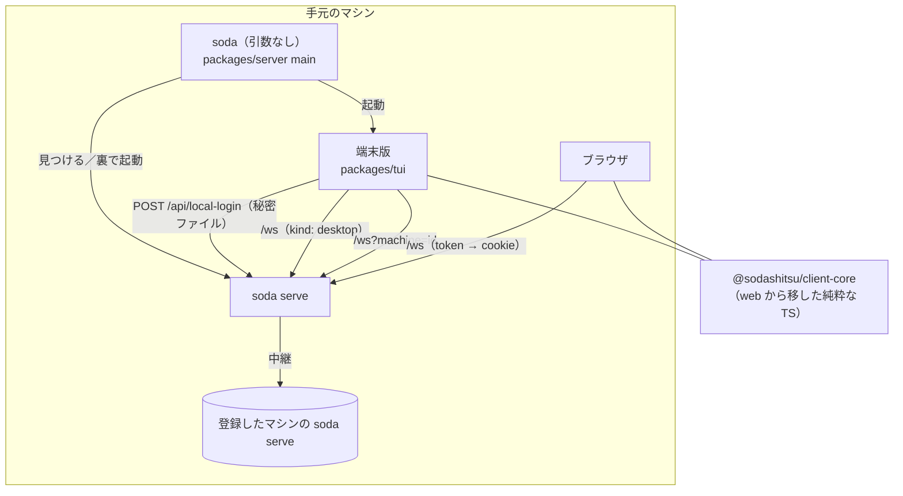

# 仕様: CLI 版の画面（端末版）

## 概要

引数なしの `soda` で、手元の `soda serve` に繋ぐ**端末の中の画面（端末版）**を開く。端末版はブラウザと同じ `/ws` にブラウザと同じ種類
（`desktop`）のクライアントとして繋ぎ、pane ごとに手元で `@xterm/headless` を持って、サイドバー・tab バー・pane を 1 枚の端末へ合成して描く。
サーバ側には (1) 設定の保存と配信、(2) token を打たずに手元から繋ぐローカルのログイン、(3) サーバを止める RPC を足す。
web の純粋な TS（キー・状態の集約・並び・通知の方針など）は新しい共有パッケージへ移し、web と端末版の両方が使う。



## 設計方針

- **D-1 新しいプロトコルは作らない**。pane の中身は既存の SNAPSHOT/OUTPUT/INPUT、構成と状態は既存のイベント、操作は既存の RPC を使う（research F2.2）。
  足すのは設定（`prefs.*`）・サーバの停止（`server.stop`）と、HTTP のローカルログインだけ。
- **D-2 描画は pane ごとの `@xterm/headless`＋`@xterm/addon-unicode11`＋自前の合成と差分描画**（research F4.1・F4.3）。TUI のフレームワークは使わない。
  web と同じ unicode11 で全角・絵文字の幅を揃える。差分描画は herdr の手順（同期出力・変わったセルだけ・全角の右隣の無効化・最後に焦点のカーソル）に倣う（F4.5）。
- **D-3 設定はサーバに置き、ブラウザと端末版で共有する**（research F3.1。requirements F11・F9・AC11・AC13）。web の localStorage は起動時の表示用のキャッシュに下げる。
  **既読（`done`）はクライアントごとのまま**（herdr・`docs/sodactl.md` と同じ。F3.3）。端末版は既読を自分のメモリに持つ。
- **D-4 手元への自動の接続は「0600 の秘密ファイル＋同じマシンからだけ受けるログインの口」**（research `research-startup.md` §2.5 の案 C）。全 OS で同じ経路で、以後はブラウザと同じ
  cookie と `/ws`（`?machine=` を含む）を使う。Unix socket の案（A/B）は Windows に無く（F7.5）、2 経路になるので退けた（decisions D2）。
- **D-5 共有パッケージ `@sodashitsu/client-core` を新設**し、web の純粋な TS を移す（research F5.4・F9.2・`research-protocol.md` R3.1/R3.2）。web は import を付け替えるだけで挙動を変えない。
- **D-6 端末版は `packages/tui`（`@sodashitsu/tui`）**。server が依存し、`soda` の引数なしから動的 import で起動する。サーバを見つける・裏で起動する・ローカルログインの秘密を読むのは
  server 側（状態ディレクトリの知識が server にある。F7.2・F7.3）で、端末版には「繋ぎ先と認証の仕方」を渡す。tui は server に依存しない。
- **D-7 herdr にあって Web に無い操作は、共有の操作表に足して web と端末版の両方に実装する**（research F1.2）。操作表と設定が共有なので、片方だけにあると設定画面で意味の無いキーが出る。
- **D-8 機能の扱いの一覧は `docs/tui-parity.md`** に置き（AC15）、`docs/herdr-parity.md` から参照する。

## 対象範囲

| 区分 | 変更/追加 |
|---|---|
| 新規 `packages/client-core` | web から移す: `keys/`（`KeyInputController.ts`・`KeyboardLockController.ts` を除く）、`notify/policy.ts`・`describe.ts`、`store/` の純粋な部品（`workspaceGrouping.ts`・`workspaceOrder.ts`・`paneName.ts`・`viewRepair.ts`・`agentOrder.ts`・`stateIndicator.ts`・`seen.ts` の純粋な関数を移した `agentState.ts`）、`sidebar/rowLayout.ts`・`resolveRows.ts`、`tabbar/tabBarRight.ts`、`term/layoutOrder.ts`、`theme/themes.ts`・`uiTokens.ts`、`net/Connection.ts`・`ports.ts`・`clientError.ts`・`retryAfter.ts`・`InputGate.ts`・`machineUrl.ts`・`MachineSummaryClient.ts`、設定の型と正規化（`store/view.ts` の `readPrefs` の中身）、テストも一緒に移す |
| `packages/web` | 移したモジュールの import の付け替え。設定の読み書きをサーバ（`prefs.*`）へ。herdr の操作（D-7）の実装 |
| `packages/protocol` | `prefs.get` / `prefs.set` / `prefs.changed`、`server.stop`、`hello` の `kind` に変更なし（`desktop` を使う） |
| `packages/server` | 設定の保存（`persist/PrefsStore.ts`）と RPC、ローカルログイン（`auth/LocalLogin.ts`・`http/HttpServer.ts`）、`server.stop`、`serve.json` に証明書の指紋、`cliArgs.ts`・`main.ts` の引数なし、サーバの発見と裏での起動（`launch/`） |
| 新規 `packages/tui` | 接続・状態・描画・入力・操作・モード・ダイアログ・マウス・通知・複数ホスト・設定画面・画像・クリップボード |
| docs | `docs/tui.md`（使い方）・`docs/tui-parity.md`（AC15）・`docs/herdr-parity.md`（参照）・`docs/verification.md`（端末版の確かめ方）・`docs/migrate-from-wtm.md`（引数なしの `soda` の変化） |
| 変えないもの | `packages/cli`（sodactl）。`attach.ts` の作法は tui へ写す |

## 依拠する既存の事実

- 通信の形・購読・スクロールバックの復元は既存のまま使える: `packages/protocol/src/messages.ts:748-764`・`events.ts:144-168`・`frames.ts:1-89`・`packages/server/src/terminal/OutputFanout.ts:108-121`（research F2.1・F2.2）。
- `client.view` は `{workspaceId, tabId, visible:[{paneId, cols, rows}]}`（`packages/protocol/src/messages.ts:41-49`）。端末版は pane ごとの大きさを申告できる。
- 大きさの権限は `desktop` か fit のクライアントだけ（`packages/server/src/clients/SizeAuthority.ts:55-56`）。入力・フォーカスで権限を取る（`ws/WsGateway.ts:139`）。
- Node からの WS 接続は Cookie・Origin・Host を付ければ通る（`packages/cli/src/wsClient.ts:210-273`・`research-startup.md` §2.2）。
- 設定は今すべて localStorage（`packages/web/src/store/view.ts:52-85`）。サーバに設定の API は無い（`packages/server/src/http/HttpServer.ts:93-95`）。
- token は平文で残らない（`packages/server/src/auth/AuthService.ts:126-131`）。
- 動いているかの判定は lock の持ち主＋`serve.json` の pid・ホスト名の一致（`packages/server/src/persist/namedSession.ts:141-145`・`StateDirLock.ts:208-212`）。復元までは `/ws` が 503（`ws/WsServerWs.ts:117-123`）。
- 同時起動の 2 つ目は `soda.lock` で終了コード 2（`packages/server/src/composeServer.ts:437-444`）。
- 裏での起動の前例（`packages/server/src/commands/commandLaunch.ts:44-85`）と入口の組（`composeServer.ts:377-381`）。
- pane の環境に `SODA_PANE_ID`・`SODA_SERVER_URL`（`packages/server/src/session/paneEnv.ts:65-68`）。
- web は unicode11（`packages/web/src/term/TerminalRegistry.ts:258-259`）。
- web の純粋な TS の一覧と pinia 依存の切り方（`packages/web/src/store/seen.ts:67-124` の純粋な関数が pinia の store と同居、`store/stateIndicator.ts:2`・`agentOrder.ts:2`・`sidebar/resolveRows.ts:2` がそれを import。一覧は `research-protocol.md` R3.1〜R3.3）。
- Web の操作 id 51 個・navigate/copy/resize の固定キー（`packages/web/src/keys/bindings.ts` の `ACTIONS`・`keys/navigateKeys.ts:30-68`・`keys/NavigateMode.ts:33-37`・`keys/ResizeMode.ts:15-29`・`keys/CopyMode.ts:37-116`）。
- herdr の描画・マウスの符号化・大きさの切り取り（`research-rendering.md` §2、`[H]src/protocol/render_ansi.rs:578-603`・`[H]src/input/encode.rs:141-175`・`[H]src/pane/terminal.rs:2312-2364`）。
- 外側の端末の通知の対応表（出典の URL と herdr の行は `research-rendering.md` §4.1・`research-inventory.md` §1-3）。**未確認**: 各端末での実際の表示（test で確認）。
- **未確認**: Windows で Node の `detached` が kill-on-close の Job を抜けないこと（libuv の注記だけ。research F7.7）。Windows Terminal ネイティブでのマウス・ペースト・フォーカス（F5.1）。→ test で実機確認。

## インターフェース / データ構造

### protocol

```ts
// 設定（共有する部分）。web の soda.prefs.v1 から端末ごとの項目（sidebarWidth・sidebarCollapsed）を除いたもの。
export const SharedPrefs = z.object({ /* keys, theme*, themeOverrides, display*, sidebarRows, scrollback, newCwd*, notify, agentSort, workspaceSort,
                                         collapsedAutoGroups, onboarding, commandKeys, tui（端末版の節） */ }).partial().passthrough();
"prefs.get": {}                                  → { prefs: SharedPrefs; rev: number }        // rev は保存のたびに +1。0 = 一度も保存していない
"prefs.set": { patch: SharedPrefs; baseRev?: number } → { prefs; rev }                     // 項目ごとの上書き（浅いマージ。keys 等は項目ごとに丸ごと置換）
event "prefs.changed": { prefs; rev; byClientId }
"server.stop": {}                                → {}                                         // 応答を返してから通常の停止（SIGTERM と同じ経路）
```

- `SharedPrefs` の中身の型は web の今の `Prefs` の型をそのまま使い（client-core へ移す）、サーバは zod の `passthrough` で**知らない項目も捨てずに保存**する（版の違う web と端末版が混在しても消さない）。
  上限 256KB（超えたら `invalid_params`）。
- 端末版だけの設定（外側の端末向け: `mouseCapture`・`copyOnSelect`・`notifyDelivery`〔`auto`（既定。端末を判定）/`osc9`/`osc99`/`osc777`/`bell`/`off`〕・`sidebarCols`〔サイドバーの既定の幅。既定 26〕・`narrowThreshold`〔既定 64〕）は
  `SharedPrefs` の `tui` 節に置く（共有してよい。どの端末版でも同じ好み）。**今の**サイドバーの幅（ドラッグで変えた列数）と折りたたみは端末版の手元のファイル（`tui-state.json`）に持ち、
  あればそちらを優先する（無ければ `tui.sidebarCols`）。入れ子の許可は設定に置かず、起動の引数 `--allow-nested` だけにする（サーバに繋ぐ前に判定するため）。

### server

- `persist/PrefsStore.ts`: `<state>/prefs.json`（0600・原子的な書き込み〔一時ファイル→rename〕）。`get()`・`set(patch, baseRev?)`・`onChange`。`baseRev` が今の rev と違っても拒まない（最後の書き込みが勝つ。項目単位のマージなので衝突は同じ項目だけ）。
- `auth/LocalLogin.ts`: 起動ごとに 32 バイトの乱数の秘密を作り `<state>/local-auth.json`（0600。`{secret, pid, createdAt}`）へ書く。`POST /api/local-login {secret}` は
  (1) 要求のソケットの `remoteAddress` と `localAddress` が同じ（同じマシンからの接続）、(2) 秘密が一致（定数時間の比較）、のときだけ通常の session cookie を発行する。
  失敗は既存の login と同じ回数の制限に数える。止めるとき秘密のファイルを消す。
- `serve.json` に `certSha256`（https のとき証明書の SHA-256 指紋）を足す。
- `server.stop`: 認証済みの接続から受け、応答を返した後に既存の停止処理（`serveShutdown.ts`）を呼ぶ。全 OS で使える（Windows の `session stop` の穴を埋める。research F7.9）。
- `launch/findOrStart.ts`: 引数なしの `soda` の処理。
  1. `--session`・`--state-dir`・`SODA_SESSION` を `serve` と同じ規則で解く（`cliArgs.ts` を拡張: 先頭がオプションなら引数なしとして扱う。`soda help` は残す）。
  2. 入れ子の検出: `SODA_PANE_ID` があり、起動の引数 `--allow-nested` が無ければ、終了コード 1 と案内で断る（herdr と同じ。F8.1）。
  3. lock の持ち主と `serve.json` の一致を見る。一致すれば繋ぐ。持ち主が別のホストなら案内して終了コード 1。
  4. 持ち主が居なければ `soda serve` を裏で起動する（下）。子が「使用中」で終わったら 3. からやり直す（最大 3 回）。
  5. 準備完了を待つ: `local-auth.json` の pid が子（か持ち主）と一致し、`/api/local-login` が通り、`/ws` の hello が 503 でなくなるまで、50ms 間隔で最大 15 秒。
- 裏での起動:
  - 出力: 状態ディレクトリの `serve.out`（0600・追記で開く）の fd を子の stdout/stderr に渡す。準備完了または子の終了の後、親が読んで、初回の token の表示と失敗の理由を端末に出す。
    表示した後、**token を含むのでファイルを空にする**（追記で開いているので子の以後の出力は先頭から続く）。
  - Linux/WSL2/macOS: `spawn(process.execPath, [...execArgv, argv[1], "serve", ...渡されたオプション], { detached: true, cwd: process.cwd(), env, stdio: ["ignore", fd, fd] })`→`unref()`。
  - Windows: 同じ spawn に `windowsHide: true`。加えて、親が kill-on-close の Job の中にいても抜けるよう、`powershell.exe -NoProfile -NonInteractive -Command Invoke-CimMethod -ClassName Win32_Process -MethodName Create`
    で `cmd.exe /d /s /c "<node> <main> serve ... >> serve.out 2>&1"` を起動する（herdr と同じ WMI。F7.7）。WMI で起動した子の環境は利用者の既定の環境になる（端末版の環境ではない）ことを docs に書く。
    WMI の起動が失敗したら detached の spawn に落とし、「端末を閉じるとサーバも止まることがある」と知らせる。
- `main.ts`: 引数なし → `findOrStart` → `import("@sodashitsu/tui").runTui(target)`。`target` の形は `architecture.md` の `TuiTarget`（最初のログインと再ログインを `login()` 1 つにまとめる）。

### client-core

- web から移したモジュール（対象範囲の表）。公開名は変えない。`seen.ts` の純粋な関数（`STATE_PRIORITY`・`displayStateFor`・`aggregate`・`sweepMarkSeen`）は `agentState.ts` へ移し、`seen.ts`（pinia）はそれを import する。
- `prefs.ts`: `Prefs` の型・既定値・正規化（`readPrefs` の中身）と、`SharedPrefs`／端末ごとの項目の分け方。
- `net/Connection.ts` は WebSocket の生成を注入できる（既存。`:20-31`）。端末版は `ws` に Cookie・Origin・Host を付けたものを注入する。

### tui（`packages/tui/src`）

| モジュール | 役割 |
|---|---|
| `runTui.ts` | 入口。raw モード・代替画面・マウス報告・ブラケットペースト・フォーカスの報告を有効にし、終了時とシグナルで必ず戻す（`packages/cli/src/commands/attach.ts` の作法を**写して** tui 側に作る。cli は変えない） |
| `net/` | client-core の `Connection` に `ws` を注入。401/4401 で `target.login()`→再接続。`?machine=` の画面の接続とマシンの要約の接続（web の `MachineWiring` と同じ形） |
| `model/` | セッションのモデル（workspace/tab/pane/エージェント/マシン）。web の `StoreAdapter` と同じイベントを適用する純粋なクラス。既読（`done`）をここで持つ |
| `term/PaneTerminal.ts` | pane ごとの headless（unicode11）。SNAPSHOT で作り直し、OUTPUT を書く。`registerCsiHandler` でカーソルの表示・形とマウスの符号化（1000/1002/1003/1006）を追う。`onData` はサーバへ送らない |
| `layout/` | 画面の割り付け: サイドバー（幅は列）・tab バー（1 行）・tab の分割の木を矩形へ（比率→列・行。境界は 1 列/行の枠）。狭い幅（`narrowThreshold` 未満）は 1 列表示 |
| `render/Screen.ts` | セル格子（文字・幅・前景・背景・属性）。前の格子との差分を ANSI で出す（`CSI ?2026 h/l` で囲む・カーソルを隠す・CUP＋SGR・全角の右隣・最後に焦点の pane のカーソルへ本物のカーソルを置いて形を設定） |
| `render/chrome/` | サイドバー・tab バー・pane の枠と名前・状態の記号・トースト・ダイアログ・メニュー・ヘルプ・設定画面を格子へ描く |
| `render/color.ts` | テーマの色（`uiTokens`・`TERMINAL_PALETTES`）を SGR へ。`COLORTERM=truecolor|24bit` なら RGB、無ければ 256 色へ寄せる。pane の ANSI 16 色と既定色はテーマの配色で RGB に置き換える（Web と同じく「テーマが端末の配色も決める」） |
| `input/decode.ts` | 標準入力の列を分解: キー（CSI・SS3・Alt=ESC 前置・modifyOtherKeys の CSI 27）、SGR マウス（1006）、ブラケットペースト、フォーカス（CSI I/O）。ESC 単独は 25ms 待って確定 |
| `input/keys.ts` | 分解したキーを client-core の `KeyInput` へ変換し、`KeyRouter`（prefix の状態機械）・各モードへ。端末へ送るキーは pane のモード（DECCKM 等）に合わせて符号化し直す |
| `input/mouse.ts` | 当たり判定（サイドバーの行・tab・境界・pane の中身・メニュー）。pane の中身で、pane がマウスを受け付けていれば pane ローカルの座標で符号化して送る。そうでなければ選択・ホイールでスクロールバック |
| `actions/TuiDispatcher.ts` | client-core の `Action` を RPC と画面の操作へ。web の `ActionDispatcher` と同じ RPC を呼ぶ |
| `modes/` | navigate・goto・copy・resize・入力欄（名前変更）・確認・メニュー・ヘルプ・設定画面・通知の一覧 |
| `notify/` | client-core の `routesFor` で経路を決め、画面内のトースト・ベル・外側の端末への通知（下）を出す |
| `clipboard.ts` | コピー: OSC 52（SSH・VS Code・WSL・tmux の中）か OS の道具（`wl-copy`/`xclip`/`pbcopy`/`clip.exe`）。画像の貼り付け: OS の道具で読めるときだけ（`wl-paste`/`xclip`/PowerShell）既存の画像の RPC へ |
| `image/` | Kitty graphics: 外側の端末が kitty/ghostty/WezTerm のときだけ、サーバが解釈した画像を外側へ出し直す。それ以外は枠に `[画像]` の印 |
| `local/tuiState.ts` | 端末版の手元の状態（`<state>/tui-state.json`: 今のサイドバーの幅と折りたたみ・最後に見ていた workspace/tab） |
| `bench/` | 性能の測定のスクリプト（AC17。入力から描画までの遅延・16 pane・状態の反映） |

## 振る舞いの詳細

### 起動と終了（AC1・AC3・AC4）

- `soda`（引数なし）→ 上の `findOrStart` → 端末版。初回起動で token が出たら、代替画面に入る前に標準エラーへ表示し（ブラウザ用。二度と出ないことを添えて）、端末版の上部にも 10 秒知らせる。
- 切り離し（`prefix+q`・端末を閉じた SIGHUP・SSH の切断）: `client.detach` を送れるなら送り、画面のモードを戻して終了コード 0。サーバとエージェントは動き続ける（サーバは Linux/WSL2 では `setsid` の別セッション、Windows では WMI で Job の外に起動した別プロセス。WMI に失敗して detached の spawn に落ちた場合だけ、端末を閉じるとサーバも止まりうる）。
- サーバ側から切れたら、画面に「再接続中」を出して `Connection` の再接続（指数バックオフ）。サーバが止まっていたら終了コード 1 で案内（自動で起動し直さない。止めたのは利用者の意思のことがある）。
- `server.stop` の操作（`stop_server`。既定の割り当てなし・確認つき）で、サーバを止めて端末版も終わる。

### 画面（AC2）

- 既定の割り付け: 左にサイドバー（幅は `tui-state.json` の今の幅、無ければ `tui.sidebarCols`〔既定 26〕。境界のドラッグと `toggle_sidebar` で変え、`tui-state.json` に残す）、上に tab バー（1 行）、残りに tab の分割。pane の枠は 1 列/行で、上辺に pane の名前と状態の記号。
- 端末の大きさが変わったら（SIGWINCH／Windows は `process.stdout` の `resize`）割り付けし直し、見えている pane の大きさを `client.view` で申告する。
- 狭い幅（既定 64 列未満）は herdr と同じ 1 列表示: サイドバーを隠し、焦点の pane だけを全体に出し、上辺に workspace/tab/pane の選び直しのメニューを出す。

### pane の大きさ（AC11・requirements F8）

- 端末版は自分の割り付けで決まる各 pane の大きさを `client.view` で申告する。権限の取り方・移り方は既存の規則のまま（最後に操作したクライアント）。
- pane の実際の大きさ（`pane.size_changed`）が自分の割り付けと違う間は、**左上を合わせて切り取り、余りは背景色で埋める**（herdr と同じ。research F4.6）。切り取っているときは枠の右下に `⋯` を出す。

### 入力（AC6・AC8・AC-I5）

- 焦点の pane へは、prefix とその直後の 1 キー（とモードの中のキー）以外の入力をすべて送る。キーは pane のモード（DECCKM・キーパッド）に合わせて xterm の既定の符号化で作り直す。
  ブラケットペーストは pane が有効にしていれば包み、無効なら中身だけ。
- prefix の後の prefix は prefix のバイト（既定 `\x02`）を pane へ送る（web と同じ）。
- kitty keyboard は使わない（pane 側が対応しない。F5.2）。modifyOtherKeys の列は受け付けて通常のキーへ直す。区別できないキー（例: 外側の端末が送らない `ctrl+shift+文字`）は `docs/tui-parity.md` に書く。
- IME は外側の端末に任せ、焦点の pane のカーソルの位置へ本物のカーソルを置く（F5.3）。

### マウス（AC9・AC-I1〜AC-I5）

- herdr の M1〜M14（`research-inventory.md` §3-2）と Web の拡張のうち端末で出来るもの: クリックで焦点、境界のドラッグで大きさ、サイドバーの行のクリック、tab のクリック・ドラッグで並べ替え、
  サイドバーの幅と spaces/agents の境界のドラッグ、右クリックのメニュー、pane の名前のドラッグで入れ替え・縁へのドロップで分割/移動（Web の拡張）、ホイール、選択とコピー、リンクを開く（ctrl/cmd+クリック）。
- pane の中身の上では、pane がマウス報告を有効にしていれば（`terminal.modes.mouseTrackingMode`）その pane へ pane ローカルの座標で送る。shift を押している間は端末版が扱う（選択）。

### 通知（AC13）

- 経路は client-core の `routesFor`（web と同じ方針）で決める。端末版の「フォーカス」は外側の端末のフォーカス報告（CSI I/O）で知る。報告が来ない端末ではフォーカスありとみなす。
- 出し方: 画面内のトースト（右下・5 秒）、ベル（`\x07`。設定で切れる）、外側の端末へのデスクトップ通知。
  - 端末の判定（`TERM_PROGRAM`・`TERM`・`KITTY_WINDOW_ID`・`WT_SESSION`・`GHOSTTY_RESOURCES_DIR` 等）: kitty→OSC 99、ghostty/iTerm2/WezTerm→OSC 9、Windows Terminal→OSC 777（利用者が有効にしていれば出る）、判別できない→出さない（herdr と同じ）。
  - 設定 `tui.notifyDelivery` で上書き（`osc9`/`osc99`/`osc777`/`bell`/`off`）。SSH 越しで判定できないときのため。
  - tmux の中（`TMUX`）では `ESC P tmux; … ESC \` で包む。
- `prefix+o` と、トーストのクリックで対象へ移動。通知の設定（種類・音の有無）は共有の設定（`notify`）を使う。音は端末版ではベルで代える。

### 設定（AC8・AC11・AC13・requirements F11）

- web: 起動時は localStorage のキャッシュで表示し、接続したら `prefs.get` を受けて置き換える。サーバの `rev` が 0（一度も保存されていない）で localStorage に値があれば、`prefs.set` でサーバへ移す（初回の移行）。
  以後の変更は `prefs.set` へ送り、`prefs.changed` で全クライアントへ届く。localStorage は受け取った値で更新する（次の起動の表示用）。
  **端末ごとの項目（sidebarWidth・sidebarCollapsed）は localStorage のまま**。
- 端末版: 接続時に `prefs.get`、`prefs.changed` で置き換える。設定画面（`prefix+s`）の変更は `prefs.set`。
- この変更で、**ブラウザ同士でも設定が共有される**（今はブラウザごと）。decisions D3。

### 設定画面（端末版）

- Web の 5 節（通知・テーマ・表示・端末・キー）と `tui` 節を、左に節の一覧・右に項目の表で出す。上下で項目、Enter/Space で切り替え・選択肢の一覧・入力欄、キーの割り当ては「次に押したキーを割り当てる」待ち。
  Esc で節の一覧へ戻り、もう一度 Esc で閉じる。変更は項目ごとに即座に反映（Web と同じ）。

### 複数ホスト（AC14）

- `machine.list`／`machine.changed` でマシンを知り、サイドバーにマシンごとの見出しで並べる（Web と同じ並び）。選んだマシンの画面は `/ws?machine=<id>` の接続を 1 本、選んでいないマシンは
  web の `MachineSummaryClient` と同じ要約の接続（client-core へ移したもの）。操作は選んだマシンの接続へ送る。

### herdr の操作の追加（D-7）

- `switch_workspace_1..9`（既定なし）・`open_worktree`・`remove_worktree`・`swap_with_focused`（pane のメニュー）・`stop_server`（既定なし・確認つき）を共有の操作表へ足し、web にも実装する。
  既存の操作の既定のキーは変えない（AC19）。

### 対象の端末エミュレータ（requirements 非機能要件・AC16）

| 環境 | 確かめる端末 |
|---|---|
| Windows ネイティブ | Windows Terminal（PowerShell）・VS Code の統合端末 |
| WSL2 | Windows Terminal・VS Code の統合端末 |
| Linux | VS Code の統合端末（Remote/devcontainer を含む）・tmux の中（任意の端末の上） |
| SSH 越し | 上のいずれかから SSH で入った先 |

- 通知の OSC は、上の端末のうち対応するもの（Windows Terminal の OSC 777 は利用者が有効にしたとき）だけを確かめる。kitty・WezTerm・Ghostty は判定の単体テストで扱い、実機は任意。

## ドメイン固有の考慮

- 端末の中の端末: 端末版は外側の端末の上で動くので、外側のキー（コピー・貼り付け・タブの切替）と衝突しうる。外側が先に取るキーは端末版に届かない（仕方がない）。`docs/tui.md` に既定の衝突の一覧と回避（prefix の変更・tmux の `send-prefix`）を書く。
- 問い合わせ: pane の出力の問い合わせ（DA・DSR・OSC 色）に答えるのはサーバのミラーだけ。端末版の headless の `onData` は捨てる（research 注意）。
- 端末版が外側の端末へ出す列は、終了時に必ず戻す（代替画面・マウス報告・ブラケットペースト・フォーカス報告・カーソル）。異常終了（uncaughtException・SIGTERM・SIGHUP）でも戻す。

## エラー処理 / 異常系

| 事象 | 扱い |
|---|---|
| 入れ子（`SODA_PANE_ID` がある） | 終了コード 1、`--allow-nested` の案内 |
| lock の持ち主が別のホスト | 終了コード 1、`--state-dir`/`--session` の案内 |
| 裏での起動が失敗（bind・設定の誤り） | `serve.out` の内容を表示して終了コード 1 |
| 15 秒以内に準備完了にならない | `serve.out` の末尾と `server.log` の場所を案内して終了コード 1（サーバは止めない） |
| ローカルログインの拒否（秘密の不一致・別のマシンから） | 秘密を読み直して 1 回だけやり直し、だめなら終了コード 1 |
| 接続中の 4401（ログアウト・token の再発行） | `target.login()` で秘密を読み直して再接続 |
| サーバが止まった | 画面を戻し、終了コード 1 で案内 |
| https の証明書の指紋が `serve.json` と違う | 繋がずに終了コード 1 |
| 端末が小さすぎる（20×5 未満） | 「端末が小さすぎます」だけを描く |
| `prefs.set` が上限超え | 知らせを出して変更を捨てる |

## 受け入れ基準との対応

- AC1: `main.ts` の引数なし → `launch/findOrStart.ts`（lock・`serve.json`・裏での起動・準備完了の待ち）→ `runTui`。入力は利用者の `soda` の起動と状態ディレクトリ。
- AC2: `layout/`・`render/`（割り付け・合成・差分描画）。入力はサーバのスナップショット（hello の結果）と `pane.size_changed`・端末の大きさ（SIGWINCH）。
- AC3: `prefix+q`（`detach`）と SIGHUP・SSH の切断の扱い（「起動と終了」）。サーバは別セッションで動き続け、再び `soda` で hello → SNAPSHOT（スクロールバック込み）で戻る。
- AC4: 端末版は手元のプロセスとして動くので、SSH 先で `soda` を起動すればその先のサーバを見つける/起動する。OSC 52・通知の判定は SSH を考慮（「通知」・`clipboard.ts`）。入力は SSH 先の状態ディレクトリ。
- AC5: `actions/TuiDispatcher.ts` が web と同じ RPC を呼ぶ。確認・入力欄は `modes/`。入力は利用者のキー・マウス。
- AC6: `term/PaneTerminal.ts`（headless＋unicode11）と `render/color.ts`（256 色/truecolor）・`input/`（ブラケットペースト・マウスの受け渡し）・本物のカーソルの位置（IME）。入力は pane の OUTPUT/SNAPSHOT と利用者の入力。
- AC7: `modes/copy`（client-core の `CopyMode`）とマウスの選択、`clipboard.ts`（OSC 52 か OS の道具）、貼り付けはブラケットペーストで pane へ。入力は headless のバッファ。
- AC8: client-core の `KeyRouter`・`keymap`・`presets` を共有し、割り当ては共有の設定（`prefs.keys`）から読む。入力は `prefs.get`/`prefs.changed`。
- AC9: `input/mouse.ts`（「マウス」の一覧）。入力は SGR マウスの列と割り付け。
- AC10: `model/`（イベントの適用・既読）と client-core の `aggregate`・`stateIndicator`・`agentOrder`。入力はサーバのエージェントのイベント。
- AC11: 端末版とブラウザが同じ `/ws`・同じ `prefs.*`。大きさは既存の権限の規則＋切り取り（「pane の大きさ」）。入力はサーバのイベントと `prefs.changed`。
- AC12: 端末版はただの `desktop` のクライアントなので、2 つ繋いでも既存の同時接続の規則で動く。入力はサーバのイベント。
- AC13: `notify/`（「通知」）。入力はエージェントの状態のイベント・外側の端末のフォーカス報告・共有の `notify` 設定。
- AC14: `net/`（`?machine=` と要約の接続）とサイドバーのマシンの見出し。入力は `machine.list`/`machine.changed`。
- AC15: `docs/tui-parity.md`（`research-inventory.md` を元に、herdr の全項目・Web の拡張・外側の端末との取り決めを「対応/読み替え/非対応（理由）」で分類し、各行に検証した AC を書く）。
- AC16: `docs/verification.md` に端末版の確かめ方を足し、「対象の端末エミュレータ」の表で確かめる（test 工程）。入力は各環境の実機。
- AC17: 端末版の性能の測り方（入力から描画までの遅延・16 pane・状態の反映）をスクリプト化して測る（`packages/tui/src/bench/`）。入力は測定のスクリプト。
- AC18: 端末版は cookie（通常ログインかローカルログイン）なしには `/ws` に繋げない。ローカルログインは同じマシンから・秘密の一致のときだけ。入力はテストでの未認証・別アドレスからの要求。
- AC19: client-core への移動は import の付け替えだけで、web の既存の単体テストをそのまま（移した先で）通す。設定の置き場所の移動は「設定」の移行で見た目の挙動を保つ。`soda` の引数なしの変化は `docs/tui.md`・`docs/migrate-from-wtm.md` と help に書く。
- AC-I1: `modes/`（入力欄・確認・ヘルプ・設定・メニュー）の開閉は prefix＋キーとマウスの両方、`Esc`・外側のクリックで閉じ、確定せずに閉じたら値を変えない。prefix 待ちは tab バーの左端に `PREFIX` を出し、Esc か 3 秒で解除（client-core の `KeyRouter`）。
- AC-I2: 入力欄は Enter で確定・Esc で取り消し。閉じる操作は実行中のプロセスがあれば確認（web と同じ判定の RPC の結果）。
- AC-I3: 全操作に操作 id があり（D-7 を含む）、既定のキーが無い操作（`switch_workspace_1..9`・`stop_server` 等）は設定画面でキーを割り当てれば使える（web と同じ）。サイドバーは navigate モード、設定画面はキーだけで操作できる。
- AC-I4: 作成した pane/tab/workspace に焦点を移す（RPC の結果の id）。サイドバーで選んだら pane へ。モードを閉じたら開く前の pane へ（`modes/` が戻り先を覚える）。
- AC-I5: 「入力」の節。ホイールはその pane だけ（pane がマウスを受け付けていればアプリへ）。外側の端末との衝突は `docs/tui.md` に書く。
