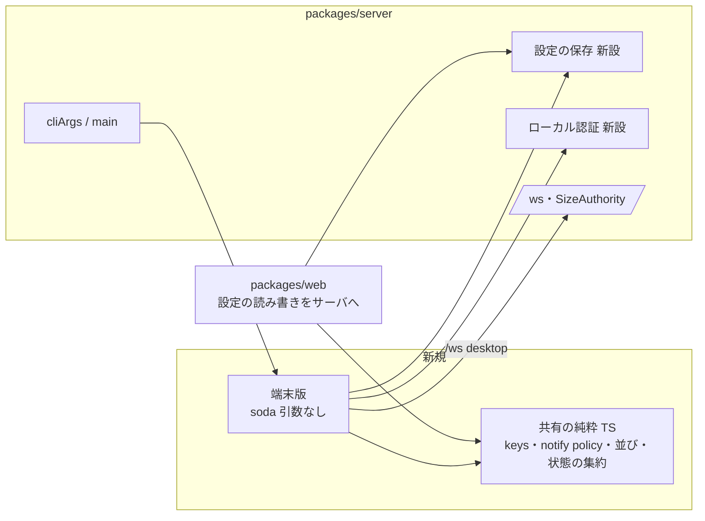

# 調査: CLI 版の画面（端末版）

調査は 4 本に分けて行い、根拠つきの詳細を付録に置いた（すべての事実に `file:line` か出典を付けてある）。本書はその索引つき要約。

| 付録 | 中身 |
|---|---|
| `research-inventory.md` | AC15 の一覧の下書き（herdr の機能・マウス M1〜M14・Web だけの拡張 W01〜W29・外側の端末との取り決め X01〜X10）、Web の操作 id 全 51 個、herdr への 5 つの問いの答え |
| `research-protocol.md` | `/ws` の通信の全体（R1）、設定の置き場所（R2）、web の中で Node が使い回せる純粋な TS（R3）、sodactl の接続と `pane attach`（R4）、配布（R5） |
| `research-rendering.md` | 描画方式（pane ごとの `@xterm/headless`＋自前の合成と差分描画）、herdr の描画の作り、入力、外側の端末の機能、性能の実測 |
| `research-startup.md` | 今の `soda` の CLI・状態ディレクトリ・認証・裏での起動・準備完了の判定・複数ホスト・パッケージ |

## 調査の問い

- Q1: herdr と Web 版の全機能は何で、端末版でそれぞれどう扱えるか（AC15）。
- Q2: 端末版がブラウザと同じくサーバに繋ぐには何を実装すればよいか。新しいプロトコルは要るか。
- Q3: 設定と既読は今どこにあり、端末版と共有できるか（F7・F9・F11）。
- Q4: 1 枚の端末に複数の pane を描く方式はどれが実現でき、性能を満たすか。
- Q5: 入力（キー・マウス・貼り付け・IME）を 3 環境でどう受けるか。
- Q6: 外側の端末への通知・クリップボード・画像は何ができるか。
- Q7: `soda` を引数なしで起動したとき、サーバを裏で起動し、token を打たずに手元のサーバへ繋ぐにはどうするか（3 環境）。
- Q8: 入れ子（端末版の中の端末版）・tmux の中で動かしたときの扱い。
- Q9: 端末版のコードの置き場所と、web のコードの使い回し。

## 判明した事実

### Q1 機能一覧

- F1.1: Web の操作 id は 51 個（`research-inventory.md` §2。`packages/web/src/keys/bindings.ts` の `ACTIONS`）。端末版は全部を実装する。
- F1.2: herdr にあって Web に無いものがある: キー操作 `switch_workspace`（1..9）・`open_worktree`・`remove_worktree`、pane メニューの「focused pane と入れ替え」、tab のドラッグでの並べ替え、
  サイドバーの spaces/agents の境界のドラッグ、tab バーの左右スクロール（`research-inventory.md` §0-3。`[H]src/input/keybindings.rs:20-80`・`[H]src/client/shell/state.rs:85-209,519`）。
- F1.3: herdr の端末画面には狭い幅用の 1 列表示がある（`ui.mobile_width_threshold` 既定 64 桁。`[H]src/main.rs:247-249`・`[H]src/client/shell/mobile.rs`）。
  → requirements が対象外の例に挙げた「モバイルの 1 列表示」は端末でも出来るので、狭い幅の 1 列表示は対象に入る（requirements の方針「端末で出来るなら入れる」による）。
  非対応は追加キーの列・タッチ・縮小表示・PWA・Keyboard Lock・WebGL など（`research-inventory.md` §3-3）。
- F1.4: herdr の外側の端末向けの設定（`mouse_capture`・`copy_on_select`・`host_cursor`・`pane_scrollbars`・`confirm_close`・`window_title` 等）は Web に無い（`research-inventory.md` §0-3）。

### Q2 接続

- F2.1: `/ws` のテキストは 1 通 1 JSON（`{id,method,params}` → `{id,result|error}`、イベントは `{event,data}`。`packages/protocol/src/messages.ts:748-764`・`events.ts:144-168`）。
  バイナリは `[型u8][pane id 長u8][pane id][本体]`、型は OUTPUT(0x01)・SNAPSHOT(0x02)・INPUT(0x03)（`packages/protocol/src/frames.ts:1-89`）。
- F2.2: 手順は hello → `client.view` → `pane.subscribe` → INPUT。スクロールバックの復元はサーバのミラーの SNAPSHOT（serialize した ANSI）で、流量制御（2MB で stale、256KB で再開）の回復でも SNAPSHOT が来る
  （`packages/server/src/terminal/Mirror.ts:196`・`OutputFanout.ts:108-121`）。→ **新しいプロトコルは要らない**。
- F2.3: 大きさの権限を持てるのは `kind==="desktop"` か `client.fit` を有効にしたクライアントだけ（`packages/server/src/clients/SizeAuthority.ts:55-56`）。sodactl の `external` では取れない → 端末版は `desktop` で hello する。
- F2.4: sodactl の `WsSodaClient` は `ws` に Cookie・Origin・Host のヘッダを付けて繋ぐ（`packages/cli/src/wsClient.ts:210-273`）。自動の再接続は無い。web の `net/Connection.ts` は再接続・hello・振り分けを持ち、WebSocket の生成を注入できる（`:20-31`）。

### Q3 設定と既読

- F3.1: **Web の設定はすべてブラウザごとの localStorage**（`soda.prefs.v1`：keys〔差分〕・theme・themeOverrides・表示・sidebarRows・scrollback・newCwd・notify・sidebarCollapsed/Width(px)・並び順・onboarding。
  `packages/web/src/store/view.ts:52-85`・`store/settings.ts`）。**サーバに設定の API は無い**（`packages/server/src/http/HttpServer.ts:93-95` は login/logout/session だけ）。
- F3.2: サーバで共有されているのは構成・手動グループの折りたたみ・`commands.json`・`machines.json`・`integrations.json` だけ（`research-protocol.md` R2.2）。
- F3.3: `done` の既読はブラウザごと（localStorage `soda.seen.v1`。`packages/web/src/store/seen.ts:6-124`）。サーバの既読（serverSeenSeq）はフォーカスでだけ進み、メモリだけ（`docs/sodactl.md`「状態と各コマンド」）。
  docs は「CLI とクライアントのバッジは別々に既読を持つ（herdr でも）」と明記している。

### Q4 描画

- F4.1: 推奨は **pane ごとの `@xterm/headless` 6.0.0（サーバで使用中）＋自前のセル格子の合成と差分描画**。TUI のフレームワークは blessed（最終 2015）・neo-blessed（2018）が保守停止、ink は行ベース、
  terminal-kit は端末モデルの二重化、@opentui/core は Node 26.4+/bun 必須で、いずれも不適（`research-rendering.md` §1）。
- F4.2: headless の公開 API でセルの幅・色・属性と `terminal.modes`（マウスの種類・ブラケットペースト・DECCKM・フォーカス）が取れる。カーソルの表示・形とマウスの符号化（SGR か）は公開 API に無く、
  `parser.registerCsiHandler` で自分で追う（サーバの `Mirror.ts:141-149` と同じ作法）。既定色の `getFgColor()` は -1（実測）。
- F4.3: 絵文字の幅は Unicode 6 だと 1 になる。**web は `@xterm/addon-unicode11` を使っている**（`packages/web/src/term/TerminalRegistry.ts:258-259`、`packages/web/package.json:16`）ので、端末版も同じ addon を使えば web と同じ幅になる。
- F4.4: 性能の実測（WSL2・Node 24.15）: 解析 1 pane 約 31MB/s、16 pane×120×40 の全読み直し 1 フレーム約 4.1ms（`research-rendering.md` §1.4）。汚れた pane だけ読み、約 60fps にまとめれば足りる見込み。
- F4.5: herdr の差分描画は、同期出力 `?2026` で囲み、描く間カーソルを隠し、変わったセルだけ CUP＋SGR、全角の右隣を無効化、最後に焦点の pane のカーソルへ本物のカーソルを置く（IME の候補窓の位置）
  （`[H]src/protocol/render_ansi.rs:578-603`）。マウスは pane の内側の矩形で当てて pane ローカルの座標で SGR に符号化（`[H]src/input/encode.rs:141-175`）。
- F4.6: 大きさの違うクライアント: herdr は各クライアントが自分の大きさで画面を組み、pane は最後に操作したクライアントが決め、他は左上に合わせて切り取る（`[H]src/pane/terminal.rs:2312-2364`）。

### Q5 入力

- F5.1: Windows で Node 24.2.0 以降の `setRawMode(true)` が `ENABLE_VIRTUAL_TERMINAL_INPUT` を立てる（nodejs PR #58358）。24.1 以前はマウスが届かない（#56338）。→ Windows では Node 24.2 以上が要る（PJ の `engines` は `>=24`。`package.json`）。
- F5.2: pane 側（xterm.js・headless）は kitty keyboard に非対応。外側で kitty keyboard を有効にすると pane へ送る前に従来の列へ戻す変換が要る（`research-rendering.md` §3.2）。
- F5.3: IME の変換は外側の端末が行い、端末版はカーソルを置くだけ（`research-rendering.md` §3.4）。
- F5.4: web の `keys/`（`KeyRouter`・`chord`・`keymap`・`bindings`・`keyPrefs`・`presets`・`NavigateMode`・`CopyMode`・`ResizeMode`）は Vue/DOM に依存しない純粋な TS（`research-protocol.md` R3.1）。

### Q6 外側の端末

- F6.1: 通知: herdr は Ghostty・iTerm2・WezTerm に OSC 9、kitty に OSC 99 を出し、OSC 777 は使わず、判別できない端末には何も出さない（`research-inventory.md` §1-3）。
  Windows Terminal は OSC 777 に対応したが既定で無効（`compatibility.allowOSC777`）。VS Code・Konsole・Alacritty はどれも非対応（`research-rendering.md` §4.1）。
- F6.2: クリップボード: herdr は OSC 52（SSH・VS Code・WSL）か OS の道具で書く（`research-inventory.md` §1-2）。gnome-terminal（VTE）は OSC 52 未実装。
- F6.3: Kitty graphics は Windows Terminal に経路が無く、tmux の中では `allow-passthrough on` が要る。クリップボードの画像の貼り付けは herdr も手元のクライアントが OS のクリップボードを読める構成でだけ行う。

### Q7 起動と認証

- F7.1: 今の `soda`（引数なし・help・`--help`・`-h`）は help を出す（`packages/server/src/cliArgs.ts:49`）。
- F7.2: 状態ディレクトリの既定は `XDG_STATE_HOME/sodashitsu`（Windows は `%LOCALAPPDATA%\sodashitsu`）（`packages/server/src/config.ts:66-73`）。`soda.lock`・`auth.json`・`serve.json`・各 socket は 0600（実測）。
- F7.3: `serve.json`（pid・host・port・https）は止めた後も残るので、単独で「動いている」と判断できない。`soda.lock` の持ち主と pid・ホスト名が一致するときだけ信じる判定が既にある
  （`packages/server/src/persist/namedSession.ts:141-145`・`persist/StateDirLock.ts:208-212`）。
- F7.4: lock と `serve.json` ができた後も、復元が終わるまで `/ws` は 503（`packages/server/src/composeServer.ts:433-556`・`ws/WsServerWs.ts:117-123`）。
- F7.5: token は scrypt のハッシュしか残らない（`packages/server/src/auth/AuthService.ts:126-131`）。token なしで繋げる既存の口は 0600 の `bridge.sock` だけで、Windows には無く、行き先（machine）を選べない
  （`packages/server/src/machine/BridgeEndpoint.ts:19-35`）。Windows では Node から DACL 付きの named pipe を作れない（20260927-session-stop の decisions D2(e)）。
- F7.6: サーバを裏で起動するコードは無い。前例は `commands/commandLaunch.ts:44-85`（detached・`stdio:"ignore"`・`windowsHide`・`unref`）。入口は `process.execPath`＋`execArgv`＋`argv[1]` が安全（`composeServer.ts:377-381`）。
- F7.7: herdr は socket に connect できなければ `herdr server` を裏で起動し 50ms 間隔で最大 15 秒待つ。Windows では kill-on-close の Job の中なら WMI の `Win32_Process.Create` で Job の外に起動する
  （`[H]src/server/autodetect.rs:285-320`・`[H]src/platform/windows.rs:1199-1270`）。Node の `detached` は Job を抜けない（libuv の注記。実機未確認）。
- F7.8: 初回の token は起動時の標準出力に一度だけ出る（`packages/server/src/main.ts:46-57`）。裏で起動して捨てると誰にも見えず、`soda token reset` は動いている間は断られる（`sessionCommands.ts:69-114`）。
- F7.9: Windows では裏で動くサーバを止める手段が無い（`soda session stop` は handoff.sock 経由で Windows 非対応）。
- F7.10: 起動の失敗（EADDRINUSE 等）は子の stderr に出て終了コード 2（`main.ts:86-93`）。同時に 2 つ起動しても 2 つ目は `soda.lock` で終了コード 2（`composeServer.ts:437-444`）。

### Q8 入れ子と tmux

- F8.1: herdr は pane の環境に `HERDR_ENV=1` を入れ、その中の TUI は `allow_nested=false`（既定）なら終了コード 1 で断る（`[H]src/main.rs:444-470`）。soda の pane には `SODA_PANE_ID`・`SODA_SERVER_URL` が入る（`packages/server/src/session/paneEnv.ts:65-68`）。
- F8.2: herdr は tmux の中での prefix の衝突に特別な処理を持たない。`TMUX` を見るのは、通知を `ESC P tmux;` で包む・modifyOtherKeys の扱い・画像の高速経路を切る、の 3 か所だけ。

### Q9 置き場所

- F9.1: `soda` は `packages/server/dist/main.js`、`sodactl` は `packages/cli/dist/main.js`。依存は protocol ← server / web / cli の向き（`research-protocol.md` R5）。
- F9.2: web は `noEmit`・`lib: DOM` のアプリで、そのままでは Node から import できない（`packages/web/tsconfig.json`）。純粋な TS（F5.4・`research-protocol.md` R3.1）を共有するには別パッケージへの切り出しが要る。
- F9.3: server は `ws`・`@xterm/headless` を既に依存に持つ（`packages/server/package.json`）。

## 影響範囲

- server: `cliArgs.ts`・`main.ts`（引数なしの解釈）、設定の保存と配信（新設）、ローカル認証（新設）。
- web: 設定の置き場所をサーバへ移す（`store/view.ts`・`store/settings.ts`）。純粋な TS を共有パッケージへ移す（import の付け替え）。
- 新規: 端末版の本体（接続・状態・描画・入力・操作・通知・起動）。
- docs: `soda` の引数なしの挙動、端末版の使い方、herdr-parity の端末版の列。

## 実現性 / リスク

- 描画・入力・接続は既存の部品と実測で実現できる見込み（F2.2・F4.1〜F4.4・F5.1）。
- **設定の共有はサーバ側の新設が要り、Web の挙動（localStorage）を変える**（F3.1）。AC19 との両立は「Web の見た目の挙動は変えず、置き場所だけ移す（既存の localStorage の値は初回にサーバへ移す）」で取る必要がある。
- **token を打たずに手元へ繋ぐ方式は OS で事情が違う**（F7.5）。Windows では Job からの脱出（F7.7）・止める手段（F7.9）も未解決で、実機の確認が要る。
- 規模が大きい（操作 51 個＋herdr だけの操作・設定画面・通知・複数ホスト・起動・認証・設定の共有）。design で分割を前提にする。

## 実装アンカー

- A1: 引数なしの解釈（`packages/server/src/cliArgs.ts:49` `parseArgs`）— 今は help を返す。
- A2: 入口（`packages/server/src/main.ts`）— コマンドの振り分け・token の表示（`:46-57`）・失敗の終了コード（`:86-93`）。
- A3: 動いているサーバの判定（`packages/server/src/persist/namedSession.ts:141-145`・`persist/StateDirLock.ts:208-212`）— lock の持ち主＋`serve.json` の一致。
- A4: 大きさの権限（`packages/server/src/clients/SizeAuthority.ts:55-56`）— `desktop` の資格。
- A5: HTTP の口（`packages/server/src/http/HttpServer.ts:93-95`）— login/logout/session。ローカル認証を足す場所。
- A6: Node の WS クライアント（`packages/cli/src/wsClient.ts:210-273`）— Cookie・Origin・Host。
- A7: 再接続つきの接続（`packages/web/src/net/Connection.ts:20-31`）— 生成を注入できる。
- A8: キーの状態機械と割り当て（`packages/web/src/keys/*`）— 純粋な TS。
- A9: 設定の読み書き（`packages/web/src/store/view.ts:52-142`・`store/settings.ts`）— localStorage。
- A10: 既読と状態の集約（`packages/web/src/store/seen.ts:67-124`）— 純粋な関数が pinia の store と同居。
- A11: イベントの適用（`packages/web/src/store/StoreAdapter.ts:102-157`）・操作の実行（`actions/ActionDispatcher.ts`）— pinia 依存。端末版では同じ RPC を呼ぶ実装を別に書く。
- A12: raw モード・画面の復元・シグナル（`packages/cli/src/commands/attach.ts`）— 部品として切り出せる。
- A13: 裏での起動の前例（`packages/server/src/commands/commandLaunch.ts:44-85`）。
- A14: pane の環境（`packages/server/src/session/paneEnv.ts:65-68`）— 入れ子の検出に使う。
- A15: サーバのミラー（`packages/server/src/terminal/Mirror.ts:141-149,196`）— headless の扱いの作法。

## 実装時の注意

- 手元の headless の `onData`（問い合わせへの応答）は**サーバへ送らない**。問い合わせに答えるのはサーバのミラーだけ（`research-rendering.md` §5）。
- SNAPSHOT はいつでも来うる（流量制御の回復）。pane の headless は SNAPSHOT で作り直せるようにする（F2.2）。
- `serve.json` 単独で「動いている」と判断しない（F7.3）。
- 既定色は -1（F4.2）。型定義のコメント（0）を信じない。
- Windows の `setRawMode` は Node 24.2 未満でマウスが届かない（F5.1）。

## design への申し送り

1. 設定の共有: サーバに設定の保存と配信を新設し、web の置き場所を移す（既存の localStorage の値の移し方・端末ごとに持つべき設定〔サイドバーの幅など〕の線引き）。既読は herdr・docs と同じくクライアントごとのままでよいか。
2. ローカル認証の方式（Linux/WSL2 と Windows を分けるか、共通にするか）と、multi-host（`?machine=`）を通せること。
3. 裏での起動: 準備完了の判定（F7.3・F7.4）、同時起動（F7.10）、初回 token の表示（F7.8）、Windows の Job からの脱出（F7.7）と止める手段（F7.9）。
4. 描画: headless＋unicode11（web と同じ幅）、差分描画、大きさが違うときの切り取り（F4.6）。
5. キー: prefix 方式を既定にし、kitty keyboard は使わない（F5.2）か。区別できないキーの扱い。
6. 通知: 端末の判定（TERM_PROGRAM 等）と、判定できないとき（SSH 越し）の設定での上書き。tmux の中での包み方（F8.2）。
7. 入れ子は herdr と同じく環境変数で検出して断る（上書きの手段つき）（F8.1）。
8. 共有パッケージの切り出しの範囲（F9.2）と、端末版の置き場所（server に置くか新パッケージか）。
9. 規模が大きいので tasks で subtask に分けることを前提に、design で境界（接続と状態／描画／入力と操作／設定の共有／起動と認証／通知／複数ホスト）を切る。
