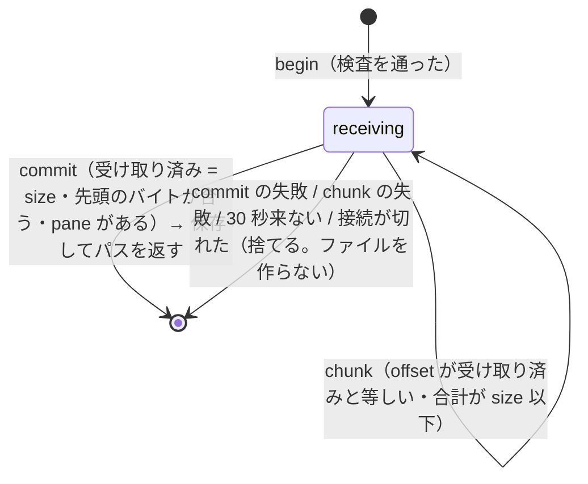
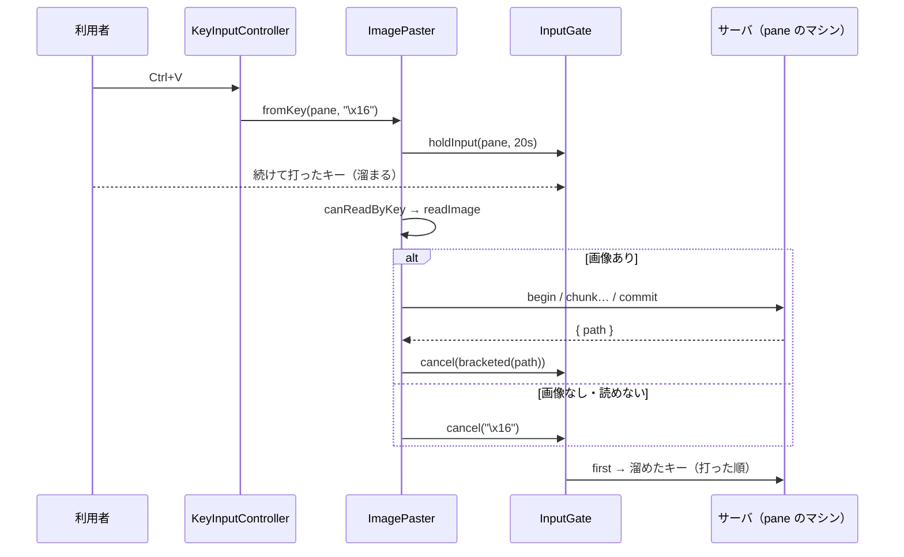

# 仕様: クリップボードの画像を pane へ貼り付ける（herdr H44）

## 概要

ブラウザがクリップボードの画像（PNG・JPEG・GIF・WebP）を読み、既存の `/ws` の要求（`pane.image.begin`・`pane.image.chunk`・`pane.image.commit`、途中でやめるときは `pane.image.cancel`）で
分けて送る。サーバ（その pane のマシン）は種類・大きさ・先頭のバイトを確かめ、状態ディレクトリの下の私的なディレクトリに推測できない名前で新しく書き、
絶対パスを返す。ブラウザはそのパスを検査し、pane の bracketed paste の状態に従って（xterm.js の `paste` と同じ規則で）その pane へ入力する。
確かめている間・送っている間に打ったキーは `InputGate` で溜め、パス（または画像が無いときのそのキーの列）の後に流す。

きっかけは 4 つ: (1) 操作 `remote_image_paste`（既定 `ctrl+v`）、(2) 端末への paste イベントにテキストが無く画像がある、
(3) `Ctrl+Shift+V`、(4) メニューの「貼り付け」。(3)(4) はテキストがあれば今までどおりテキストを貼る。

## 設計方針

- **パスを貼る方式**（herdr と同じ。decisions D2）。
- **分けて送る**（decisions D3）。1 通の上限 4 MiB（`/ws`・中継）に対し画像は 16 MiB まで。生の 768 KiB（base64 で 1 MiB）ずつ、前の応答を待ってから次を送る
  （中継のチャネルの送り待ち 8 MiB を超えない）。
- **パスの入力はブラウザが行う**（decisions D4）。`InputGate` の順序（溜めたキーの前に差し込む）と、ブラウザの端末が持つ bracketed paste の状態（テキストの貼り付けと同じ）を
  そのまま使える。サーバから返るパスは信用しない（中継先のリモートは信用しない方針）ので、ブラウザが検査する。
- **置き場所は状態ディレクトリの下の `clipboard-images/`**（decisions D5）。0700 で作り、作った後に lstat で種類・持ち主・権限を確かめる。
  **消すのは時間（24 時間）と数（100）・合計（256 MiB）で、切断では消さない**（herdr は切断で消す。ブラウザは繋ぎ直しが多く、エージェントが読む前に消える恐れ）。
- **キーから読むのは、許可を問い合わせられるブラウザ（Chromium）で許可が `granted`/`prompt` のときだけ**（decisions D6。research F7・R1）。
  それ以外は読まずにすぐそのキーの列を送る。Firefox・Safari は paste イベント（Cmd+V 等）・`Ctrl+Shift+V`・メニューで使う。
- **端末以外にフォーカスがあるときは `remote_image_paste` を働かせない**（入力欄の Ctrl+V〔ブラウザの貼り付け〕を横取りしない。research F12）。
- 上限（decisions D7）: 画像 16 MiB・1 片 768 KiB・接続ごとに同時 1・サーバ全体で同時 4・接続ごとに 60 秒に 20 回・サーバ全体で 60 秒に 60 回・
  続きが 30 秒来なければ捨てる・置いておくのは 100 個／256 MiB／24 時間・パス 4096 文字・入力を溜めるのは 20 秒。

## 対象範囲

- protocol: `packages/protocol/src/messages.ts`（方式 4 つ・定数）、`packages/protocol/src/errors.ts`（code 6 つ）、`packages/protocol/src/image.ts`（新規。種類・先頭のバイトの判定・定数。サーバとブラウザで共有）。
- server: `packages/server/src/image/ImageStore.ts`（新規。ディレクトリ・書き込み・後片付け）、`packages/server/src/image/ImageUploads.ts`（新規。送信の状態・上限）、
  `packages/server/src/surface/methods/image.ts`（新規。方式の登録）、`surface/methods/index.ts`・`deps.ts`、`composeServer.ts`（生成・`onClientGone`）。
- web: `packages/web/src/term/clipboard.ts`（画像の読み取り・許可の問い合わせ）、`packages/web/src/term/ImagePaster.ts`（新規。送信・パスの検査と入力・toast）、
  `packages/web/src/net/InputGate.ts`（溜めの時間の指定・先頭に差し込んで流す）、`packages/web/src/keys/bindings.ts`・`actions.ts`・`KeyInputController.ts`、
  `packages/web/src/term/TerminalRegistry.ts`（paste イベント）、`packages/web/src/actions/ActionDispatcher.ts`（メニュー）、`packages/web/src/net/clientError.ts`（文言）、`packages/web/src/main.ts`（配線）。
- docs: `docs/herdr-parity.md`（H44）、`docs/machines.md`（「できないこと」）、`docs/verification.md`（手順）。
- 変えない: 中継（`MachineRelay.ts`・`bridgeFrames.ts`）、`/ws` の 1 通の上限、INPUT フレーム。

## 依拠する既存の事実

- herdr はサーバに一時ファイルを置いてパスを pane へ貼る。16 MiB。24 時間で消す。切断で消す。`remote_image_paste`（既定 `ctrl+v`）。画像が無ければ打鍵を流す
  （research F1〜F5。`scratchpad/herdr/src/server/clipboard_image.rs`・`src/server/headless.rs:1182`・`:1229`・`:2176`・`src/protocol/wire.rs:32`・`src/client/clipboard_images.rs`）。
- `clipboard-read` の許可は Chromium だけが対応。Firefox・Safari は読む度に「ペースト」のメニュー（research F7。MDN Clipboard API「Security considerations」）。
- `/ws` の 1 通 4 MiB（`packages/server/src/ws/WsServerWs.ts` `MAX_WS_PAYLOAD_BYTES`）、中継の 4 MiB（`machine/bridgeFrames.ts` `BRIDGE_LIMITS.maxMessageBytes`）・
  送り待ち 8 MiB（`machine/MachineRelay.ts` `RELAY_MAX_UPSTREAM_BYTES`）、中継は TEXT を解釈しない（`relayToMachine`）。
- 方式の登録と検査は `surface.register(name, {schema, handler})`・`ControlSurface.invoke`（zod の `safeParse` → `invalid_params`、`RpcError` の code をそのまま返す、
  `NotFoundError` → `not_found`、それ以外 → `internal`）（`packages/server/src/surface/ControlSurface.ts`）。未登録の方式は `not_found`（同 `invoke` の先頭）。
- 接続の切断は `WsGateway` の `onClientGone(clientId)`（`packages/server/src/ws/WsGateway.ts`、`composeServer.ts:306-313` の 2 か所）。
- pane の有無は `SessionService.getPane(id)`（`packages/server/src/session/SessionService.ts:254`）。
- 状態ディレクトリは `options.stateDir`（`composeServer.ts:138` 付近）。既定の権限で作られ 0700 ではない（`persist/StateDirLock.ts:106`）。`--state-dir` は任意の場所。
- xterm.js の貼り付けの規則: `\r?\n` → `\r`、`term.modes.bracketedPasteMode`（と `ignoreBracketedPasteMode` の選択肢）が真なら `ESC[200~`…`ESC[201~` で包む。
  テキストの空の paste イベントでも `paste("")` を呼ぶ（research F13。`@xterm/xterm@6.0.0` `src/browser/Clipboard.ts:43-56`）。paste イベントは xterm の要素と textarea で受ける（`CoreBrowserTerminal.ts:343-344`）。
- `InputGate.holdInput(paneId)` は溜めて `release`/`cancel`/時間切れ（既定 5 秒）で流す。先頭に差し込む口は無い（`packages/web/src/net/InputGate.ts`）。
- Ctrl+V は今どの操作にも割り当てられておらず、xterm が `0x16` を送る（research F10）。`prefixBytes("ctrl+v")` は `"\x16"`（`packages/web/src/keys/chord.ts:365`・`ctrlByte`）。
- 直接のキーの操作はカタログの `defaults` で既定になり、節「キー」・キー一覧・保存・衝突の検査はカタログから自動（research F11。`bindings.ts`・`keymap.ts` `resolveKeymap`）。
- `KeyInputController.handleTerminalKey` は `false` のとき `preventDefault()` する（同ファイルのコメント D89）。`handleDomKey` は window の keydown から呼ばれる（`main.ts:352`）。
- 閉じた（無い）pane 宛ての INPUT はサーバが黙って捨てる（`packages/server/src/ws/WsGateway.ts:120` `if (!host) return`）。
- 接続が閉じると、応答待ちの要求は全て reject される（`packages/web/src/net/Connection.ts:372`）。
- 要求のエラーは `code` 付きの `Error` で reject（`packages/web/src/net/Connection.ts:326-331`）、文言は `clientError.ts` の `MESSAGES`（全 code の網羅を型が要求）・`errorCodeOf`。
- Claude Code は bracketed paste で届いた画像のパスを添付として扱う（research F22。二次資料。一次資料は未確認）。

## インターフェース / データ構造

### protocol（`packages/protocol/src/image.ts`・`messages.ts`・`errors.ts`）

```ts
export const IMAGE_MIME_TYPES = ["image/png", "image/jpeg", "image/gif", "image/webp"] as const;
export type ImageMimeType = (typeof IMAGE_MIME_TYPES)[number];
export const IMAGE_MAX_BYTES = 16 * 1024 * 1024;          // herdr の MAX_CLIPBOARD_IMAGE_PAYLOAD と同じ
export const IMAGE_CHUNK_BYTES = 768 * 1024;              // base64 で 1 MiB（1 通 4 MiB に余裕を持って収まる）
export const IMAGE_CHUNK_BASE64_MAX = 1024 * 1024;        // = IMAGE_CHUNK_BYTES * 4 / 3
export const IMAGE_PATH_MAX = 4096;                       // ブラウザが受け付けるパスの長さ
export function imageExtension(mime: ImageMimeType): "png" | "jpg" | "gif" | "webp";
/** 先頭のバイトが宣言した種類のものか（PNG: 89 50 4E 47 0D 0A 1A 0A / JPEG: FF D8 FF / GIF: "GIF87a"|"GIF89a" / WebP: "RIFF" ???? "WEBP"）。 */
export function matchesImageMagic(mime: ImageMimeType, head: Uint8Array): boolean;
/** パスとして貼ってよいか（空でない・IMAGE_PATH_MAX 以下・C0〔0x00-0x1F〕・DEL・C1〔0x80-0x9F〕を含まない）。 */
export function isPastablePath(path: string): boolean;
```

方式（`METHOD_SCHEMAS`・結果の表に足す）:

| 方式 | params | result |
|---|---|---|
| `pane.image.begin` | `{ paneId, mime: enum(IMAGE_MIME_TYPES), size: int ≥ 1 }`（上限はスキーマに置かない。下記） | `{ uploadId: string }` |
| `pane.image.chunk` | `{ uploadId: string(1..64), offset: int ≥ 0, data: string(1..IMAGE_CHUNK_BASE64_MAX, /^[A-Za-z0-9+/]+={0,2}$/, 長さ 4 の倍数) }` | `{}` |
| `pane.image.commit` | `{ uploadId: string(1..64) }` | `{ path: string }` |
| `pane.image.cancel` | `{ uploadId: string(1..64) }` | `{}`（知らない id でも成功。ブラウザが送信の途中で失敗したときに送り、サーバの送信の枠を空ける） |

エラーコード（`ErrorCode` に足す）: `invalid_image`（先頭のバイト・大きさの食い違い・順序の違う片。**4 種類以外の `mime` はスキーマの enum で `invalid_params`**——
ブラウザは送る前に種類を確かめるので、通常は届かない）、`image_too_large`（16 MiB 超）、`image_upload_busy`（同時の上限）、`image_upload_rate_limited`（頻度の上限）、
`image_upload_expired`（知らない・時間切れ・別の接続の `uploadId`）、`image_store_failed`（ディレクトリ・書き込みの失敗）。
`image_too_large` を出すため `size` のスキーマは `int ≥ 1`（上限なし）とし、`begin` のハンドラが最初に `IMAGE_MAX_BYTES` と比べる（スキーマに上限を置くと `invalid_params` になり、利用者に理由を示せない）。

### server

```ts
// packages/server/src/image/ImageStore.ts
export interface ImageStoreOptions { dir: string; now?: () => number; maxAgeMs?: number; maxFiles?: number; maxTotalBytes?: number; random?: (n: number) => Buffer; platform?: NodeJS.Platform; uid?: number | undefined }
export class ImageStore {
  constructor(opts: ImageStoreOptions);
  /** ディレクトリを確かめてから `wtm-image-<YYYYMMDDTHHMMSSZ>-<16 桁の 16 進>.<ext>` を flag "wx"・0600 で書き、後片付けをして絶対パスを返す。 */
  save(mime: ImageMimeType, data: Uint8Array): Promise<string>;
  /** 24 時間より古いもの・数と合計の上限を超えた古いものを消す（名前の規則に合う通常のファイルだけ。今書いたものは消さない）。 */
  prune(keep?: string): Promise<void>;
}
// packages/server/src/image/ImageUploads.ts
export interface ImageUploadsOptions { store: Pick<ImageStore, "save">; paneExists(paneId: string): boolean; clock?: { now(): number; setTimeout(fn: () => void, ms: number): unknown; clearTimeout(h: unknown): void }; limits?: Partial<ImageUploadLimits>; random?: () => string }
export class ImageUploads {
  begin(clientId: string, p: { paneId: string; mime: ImageMimeType; size: number }): { uploadId: string };
  chunk(clientId: string, p: { uploadId: string; offset: number; data: string }): void;
  commit(clientId: string, uploadId: string): Promise<{ path: string }>;
  /** その接続の送信を捨てる（無ければ何もしない）。 */
  cancel(clientId: string, uploadId: string): void;
  onClientGone(clientId: string): void;
  /** 全ての送信を捨て時計を止める（`composeServer` の `close`）。 */
  dispose(): void;
}
```

`MethodDeps` に `images?: ImageUploads`（無ければ方式を登録しない。`metadata` と同じ任意の依存）。`composeServer` は `new ImageStore({ dir: join(options.stateDir, "clipboard-images") })` と
`new ImageUploads({ store, paneExists: (id) => session.getPane(id) !== undefined })` を作り、2 つの `WsGateway` の `onClientGone` で `commands.onClientGone` の後に `images.onClientGone` を呼ぶ。

### web

```ts
// net/InputGate.ts（足すもの）
holdInput(sourcePaneId: string | null, opts?: { timeoutMs?: number }): InputHold;
interface InputHold {
  release(toPaneId: string, first?: string | Uint8Array): void;
  /** first は溜めた入力より前に流す。保持が既に終わっていれば（時間切れ）、first は普通の入力として今送る。 */
  cancel(first?: string | Uint8Array): void;
}
// term/clipboard.ts（足すもの）
export type ClipboardContent = { kind: "text"; text: string } | { kind: "image"; blob: Blob } | null;
/** キーから読んでよいか：navigator.clipboard.read があり、permissions.query({name:"clipboard-read"}) が granted/prompt。問い合わせが投げたら false。 */
export async function canReadClipboardByKey(): Promise<boolean>;
/** read() の項目から画像を 1 つ（PNG を優先、次に JPEG・GIF・WebP）。読めない・無ければ null。 */
export async function readClipboardImage(): Promise<Blob | null>;
/** Ctrl+Shift+V・メニュー用：read() があれば text/plain を優先し、無ければ画像。read() が無ければ readText()（今までの経路）。 */
export async function readClipboardForPaste(): Promise<ClipboardContent>;
/** paste イベントの clipboardData：text/plain が空でなければ null（テキストは xterm に任せる）、それ以外で許す種類のファイルがあればそれ。 */
export function imageFromDataTransfer(dt: DataTransfer | null): Blob | null;
// term/ImagePaster.ts（新規）
export interface ImagePasterOptions {
  conn: Pick<ConnectionPort, "request" | "sendInput">;
  input: { holdInput(paneId: string | null, opts?: { timeoutMs?: number }): InputHold };
  /** その pane の端末（bracketed paste の状態を読む・テキストを貼る）。無ければ null。 */
  terminalOf(paneId: string): { paste(text: string): void; modes: { bracketedPasteMode: boolean }; options: { ignoreBracketedPasteMode?: boolean } } | null;
  toast(message: string): void;
  clipboard?: { canReadByKey(): Promise<boolean>; readImage(): Promise<Blob | null>; readForPaste(): Promise<ClipboardContent> };
  holdTimeoutMs?: number; // 既定 20_000
}
export class ImagePaster {
  /** remote_image_paste：キーから。画像が無ければ fallback（そのキーの列。null なら何も送らない）。 */
  fromKey(paneId: string, fallback: string | null): void;
  /** Ctrl+Shift+V・メニュー：テキストがあれば term.paste（今までどおり溜めない）、無く画像があれば送る。 */
  pasteClipboard(paneId: string): void;
  /** paste イベントで見つけた画像を送る。 */
  pasteBlob(paneId: string, blob: Blob): void;
}
```

- `keys/actions.ts`: `Action` に `{ type: "pasteImage" }`。`keys/bindings.ts`: `{ id: "remote_image_paste", label: "クリップボードの画像を貼り付け", group: "pane", defaults: ["ctrl+v"], action: { type: "pasteImage" } }`
  （`toggle_sidebar` の後・「割り当てなし」の群の前）。
- `KeyInputController`: `bind` の ports に任意の `imagePaste?: Pick<ImagePaster, "fromKey" | "pasteClipboard">`。
- `TerminalRegistryOptions` に任意の `onImagePaste?: (paneId: string, blob: Blob) => void`。
- `ActionDispatcher`: `ActionDispatcherOptions` に任意の `imagePaste?: Pick<ImagePaster, "pasteClipboard">`。無ければ今までの `readClipboard` の経路。

## 振る舞いの詳細

### サーバ（送信の状態）



- `begin`: 順に (1) `size > IMAGE_MAX_BYTES` → `image_too_large`、(2) pane が無い → `not_found`、(3) その接続に送信中のものがある → `image_upload_busy`、
  (4) サーバ全体で 4 つ → `image_upload_busy`、(5) 接続の 60 秒に 20 回・サーバ全体の 60 秒に 60 回を超える → `image_upload_rate_limited`（数えるのは受け付けた begin）。
  通れば `uploadId`（16 バイトの乱数の 16 進）で登録し、30 秒の時計を始める。
- `chunk`: `uploadId` がその接続のものでない・無い → `image_upload_expired`。`offset !== 受け取り済み` → `invalid_image`（その送信を捨てる）。
  base64 を復号し、復号した長さが `IMAGE_CHUNK_BYTES` を超える・合計が `size` を超える → `invalid_image`（捨てる）。最初の片（offset 0）で先頭のバイトが合わなければ `invalid_image`（捨てる。早く断る）。
  通れば溜めて時計を始め直す。
- `commit`: 無い → `image_upload_expired`。受け取り済み ≠ `size`・先頭のバイトが合わない → `invalid_image`。pane が無い → `not_found`。どれも捨てる。
  通れば送信の登録を外してから `store.save`（失敗は `image_store_failed`。詳細はサーバのログだけ）→ `{ path }`。
- `cancel`: その接続の、その `uploadId` の送信を捨てる（無い・別の接続のものなら何もしない）。
- `onClientGone`: その接続の送信を捨てる（時計を止める）。保存済みのファイルは消さない（decisions D5）。
- 頻度は**直近 60 秒**に受け付けた begin の時刻で数える（区切った 60 秒ではない。接続ごとと全体の 2 つ）。

### サーバ（保存）

- ディレクトリ: `mkdir(dir, { mode: 0o700 })`（親の状態ディレクトリは既にある。`EEXIST` は無視）→ `lstat`: ディレクトリでない・シンボリックリンク → 失敗。
  POSIX では持ち主が `process.getuid()` でなければ失敗、権限に 0o077 が立っていれば `chmod 0o700`。Windows は種類だけ確かめる。
- ファイル: 名前 `wtm-image-<UTC の YYYYMMDDTHHMMSSZ>-<8 バイトの乱数の 16 進>.<ext>`。`open(path, "wx", 0o600)`（既存なら `EEXIST` → 乱数を変えて最大 3 回）。書けなければ消して失敗。
- 後片付け（書いた後）: 名前の規則 `/^wtm-image-\d{8}T\d{6}Z-[0-9a-f]{16}\.(png|jpg|gif|webp)$/` に合う通常のファイルだけを見る。`mtime` が 24 時間より前なら消す。
  残りを新しい順に並べ（今書いたものを先頭に置く）、先頭から数と合計を足していき、100 個・256 MiB を超えた分を消す。**今書いたものは数と合計には数えるが消さない**。消す失敗は無視する。

### ブラウザ

- `remote_image_paste`（端末にフォーカス）: `KeyRouter` が `{kind:"action", action:{type:"pasteImage"}}` を返す → `KeyInputController` は `prefixBytes(chordOf(raw))`
  （`ctrl+v` なら `\x16`。送れない chord なら null）を fallback として `imagePaste.fromKey(paneId, fallback)` を呼び、`false`（`preventDefault`）を返す。
  `imagePaste` が無ければ fallback をそのまま `sendInput`。
- `remote_image_paste`（端末以外にフォーカス＝`handleDomKey`）: `true`（ブラウザの既定の動作）を返し、何もしない。
- 追加キー（`injectKey`）で `pasteImage` になったら、フォーカス中の pane で `fromKey`（fallback は同じく `prefixBytes`）。
- `fromKey(paneId, fb)`: `hold = input.holdInput(paneId, {timeoutMs: 20000})` → `canReadByKey()` が偽 → `hold.cancel(fb ?? undefined)`（null なら何も差し込まない）。
  真 → `readImage()`。null → `hold.cancel(fb ?? undefined)`。Blob → `upload(paneId, blob, hold)`。
- **`ImagePaster` の仕事は直列にする**（1 つの promise の列）。`hold` はきっかけの時点で作り（キーを押した順に `InputGate` の保持が並ぶ）、読み取り・送信は前の仕事が終わってから行う。
  `InputGate` は重なった保持を古い順に、流し先が決まったものだけ流す（`net/InputGate.ts` の `finish` と冒頭のコメント）ので、1 つ目の `first`→1 つ目の保持の間に打ったキー→2 つ目の `first`→… の順になる。
  直列なので、同じ接続で `image_upload_busy` にはならない（全体の 4 つを他の接続が使っているときだけ）。
- `Ctrl+Shift+V`（端末にフォーカス）: `KeyInputController.resolveTerminalKey` の `isManualPasteShortcut` の分岐で、`imagePaste` があれば `imagePaste.pasteClipboard(paneId)`、
  無ければ今までどおり `readClipboard()` → `term.paste`。どちらも `false`（`preventDefault`）。
- `pasteClipboard(paneId)`: `readForPaste()` → text なら `terminalOf(paneId)?.paste(text)`（今までどおり溜めない）。image なら `hold` を作って `upload`。null は何もしない。
- paste イベント: `TerminalRegistry` の `element` に capture の `paste` の listener。`imageFromDataTransfer(ev.clipboardData)` が Blob なら `preventDefault()`・`stopPropagation()` して
  `onImagePaste(paneId, blob)` → `pasteBlob` → `hold` を作って `upload`。null なら何もしない（xterm が今までどおり扱う）。
- `upload(paneId, blob, hold)`: 種類が 4 つ以外 → toast「対応していない画像の形式です（PNG・JPEG・GIF・WebP）」・`hold.cancel()`。`blob.size > IMAGE_MAX_BYTES` → toast（大きすぎる）・`hold.cancel()`。
  `begin` → `IMAGE_CHUNK_BYTES` ずつ `blob.slice().arrayBuffer()` を base64 にして `chunk`（前の応答を待つ）→ `commit` → `path`。
  `isPastablePath(path)` が偽 → toast・`hold.cancel()`。真 → 端末があれば `bytes = prepare(path)`（`\r?\n`→`\r`、bracketed なら包む）を `hold.cancel(bytes)`。
  端末が無い（pane が閉じた）→ `hold.cancel()`（溜めた分は閉じた pane 宛てで、サーバが捨てる）。途中の失敗 → toast（`imageErrorMessage(err)`）・`hold.cancel()`、
  `begin` が成功した後の失敗なら `pane.image.cancel` を送る（失敗は無視。サーバの枠を 30 秒待たずに空ける）。
- パスの列（`prepare`）: `\r?\n` を `\r` にし、`term.modes.bracketedPasteMode === true` かつ `term.options.ignoreBracketedPasteMode !== true` のときだけ `ESC[200~`…`ESC[201~` で包む（xterm.js の `paste` と同じ条件）。
- toast の文言（`imageErrorMessage`）: `image_too_large`「画像が大きすぎます（16MB まで）」、`invalid_image`「画像の形式が正しくないため送れませんでした」、
  `image_upload_busy`「ほかの画像を送っている最中です。少し待ってからもう一度貼り付けてください」、`image_upload_rate_limited`「画像の貼り付けが多すぎます。1 分ほど待ってください」、
  `image_upload_expired`「画像の送信が途中で切れました。もう一度貼り付けてください」、`image_store_failed`「サーバに画像を保存できませんでした。サーバのログを確かめてください」、
  `not_found`「画像を送れませんでした（pane が閉じられたか、サーバ／マシンの版が古く画像の貼り付けに対応していません）」、それ以外・接続の失敗「画像を送れませんでした」。
  `clientError.ts` の `MESSAGES` にも新しい code の文言を足す（網羅のため）。



## ドメイン固有の考慮

- herdr の `remote_image_paste` の名前・既定（`ctrl+v`）・「画像が無ければ打鍵を流す」を引き継ぐ。herdr はローカルでは Ctrl+V を横取りしないが（#647）、ブラウザは常に
  サーバの「外」のクライアントなので、`--remote` と同じ既定にする。Vim/Emacs の利用者は節「キー」で外せる（AC6）。
- 中継（`/ws?machine=`）は変えない。方式はリモートのサーバが処理し、リモートの状態ディレクトリに書く（AC5）。リモートが古い版なら `not_found`（未登録の方式）。
- AGENTS.md の条項（`regression-negative-control.md`）: 回帰テストは負の確認（変異）で効きを確かめる。E2E は回さない（利用者の指示）。

## エラー処理 / 異常系

- 送信の途中で接続が切れた: ブラウザの `request` が reject → toast・`hold.cancel()`。サーバは `onClientGone` で捨てる。
- 送信中に pane が閉じた: `commit` が `not_found`、または端末が無い → パスは貼らない。
- 送信の途中で 30 秒止まった: サーバが捨てる。後から来た片・commit は `image_upload_expired`。
- 20 秒の溜めの時間切れ: `InputGate` が溜めたキーを流す。後でパスが届いたら `cancel(first)` は普通の入力として送る（キーの後になるが失われない）。
- 状態ディレクトリの下にディレクトリを作れない・シンボリックリンク・他人の持ち物: `image_store_failed`（ログに理由）。
- ブラウザの `read()` が投げた（許可の拒否・メニューを閉じた）: 画像無しとして扱う（キーなら fallback を送る。`Ctrl+Shift+V` なら何もしない）。

## 受け入れ基準との対応

- AC1: 入力はクリップボード（`readImage`）→ `ImagePaster.upload` → `pane.image.*` → `ImageStore.save`（同じバイト列）→ `path` → `InputGate.cancel(bracketed(path))`。
  画像とテキストの両方でも `readImage` は画像を返す（テキストを見ない）。単体: `ImageUploads`・`ImageStore`（実物のディレクトリ）・`ImagePaster`（偽の conn・端末）・`WsGateway` の結合。
- AC2: 入力はキー（`remote_image_paste` の chord）→ `prefixBytes` の fallback。`canReadClipboardByKey` の 3 通り（read が無い・問い合わせが投げる・denied）と `readClipboardImage` が null（画像無し）の計 4 通りで fallback だけ。
  `InputGate` の `cancel(first)` で first が溜めた分より前（単体で順序を固定）。
- AC3: 入力は paste イベントの `clipboardData` → `imageFromDataTransfer`（text/plain があれば null）→ `onImagePaste`。テキストのときは listener が何もせず xterm へ届く。
- AC4: 入力は `Ctrl+Shift+V`（`KeyInputController`）・メニュー（`ActionDispatcher.pasteIntoPane`）→ `ImagePaster.pasteClipboard` → `readClipboardForPaste`（テキスト優先）。
- AC5: `/ws?machine=` の接続は中継が TEXT をそのまま通す（1 片 1 MiB＋封筒 ＜ 4 MiB、応答を待って送るので送り待ちは 1 片分）。リモートのサーバの `ImageUploads` がリモートの
  状態ディレクトリに書く。確認: 中継越しの結合テスト（既存の `machines.integration.test.ts` の仕組みで begin/chunk/commit を通す）。
- AC6: カタログの `remote_image_paste`（既定 `ctrl+v`）。外したら `directMap` に `ctrl+v` が無く `pass` → xterm の `0x16`（クリップボードを読まない）。単体: `keymap`・`KeyInputController`。
- AC7: `ImageUploads.begin`/`chunk`/`commit` の検査（種類はスキーマの enum、大きさ・先頭のバイト・順序・合計・pane）。失敗でファイルを作らない（単体で dir が空）。
- AC8: `ImageStore`（0700・0600・乱数の名前・`wx`・lstat の検査・24 時間／100 個／256 MiB の後片付け）。名前・場所の入力は方式に無い（スキーマに path/name が無い）。
- AC9: `ImageUploads` の同時（接続 1・全体 4）・頻度（直近 60 秒に 20・60）・30 秒の時計・`cancel`・`onClientGone`。
- AC10: `ImagePaster.upload` の失敗の経路で toast・`hold.cancel()`（first 無し＝画像の分は何も入らず、溜めたキーは流れる）。
- AC11: `isPastablePath`（C0・DEL・C1・長さ）で偽なら貼らず toast。
- AC12: docs の 3 ファイル。
- AC13: `pnpm -s test` 全体・`aidev smoke`。
- AC-I1: 4 つのきっかけはどれも `hold.cancel(...)`（パス・fallback・無し）か toast で終わり、溜めは 20 秒で必ず流れる。
- AC-I2: 確認のダイアログは出さない。pane が閉じたら `commit` の `not_found` か端末が無い → パスを貼らず、溜めた分は閉じた pane 宛て（サーバの `WsGateway` が捨てる）。
- AC-I3: キー・`Ctrl+Shift+V`・節「キー」はキーボードで操作できる（既存の節「キー」の取り込み）。
- AC-I4: 送り先は `fromKey`/`pasteBlob` の呼び出し時の `paneId` で固定し、フォーカスを動かさない。
- AC-I5: 画像が無いときは `cancel("\x16")` で溜めたキーより先。`handleDomKey` では `pasteImage` を働かせない（入力欄の Ctrl+V はブラウザのまま）。
