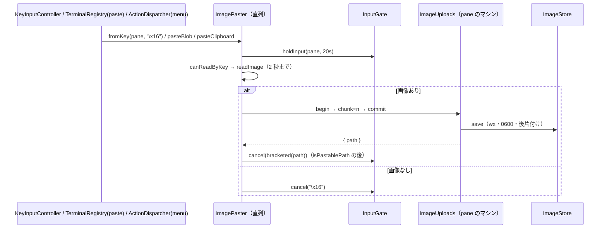

# レビューガイド: クリップボードの画像を pane へ貼り付ける（herdr H44）

## 変更概要 / 目的

ブラウザとサーバが別のマシンでも（保存した SSH のマシンの pane でも）、ブラウザのクリップボードの画像を pane の CLI エージェント（Claude Code 等）へ渡せるようにする。
方式は herdr と同じ「**サーバに画像を置いてそのパスを pane へ貼る**」（decisions D2）。きっかけは操作 `remote_image_paste`（既定 `ctrl+v`）・画像だけの paste イベント・
`Ctrl+Shift+V`／メニューの「貼り付け」（テキストが無いとき）。

## 重要ポイント

- **分けて送る**（D3）: `/ws`・中継の 1 通 4 MiB に対し画像は 16 MiB まで。768 KiB（base64 で 1 MiB）ずつ `pane.image.chunk` を前の応答を待って送る。HTTP の口にしないのは `/ws?machine=` の中継が WebSocket しか通さないため。
- **パスを貼るのはブラウザ**（D4）: 溜めたキーより前に差し込む `InputHold.cancel(first)` で順序を 1 か所で保つ。返ったパスはリモートを信用せず `isPastablePath` で検査。
- **Ctrl+V の順序**: 画像が無い・読めないときの `\x16` は、確かめている間に打ったキーより先に届く（`InputGate` の保持。読み取りは 2 秒で打ち切り＝D15）。
- **キーから読むのは Chromium だけ**（D6）: Firefox・Safari は読む度に「ペースト」のメニューが出るので、`permissions.query('clipboard-read')` で判定。
- **置き場所・寿命**（D5・D9）: `<状態ディレクトリ>/clipboard-images/`（0700・lstat で確かめる）・0600・`wx`・乱数の名前。切断では消さず、24 時間・100 個・256 MiB を書くたび・起動時・1 時間ごとに消す。
- **マシンの切り替え**（D14）: pane の id はマシンをまたいで重なるので、切り替えで仕事と保持を捨てる（`ImagePaster.resetForMachineSwitch`・`InputHold.discard`）。

## 処理フロー

## 主要な変更箇所

- `packages/protocol/src/image.ts` — 定数・`matchesImageMagic`・`isPastablePath`。`messages.ts` の `PaneImage*Params`、`errors.ts` の 6 つの code。
- `packages/server/src/image/ImageStore.ts` — ディレクトリの確かめ・書き込み・後片付け・`startSweeping`。
- `packages/server/src/image/ImageUploads.ts` — 送信の状態機械と上限（接続 1・全体 4〔保存中も数える〕・直近 60 秒の 20/60・30 秒・合計 5 分）。
- `packages/server/src/surface/methods/image.ts`・`composeServer.ts` — 方式の登録・2 つの `WsGateway` の `onClientGone`・`listen` の後片付け・`close` の `dispose`。
- `packages/web/src/term/ImagePaster.ts` — 直列の仕事・送信・パスの検査と列の組み立て・世代・toast。
- `packages/web/src/net/InputGate.ts` — 保持ごとの時間・`first`・`discard`。
- `packages/web/src/keys/{bindings,actions,KeyInputController,KeyRouter}.ts` — 操作 `remote_image_paste`・端末以外では横取りしない（`directActionOf`）・prefix 経由は fallback 無し。
- `packages/web/src/term/{clipboard,TerminalRegistry}.ts`・`actions/ActionDispatcher.ts`・`main.ts` — 読み取り・paste イベント・メニュー・配線。

## リスク / 確認したい点

- 実物のブラウザ・本物のエージェントでは未確認（E2E は回していない）。`docs/verification.md`「共通：クリップボードの画像の貼り付け」の手順で確かめてほしい。
- 既定で Ctrl+V を使う（herdr の `--remote` と同じ）。Vim/Emacs の利用者は、クリップボードに画像があると Ctrl+V がパスの貼り付けになる（外せる）。端末での Ctrl+V の押しっぱなしは 1 回になる（D13）。
- Chromium の初めての Ctrl+V で許可の画面が出る（2 秒以内に答えないとその回は `^V`）。
