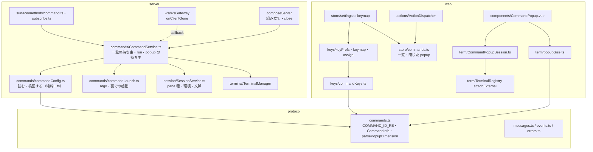
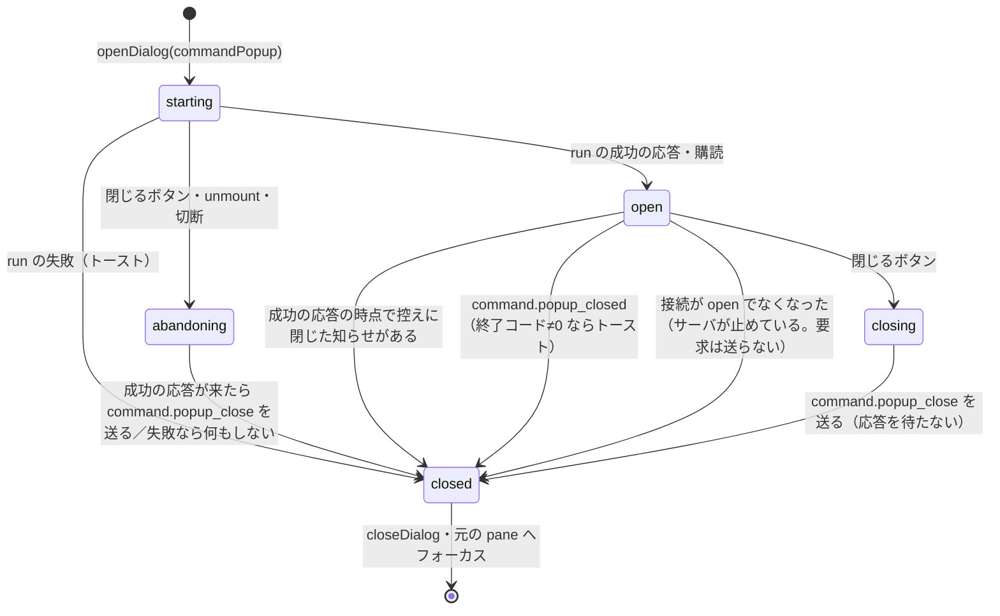

# 設計: 独自コマンドのキー（構造）

（design.md の「インターフェース / データ構造」を型の正典とし、ここでは部品の境界・依存の向き・状態の持ち主だけを決める。）

## アーキテクチャ概要

## コンポーネント / モジュール

- `protocol/commands.ts`：id の規則・種類・一覧の型・popup の幅高さの解釈。**サーバの検証とブラウザの大きさの計算が同じ規則を使う**ためにここに置く。
  依存は protocol の中の型（`Pane`・`PaneId`）だけ（zod も使わない純粋な関数）。`messages.ts` が `COMMAND_ID_RE` を使う。
- `server/commands/commandConfig.ts`：ファイルを開いて検査し、JSON を zod で検証して `CommandDef[]` か問題の文にする。**状態を持たない**。fs は引数で差し替え可能。
- `server/commands/commandLaunch.ts`：種類と OS から argv を作る純粋な関数と、裏で起動する薄い関数。**状態を持たない**。
- `server/commands/CommandService.ts`：**一覧（`CommandDef[]`）と popup（`Map<popupId, {clientId, cols, rows}>`）と裏の実行の数の唯一の持ち主**。
  依存：`SessionService`（文脈・環境・pane 種・id の払い出し）、`TerminalManager`（popup の端末）、`EventBus`（2 イベント）、`ClientRegistry`（接続の種別）。
  `SessionService` は `CommandService` を知らない（依存は一方向）。
- `server/session/SessionService.ts`：`pane` 種の pane の記録（`commandPanes`）の持ち主。モデルを変える唯一の入口という既存の責務（architecture の依存の規則 3）を保つ——
  `pane` 種の分割・拡大表示はここで行い、`CommandService` はモデルに触らない。
- `server/surface/methods/command.ts`：要求 → `CommandService`。`subscribe.ts` は popup の大きさを `CommandService.popupSize` に聞く（`MethodDeps.commands` は任意。
  無いテストの組み立てでは今までどおり）。
- `server/ws/WsGateway.ts`：切断を `onClientGone` のコールバックで外へ知らせるだけ（`CommandService` を import しない）。
- `web/keys/commandKeys.ts`：`KeyTargetId` と、一覧 → キーの対象の定義。`keys/` は Vue・store に依存しない既存の規則（architecture「規則 4」）を保つ。
- `web/store/commands.ts`：サーバの一覧・問題・閉じた popup の記録の持ち主（Pinia）。
- `web/store/settings.ts`：`keymap` の computed が `commands.catalog` を読む（settings → commands の一方向）。
- `web/term/CommandPopupSession.ts`：popup の 1 回分の手続き（Vue に依存しない。テストで偽の conn・端末を渡す）。
- `web/components/CommandPopup.vue`：DOM・xterm.js の生成・大きさの測定・フォーカス・イベントの遮断。
- `web/term/TerminalRegistry.ts`：pane 以外の受け手へ OUTPUT/SNAPSHOT を回す口（`attachExternal`）。閉じた後の `focus` も popup の部品から呼ばれる。
- そのほかの配線（図では省く）：`server/session/paneEnv.ts`（`SessionService`・`CommandService` の環境）、`web/store/StoreAdapter.ts`（2 イベント → `store/commands`・
  popup の部品への知らせ）、`web/store/view.ts`（`DialogContext` の `commandPopup`。`ActionDispatcher` が開き、部品が閉じる）、`web/main.ts`（接続ごとの `command.list` →
  `store/commands`）、`KeySettings.vue`・`HelpDialog.vue`（`settings.keymap` と `store/commands` を読む）、`CommandService` → `EventBus`・`ClientRegistry`、
  `commandLaunch` → protocol の `CommandType`、`settings` → `commandKeys` の `commandKeyDefs`、`CommandPopup.vue` → `store/commands.takeClosed`。どれも一方向。

## インターフェース / データモデル

- design.md「インターフェース / データ構造」のとおり。状態の持ち主：
  | 状態 | 持ち主 | 寿命 |
  |---|---|---|
  | 独自コマンドの一覧 | server `CommandService` | 起動〜停止。読み直しで置き換え |
  | popup（id→接続・大きさ） | server `CommandService` | 作成〜終了・閉じる・切断・停止 |
  | 裏の実行の数 | server `CommandService` | 起動〜終了 |
  | `pane` 種の復帰の記録 | server `SessionService.commandPanes` | pane の作成〜閉じる |
  | 一覧の写し・問題 | web `store/commands` | 接続ごとに取り直し・イベントで更新 |
  | 閉じた popup の控え（run の応答より先に来た知らせ） | web `store/commands.closedPopups` | 最新 32 件。部品が `takeClosed` で取り出して消す |
  | popup を開く情報（commandId・paneId・名前・大きさ）と戻り先の pane | web `store/view`（`DialogContext`・`preDialogFocusPaneId`） | 開く〜閉じる |
  | キーの割り当て | web `settings.keyPrefs.commands`（localStorage） | ブラウザごと・永続 |
  | 開いている popup | web `CommandPopup.vue` の `CommandPopupSession` | 開く〜閉じる |

## 処理フロー / シーケンス

- popup：design.md のシーケンス図。
- popup の状態（web）：

## 設計判断

- `CommandService` を `SessionService` の外に置く：`SessionService` は既に 1,419 行で、popup はモデルに入らない。モデルを変える `pane` 種だけを
  `SessionService` に置き、一覧と popup は別の係にする。
- `WsGateway` はコールバックで知らせる：`WsGateway` が `CommandService` を import すると、接続の層がコマンドの層に依存する。既存の
  `sizeAuthority.onClientGone` は注入された部品の呼び出しだが、ここは任意の追加なのでオプションのコールバックにする（既存のテストの組み立てを変えない）。
- `parsePopupDimension` を protocol に置く：サーバの検証とブラウザの計算で規則を 2 か所に書かない。

## tasks への申し送り

- 順序：protocol（型・code・イベント）→ server の純粋な部品（config・launch）→ `SessionService`・`paneEnv` → `CommandService` → 要求・購読・切断・組み立て →
  web の keys（型・保存・表・取り込み）→ store → 設定画面・キー一覧 → 実行（dispatcher）→ popup（size・session・部品・registry・main/App）→ docs。
- `web/keys` の型の拡張（`ActionId` → `KeyTargetId`）は既存のテストの型に波及する。keys の中で閉じるよう 1 タスクにまとめる。
