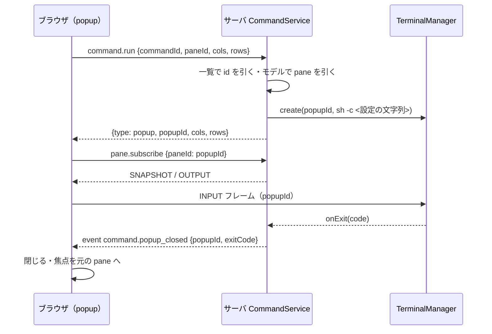

# 仕様: 独自コマンドのキー（herdr の `[[keys.command]]`）

## 概要

サーバは状態ディレクトリの `commands.json`（名前付き session ではその session の状態ディレクトリ）を起動時と
`command.reload` の要求で読み、zod の厳しいスキーマと上限・ファイルの持ち主と権限（Unix）で検証した**独自コマンドの一覧**を
持つ。ブラウザには `command.list`／イベント `command.updated` で**コマンドの文字列を除いた一覧**（id・種類・説明・popup の幅と高さ）
を渡す。ブラウザは設定画面の節「キー」の新しい群「独自コマンド」で、コマンドごとに prefix の後・直接のキーを割り当てる
（`wtm.prefs.v1` の `keys.commands`。ブラウザごと）。キーを押すと `command.run { commandId, paneId, cols?, rows? }` を送り、サーバは
一覧の定義の文字列を `/bin/sh -c`（`shell` は `-lc`）／`%ComSpec% /d /c` にそのまま渡して、種類ごとに
- `shell`: `child_process.spawn(…, { detached, stdio: "ignore" })` で裏で走らせる（同時 16 本まで）。
- `pane`: scrollback の編集と同じ「対象の pane を分割 → 拡大表示 → 閉じたら焦点と拡大表示を戻す」pane で走らせる。
- `popup`: モデルに入れない端末（pane の id を払い出す）を `TerminalManager` に作り、要求した接続だけが持つ。ブラウザは
  `role="dialog"` の浮いた枠に自前の xterm.js を置き、既存の `pane.subscribe`・INPUT フレームで流す。コマンドが終わると
  イベント `command.popup_closed` で閉じる。
コマンドの環境には `WTM_ACTIVE_WORKSPACE_ID`・`WTM_ACTIVE_TAB_ID`・`WTM_ACTIVE_PANE_ID`・`WTM_ACTIVE_PANE_CWD`・`WTM_COMMAND_ID` を足す。

## 設計方針

- **コマンドの文字列はサーバの中だけ**（利用者の決定 1・F5・F6）。ブラウザへの一覧（`CommandInfo`）に `command` の項目を
  型として持たせない。`command.run` のスキーマは `commandId`（規則つき）・`paneId`・`cols`・`rows` だけで、zod の `z.object` が
  それ以外を取り除く（既存の要求と同じ。zod の `z.object` の既定の挙動——edit-scrollback の design「依拠する既存の事実」の「方式の登録」で同じ前提を置いた。T1 のテストで確かめる）。サーバは `commandId` で一覧を引き、**一覧の文字列だけ**を argv の
  最後の要素にする。ブラウザ由来の値が入るのは環境変数の値（`WTM_ACTIVE_*`）だけで、それも**モデルから引き直した値**
  （`paneId` はモデルに在ることを確かめ、workspace・tab・cwd はモデルから読む）。
- **id は持ち主が付ける**（herdr は不透明な id を毎回作るが、本製品はキーの割り当てをブラウザが id で保存するので、
  読み直しで変わらない id が要る。research「design への申し送り」）。規則 `^[a-z0-9][a-z0-9_-]{0,63}$`（小文字・数字・`-`・`_`。
  保存のキー・DOM の属性・ログに安全に使える）。
- **形式は JSON・検証は zod**（requirements F1。TOML の解析器は依存に無い。research F32）。1 つでも規則外ならファイル全体を
  採らない（requirements F3）。**理由の文にコマンドの文字列を入れない**（zod の issue の path と種類だけから作る。`unrecognized_keys` は
  キー名を出すが、それは持ち主が書いた項目名で秘密ではない）。
- **Unix のファイルの検査**（requirements F4）：`open(path, O_RDONLY | O_NOFOLLOW | O_NONBLOCK)` で開き（`O_NONBLOCK` は FIFO で書き手を待って
  止まらないため）（シンボリックリンクなら `open` 自体が `ELOOP` で失敗する）、
  **開いた fd の `fstat`** で、通常のファイルでない・持ち主がサーバの uid でない・グループかその他が書ける（`mode & 0o022`）・
  64 KiB を超える、を拒否し、**同じ fd から読む**（検査と読み込みの間の差し替え〔TOCTOU〕を塞ぐ。`lstat` は使わない）。
  読める（`mode & 0o044`）だけなら採るがログに警告（秘密を書く人がいる）。Windows は `O_NOFOLLOW` が無いので付けず、持ち主・権限も
  検査しない（requirements F4。docs に書く）。種類と大きさの検査は Windows でも行う。
- **popup は要求した接続のもの**（D2）。`command.run` で popup を作った接続（`clientId`）だけが**購読でき・閉じられ**、その接続が切れたら止める。
  INPUT フレームは持ち主を確かめない（pane と同じ。INPUT は認証済みの接続なら誰でもどの pane にも書ける既存の設計で——research F1、SizeAuthority の
  注記「所有者は安全の境界ではない（INPUT は今までどおり誰でも書ける）」`clients/SizeAuthority.ts:24-27`——同じ利用者の別の画面を境界にしない）。
  接続の種別が `external`（`wtmctl`）なら断る（requirements F9）。1 接続に同時 1 つ（requirements F9・herdr と同じ）。
- **popup の大きさはブラウザが決めて送る**（requirements F6）。ブラウザは pane の領域（`.app-panes`、無ければ窓）の大きさと
  popup の xterm.js のセルの寸法から、`width`/`height`（省略は半分・数はセル・`N%` は割合）を列数・行数にする。サーバは
  2〜500 の整数だけを受ける。大きさの変化への追従はしない（D2・backlog）。
- **popup の端末はモデルに入れない**。id は `SessionModel.reserveNextPaneId()` で払い出し（pane と衝突しない。research F6）、
  `TerminalManager.create` で作る（research F3）。購読は `pane.subscribe` を広げて popup の id も持ち主から受ける（research F2）。入力は既存の INPUT フレームが
  そのまま届く（research F1）。保存（`session.json`）はモデルからしか作らないので popup は入らない（`composeServer.ts:535-` `toSessionFileData` が
  `session.snapshot()` から作る）。
- **ブラウザの popup の端末は `TerminalRegistry` の外で作る**。registry の端末は `KeyInputController` が prefix を横取りする
  （research F31）ので、popup では全てのキーを端末へ渡すために別に作る。OUTPUT/SNAPSHOT は `TerminalRegistry` に足す
  「外の受け手」（`attachExternal(id, sink)`）へ回す。
- **popup の部品はネイティブの `<dialog>` を使わず、`role="dialog"`・`aria-modal="true"`・`aria-labelledby` の `div` と、pane の領域を
  覆う背景**（research「実現性 / リスク」：Esc を確実に端末へ渡すため）。開く・閉じるは他のダイアログと同じ
  `view.openDialogWithContext`／`view.closeDialog`（`KeyRouter` が `dialog` モードになり、window の keydown も何もしない。research F30）。
- **APG の modal dialog との食い違い**（research F27〜F29）：Esc で閉じない・Tab が枠の中で循環せず端末へ入る——popup の中身は端末で、
  Esc も Tab も端末のアプリ（vim・lazygit 等）が使う。herdr（「Escape を含む全ての入力を受ける」）と tmux の `display-popup`（`-E` で
  コマンドの終了で閉じる）に合わせる。閉じるのは**コマンドの終了**（キーボード）と見出しの閉じるボタン（マウス）。フォーカスは
  開くと端末へ・閉じると開く前の pane の端末へ（APG と同じ）。
- **`pane` 種は scrollback の編集の仕組みを共有する**。`editScrollback` の「分割・拡大表示・記録・イベント」を private の
  `openZoomedCommandPane` に抜き出し、両方から使う。記録は `scrollbackEditors`（一時ディレクトリを持つ）とは別の `commandPanes` の
  Map（引き継ぎの形 `HandoffScrollbackEditor` を変えないため。research F10）。`closePane` は両方を見る。
- **キーの表を「操作 ∪ 独自コマンド」に広げる**。キーの対象の id を `KeyTargetId = ActionId | CommandKeyId`（`command:<id>`）にし、
  `resolveKeymap(prefs, commands)` の登録を「1. 上書きのある操作 → 1.5 独自コマンド（すべて利用者の割り当て）→ 2. 上書きの無い操作の
  既定」にする（利用者の割り当てが既定に勝つ既存の規則。research F18）。`ResolvedKeymap` に今の一覧（`commands`）と名前の引き（`labelOf`）を
  持たせ、表を作り直す箇所（`planReset`・`applyRecommended`）は `km.commands` を引き継ぐ（research F20）。保存は `keys.commands`
  （`{ "<コマンドの id>": ["prefix+g", …] }`）で、一覧の有無と関係なく id の規則だけで読む（F13：消えたコマンドの割り当ても残す）。
- **`reload_config` がサーバの読み直しも送る**（F15）。結果は全ブラウザへ `command.updated` で配る。

### 検討した代替案

- **ブラウザが popup/pane/shell とコマンドの文字列を送る汎用の口**：利用者の決定 1 に反する。退けた。
- **herdr と同じ TOML（`config.toml`）**：依存が増え、`[keys]` 等の他の節を持たない本製品では 1 つの節だけの TOML になる。
  JSON なら zod で厳しく検証できる（research F32）。退けた。
- **サーバが不透明な id を毎回作る（herdr）**：ブラウザの保存の鍵が読み直し・再起動で変わり、割り当てが消える。退けた。
- **popup をモデルの pane にする（隠れた pane）**：レイアウト・保存・復元・エージェントの判定・サイズ権限の全てが pane を前提にしており、
  「レイアウトを変えない」「保存しない」ために全部に例外が要る。退けた。
- **popup を全ブラウザに出す**：D2 のとおり退けた。
- **ネイティブの `<dialog>`**：Esc の `cancel` を確実には止められない（research「実現性 / リスク」）。退けた。
- **設定ファイルの変更の監視（`fs.watch`）**：OS ごとの挙動の差と、書きかけのファイルを読む問題がある。明示の読み直しにした（対象外）。

## 対象範囲

- protocol
  - `packages/protocol/src/commands.ts`（新規）：`COMMAND_ID_RE`・`COMMAND_TYPES`・`PopupDimension`・`CommandInfo`・`CommandListResult`・
    `CommandRunResult`・`parsePopupDimension`（`number | "N%"` の検証。サーバの設定の検証とブラウザの大きさの計算で共有）。
  - `packages/protocol/src/messages.ts`：`CommandListParams`・`CommandReloadParams`・`CommandRunParams`・`CommandPopupCloseParams`、
    `METHOD_SCHEMAS`・`MethodResultMap` に `command.list`・`command.reload`・`command.run`・`command.popup_close`。
  - `packages/protocol/src/events.ts`：`CommandUpdatedEvent`（`command.updated`）・`CommandPopupClosedEvent`（`command.popup_closed`）。
  - `packages/protocol/src/errors.ts`：`command_not_found`・`command_failed`・`command_popup_open`・`command_busy`。
  - `packages/protocol/src/index.ts`：`commands.ts` の再輸出。
- server
  - `packages/server/src/commands/commandConfig.ts`（新規）：ファイル名・スキーマ・上限・`parseCommandsJson`・`toCommandInfo`・`loadCommandsFile`。
  - `packages/server/src/commands/commandLaunch.ts`（新規）：`commandArgv`・`spawnDetachedCommand`。
  - `packages/server/src/commands/CommandService.ts`（新規）：一覧の保持・読み直し・`run`・popup の管理・後始末。
  - `packages/server/src/session/paneEnv.ts`：`paneId` を任意に、`extra`（足す変数）を受ける。`PANE_ENV_DROPPED` に `WTM_ACTIVE_*`・`WTM_COMMAND_ID`。
  - `packages/server/src/session/SessionService.ts`：`openZoomedCommandPane`（`editScrollback` から抜き出し）・`openCommandPane`・`commandPanes`・
    `commandContext`・`commandEnv`・`reservePaneId`・`closePane`/`publishPaneClosed` の対応・`spawnForPane` の `command.env`。
  - `packages/server/src/surface/methods/command.ts`（新規）：4 要求のハンドラ。`index.ts`・`deps.ts`（`commands?`）。
  - `packages/server/src/surface/methods/subscribe.ts`：popup の id を受ける。
  - `packages/server/src/ws/WsGateway.ts`：`WsGatewayOptions.onClientGone`。
  - `packages/server/src/composeServer.ts`：`CommandService` の組み立て・起動時の読み込み・`close()` での後始末・`WsGateway` への配線。
- web
  - `packages/web/src/keys/commandKeys.ts`（新規）：`CommandKeyId`・`KeyTargetId`・`commandKeyId`・`isCommandKeyId`・`commandIdOf`・`CommandKeyDef`・`commandKeyDefs`。
  - `packages/web/src/keys/actions.ts`：`{ type: "runCommand"; commandId: string }`。
  - `packages/web/src/keys/keyPrefs.ts`：`KeyPrefs.commands`・読み込み・保存・`withBindings`/`withoutBindings` の振り分け。
  - `packages/web/src/keys/keymap.ts`：`resolveKeymap(prefs, commands?)`・`ResolvedKeymap` の型の拡張（`commands`・`labelOf`・`KeyTargetId`）。
  - `packages/web/src/keys/assign.ts`：`KeyTargetId` 対応・`km.labelOf`・作り直しで `km.commands` を引き継ぐ。
  - `packages/web/src/store/commands.ts`（新規）：一覧・問題・閉じた popup の記録（開いている popup は `CommandPopupSession` が持つ。architecture の表）。
  - `packages/web/src/store/settings.ts`：`keymap` に一覧を渡す、`setKeyBindings`/`resetKeyAction` を `KeyTargetId` に。
  - `packages/web/src/components/KeySettings.vue`：群「独自コマンド」・0 件の案内・問題の表示・名前の引き。
  - `packages/web/src/components/HelpDialog.vue`：群「独自コマンド」。
  - `packages/web/src/term/popupSize.ts`（新規）：幅・高さ → 列数・行数。
  - `packages/web/src/term/CommandPopupSession.ts`（新規）：popup の端末の 1 回分（起動・購読・入力・閉じる）。
  - `packages/web/src/components/CommandPopup.vue`（新規）：浮いた枠。
  - `packages/web/src/term/TerminalRegistry.ts`：`attachExternal`。
  - `packages/web/src/actions/ActionDispatcher.ts`：`runCommand`・`reloadConfig` から `command.reload`。
  - `packages/web/src/store/StoreAdapter.ts`：2 イベント。
  - `packages/web/src/store/view.ts`：`DialogContext` に `commandPopup`。
  - `packages/web/src/main.ts`：接続ごとの `command.list`。`App.vue`：部品の配置。
  - `packages/web/src/net/clientError.ts`：4 code の文言。
- docs：`docs/custom-commands.md`（新規。置き場所・書き方・例・安全）、`docs/herdr-parity.md` の H12（と H26 の対象外の記述）、
  `docs/verification.md`（手動確認の項目）。
- backlog：`.aidev/backlog/product-roadmap.md:54` を割る（deliver）。

## 依拠する既存の事実

（出所は research.md の F 番号と、そこに書いた `file:line`。ここで新たに確かめたものは直接書く。）

- 入力のフレームはモデルを見ずに `TerminalManager.get(paneId).write`（research F1・`WsGateway.ts:112-115`）。
- `pane.subscribe` はモデルの pane が無ければ `not_found`（research F2・`subscribe.ts:9-13`）。
- `TerminalManager.create` はモデルと独立で、終わると自分で `dispose`（research F3・`TerminalManager.ts:62-75,96-99`）。
- 接続の終わりの後始末は `WsGateway` の `conn.onClose`（research F4・`WsGateway.ts:124-131`）。コンストラクタの最後の引数が `WsGatewayOptions`（`:30-37,52`）。
- 接続の種別は `ClientRegistry.get(id)?.kind`（research F8）。
- `reserveNextPaneId` は `p<N>` を払い出す（research F6・`SessionModel.ts:320-322`）。
- `editScrollback`・`closePane`・`publishPaneClosed`・`spawnForPane`・`envForPane` の流れ（research F9〜F12・`SessionService.ts:462-471,671-745,1068-1123`）。
- シェルが終わると pane を閉じ、猶予（300ms）中の 0 以外の終了は起動の失敗（research F11）。
- `buildPaneEnv` は `WTM_PANE_ID` を常に入れる（research F14・`paneEnv.ts:53`）。
- 停止は `composeServer.close()`、`finally` で `disposeScrollbackEditors`（research F7・`composeServer.ts:474-512`）。
- 名前付き session の `options.stateDir` はその session の状態ディレクトリ（research F16）。
- キーの表・保存・取り込み・設定画面・キー一覧・実行・イベントの受け口（research F18〜F26 の各 `file:line`）。
- ダイアログの開閉と `KeyRouter` の `dialog` モード・window の keydown の素通し（research F30・`main.ts:271-285`・`view.ts:354-375`）。
- `view.closeDialog()` は `focusedPaneId` を開く前の値に戻すだけで、値が同じなら `TerminalPane` の `watch`（`TerminalPane.vue:62-68`）は
  発火しない（Vue の `watch` は値が変わらなければ呼ばれない——Vue の文書の記述で、リポジトリ内では未確認。popup は自前で戻すので、発火してもしなくても結果は同じ）——popup は閉じた後に `registry.focus(paneId)`（`TerminalRegistry.ts:179-181`）を
  自分で呼ぶ。他のダイアログはネイティブの `<dialog>` が閉じたときにフォーカスを戻している（`ConfirmDialog.vue` 等。未確認：各ダイアログの
  フォーカスの戻し方の細部は読んでいない。popup は自前で戻すので依拠しない）。
- `open` に `O_NOFOLLOW` を付けるとシンボリックリンクで `ELOOP`、`O_NONBLOCK` を付けると FIFO でも待たずに開けて `fstat` の `isFile()` が false・`isFIFO()` が true、
  `fstat` で `uid`・`mode` が取れる——この worktree の Linux で `node -e` で実測した（`scratchpad/check-design/` に作ったリンクと FIFO）。Windows に `O_NOFOLLOW` が
  無いこと・`fstat` の `uid` が意味を持たないことは Node の文書の記述で未確認（Windows では検査しない設計なので依拠は小さい）。
- 保存は `toSessionFileData`（`composeServer.ts:535-`）が `session.snapshot()`（モデル）から作る。
- セルの寸法は `getCellSize(term)`（`term/measure.ts:27-32`。レイアウトの無い環境では 9×18）。
- OUTPUT/SNAPSHOT は `main.ts` の `sinkProxy` から registry へ（research F31・`main.ts:78-82`）。
- 失敗の文言の表は `Record<ErrorCode, string>`（research A14・「実装時の注意」・`clientError.ts:13`）。
- zod は server の直接の依存（`packages/server/package.json:24` の `"zod": "^4.6.5"`。入っている版は 4.6.5）。`z.strictObject({...})` が知らない項目を
  `unrecognized_keys`（`keys`・`path` つき）の issue で拒否することを、この worktree の `node -e` で実測した（research F32 の `.strict()` と同じ働きの zod 4 の書き方）。
- `/ws` の upgrade は Cookie のセッションを `AuthService.authorizeUpgrade`（`packages/server/src/auth/AuthService.ts:86-90`）で確かめ、`composeServer.ts:251` が
  `WsServerWs` に渡している。要求はこの接続の上の `ControlSurface` にだけ届く（research F4 の `WsGateway`）。

## インターフェース / データ構造

### 設定ファイル（`<stateDir>/commands.json`）

```json
{
  "commands": [
    { "id": "lazygit", "type": "popup", "command": "lazygit", "description": "lazygit を開く", "width": "80%", "height": "80%" },
    { "id": "htop", "type": "pane", "command": "htop" },
    { "id": "build", "type": "shell", "command": "make -C \"$WTM_ACTIVE_PANE_CWD\" > /tmp/build.log 2>&1" }
  ]
}
```

| 項目 | 規則 |
|---|---|
| ファイル | 64 KiB（65,536 バイト）以下。UTF-8 の JSON。最上位は `{ "commands": [...] }` だけ（知らない項目は拒否） |
| `commands` | 配列。0〜100 件 |
| `id` | 必須。`^[a-z0-9][a-z0-9_-]{0,63}$`。重複は拒否 |
| `type` | 必須。`popup`・`pane`・`shell` |
| `command` | 必須。1〜4,096 文字。空白だけは拒否。制御文字（U+0000〜U+001F・U+007F）は改行（`\n`）だけ許す（requirements F3） |
| `description` | 任意。1〜200 文字。制御文字は拒否 |
| `width`・`height` | 任意。`popup` のときだけ。整数 1〜1,000（セル）か `"N%"`（N は 1〜100 の整数） |
| 各項目 | 知らない項目は拒否 |

### protocol（`commands.ts`・`messages.ts`・`events.ts`・`errors.ts`）

```ts
export const COMMAND_ID_RE = /^[a-z0-9][a-z0-9_-]{0,63}$/;
export const COMMAND_TYPES = ["popup", "pane", "shell"] as const;
export type CommandType = (typeof COMMAND_TYPES)[number];
export type PopupDimension = number | `${number}%`;
/** セル数（1〜1000 の整数）か `N%`（1〜100）なら正規の値、そうでなければ null。 */
export function parsePopupDimension(v: unknown): { kind: "cells"; value: number } | { kind: "percent"; value: number } | null;
export interface CommandInfo { id: string; type: CommandType; description?: string; width?: PopupDimension; height?: PopupDimension }
export interface CommandListResult { commands: CommandInfo[]; problem: string | null }
export type CommandRunResult =
  | { type: "shell" }
  | { type: "pane"; pane: Pane }
  | { type: "popup"; popupId: PaneId; cols: number; rows: number };

// messages.ts
export const CommandListParams = z.object({});
export const CommandReloadParams = z.object({});
export const CommandRunParams = z.object({
  commandId: z.string().regex(COMMAND_ID_RE),
  paneId,
  cols: z.number().int().min(2).max(500).optional(),
  rows: z.number().int().min(2).max(500).optional(),
});
export const CommandPopupCloseParams = z.object({ popupId: paneId });
// METHOD_SCHEMAS / MethodResultMap:
//   "command.list" → CommandListResult, "command.reload" → CommandListResult,
//   "command.run" → CommandRunResult, "command.popup_close" → Record<string, never>

// events.ts
export interface CommandUpdatedEvent { event: "command.updated"; data: CommandListResult }
export interface CommandPopupClosedEvent { event: "command.popup_closed"; data: { popupId: PaneId; exitCode?: number } }
// errors.ts: "command_not_found" | "command_failed" | "command_popup_open" | "command_busy"
```

### server

```ts
// commands/commandConfig.ts
export const COMMANDS_FILE_NAME = "commands.json";
export const COMMANDS_FILE_MAX_BYTES = 65_536; export const COMMANDS_MAX = 100;
export interface CommandDef extends CommandInfo { command: string }
export type CommandCatalog = { commands: CommandDef[]; problem: string | null };
export function parseCommandsJson(text: string): CommandCatalog;               // 規則外は { commands: [], problem }
export function toCommandInfo(def: CommandDef): CommandInfo;                    // command を落とす
export interface CommandFileDeps { open: typeof fs.open; getuid: (() => number) | undefined; platform: NodeJS.Platform }
export async function loadCommandsFile(path: string, deps?: Partial<CommandFileDeps>): Promise<CommandCatalog & { warning?: string }>;
//  ENOENT → { commands: [], problem: null }。open(path, O_RDONLY | O_NOFOLLOW〔win32 以外〕) → fstat で検査 → 同じ fd から読む

// commands/commandLaunch.ts
export function commandArgv(type: CommandType, command: string, platform: NodeJS.Platform, env: NodeJS.ProcessEnv): string[];
//  win32 以外: ["/bin/sh", type === "shell" ? "-lc" : "-c", command]
//  win32: [env.ComSpec〔大文字小文字を区別せず。空なら "cmd.exe"〕, "/d", "/c", command]
export function spawnDetachedCommand(argv: string[], opts: { cwd: string; env: Record<string, string>; platform: NodeJS.Platform },
  onDone: () => void, onError: (err: Error) => void): void;          // detached・stdio ignore・windowsHide・unref

// commands/CommandService.ts
export interface CommandServiceOptions {
  filePath: string; session: SessionService; terminals: TerminalManager; bus: EventBus; clients: ClientRegistry; logger: Logger;
  platform?: NodeJS.Platform; env?: NodeJS.ProcessEnv; load?: typeof loadCommandsFile; spawnDetached?: typeof spawnDetachedCommand;
  isDirectory?: (p: string) => Promise<boolean>; maxDetached?: number /* 既定 16 */;
}
export class CommandService {
  list(): CommandListResult;
  reload(): Promise<CommandListResult>;                       // 読み直して置き換え、`command.updated` を配る
  run(clientId: string, params: CommandRunParams): Promise<CommandRunResult>;
  popupSize(clientId: string, popupId: PaneId): { cols: number; rows: number } | undefined;   // 持ち主の接続でなければ undefined
  closePopup(clientId: string, popupId: PaneId): void;        // 持ち主でなければ not_found
  onClientGone(clientId: string): void;
  dispose(): void;                                            // 停止時。全 popup を止める
}

// SessionService（足すもの）
reservePaneId(): PaneId;
commandContext(paneId: PaneId): { workspaceId: WorkspaceId; tabId: TabId; paneId: PaneId; cwd: string; defaultCwd: string };
commandEnv(ownPaneId: PaneId | undefined, extra: Record<string, string>): Record<string, string>;
openCommandPane(paneId: PaneId, cwd: string, command: { shell: string; args: string[]; env: Record<string, string> }): Promise<{ pane: Pane }>;
// spawnForPane の command に env?: Record<string,string>（envForPane の上に重ねる）

// paneEnv.ts
interface PaneEnvManaged { paneId?: string | undefined; /* 既存 */ extra?: Record<string, string> | undefined }

// WsGateway
interface WsGatewayOptions { now?: …; onClientGone?: ((clientId: string) => void) | undefined }
```

### web

```ts
// keys/commandKeys.ts
export type CommandKeyId = `command:${string}`;
export type KeyTargetId = ActionId | CommandKeyId;
export interface CommandKeyDef { id: CommandKeyId; commandId: string; label: string /* description ?? id */ }
export function commandKeyId(commandId: string): CommandKeyId;
export function isCommandKeyId(id: string): id is CommandKeyId;
export function commandIdOf(id: CommandKeyId): string;
export function commandKeyDefs(list: readonly CommandInfo[]): CommandKeyDef[];

// keyPrefs.ts
interface KeyPrefs { /* 既存 */ commands: Record<string, string[]> }   // 空の一覧は持たない（既定が無いので「無い」と同じ）
// 保存: keys.commands = { "<id>": [...] }（id の昇順）。読み込み: id が COMMAND_ID_RE・最大 200 件・各値は normalizeBinding の非範囲の規則

// keymap.ts
export function resolveKeymap(prefs: KeyPrefs, commands?: readonly CommandKeyDef[]): { keymap: ResolvedKeymap; problems: string[] };
interface ResolvedKeymap { /* 既存。id は KeyTargetId に */ readonly commands: readonly CommandKeyDef[]; labelOf(id: KeyTargetId): string }

// store/commands.ts
useCommandsStore: { catalog: CommandInfo[]; problem: string | null; setCatalog(r: CommandListResult): void;
  closedSeq: number; notePopupClosed(popupId, exitCode?): void; takeClosed(popupId): …}
// 閉じた控え（Map）は store の内部に持ち（公開しない・リアクティブでない）、変化は closedSeq を watch して拾う（T8 の点検で記述を実装に合わせた）
// closedPopups は run の応答より先に閉じた知らせが来た場合のためだけの控え。popup の部品が応答の後に `takeClosed` で取り出して消す。
// 自分のものでない id も入るので、最新 32 件だけ残す

// term/popupSize.ts
export function popupCells(width: PopupDimension | undefined, height: PopupDimension | undefined,
  area: { cols: number; rows: number }): { cols: number; rows: number };
//  省略は半分・セルはそのまま・% は割合（切り捨て）。最大は area（枠と見出しの分を差し引いた値を呼び出し側が渡す）、最小 10×3。
//  area が最小より小さいときは area を優先する（はみ出さない）。最後に 2〜500 に収める

// term/CommandPopupSession.ts
export class CommandPopupSession {
  constructor(deps: { conn: ConnectionPort; registry: Pick<TerminalRegistry, "attachExternal">; term: TerminalLike });
  start(commandId: string, paneId: string, cols: number, rows: number): Promise<{ ok: true; popupId: string } | { ok: false; code: string | null }>;
  onClosed(popupId: string): void;   // サーバから閉じた知らせ
  close(): void;                     // 閉じるボタン・unmount（まだ開いていれば command.popup_close）
}

// view.ts DialogContext
| { kind: "commandPopup"; commandId: string; paneId: string; title: string; width?: PopupDimension; height?: PopupDimension }
```

## 振る舞いの詳細

### サーバ：読み込み・読み直し

1. 起動時（`composeServer` で `registerAllMethods` の前）に `commands.reload()` を 1 回（`listen()` より前。イベントの購読者はまだいない）。
2. `loadCommandsFile`：`open(path, O_RDONLY | O_NOFOLLOW)`。ENOENT → 0 件・問題なし。ELOOP（リンク）→ 問題「シンボリックリンクは使えません」。
   `fstat`：通常のファイルでない・（Unix）uid が `process.getuid()` と違う・`mode & 0o022` → 問題。`size > 64 KiB` → 問題。
   読んで `parseCommandsJson`。`mode & 0o044` なら警告（ログだけ）。fd は必ず閉じる。
3. 問題があれば一覧は 0 件（直前の一覧も捨てる。F3）、`logger.warn("custom commands rejected", { file, problem })`。
   問題の文は `commands.json: <理由>`（理由は path と種類。例 `commands[1].type: 知らない種類です（popup・pane・shell のどれか）`）。
4. `reload()` は `command.updated` を配り、結果を返す。

### サーバ：`command.run`

1. `commandId` を一覧から引く。無ければ `command_not_found`（何も起動しない）。
2. `session.commandContext(paneId)`（pane が無ければ `not_found`）。作業場所は `cwd` がディレクトリなら `cwd`、でなければ `defaultCwd`。
3. 足す変数 `extra = { WTM_ACTIVE_WORKSPACE_ID, WTM_ACTIVE_TAB_ID, WTM_ACTIVE_PANE_ID, WTM_ACTIVE_PANE_CWD: <モデルの cwd>, WTM_COMMAND_ID }`。
   `popup`・`shell` の環境は `session.commandEnv(undefined, extra)`（`WTM_PANE_ID` なし）。`pane` 種は環境を作らず `extra` だけを渡す（新しい pane の id は
   `openZoomedCommandPane` の中で決まり、`spawnForPane` が `envForPane(新しい id)` の上に `extra` を重ねる）。
   argv = `commandArgv(type, def.command, platform, process.env)`（`ComSpec` はサーバの環境から読む）。
4. 種類ごと：
   - `shell`：走っている数が上限なら `command_busy`。`spawnDetached`（`error` はログと数の戻し、`exit` で数を戻す）。`spawn` が同期で投げたら
     `command_failed`。→ `{ type: "shell" }`。
   - `pane`：`session.openCommandPane(paneId, cwd, { shell: argv[0], args: argv.slice(1), env: extra })`（`WTM_PANE_ID` は `envForPane` が
     新しい pane の id で入れる）。起動の失敗は既存どおり `spawn_failed`。→ `{ type: "pane", pane }`。
   - `popup`：接続の種別が `external` なら `invalid_params`（「popup はブラウザからだけ」）。`cols`/`rows` が無ければ `invalid_params`。
     その接続が既に popup を持っていれば `command_popup_open`。`popupId = session.reservePaneId()`、`terminals.create(popupId,
     { shell, args, cwd, cols, rows, env })`（投げたら `command_failed`）、**同じ同期区間で** `host.onExit(code => this.popupExited(popupId, code))`。
     記録 `popups.set(popupId, { clientId, cols, rows })`。→ `{ type: "popup", popupId, cols, rows }`。
5. ログに `command run`（id・種類・接続。**コマンドの文字列は出さない**）。

### サーバ：popup の終わり

- `popupExited(id, code)`：記録があれば消して `command.popup_closed { popupId, exitCode: code }`。
- `closePopup(clientId, id)`：記録が無い・持ち主が違う → `not_found`。消して `terminals.dispose(id)`、`command.popup_closed { popupId }`（exitCode なし）。
  `dispose` で後から `onExit` が来ても記録が無いので二重に配らない。
- `onClientGone(clientId)`：その接続の popup を `closePopup` と同じく止める。`WsGateway` の `conn.onClose` から（`sizeAuthority.onClientGone` の後）。
- `dispose()`：全 popup を止める（停止時。`composeServer.close()` の `finally`、`disposeScrollbackEditors` の前）。走っている `shell` は止めない（切り離し。herdr と同じ）。
- `pane.subscribe`：モデルの pane が無ければ `commands.popupSize(ctx.clientId, id)` を見て、**その接続が持ち主なら**購読する（大きさは popup の値）。
  持ち主でなければ `not_found`（別の画面・`wtmctl` からは見えない）。
- `command.popup_closed` は `EventBus` で全接続へ配る（id だけで中身は無い）。ブラウザは自分の popup の id でなければ無視する。

### サーバ：`pane` 種

- `openZoomedCommandPane(paneId, cwd, command, record)`：`editScrollback` の 684〜702 行の手順（予約・起動・分割・拡大表示・記録・イベント・
  保存の予約・`alreadyExited` の後始末）をそのまま移したもの。`editScrollback` は一時ファイルを書いた後にこれを呼び、記録で
  `scrollbackEditors.set` する（振る舞いは変えない）。`openCommandPane` は記録で `commandPanes.set(newPaneId, { sourcePaneId, previousZoomedPaneId })`。
- `closePane`：`const overlay = scrollbackEditors.get(id) ?? commandPanes.get(id)` で後継の希望と拡大表示の戻しを行う。`publishPaneClosed` で
  `commandPanes.delete(id)`。

### web：一覧とキー

- 接続ごと（`connection.onOpened`）に `command.list` → `commands.setCatalog`。イベント `command.updated` でも `setCatalog`。
- `settings.keymap = resolveKeymap(keyPrefs, commandKeyDefs(commands.catalog))`。
- `resolveKeymap` の 1.5：一覧の順に、`prefs.commands[def.commandId]` の各割り当てを `source: "user"` で登録（範囲は不可・直接は `isDirectChord`・
  予約・prefix・先勝ちの衝突は既存と同じ）。action は `{ type: "runCommand", commandId }`。一覧に無い id の割り当ては登録しない（保存は残る）。
- 設定画面：群の並びは「全体 → workspace / tab → pane → 独自コマンド」。独自コマンドの行は既存の行と同じ部品（［変更］［削除］［追加：prefix の後］
  ［追加：直接］）。［既定に戻す］は出さない（既定が無い）。一覧が 0 件なら群の代わりに案内「独自コマンドは、サーバの状態ディレクトリの
  `commands.json` に書きます（書き方は docs/custom-commands.md）。書いたら「設定を読み直す」（<今の割り当て>）で読み込みます。」（キーは表から引く。割り当てを外していれば省く）、問題があれば
  その文も出す。絞り込みは名前・群名（既存と同じ）。
- キー一覧：群「独自コマンド」に、割り当てのあるコマンドだけ（名前とキー）。無ければ群ごと出さない。
- `reload_config`：今の処理に加え `command.reload` を送り、応答で `setCatalog`、`problem` があればトースト「独自コマンドの設定を読めませんでした：<problem>」。
  応答の前に今のトースト「設定を読み直しました。」は今どおり出す。

### web：実行

- `runCommand(commandId)`：一覧に無ければ何もしない。焦点の pane が無ければ何もしない。
  - `shell`：`command.run` → 成功で「「<名前>」を走らせました」、失敗は `clientErrorMessage(code)`。
  - `pane`：`editScrollback` と同じ（入力を溜め、応答の pane へ焦点、失敗はトースト）。
  - `popup`：`view.openDialogWithContext({ kind: "commandPopup", commandId, paneId, title: 名前, width, height })`。
- `CommandPopup.vue`（`view.openDialog === "commandPopup"` のとき）：
  1. 背景（窓全体を覆う `position: fixed` の半透明の面。サイドバー・tab バーの操作も止める。ポインタとホイールを受けて止める。T11 の点検で記述を実装に合わせた）と枠（`role="dialog"`・`aria-modal="true"`・
     `aria-labelledby` の見出し＝名前、閉じるボタン `aria-label="popup を閉じる（コマンドを止める）"`・`tabindex="-1"`）。
  2. xterm.js を作って枠の中へ開き、セルの寸法を測り、領域の列数・行数（`.app-panes` の矩形 ÷ セル、無ければ窓）から見出しと枠の分
     （2 行・2 列）を引いた範囲で `popupCells`。`term.resize` してから `session.start(...)`。
  3. 成功：`registry.attachExternal(popupId, …)`、`pane.subscribe { paneId: popupId, scrollbackLines: 1000 }`、`term.onData → conn.sendInput(popupId, …)`、
     `term.focus()`。既に閉じた知らせが来ていれば（`commands.closedPopups`）すぐ閉じる。
     失敗：トースト（`clientErrorMessage`）→ 閉じる。
  3b. 応答を待つ間（starting）に閉じるボタン・unmount・切断が来たら、閉じる旨を控え、後から成功の応答が届いたら表示せずに `command.popup_close` を送る
     （サーバに popup を残さない。残すと同じ接続の次の popup が `command_popup_open` になる）。
  3c. 接続が `open` でなくなったら（`view.connectionState`）、サーバは切断で popup を止めている（`onClientGone`）ので、要求を送らずに閉じ、
     トースト「接続が切れたため popup を閉じました」。
  4. 閉じる（コマンドの終わりの知らせ・閉じるボタン）：外の受け手を外し、xterm.js を破棄し、`view.closeDialog()`、次の tick で
     `registry.focus(開く前の pane)`。終了コードが 0 以外なら「「<名前>」が終了コード N で終わりました」。
  5. 枠の keydown/keyup/keypress・wheel は `stopPropagation`（下の pane や window の keydown へ漏らさない。AC-I5）。



## ドメイン固有の考慮

- herdr との違い（docs/herdr-parity.md H12 に書く）：① キーは設定ファイルではなくブラウザの設定画面 ② id は持ち主が付ける ③ JSON（`commands.json`）
  ④ 読み直しは `prefix+shift+r` ⑤ popup は開いたブラウザだけ・切断で止まる・閉じるボタンがある・大きさはブラウザが決めて変化に追従しない
  ⑥ `plugin_action` 無し ⑦ 環境変数は `WTM_ACTIVE_*`＋`WTM_COMMAND_ID`（`HERDR_SOCKET_PATH`・`HERDR_BIN_PATH` 相当は無い。pane の中と同じく
  `WTM_SERVER_URL`・`WTM_SESSION` はある）⑧ Unix でファイルの持ち主・権限を検査する ⑨ `pane` 種の pane は再起動で普通のシェルとして戻る（H11 ⑤と同じ）。
- 名前付き session：`options.stateDir` がその session のディレクトリなので、何もしなくても session ごと（research F16）。
- Windows：`%ComSpec% /d /c`。持ち主・権限の検査は無し。実機で確かめられない（未検証の穴）。

## エラー処理 / 異常系

| 場面 | 扱い |
|---|---|
| 設定ファイルが無い | 0 件・問題なし |
| 規則外・読めない・権限 | 0 件・問題の文（ログ・一覧の応答・読み直しのトースト） |
| 知らない id | `command_not_found`（ブラウザは「独自コマンドが見つかりません。設定を読み直してください」） |
| pane が無い | `not_found` |
| popup が既に開いている | `command_popup_open` |
| 外部の接続からの popup・大きさが無い | `invalid_params` |
| 起動できない（spawn が投げる） | `command_failed` |
| `pane` 種の起動の失敗（猶予中の 0 以外の終了） | `spawn_failed`（既存） |
| 裏の実行が上限 | `command_busy` |
| popup のコマンドがすぐ終わる | 閉じた知らせ（終了コードのトースト）。run の応答より先に知らせが来ても閉じる |
| 裏の実行の `error`（ENOENT 等） | ログだけ（応答は済んでいる） |
| `shell` 種の中のコマンドが無い・失敗する | 知らせない（`/bin/sh` 自体は起動するので応答は成功。結果を見ない裏の実行という herdr と同じ扱い。docs に書く） |
| `command.popup_close` の popup が無い・別の接続のもの | `not_found`（ブラウザは閉じる操作の応答を待たないので表に出ない） |

## 受け入れ基準との対応

- AC1: 入力の出所＝`<options.stateDir>/commands.json`（`composeServer` が `join(options.stateDir, COMMANDS_FILE_NAME)` を渡す）。`loadCommandsFile`→`parseCommandsJson`
  で読み、`list()` が `toCommandInfo` で `command` を落とす。テスト：`commandConfig.test.ts`（例のファイル・ENOENT）・`CommandService.test.ts`（一覧に
  `command` が無い）・`composeServer` の結合（状態ディレクトリのファイルが読まれる）。
- AC2: 入力の出所＝ファイルの中身。`parseCommandsJson` の各規則・`loadCommandsFile` の大きさ。読み直しで前の一覧を捨てる（`CommandService.reload`）。
  問題の文にコマンドの文字列が入らないことをテストする。
- AC3: 入力の出所＝`fstat` の結果（テストでは実ファイルを `chmod`・`symlink` で作る。別ユーザーは `getuid` の差し替え）。
- AC4: 入力の出所＝`command.run` の `cols`/`rows`（ブラウザの `popupCells`）と一覧の `width`/`height`。サーバ：`TerminalManager.create` に渡る argv・大きさ
  （`CommandService.test.ts`）、購読が通る（`subscribe` のテスト）。ブラウザ：`popupSize.test.ts`・`CommandPopup.test.ts`（端末が開き、出力が書かれ、入力が
  `sendInput(popupId)` で送られる）。
- AC5: 入力の出所＝端末の `onExit`・`command.popup_close`・`WsGateway` の切断・`close()`。`CommandService.test.ts`（各経路で dispose・イベント）・
  `WsGateway` の切断で `onClientGone` が呼ばれる・保存に入らない（`toSessionFileData` はモデルから作る。テストで popup 後の保存に id が無い）。
- AC6: 入力の出所＝同じ接続の 2 回目の `command.run`。`command_popup_open`。ブラウザ：失敗のトースト。知らない id・起動の失敗も同じくトースト。
- AC7: 入力の出所＝`command.run`（shell）。`spawnDetached` に渡る argv・cwd・env、上限で `command_busy`（`CommandService.test.ts`）。実物の `spawnDetachedCommand` で
  ファイルが書かれる（`commandLaunch.test.ts`）。ブラウザ：成功のトースト。
- AC8: 入力の出所＝`command.run`（pane）。`SessionService.test.ts`（分割・拡大表示・焦点・閉じたら戻る・`editScrollback` の既存テストが通り続ける）。
- AC9: 入力の出所＝`CommandRunParams`。余分な項目が取り除かれる（スキーマのテスト）、知らない id・規則外の id で何も起動しない、argv の最後の要素が
  設定の文字列そのもの（ブラウザの値を入れた `paneId` を変えても argv は変わらない）。認証済みの接続だけ：要求は `ControlSurface` 経由でしか届かない
  （既存。`/ws` の upgrade が認証する——`WsServerWs` の `authorizeUpgrade`。この work では変えない）。
- AC10: 入力の出所＝`session.commandContext`（モデル）と `buildPaneEnv`。`CommandService.test.ts`・`paneEnv.test.ts`（`WTM_PANE_ID` の有無・`WTMCTL_*` が落ちる・古い `WTM_ACTIVE_*` が落ちる）・
  作業場所の代替（ディレクトリでない cwd → defaultCwd）。
- AC11: 入力の出所＝一覧の `type`・`command`（設定ファイル）と、サーバの `process.platform`・`process.env.ComSpec`。`commandArgv` の単体テスト（linux・darwin・win32・ComSpec の有無）。
- AC12: 入力の出所＝`commands.catalog`（サーバの一覧）と利用者の取り込み。`KeySettings.test.ts`（群が出る・追加・変更・削除・衝突・こちらへ移す・0 件の案内）・
  `keyPrefs.test.ts`（保存・読み込み・再読み込みで残る）・`assign.test.ts`（衝突）。
- AC13: 入力の出所＝`keyPrefs.commands`（localStorage の `keys.commands`）と `commands.catalog`（サーバの一覧）。`keymap.test.ts`（一覧に無い id は登録されない・保存は残る・戻すと効く）・`KeyRouter`→`ActionDispatcher` の `runCommand`（`ActionDispatcher.test.ts`）。
- AC14: 入力の出所＝`settings.keymap`（`keyPrefs.commands` × `commands.catalog`）。`HelpDialog.test.ts`。
- AC15: 入力の出所＝`reload_config` の操作。`ActionDispatcher.test.ts`（`command.reload` を送り、問題をトースト）・`StoreAdapter.test.ts`（`command.updated` で一覧が変わる）・
  `CommandService.test.ts`（読み直しでイベント）。
- AC16: 入力の出所＝この work の実装の結果（対応したこと・herdr との違い）。docs と backlog の更新（deliver の手順で確かめる）。
- AC-I1: 入力の出所＝割り当てたキー（`runCommand`）・サーバのイベント `command.popup_closed`（`exitCode`）・閉じるボタンの click。`CommandPopup.test.ts`（開く・閉じた知らせで閉じる・閉じるボタンで `command.popup_close`・0 以外の終了コードのトースト）。
- AC-I2: 入力の出所＝popup の xterm.js の textarea への keydown（Esc）。`CommandPopup.test.ts`（Esc の keydown が枠の外へ漏れず、popup が閉じない。xterm.js が Esc を端末へ送るのは xterm.js の既定の働き）。
- AC-I3: 入力の出所＝キー（開く）・`term.onData`（入力）・`command.popup_closed`（閉じる）。開く（キー → `runCommand`）→ 入力（`term.onData` → `sendInput`）→ 閉じる（終了の知らせ）をテストで通す。
- AC-I4: 入力の出所＝`view.preDialogFocusPaneId`（開く前の pane。`openDialogWithContext` が控える）。`CommandPopup.test.ts`（開くと popup の xterm にフォーカス、閉じると `registry.focus(開く前の pane)`）。
- AC-I5: 入力の出所＝枠の中の keydown・keyup・keypress・wheel。`CommandPopup.test.ts`（keydown・wheel が枠の外へ伝わらない）・`main.ts` の window の keydown は `openDialog` で何もしない（既存）・レイアウトは
  変わらない（popup はモデルに入らない。サーバのテスト）。
