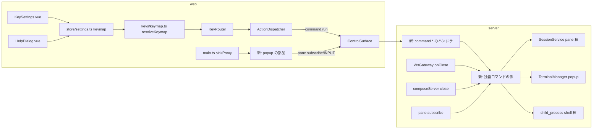

# 調査: 独自コマンドのキー（herdr の `[[keys.command]]`）

（行番号は main 97affb8 時点。変更前のスナップショット。）

## 調査の問い

- Q1: モデル（`SessionModel`）に無い端末（popup）を、既存の WebSocket の配信（SNAPSHOT/OUTPUT/INPUT）で流せるか。
- Q2: `pane` 種を scrollback の編集（20260926-edit-scrollback）の仕組みで作れるか。何を一般化する必要があるか。
- Q3: 環境変数・作業場所・起動の猶予・ブラウザの切断を拾う場所はどこか。
- Q4: キーの表（`ActionId` の静的なカタログ）を、サーバから来る動的な項目（コマンド）へ広げられるか。保存の形は。
- Q5: popup の UI の確立したパターン（開く・閉じる・キー・フォーカス）と、既存のダイアログの作り方。
- Q6: 設定ファイルの置き場所（名前付き session）・検証に使える部品。

## 判明した事実

### Q1 端末の配信（server）

- F1: 入力（INPUT フレーム）は **pane id で `TerminalManager.get` を引いて書くだけ**で、モデルを見ない
  （`packages/server/src/ws/WsGateway.ts:112-115`。`sizeAuthority.noteInteraction` も呼ぶ）。
- F2: 購読（`pane.subscribe`）は **`deps.session.getPane` が無ければ `not_found`**（`surface/methods/subscribe.ts:9-13`）。
  大きさ（`cols`/`rows`）もモデルの pane から返す。popup の購読にはここを広げる必要がある。
- F3: `TerminalManager.create(paneId, { shell, args, cwd, cols, rows, env })` はモデルと独立に端末を作れる
  （`terminal/TerminalManager.ts:62-75`）。プロセスが終わると自分で `hosts` から消して `dispose` する（`:96-99`）。
- F4: 接続が閉じたときの後始末は `WsGateway` の `conn.onClose`（`ws/WsGateway.ts:124-131`）：購読の解除・
  `sizeAuthority.onClientGone`・`clients.unregister`。ここに「その接続の popup を止める」を差し込める。
  `WsGateway` のコンストラクタは `WsGatewayOptions`（`:30-37`）を任意で受ける。
- F5: 端末の配色の問い合わせの答え（`createPaletteSource`。`composeServer.ts:167,236`）は pane からクライアントを引く。
  モデルに無い id では既定の配色になる（`clients/answerPalette.ts`。popup で色の問い合わせが既定の答えになるだけで、害は無い）。
- F6: pane の id の形はスキーマでは `z.string().min(1)`（`protocol/src/messages.ts:10`）。フレームの見出しは 255 バイトまで
  （`protocol/src/frames.ts:22-28`）。`SessionModel.reserveNextPaneId()`（`session/SessionModel.ts:320-322`）で `p<N>` を払い出せる
  （保存の `nextId` も進むので、popup に使っても pane と衝突しない）。
- F7: 停止は `composeServer.close()`（`composeServer.ts:474-512`）。モデルの pane の端末を `dispose` し、`finally` で
  `session.disposeScrollbackEditors()` を待つ。popup の端末もここで止める必要がある（モデルに無いので `snapshot().panes` では拾えない）。
- F8: 接続の種別は `ClientRegistry.get(clientId)?.kind`（`clients/ClientRegistry.ts:21,47`）。`wtmctl` は `"external"`、ブラウザは
  `"desktop"`/`"mobile"`（同ファイル冒頭の注記）。

### Q2 `pane` 種（server）

- F9: `SessionService.editScrollback`（`session/SessionService.ts:671-704`）は、`reserveNextPaneId` → `spawnForPane(newPaneId, cwd,
  { shell, args })` → `model.splitPane(…, "right", …)` → `model.zoomPane(newPaneId, "on")` → 記録 `scrollbackEditors.set(newPaneId,
  { sourcePaneId, previousZoomedPaneId, dir })` → `pane.created`・`layout.updated` の順。
- F10: 閉じたときの復帰は `closePane`（`:720-745`）が `scrollbackEditors.get(paneId)` を見て `model.closePane(paneId, sourcePaneId)`
  （後継の希望）と拡大表示の戻し。一時ディレクトリの削除は `publishPaneClosed`（`:462-471`）。どちらも `scrollbackEditors` の
  1 つの Map に結びついている。引き継ぎ（`handoffScrollbackEditors`・`adoptScrollbackEditors`。`:1226-1253`）は `dir` を必須にする
  （`HandoffScrollbackEditor`）。→ `pane` 種は `dir` を持たないので、**別の Map** にし `closePane` で両方を見るのが
  引き継ぎの形を変えずに済む。
- F11: シェルが終わると pane を閉じる（`wireExit` → `closePaneAfterExit` → `closePane`。`:1036-1057`）。猶予中に 0 で終われば
  `alreadyExited` で呼び出し側が閉じる（`:1098-1123`・`raceSpawn` `:1348`、猶予 `DEFAULT_SPAWN_GRACE_MS = 300`）。
  猶予中に 0 以外で終われば起動の失敗（`spawn_failed`）。→ `pane` 種で「コマンドが存在しない」（sh が 127 で終わる）は
  猶予中なら失敗のトーストになる。
- F12: `spawnForPane` は環境を `envForPane(paneId)` で作り、コマンドに環境を足す口は無い（`:1098-1111`）。
- F13: 再起動の復元は保存された pane を既定のシェルで起こす（20260926-edit-scrollback の design「依拠する既存の事実」・F10）。
  `pane` 種の pane も普通のシェルとして戻る。

### Q3 環境・作業場所

- F14: pane の環境は `buildPaneEnv(process.env, { paneId, serverUrl, agentReportSocketPath, sessionName })`
  （`session/paneEnv.ts:38-58`）。`WTMCTL_URL`・`WTMCTL_TOKEN`・古い `WTM_*` を落とし、**`WTM_PANE_ID` を常に入れる**（`:53`）。
  popup・shell で `WTM_PANE_ID` を入れないには、`paneId` を任意にする変更が要る。
- F15: pane の作業場所はモデルの `Pane.cwd`（`protocol/src/model.ts` の `Pane`。追従は既存の cwd の検出）。ディレクトリとして
  在るかはサーバで `fs.stat` して確かめる必要がある（herdr も `is_dir` を確かめる。requirements の表）。
- F16: 名前付き session では `options.stateDir` がその session の状態ディレクトリ（`config.ts` の `ServeOptions.stateDir`・
  `resolveSessionStateDir`）。`composeServer` は `options.stateDir` の下に `server.log`・`session.json` 等を置く（`composeServer.ts:125-185`）。
  → 設定ファイルも `options.stateDir` に置けば session ごとになる。
- F17: 状態ディレクトリは Unix で所有者だけ（`StateDirLock` 等が作る。0600 のファイルは `writeFileAtomic`。`persist/atomicFile.ts`）。
  ユーザーが手で書く設定ファイルは今まで無い（herdr-parity H26「本製品には利用者が書く設定ファイルが無い」）。

### Q4 キーの表（web）

- F18: 操作のカタログ `ACTIONS` は静的な `as const` の配列で、`ActionId` はその `id` から導く型（`web/src/keys/bindings.ts:37-…`）。
  `resolveKeymap(prefs)`（`keys/keymap.ts:91-178`）は「上書きのある操作（カタログ順）→ 上書きの無い操作の既定」の 2 段で登録し、
  衝突は先勝ち。`ResolvedKeymap.bindingsOf/ownerOf/hintFor` は `ActionId` 型（`:56-69`）。
- F19: 保存は `wtm.prefs.v1` の `keys` に `{ prefix?, bindings?, navigate? }`（`keys/keyPrefs.ts:1-30,135-163`）。読み込みはカタログにある
  id だけを読む（`:113-121`）。→ コマンドの割り当ては別の項目（例 `commands`）にし、id の文字の規則だけで読む（一覧がまだ届いて
  いなくても保存を捨てない）必要がある。
- F20: 取り込みの検証 `validateAssignment`（`keys/assign.ts:77-…`）は `km.ownerOf` で衝突を見、名前は `actionDef(id)?.label`
  （`labelOf`、`:63-65`）。`planReset`・`applyRecommended` は内部で `resolveKeymap(next)` を作り直す（`:244,331`）——コマンドの一覧を
  渡さないと、作り直した表からコマンドの割り当てが消え、衝突を見落とす。
- F21: 設定画面の節「キー」は `GROUPS` × `ACTIONS` を群ごとに並べ、各行で `bindingsOf(def.id)`・`startCapture(addTarget(def.id, via))`・
  `removeBinding`・`resetAction`・`isOverridden` を使う（`components/KeySettings.vue:47-56,…,520-605`）。`moveHere` は
  `settings.setKeyBindings(conflict.ownerId, …)`（`:350-360`）。
- F22: `settings.keymap` は `computed(() => resolveKeymap(keyPrefs.value).keymap)`（`store/settings.ts:356`）。`KeyRouter` は
  `main.ts` の `watch(() => settings.keymap, …)` で差し替わる（`main.ts:118`）。「すべて既定に戻す」は `emptyKeyPrefs()`（`assign.ts` の
  `planReset` の `all`）。
- F23: キー一覧は `HelpDialog.vue` の `actionEntries(group)`（`:43-48`）。冒頭の注記に「`custom` 群は本製品にカスタムキーバインド
  （独自コマンド）が無いので常に出さない（D56 の訂正 8）」（`:10-11`）——herdr のキー一覧には独自コマンドの群がある。
- F24: 操作の実行は `ActionDispatcher.dispatch` の `switch (action.type)`（`actions/ActionDispatcher.ts:140-210`）。`editScrollback`
  （`:619-634`）は `input.holdInput(paneId)` → 要求 → 応答の pane へ `view.focusPane`・`releaseHold`、失敗は `hold.cancel()` とトースト。
- F25: `reload_config` は `ActionDispatcher.reloadConfig`（`:1134-1165`）で、`localStorage` の設定を読み直してトーストを出すだけ。
- F26: イベントは `StoreAdapter.applyEventToSession` の `switch`（`store/StoreAdapter.ts:92-153`）。知らないイベントは何もしない
  （`default` が無く、型の上では網羅）。`ServerEvent` の和（`protocol/src/events.ts:115-136`）に足すと、この switch と
  `Connection` の型に届く。接続ごとの初期化は `connection.onOpened(...)`（`main.ts:198-205`）。

### Q5 popup の UI

- F27（確立したパターン・WAI-ARIA APG「Dialog (Modal)」。https://www.w3.org/WAI/ARIA/apg/patterns/dialog-modal/ を取得して確認）:
  開いたらフォーカスを中へ、Tab/Shift+Tab は中で循環、**Esc で閉じる**、閉じたら開いた要素へフォーカスを戻す、`role="dialog"`・
  `aria-modal="true"`・`aria-labelledby`（見える見出し）か `aria-label`。modal にするのは外の操作を塞ぎ、見た目でも外を覆うときだけ。
- F28（tmux `display-popup`。この機械の `tmux.1` の man を直読）: 「A popup is a rectangular box drawn over the top of any panes」。
  `-E` はコマンドが終わると自動で閉じる（2 つでは成功のときだけ）。`-w`/`-h` は割合（`%`）も可、省略は端末の半分。`-e` で環境変数、
  `-d` で開始の場所。
- F29（herdr。requirements の表）: 終わるまで **Esc を含む全ての入力を popup が受ける**。閉じるのはコマンドの終了だけ。同時に 1 つ。
  大きさは省略で半分・数はセル・`%` は割合・枠を含む・最小に切り上げ（`popup_size.rs:48-90`。最小は外枠 6×4）。
- F30（既存のダイアログ）: ほかのダイアログはネイティブの `<dialog>` ＋ `showModal()` ＋ `@cancel` の抑止（`ConfirmDialog.vue:83,132-137`・
  `GotoPicker.vue:188,295` ほか）。`view.openDialogWithContext(ctx)` で開き、`openDialog` が立つと `main.ts:271-274` の watch で
  `KeyRouter` が `dialog` モードになり（端末のキーを横取りしない）、window の keydown は何もしない（`main.ts:281-285`）。
  閉じると `view.closeDialog()` が開く前の pane へ焦点を戻す（`store/view.ts:365-375`）。開いている間の pane の消滅は
  `retargetPreDialogFocus`（`StoreAdapter.ts:76-88`）。
- F31: xterm.js の端末は `TerminalRegistry.create` で作られ、`KeyInputController.attach`（prefix 等の横取り）・`MouseBridge`・WebGL の
  貸し出しが付く（`term/TerminalRegistry.ts:209-260`）。OUTPUT/SNAPSHOT は `main.ts` の `sinkProxy` → `registry.onOutput/onSnapshot`
  （`main.ts:78-82`・`TerminalRegistry.ts:193-205`）で、登録の無い id は捨てる。→ popup の端末は registry の外で作り（prefix を
  横取りさせない）、`sinkProxy` から popup の id だけ popup へ回す口が要る。

### Q6 設定ファイルの検証

- F32: protocol は zod を使う（`messages.ts`）。server も `@wtm/protocol` 経由で zod を使える（`packages/server/package.json` の依存。
  zod の `.strict()` で知らない項目を拒否できる）。TOML の解析器は依存に無い（`package.json` を確認）。
- F33: Node の `fs.lstat` で シンボリックリンク・通常のファイルか・`uid`・`mode` が取れる。`process.getuid` は Windows に無い
  （Node の文書。リポジトリ内では `persist/StateDirLock.ts` 等が POSIX の権限を扱う）。
- F34: 裏での実行は `child_process.spawn(file, args, { detached: true, stdio: "ignore", cwd, env })` ＋ `unref()` で、サーバはその終わりを
  待たずに済む（Node の文書。リポジトリ内に前例は無い——`git`・`ProcessInspector` は結果を待つ `execFile`）。`error` イベント
  （ENOENT 等）を受けないと例外で落ちる。

## 影響範囲

- protocol: `messages.ts`（要求 3〜4 本）・`events.ts`（イベント 2 本）・`errors.ts`（code）。
- server: 新しいモジュール（設定の読み込み・検証、実行）、`SessionService`（`pane` 種・環境）、`paneEnv.ts`、`subscribe.ts`、`WsGateway.ts`、
  `composeServer.ts`、`surface/methods/index.ts`・`deps.ts`。
- web: `keys/keyPrefs.ts`・`keymap.ts`・`assign.ts`・`bindings.ts`（型）・`actions.ts`、`store/settings.ts`、`KeySettings.vue`、`HelpDialog.vue`、
  `ActionDispatcher.ts`、`StoreAdapter.ts`、`main.ts`、`App.vue`、`store/view.ts`（`DialogContext`）、`net/clientError.ts`（新しい code）、新しい部品。

## 実現性 / リスク

- popup の配信は `pane.subscribe` を広げれば既存のフレームで流せる（F1〜F3）。大きさの変化（`pane.size_changed`）の経路は使わない。
- キーの表の型（`ActionId`）を広げる変更は `keys/` の複数ファイルと `KeySettings.vue` に及ぶ。`ResolvedKeymap` にコマンドの一覧を持たせ、
  作り直す箇所（F20）で引き継ぐ必要がある。
- Windows：`cmd.exe /d /c` での起動・`detached` はこの環境（Linux）で確かめられない（未検証の穴として残す）。
- ネイティブの `<dialog>` の Esc：Chromium は Esc の keydown で `preventDefault()` されるとネイティブの `cancel` を起こさない
  （`KeySettings.vue:204-207` の注記）。一方、Esc は利用者の操作による活性化（user activation）に数えられないため、`cancel` を
  `preventDefault()` しても閉じてしまう場合がある（Chromium の CloseWatcher。一般知識で未検証）。popup は Esc を端末へ渡す必要があり、
  ネイティブの `<dialog>` の Esc の扱いに依存しない作り（`div` の `role="dialog"`）の方が確実。

## 実装アンカー

- A1: 購読を popup に広げる（`packages/server/src/surface/methods/subscribe.ts:6-15` `registerSubscribeMethods`）。
- A2: 接続の終わり（`packages/server/src/ws/WsGateway.ts:124-131` `conn.onClose`）と `WsGatewayOptions`（`:30-37`）。
- A3: 停止（`packages/server/src/composeServer.ts:474-512` `close()`）・組み立て（`:190-251`）。
- A4: `pane` 種の元（`packages/server/src/session/SessionService.ts:671-704` `editScrollback`・`:720-745` `closePane`・`:462-471` `publishPaneClosed`・
  `:1098-1123` `spawnForPane`・`:1068-1075` `envForPane`）。
- A5: 環境（`packages/server/src/session/paneEnv.ts:38-58` `buildPaneEnv`）。
- A6: 要求の登録（`packages/server/src/surface/methods/index.ts` `registerAllMethods`・`deps.ts` `MethodDeps`）。
- A7: protocol（`packages/protocol/src/messages.ts:503-557` `METHOD_SCHEMAS`・`:563-` `MethodResultMap`、`events.ts:115-136`、`errors.ts:2-47`）。
- A8: キーの表（`packages/web/src/keys/keymap.ts:91-178` `resolveKeymap`、`keyPrefs.ts:113-163`、`assign.ts:77-…`、`bindings.ts` `actionDef`・`actionFor`）。
- A9: 設定画面（`packages/web/src/components/KeySettings.vue:47-56` `actionsByGroup`・`:520-605` 行のテンプレート）。
- A10: キー一覧（`packages/web/src/components/HelpDialog.vue:43-48` `actionEntries`・群の組み立て）。
- A11: 実行（`packages/web/src/actions/ActionDispatcher.ts:140-210` `dispatch`・`:619-634` `editScrollback`・`:1134` `reloadConfig`）。
- A12: イベント（`packages/web/src/store/StoreAdapter.ts:92-153`）・配信の振り分け（`packages/web/src/main.ts:78-82` `sinkProxy`）・接続の初期化（`main.ts:198-205`）。
- A13: ダイアログの文脈（`packages/web/src/store/view.ts:170-225` `DialogContext`）・部品の置き場（`packages/web/src/App.vue:82-97`）。
- A14: 失敗の文言（`packages/web/src/net/clientError.ts:13-58` `MESSAGES`。`Record<ErrorCode, string>` なので code を足すと型で要求される）。

## 実装時の注意

- `ErrorCode` に code を足すと、web の `MESSAGES` が `Record<ErrorCode, string>` なので typecheck が要求する（足し忘れを型が捕まえる）。
- `ServerEvent` に足すと、`StoreAdapter` の switch は `default` が無いので黙って無視されうる——足したイベントの case を忘れない（型では捕まらない）。
- `TerminalManager` の `host.onExit` は `create` 時に最初に登録された自分の後始末が先に走る（`TerminalManager.ts:96-99`）。popup の
  終わりを拾う listener はその後に付けても呼ばれる（1 度きり・同期）。ただし `create` から listener を付けるまでの間に終わると取りこぼす——
  同期区間で付けること（`SessionService.spawnForPane` の `alreadyExited` の注記と同じ罠）。
- `buildPaneEnv` の `WTM_PANE_ID` を任意にするときは、既存の呼び出し（`envForPane`）の結果を変えない。
- 既存のテストの偽物（`OutputFanout.test.ts`・`AgentMonitor.test.ts` 等）が `TerminalManager`・`SessionService` の型に依存している。

## design への申し送り

- 設定ファイルの名前（例 `commands.json`）・項目名・上限値を決める。id は持ち主が付ける（ブラウザの保存の鍵。herdr は不透明な id を
  毎回作るが、本製品はキーをブラウザが持つので、読み直しで変わらない id が要る）。
- popup の端末は registry の外で作り、prefix を横取りさせない（F31）。部品はネイティブの `<dialog>` ではなく `role="dialog"`・`aria-modal` の
  `div` ＋ 背景の覆いにするか、`<dialog>` で Esc を確実に端末へ渡せるかを決める（「実現性 / リスク」）。APG との食い違い（Esc で閉じない・
  Tab が端末へ入る）は herdr・tmux に合わせる理由を書く。
- `pane` 種は `scrollbackEditors` とは別の Map（F10）。
- `buildPaneEnv` の `paneId` を任意にする（F14）。
- 残る未確定: Windows の起動の実機での確かめ（未検証の穴）。
