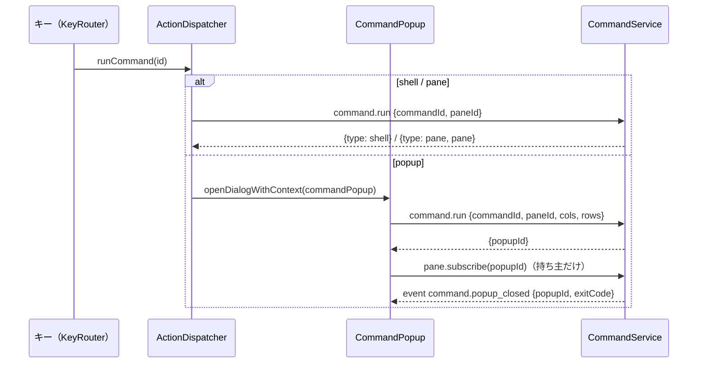

# レビューガイド: 独自コマンドのキー（herdr の `[[keys.command]]`・H12）

## 変更概要 / 目的

サーバの状態ディレクトリの `commands.json` に書いたコマンドを、ブラウザの設定画面で割り当てたキーで `popup`・`pane`・`shell` として走らせる。
**コマンドの文字列はサーバの中だけ**にあり、ブラウザは id と焦点の pane（と popup の大きさ）だけを送る（requirements「利用者の決定」）。

## 重要ポイント

- **安全の境界**：ブラウザへの一覧は `toCommandInfo` で `command` を落とす（`packages/server/src/commands/commandConfig.ts`）。`command.run` のスキーマは
  id・pane・大きさだけ（`packages/protocol/src/messages.ts` `CommandRunParams`）。argv の最後の要素は一覧の定義の文字列だけ、環境変数の値はモデルから引き直す
  （`packages/server/src/commands/CommandService.ts` `run`）。ログにもコマンドの文字列を出さない。
- **設定の検証**：zod の `strictObject`、1 つでも規則外ならファイル全体を捨てる。Unix は `O_NOFOLLOW|O_NONBLOCK` で開いた fd の `fstat` で検査し同じ fd から読む
  （`loadCommandsFile`）。理由の文に値を入れない（知らない項目の名前も安全な形だけ）。
- **popup はモデルに入れない端末**：`reservePaneId` の id で `TerminalManager.create`。開いた接続だけが購読・終了でき（`pane.subscribe` の持ち主の確認）、
  切断（`WsGateway` の `onClientGone`）・停止で止まる。ブラウザは `TerminalRegistry` の外の xterm.js（prefix を横取りさせない）と `role="dialog"` の枠
  （`packages/web/src/components/CommandPopup.vue`・`term/CommandPopupSession.ts`）。
- **`pane` 種**は `editScrollback` から抜き出した `openZoomedCommandPane` を共有し、戻し方の記録は別の Map（`SessionService.commandPanes`）。
- **キーの表**は `KeyTargetId = ActionId | command:<id>` に広げ、`resolveKeymap(prefs, commands)` で「上書きした操作 → 独自コマンド → 既定」の順に登録
  （`packages/web/src/keys/keymap.ts`）。保存は `keys.commands`（一覧に無い id の分も残す）。
- 判断の記録：`decisions.md` D1〜D9（特に D6・D9 の Windows の起動の形）。

## 処理フロー

## 主要な変更箇所

- `packages/server/src/commands/commandConfig.ts` — ファイルの検査と検証
- `packages/server/src/commands/commandLaunch.ts` — argv（`/bin/sh -c`・`-lc`・`%ComSpec% /d /s /c "…"`）、Windows の PTY には 1 本の文字列（`ptyArgs`）
- `packages/server/src/commands/CommandService.ts` — 一覧・読み直し・run・popup の持ち主・裏の実行の上限
- `packages/server/src/composeServer.ts` — 組み立て・起動時の読み込み・`onClientGone`・停止時の `dispose`
- `packages/server/src/surface/methods/{command,subscribe}.ts` — 要求と popup の購読
- `packages/web/src/keys/{commandKeys,keyPrefs,keymap,assign}.ts` — キーの表の拡張
- `packages/web/src/components/{KeySettings,HelpDialog,CommandPopup}.vue` — 設定画面の群・キー一覧・popup
- `docs/custom-commands.md` — 利用者向けの書き方・安全

## リスク / 確認したい点

- Windows ネイティブの起動は実機で未検証（コマンドラインの形は node-pty の関数で確認済み）。
- popup は開いたブラウザだけ・切断で止まる・大きさは追従しない（D2。backlog）。
- E2E は走らせていない（利用者の方針）。実ブラウザでのキーの流れは `docs/verification.md` の手動確認に。
