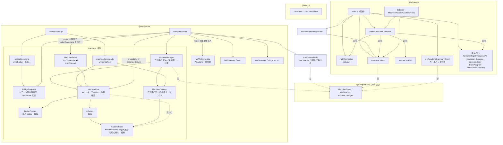
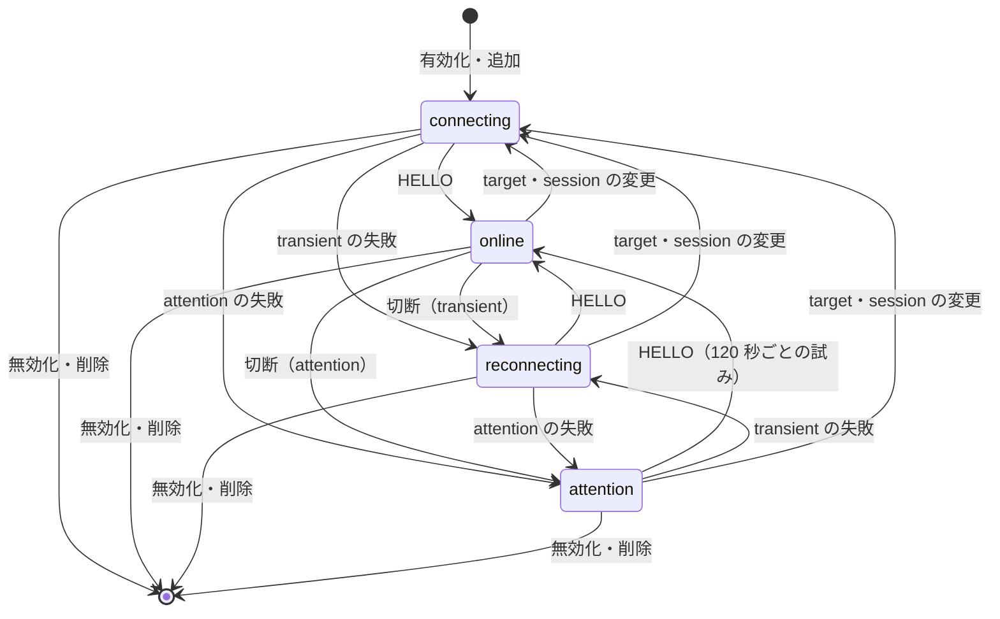
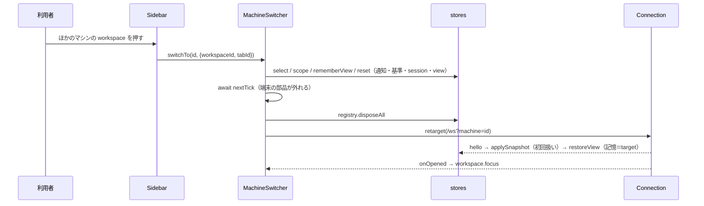

# 設計: 複数ホストの集約（構造）

design.md の部品を、責務・依存の向き・境界で固める。design と食い違ったら design が正（ここは構造の図と境界の規則）。

## アーキテクチャ概要

## コンポーネント / モジュール

| 部品 | 責務 | 依存してよいもの | 依存してはいけないもの |
|---|---|---|---|
| `bridgeFrames` | 枠の符号化・復号・目印の読み飛ばし・1 枠で閉じる規則（type・向き〔`role`〕・channel 0・長さ）の検査 | なし（Uint8Array だけ） | Node の I/O |
| `BridgeEndpoint` | `bridge.sock` の待ち受け・チャネル → `WsConnection` | `bridgeFrames`・`WsServer` の型・`listenUnixSocketReplacingStale` | `WsGateway` の中身（interface 越しに渡すだけ） |
| `bridgeCommand` | `wtm bridge` の素通し・動いていなければ 3 | `namedSession`・`config`・`BridgeEndpoint` の `bridgeSocketPathFor`（場所の定数だけ） | 枠の解釈（素通し） |
| `machineRules` | `MachineProfile` の型・宛先（`targetProblem`）と名前（`labelProblem`）の規則（**純粋**。fs を持たない） | `namedSession.sessionNameProblem` | fs・ssh |
| `MachineCatalog` | 登録簿のファイルの形・読み書き・セレクタの解決・id の生成 | `machineRules`・`atomicFile` | ssh・ネットワーク |
| `machineCommands` | `wtm machine` の各コマンド・出力・終了コード | `MachineCatalog`・`MachineLink`（確かめ） | `composeServer` |
| `sshArgs` | ssh の引数の組み立て（検証つき） | `machineRules` | spawn・`MachineCatalog` |
| `MachineLink` | ssh 1 本の寿命・HELLO・PING・チャネル・失敗の分類 | `bridgeFrames`・`sshArgs`・注入された spawn/時計・`machineRules`（型 `MachineProfile` と規則。純粋） | `MachineCatalog`（登録簿の読み書き）・バス |
| `MachineManager` | 登録簿の監視と反映・繋ぎ直しの間隔・状態の一覧・行き先の解決 | `MachineCatalog`・`MachineLink`（生成は注入） | `WsServerWs` |
| `MachineRelay` | `WsConnection` ⇄ `LinkChannel` の橋渡し・上限・close code の消毒 | `WsConnection` の型・`LinkChannel` | バス・登録簿 |
| `WsServerWs` | `?machine=` の検証と分岐（認証の後） | 注入された `machineRouter` | `MachineManager` の型（関数だけ受け取る） |
| web `Connection` | 行き先の切り替え（`retarget`） | 既存 | マシンの概念（URL しか知らない） |
| web `MachineSummaryClient` | 選んでいないマシンの軽い接続（hello・イベント・繋ぎ直し） | protocol の型 | pinia（コールバックで渡す） |
| web `store/machines` | 一覧・選択・要約・折りたたみ | protocol の型・`seen` の表示の規則 | ネットワーク |
| web `MachineSwitcher` | 切り替えの手順（同じ id なら表示だけ・選べるか・世代・状態の入れ替え・retarget・`pendingFocus` の 1 回の `workspace.focus`） | ports（下記） | Vue の部品 |
| web `net/machineUrl` | `LOCAL_MACHINE_ID`・`wsUrlFor` | なし | 他の部品 |
| web `main.ts`（配線） | 選んでいないマシンの軽い接続の生成と破棄・一覧の出所の切り替え（違う接続から来た `machine.changed` を捨てる）・一覧から消えたら `switchTo("local", …, {force:true})`・モバイルでは使わない・`onOpened` を `MachineSwitcher.onOpened` とローカルのときの `machine.list`・`refreshServerSessions` へ・origin の疑いをローカルだけに | すべて | —（単体テストしない。smoke と各部品のテストで守る） |
| web 既存の口（変更） | `TerminalRegistry.disposeAll`・`view` の scope/`rememberView`/`forgetStoredView`/`resetForMachineSwitch`・`seen` の scope・`session.clear`・`StoreAdapter.resetBaseline` と `machine.changed` の転送・`NotificationController.resetForMachineSwitch` | 既存 | マシンの概念（scope の id を受けるだけ） |
| web `ActionDispatcher`（変更） | **切り替えはしない**。ローカル以外を選んでいる間は `refreshServerSessions`・`openSessionSwitcher` を使わない（選択は `machines` ストアを読む）。design の対象範囲の「切り替え」はこの「選択に応じて振る舞いを変える」を指す | `store/machines` | `MachineSwitcher`（切り替えはサイドバーと `main.ts` が呼ぶ） |
| cli（変更） | `--machine` の前置き・`/ws?machine=`・404/503 の分類・`caller` を外す | 既存 | server |
| `surface/methods`（変更） | `machine.list`（`MethodDeps.machines` の関数の値を返す） | protocol | `machine/`（import しない） |
| `machineSmoke.ts` | ビルドした成果物の通し（偽の ssh） | ビルドした `dist/main.js`・`ws` | 部品の中身 |

- **境界の規則**: `machine/` の外から `machine/` を import するのは `composeServer`（配線）と `main.ts`（CLI）だけ。`surface/methods` は `MethodDeps.machines` の関数を受けるだけで import しない。
  `WsServerWs` は router の関数を受け取るだけで `MachineManager` を知らない（テストで差し替えられる）。2 つ目の `WsGateway` は `WsServer` の interface だけを知り、`BridgeEndpoint` を渡すのは `composeServer`（図の `COMP --> GW2`・`COMP --> EP`）。
- **状態の持ち主**: 1 台の接続の状態は `MachineManager` が唯一の持ち主（`MachineLink` は 1 回の試みの寿命だけを持ち、失敗を報告して終わる。繋ぎ直しは作り直し）。
  ブラウザでは選択の唯一の持ち主が `store/machines.selectedId`、画面の接続の行き先はそこから `MachineSwitcher` が決める。

## インターフェース / データモデル

design.md「インターフェース / データ構造」の型をそのまま使う。構造上の追加の決めごと:

- `SpawnFn = (command: string, args: string[], opts: { stdio: ["pipe","pipe","pipe"]; shell: false; windowsHide: true }) => ChildLike`。
  `ChildLike` は `stdin`（Writable）・`stdout`・`stderr`（Readable）・`kill(signal)`・`on("exit"|"error")` だけ（テストは Duplex の対で作る）。
- `composeServer` の internal に `machineSpawn?: SpawnFn` を足す（結合テストが偽の ssh＝リモートの `bridge.sock` へ直接繋ぐ子を渡す）。登録簿の監視の間隔は design どおり 1 秒の固定（`MachineManager` の時計の注入で単体テストする）。
- web の `MachineSwitcher` の依存は ports の形（`selectedId()`・`selectMachine`・`isSelectable(id)`・`setViewScope`・`setSeenScope`・`rememberView`・`forgetStoredView`・`focusWorkspaceHere(workspaceId)`（同じ id のとき）・
  `resetNotifications`・`resetBaseline`・`clearSession`・`resetView`・`nextTick`・`disposeTerminals`・`retarget(url)`・`wsUrlFor(id)`・`requestWorkspaceFocus(workspaceId)`）で受け、`onOpened()` を公開する
  （`main.ts` が `Connection.onOpened` から呼ぶ。世代の一致する `pendingFocus` だけを 1 回送る）。単体テストで順序と後勝ちを確かめる。

## 処理フロー / シーケンス

### 1 台の状態遷移（`MachineManager`）

- `target`・`session` の変更は、今の試み・接続を閉じ、**状態を `connecting` に戻して** attempt 0 ですぐ試す（別の宛先への初回の試みと同じ扱い）。`label` だけの変更は状態を変えない。

### ブラウザの切り替え

## 設計判断

- 多重化の解きをリモートの `wtm serve`（`BridgeEndpoint`）に置き、`wtm bridge` は素通し（design「設計方針」）。
- `MachineLink` を 1 回の試みの寿命にし、繋ぎ直しは `MachineManager` が新しい `MachineLink` を作る（状態の持ち主を 1 つにする。試みをまたぐ状態を `MachineLink` に持たせると、
  閉じた ssh の後始末と次の試みの開始が交錯する）。
- ブラウザの切り替えの手順を `MachineSwitcher` に切り出す（`main.ts` は単体テストできないため。手順の順序——部品が外れてから端末を捨てる・後勝ち——をテストで守る）。
- 代替案（退けた）: `WsServerWs` が `MachineManager` を直接持つ——テストで router を差し替えられなくなり、`ws/` が `machine/` に依存する向きになる。

## tasks への申し送り

- 下から: protocol → 枠 → 受け口（リモート側）→ `wtm bridge` → 登録簿 → ssh の引数・`MachineLink` → `MachineManager` → 中継と `/ws` の分岐と配線（結合テスト）→ `wtm machine` →
  `wtmctl --machine` → web の土台（retarget・disposeAll・scope・reset）→ web の machines ストアと軽い接続 → 切り替え＋ main の配線 → サイドバー → smoke → docs。
- 結合テストは、2 つの `composeServer`（手元・リモート）を同じプロセスで起こし、`machineSpawn` にリモートの `bridge.sock` へ直接繋ぐ偽の子を渡す（本物の ssh・`wtm bridge` の子プロセスは smoke で見る）。
