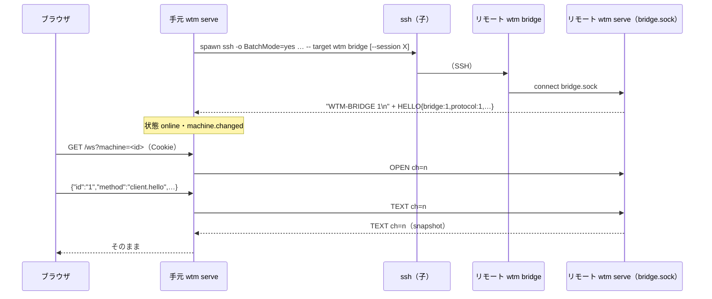

# 仕様: 複数ホストの集約（保存した SSH のマシン）

## 概要

手元の `wtm serve` を「ブラウザと `wtmctl` の入口」にし、登録した各マシンの `wtm serve` へ SSH の標準入出力の上の**中継**で繋ぐ。
リモートでは `wtm bridge` が標準入出力と、リモートの `wtm serve` の状態ディレクトリの**中継の受け口 `bridge.sock`（0600）**を素通しで繋ぐ。
1 本の SSH の上に**論理的な接続（チャネル）**を多重化し、各チャネルはリモートの `wtm serve` にとって今までの `/ws` の 1 接続と同じもの（`client.hello` から）になる。

ブラウザと `wtmctl` は、手元の `/ws` に `?machine=<id|名前>` を付けるだけで、そのマシンの `wtm serve` と今までと同じ通信ができる（手元の Cookie で認証してから中継）。
ブラウザは**画面の接続 1 本の行き先を切り替える**ことでマシンを切り替え、**選んでいないマシンごとに軽い接続（`kind: "external"`・購読なし）**を持ってサイドバーの一覧と状態を保つ。



## 設計方針

- **既存の `WsGateway` をそのまま使う**（research F4〜F6）。リモートの側は `bridge.sock` の各チャネルを `WsConnection` として 2 つ目の `WsGateway` に渡すだけで、
  方式・イベント・画面・入力・流量制御は今までの実装がそのまま効く。
- **認証はリモートの側の受け口の権限（0600）に任せる**（F1〜F3。decisions D3）。token は hash でしか保存されないので読めない。SSH でログインできる同じ利用者だけが
  受け口に繋げる。手元からリモートへ秘密を送らない。手元の入口（`/ws?machine=`）は今までの Cookie の認証を必ず通す。
- **`wtm bridge` は素通し**（多重化はリモートの `wtm serve` の受け口が解く）。`wtm bridge` を小さく保ち、枠の解釈を単体テストできる場所（受け口・手元の接続）に置く。
- **行き先の選択は `/ws` のクエリ**。ブラウザ・`wtmctl` の既存のクライアントは URL を変えるだけで全方式をリモートへ送れる（全コマンドの `--machine` が 1 か所の変更で済む。F27）。
- **ブラウザの状態はマシンごとの接続に閉じる**。id（`w1`・`p1`・`a1`）はマシンをまたいで衝突する（F11〜F13）ので、画面の接続の行き先を切り替えるときは
  セッションのストア・端末・表示の記憶・既読・通知の基準を切り替え先のマシンの物に替える（捨てる／マシンごとに分けて持つ）。選んでいないマシンの状態は別のストア（要約）に持つ。
- マシンを 1 台も有効にしていなければ、`ssh` を起こさず・軽い接続も張らず・サイドバーは今までの描画のまま（AC15）。

### 検討した代替案

- (a) 採用: リモートの受け口（0600 の Unix ドメイン socket）＋ SSH の標準入出力の多重化。herdr と同じ形（F3）。
- (b) 却下: ユーザーが挙げた「リモートの token のファイルをリモートの側が読んでログインする」。token は `{salt, hash}` しか保存されず平文が無い（F1）。
  平文の token を別のファイルに保存する形は、ディスクに秘密を増やす（ブラウザのログインの秘密そのもの）。意図（秘密を写さない・リモートの側で認証する）は (a) で満たせる。decisions D3。
- (c) 却下: SSH のポート転送（`ssh -L`）でリモートの HTTP ポートに繋ぐ。手元に新しい TCP の待ち受けができる（要件で禁止）うえ、リモートの token が要る。
- (d) 却下: ブラウザがマシンごとに別の画面の接続を持つ（同時に全マシンを流す）。選んでいないマシンの画面を流さないという要件に反し、端末の id の衝突を画面の中で扱う必要が出る。
- (e) 却下: 手元の `wtm serve` がリモートの状態を集めて 1 本の接続でまとめて配る（id に接頭辞を付けて合成）。方式・イベントの全部に変換が要り、今のブラウザの部品を使い回せない。

## 対象範囲

- protocol: `packages/protocol/src/model.ts`（`MachineState`・`MachineStatus`）、`messages.ts`（`machine.list`）、`events.ts`（`machine.changed`）。
- server（新）: `packages/server/src/machine/` に `machineRules.ts`（`MachineProfile` の型と宛先・名前の規則。純粋。architecture で分けた）・`bridgeFrames.ts`・`BridgeEndpoint.ts`・`bridgeCommand.ts`・`MachineCatalog.ts`・`machineCommands.ts`・`sshArgs.ts`・`MachineLink.ts`・
  `MachineManager.ts`・`MachineRelay.ts`（`probeMachine` は `machineCommands.ts`、`classifyLinkFailure` は `MachineLink.ts`）、起動確認 `packages/server/src/machineSmoke.ts`。
- server（変更）: `ws/WsServerWs.ts`（行き先の分岐）、`composeServer.ts`（受け口・2 つ目の gateway・マシンの管理の配線）、`surface/methods/`（`machine.list`）、`cliArgs.ts`・`main.ts`（`wtm machine`・`wtm bridge`・ヘルプ）。
- web（新）: `store/machines.ts`（マシンの一覧・選択・要約）、`net/MachineSummaryClient.ts`（軽い接続）、`net/machineUrl.ts`、`actions/MachineSwitcher.ts`（切り替えの手順）、`components/MachineHeader.vue`・`components/MachineRows.vue`。
- web（変更）: `net/Connection.ts`（`retarget`）、`term/TerminalRegistry.ts`（`disposeAll`）、`store/view.ts`（表示の記憶のマシンごとの分け方）、`store/seen.ts`（既読のマシンごとの分け方）、
  `store/session.ts`（`clear`）、`store/StoreAdapter.ts`（`machine.changed`・初回の基準の張り直し）、`notify/NotificationController.ts`（切り替えで基準を捨てる）、`components/Sidebar.vue`、
  `actions/ActionDispatcher.ts`（ローカル以外を選んでいる間は session の一覧を使わない。切り替えそのものはしない）、`main.ts`（配線）。
- cli: `cliArgs.ts`（`--machine`）、`wsClient.ts`（クエリ）、`withSession.ts`、`output.ts`（404/503）、`skills/wtmctl/SKILL.md`。
- docs: `docs/herdr-parity.md` H43・`docs/machines.md`（新。使い方）・`docs/wtmctl.md`。`.aidev/config.yml`（smoke を 1 本足す）。

## 依拠する既存の事実

- `WsGateway` は `WsServer`/`WsConnection` だけに依存し、`sessionId` は失効の相手選びだけに使う（`packages/server/src/ws/WsServer.ts:1-23`、`WsGateway.ts:41-83,169-173`）。research F4〜F6。
- 状態ディレクトリの 0600 の受け口と古い socket の置き直しの作法（`handoff/HandoffSocket.ts:48-94`、`agent/AgentReportSocket.ts:64-73` `listenUnixSocketReplacingStale`）。Windows では置かない（`composeServer.ts:451`）。F2。
- `auth.json` は token を hash でしか持たない（`persist/AuthFile.ts:5-9`）。F1。
- `/ws` の upgrade の順（パス → Origin → 起動中 503 → 認証 401 → upgrade。`ws/WsServerWs.ts:84-120`）。`requestPathname` はクエリを捨てる（`util/net.ts:140-144`）。F8。
- `client.hello` は kind を記録して snapshot を返す。`external` は大きさの権限を取らない。購読しなければ画面は流れない（`surface/methods/client.ts:6-14`、`clients/ClientRegistry.ts:5-11`）。F7。
- ブラウザの `Connection` は `wsUrl` 固定・hello のたびに `applySnapshot` と `onOpened`（`web/src/net/Connection.ts:77-100,185-219`）。WebSocket の仕様上、`close()` を呼んだ後（readyState が OPEN でない）に届いた
  メッセージは `message` イベントにならないが、念のため `onmessage` を外す（**未確認**の実装差への備え）。F10。
- 表示の記憶は `sessionStorage` の `STORAGE_KEY`（`web/src/store/view.ts:18-30`）で、`restoreView` はそれを優先する（`:314-328`）。既読は `localStorage` の `wtm.seen.v1` を `instanceId` で（`store/seen.ts:6-45`）。F11・F13。
- 端末は pane の id で持ち、全部を捨てる口が無い（`web/src/term/TerminalRegistry.ts:72-114`）。F12。
- サイドバーの折りたたみのボタンの作法（`web/src/components/Sidebar.vue:420-432` の `sidebar-group-toggle`、`:219-229` `onButtonKeydown`）と workspace の選択（`:160-167` `focusWorkspace`）。F16。
- session の名前の規則は ASCII の英数字と `._-` だけ（`persist/namedSession.ts:24-34`）。F29。`ssh` の引数はリモートで空白で繋いでシェルが解釈する（`man ssh`）。F21。
- 古い `wtm` の知らないコマンドは `unknown command` を標準エラーに出して終了コード 2（`server/src/cliArgs.ts:49`・`main.ts` の `ConfigError` の扱い）。F28。
- `wtmctl` は `<url>/ws` に繋ぎ、401 を `AuthError`、ほかを `statusCode` 付きの `Error` にする（`cli/src/wsClient.ts:214-257`）。F9・F27。
- `/ws` の 1 通の上限は 4MiB（`ws/WsServerWs.ts:14` `MAX_WS_PAYLOAD_BYTES`）、`onDrain` は 50ms の poll（`WsServerWs.ts:15` `DRAIN_POLL_MS`・`:170-174`）。
- バイナリの枠の種類は OUTPUT=0x01・SNAPSHOT=0x02・INPUT=0x03（`protocol/src/frames.ts:9-13` `FRAME_TYPE`）。
- `writeFileAtomic` は一時ファイルを 0600 にしてから置き換える（`persist/atomicFile.ts:9-17`）。
- `resolveSessionStateDir`・`sessionNameProblem`（`persist/namedSession.ts:24-50`）、`defaultStateDir`（`config.ts:66-73`）。
- すべての `/ws` の接続は、購読とは無関係にバスの全イベントを受け取る（`ws/WsGateway.ts:80-83` の `bus.subscribe`）。
- ブラウザの `Connection` は、開く前に閉じた（upgrade が 503 等で断られた）試みも `handleClose` → `/api/session` の確認 → 1 秒から倍々（最大 30 秒）で繋ぎ直す（`web/src/net/Connection.ts:340-398`）。
- `restoreView` は記憶が使えなければサーバの focus に下がる（`web/src/store/view.ts:324-327`）。引き継ぎの `closeClients` は `wsServer.closeAll(1012, …)`（`composeServer.ts:282-285`）。
- 切れている間の表示は `ReconnectOverlay`（`web/src/components/ReconnectOverlay.vue`）と `main.ts` の `registry.setInputEnabled(state === "open")` の watch。行の状態の印は `StateIcon`（`Sidebar.vue:72-77`）、
  session のボタンは `Sidebar.vue` の `sessionLabel`、名前付き session の数は `ActionDispatcher.refreshServerSessions`（`actions/ActionDispatcher.ts:243-248`）。
- ヘルプは `server/src/main.ts:17-29` `printHelp`、`wtmctl` の使い方は `cli/src/cliArgs.ts:17-43` `USAGE_LINES`（skill ファイルとの一致を `skill.test.ts` が見る）。
- モバイルの 1 列の画面は `isMobileViewport()` で決まる（`web/src/App.vue` の `isMobile`・`mobile/detect.ts`）。

## インターフェース / データ構造

### 中継の枠（`machine/bridgeFrames.ts`・純粋な関数）

- 目印: 受け口は接続の最初に ASCII の `WTM-BRIDGE 1\n` を書く。手元は最初の **64KiB** の中で目印を探し、それより前のバイト（リモートのシェルの初期化ファイルの出力等）を捨てる。見つからなければ「非互換」。
- 枠: `[type u8][channel u32 BE][length u32 BE][payload]`（見出し 9 バイト）。

| type | 名前 | 向き | channel | payload |
|---|---|---|---|---|
| 0x01 | HELLO | リモート→手元 | 0 | JSON `{"bridge":1,"protocol":1,"version":string,"hostname":string,"sessionName":string\|null}`（≤4KiB） |
| 0x02 | OPEN | 手元→リモート | ≥1 | 空 |
| 0x03 | CLOSE | 双方 | ≥1 | JSON `{"code":number,"reason":string}`（≤1KiB）または空 |
| 0x04 | TEXT | 双方 | ≥1 | UTF-8（今までの `/ws` のテキストの 1 通） |
| 0x05 | BINARY | 双方 | ≥1 | 今までの `/ws` のバイナリの 1 通（OUTPUT・SNAPSHOT・INPUT） |
| 0x06 | PING | 手元→リモート | 0 | ≤64 バイト |
| 0x07 | PONG | リモート→手元 | 0 | PING の payload をそのまま |

- 上限: TEXT・BINARY の payload は **4MiB**（`/ws` の `MAX_WS_PAYLOAD_BYTES` と同じ）、HELLO 4KiB・CLOSE 1KiB・PING/PONG 64 バイト。同時に開くチャネルは**64**。
- 違反（知らない type・長さの超過・向きの違う type・channel 0 以外の HELLO/PING・開いているチャネルへの OPEN・2 回目の HELLO）は `BridgeProtocolError` を投げ、読んだ側は**接続ごと切る**。
  閉じたチャネル宛ての TEXT/BINARY/CLOSE は捨てる（行き違い）。
- API: `encodeBridgeFrame(type, channel, payload): Uint8Array`、`class BridgeFrameDecoder { constructor(opts: { role: "endpoint" | "link"; maxPreamble?: number }); push(chunk: Uint8Array): BridgeFrame[] }`
  （`push` は違反で投げる）。`BRIDGE_MARKER`、`BRIDGE_VERSION = 1`、`BRIDGE_LIMITS`。`role: "link"`（手元が読む）は目印を探し、HELLO・CLOSE・TEXT・BINARY・PONG だけを受け付ける。
  `role: "endpoint"`（リモートが読む）は目印を探さず、OPEN・CLOSE・TEXT・BINARY・PING だけを受け付ける。**decoder が見るのは 1 枠で閉じる規則だけ**（type・向き・channel 0 の要否・長さ）。
  状態の要る規則（開いているチャネルへの OPEN・64 本の上限・2 回目の HELLO・閉じたチャネル宛てを捨てる）は `BridgeEndpoint`・`MachineLink` が持つ。
- チャネルの番号は手元（`MachineLink`）が 1 から単調に増やして割り当て、**同じ ssh の中では再利用しない**（閉じた直後の行き違いの枠が新しいチャネルに混ざらない）。2^32−1 を使い切ったら ssh ごと閉じる。

### リモートの受け口（`machine/BridgeEndpoint.ts`）

```ts
export const BRIDGE_SOCKET_FILE_NAME = "bridge.sock";
export function bridgeSocketPathFor(stateDir: string): string;
export interface BridgeHelloInfo { version: string; hostname: string; sessionName: string | null }
/** `WsServer` を実装する（2 つ目の WsGateway に渡す）。 */
export class BridgeEndpoint implements WsServer {
  constructor(hello: BridgeHelloInfo, logger: Logger);
  onConnection(cb: (conn: WsConnection, sessionId: string) => void): void; // sessionId は "bridge"（失効で閉じられない）
  closeAll(code: number, reason: string): void;
  /** socket を受け口として扱う（listen から呼ぶ。テストは socket の対を直接渡す）。 */
  handleSocket(sock: Duplex & { writableLength: number }): void;
  listen(path: string): Promise<void>;   // listenUnixSocketReplacingStale → chmod 0600（絞れなければ閉じて投げる）
  close(): Promise<void>;
}
```

- 各 socket: 目印と HELLO を書く → 枠を読む。OPEN でチャネルの `WsConnection`（`BridgeChannel`）を作り `onConnection` の cb に渡す。
  `sendText`/`sendBinary` は TEXT/BINARY の枠、`bufferedAmount` は socket の `writableLength`（そのチャネルが同じ socket を共有する他のチャネルの分も含む＝保守的に止まる）、
  `onDrain` は 50ms の poll（`WsServerWs` と同じ）、`close(code, reason)` は CLOSE の枠を送り onClose を呼ぶ。手元の CLOSE で onClose(code)。socket が閉じたら全チャネルが onClose(1006)。
  PING には PONG。枠の違反・64 を超える OPEN は socket ごと切る。

### `wtm bridge`（`machine/bridgeCommand.ts`）

- `wtm bridge [--session NAME] [--state-dir DIR]`。`WTM_SESSION` は読まない（ssh の先の環境で思わぬ session を選ばないため。decisions D5）。
- 状態ディレクトリは `resolveSessionStateDir(stateDir ?? defaultStateDir(), session)`。Windows は `wtm: bridge is not supported on Windows` で終了コード 2。
- `bridge.sock` に繋ぐ。`ENOENT`・`ECONNREFUSED` は `wtm: no running wtm serve for session <名前> (start it on this machine: wtm serve [--session <名前>])` を標準エラーに出し終了コード **3**。
- それ以外の繋げない失敗（`EACCES` 等）は理由を標準エラーに出して終了コード 1。
- 繋がったら標準入力 → socket、socket → 標準出力を素通し（`pipe`）。どちらかが閉じたら他方も閉じて終了コード 0。

### 登録簿（`machine/MachineCatalog.ts`）

- 場所: **状態ディレクトリの根**（`options.sessionRoot`。`--state-dir` を省けば `defaultStateDir()`）の `machines.json`。名前付き session どうしで共有する（decisions D4）。
- 形（zod `.strict()`。知らない項目は拒否）:
  ```json
  { "version": 1, "machines": [ { "id": "<32 桁の 16 進>", "label": "Build", "target": "you@build", "session": "agents", "enabled": true } ] }
  ```
  `session` は省略可（リモートの既定の session）。
- 規則: ファイル 64KiB 以下・64 台以下・id の重複なし。`label` は前後の空白を除いて空でない・128 バイト以下・制御文字なし・`local`（大文字小文字を問わない）でない・ほかのマシンの id と同じでない・
  ほかのマシンの `label` と同じでない（大文字小文字を区別して比べる）。`target` は 1〜1024 バイト・`-` で始まらない・`[A-Za-z0-9._@%+=:,/\[\]~-]` だけ（空白・制御文字・引用符・`$` 等を含まない）・
  `ssh://` を除いた最後の `@` より前（利用者の部分）に `:` を含まない（パスワード）。`session` は `sessionNameProblem` が `undefined`。
- API:
  ```ts
  export interface MachineProfile { id: string; label: string; target: string; session?: string; enabled: boolean }
  export interface MachineCatalogData { version: 1; machines: MachineProfile[] }
  export function machinesFilePath(root: string): string;
  export type CatalogLoad = { kind: "ok"; data: MachineCatalogData } | { kind: "missing" } | { kind: "invalid"; reason: string };
  export async function loadCatalog(root: string): Promise<CatalogLoad>;
  export async function saveCatalog(root: string, data: MachineCatalogData): Promise<void>; // 検証してから writeFileAtomic（0600）
  export function validateCatalog(raw: unknown): MachineCatalogData;                    // 投げる: CatalogError（message は理由）
  export function targetProblem(t: string): string | undefined; export function labelProblem(l: string, others: MachineProfile[], selfId?: string): string | undefined;
  export function newMachineId(): string;                                                 // crypto.randomBytes(16).toString("hex")
  export type SelectorResult = { kind: "ok"; machine: MachineProfile } | { kind: "unknown" } | { kind: "ambiguous" };
  export function resolveSelector(machines: MachineProfile[], selector: string): SelectorResult; // 有効なものだけ。id の完全一致を優先、次に label の完全一致（1 台なら ok・2 台以上 ambiguous）
  ```

### `wtm machine`（`machine/machineCommands.ts`）

- `wtm machine add <宛先> --label <名前> [--remote-session <名前>] [--state-dir DIR]`
- `wtm machine list [--json] [--state-dir DIR]`（テキストは `id<TAB>label<TAB>target<TAB>session（既定は default）<TAB>enabled|disabled`。空なら `no saved machines`。JSON は配列）
- `wtm machine rename <id> --label <名前>` / `enable <id>` / `disable <id>` / `remove <id>`（`[--state-dir DIR]`）
- 終了コード: 0 成功 / 1 確かめの失敗・登録簿が読めない（壊れている）・書けない / 2 引数の誤り・規則の違反・知らない id。
- `add` の手順: 引数と規則の検証（2）→ 登録簿を読む（壊れていれば 1。無ければ空）→ 名前の重複・上限（2）→ **確かめ**（`probeMachine`: `MachineLink` を 1 回だけ起こし、HELLO を
  **20 秒**以内に受けたら閉じて成功。失敗は分類つきで 1、`machine was not saved` と次の手を出す）→ 登録簿を**読み直して**（確かめの間の他の変更を上書きしない）重複・上限を再検査 → 追加して保存 →
  `saved machine <id> (<label>)`。依存（`spawn`・時計）は差し替えられる（テストは偽の ssh）。

### SSH の引数（`machine/sshArgs.ts`）

```ts
export function sshArgsFor(profile: { target: string; session?: string }): string[];
// ["-T","-o","BatchMode=yes","-o","NumberOfPasswordPrompts=0","-o","ConnectTimeout=10","-o","ConnectionAttempts=1",
//  "-o","ServerAliveInterval=15","-o","ServerAliveCountMax=4","--", target, "wtm", "bridge", ...(session ? ["--session", session] : [])]
```
- 呼ぶ前に `targetProblem`・`sessionNameProblem` で検証する（登録簿の検証と二重。起動の直前でも確かめる）。`spawn("ssh", args, { shell: false, stdio: ["pipe","pipe","pipe"], windowsHide: true })`。
- `StrictHostKeyChecking` は付けない（利用者の `~/.ssh/config` に任せる。BatchMode の下で未知のホスト鍵は確認できず失敗する＝要対応。decisions D6）。

### 手元の 1 台の接続（`machine/MachineLink.ts`）

```ts
export type LinkFailureKind = "attention" | "transient";
export interface LinkFailure { kind: LinkFailureKind; message: string }
export interface MachineLinkDeps { spawn: SpawnFn; now(): number; setTimeout; clearTimeout; setInterval; clearInterval; logger?: Logger }
export class MachineLink {
  constructor(profile: MachineProfile, deps: MachineLinkDeps);
  readonly hello: BridgeHello | undefined;
  start(): void;                                  // ssh を起こす
  onOnline(cb: () => void): void;                  // HELLO を受けた
  onClosed(cb: (f: LinkFailure) => void): void;   // 1 回だけ（自分で close したときは transient "closed"）
  openChannel(): LinkChannel | undefined;         // online のときだけ。64 を超えれば undefined
  get pendingBytes(): number;                     // ssh の標準入力の書き込み待ち（全チャネルの合計）
  close(): void;                                  // ssh を SIGTERM、2 秒後に残っていれば SIGKILL
}
export interface LinkChannel {
  readonly id: number;
  sendText(s: string): void; sendBinary(b: Uint8Array): void; close(code: number, reason: string): void;
  readonly pendingBytes: number;                  // このチャネルが書いてまだ流れていないバイト（write の callback で減らす）
  onText(cb): void; onBinary(cb): void; onClose(cb: (code: number, reason: string) => void): void;
}
```
- HELLO の待ち: **20 秒**。HELLO は zod で `bridge === 1`・`protocol === 1`・`version`/`hostname` が 256 バイト以下の文字列・`sessionName` が文字列か null。違えば attention「非互換」。
- 生きているかの確かめ: 15 秒ごとに、最後に何かを受けてから 15 秒以上なら PING を送る。**最後に受けてから 45 秒**を過ぎたら transient「応答が無い」で切る。
- 標準エラーは最後の 8KiB だけ持つ（理由の表示用）。失敗の分類（`classifyLinkFailure({ exitCode, signal, stderr, spawnError, protocolError, sawMarker, sawHello, timeout })`・純粋な関数。
  `timeout` は `"hello" | "health" | undefined`、`sawHello` は HELLO を受けたか）:
  - attention: `spawn` の `ENOENT`（`ssh` が無い）／標準エラーに `Permission denied`・`Host key verification failed`・`REMOTE HOST IDENTIFICATION HAS CHANGED`・`No matching host key`・
    `Too many authentication failures`／終了コード 127 か `command not found`・`not found`（リモートに `wtm` が無い）／終了コード 3（リモートで `wtm serve` が動いていない）／
    目印・HELLO の不正、または目印が来ないまま終了コード 0・1・2 で終わる（非互換・繋げない。古い `wtm` の `unknown command: bridge`〔2〕、`bridge.sock` の権限〔1〕を含む）。
  - transient: それ以外（接続の拒否・時間切れ・回線の切断・応答なし）。
  - **判定の順**（最初に当たったもの）: (1) spawn の失敗 → (2) 標準エラーの認証・ホスト鍵の文言 → (3) 終了コード 127・`command not found`／`not found` → (4) 終了コード 3 →
    (5) 目印の後の枠の違反・HELLO の形の違反・目印の前が 64KiB を超えた（非互換）→ (6) 目印が来ないまま終了コード 0・1・2 で終わった（非互換。古い `wtm`）→
    (7) それ以外（ssh 自身の失敗の終了コード 255・シグナル・HELLO の時間切れ・生きているかの確かめの時間切れ・**HELLO を受けた後の**切断〔リモートの `wtm serve` が止まって `wtm bridge` が 0 で終わる場合を含む〕）は transient。
    (2)〜(6) は `sawHello` が偽のときだけ当てる（HELLO の後の終了はどの終了コードでも (7)。coding の点検で (2) も揃えた）。(3) の文言の照合は標準エラーの最後の 2 行だけに当てる（初期化ファイルの雑音で誤らない）。
  - message は分類ごとの固定の日本語に、標準エラーの最後の 1 行（制御文字を除き 200 文字まで）を添える。

### マシンの管理（`machine/MachineManager.ts`）

```ts
export interface MachineManagerDeps { root: string; createLink(p: MachineProfile): MachineLink; now; setTimeout; clearTimeout; setInterval; clearInterval; loadCatalog?; statCatalog?; logger }
export class MachineManager {
  start(): void;                                  // 登録簿を読み、1 秒ごとに stat（mtimeMs・size・ino）の変化を見て読み直す
  stop(): void;                                   // 全部の ssh を閉じる
  list(): MachineStatus[];                        // 有効なものを登録の順に
  onChanged(cb: (machines: MachineStatus[]) => void): void;
  route(selector: string): { kind: "ok"; link: MachineLink } | { kind: "unknown" } | { kind: "offline" }; // resolveSelector の ambiguous は unknown
}
```
- 1 台ごとの状態: 初回の接続中 `connecting` → HELLO で `online` → 切れたら `reconnecting`（transient）か `attention`（理由つき）。
- 繋ぎ直しの試みの間は状態を変えない（`reconnecting`・`attention` と理由を保ち、次の結果〔HELLO で online・失敗で分類どおり〕で変える）。初回の試みだけが `connecting`。
- 繋ぎ直しの間隔: transient は `min(120s, 1s × 2^attempt)`、attempt は失敗ごとに +1。**`online` が 60 秒続いた後に切れたときだけ attempt を 0 に戻す**。attention は常に 120 秒。
- 登録簿の反映（読み直すたびに id で突き合わせる）: 追加・有効化 → すぐ繋ぐ／無効化・削除 → 閉じて一覧から消す／`target`・`session` の変更 → 閉じて状態を `connecting` に戻しすぐ繋ぎ直す（attempt 0）／`label` だけの変更 → 表示だけ。
  壊れた登録簿（`invalid`）は今の接続を保ち、警告をログに 1 回（同じ理由が続く間は出さない）。無い（`missing`）は 0 台。
- 変化（状態・理由・名前・台数・並び）があれば `onChanged` を呼ぶ。`composeServer` はそれを `machine.changed` としてバスに出す。

### 中継（`machine/MachineRelay.ts`）

```ts
export function relayToMachine(conn: WsConnection, link: Pick<MachineLink, "openChannel" | "holdReading" | "releaseReading">, opts?: { clock?: RelayClock }): void;
```
- `link.openChannel()` が無ければ `conn.close(1013, "machine unavailable")`。
- ブラウザ → リモート: `onText`→`sendText`、`onBinary`→`sendBinary`。送る前に**そのチャネルの** `channel.pendingBytes > 8MiB` なら、そのチャネルとブラウザの接続を 1013 で閉じる
  （ssh の標準入力は全チャネルで共有だが、書き込みの callback でチャネルごとに数えるので、詰まらせたチャネルだけを閉じる）。
- リモート → ブラウザ: TEXT は先頭（空白を除く）が `{` のものだけ通す（それ以外は捨てる）。BINARY は 1 バイト目が OUTPUT(0x01)・SNAPSHOT(0x02) のものだけ通し、OUTPUT は圧縮しない（`WsGateway` と同じ。D98）。
  送った後に `conn.bufferedAmount` を見て、4MiB を超えたら ssh の標準出力を読むのを止め（`MachineLink.holdReading`。リモートの `bridge.sock` の書き込み待ちが増え、リモートの `OutputFanout` の流量制御が効く）、1MiB を下回ったら再開する。止めたまま 15 秒・80MiB を超えたら 1013 で閉じる（ブラウザは繋ぎ直して SNAPSHOT で読み直す。review ラウンド 1 で背圧を足した・decisions D15）。
- チャネルの CLOSE の code は `1000・1001・1008・1011・1012・1013` だけそのまま、ほかは 1011（リモートが 4401 等でブラウザをログイン画面へ飛ばせないように）。reason は 120 バイトまで。
  リンクが切れて閉じるチャネルは 1012（「再起動中」＝ブラウザは繋ぎ直す）。ブラウザが閉じたらチャネルを閉じる（CLOSE 1000）。

### `/ws` の分岐（`ws/WsServerWs.ts`）

- `composeServer` が `(sel) => { const r = manager.route(sel); return r.kind === "ok" ? { kind: "ok", attach: (conn) => relayToMachine(conn, r.link) } : r; }` を渡す。
- コンストラクタに任意の `machineRouter?: (selector: string) => { kind: "ok"; attach(conn: WsConnection): void } | { kind: "unknown" } | { kind: "offline" }` を足す。
- `handleUpgrade`: 認証（401）の後、`machine` のクエリを読む（`new URL(req.url, "http://x")`）。無い・`local` は今までどおり。2 個以上・空・256 文字超は 400。
  それ以外は router に聞き、`unknown`（ambiguous を含む）は 404、`offline` は 503、`ok` は upgrade して `attach(conn)`（今の listeners には渡さない）。router が無い（テスト等）なら 404。

### protocol

```ts
// model.ts
export type MachineState = "connecting" | "online" | "reconnecting" | "attention";
export interface MachineStatus { id: string; label: string; state: MachineState; message: string | null }
// messages.ts
export const MachineListParams = z.object({});         // "machine.list": { machines: MachineStatus[] }
// events.ts
export interface MachineChangedEvent { event: "machine.changed"; data: { machines: MachineStatus[] } }
```
- サーバは `MethodDeps.machines?: () => MachineStatus[]`（無ければ空）で `machine.list` を返す。リモートの `wtm serve` も同じ方式を持つ（自分の登録簿。ブラウザは手元の接続でしか読まない）。

### web

- `net/machineUrl.ts`: `LOCAL_MACHINE_ID = "local"`、`wsUrlFor(base: string, machineId: string): string`（local は `base` そのもの、ほかは `?machine=<encodeURIComponent(id)>`）。
- `Connection.retarget(wsUrl: string): void` — 行き先を替えて繋ぎ直す。今の socket があれば `onmessage` を外して `close(1000)`、その close では再接続の待ちをせず、すぐに新しい行き先へ
  `/api/session` の確認から開き直す（`connecting`）。待ちのタイマーは取り消し、attempt は 0。連続で呼ばれたら最後の行き先だけが開く。
- `TerminalRegistry.disposeAll(): void` — 全端末を捨てる（マウス・キーの後始末を含む）。
- `store/session.ts` に `clear()`（workspace・tab・pane・group・focus を空に。host・limits は残す）。
- `store/view.ts`: `setMachineScope(id)`（表示の記憶のキーを `STORAGE_KEY`（local）／`${STORAGE_KEY}:${id}` に替える）、`rememberView(workspaceId, tabId)`（今のスコープの記憶だけを書く）、
  `resetForMachineSwitch()`（workspaceId・tabId・focusedPaneId・lastFocusedPaneId を null、開いているダイアログ・メニュー・navigate/copy 等のモードを閉じる）。
- `store/seen.ts`: `setScope(id)`（local は今までのキー、ほかは `m:<id>:<instanceId>`）。`getSeenSeqIn(scope, instanceId, fallback)`（要約の状態の印に使う）。
- `store/machines.ts`（pinia `machines`）:
  ```ts
  machines: MachineStatus[]; selectedId: string;              // "local" が既定
  summaries: Record<string, MachineSummary>; collapsed: Record<string, boolean>;
  interface MachineSummary { connected: boolean; everConnected: boolean; workspaces: Workspace[]; tabWorkspace: Record<string, string>; panes: Record<string, { tabId: string; agent: AgentInfo | null }> }
  // 状態の印は panes の agent（AgentInfo は instanceId・completionSeq・serverSeenSeq を持つ）を workspace ごとに aggregate(displayStateFor(agent, seen.getSeenSeqIn(machineId, agent.instanceId, agent.serverSeenSeq)))
  isSelectable(id): local は（選んでいないとき）要約が繋がっている、ほかは machines の state が online かつ要約が繋がっている。見出し・行の disabled と switchTo の手順 2 はこれ 1 つを使う
  sections: computed → [{ id: "local", label: "ローカル" }, ...machines.map(m => ({ id: m.id, label: m.label }))]
  hasMachines: computed → machines.length > 0
  setMachines(list), select(id), toggleCollapsed(id), applySummarySnapshot(id, snapshot), applySummaryEvent(id, event), setSummaryConnected(id, connected), dropSummary(id)
  ```
- `net/MachineSummaryClient.ts`: `new MachineSummaryClient({ wsUrl, onSnapshot(snapshot), onEvent(event), onConnected(boolean), onOpened?(), createWebSocket? })`、`start()`・`stop()`・
  `request(method, params): Promise<result>`（開いていなければ reject）。hello は `{protocol: 1, kind: "external"}`。購読・表示・入力は送らない。閉じたら 1 秒から倍々（最大 30 秒）で繋ぎ直す。
  `onOpened` はローカルの軽い接続が `machine.list` を送る口。
- `applySummaryEvent` が扱うイベント: `workspace.created`・`workspace.updated`・`workspace.closed`・`workspace.order_changed`・`tab.created`・`tab.updated`・`tab.closed`（tab → workspace の対応）・
  `pane.created`・`pane.updated`・`pane.closed`・`pane.agent_status_changed`。ほかは無視（`machine.changed` は呼び出し側が見る）。
- `actions/MachineSwitcher.ts`（main.ts から使う純粋寄りの部品）: `switchTo(id, target?: { workspaceId: string; tabId: string }, opts?: { force?: boolean })`。`force` は選べるかの確かめ（手順 2）を飛ばす。
- `store/view.ts` に `forgetStoredView()`（今のスコープの記憶を消す）。

## 振る舞いの詳細

### リモートの `wtm serve`
- `listen()` の最後（handoff の受け口の後。Windows 以外）に `bridge.sock` を待ち受け、0600 にする（絞れなければ警告を出して中継なしで続ける＝中継の受け口を置かない）。
  `close()`・引き継ぎの `closeClients` でチャネルを閉じる（`closeAll`）。`close()` で受け口を閉じる。
- 2 つ目の `WsGateway`（受け口の `BridgeEndpoint` を `WsServer` として渡す。surface・clients・sizeAuthority・terminals・bus・auth・logger は同じもの）。

### 手元の `wtm serve`
- `listen()` の最後（`/ws` を受け付け始めた後）に `MachineManager.start()`。`close()` の最初に `stop()`（ssh を閉じる。リモートは動いたまま）。
- `machine.changed` は状態が変わるたびにバスへ。`machine.list` はいつでも。

### ブラウザ（main.ts の配線）
- **モバイルの 1 列の画面（`isMobileViewport()`）では、マシンの機能を使わない**（`machine.list` を送らず、軽い接続を張らず、選択は `local` のまま。AC16・対象外）。
- 選択の初期値は `local`。画面の接続（`Connection`）は `wsUrlFor(base, selectedId)`。
- マシンの一覧の出所: **ローカルを選んでいる間は画面の接続**（open のたびに `machine.list`、`machine.changed` を `StoreAdapter` 経由で受ける）、**ほかのマシンを選んでいる間はローカルの軽い接続**
  （hello の後に `machine.list`、`machine.changed` を受ける）。選んでいるマシンが違う接続から来た `machine.changed` は捨てる（リモートの登録簿を混ぜない）。
- 軽い接続: `machines.hasMachines` のとき、[local, ...machines] のうち**選んでいないもの**に 1 本ずつ張り、選んだら閉じる（選んでいるマシンは画面の接続が持つ）。
  一覧から消えたマシンの軽い接続は閉じ、要約も捨てる。有効なマシンが 0 台なら軽い接続を張らない（AC15）。
- 切り替え（`switchTo(id, target)`）:
  1. `id` が今の選択なら、`target` があればその workspace を今までの選択（`focusWorkspace` と同じ）で表示して終わる。
  2. `force` でなく、`machines.isSelectable(id)` が偽なら何もしない。
  3. 世代を +1。`machines.select(id)`、`view.setMachineScope(id)`、`seen.setScope(id)`、`target` があれば `view.rememberView(target.workspaceId, target.tabId)`、
     無ければ（見出しから）`view.forgetStoredView()`（そのマシンの今の focus を表示する。AC9）。
  4. `notifications.resetForMachineSwitch()`（待ち行列・トースト・既知の状態を捨てる）、`storeAdapter.resetBaseline()`（次の snapshot を初回として扱う）、`session.clear()`、`view.resetForMachineSwitch()`。
  5. `await nextTick()`（端末の部品がはずれる）→ 世代が変わっていれば終わる（後の切り替えが勝つ）→ `registry.disposeAll()` → `connection.retarget(wsUrlFor(base, id))`。
  6. 開いたら（`onOpened`）: `restoreView` が記憶（`target` を含む）かサーバの focus で表示を決める。`target` は手順 3 で `MachineSwitcher` の `pendingFocus = { generation, workspaceId }` に持ち、
     **世代が一致する最初の `onOpened` で 1 回だけ** `workspace.focus` を送って捨てる（後の繋ぎ直しでは送らない。次の切り替えでも捨てる）。ローカルなら `machine.list` と `refreshServerSessions`。
- 選んでいるマシンが一覧から消えた（無効化・削除）ら `switchTo("local", undefined, { force: true })`（ローカルが切れていても戻る。戻った画面の接続は今までどおり繋ぎ直す）。
- 選んでいるマシンが切れたとき: 画面の接続が閉じ、今までどおり `reconnecting`（入力を止め、端末の中身を残し `ReconnectOverlay`）。手元の `/ws?machine=` は 503 で断るので、`Connection` は
  今までの間隔で試し続け、マシンが繋がれば開く（選択は変わらない）。
- session のボタン（名前付き session）: ローカル以外を選んでいる間は出さない（`sessionLabel` が null）。`refreshServerSessions` もローカルのときだけ。

### サイドバー
- `machines.hasMachines` が偽なら今までの描画のまま（見出しも軽い接続も無い）。
- 真なら spaces 区画の中を `sections` の順に並べる。各まとまり: `MachineHeader`（折りたたみのボタン `▾/▸`・`aria-expanded` と、名前と状態のボタン）。
  - 選んでいるマシン: 見出しの下に今までの workspace の行（グループ・ドラッグ・右クリック・navigate の選択を含む）。見出しのボタンは `aria-current="true"`。
  - ほかのマシン: `MachineRows`＝要約の workspace ごとの `button`（`StateIcon`＋名前）。押すと `switchTo(machineId, { workspaceId, tabId: workspace.activeTabId })`。
    切れている（要約が繋がっていない・状態が online でない）ときは行を薄くし（`opacity`）`disabled`。一度も繋がっていなければ「未接続」の 1 行だけ。
  - 状態の文言: connecting「接続中」・online「接続済み」・reconnecting「再接続中」・attention「要対応」（`title` に理由）。ローカルの見出しは要約の繋がり（選んでいる間は画面の接続）で「再接続中」。
- 折りたたみはブラウザのメモリだけに持つ（再読み込みで開いた状態に戻る）。折りたたみのボタンは `@click.stop`、Enter/Space は `onButtonKeydown` で main へ漏らさない。
- サイドバーを畳んでいる（`view.sidebarCollapsed`）ときは見出しを名前の先頭 1 文字にする。

### `wtmctl --machine`
- `wtmctl --machine <sel> <コマンド…>`（先頭に置く。herdr と同じ前置き）。`help`・`skill`・`login` との組み合わせ、値の欠落は使い方の誤り（2）。
- `sel` は 1〜256 文字（外れれば使い方の誤り 2）。接続は `<url>/ws?machine=<encodeURIComponent(sel)>`。404 は `{"error":{"code":"machine_not_found",…}}`、503 は `machine_unavailable`（どちらも終了コード 1）。
  それ以外の断り（400 等）は今までどおり `internal`（1）。503 は手元の `wtm serve` の起動中（D102）でも返るので、`machine_unavailable` の文言は「マシンが繋がっていない（または手元の `wtm serve` が起動中）」とする。認証・session のキャッシュは手元の URL のまま。
- `caller`（自分の pane の歯止め）を付けない（ローカルの pane の id はリモートでは意味を持たない。F26）。

## ドメイン固有の考慮

- herdr との違い（docs に書く）: (1) 手元の `wtm serve` が SSH を持つ（herdr はクライアントが持つ）ので `wtmctl --machine` は手元の `wtm serve` が動いている必要がある、
  (2) リモートの導入・起動をしない（リモートで `wtm serve` を先に起動しておく）、(3) 要対応でも最大の間隔で繋ぎ直しを続ける（herdr はクライアントの再起動まで待つ）、
  (4) ほかのマシンの通知・キーボードでのマシンをまたぐ移動・モバイルは未対応、(5) ControlMaster・keepalive の既定の追加をしない（`ServerAliveInterval` だけ引数で付ける）。
- pane の中の `wtmctl` は今までどおりその pane のサーバ（`WTM_SERVER_URL`）へ。マシンの選択は pane の中の CLI の行き先を変えない（herdr と同じ）。

## エラー処理 / 異常系

- 登録簿が壊れている: CLI は理由を出して 1（上書きしない）。手元の `wtm serve` は今の接続を保って警告（AC3）。
- `ssh` が無い: attention「ssh が見つかりません」。
- HELLO が来ない（20 秒）: transient（時間切れ）。目印の前のゴミが 64KiB を超える・目印の後の枠の違反: attention（非互換）。
- リモートの `wtm serve` が止まった: `bridge.sock` が閉じ `wtm bridge` が終わる → SSH が終わる → transient（その後の試みで終了コード 3 → attention「動いていない」）。
- 手元の `wtm serve` が止まる: ssh を閉じる。リモートはそのまま（AC5）。
- ブラウザが遅い／SSH が詰まる: そのチャネルだけ 1013 で閉じる（AC14）。
- `/ws?machine=` の不正なクエリ: 400。知らない・曖昧: 404。繋がっていない: 503。認証なし: 401（先に判定）。
- 切り替えの途中にさらに切り替え: 世代で後勝ち。切り替え先が切れていれば何もしない。

## 受け入れ基準との対応

- AC1: `machineCommands.add`＝検証（2）→ `probeMachine`（`MachineLink` の HELLO まで。失敗 1）→ 読み直して保存。入力は CLI の引数と登録簿のファイル。
- AC2: `machineCommands.list/rename/enable/disable/remove`。登録簿だけを書き、リモートへは何もしない（SSH を起こさない）。
- AC3: `MachineCatalog.validateCatalog`・`saveCatalog`（`writeFileAtomic` の 0600）。壊れた登録簿は `MachineManager` が今の接続を保つ。入力は `machines.json`。
- AC4: `BridgeEndpoint`（0600・枠・2 つ目の `WsGateway`）と `bridgeCommand`（素通し・動いていなければ 3）。入力はリモートの状態ディレクトリと ssh の標準入出力。
- AC5: `MachineManager`（1 秒の stat・反映の規則）と `MachineLink`（`sshArgsFor`・HELLO 20 秒）。停止・無効化・削除は ssh を閉じるだけ。入力は `machines.json`。
- AC6: `WsServerWs` の分岐（401 → 400/404/503 → upgrade）と `relayToMachine`（チャネルの多重化）。入力は `/ws` のクエリと Cookie。
- AC7: `machine.list`（`MethodDeps.machines`）と `machine.changed`（`MachineManager.onChanged` → バス）。入力は `MachineManager` の状態。
- AC8: `Sidebar.vue`＋`MachineHeader.vue`・`MachineRows.vue`、`store/machines.ts`（一覧は手元の接続の `machine.list`/`machine.changed`、要約は軽い接続の snapshot とイベント）。
- AC9: `MachineSwitcher.switchTo`（`retarget`・`session.clear`・`disposeAll`・表示の記憶と既読のスコープ・通知の基準の張り直し）。選んでいないマシンは軽い接続（`external`・購読なし）だけ。
- AC10: `MachineManager` の繋ぎ直しの規則・`classifyLinkFailure`・`MachineLink` の PING（15 秒）と 45 秒の上限。
- AC11: 要約の `connected`（軽い接続の開閉）と見出しの状態で薄く・`disabled`。選んでいるマシンは既存の `reconnecting`（F14）。一覧から消えたら `switchTo("local")`。
  マシンごとに ssh・`MachineLink`・チャネル・軽い接続が別なので、1 台の失敗はほかに及ばない。
- AC12: `sshArgsFor`（`--`・固定のコマンド・検証）と `BridgeFrameDecoder`（type・長さ・チャネル数・目印・HELLO の検証。違反は ssh を切る）。
- AC13: `wtmctl` の `--machine`（`cliArgs`・`wsClient`・`output`・`caller` の無効化）。入力は CLI の引数。
- AC14: `relayToMachine` の背圧（4MiB で読むのを止め 1MiB で再開・15 秒／80MiB で閉じる）とブラウザ → リモートの 8MiB、枠の上限（手元 → リモート 4MiB・リモート → 手元 64MiB）。
- AC15: 登録簿が無い・空・全台無効なら `MachineManager` は ssh を起こさず、ブラウザは `hasMachines` が偽で軽い接続を張らず今までの描画。`/ws` はクエリが無ければ今までどおり。
- AC16: ヘルプ（`main.ts` の `printHelp`・`wtmctl` の `USAGE_LINES`）・`skills/wtmctl/SKILL.md`・`docs/herdr-parity.md` H43・`docs/machines.md`。
- AC17: `machineSmoke.ts`（ビルドした `dist/main.js` で 2 つの状態ディレクトリ・偽の `ssh`・`wtm machine add`・`/ws?machine=` の往復）を `.aidev/config.yml` の smoke に足す。
  偽の `ssh` は一時ディレクトリに置いた実行可能なスクリプトで、`PATH` の先頭に足して `wtm machine add` と手元の `wtm serve` を起動する。スクリプトは `--` までを読み飛ばし、宛先を捨て、
  続く `wtm bridge [...]` を `node <dist/main.js> bridge [...] --state-dir <リモート役の根>`（根は smoke が環境変数で渡す）として実行する。
- AC-I1: `MachineHeader` の折りたたみのボタン（`aria-expanded`・`@click.stop`・選択を変えない）。`hasMachines` が偽なら見出しなし。
- AC-I2: 見出し・行の `button` の click（Enter/Space はネイティブ）→ `switchTo`（世代で後勝ち）。切れていれば `disabled`。
- AC-I3: 全部 `button`（Tab で辿れる）。Enter/Space は `onButtonKeydown` で main の keydown に二重に渡さない。
- AC-I4: 切り替えの後、`restoreView` が focus の pane を決め、今までの `TerminalPane` の focus の流れで端末にフォーカスが移る。折りたたみはボタンにフォーカスが残る（ネイティブ）。
- AC-I5: 選んでいるマシンの行は今までの描画・操作のまま。ほかのマシンの行は `button` で、`pointerdown` 等を今までの行の D&D に流さない（別の要素）。キーの操作は画面の接続（選んでいるマシン）にだけ届く。
