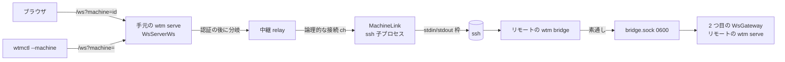

# 調査: 複数ホストの集約（保存した SSH のマシン）

主エージェントが一次資料（本リポジトリのコード・herdr のソースと docs・`man ssh`）を直読した。変更前のスナップショット。

## 調査の問い

- Q1: リモートの `wtm serve` に、手元の秘密を写さずに認証して繋ぐ方法は何か（token は読めるか）。
- Q2: サーバの通信の部品（`WsGateway`）を、WebSocket 以外の経路（SSH の標準入出力）の接続に使えるか。
- Q3: `/ws` の upgrade で行き先（マシン）を受け取り、別の相手へ中継できる差し込み口はどこか。
- Q4: ブラウザの接続・端末・既読・表示の記憶は、接続の行き先の切り替え（別のマシン＝id が衝突する別の状態）に耐えるか。
- Q5: サイドバーの構造と、マシンのまとまりを差し込む場所。既存の折りたたみ・行の操作の作り。
- Q6: 利用者が操作する部品（マシンの見出し・折りたたみ・切り替え）の確立したパターン。
- Q7: `ssh` の引数とリモートのコマンドの扱い（シェルの解釈・`--`・宛先の形・非対話）。
- Q8: herdr の several machines の作り（登録簿・bridge・状態・繋ぎ直し・`--machine`）。
- Q9: `wtmctl` の接続の作りと `--machine` の差し込み口。
- Q10: 既存の unix socket の受け口の作法（権限・古い socket・Windows）。

## 判明した事実

### Q1 認証
- F1: `auth.json` は token を `{salt, hash}` でしか持たない（`packages/server/src/persist/AuthFile.ts:5-9` `AuthFileToken`）。**平文の token はディスクに無い**ので、
  リモートの側で「token のファイルを読んでログインする」ことはできない。ブラウザの Cookie（セッション id）も `idHash` しか保存しない（同 `AuthFileSession`）。
- F2: 同じ利用者に限る受け口の前例がある: `handoff.sock`（`packages/server/src/handoff/HandoffSocket.ts:10-16,74-86`）は状態ディレクトリの Unix ドメイン socket で、
  待ち受けた直後に `chmod 0600` し、絞れなければ受け口を置かない。`agent-report.sock` も同じ（`packages/server/src/agent/AgentReportSocket.ts:43-50`）。
  古い socket のファイルは `listenUnixSocketReplacingStale`（同 `:64-73`。`StateDirLock` が二重起動を防ぐので消してよい）で置き直す。どちらも Windows では置かない（`composeServer.ts:451`）。
- F3: herdr のリモートの bridge も、リモートのサーバの**ローカル socket に繋いで**標準入出力と中継するだけで、別の認証をしない（`scratchpad/herdr/src/remote/host.rs:7-34`
  `run_remote_client_bridge`→`connect_local_stream(client_socket_path)`→`forward_remote_bridge_stdio`）。認証は SSH のログインとファイルの権限に任せている。

### Q2 通信の部品
- F4: `WsGateway` は `WsServer`／`WsConnection` の interface だけに依存する（`packages/server/src/ws/WsServer.ts:1-23`）。`WsConnection` は `sendText`・`sendBinary`・`bufferedAmount`・
  `onText`・`onBinary`・`onDrain`・`onClose`・`close` だけ。`WsServer` は `onConnection(cb(conn, sessionId))`・`closeAll`。
- F5: `WsGateway` の `sessionId` は `auth.onSessionRevoked` で閉じる相手を選ぶためだけに使う（`WsGateway.ts:62,169-173`）。`bufferedAmount` は流量制御（`OutputFanout` の stale の判定）が読む
  （`WsGateway.ts:75-77`）。`onDrain` は 50ms ごとの poll（`WsServerWs.ts:170-174`）。
- F6: `WsGateway` はコンストラクタで `wsServer.onConnection` と `auth.onSessionRevoked` に登録するだけで、状態は接続ごとの Map（`WsGateway.ts:41-60`）。
  **同じ部品（surface・clients・terminals・bus）を渡して 2 つ目の `WsGateway` を作れば、別の経路の接続を同じサーバに繋げる**。
- F7: `client.hello` は `kind` を記録し、`snapshot` を返すだけ（`packages/server/src/surface/methods/client.ts:6-14`）。`kind: "external"` は大きさの権限を取らない
  （`ClientRegistry.ts:5-11`、`SizeAuthority.test.ts:112`）。全接続にバスの全イベントが届く（`WsGateway.ts:80-83`）。購読（`pane.subscribe`）しなければ画面（OUTPUT・SNAPSHOT）は届かない。

### Q3 `/ws` の差し込み口
- F8: `WsServerWs.handleUpgrade`（`packages/server/src/ws/WsServerWs.ts:84-120`）の順: パスの解釈（`requestPathname`。`/ws` でなければ切る）→ Origin/Host の検査（403）→ 起動中なら 503 →
  認証（`authorize`。だめなら 401）→ `wss.handleUpgrade` → listeners に `(conn, sessionId)`。**認証の後・upgrade の前に、行き先で分岐できる**。
  `requestPathname` はパスだけを返す（`packages/server/src/util/net.ts:140-144`）ので、クエリは別に読む必要がある。上限 4MB（`MAX_WS_PAYLOAD_BYTES`）。
- F9: 断りの応答は `rejectUpgrade(socket, "<status>")`（`WsServerWs.ts:124-127`）。`wtmctl` は 401 を `AuthError`、それ以外を `statusCode` 付きの `Error` にする
  （`packages/cli/src/wsClient.ts:245-257`）。`output.ts` の `classify` は 403 だけを `forbidden` にし、ほかは `internal`（`packages/cli/src/output.ts:32-43`）。

### Q4 ブラウザの接続の切り替え
- F10: `Connection` は `wsUrl` を固定で持つ（`packages/web/src/net/Connection.ts:77-82`）。開くたびに `client.hello` → `store.applySnapshot` → `onConnectionState("open")` → `onOpened`
  （`:195-218`）。閉じたら `reconnecting` にして `/api/session` を確かめてから 1 秒から倍々（最大 30 秒）で繋ぎ直す（`:340-398`）。**行き先を変える口は無い**。
- F11: `session.applySnapshot` は状態を丸ごと置き換える（`packages/web/src/store/session.ts:32`）。`StoreAdapter.applySnapshot` の後に `view.restoreView` が、`sessionStorage` に
  覚えた表示（workspace・tab）を**そのまま使える id なら**優先し、無ければサーバの focus を使う（`packages/web/src/store/view.ts:314-328`）。**id は `w1` 等のサーバごとの連番**
  （`packages/protocol/src/ids.ts:1-20`）なので、別のマシンに切り替えた後に前のマシンの `w1/t1` を覚えていれば、別のマシンの無関係な `w1/t1` を開いてしまう。
- F12: `TerminalRegistry` は pane の id で端末を持つ（`packages/web/src/term/TerminalRegistry.ts:72-114`）。SNAPSHOT は中身を消して書き直す（`:196-201`）が、**全部を捨てる口は無い**
  （`dispose` は LRU の追い出し用の private）。切り替えで前のマシンの `p1` の端末を残すと、次のマシンの `p1` の SNAPSHOT が届くまで前の中身が見える。
- F13: 既読の印は `instanceId`（`a1` 等。サーバごとの連番）をキーに `localStorage`（`wtm.seen.v1`）に持つ（`packages/web/src/store/seen.ts:6-45`）。**マシンをまたぐと衝突する**。
- F14: 再接続のたびに `ViewSync.onConnectionOpened` が表示と購読を張り直す（`packages/web/src/term/ViewSync.ts:135-150`）。接続が `open` でない間は端末の入力を止め、
  `ReconnectOverlay` が示す（`packages/web/src/main.ts` の `registry.setInputEnabled` の watch）。**切れた間も端末の中身は残る**＝選んでいるマシンが切れたときの「最後の中身のまま入力を止める」は既存の動作で満たせる。
- F15: `main.ts` は接続の開くたびに `refreshServerSessions`（`server.sessions`）を呼び、サイドバーの session のボタンは名前付き session の数で出る
  （`packages/web/src/actions/ActionDispatcher.ts:243-259`、`Sidebar.vue` の `sessionLabel`）。**リモートのマシンを選んでいる間にこれを使うと、リモートの session の一覧を開き、
  手元のブラウザのホスト名でそのポートを開こうとする**（`openServerSession`）＝壊れる。

### Q5 サイドバー
- F16: `Sidebar.vue` は「spaces」（workspace の行）と「agents」の 2 区画（`packages/web/src/components/Sidebar.vue:388-470`）。workspace の行は `div` で、`pointerup` で選択・ドラッグで並べ替え
  （`:305-330`）。選択は `view.setView` → `view.focusPane` → `workspace.focus` の要求（`:160-167` `focusWorkspace`）。グループの折りたたみは行の中の `button.sidebar-group-toggle`
  （`aria-expanded`・`▸/▾`・`@pointerdown.stop @pointerup.stop @click.stop`・Enter/Space を `onButtonKeydown` で main へ漏らさない。`:420-432`、`:219-229`）。
- F17: 行の状態の印は `StateIcon` と `aggregate(displayStateFor(...))`（`Sidebar.vue:72-77`、`packages/web/src/store/seen.ts:49-80`）。

### Q6 操作の部品の確立したパターン
- F18: WAI-ARIA APG の Disclosure パターン: 見出しの中の `button` に `aria-expanded`（と `aria-controls`）を付け、Enter・Space で開閉する。**開閉でフォーカスはボタンに残る**。
  中身は兄弟の要素。Tree view パターン（矢印キーでの移動・`role=tree`）は重く、既存のサイドバーは使っていない（F16）。
- F19: herdr の several machines（`connecting-machines.mdx`「Switch between machines」）: マシンか workspace を選ぶと切り替わる。マシンの横の矢印で、**切り替えずに**畳む・開く（繋ぎ直し中でも可）。
  切れたマシンは最後の状態を薄く出し、そこへの入力・移動は新しい画面が来るまで止める。繋ぎ直しは選択を奪わない。無効化・削除した選択中のマシンはローカルへ戻る。
  キーボード（`prefix+w`）でのマシンをまたぐ移動もあるが、この work の対象外（requirements）。
- F20: VS Code の Remote Explorer・Explorer のフォルダ: 見出しの行のクリックで開閉、行の選択は別。**本製品は herdr に合わせ、見出しのクリック＝切り替え、矢印＝開閉**とする
  （herdr と食い違わせない。手動グループの見出しの行はクリックで開閉するが、マシンの見出しは「そのマシンへ行く」が主な用途のため）。

### Q7 ssh
- F21: OpenSSH（手元 9.6p1）の書式は `ssh [options] destination [command [argument ...]]`。**command と argument は空白で繋いでリモートへ送られ、リモートのシェルが解釈する**
  （`man ssh`「If supplied, the arguments will be appended to the command, separated by spaces」）。＝リモートのコマンドに利用者の文字列を入れるとリモートでシェルに解釈される。
  宛先は `[user@]hostname` か `ssh://[user@]hostname[:port]`。`-` で始まる宛先はオプションと取られうる（herdr は拒否する: `src/remote/args.rs:118-126`）。
- F22: herdr の非対話の既定（`src/remote/attach.rs:1026-1043` `apply_noninteractive_ssh_options`）: `BatchMode=yes`・`NumberOfPasswordPrompts=0`・`StrictHostKeyChecking=yes`・
  `ConnectTimeout=10`・`ConnectionAttempts=1`・`ServerAliveInterval=15`・`ServerAliveCountMax=4`。

### Q8 herdr の作り
- F23: 登録簿（`src/client/endpoint/catalog.rs:10-72`）: `{version:1, ssh:[{id,label,target,session,enabled}]}`、`deny_unknown_fields`、64KB・64 台・名前 128 バイト・宛先 1024 バイト・制御文字の禁止・
  宛先の `user:pass@` の拒否・session の名前の検証・id は 32 桁の 16 進（`src/remote/saved.rs:190-205`）。保存は 0600 の一時ファイル → 置き換え（`catalog.rs:333-371`）。
- F24: `machine` の CLI（`src/cli/machine.rs`）: `add` は宛先の検証 → リモートの準備（導入・起動を含む）→ 成功したら保存（失敗なら保存しない）。`rename/enable/disable/remove` は id で指す。
  `list [--json]` は id・名前・宛先・session・有効かを出す。
- F25: 要対応（Attention）の判定（`src/remote/saved.rs:120-145` `saved_ssh_failure_needs_attention`）: 認証の拒否・ホスト鍵・非対応・「not ready」「install or update」「protocol」「handshake」。
  それ以外（時間切れ等）は通常の繋ぎ直し。docs: 失敗が続くと最大 2 分、1 分続いた接続の後だけ速い再試行に戻す。黙った接続は確かめる。
- F26: `--machine`（`cli-reference.mdx`「Saved SSH machines」）: 有効な登録の id か一意の名前（大文字小文字を区別）。ローカルの pane の id は引き継がない。登録に無い・繋がらないときはローカルに落とさず失敗。

### Q9 wtmctl
- F27: `wtmctl` は `<url>/ws` へ Cookie・Origin・Host を付けて繋ぐ（`packages/cli/src/wsClient.ts:214-226`）。全コマンドは `withSession` → `connect(url, cookie)` を通る
  （`packages/cli/src/withSession.ts:14-43`）。引数の解釈は `parseArgs`（`packages/cli/src/cliArgs.ts:220-260`）で、共通の `--url`/`--token` は `globalOptsFrom`。
  pane の中から呼ぶと `caller`（`WTM_PANE_ID`・`WTM_SERVER_URL`）で自分の pane への操作を止める（`packages/cli/src/selfGuard.ts:37-42`）。

### Q10 サーバの CLI
- F28: `wtm` の入口は `packages/server/src/main.ts` の `parseArgs`（`cliArgs.ts`）の結果で分岐する。知らないコマンドは `cliArgs.ts:49` が `ConfigError`（`unknown command: …`）にし、
  `main.ts` が標準エラーに出して**終了コード 2**（D103 以前はヘルプを出して 0 だった）。＝古い `wtm` に `wtm bridge` を打つと、標準出力には何も出ず 2 で終わる（中継の目印が来ない）。
  （初稿では `main.ts:143-145` のヘルプの分岐から「0 で終わる」と書いたが、その分岐に来るのは `help` だけ。design の分類は「目印が来ない・終了コードが 0/1/2」をどれも非互換として扱うので影響しない。）
- F29: session の状態ディレクトリは `resolveSessionStateDir(base, name)`（`packages/server/src/persist/namedSession.ts:45-50`）、根は `defaultStateDir()`（`config.ts:66-73`）。
  session の名前の規則は `sessionNameProblem`（`namedSession.ts:24-34`: ASCII の英数字と `._-`、先頭の `-` 不可ほか）＝**リモートのシェルに渡しても安全な文字だけ**。
- F30: 状態ディレクトリの根（`options.sessionRoot`）は名前付き session に共通（`config.ts:153-154`）。

## 影響範囲

- protocol: `machine.list`・`machine.changed` の型。
- server: 登録簿（新）・`wtm machine`・`wtm bridge`（新）・中継の受け口（新）・マシンの接続の管理（新）・`WsServerWs` の分岐・`composeServer` の配線・`main.ts`・`cliArgs.ts`。
- web: `Connection`（行き先の切り替え）・`TerminalRegistry`（全部を捨てる）・`view`（表示の記憶のマシンごとの分け方）・`seen`（マシンごとの分け方）・サイドバー（マシンのまとまり）・
  マシンの状態のストア・ほかのマシンの軽い接続・`main.ts` の配線・session のボタンの抑止。
- cli: `--machine` の解釈・URL へのクエリ・自分の pane の歯止めの無効化・404/503 の分類。

## 実現性 / リスク

- R1: 手元の `wtm serve` の 1 本の SSH の上で複数の論理的な接続（ブラウザの画面・ほかのマシンの軽い接続・`wtmctl`）を多重化する枠の設計が要る。リモートの `wtm bridge` を素通しにし、
  多重化の解き（どの論理的な接続か）をリモートの `wtm serve` の受け口に置けば、`wtm bridge` は小さく、ロジックは単体テストできる。
- R2: リモートのシェルの初期化ファイルが標準出力に文字を出すと枠が崩れる（非対話の SSH でも `.bashrc` 等で起きうる）。最初の枠の前に目印を置き、それまでの出力を読み飛ばす（上限つき）と強くなる。
- R3: 古い `wtm` は `unknown command` で 2 で終わる（F28）。目印・最初の枠の形で見分け、「要対応」にする。
- R4: 流量: リモートは受け口の socket の書き込み待ち（`writableLength`）で既存の流量制御が効く。手元でブラウザが遅いときに溜め込まない上限が要る（AC14）。
- R5: `ssh` を裏で起こすため、`ssh-agent` の無い鍵のパスフレーズ・未知のホスト鍵では繋がらない（BatchMode）。「要対応」と理由で示し、`ssh <宛先>` での確かめを案内する。
- R6: 本物の SSH のサーバでは確かめない（共有マシン・E2E をしない）。偽の `ssh`（引数を検証してローカルで `wtm bridge` を起こすスクリプト）で、枠・中継・繋ぎ直しを確かめる。

## 実装アンカー

- A1: 受け口の作法（`packages/server/src/handoff/HandoffSocket.ts:48-94` `startHandoffSocket`、`packages/server/src/agent/AgentReportSocket.ts:64-73` `listenUnixSocketReplacingStale`）。
- A2: 接続の interface（`packages/server/src/ws/WsServer.ts:1-23`）と 2 つ目の gateway の配線先（`packages/server/src/composeServer.ts:251-254`）。停止・引き継ぎの `closeAll`（`composeServer.ts:282-285` の `closeClients`、`:474-510` の `close`）。
- A3: upgrade の分岐点（`packages/server/src/ws/WsServerWs.ts:84-120` `handleUpgrade`）。
- A4: サーバの CLI（`packages/server/src/cliArgs.ts` `parseArgs`、`packages/server/src/main.ts:121-163` `main`、ヘルプ `:17-29`）。
- A5: session の名前の規則と状態ディレクトリ（`packages/server/src/persist/namedSession.ts:24-50`）、原子的な書き込み（`packages/server/src/persist/atomicFile.ts` `writeFileAtomic`）。
- A6: 方式の登録（`packages/server/src/surface/methods/deps.ts` `MethodDeps`、`packages/protocol/src/messages.ts:502-619` `METHOD_SCHEMAS`・`MethodResultMap`、`packages/protocol/src/events.ts:116-138` `ServerEvent`）。
- A7: ブラウザの接続（`packages/web/src/net/Connection.ts:77-100` 構築、`:185-219` `openSocket`）と配線（`packages/web/src/main.ts`）。
- A8: 表示の記憶（`packages/web/src/store/view.ts:18-30` の `STORAGE_KEY`、`:314-334` `restoreView`・`setView`）、既読（`packages/web/src/store/seen.ts:6-45`）、端末（`packages/web/src/term/TerminalRegistry.ts`）。
- A9: サイドバー（`packages/web/src/components/Sidebar.vue:388-470` テンプレート、`:160-167` `focusWorkspace`、`:219-229` `onToggleCollapse`、`sessionLabel`）。
- A10: CLI（`packages/cli/src/cliArgs.ts:188-200` `globalOptsFrom`、`:220-260` `parseArgs`、`packages/cli/src/wsClient.ts:214-226` `connect`、`packages/cli/src/output.ts:32-43` `classify`、`packages/cli/src/selfGuard.ts`）。
- A11: smoke の設定（`.aidev/config.yml` の `smokeCommands`）、既存の smoke の書き方（`packages/server/src/stopSmoke.ts`・`handoffSmoke.ts`）。

## 実装時の注意

- `main.ts`（サーバ・ブラウザとも）は読み込むと起動するので単体テストできない。配線は smoke と結合テストで見る。
- `WsGateway` の `sessionId` は失効の相手選びにだけ使う。中継の接続には、ブラウザのセッションと重ならない値を渡す（ログアウトで閉じられない）。
- `requestPathname` はクエリを捨てる。行き先は別に `URL` で読む（`?machine=` の値は id か名前。名前は任意の文字を含みうるので、比較だけに使いログに出さない）。
- ブラウザの `sessionStorage` の表示の記憶（`view.ts` の `STORAGE_KEY`）・`localStorage` の既読（`seen.ts`）は id がマシンをまたいで衝突する（F11・F13）。
- `prettier --write` は新しいファイルか HEAD で整形済みのものだけ（メモリの規則）。

## design への申し送り

- 認証は「リモートの状態ディレクトリの 0600 の受け口」に任せる（F1〜F3）。ユーザーが挙げた「リモートの token のファイルをリモートの側が読む」は、token が hash でしか保存されないため
  そのままでは取れない。意図（秘密を手元に写さない・リモートの側だけで認証する）は受け口の権限で満たせる——decisions に記す。ユーザーに問う構造の問いではない（herdr と同じ作り）。
- 中継の枠・目印・版・生きているかの確かめ・上限を design で決める（R1〜R4）。
- ブラウザは「画面の接続（1 本）の行き先を切り替える」＋「マシンごとの軽い接続（`external`・購読なし）でサイドバーの一覧を保つ」形が既存の部品（F7・F10・F14）をそのまま使える。
  切り替えでは表示の記憶・既読・端末をマシンごとに分けるか捨てる（F11〜F13）。session のボタンはリモートを選んでいる間は出さない（F15）。
- 見出し・矢印・行の操作は F16 の既存の作法（`button`・`aria-expanded`・`onButtonKeydown`）と F18〜F20 に合わせる。
