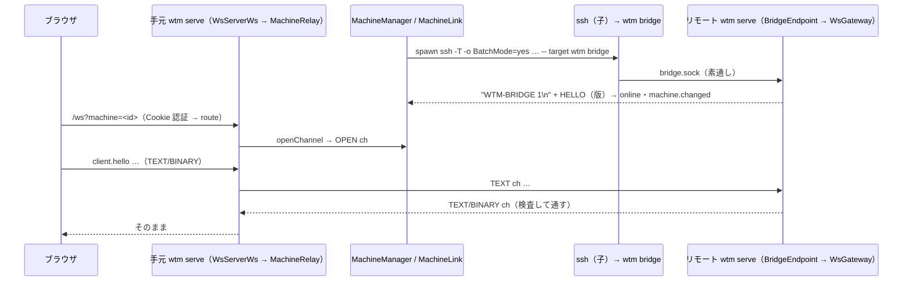

# レビューガイド: 複数ホストの集約（保存した SSH のマシン）

## 変更概要 / 目的

手元の `wtm serve` が SSH でほかのマシンの `wtm serve` へ繋ぎ、手元のブラウザの 1 画面（1 つの URL・1 つのログイン）で全マシンの workspace とエージェントの状態を
一覧・切り替えできるようにした（herdr の several machines・H43 の最初の一切れ）。`wtm machine …`・`wtm bridge`・`/ws?machine=`・サイドバーのマシンのまとまり・
`wtmctl --machine`。要件は `requirements.md`、判断は `decisions.md`（D3 認証・D4 登録簿の置き場・D5 wtmctl の経路・D6 SSH のオプション・D7 要対応の繋ぎ直し）。

## 重要ポイント

- **認証**（D3）: リモートの token は hash でしか保存されず読めない。リモートの `wtm serve` が状態ディレクトリに `bridge.sock`（0600）を置き、SSH でログインした同じ利用者の
  `wtm bridge` がそこへ繋ぐ——受け口の権限が認証。0700 の一時ディレクトリで待ち受けて 0600 にしてから rename する（待ち受けと chmod の間の窓を作らない）。
- **既存の `WsGateway` を 2 つ目として使う**: `bridge.sock` の各チャネルを `WsConnection` として渡すので、方式・イベント・画面・流量制御は今までの実装のまま。
- **行き先の選択は `/ws?machine=`**: 手元の認証（Cookie）の後に分岐し、中継は手元のセッションの失効で 4401 で閉じる（点検で見つけた must）。
- **ブラウザは画面の接続 1 本の行き先を替える**（`Connection.retarget`）。id（`w1`・`p1`・`a1`）はマシンをまたいで衝突するので、切り替えではセッションのストア・端末・
  表示の記憶・既読・通知の基準を替える（`MachineSwitcher`）。選んでいないマシンは `kind: "external"`・購読なしの軽い接続（`MachineSummaryClient`）。
- **リモートから来るものは信用しない**: 枠の目印・9 バイトの見出し・向き・長さ（手元 → リモート 4MiB、リモート → 手元 64MiB）・チャネル 64・HELLO の形と時間・
  中継でブラウザへ通すのは JSON のオブジェクトと OUTPUT/SNAPSHOT だけ・close code の消毒。
- マシンが 1 台も無ければ ssh を起こさず、軽い接続も張らず、サイドバーは今までの描画（画面の接続が開くたびの `machine.list` 1 回だけが増える）。

## 処理フロー

## 主要な変更箇所

- 枠: `packages/server/src/machine/bridgeFrames.ts`（`BridgeFrameDecoder` のかたまりの一覧と読み位置——点検で O(N^2) を直した）。
- リモート側: `packages/server/src/machine/BridgeEndpoint.ts`（`listen` の rename・`setReady`・`close` の end）、`bridgeCommand.ts`（`wtm bridge`）。
- 手元の 1 台: `packages/server/src/machine/MachineLink.ts`（`classifyLinkFailure` の判定の順・生きているかの確かめ・`exited`）。
- 状態の持ち主: `packages/server/src/machine/MachineManager.ts`（繋ぎ直しの間隔・60 秒の規則・登録簿の反映・読み直しのまとめ）。
- 配線: `packages/server/src/composeServer.ts`（2 つ目の `WsGateway`・router の閉包・失効の 4401・引き継ぎで ssh を止めて待つ）、`ws/WsServerWs.ts`（`machineSelectorOf`）。
- 登録簿・CLI: `packages/server/src/machine/machineRules.ts`（宛先・名前の規則）・`MachineCatalog.ts`・`machineCommands.ts`・`machineArgs.ts`。
- cli: `packages/cli/src/cliArgs.ts`（`parseMachinePrefixed`）・`wsClient.ts`（404/503）。
- web: `net/Connection.ts`（`retarget`）・`actions/MachineSwitcher.ts`・`actions/MachineWiring.ts`（main.ts から判断を切り出し。点検で main.ts の `!Ref` の誤りを見つけた）・
  `store/machines.ts`・`net/MachineSummaryClient.ts`・`components/MachineHeader.vue`・`MachineRows.vue`・`Sidebar.vue`。
- 起動確認: `packages/server/src/machineSmoke.ts`（偽の `ssh` のスクリプトで本物の子プロセス・`wtm bridge`・`bridge.sock` を通す）。

## リスク / 確認したい点

- **本物の SSH・macOS・手元が Windows では確かめていない**（偽の ssh と Linux だけ）。`ServerAliveInterval` 等は OpenSSH の実装に任せている。
- ブラウザの画面の配線（`main.ts`）は単体テストできないため、判断を `MachineWiring`・`MachineSwitcher` に寄せてテストした。実ブラウザ（E2E）は回していない（ユーザーの指示）。
- リモート → 手元の 1 通の上限 64MiB・中継の送り待ち 80MiB は、遅いブラウザ 1 つにつき手元のメモリをその分使いうる。
- 背圧（decisions D15）: 遅いブラウザが 1 つあると、ssh の標準出力を読むのを止めるので、**同じマシンのほかの接続（ほかのブラウザ・軽い接続・wtmctl）も最大 15 秒止まる**（15 秒でその遅い接続を閉じる）。
- `wtm machine` の同時の書き換えは後勝ち（排他なし。decisions D13）。
- リモートの `wtm serve` は既定の状態ディレクトリで動いている必要がある（`--state-dir` を登録簿に持たないため。docs に明記し backlog へ）。
