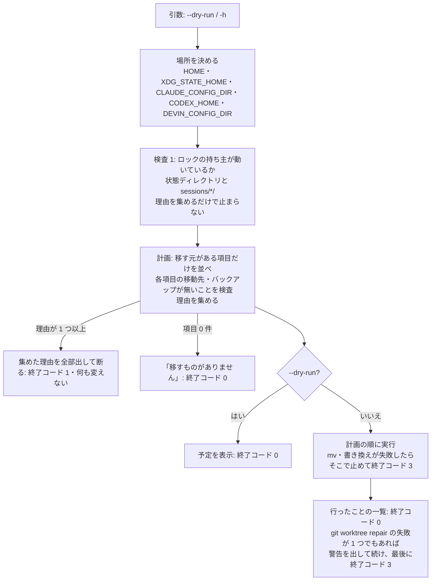

# 仕様: 製品名を Sodashitsu（操舵室）に改める と 一度きりの移行スクリプト

## 概要

2 つの部分からなる。

1. **改名**（AC1〜AC5・AC16・AC17）: 追跡しているファイル（`.aidev/works/**`・`pnpm-lock.yaml` を除く）に、決まった順序の文字列の置換を一括で当て、
   名前に古い名前を含む 2 ファイルを `git mv` し、表示名（Sodashitsu）が要る数か所を手で直す。`pnpm-lock.yaml` は `pnpm install` で作り直す。
   アプリは古い名前を一切読まない（後方互換なし。decisions D1）。
2. **移行スクリプト**（AC6〜AC15・AC18）: `scripts/migrate-from-wtm.sh`（POSIX sh）と `scripts/migrate-from-wtm.bat`（cmd。文字列の置換だけ PowerShell）。
   **全部を検査してから動かす**二段の構成で、検査で断るときは何も変えない。テストは vitest から一時的な HOME で sh を起動する。
   移行の docs は `docs/migrate-from-wtm.md`（日本語）。

## 設計方針

### 名前の対応表（一つの古い名前に一つの新しい名前）

| 古い | 新しい | 出所（research） |
|---|---|---|
| `web-tn-multiplexer`（状態ディレクトリ・docs の clone 先） | `sodashitsu` | F1.1・F2.1 |
| `~/.wtm/worktrees`（`".wtm", "worktrees"` を含む） | `~/.sodashitsu/worktrees` | F1.3・F5.3 |
| `@wtm/*` | `@sodashitsu/*` | F1.1 |
| ルートの `wtm-workspace` | `sodashitsu-workspace` | `package.json:2` |
| `wtmctl`・`WTMCTL_*`（`~/.wtmctl`・skill のディレクトリ・`docs/wtmctl.md` を含む） | `sodactl`・`SODACTL_*` | F1.1・F1.2・F5.1 |
| `wtm`・`WTM_*`・`Wtm…`・`__wtm…`・`wtm.*.v1`・`--wtm-*`・`wtm_session`・`wtm.lock`・`wtm-image-*`・`wtm-agent-report*`・`WTM-BRIDGE`・一時ディレクトリの `wtm-…-` | `soda`・`SODA_*`・`Soda…`・`__soda…`・`soda.*.v1`・`--soda-*`・`soda_session`・`soda.lock`・`soda-image-*`・`soda-agent-report*`・`SODA-BRIDGE`・`soda-…-` | F1.1・F2.2・F4.3・F7.1 |
| ページのタイトルの既定 `wtm`・LICENSE の `wtm contributors`・NOTICE の製品名 | `Sodashitsu`・`Sodashitsu contributors`・`Sodashitsu（操舵室）` | F1.4・F1.5 |

- **表示名とコマンド名の使い分け**: 製品そのものを指す箇所（ページのタイトルの既定・LICENSE・NOTICE・docs の冒頭と見出し・skill の説明の冒頭・AGENTS.md の冒頭）は
  `Sodashitsu`、コマンド・プロセス・ファイルの名前は `soda`/`sodactl`。本文中の「wtm の pane」「wtm serve」のような、コマンドとしての言及は一律の置換の結果
  （`soda`）のままにする——今までも `wtm` はコマンド名と製品名を兼ねていたので、置換の結果は読み手にとってコマンドの名前として通る。

### 置換の順序（`scripts/` には一時的なスクリプトを置かない。scratchpad の使い捨ての Python で当てる）

対象は `git ls-files` のうち `.aidev/works/`・`pnpm-lock.yaml` を除いたもの。順に（前の置換の結果に後の置換が当たらない順）:

1. `web-tn-multiplexer` → `sodashitsu`
2. `.wtm/worktrees` → `.sodashitsu/worktrees`、`".wtm", "worktrees"` → `".sodashitsu", "worktrees"`
3. `@wtm/` → `@sodashitsu/`、`wtm-workspace` → `sodashitsu-workspace`
4. `WTMCTL` → `SODACTL`、`Wtmctl` → `Sodactl`、`wtmctl` → `sodactl`
5. `WTM` → `SODA`、`Wtm` → `Soda`、`wtm` → `soda`

その後に `git mv docs/wtmctl.md docs/sodactl.md`・`git mv packages/cli/skills/wtmctl packages/cli/skills/sodactl`、表示名の手直し（上の使い分け）、
`pnpm install`（lock の作り直し）。移行スクリプト・そのテスト・移行の docs は置換の**後**に書く（古い名前を意図して含むため）。

### 移行スクリプトの構成（`.sh`）



- **検査と実行を分ける**: 計画は「行う操作の列（種類・元・先）」として検査の段で作り、実行の段はその列を順に行うだけ。検査の段は読むだけ（`mkdir` もしない）。
- **移す元がある項目だけ**を計画に入れる（requirements 機能要件 1）。だから 2 回目は項目 0 件で「移すものがありません」と 0 で終わる（AC13）。

## 対象範囲

- 置換: `git ls-files` の全体（除外は上記）。手直し: `packages/web/index.html`・`packages/web/src/serverSession/documentTitle.ts`（と test）・`LICENSE`・`NOTICE`・
  `AGENTS.md`・`docs/*.md` の冒頭・`packages/cli/skills/sodactl/SKILL.md` の説明。
- 新規: `scripts/migrate-from-wtm.sh`・`scripts/migrate-from-wtm.bat`・`scripts/migrate-from-wtm.test.ts`・`scripts/vitest.config.ts`・`docs/migrate-from-wtm.md`。
- 変更: ルートの `vitest.config.ts`（`projects` に `scripts` を足す）、`.aidev/config.yml`（smoke のコマンドは置換で改まる）、`pnpm-lock.yaml`（作り直し）。

## 依拠する既存の事実

- 状態ディレクトリの既定の場所と名前: `packages/server/src/config.ts:64-73` `defaultStateDir`（research F2.1）。
- 状態ディレクトリの中で古い名前を含むのは `wtm.lock`（`persist/StateDirLock.ts:7`）と `clipboard-images/wtm-image-*`（`image/ImageStore.ts:19,82`）だけ
  （research F2.2 で固定のファイル名をすべて挙げた。探した範囲: `packages/server/src` の `join(stateDir, …)`・`*_FILE_NAME` の定数）。
- 名前付き session は `<状態ディレクトリ>/sessions/<名前>/` に同じ形（research F2.3・`persist/namedSession.ts`）。
- ロックの形と使用中の判定: `persist/StateDirLock.ts` の `tryCreate`・`parseHolder`・`isInUse`（research F3.1〜F3.2）。
- hook の置き場・設定ファイル・コマンドの形・環境変数の上書き: `agent/AgentIntegrationInstaller.ts:15,80-84,96-167`（research F4.1〜F4.3）。
- 写した hook のスクリプトは `WTM_PANE_ID`・`WTM_AGENT_REPORT_SOCKET` を読む: `packages/server/assets/agent-hook-report.cjs:34-35`（research F4.4）。
- CLI のキャッシュの場所と cookie の形: `packages/cli/src/session.ts:26`・`packages/cli/src/httpAuth.ts:5`（research F5.1）。サーバ側の session は `auth.json` にあり
  cookie の名前を含まない——`packages/server/src/auth/AuthService.ts:9` の `SESSION_COOKIE_NAME` は cookie の名前にだけ使われる（未確認: `auth.json` の
  スキーマまでは読んでいない。移行の後に CLI が 401 になっても、既存の自動ログイン・`sodactl login` で回復するので、壊れる方向の影響は無い）。
- worktree の既定の置き場と深さ: `packages/server/src/git/WorktreeService.ts:22-24`・`packages/protocol/src/worktreePath.test.ts:36-37`（research F5.3）。
- 保存したレイアウトに workspace の cwd が絶対パスで残る: `packages/server/src/session/SessionService.test.ts:1300-1302`（research F5.4）。
- 動かした worktree は `git worktree repair` で直る（research F6.1 の実測）。
- localStorage・sessionStorage のキー: research F7.1・F7.2。
- ルートの vitest は `test.projects: ["packages/*"]`（`vitest.config.ts:9-13` の `defineConfig({ test: { projects } })`。research A11）。

## インターフェース / データ構造

### `scripts/migrate-from-wtm.sh`

```
sh scripts/migrate-from-wtm.sh [--dry-run]
sh scripts/migrate-from-wtm.sh -h | --help
```

- 終了コード: `0` 成功・予定の表示・移すものが無い／`1` 断った（動いているサーバ・移動先やバックアップの名前がある・git が無い・同梱の hook のスクリプトが
  見つからないか `SODA_PANE_ID` を含まない。何も変えていない）／`2` 使い方の誤りと、場所を決められない（`HOME` が無い）／
  `3` 実行の途中で失敗した（`mv`・書き換えの失敗でそこで止めた、または `git worktree repair` の失敗が 1 つ以上あった）。
- 出力:
  - 標準出力: 1 操作 1 行。`--dry-run` は `予定: <操作>`、実行は `済み: <操作>`。最後に `移行: <n> 件の操作を行いました。…`（dry-run は `…予定です…`）。
    移すものが無いときは `移すものがありません（…）。`。手で入れた skill の案内は `注意: …`（どの場合も最後に）。
  - 標準エラー: 断るときは `migrate-from-wtm: <理由>` を理由ごとに 1 行ずつ（全部の理由を集めてから）と、最後に `…何も変えていません。`。
    実行の途中の失敗は `失敗: <操作>` と `migrate-from-wtm: 移行は途中で止まりました…`、repair の失敗は `警告: …`。
- 読む環境変数（アプリと同じ規則）:
  - `HOME`（必須。無ければ 2）。
  - `XDG_STATE_HOME`: 空でなければその下、空・未設定なら `$HOME/.local/state`（アプリは空文字も使う〔`??`〕が、空の基点は相対パスになり意味をなさないので空は未設定と同じに扱う）。
  - `CLAUDE_CONFIG_DIR`・`CODEX_HOME`・`DEVIN_CONFIG_DIR`: 空でなければそこ、でなければ既定（アプリの `||` と同じ）。

### 計画の項目（検査の段で作る）

| 項目 | 移す元がある条件 | 操作 | 断る条件（移動先・バックアップ） |
|---|---|---|---|
| 状態ディレクトリ | `<state>/web-tn-multiplexer` がディレクトリ | `mv` → `<state>/sodashitsu` | `<state>/sodashitsu` がある |
| ロック | 移す状態ディレクトリの `wtm.lock`・`sessions/*/wtm.lock` | 移した先で `mv` → `soda.lock` | 同じ場所に `soda.lock` がある |
| 画像 | 移す状態ディレクトリの `clipboard-images/wtm-image-*`・`sessions/*/clipboard-images/wtm-image-*` | 移した先で `mv` → `soda-image-*` | 同じ名前の `soda-image-*` がある |
| CLI のキャッシュ | `$HOME/.wtmctl` がディレクトリ | `mv` → `$HOME/.sodactl`、その `session.json` の `wtm_session` → `soda_session`（元を `session.json.bak-wtm-migration` へ写してから） | `$HOME/.sodactl` がある |
| worktree | `$HOME/.wtm/worktrees` がディレクトリ | `mkdir -p $HOME/.sodashitsu`・`mv` → `$HOME/.sodashitsu/worktrees`、深さ 3 の `.git` ファイルのある各ディレクトリで `git -C <dir> worktree repair`、`$HOME/.wtm` が空なら `rmdir` | `$HOME/.sodashitsu/worktrees` がある |
| レイアウトの worktree のパス | worktree を移す、かつ移した後の状態ディレクトリ（移す場合は移動先、移さない場合は既存の `sodashitsu`）の `session.json`・`sessions/*/session.json` が `$HOME/.wtm/worktrees` を含む | `$HOME/.wtm/worktrees` → `$HOME/.sodashitsu/worktrees` の文字列の置換（元を `.bak-wtm-migration` へ） | バックアップの名前がある |
| 独自コマンド（cross 点検で追加。decisions D8） | 移した後の状態ディレクトリの `commands.json`・`sessions/*/commands.json` が `WTM_` を含む | `WTM_` → `SODA_` の置換（元を `.bak-wtm-migration` へ） | バックアップの名前がある |
| hook の設定（名前は同じ） | claude・codex・cursor・devin・factory・qwen の設定ファイルが `wtm-agent-report` を含む | `wtm-agent-report` → `soda-agent-report` の置換（元を `<ファイル>.bak-wtm-migration` へ） | バックアップの名前がある |
| hook の設定（名前も変わる） | copilot・grok の `hooks/wtm-agent-report.json` がある | 元を `.bak-wtm-migration` へ写し、置換した内容を `hooks/soda-agent-report.json` に書いて元を消す | `soda-agent-report.json`・バックアップの名前がある |
| hook のスクリプト | 8 種の `hooks/wtm-agent-report.cjs` がある | 元を `.bak-wtm-migration` へ写し、同梱の `packages/server/assets/agent-hook-report.cjs` を `hooks/soda-agent-report.cjs` に写して元を消す | `soda-agent-report.cjs`・バックアップの名前がある。同梱のスクリプトが無いか `SODA_PANE_ID` を含まない |

- 同梱のスクリプトの場所はスクリプト自身の場所から決める（`$(dirname "$0")/../packages/server/assets/agent-hook-report.cjs`）。
- 置換は「元の権限を保つ一時ファイル（`cp -p` で作ってから中身を書く）→ `mv`」で行う（途中で落ちても元のファイルが半端にならない）。
- 本製品の hook のエントリは `wtm-agent-report` という固有の文字列でしか識別されない（research F4.3）ので、その文字列の置換は他製品のエントリと設定の他の項目に触れない（AC9）。
- **Claude Code の会話の記録**（`${CLAUDE_CONFIG_DIR:-~/.claude}/projects/*-wtm-worktrees-*`）は変えず、`注意:` で知らせる（review ラウンド 1。decisions D8）。
- **手で入れた skill**（`${CLAUDE_CONFIG_DIR:-~/.claude}/skills/wtmctl`）があれば、`注意:` の行で入れ直しを案内するだけで変えない（中身は `sodactl skill` の出力で、スクリプトが作れないため）。

### 動いているサーバの判定（検査 1）

- 対象: `<state>/web-tn-multiplexer/wtm.lock` と `<state>/web-tn-multiplexer/sessions/*/wtm.lock`。
- 1 行目が数字でない・空 → 落ちた残り（アプリの `parseHolder` と同じ）。
- 2 行目（ホスト名）があり `uname -n` と違う → **使用中とみなして断る**（アプリの `isOtherHost` と同じ。別のマシン・コンテナで動いているかを確かめられない）。
  案内: 動いていないことを確かめたらロックのファイルを消してから実行し直す。
- それ以外は `ps -p <pid>` が成功すれば動いている → 断る（`kill -0` は他の利用者のプロセスで失敗するので使わない。アプリは `EPERM` を生きているとみなす）。
- 落ちた残りのロックは計画の「ロック」の項目で `soda.lock` へ名前を変える（新しいアプリは pid を見て取り直す）。

### `scripts/migrate-from-wtm.bat`

- `.sh` と同じ検査・計画・実行の段と出力・終了コード。場所は `%LOCALAPPDATA%`（無ければ `%USERPROFILE%\AppData\Local`）、`%USERPROFILE%`、同じ 3 つの環境変数。
- pid の生死は `tasklist /FI "PID eq <pid>" /NH` の出力に pid があるか、ホスト名は `hostname` の出力（アプリがロックに書く `os.hostname()` と同じ）と大文字小文字を無視して比べる（coding で `%COMPUTERNAME%` から改めた。NetBIOS 名は 15 文字で切られるため）。
- 文字列の置換は `powershell -NoProfile -Command` の `[IO.File]::ReadAllText`／`WriteAllText`（BOM 無しの UTF-8。Windows PowerShell 5.1 の `Set-Content -Encoding UTF8`
  は BOM を付け、Node の `JSON.parse` が読めなくなるため使わない）。
- worktree は `.sh` と同じく置き場から深さ 3 の `.git`（`for /d` を 2 段）で見つけて `git -C` で repair。レイアウトのパスは `/` 区切りと JSON の `\\` 区切りの 2 つの形を置換する。
- **この環境では実行できない**。`.sh` と読み合わせたことだけを確かめ（AC18）、docs に未検証と書く。

### テスト（`scripts/migrate-from-wtm.test.ts`・`scripts/vitest.config.ts`）

- ルートの `vitest.config.ts` の `projects` に `"scripts"` を足し、`scripts/vitest.config.ts`（`environment: "node"`）を置く。
- 各テストは `mkdtemp` の根に `home/`・`xdg/`・`claude/`・`codex/`・`devin/` を作り、**環境は一から組む**（`PATH`・`HOME`・`XDG_STATE_HOME`・3 つの上書き・`LC_ALL=C`・
  git の作者の変数。`process.env` を広げない——広げると利用者の本物の `CLAUDE_CONFIG_DIR` 等が漏れる）。cursor・copilot・factory・grok・qwen は一時的な HOME の下の既定の場所。
- ケース: dry-run（予定の表示・ファイルの木が同じ）／全部の移動（状態ディレクトリ・sessions・ロック・画像・CLI のキャッシュと cookie・worktree と repair と
  レイアウトのパス・8 種の hook の書き換えと名前の変更とバックアップ・他製品のエントリが残る・`済み:` の行と最終行）／動いているサーバで断る（既定・名前付き・別のホスト。木が同じ）／
  移動先がある（状態ディレクトリ・`.sodactl`・worktree・hook の移動先・バックアップ）で断る（木が同じ）／2 回目は「移すものがありません」で 0／落ちた残りのロックは移す／使い方の誤りは 2。
- 「木が同じ」は、根の下の全ファイルのパス・中身・種類の一覧を前後で比べる。

## 振る舞いの詳細

- 移行の後、アプリは `~/.local/state/sodashitsu`・`~/.sodactl`・`~/.sodashitsu/worktrees`・`soda-agent-report.cjs` を使う。hook のスクリプトは `SODA_PANE_ID`・
  `SODA_AGENT_REPORT_SOCKET` を読む同梱の版になっているので、エージェント連携はそのまま効く。
- ブラウザの cookie の名前が `soda_session` になるので、最初の 1 回だけログイン画面になる（token でログインし直す。サーバの `auth.json` は移っているので token は同じ）。

## ドメイン固有の考慮

- `.aidev/works/**` は開発の記録で、当時の名前のまま残す（AGENTS.md の案内）。
- E2E・負荷テストは走らせない（利用者の指示）。e2e のソースは置換で改めるが、実行はしない（型検査は `pnpm -s typecheck` が見る）。
- 利用者の本物の状態に触れない: 移行スクリプトのテストは一時的な根の中だけ。移行スクリプトを本物の HOME で実行しない。

## エラー処理 / 異常系

- 検査で見つかった理由はすべて集めてから、一度に標準エラーへ出して 1 で終わる（1 つ直して再実行 → 次の理由、の往復を避ける）。
- 実行の途中の失敗（`mv` の失敗・書き込みの失敗）: そこで止め、`失敗: <操作>` と、それまでの `済み:` の一覧を残して 3 で終わる。巻き戻しはしない
  （移動は元に戻す手順が一覧から分かる。巻き戻しの失敗が状態を更に崩すのを避ける）。
- `git worktree repair` の失敗: その worktree の名前を `警告:` で出し、残りを続け、最後に 3 で終わる（worktree は既に移っているので、手で `git worktree repair` を打つ案内を添える）。
- 同梱の hook のスクリプトが無い（リポジトリの外に写して実行した等）・`SODA_PANE_ID` を含まない（古い checkout で実行した）: hook のスクリプトの項目があれば検査で断る。

## 受け入れ基準との対応

- AC1: 置換の手順 3〜5 と `git mv`・`pnpm install`。入力: `packages/*/package.json` の `name`・`bin`（research F1.1）。
- AC2: 置換の手順 1〜5 がアプリのソースと `packages/server/assets/agent-hook-report.cjs` に当たる。後方互換のコードは足さない。入力: research F1.1・F2.2・F4.3・F5.1・F5.3・F7.1。
- AC3: 置換と表示名の手直し（`index.html`・`documentTitle`・skill の説明）、`git mv packages/cli/skills/wtmctl`。入力: research F1.2・F1.4。
- AC4: 置換と手直し（AGENTS.md・docs・LICENSE・NOTICE・`third_party`・`.aidev/config.yml`・`.aidev/backlog`）、`git mv docs/wtmctl.md`。入力: research F1.5・F1.6。
- AC5: 最後の `git grep -i -E 'wtm|web-tn-multiplexer' -- ':!.aidev/works'` の当たりを、移行スクリプト・テスト・移行の docs・移行の docs への言及・lock の integrity に分類する。
- AC6: 計画の「状態ディレクトリ」「ロック」「画像」。入力: `XDG_STATE_HOME`・`HOME`（research F2.1〜F2.3）。テスト「全部の移動」。
- AC7: 計画の「CLI のキャッシュ」。入力: `$HOME/.wtmctl/session.json`（research F5.1）。テスト「全部の移動」。
- AC8: 計画の「worktree」「レイアウトの worktree のパス」。入力: `$HOME/.wtm/worktrees`（research F5.3〜F5.4・F6）。テストで実物の git の repo と worktree を作り、移した後に
  元の repo の `git worktree list --porcelain` が新しいパスを示し、worktree の中の `git status` が通ることを見る。
- AC9: 計画の「hook の設定」「hook のスクリプト」。入力: 3 つの環境変数と一時的な HOME の既定の場所（research F4.2）。テストで 8 種すべてと他製品のエントリを見る。
- AC10: `--dry-run` の分岐と一覧の出力。テスト「dry-run」で木が同じこと・`予定:` の行と最終行、テスト「全部の移動」で `済み:` の行と最終行 `移行: <n> 件の操作を行いました` を確かめる。
- AC11: 検査 1。入力: ロックのファイル（research F3.1）。テストで実物の `sleep` の pid と別のホスト名を書く。
- AC12: 計画の「断る条件」。テストで各移動先・バックアップを先に置く。
- AC13: 「移す元がある項目だけ」の計画。テスト「2 回目」。
- AC14: 検査 1 と断る条件の行を変異で壊し、テストが落ちることを確かめる（`test-result.md` に生の出力。`.aidev/conventions/regression-negative-control.md`）。
- AC15: `docs/migrate-from-wtm.md`。入力: この design の振る舞いの詳細と research F7。
- AC16: `pnpm -s build`・`pnpm -s typecheck`・`pnpm -s test` を終了コードで確かめる。
- AC17: `aidev smoke`。入力: 置換で改まった `.aidev/config.yml` の `smokeCommands`。
- AC18: `.bat` を `.sh` と項目ごとに読み合わせ、対応を `test-result.md` に表で残す。
