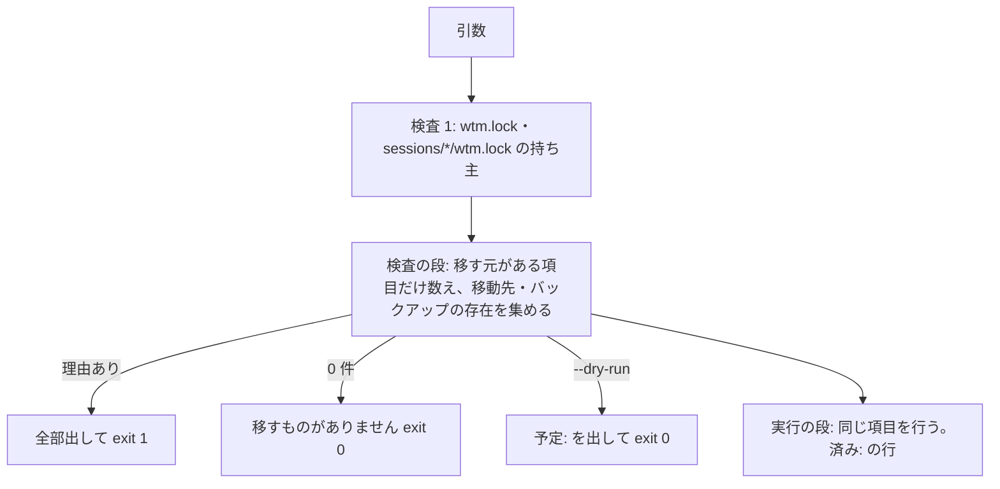

# レビューガイド: 製品名を Sodashitsu に改める と 一度きりの移行スクリプト

## 変更概要 / 目的

製品名 `web-tn-multiplexer`（`wtm`・`wtmctl`）を **Sodashitsu（`soda`・`sodactl`・`@sodashitsu/*`）** に改めた。利用者本人ひとりなので
アプリに後方互換は置かず（decisions D1）、手元の古い状態は一度きりの `scripts/migrate-from-wtm.sh`（と未検証の `.bat`）で移す。

## 重要ポイント

- **差分の 9 割は機械的な置換**（`scratchpad` の使い捨ての Python。design「置換の順序」）。`web-tn-multiplexer`→`sodashitsu`、`.wtm/worktrees`→`.sodashitsu/worktrees`、
  `@wtm/`→`@sodashitsu/`、`wtmctl`→`sodactl`、`wtm`→`soda`（大文字・先頭大文字も）。見るべきは置換の**例外**:
  - 表示名 `Sodashitsu`: `packages/web/index.html:6`・`packages/web/src/serverSession/documentTitle.ts`・`packages/web/src/components/LoginView.vue:142`・LICENSE・NOTICE・AGENTS.md。
  - `docs/tls-setup.md:466` の socket のパス長の数字（状態ディレクトリ名が短くなった）。
  - `pnpm-lock.yaml` は `pnpm install --offline` で作り直し（差分は workspace のキーだけ）。
- **移行スクリプトは「検査の段 → 実行の段」の二段**（`scripts/migrate-from-wtm.sh` の `PHASE`）。同じ項目の関数を 2 回呼び、1 回目は数えて断る理由を集めるだけ。
  断る理由があれば全部出して終了コード 1・何も変えない。
- 依頼より広げた点（decisions D2・D8）: hook のスクリプトは名前だけでなく**中身も新しい版に置き換える**（古い版は `WTM_PANE_ID` を読むので黙って効かなくなる）、
  CLI のキャッシュの cookie 名、保存したレイアウトの worktree のパス、独自コマンドの `WTM_`。Claude Code の会話の記録は動かさず `注意:` で知らせる。

## 処理フロー

## 主要な変更箇所

- `scripts/migrate-from-wtm.sh` — 移行の本体（検査 `check_lock`・`need_absent`、項目 `item_state`/`item_commands`/`item_cli`/`item_worktrees`/`item_hooks`）。
- `scripts/migrate-from-wtm.test.ts` — 一時的な HOME だけで sh を起動する統合テスト 33 本（実物の git の worktree と repair、今のアプリの `FsAgentIntegrationInstaller` で作った hook）。
- `scripts/migrate-from-wtm.bat` — `.sh` の写し（英語のメッセージ・CRLF。Windows で未実行）。
- `docs/migrate-from-wtm.md` — 移行の手順（ログインし直し・localStorage のスニペット・手で移すもの）。
- `vitest.config.ts`・`scripts/vitest.config.ts`・`scripts/tsconfig.json`・`package.json` の typecheck — scripts/ のテストと型検査を既存の `pnpm -s test`/`typecheck` に載せた。

## リスク / 確認したい点

- `.bat` は一度も実行していない（`test-result.md` の対応表と独立点検だけ）。Windows で使うなら `--dry-run` と状態ディレクトリの控えを先に。
- 移行スクリプトは利用者の本物の状態では実行していない。本物の Claude Code 等の設定の形は、今のアプリの導入の処理で作った形で模した。
- 負の対照: 安全の検査の変異 36 件がすべてテストを落とした（`test-result.md`）。
