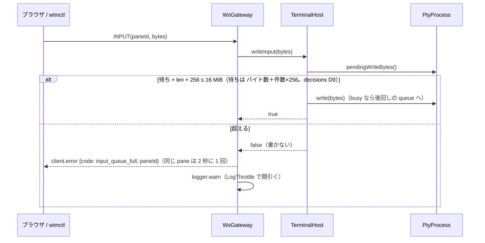

# 仕様: サーバ側の大きさと入力の上限

## 概要

- **大きさ**: `@wtm/protocol` に端末の大きさの上限（1 辺 4096・面積 1,000,000 セル）と `client.view` の `visible` の件数の上限（4096）を定数で置き、
  `ClientViewParams`・`PaneAttachParams`・`PaneAttachResizeParams` のスキーマがそれを見る。外れた要求は `ControlSurface` のスキーマの検査で
  `invalid_params` になり、ハンドラ（大きさを変える処理）に届かない。ブラウザと `wtmctl pane attach` は同じ定数で丸めてから送る。
- **入力**: PTY の実装が「まだ書けていない入力のバイト数」を返せるようにし（`PtyProcess.pendingWriteBytes`）、`TerminalHost` が利用者の入力
  （INPUT フレーム・エージェントへの入力）を書く前に「待ち＋今回の長さ」が pane ごとの上限（16 MiB）を超えるかを見る。超えるなら**丸ごと書かずに捨て**、
  INPUT なら送った接続へ `client.error`（新しいコード `input_queue_full`・`paneId`）を間引いて送り、ログにも間引いて残す。
  エージェントへの入力は `input_queue_full` の RpcError で失敗する。サーバ自身の書き込み（問い合わせへの応答）は見ない。
- 中継（`/ws?machine=`）は先のサーバが同じ `WsGateway`/`ControlSurface` で判定する（research F14）ので、手元の中継は変えない。

## 設計方針

- **捨てて知らせる（背圧で待たせない）**（decisions D3）。1 本の `/ws` がブラウザの全 pane の入力と RPC を運び、中継の先では 1 本の ssh が全チャネルを
  運ぶ（research F14）。1 つの pane のために接続の読み取りを止めると、他の pane への打鍵・RPC・同じ ssh の他の利用者まで止まる。herdr も捨てる（research F20）。
- **判定は利用者の入力の経路だけに置く**（`TerminalHost.writeInput`・`runModal`）。`PtyProcess.write` に置くと、ミラーの問い合わせへの応答
  （research F12）まで捨ててアプリが応答待ちで固まる。
- **量は PTY の実装から測る**（decisions D4）。node-pty は公開 API で書き終わりを知らせない（research F8）ので、Unix は内部の
  `_writeStream._writeQueue`、Windows は `_agent.inSocket.writableLength` を読む。形が無ければ `undefined`＝測れない（0 とみなし、捨てない）。
  node-pty の版は固定されており、実物の PTY で量が測れることを統合テストで確かめる（更新で形が変われば落ちる）。
- **値**（decisions D2）: 1 辺 4096・面積 1,000,000・件数 4096（herdr の `MAX_CLIENT_SHELL_DIMENSION`・`MAX_CLIENT_SHELL_CELLS`・描画の `MAX_PANES` と同じ。
  research F19）。入力の待ちは 16 MiB（1 通の上限 1 MiB の 16 通分）。知らせの間隔は同じ接続・同じ pane で 2 秒に 1 回。
- 退けた案:
  - 接続の読み取りを止める背圧（上記）。
  - 待ちが上限を超えたら接続を閉じる——ブラウザの全 pane が巻き込まれ、繋ぎ直しても pane は読まないままなので輪になる。
  - node-pty の書き込みを自前の fd の書き手（`AdoptedPtyProcess` と同じ 5ms の待ち）に替えて量と CPU の両方を直す——fd の寿命（子の終了で node-pty が閉じる・
    番号の再利用）と競合しない作りが要り、この work の範囲（量の上限）より大きい。後続に残す（decisions D5）。
  - 大きさを黙って丸めて受け付ける——壊れたクライアントが気づけない。スキーマで断り、クライアント側（ブラウザ・wtmctl）で丸める。

## 対象範囲

- `packages/protocol/src/terminalLimits.ts`（新規）: 定数・スキーマの部品・`clampTerminalSize`。`index.ts` から export。
- `packages/protocol/src/messages.ts`: `ClientViewParams`・`PaneAttachParams`・`PaneAttachResizeParams` を上限つきに。
- `packages/protocol/src/errors.ts`: `input_queue_full`。`packages/protocol/src/events.ts`: `ClientErrorEvent.data.paneId?`。
- `packages/server/src/pty/PtyBackend.ts`・`NodePtyBackend.ts`・`AdoptedPtyProcess.ts`: `pendingWriteBytes?()`。
- `packages/server/src/terminal/TerminalHost.ts`: `writeInput`・`inputBacklog`・`runModal` の判定・`MAX_PENDING_INPUT_BYTES`。
- `packages/server/src/ws/WsGateway.ts`: INPUT を `writeInput` で書き、捨てたら知らせる（間引き）・ログ（間引き）。
- `packages/web/src/term/measure.ts`: `clampTerminalSize` で丸める。`packages/web/src/net/clientError.ts`: 文言。
- `packages/cli/src/commands/sessionStream.ts`（control の警告。`runPaneControl`）・`packages/cli/src/commands/attach.ts`（丸め）。
  `packages/cli/src/sessionStream.ts`（別のファイル。記録の組み立てと `MAX_STREAM_DIMENSION`）は変えない。
- テスト（各パッケージの既存のテストファイルに足す）・`docs/wtmctl.md`・`docs/verification.md`・`docs/machines.md`（中継の注記）。

## 依拠する既存の事実

- スキーマの失敗は `ControlSurface.invoke` がハンドラを呼ばずに `invalid_params` で返す（`packages/server/src/surface/ControlSurface.ts:34-36`）。
- 大きさはハンドラから `SessionService.resizePane` → PTY・ミラーへ入る（`packages/server/src/clients/SizeAuthority.ts:145`・`:154`・`:212`・
  `packages/server/src/session/SessionService.ts:1005-1012`・`packages/server/src/terminal/TerminalHost.ts:262-268`）。ミラーは `term.resize` でその場で行を作る
  （`packages/server/src/terminal/Mirror.ts:267-269`）。
- INPUT は `WsGateway` の `onBinary` で `host.write` に渡る（`packages/server/src/ws/WsGateway.ts:100-123`）。不正なフレームの計数は 10 秒 10 回で 1008（`:161-175`）。
- node-pty の Unix の書き込み待ちは `_writeStream._writeQueue: {buffer, offset}[]`（`node-pty/lib/unixTerminal.js:285-348`）、Windows は
  `_agent.inSocket`（`windowsTerminal.js:119-124`・`windowsPtyAgent.js:86-99`）。読まない raw モードの子で待ちが残ることは実測済み（research F9）。
  Windows の実機では未確認。
- `AdoptedPtyProcess` は自前の `queue: {buf, offset}[]`（`packages/server/src/pty/AdoptedPtyProcess.ts:92`・`:127-172`）。
- `TerminalHost` はモード付き入力の間の入力を `queue` に積む（`TerminalHost.ts:173-177`・`:226-243`）。問い合わせへの応答は `pty.write` を直接呼ぶ（`:134`・`:155-161`）。
- エージェントの RPC は RpcError をそのまま返す（`packages/server/src/surface/methods/agent.ts:88-91`・`:118-121`・`packages/server/src/agent/AgentStarter.ts:125-130`）。
- ブラウザの文言の表は `Record<ErrorCode, string>`（`packages/web/src/net/clientError.ts:12`）。大きさは `measure`（`packages/web/src/term/measure.ts:18-22`）で決まり、
  呼ぶのは `ViewSync.commit`（`packages/web/src/term/ViewSync.ts:92`）。
- `wtmctl pane control` はイベントを `onEvent`（`packages/cli/src/commands/sessionStream.ts:358-366`）で受け、警告は `warn`（`:405-408`）。
  `pane control`/`observe` の大きさの上限は 1000（`packages/cli/src/sessionStream.ts:9`）＝1000×1000 は面積の上限ちょうどで、どちらの上限の内側。
  `pane attach` は手元の端末の大きさを丸めずに送る（`packages/cli/src/commands/attach.ts:165-170`・`:230-236`）。
- 中継の先は同じ `WsGateway`/`ControlSurface` を使う（`packages/server/src/composeServer.ts:306`・`:311-312`）。手元の中継は中身を解釈しない（`packages/server/src/machine/MachineRelay.ts:85-100`）。
- `LogThrottle.take()` は窓（既定 60 秒）ごとに行数（既定 20）までだけ書かせ、抑えた件数を返す（`packages/server/src/log/LogThrottle.ts:2`・`:4`・`:37`）。
- `WsGateway` は時計を `WsGatewayOptions.now`（既定 `monotonicNow`）で差し替えられる（`packages/server/src/ws/WsGateway.ts:30-35`・`:62`）。INPUT は pane が無ければ
  黙って捨て（`:120`）、あれば `noteInteraction` を呼んでから書く（`:121-122`）。不正なフレームは `registerInvalidFrame`（`:161-175`）。
  `sendText` は `ws` の `send` をそのまま呼ぶ（`packages/server/src/ws/WsServerWs.ts` の `WsConnectionImpl.sendText`）。
- INPUT の 1 通の上限は 1 MiB（`WsGateway.ts:15` `MAX_INPUT_FRAME_BYTES`）。
- `TerminalHost` の終了は `inputClosed`（`TerminalHost.ts:89`）で、終了後の `write` はそのまま `pty.write` に渡る（`:173-177`。node-pty は閉じた fd への書き込みを
  エラーで捨てる——research F9）。
- `AdoptedPtyProcess` は `EAGAIN` を 5ms の `setTimeout` で書き直す（`AdoptedPtyProcess.ts:163`）。
- `TerminalHost` を実装するテストの偽物は 11 個（`grep "implements TerminalHost"`：`SessionService*.test.ts` 6・`surface/methods/index.test.ts`・`attach.test.ts`・
  `GitInfoPoller.test.ts`・`SizeAuthority.test.ts`・`AgentMonitor.test.ts`）。

## インターフェース / データ構造

```ts
// packages/protocol/src/terminalLimits.ts
export const TERMINAL_SIZE_MAX = 4096;          // 1 辺（cols・rows それぞれ）
export const TERMINAL_CELLS_MAX = 1_000_000;    // cols × rows
export const VIEW_VISIBLE_PANES_MAX = 4096;     // client.view の visible の件数
export const terminalDimension: z.ZodNumber;    // z.number().int().min(1).max(TERMINAL_SIZE_MAX)
export function withinCellLimit(v: { cols: number; rows: number }): boolean; // cols*rows <= TERMINAL_CELLS_MAX
export function clampTerminalSize(cols: number, rows: number): { cols: number; rows: number };
//  非有限は 1。各辺を [1, TERMINAL_SIZE_MAX] の整数（切り捨て）に。面積が超えれば rows を floor(CELLS_MAX / cols) に減らす（幅を保つ）。

// messages.ts（refine のメッセージは "cols × rows exceeds <N> cells"）
ClientViewParams.visible: z.array(z.object({ paneId, cols: terminalDimension, rows: terminalDimension }).refine(withinCellLimit)).max(VIEW_VISIBLE_PANES_MAX)
PaneAttachParams / PaneAttachResizeParams: cols/rows を terminalDimension にし、全体に .refine(withinCellLimit)

// errors.ts
ErrorCode |= "input_queue_full"
// events.ts
ClientErrorEvent.data: { code: string; message: string; paneId?: string }

// packages/server/src/pty/PtyBackend.ts
interface PtyProcess { /** まだ PTY へ書けていない入力のバイト数。測れなければ undefined。 */ pendingWriteBytes?(): number | undefined; }

// packages/server/src/terminal/TerminalHost.ts
export const MAX_PENDING_INPUT_BYTES = 16 * 1024 * 1024;
interface TerminalHost {
  /** 利用者の入力を書く。待ち＋長さが上限を超えるなら書かずに false。 */
  writeInput?(input: Uint8Array | string): boolean;
  /** まだ PTY へ書けていない入力（自前の後回しの待ち＋PTY の待ち。測れない分は 0）。 */
  inputBacklog?(): number;
}
```

`writeInput`・`inputBacklog` は任意（テストの偽物の `TerminalHost` 11 個を変えずに済ませる）。実物は `DefaultTerminalHost` だけで、必ず実装する。
`WsGateway` は `writeInput` が無い host には今までどおり `write` する（＝測れない扱い）。

## 振る舞いの詳細

### 大きさ

- `client.view`: `visible` の各要素の `cols`・`rows` が 1〜4096 の整数で、`cols×rows ≤ 1,000,000`、件数 ≤ 4096。外れたら要求ごと `invalid_params`
  （`setView` も `onViewChanged` も呼ばれない＝前の表示のまま）。
- `pane.attach`・`pane.attach_resize`: 同じ条件。外れたら `invalid_params`（所有者にもならない・大きさも変わらない）。
- ブラウザ: `measure` の結果を `clampTerminalSize` に通す（異常に小さいセル・巨大な要素でも範囲の内の値を送る）。
- `wtmctl pane attach`: `pane.attach`・`pane.attach_resize` に送る大きさを `clampTerminalSize` に通す。

### 入力



- `inputBacklog()` = 後回しの `queue` の raw の入力のバイト数（文字列は UTF-8 のバイト数）＋ `pty.pendingWriteBytes?.() ?? 0` ＋（後回しの件数＋`pty.pendingWriteChunks?.() ?? 0`）×256。どれも O(1)（decisions D9）。
- `writeInput(input)`: `len` = 入力のバイト数。`inputBacklog() + len + INPUT_CHUNK_COST_BYTES > MAX_PENDING_INPUT_BYTES` なら false（review ラウンド 1 で件数の手間を足した。decisions D9）。そうでなければ `write(input)` して true。
  ちょうど上限は通す。`len` が 0 なら常に通す（書くものが無い）。終了した端末（`inputClosed`）では判定せず `write` に任せて true を返す（知らせない。今までどおり）。
- `runModal`: `build` の後・最初の部分を書く前に、全部分のバイト数の合計で同じ判定をし、超えるなら何も書かずに
  `RpcError("input_queue_full", "pane <id> is not reading input (<n> bytes pending)")` で reject（`agent.prompt`・`agent.send_keys`・`agent.start` はそのまま返す）。
  後回しの入力の続き（`drainQueue`）は今までどおり進む。
- `WsGateway`: `noteInteraction` は今までどおり書く前に呼ぶ（操作したことは変わらない）。`writeInput` が false なら `inputDropped(clientId, paneId, len)`:
  - 接続の状態に `inputFullNoticeAt: Map<paneId, number>` を持ち、`now - 前回 ≥ 2000ms`（初回は無条件）なら
    `{"event":"client.error","data":{"code":"input_queue_full","message":"pane <id> is not reading input; dropped <n> bytes","paneId":"<id>"}}` を送って記録する。
    Map は 256 件を超えたら空にする（閉じた pane の分が溜まらない）。
  - `registerInvalidFrame` は呼ばない（接続を閉じる数に数えない）。
  - 時計は既存の `WsGatewayOptions.now`（テストで差し替える）。ゲートウェイ全体で 1 つの `LogThrottle`（既定の窓。時計は同じ `now`）で `logger.warn("dropped input to a pane that is not reading", { clientId, paneId, bytes, suppressed? })`。
- ブラウザ: `client.error` の `input_queue_full` を「この pane のプログラムが入力を読んでいないため、送った入力を捨てました（サーバに溜まった入力が上限に達しています）。」
  の toast で出す（既存の `onClientError` → `clientErrorMessage`）。
- `wtmctl pane control`: `client.error` で `code === "input_queue_full"` かつ（`paneId` が無いか制御中の pane と同じ）なら、stderr に
  `wtmctl: pane control input dropped: pane <id> is not reading input (server input queue is full)` を出す（既存の `warn` と同じ書き出し待ちの上限で捨てる）。
  stdout の記録・終了コードは変えない。attach の前に溜めているイベントの中でも同じに扱う（知らせは溜めずにすぐ出す）。

## ドメイン固有の考慮

- 認証済みのクライアントはもともと pane でコマンドを走らせられる。上限は安全の境界ではなく、**誤り・誤用（読まない pane への流し込み・壊れたクライアント）で
  サーバの全 pane を巻き込まない**ためのもの（docs にもそう書く）。
- 端末の大きさの上限は SNAPSHOT の u16（research F3）の内側。
- node-pty の `EAGAIN` の busy loop と子の終了後の `EBADF`（research F9）はこの work で変えない（後続。decisions D5）。

## エラー処理 / 異常系

- `pendingWriteBytes` の中で内部の形が違う・例外 → `undefined`（測れない）。Windows の `_agent` は ready の前から在り、`inSocket` が無い・`writableLength` が数でないのも
  「形が無い」として `undefined`（どちらでも `inputBacklog` では 0 になる）。
- 書き込み待ちが上限の近くで複数の接続から同時に入力 → 1 通ずつ判定するので、どれかが捨てられる（先着）。待ちは上限を超えない。
- pane が閉じた直後の INPUT → 今までどおり黙って捨てる（`terminals.get` が無い）。
- 知らせの送信で接続が閉じかけ → `sendText` は `ws` が捨てる（今までと同じ）。

## 受け入れ基準との対応

- AC1: 入力は `/ws` の JSON の要求（`client.view`・`pane.attach`・`pane.attach_resize` の params）。`terminalDimension`（1〜4096 の整数）で検査し、`ControlSurface` が
  `invalid_params` で返してハンドラを呼ばない。protocol のスキーマのテストと、サーバの `attach.test.ts`／`ControlSurface` 経由のテストで pane の大きさが変わらないことを見る。
- AC2: 同じ要求の `cols×rows`。`withinCellLimit` の refine（1000×1000 は通り、1000×1001 は断る）。
- AC3: `client.view` の `visible` の長さ。`.max(VIEW_VISIBLE_PANES_MAX)`（4096 は通り 4097 は断る）。
- AC4: 定数は `terminalLimits.ts` に 1 か所。サーバはスキーマ経由、web は `measure` が `clampTerminalSize`、wtmctl の attach が `clampTerminalSize` を import する。
  `clampTerminalSize` と `measure` の丸めのテスト。
- AC5: 入力は INPUT フレーム（`WsGateway.onBinary`）。`TerminalHost.writeInput` の判定を偽の PTY（`pendingWriteBytes` を返す）のテストで、量が測れることを
  実物の node-pty（raw モードの読まない子に 2 MiB を 1 回書く）の統合テストで確かめる。
- AC6: `WsGateway` の `inputDropped`。ゲートウェイのテスト（`writeInput` が false を返す host・注入した時計）で、知らせの形・2 秒に 1 回・接続を閉じない・ログの間引きを見る。
- AC7: 境界（待ち＋長さ＝上限は通る）の `TerminalHost` のテスト。1 MiB のフレームを含む既存の `WsGateway` のテストが通る。
- AC8: 入力は制御中の接続に届く `client.error` イベント。`sessionStream` の control のテスト（偽のクライアントがイベントを流す）で stderr の行と stdout の不変を見る。
- AC9: `clientError.ts` の表に `input_queue_full` の文言。`clientError.test.ts` で文言を引けることを見る。
- AC10: 入力は `agent.prompt`・`agent.send_keys`・`agent.start` の RPC。`runModal` の判定で `input_queue_full` の RpcError。`TerminalHost` のテストで reject と
  「何も書かない」を、RpcError がそのまま返ることは既存の写し方（依拠する既存の事実）による。
- AC11: 点検の結果は research F15〜F18・F22 と decisions D5 に記録し、今回埋めないもの（名前・`cwd` の長さ・`pane input`/`run` の知らせ・node-pty の busy loop・
  古い版の中継先）を backlog の `[ ]` 行に足す（deliver）。
- AC12: 値と理由は decisions D2〜D4。docs は `docs/wtmctl.md`（大きさの上限・control の警告）・`docs/verification.md`（ブラウザの文言）・`docs/machines.md`（中継の先で判定）。
- AC13: `pnpm -s build`・`typecheck`・`test`・`aidev smoke`。負の確認は変更した判定（比較・定数・間引き・refine・丸め）を行ごとに壊して、テストが落ちることを見る。
- AC14: 応答の経路（`mirror.onResponse` → `pty.write`）は判定を通らない。`TerminalHost` のテストで、待ちが上限を超えた偽の PTY でもミラーの応答（DA の問い合わせ）が
  書かれることを見る。`pendingWriteBytes` を持たない偽の PTY では `writeInput` が常に true。
- AC15: 中継の先は同じ `WsGateway`/`ControlSurface`（依拠する既存の事実の `composeServer.ts:306`・`:311-312`）——コードを変えずに効くことを research F14 と
  decisions に記録する。`wtmctl pane attach` の丸め（AC4 と同じ `clampTerminalSize`）は attach のテストで巨大な端末の大きさが丸まって送られることを見る。
