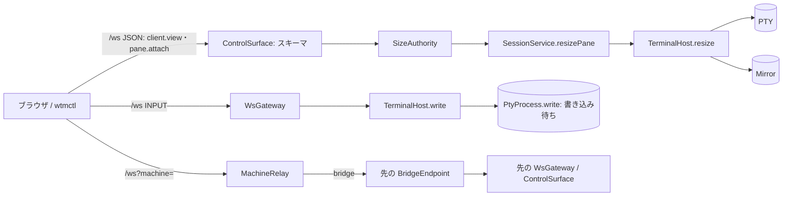

# 調査: サーバ側の大きさと入力の上限

主エージェントがコードと node-pty の同梱ソース・herdr のソース（`/workspaces/web-tn-multiplexer/scratchpad/herdr/src/`）を直読し、
node-pty の書き込み待ちだけは実物の PTY に 1 回ずつ書いて確かめた（`scratchpad/research/probe.cjs`。負荷試験ではない。1 回 1.3 秒・後始末済み）。
記述は変更前（main 52e244e）のスナップショット。

## 調査の問い

- Q1: `cols/rows` はどこで受け、どこで使われ、上限が無いと何が起きるか。
- Q2: INPUT フレームはどこで受け、PTY へどう書かれ、書けなかった分はどこに積まれるか。その量を測れるか。
- Q3: 中継（`/ws?machine=`）の手元と先で、大きさと入力はどう扱われるか。
- Q4: ほかの `/ws` の大きさの入力（popup・報告のトークン・kitty graphics・`scrollbackLines`・名前）の上限の有無。
- Q5: herdr は大きさと入力をどう絞っているか。
- Q6: 入力を捨てたことを送り手に知らせる経路は今あるか（ブラウザ・wtmctl）。

## 判明した事実

### 大きさ（Q1）

- F1: スキーマは正の整数だけを見る——`ClientViewParams.visible[].cols/rows`（`packages/protocol/src/messages.ts:42`）、
  `PaneAttachParams`（`:82-83`）、`PaneAttachResizeParams`（`:95-96`）。いずれも `z.number().int().positive()`。`visible` の件数も無制限（`:42` の `z.array`）。
  スキーマの失敗は `ControlSurface.invoke` が `invalid_params` で返し、ハンドラを呼ばない（`packages/server/src/surface/ControlSurface.ts:34-36`）。
- F2: 受けた値はそのまま `SessionService.resizePane` → `TerminalManager.resize` → `TerminalHost.resize` で PTY とミラーに入る
  （`packages/server/src/clients/SizeAuthority.ts:145`〔attach〕・`:154`〔resizeAttached〕・`:212`〔applyOwnerSize〕→
  `packages/server/src/session/SessionService.ts:1005-1012` → `packages/server/src/terminal/TerminalHost.ts:262-268`）。
  ミラーは headless の xterm で `term.resize(max(1,cols), max(1,rows))`（`packages/server/src/terminal/Mirror.ts:267-269`）。xterm は画面の行を
  resize のときに確保するので、`cols×rows` に比例したメモリがその場で要る。上限は無い。
- F3: SNAPSHOT のフレームは `cols/rows` を u16 で書く（`packages/protocol/src/frames.ts:45` の `setUint16`）。65536 以上は化ける。
  PTY の `ioctl(TIOCSWINSZ)` の `winsize` も unsigned short。
- F4: クライアント側: wtmctl の `pane control`/`observe` は 1〜1000（`packages/cli/src/sessionStream.ts:9` `MAX_STREAM_DIMENSION`・`cliArgs.ts:484`）。
  `wtmctl pane attach` は手元の端末の大きさを丸めずに送る（`packages/cli/src/commands/attach.ts:165-170`・`:235`）。
  ブラウザは要素の大きさ ÷ セルの大きさを下限 1 だけで送る（`packages/web/src/term/measure.ts:18-22`。呼ぶのは `term/ViewSync.ts:92` だけ）。
- F5: 復元は既定の大きさ（`HEADLESS_COLS/ROWS`）で作り直す（`SessionService.ts:299`・`:573`・`:1196`）。引き継ぎ（handoff）は前のプロセスの大きさを
  使う（`:1302-1308`）が、前のプロセスも同じスキーマを通った値しか持たない。分割は元の pane の大きさを写す（`:661`・`:733`）。

### 入力（Q2）

- F6: INPUT は `WsGateway` が受け、1 MiB を超えるフレームは捨てて `client.error`（`invalid_params`）を返し、10 秒 10 回で 1008 で閉じる
  （`packages/server/src/ws/WsGateway.ts:15`・`:104-123`・`:161-175`）。通ったフレームは `TerminalHost.write` → `PtyProcess.write`（`WsGateway.ts:119-122`）。
  `/ws` の 1 通の上限は 4 MiB（`packages/server/src/ws/WsServerWs.ts:16`）。
- F7: `TerminalHost` はモード付き入力（`writeModal`）の処理中に届いた入力を自前の `queue` に積む（`TerminalHost.ts:173-177`・`:226-243`）。上限は無い。
  モード付き入力を使うのは `agent.prompt`（`surface/methods/agent.ts:77`）・`agent.send_keys`（`:111`）・`AgentStarter`（`agent/AgentStarter.ts:111`）。
  エラーの写し方: prompt は RpcError 以外を `agent_prompt_failed`、send_keys は RpcError 以外を `agent_not_found` に写す（`agent.ts:88-91`・`:118-121`）——
  **RpcError はそのまま通す**。
- F8: node-pty（1.2.0-beta.15。`packages/server/package.json:21` で版を固定）の Unix の `write` は `CustomWriteStream` の `_writeQueue` に積み、
  `fs.write` で書き、`EAGAIN` なら `setImmediate` で書き直す（`node_modules/.pnpm/node-pty@1.2.0-beta.15/node_modules/node-pty/lib/unixTerminal.js:285-348`）。
  書き終わりを知らせる公開の API は無い。`UnixTerminal._writeStream._writeQueue` の各要素は `{ buffer, offset }`。
- F9: **実測**（`scratchpad/research/probe.out`・`probe-raw.out`）: 2 MiB を 1 回書き、
  - 子が `sleep`（端末は canonical のまま）: 300ms 後に 977,920 バイト待ち、1.3 秒後に 0。Linux の N_TTY は canonical で行が溢れると入力を捨てて受け取るので、
    待ちは自然に消える。
  - 子が `stty raw -echo; sleep`（読まない raw モード）: 300ms 後も 1.3 秒後も **2,081,792 バイト待ちのまま**（カーネルの受け口は約 16 KiB）。
    **その 1 秒間に node のプロセスは user 278ms + sys 543ms の CPU を使った**——`EAGAIN` の書き直しが `setImmediate` の輪で回り続けるため。
  - 子が終わった後、待ちに残った分の書き直しは `EBADF` で `Unhandled pty write error` を `console.error` に出して待ちを捨てた。
  つまり「読まない pane への書き込み待ち」は raw モードの読まないプログラム（固まった TUI・入力を読まないエージェント）で起き、量は `_writeQueue` から測れる。
- F10: 引き継いだ PTY（`AdoptedPtyProcess`）は自前の待ち行列 `queue: { buf, offset }[]` を持ち、`EAGAIN` は 5ms の `setTimeout` で書き直す
  （`packages/server/src/pty/AdoptedPtyProcess.ts:92`・`:139-172`）。量は正確に測れる。
- F11: Windows の node-pty は `_defer(_doWrite)` → `_agent.inSocket.write`（`net.Socket`）で書く（`windowsTerminal.js:119-124`・`windowsPtyAgent.js:86-99`）。
  待ちは `inSocket.writableLength` で測れる。ready の前の `_deferreds` は関数の包みでバイト数は取れない（起動直後の短い間だけ）。Windows の実機では確かめていない。
- F12: サーバが自分で PTY へ書くもの: ミラーの問い合わせへの応答（`TerminalHost.ts:134`・kitty graphics の応答 `:155-161`）・
  `SessionService.ts:1400`（独自コマンドの文字列＋改行）。どれも利用者の入力ではない。

### 中継（Q3）

- F13: 手元の中継（`relayToMachine`）は中身を解釈せず、ブラウザ → 先の送り待ちが 8 MiB（`RELAY_MAX_UPSTREAM_BYTES`）を超えたら 1013 で閉じる
  （`packages/server/src/machine/MachineRelay.ts:21`・`:85-100`）。RPC のスキーマは見ない。
- F14: 先のサーバは `BridgeEndpoint`（`WsServer` の実装）の各チャネルを**同じ `WsGateway`・同じ `ControlSurface`** に渡す
  （`packages/server/src/composeServer.ts:306`・`:311-312`）。つまりスキーマの上限と入力の判定は、先のサーバのコードに入れれば中継の先でも効く。
  先のチャネルは受けたフレームを同期で `WsGateway` に渡す（`BridgeEndpoint.ts:234-245`）ので、先で捨てれば先のメモリも増えない。
  先のサーバが古い版なら先には上限が無い（手元では防げない）。

### ほかの大きさの入力（Q4）

- F15: 上限済み: 独自コマンドの popup の大きさ 2〜500（`packages/protocol/src/commands.ts:24-25`・`messages.ts:527-528`）・報告のトークン
  （`METADATA_RAW_TEXT_MAX` 4096・`METADATA_TOKEN_ENTRIES_MAX` 256。`messages.ts:538-557`）・`agent.prompt` の本文 1 MiB（`messages.ts:452`・`:462`）・
  `agent.send_keys` の 256 個（`:473`）・`agent.start` の 1 行 4000 バイト（`packages/server/src/agent/agentStart.ts:10`・`AgentStarter.ts:80`）・
  kitty graphics は PTY の出力側で `DEFAULT_KITTY_LIMITS`（APC 16 MiB・画素 4,194,304・1 辺 8192 等。`packages/server/src/terminal/KittyGraphics.ts:52-62`）。
  中継の枠（`BRIDGE_LIMITS`。`machine/bridgeFrames.ts:26-36`）。
- F16: `pane.subscribe` の `scrollbackLines` は非負の整数だけ（`messages.ts:63`）だが、使い道は `SerializeAddon.serialize({ scrollback })`
  （`Mirror.ts:196-197`）で、ミラーの持つ行（設定の上限 10000。`packages/server/src/config.ts:12-13`・`:105-110`）より多くは作らない。大きな値の害は無い。
- F17: `pane.resize` の `amount`（`messages.ts:333`）は `setRatio` が 0.05〜0.95 に丸める（`packages/server/src/session/LayoutTree.ts:101-106`）。害は無い。
- F18: 名前（`workspace.rename`・`tab.rename`・`group.*`・`pane.rename`・`workspace.create`/`tab.create` の `label`）と `cwd`/`path` の文字列は
  長さの上限が無い（`messages.ts:137-138`・`:149`・`:180`・`:186`・`:210`・`:219`・`:253`）。上限は `/ws` の 1 通の 4 MiB だけ。名前は保存され、全クライアントへ配られる。
  **大きさ（端末）でも入力（PTY）でもない**が、「`/ws` から届く大きさ」の同類。

### herdr（Q5）

- F19: herdr はクライアントの画面の大きさを 1 辺 4096・面積 1,000,000 セルで断る（`src/server/client_transport.rs:49-50`・`:61-63`）。
  描画の差分の復号も 1 辺 4096・1,000,000 セル（`src/protocol/surface_delta/decode.rs:25-26`）。popup の大きさは 0〜65535（`src/popup_size.rs:132`）。
  入力は 1 通 1 MB（`client_transport.rs:48`）。
- F20: herdr の PTY への入力は、pane ごとの書き込み係（actor）への**上限 1024 件の待ち行列**（`src/pty/actor/unix.rs:19` `ACTOR_COMMAND_BUFFER`・`:388`）
  に `try_send` し、満杯なら**捨てて**エラーを返す（`:108-141`・`:161-172` の "pty input queue is full"）。API（`pane send` 等）は `pane_send_failed`
  （`src/app/api/panes.rs:1812-1814`・`:1838-1840`）、直結の貼り付けはログに warn（`src/server/headless.rs:1246-1248`）。**背圧で送り手を待たせる作りではない。**

### 知らせる経路（Q6）

- F21: `client.error` は `{ code, message }` のイベント（`packages/protocol/src/events.ts:114-117`）。ブラウザは code から日本語の文言を引いて toast に出す
  （`packages/web/src/net/clientError.ts:12-84`・`main.ts:103`）。表は `Record<ErrorCode, string>` で、**新しい code を足すと表に足さない限り型検査が落ちる**。
- F22: wtmctl は `client.error` を扱っていない（`packages/cli/src` に該当なし。`wsClient.ts:135-137` がイベントを受け手に配るだけ）。
  `pane control` の受け手は `onEvent`（`packages/cli/src/commands/sessionStream.ts:358-366`）。不正な行の警告は `warn`（`:405-408`。stderr の書き出し待ちが
  64 KiB を超えている間は捨てる）。`pane input`・`pane run` は INPUT を 1 通送って ok を出して終わる（`packages/cli/src/commands/pane.ts:55-71`）——知らせを待たない。

## 影響範囲

- protocol: `messages.ts`（スキーマ・定数）・`errors.ts`（エラーコード）・`events.ts`（`client.error` の data）。
- server: `WsGateway.ts`・`TerminalHost.ts`・`PtyBackend.ts`・`NodePtyBackend.ts`・`AdoptedPtyProcess.ts`・`surface/methods/agent.ts`・`agent/AgentStarter.ts`。
- web: `term/measure.ts`・`net/clientError.ts`。
- cli: `commands/sessionStream.ts`・`commands/attach.ts`。
- docs: `docs/wtmctl.md`・`docs/verification.md`（ブラウザの文言）。

## 実現性 / リスク

- 大きさ: スキーマに上限と面積の検査を足すだけで、ハンドラより前で断れる（F1）。zod 4 の `refine` で面積を見られる。
- 入力: 書き込み待ちの量は Unix の node-pty では**内部**（`_writeStream._writeQueue`）からしか測れない（F8）。版を固定しているので形は変わらないが、
  更新で形が変わると黙って測れなくなる——実物の node-pty で量が測れることを確かめる統合テストが要る（F9 の raw モードの子で 1 回）。
- node-pty の `EAGAIN` の書き直しは busy loop で、読まない raw モードの pane に 1 バイトでも待ちがあれば CPU を 1 コア近く使い続ける（F9）。
  上限は量を絞るが、この CPU の消費は変えない（量に比例しないため）。書き込みを自前（`AdoptedPtyProcess` と同じ 5ms の待ち）に替えるには
  node-pty が持つ fd の寿命（子の終了で閉じる・番号の再利用）と競合しない作りが要り、この work の範囲（量の上限）より大きい。
- 子の終了後に待ちの残りを書き直して `EBADF` になる（F9）——fd の番号が再利用されていれば別のファイルに書く恐れがある node-pty の既存の性質。上限は量を絞るだけ。

## 実装アンカー

- A1: 大きさのスキーマ（`packages/protocol/src/messages.ts:39-43` `ClientViewParams`・`:81-86` `PaneAttachParams`・`:94-98` `PaneAttachResizeParams`）。
- A2: スキーマの失敗の返し方（`packages/server/src/surface/ControlSurface.ts:34-36`）——変えない。
- A3: INPUT の受け口（`packages/server/src/ws/WsGateway.ts:100-123`）・不正なフレームの計数（`:161-175`）・接続の状態（`:23-28` `ConnState`）。
- A4: PTY の書き込み（`packages/server/src/pty/PtyBackend.ts:22-46` `PtyProcess`・`NodePtyBackend.ts:50-54`・`AdoptedPtyProcess.ts:127-172`）。
- A5: `TerminalHost.write`・`writeModal`・`runModal`・`drainQueue`（`packages/server/src/terminal/TerminalHost.ts:173-244`）。
- A6: エージェントのエラーの写し方（`packages/server/src/surface/methods/agent.ts:88-91`・`:118-121`・`agent/AgentStarter.ts:111-130`）。
- A7: エラーコード（`packages/protocol/src/errors.ts:2-52`）・`ClientErrorEvent`（`events.ts:114-117`）。
- A8: ブラウザの大きさの計算（`packages/web/src/term/measure.ts:18-22`）・文言の表（`packages/web/src/net/clientError.ts:12-84`）。
- A9: wtmctl の control のイベントと警告（`packages/cli/src/commands/sessionStream.ts:358-366`・`:405-408`）・attach の大きさ（`commands/attach.ts:165-170`・`:230-236`）。
- A10: 間引き（`packages/server/src/log/LogThrottle.ts` `LogThrottle.take`）。
- A11: 既存のテストの足場: `packages/server/src/ws/WsGateway.integration.test.ts`・`terminal/TerminalHost.test.ts`・`pty/NodePtyBackend.integration.test.ts`・
  `pty/AdoptedPtyProcess.test.ts`・`surface/methods/attach.test.ts`・`packages/protocol/src/*.test.ts`・`packages/web/src/term/*.test.ts`（未確認: measure の既存テストの有無は coding で見る）。

## 実装時の注意

- `ErrorCode` を足すと `clientError.ts` の表（`Record<ErrorCode, string>`）に足さない限り web の型検査が落ちる（F21）。
- `client.error` の data に項目を足すなら任意項目にする（既存の受け手は `code`/`message` だけを読む）。
- ミラーの応答（F12）は `pty.write` を直接呼んでいる——上限の判定を `PtyProcess.write` に入れると応答まで捨てる。判定は利用者の入力の経路だけに置く。
- node-pty の内部の形が無い（将来の版・テストの偽物）ときは測れない＝捨てない、に倒す（requirements の非機能要件）。
- テストで実物の PTY に書くときは raw モードの読まない子を使い、書いた後に必ず kill する（F9 の canonical の子では待ちが自然に消えて確かめにならない）。

## design への申し送り

- 背圧（送り手を待たせる）ではなく、herdr と同じ「上限を超えたら捨てて知らせる」を基本にする根拠: 1 本の `/ws` がブラウザの全 pane の入力と RPC を運ぶので、
  1 つの pane のために接続の読み取りを止めると他の pane と RPC まで止まる。中継の先では 1 本の ssh が全チャネルを運ぶ（F14）。herdr も捨てる（F20）。
- 値の候補: 1 辺 4096・面積 1,000,000 セル（herdr と同じ。F19）。書き込み待ちは 1 通の上限（1 MiB）の数倍〜十数倍。
- 後続に残す候補: node-pty の busy loop と `EBADF`（F9）・名前と `cwd` の文字列の長さ（F18）・`pane input`/`pane run` が知らせを待たない（F22）・先のサーバが古い版の中継（F14）。
