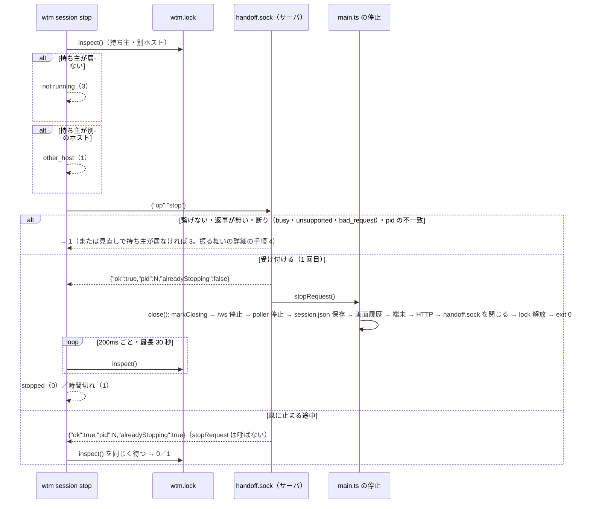

# 仕様: 名前付き session を CLI から止める（`wtm session stop`）

## 概要

動いている `wtm serve` の状態ディレクトリにある制御の socket（既存の `handoff.sock`。0600）に、1 行の `{"op":"stop"}` を足す。
サーバは受けたら自分の pid を返事してから、`main.ts` の終了のシグナルと同じ停止の手順（`composeServer.close()` を待って `process.exit(0)`）に入る。
CLI `wtm session stop <名前> [--state-dir D] [--json]` は、名前から状態ディレクトリを決め、`wtm.lock` の持ち主（このホスト）を確かめてから指示を送り、
返事の pid が持ち主と一致することを確かめ、持ち主が居なくなるまで（上限 30 秒）待って報告する。Windows では非対応（終了コード 2）。



## 設計方針

- **経路は既存の `handoff.sock` に操作を足す**（decisions D2）。名前は据え置き（新しい CLI と古いサーバの組で `wtm handoff` を壊さない）。
  モジュールの説明を「制御の socket（handoff・status・stop）」に改める。
- **停止の本体は `main.ts` の既存の停止の手順を使う**。停止の手順を `serveShutdown.ts` に切り出して単体テストできるようにし、
  終了のシグナルと止める指示の 2 つの入口を持たせる。止める指示は「既に止まる途中なら何もしない」（シグナルの 2 回目のように即座に終わらない）。
- **サーバ側の受け付けの判断は `ControlRequests`（新規 `handoff/controlRequests.ts`）に集める**: 引き継ぎの最中なら stop を断る・止まる途中なら handoff を断る・
  停止の入口が登録されていない（smoke・テストで `composeServer` だけを使う）なら stop を `unsupported` で断る。
- **制御の socket は停止の終わりまで開けておく**。`close()` で `handoff.sock` を閉じる位置を、`finally` の中の `wtm.lock` を放す直前へ移す——止まる途中に届いた 2 回目の `wtm session stop` が「既に止まる途中」の返事を受けて待てる（AC7）。
  止まる途中の handoff は `ControlRequests` が断る。
- **CLI は `wtm handoff` の CLI と同じ作り**（依存を差し替えられる `runSessionStop(base, name, json, io, deps)`。`askSocket` を再利用）。
  止まったかは `wtm.lock` の持ち主（`StateDirLock.inspect`）で見る（`wtm session list` と同じ根拠。socket への接続の可否では見ない——
  socket は古いサーバでも在り、止まったかの判定には使えない）。

## 対象範囲

- `packages/server/src/handoff/HandoffSocket.ts`：`stop` の操作・説明の改め。`HandoffRequestHandler` に `stop(reply)` を足す。
- `packages/server/src/handoff/controlRequests.ts`（新規）：`createControlRequests({ handoff, pid? })` と `StopReply` 型。
- `packages/server/src/composeServer.ts`：`ComposedServer.onStopRequest(fn)`・`closing` の印・`handoffSocket.close()` の位置。
- `packages/server/src/serveShutdown.ts`（新規）：停止の手順（シグナルと止める指示）。`main.ts` から使う。
- `packages/server/src/main.ts`：`serveShutdown` を使う・`onStopRequest` の登録・`session-stop` の分岐・ヘルプ。
- `packages/server/src/stop/stopCommand.ts`（新規）：`runSessionStop`。
- `packages/server/src/cliArgs.ts`：`wtm session stop <name>` の解釈・使い方。
- `packages/server/src/persist/namedSession.ts`：`deleteSession` の「動いている」の案内。`packages/server/src/config.ts`：`stateDirInUseError`（token-reset）の案内。
- `packages/server/src/stopSmoke.ts`（新規）と `.aidev/config.yml` の `smokeCommands` の 7 本目。
- テスト: `HandoffSocket.test.ts`・`controlRequests.test.ts`・`serveShutdown.test.ts`・`stop/stopCommand.test.ts`・`cliArgs.test.ts`・`sessionCommands.test.ts`・
  `composeServer.stop.integration.test.ts`（新規）。
- docs: `docs/herdr-parity.md` H33・`docs/verification.md`・`docs/tls-setup.md`（名前付き session の節の止め方）。

## 依拠する既存の事実

- Ctrl+C の停止は `main.ts` の `shutdown(signal)`：token の表示 → 2 回目なら `process.exit(1)` → `startup` を待つ → `server.close()` → `process.exit(0)`／失敗で 1
  （`packages/server/src/main.ts` の `runServe` 内 `shutdown`）。
- `composeServer.close()` は `/ws` 停止 → `agentReportSocket`・`handoffSocket` を閉じる → poller 停止 → `persist.flush()` → 画面履歴の保存 → 端末の破棄 →
  WS を閉じ HTTP を閉じる → `finally` でスクロールバックの一時ディレクトリとロックの解放（`composeServer.ts` の `close()`）。
- 制御の socket は `listen()` の 4.5 で復元と poller の後に立ち（`platform() !== "win32"` のときだけ）、0600 に chmod できなければ置かない
  （`composeServer.ts` の `listen()`・`HandoffSocket.ts` の `startHandoffSocket`）。未知の op には `{"ok":false,"reason":"bad_request",…}` を返す（`HandoffSocket.ts` の `handleLine`）。
  → `stop` を知らない古い版は `bad_request` を返す。
- `net.Server.close()` は既存の接続が終わるまでコールバックを呼ばない（Node.js の `net` の文書による。コードでは未確認——既存の `HandoffSocket.close()` もこれに依っている）。`handleLine` は処理の後に `sock.end()` し、CLI の `askSocket` は 1 行を読んだら `destroy()` する
  （`HandoffSocket.ts`・`handoff/handoffCommand.ts` の `askSocket`）。
- `HandoffController` は引き継ぎの最中を `private busy` で持つ（外から読めない。`HandoffController.ts`）。成功した引き継ぎは execve で戻らない。
- `StateDirLock.inspect()` は、持ち主が居ない・生きていない・中身を読めないなら `undefined`、別のホストなら `otherHost` を返し、何も作らない（`persist/StateDirLock.ts`）。
- `resolveSessionStateDir(base, name)` は `default`・無しで `base`、規則外は `ConfigError`（`persist/namedSession.ts`）。`findExactEntry` は綴りの違いを `spelling` で断る（同）。
- `wtm handoff` は動いていなければ終了コード 3（`HANDOFF_EXIT_NOT_RUNNING`）、別ホストで 1、Windows は `ConfigError`（2）（`handoff/handoffCommand.ts`）。
- `wtm session delete` の `--json` の失敗の形は `{"error":{"code","message"}}`（`sessionCommands.ts` の `runSessionDelete`）。
- `parseSessionCommand` は `list`・`delete <name>` だけを受け、使えるオプションは `--state-dir`・`--json`（`cliArgs.ts`）。
- `HandoffFailureReason` には既に `busy`・`unsupported` がある（`handoff/HandoffController.ts`）。`askSocket(socketPath, line, timeoutMs)` は時間切れを
  code `ETIMEDOUT`、答える前に閉じられたら `ECONNRESET` で投げる（`handoff/handoffCommand.ts`）。
- `runSessionDelete` の `--json` の失敗は `io.err`（標準エラー）、成功は `io.out`（`sessionCommands.ts`）。`printHelp` は `main.ts`、`USAGE` は `cliArgs.ts`、
  `showTokenIfUnshown` は `main.ts` の `runServe` の中の関数、`paneHistory?.save({ force: true })` は `composeServer.ts` の `close()`。
- 起動確認は `.aidev/config.yml` の `smokeCommands` に今 6 本ある（6 本目が `handoffSmoke.js`）。
- `wtm session delete` の「動いている」の案内の文言は `persist/namedSession.ts` の `deleteSession`（`SessionDeleteError("running", …)`）、
  `wtm token reset` の案内は `config.ts` の `stateDirInUseError` の `token-reset` の分岐にある。
- herdr の `session stop` の形（名前必須・`default`・待つ上限 15 秒・`stopped session <name>`・`{"stopped":true,"session":…}`）は decisions D1 の一次資料。

## インターフェース / データ構造

### 制御の socket の `stop`

- 要求: `{"op":"stop"}\n`
- 返事（1 行）:
  - `{"ok":true,"pid":<number>,"alreadyStopping":<boolean>}`
  - `{"ok":false,"reason":"busy","message":"a handoff is in progress"}`（引き継ぎの最中）
  - `{"ok":false,"reason":"unsupported","message":"this server does not accept stop requests"}`（停止の入口が無い）
- `handoff` の返事に足す断り: 止まる途中なら `{"ok":false,"reason":"stopping","message":"the server is stopping"}`（`HandoffFailureReason` に `stopping` を足す。decisions D10——`wtm handoff` はこのとき「動き続ける」と言わない）。

```ts
// handoff/controlRequests.ts
export type StopReply =
  | { ok: true; pid: number; alreadyStopping: boolean }
  | { ok: false; reason: "busy" | "unsupported"; message: string };
export interface ControlRequestsDeps {
  handoff: { request(reply): Promise<void>; status(): HandoffStatus; readonly isBusy: boolean };
  pid?: number;
}
export interface ControlRequests extends HandoffRequestHandler {
  setStopHandler(fn: () => void): void;
  beginClosing(): Promise<void>; // close() の最初に await する（印は同期で立ち、受け付け済みの引き継ぎの終わりを待つ。decisions D9）
  readonly isClosing: boolean;
}
export function createControlRequests(deps): ControlRequests;
```

- `stop(reply)`: 引き継ぎの最中 → busy。止まる途中（`markClosing` 済み or 既に stop を受けた）→ `{ok:true, alreadyStopping:true}`（handler は呼ばない）。
  handler 無し → unsupported。それ以外 → 印を立て、`{ok:true, alreadyStopping:false}` を返してから handler を呼ぶ（返事の失敗でも呼ぶ）。
- `request(reply)`（handoff）: 止まる途中なら stopping、それ以外は `HandoffController.request`。
- `HandoffController` に `get isBusy(): boolean` を足す。

### `ComposedServer`

```ts
/** 制御の socket の stop を受けたときに呼ぶ（main.ts が停止の手順を渡す。登録しなければ stop は unsupported）。 */
onStopRequest(fn: () => void): void;
```

### `serveShutdown.ts`

```ts
export interface ShutdownDeps {
  close(): Promise<void>;
  startup(): Promise<void> | undefined;
  showTokenIfUnshown(): void;     // token の表示
  log(line: string): void; error(line: string, err?: unknown): void;
  exit(code: number): void;
}
export function createShutdown(deps): { signal(s: NodeJS.Signals): void; stopRequest(): void; readonly shuttingDown: boolean };
```
- `signal(s)`: 既存のまま（2 回目は `wtm: received <s> again, exiting without waiting` で exit(1)）。**止める指示で始まった停止も「1 回目」として数える**——
  止める指示の後のシグナルは 2 回目の扱いで即座に終わる（decisions D6）。
- `stopRequest()`: 止まる途中なら何もしない。そうでなければ `wtm: stop requested (wtm session stop), shutting down` を出してシグナルと同じ手順。

### CLI

- `wtm session stop <name> [--state-dir D] [--json]`。`ParsedArgs.command` に `"session-stop"`、名前は `sessionTarget`。
- `runSessionStop(base, name, json, io, deps = defaultSessionStopDeps()): Promise<number>`（`stop/stopCommand.ts`）。
  - 依存: `platform`・`ask(socketPath, line, timeoutMs)`（既定 `askSocket`）・`inspect(dir)`・`sleep`・`now`・`waitTimeoutMs`（既定 30000）・`replyTimeoutMs`（既定 5000）。
- 終了コード: 0 止まった／1 断られた・繋げない・pid の不一致・時間切れ・別ホスト／2 `ConfigError`（名前・Windows）／3 動いていない（`SESSION_STOP_EXIT_NOT_RUNNING = 3`）。
- 出力（テキスト）: 成功 `wtm: stopped session <name>`（標準出力）。失敗は `wtm: …`（標準エラー）。
- 出力（`--json`、1 行）: 成功 `{"stopped":true,"session":{"name","default","stateDir","pid"}}`（標準出力）。失敗 `{"error":{"code":<code>,"message":<text>}}`（標準エラー。
  code は `not_running`・`other_host`・`unreachable`・`refused_busy`・`refused_unsupported`・`older_server`・`pid_mismatch`・`timeout`・`bad_reply`）。
  code の続き: `unsupported_platform`（Windows）・`invalid_name`（規則外）・`no_such_session`（無い）・`spelling`（綴り違い）・`not_directory`——これらは
  `--json` のとき `runSessionStop` が JSON を出して 2 を返す（テキストのときは `ConfigError` を投げ、`main` が案内つきで 2）。
  もう 1 つ、終了コード 1 の群に `no_reply`（返事の時間切れ）。
  **引数の解釈の誤り**（名前が無い・未知のオプション）は、どのコマンドとも同じく `cliArgs` の `ConfigError` のテキストで 2（`--json` の対象外。requirements AC10 の注記）。

## 振る舞いの詳細

CLI `runSessionStop`:
1. `platform === "win32"` → `ConfigError`（「wtm session stop は Linux と macOS だけで使えます。Windows では起動した窓で Ctrl+C」）。
2. `dir = resolveSessionStateDir(base, name)`（規則外は `ConfigError`）。名前付きなら `sessions/` の実エントリを `findExactEntry` で探す——
   無ければ `ConfigError`（`no such session`）、綴り違いも `ConfigError`、ディレクトリでなければ `ConfigError`。**何も作らない**。
3. `holder = inspect(dir)`。`undefined` → `session <name> is not running`（3）。`otherHost` → 案内（1）。
4. `ask(socket, '{"op":"stop"}', replyTimeoutMs)`。
   - 返事が `replyTimeoutMs` の内に来ない（`askSocket` が code `ETIMEDOUT` で投げる）→ 見直しをせず `no_reply`（1。下の行）。
   - それ以外で投げた（ENOENT・ECONNREFUSED・ECONNRESET 等）: `inspect` を見直し、持ち主が居なければ not running（3）。pid が替わっていれば（止まり終えた後に別の `wtm serve` がロックを取った）
     `changed while stopping (pid N → M)`（1。code `unreachable`。decisions D10 の review ラウンド 1）。同じ pid が居れば
     `the running server (pid N) did not accept a stop request (an older version, still starting, or already stopping): <socket>; if it keeps running, stop it with Ctrl+C in its terminal. If pid N is not wtm (…), remove <dir>/wtm.lock`（1。code `unreachable`）。
   - `no_reply` の案内: サーバは止まりはじめているかもしれないので「`wtm session list` で確かめる」。
   - 返事が JSON でない・形が違う・未知の `reason` → `bad_reply`（1）。
   - `ok:false, reason:"bad_request"`（古い版）→ `older_server`（1。Ctrl+C を案内）。`busy` → `refused_busy`（1。「引き継ぎが終わってからもう一度」）。
     `unsupported` → `refused_unsupported`（1）。
   - `ok:true` で `pid !== holder.pid` → `pid_mismatch`（1。止まったとは言わない）。
5. `ok:true`: 「wtm: stopping session <name> (pid N)…」は出さない（出力は結果の 1 行だけ）。`now()+waitTimeoutMs` まで 200ms ごとに `inspect(dir)`、
   `undefined` か `pid` が違えば止まった → 成功（0）。時間切れ → `timeout`（1。`the server (pid N) accepted the stop request but has not exited within <waitTimeoutMs を秒に丸めた値>s; check server.log in <dir>`）。

サーバ:
- `composeServer` は `createControlRequests({ handoff })` を作り、`startHandoffSocket` に渡す。`onStopRequest(fn)` は `setStopHandler(fn)`。
- `close()` の最初に `control.markClosing()`。`handoffSocket.close()` は `finally` の中、スクロールバックの一時ディレクトリの後・`lock.release()` の直前へ移す
  （途中で投げても閉じる）。`HandoffSocket.close()` は既存の接続の終わりを待つので、止まる途中に繋いだ CLI が返事を読んで切るまで待つ（CLI は 1 行で切る）。
- `main.ts`: `const stopper = createShutdown({...})`、`process.on(signal, () => stopper.signal(signal))`、`server.onStopRequest(() => stopper.stopRequest())`。
- 止める指示は `listen()` の 4.5 より前には届かない（socket がまだ無い）。起動の途中の終了は範囲外。

## ドメイン固有の考慮

- 同じ利用者に限る根拠は、既存の socket と同じく 0600 と状態ディレクトリの中にあること。新しい口は作らない（AC4）。
- pid へのシグナルは使わない。返事の pid と `wtm.lock` の持ち主の一致で、socket の相手がその session のサーバであることを確かめる。
- 自分のいる session を pane の中から止めると、CLI も pane ごと終わるので結果の行が出ないことがある（docs に書く）。

## エラー処理 / 異常系

- 返事を書けなかった（CLI が先に切った）: サーバは止める（返事の失敗で handler を呼ばない、にはしない——指示は受けた）。
- 停止の手順の失敗: 既存どおり `wtm: error during shutdown` と exit(1)。ロックは `close()` の `finally` で放すので CLI は止まったとみなせる。
- 同時に 2 本の stop: 1 本目が handler を呼び、2 本目は `alreadyStopping:true`。どちらの CLI も lock を見て 0。
- stop の後に Ctrl+C: 既存どおり 2 回目のシグナルとして即座に exit(1)（人の意思を優先）。正常な停止は打ち切られるが、プロセスは終わるので CLI は
  `wtm.lock` の持ち主が居なくなったのを見て「止まった」（0）と報告する——CLI の「止まった」は「プロセスが終わった」の意味で、停止の手順の成否は
  サーバの端末・`server.log` に出る（停止の手順が投げた場合と同じ）。AC1 の「Ctrl+C と同じ停止」は人が割り込まない場合の約束。

## 受け入れ基準との対応

- AC1: CLI の手順 3〜5 と `serveShutdown.stopRequest` → `close()`。入力は利用者の名前（引数）と `wtm.lock`。確かめは結合テスト（`composeServer` で実物の socket に stop → handler 呼ばれる・close で session.json）と smoke（AC16 の手順。起動し直してレイアウトと画面履歴が戻ることまで）。画面履歴の保存は既存の `close()`（`paneHistory.save({force:true})`）で、経路が同じことを `serveShutdown` のテストで確かめる。
- AC2: 手順 3 の `inspect` が `undefined` → 3。何も作らないことを単体テスト（一時ディレクトリの中身が変わらない）で確かめる。
- AC3: 手順 2（`resolveSessionStateDir`・`findExactEntry`）と `cliArgs` の名前必須。
- AC4: 経路は `handoff.sock` だけ（`controlRequests` と `HandoffSocket`）、CLI は `ask`・`inspect` だけを使う（シグナルの依存を持たない）。pid の不一致は手順 4。
- AC5: サーバ側は `controlRequests.stop` の busy と `request` の stopping、CLI 側は手順 4 の `refused_busy`（1・理由の文言）。単体テスト。
- AC6: 手順 4 の接続の失敗・`bad_request`。単体テスト。
- AC7: `serveShutdown.stopRequest` の冪等、`controlRequests` の `alreadyStopping`、`handoffSocket.close()` の移動。結合テストで「close の途中に stop → alreadyStopping」を確かめる。
- AC8: 手順 5 の時間切れ。単体テスト（`now`・`sleep` を差し替え）。
- AC9: 手順 3 の `otherHost`。
- AC10: `--json` の出力。単体テスト。
- AC11: 手順 1。
- AC12: 手順 1（`unsupported_platform`）・手順 2（名前の誤り系）・手順 3〜5 の各分岐で別の文言・code。
- AC13: `deleteSession` の running の文言、`stateDirInUseError` の token-reset の文言に `wtm session stop <name>` を足す（名前は既定なら `default`）。入力は
  それぞれが既に持つ session の名前（`deleteSession` の引数・`runTokenReset` の `session`）。
- AC14: `main.ts` の `printHelp`・`cliArgs` の `USAGE`・docs 3 本。`herdr-parity.md` H33：⑤を「`wtm session stop <名前> [--json]`（20260927-session-stop）」に改め、
  herdr との違い（経路は制御の socket `handoff.sock` の `stop`・止まったかは `wtm.lock` で見る・待つ上限 30 秒〔herdr 15 秒〕・動いていないは終了コード 3〔herdr 1〕・
  Windows は非対応・macOS は未検証）を書く。`verification.md`：名前付き session の項の「止めるコマンドは無い」を改め、Linux の手動確認の手順を足す。
  `tls-setup.md`：名前付き session の節の止め方（pane の中から自分の session を止めると結果の行が出ないことがある、を含む）。
- AC15: 既存のテスト（`HandoffSocket.test`・`handoffCommand.test`・`composeServer*.test`・`sessionCommands.test`・`cliArgs.test`）がそのまま通る。
  Ctrl+C の経路で変わるのは、止まる途中にも制御の socket が開いていることだけ（保存の順序・終了コードは同じ）。止まる途中に届いた handoff を断るのは AC5 の
  求める変化で、止まる途中の `wtm handoff` は以前は「繋げない」で 1、今は「stopping」で 1——どちらも引き継ぎは起きない（decisions D4・D10）。
- AC16: `stopSmoke.ts` を smoke の 7 本目に足す。手順: `sessions/smoke` を作っておき（名前付き session の実エントリ。手順 2 を通すため）、動いていない
  `session stop smoke` → 3 で `sessions/smoke` の中に何も作らない → `serve --session smoke --pane-history --shell /bin/sh`（空きポート）を子で起動 → ログインして
  `/ws` で pane に `echo` の印を打ち出力を待つ → `session stop smoke` が 0 と `stopped session smoke` → 子が終了コード 0 で終わっている・`session list` が stopped・
  `wtm.lock` が無い・`session.json` と `session-history.json` がある → もう一度 `session stop smoke` が 3 → 同じ引数で起動し直し、同じ pane の id が在り、
  その pane の画面（SNAPSHOT/OUTPUT）に前回の印が出る（レイアウトと画面履歴が戻る）→ SIGTERM で止める。Windows では何もせず成功。