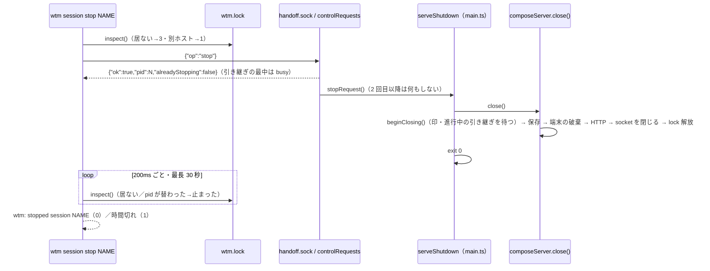

# レビューガイド: `wtm session stop`（herdr H33 の残り）

## 変更概要 / 目的

動いている `wtm serve`（既定・名前付きの session）を、起動した端末に触れずに `wtm session stop <名前>` で止められるようにした。
止め方は Ctrl+C と同じ正常な停止（`session.json`・画面履歴の保存、pane のプロセスの終了、`wtm.lock` の解放）。
止める指示は既存の制御の socket `handoff.sock`（状態ディレクトリの中・0600）に `{"op":"stop"}` を足して送る——新しい TCP の待ち受けは作らず、
pid へのシグナルも送らない（pid の再利用で無関係なプロセスを止めない）。Windows は非対応（decisions D2）。

## 重要ポイント

- **経路の選択**（decisions D2）: socket の名前は `handoff.sock` のまま（新しい CLI が古いサーバへ `wtm handoff` する更新の場面を壊さない）。
  認証つき HTTP・pid へのシグナル・Windows の名前付きパイプを退けた理由は D2。
- **同一性の確かめ**: CLI は返事の pid と `wtm.lock` の持ち主の pid の一致を確かめ、止まったかは socket ではなく `wtm.lock` の持ち主が居なくなるかで見る
  （`packages/server/src/stop/stopCommand.ts`）。
- **停止の手順の共有**（D4・D6）: `main.ts` の停止の手順を `serveShutdown.ts` に切り出し、シグナルと止める指示の 2 つの入口にした。止める指示は冪等、
  止める指示の後のシグナルは従来どおり「2 回目」で即座に終わる。
- **`close()` の順序の変更**（D4・D9）: 制御の socket を閉じるのを最初から `lock.release()` の直前へ移した（止まる途中の 2 回目の stop が
  `alreadyStopping` を受けて待てる）。その代わり、以前は暗に保たれていた「進行中の引き継ぎが終わるまで停止の本体を始めない」を
  `beginClosing()` → `HandoffController.waitIdle()` で明示した（cross の点検で見つかった退行の修正）。
- **止まる途中の引き継ぎ**（D10）: 新しい reason `stopping` で断る。`wtm handoff` はそのとき「動き続ける」と言わない。

## 処理フロー

## 主要な変更箇所

- `packages/server/src/handoff/HandoffSocket.ts` — `stop` の op と `StopReply` 型（D8）。
- `packages/server/src/handoff/controlRequests.ts` — 受け付けの判断（busy・unsupported・alreadyStopping・止まる途中の handoff の断り・`beginClosing`）。
- `packages/server/src/handoff/HandoffController.ts` — `isBusy`・`waitIdle`・reason `stopping`。
- `packages/server/src/composeServer.ts` — `onStopRequest`・`close()` の最初の `await control.beginClosing()`・socket を閉じる位置・テスト用の `internal.handoffPreflight`。
- `packages/server/src/serveShutdown.ts`・`main.ts` — 停止の手順の切り出しと `server.onStopRequest(() => stopper.stopRequest())`。
- `packages/server/src/stop/stopCommand.ts` — CLI（終了コード 0/1/2/3・`--json` の code）。
- `packages/server/src/cliArgs.ts` — `wtm session stop <name>`（名前は必須・`WTM_SESSION` は見ない。D3）。
- `packages/server/src/persist/namedSession.ts`・`config.ts`・`sessionCommands.ts` — delete・token reset の「動いている」の案内に `wtm session stop`（`--state-dir` つき。Windows では出さない）。
- `packages/server/src/stopSmoke.ts`・`.aidev/config.yml` — 起動確認の 7 本目。

## リスク / 確認したい点

- 制御の socket の接続に期限が無い（既存）。1 行も送らずに繋ぎっぱなしにする同じ利用者のプロセスがあると、停止が最後の socket の close で待たされる。
  socket を閉じる位置を後ろへ移したので、起こりうる区間は停止の全体に広がった（D4 の影響。backlog に残した）。
- 引き継ぎの最中に受けた Ctrl+C は、execve が成功すると失われる（以前と同じ。D9）。
- Windows は非対応、macOS は未検証。
