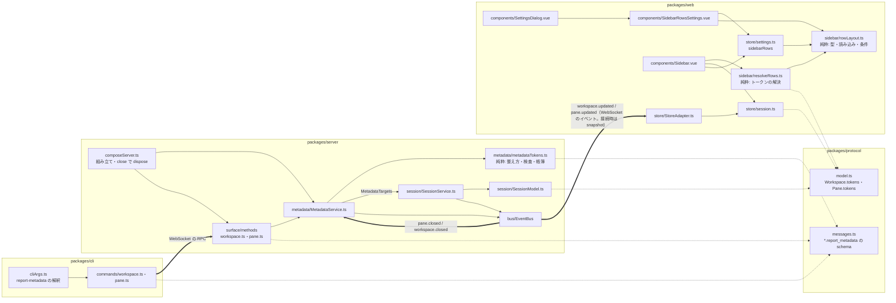
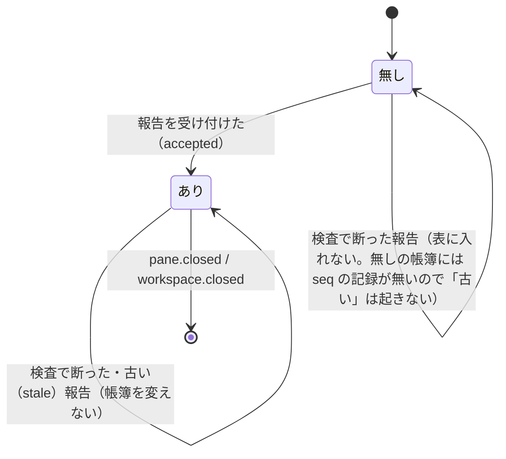

# 設計: サイドバー行の独自トークンと、行の並び・色の条件付け（構造）

挟んだ理由: `protocol.md`「4.5」の「インターフェース／データモデルが複雑」（RPC の新しい形・model の項目・帳簿の状態・並びの設定のスキーマと条件の規則）と
「モジュール間の境界を動かす」（サーバに bus を購読して session へ書き戻す新しい部品が入る。web は描画と設定画面が同じ純関数を共有する）に当たる（decisions D1）。
型・関数の詳細は design.md。ここは部品の境界・依存の向き・データの流れだけを決める。

## アーキテクチャ概要

凡例: 実線の矢印＝依存（呼ぶ側 → 呼ばれる側）、点線の矢印＝型だけの依存、`==>`＝イベント・データの流れ（依存ではない）。

## コンポーネント / モジュール

- `metadata/metadataTokens.ts`（server・新規・純粋）: herdr の規則そのもの（整え方・検査・`MetadataTokenBook`）。時計は引数で受ける。**依存は protocol の
  `RpcError` だけ**（session・bus・タイマーを知らない）。
- `metadata/MetadataService.ts`（server・新規）: 対象ごとの帳簿の表・検査の順・1 つのタイマー・bus の購読（閉じた対象の破棄）。session へは `MetadataTargets`
  （4 つの関数の口）越しにだけ書く——`SessionService` 全体に依存しない（テストで偽物に差し替えられる）。
- `SessionService`/`SessionModel`（server・既存）: `tokens` の反映と `workspace.updated`・`pane.updated` の配布だけを足す。帳簿・検査は持たない。
  **依存の向きは `MetadataService → SessionService`（口越し）の一方向**で、`SessionService` は `MetadataService` を知らない（閉じたときの破棄は bus 経由）。
- `surface/methods/workspace.ts`・`pane.ts`（server・既存）: 登録だけ。`MethodDeps.metadata` があれば登録する（`agentStarter` と同じ任意の依存）。
- `composeServer.ts`（server・既存）: `MetadataService` を作って渡し、`close()` で `dispose()`。
- `cliArgs.ts`・`commands/*`（cli・既存）: 解釈と RPC の呼び出し。サーバの規則（80 文字・文字種）は CLI で重ねて検査しない（二重の規則がずれないよう、サーバだけが持つ。
  CLI が見るのは herdr の CLI と同じ「形」の誤り——`NAME=VALUE` の形・`--source` の有無・整数——だけ）。
- `sidebar/rowLayout.ts`（web・新規・純粋）: 並びの型・既定・読み込み・検証（色・名前）・条件の当たり方。**描画（`resolveRows.ts`）と設定画面（`SidebarRowsSettings.vue`）と
  store（`settings.ts`）が共有する唯一の規則の置き場**。
- `sidebar/resolveRows.ts`（web・新規・純粋）: model（`Workspace`・`Pane`・`AgentInfo`）と並びから、描く行（`ResolvedLine[]`）を作る。Vue を知らない。
- `Sidebar.vue`（web・既存）: `ResolvedLine[]` を今の DOM の形で描くだけ。値の意味・条件は持たない。
- `SidebarRowsSettings.vue`（web・新規）: 並びの編集。保存は store の `setSidebarLayout` だけ。`SettingsDialog.vue` は置くだけ（節「表示」の 1 項目）。

## インターフェース / データモデル

- 境界をまたぐ形は 3 つ: (1) RPC の params（`{workspaceId|paneId, source, tokens: {name, value|null}[], seq?, ttlMs?}`）、(2) model の `tokens?: Record<string, string>`
  （サーバ → 全クライアント。snapshot と既存のイベント）、(3) `wtm.prefs.v1` の `sidebarRows`（ブラウザの中だけ）。
- (2) と (3) は交わらない: サーバは並びを知らず、ブラウザは値の整え方を知らない（受けた値をそのまま描く。長さの上限はサーバが守る）。
- 帳簿の状態（対象ごと）:

## 処理フロー / シーケンス

- 報告: design.md「振る舞いの詳細 › 独自トークンの報告」の図。変わったときだけ `SessionService` へ書き、`SessionService` が publish する（配布の経路は既存の 1 本）。
- 期限: `MetadataService` の 1 つのタイマーが発火 → 全帳簿を掃く → 変わった対象だけ `SessionService` へ書く → 次の締め切りへ掛け直す。
- 描画: `StoreAdapter` が `workspace.updated`・`pane.updated` で model を置き換える → `Sidebar.vue` の computed が `resolveRows` を呼び直す。並びの変更（設定画面・
  ほかのウィンドウ・`reloadConfig`）も `settings.sidebarRows` の変化で同じ computed を呼び直す。

## 設計判断

- **純粋な規則と、時計・タイマー・配布を分ける**（server・web とも）。規則は herdr の一次資料に 1:1 で対応させて単体テストで網羅し、配線は偽物で確かめる。
  代替案（`SessionService` に帳簿を持たせる）は、1400 行を超える `SessionService`（`packages/server/src/session/SessionService.ts`。main 97affb8 で `wc -l` が 1419） に期限のタイマーを足し、テストに本物の session が要る。
- **閉じたときの破棄は bus の購読**。`SessionService` の閉じる経路は複数（pane・tab・workspace・置き換え・worktree の削除）で、各所から `MetadataService` を呼ぶと
  1 つ漏れたときに帳簿が残る。bus の `pane.closed`・`workspace.closed` はどの経路でも出る（design「依拠する既存の事実」）。
- **並びの規則は web の 1 モジュール**。描画と設定画面が別々に「使えるトークン」「文字の値か」を持つと、片方だけ更新されて設定画面で選べるのに描かれないトークンが生まれる。

## tasks への申し送り

- 分割の単位: protocol（型・schema）→ server の純粋な規則 → server の配線（`MetadataService`・session・登録・組み立て）→ cli → web の純粋な規則（`rowLayout`・`resolveRows`）
  → store → `Sidebar.vue` → 設定画面の部品 → docs・smoke。protocol が先（他がすべて依存）。web の純粋な規則は server と独立に進められる。
- `Sidebar.vue` を変える前に golden（`packages/web/src/components/__golden__/`）があること（変更前の描画で取ってある。design AC10）。
