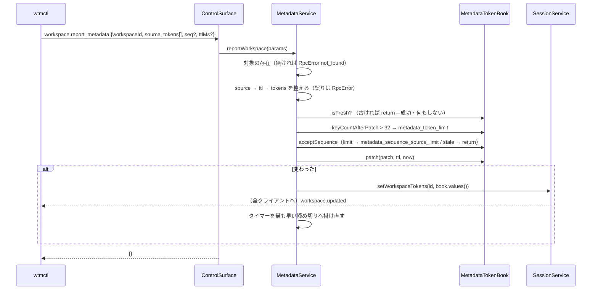

# 仕様: サイドバー行の独自トークンと、行の並び・色の条件付け

## 概要

2 つの独立した部分からなる。

1. **独自トークン（サーバ・CLI）**: RPC `workspace.report_metadata`・`pane.report_metadata` をサーバに足し、herdr と同じ規則で整えた値を
   対象ごとの帳簿（`MetadataTokenBook`）に持つ。値が変わったら `Workspace.tokens`・`Pane.tokens` を model に反映し、既存の
   `workspace.updated`・`pane.updated` で全クライアントへ配る。期限は 1 つのタイマーで掃く。`wtmctl workspace|pane report-metadata` がこの RPC を呼ぶ。
2. **行の並び（web）**: 設定 `sidebarRows`（`wtm.prefs.v1`。spaces・agents それぞれ、既定なら無い）を純関数で読み、サイドバーの行の各トークンを値・見た目・条件から
   解決して描く。既定の並びは本製品独自のトークン（`git`・`name`・`unverified`）で今の描画と同じ形に書く（decisions D3）。設定画面の節「表示」に
   並びの編集の部品（`SidebarRowsSettings.vue`）を足す。

## 設計方針

- **既定も利用者の並びも同じ描画の経路**（decisions D3）。既定の並びを解決した結果が今の DOM と同じになるよう、トークンの種類ごとの DOM（クラス・要素）を
  今の `Sidebar.vue` から写す。変更前の描画を golden として取っておき、変更後と比べる（AC10）。
- **サーバの帳簿は純粋な部分と、時計・タイマー・配布の部分に分ける**（research の申し送り）。`metadataTokens.ts`（整え方・検査・反映・期限の計算。時計を引数で受ける）を
  単体テストで網羅し、`MetadataService.ts`（対象ごとの帳簿の表・タイマー・bus の購読・session への反映）は偽の時計と偽の session で確かめる。
- **RPC の `tokens` は `{name, value}` の配列**で受ける（herdr は map）。JSON のオブジェクトで受けると、キー `__proto__` が zod の組み立て（`obj[key] = …`）で
  プロトタイプの差し替えになり、キーが消える・形が壊れる（本 worktree の zod 4.6.5 で `z.record(z.string(), z.string().nullable()).parse(JSON.parse('{"__proto__":"x","a":"1"}'))`
  のキーが `['a']` だけになることを確かめた。decisions D7）。配列なら順（後が勝つ）も明示できる。CLI は herdr と同じ形（`--token NAME=VALUE`）なので利用者から見た違いは無い。
- **ブラウザでの値の引き方は自前の持ち物だけ**（`Object.hasOwn`）。`tokens["constructor"]` のように、報告されていない名前がプロトタイプの関数を返して
  文字として出ることを防ぐ。サーバも値の表は `Object.fromEntries`（定義で入れる）で作る。
- **値はテキストの差し込み（`{{ }}`）だけで描く**。`v-html` を使わない。`style` へ入れるのは検証済みの色（`#RGB`/`#RRGGBB`）と固定の値（太字・不透明度）だけ。
- 設定画面の部品は既存の tab バー右端の編集（research F31）と同じ形: 項目ごとの［上へ］［下へ］［削除］、末尾の［追加］、選んだ時点で保存、上限で［追加］を無効化。
  トークンの見た目と条件は［詳細］（`aria-expanded` のボタン。research F34）で開閉。［既定に戻す］はその場の確認（F32）。

## 対象範囲

- protocol: `packages/protocol/src/model.ts`（`Workspace.tokens`・`Pane.tokens`）・`messages.ts`（2 つの RPC の schema・結果・上限の定数）。
- server: 新規 `packages/server/src/metadata/metadataTokens.ts`・`MetadataService.ts`（＋テスト）。`session/SessionModel.ts`・`session/SessionService.ts`
  （`setWorkspaceTokens`・`setPaneTokens`）。`surface/methods/deps.ts`・`workspace.ts`・`pane.ts`（登録）。`composeServer.ts`（組み立て・終了）。
- cli: `cliArgs.ts`（解釈・`USAGE_LINES`）・`commands/workspace.ts`・`commands/pane.ts`・`main.ts`（振り分け・help の注記）・`skills/wtmctl/SKILL.md`・`smoke.ts`。
- web: 新規 `packages/web/src/sidebar/rowLayout.ts`（設定の型・読み込み・検証・条件）・`sidebar/resolveRows.ts`（トークンの解決）・
  `components/SidebarRowsSettings.vue`（編集の部品）（＋テスト）。`store/settings.ts`（`sidebarRows`）・`actions/ActionDispatcher.ts`（`reloadConfig`）・
  `components/Sidebar.vue`（描画）・`components/SettingsDialog.vue`（部品を置く）。
- docs: `docs/herdr-parity.md`（H21）・`docs/wtmctl.md`。backlog `product-roadmap.md`。

## 依拠する既存の事実

- RPC は `surface.register(名, {schema, handler})`、`RpcError` の code がエラーの code、`NotFoundError` は `not_found`（`packages/server/src/surface/ControlSurface.ts:33-45`、
  `surface/methods/workspace.ts:25-33`）。RPC は認証済みの WebSocket でだけ届く——サーバは upgrade のときに `authorize` を通らない接続を `401 Unauthorized` で断る
  （`packages/server/src/ws/WsServerWs.ts:98-100`）。`wtmctl` はログインで得た Cookie を持って繋ぐ（`packages/cli/src/withSession.ts` の `withSession`）。
- model は置き換えで更新し（`SessionModel.ts:232-237`・`:698-703`）、snapshot は model の一覧をそのまま返す（`SessionModel.ts:884-896`）。
- `session.json` は項目を名指しで写す（`composeServer.ts:535-573` `toSessionFileData`）。
- イベントは同期で配られ（`bus/EventBus.ts:7-17`）、pane を閉じると `pane.closed`、workspace を閉じると pane ごとの `pane.closed` の後に `workspace.closed`
  （`SessionService.ts:470-481`・`:616-621`）。ブラウザは `workspace.updated`・`pane.updated` をオブジェクトごと置き換える（`packages/web/src/store/StoreAdapter.ts:95-97`・`:120-123`）。
- 単調な時計 `monotonicNow()`（`packages/server/src/log/LogThrottle.ts:55-57`）。組み立てと終了（`composeServer.ts:223-250`・`:474-510`）。
- `wtmctl`: `parseFlags`・`globalOptsFrom`（`packages/cli/src/cliArgs.ts:120-189`）、使い方の誤りは 2・RPC の失敗は 1（`packages/cli/src/output.ts:55-66`）、
  接続の token は base64url（`packages/server/src/auth/AuthService.ts:127`）。`USAGE_LINES` と skill ファイルの照合（`packages/cli/src/skill.test.ts`）。
- 今のサイドバーの行の DOM（`packages/web/src/components/Sidebar.vue:433-495`）と見た目（`:590-636`）。状態の語 `stateLabel`（`store/stateIndicator.ts:34-50`）。
- 設定の保存 `readPrefs`/`writePrefs`（`packages/web/src/store/view.ts:57-76`。`undefined` の項目は JSON にならず消える）、`storage` での追従（`store/settings.ts:399-435`）、
  設定の読み直し（`actions/ActionDispatcher.ts:1134-1164` `reloadConfig`）。
- 設定画面はいつも mount されていて、開閉は `view.dialogContext` の watch で行う（`packages/web/src/App.vue:90`・`SettingsDialog.vue:105-125`）。開いている間 window の
  keydown は何もせず、`KeyRouter` はダイアログのモード（`packages/web/src/main.ts:268-285`）。
- 設定画面の既存の部品: tab バー右端の一覧編集（`SettingsDialog.vue:760-825`・削除後のフォーカス `:243-253` `removeTabBarRightEntry`）、その場の確認と Esc
  （`SettingsDialog.vue:656-680` の `@keydown.esc.stop.prevent="endResetAllOverridesConfirm"`・`:472-490`）、色の下書きの確定（`:434-460` `commitOverride`）。
- herdr の規則（一次資料。research F1〜F15。関数との対応は下の「server `metadata/metadataTokens.ts`」の各項に書く）。

## インターフェース / データ構造

### protocol

```ts
// model.ts
export interface Workspace { …; /** 独自トークン（名前→値）。1 つも無ければ項目ごと無い。 */ tokens?: Record<string, string>; }
export interface Pane { …; tokens?: Record<string, string>; }

// messages.ts
export const METADATA_TOKEN_ENTRIES_MAX = 256;   // 1 回の要求の組の数（重複を除く前。大きさの抑え）
export const METADATA_RAW_TEXT_MAX = 4096;       // source・name・value の生の長さの抑え（整える前）
const metadataTokenEntry = z.object({ name: z.string().max(METADATA_RAW_TEXT_MAX), value: z.string().max(METADATA_RAW_TEXT_MAX).nullable() });
const metadataReport = {
  source: z.string().max(METADATA_RAW_TEXT_MAX),
  tokens: z.array(metadataTokenEntry).max(METADATA_TOKEN_ENTRIES_MAX),
  seq: z.number().int().min(0).max(Number.MAX_SAFE_INTEGER).optional(),
  ttlMs: z.number().int().optional(),
};
export const WorkspaceReportMetadataParams = z.object({ workspaceId, ...metadataReport });
export const PaneReportMetadataParams = z.object({ paneId, ...metadataReport });
// METHOD_SCHEMAS: "workspace.report_metadata", "pane.report_metadata"。結果はどちらも Record<string, never>（`{}`）。
```

生の長さの抑え（4096）を超えたものは schema で弾く（`invalid_params`。既存の方式と同じ）。herdr は抑えを持たないが、値は 80 文字に切り詰めるので、
4096 を超える値を送る利用者は実用上いない（herdr との違いとして docs に書く）。

### server `metadata/metadataTokens.ts`（純粋）

```ts
export const METADATA_TTL_MIN_MS = 1, METADATA_TTL_MAX_MS = 86_400_000, METADATA_SOURCE_MAX_CHARS = 80,
  MAX_TOKENS_PER_REPORT = 16, MAX_TOKENS_PER_TARGET = 32, MAX_TOKEN_NAME_LEN = 32, MAX_TOKEN_VALUE_CHARS = 80, MAX_SEQUENCE_SOURCES = 32;
export function normalizeMetadataSource(raw: string): string;            // 誤りは RpcError("invalid_metadata_source")
export function normalizeMetadataTtl(ttlMs: number | undefined): number | null; // 誤りは RpcError("invalid_metadata_ttl")
export function normalizeMetadataValue(raw: string): string | null;      // trim → Cc を除く → 80 コードポイント → trim。空なら null
export function normalizeMetadataTokens(entries: readonly {name: string; value: string | null}[]): Map<string, string | null>; // 後が勝つ。誤りは RpcError("invalid_metadata_token")
export class MetadataTokenBook {
  isFresh(source: string, seq: number | undefined): boolean;
  keyCountAfterPatch(patch: ReadonlyMap<string, string | null>): number;
  acceptSequence(source: string, seq: number | undefined): "accepted" | "stale" | "limit";
  patch(patch: ReadonlyMap<string, string | null>, ttlMs: number | null, now: number): boolean; // 変わったか
  expireAt(now: number): boolean;                                        // 締め切り <= now を消した（変わった）か
  nextExpiry(): number | null;
  values(): Record<string, string> | null;                               // Object.fromEntries。空なら null
}
```

- 帳簿の中身: `entries: Map<名前, {value: string; expiresAt: number | null}>`（`expiresAt` は締め切り＝`now + ttlMs`、無期限は null）と `sequences: Map<source, number>`。
- `normalizeMetadataSource`（F2）: trim して、空 → `metadata source must not be empty`、コードポイントで 80 超 → `must be 80 characters or fewer`、
  `/^[A-Za-z0-9:._-]+$/` に合わない → `may contain only ASCII letters, digits, colon, dot, underscore, and hyphen`（どれも `invalid_metadata_source`）。
- `normalizeMetadataTtl`（F1）: 無ければ null、1 未満・86_400_000 超は `invalid_metadata_ttl`。
- `isFresh`（F5）: `seq` が無い、その source の記録が無い、記録より大きい、のどれかなら真。
- `keyCountAfterPatch`（F4）: いまの名前の集合に、値ありの名前を足し値なしの名前を除いた数。
- `acceptSequence`（F5）: `seq` が無ければ `accepted`。新しくなければ `stale`。記録の無い source で `sequences.size >= MAX_SEQUENCE_SOURCES` なら `limit`。
  それ以外は記録して `accepted`。
- `patch`（F6）: 値ありは `{value, expiresAt}` を入れ、前と同じ（値も締め切りも）なら変化なし。値なしは消し、あった場合だけ変化あり。
- `expireAt`（F6）: `expiresAt !== null && expiresAt <= now` の名前を消す。`nextExpiry`: `expiresAt` の最小（無ければ null）。

- キー名の検査: 空・`MAX_TOKEN_NAME_LEN` を超える（ASCII に限るので文字数＝バイト数）・`/^[A-Za-z0-9_-]+$/` に合わない → `invalid_metadata_token`。
  組が 0（`missing token to set or clear`）・重複を除いて 17 以上（`a metadata report may update at most 16 tokens`）も同じ code。
- 制御文字は Unicode の一般カテゴリ Cc（`/\p{Cc}/u`。Rust の `char::is_control` と同じ）。80 は**コードポイント**で数える（`Array.from`）。

### server `metadata/MetadataService.ts`

```ts
export interface MetadataTargets {             // SessionService が満たす（テストは偽物）
  hasWorkspace(id: string): boolean; hasPane(id: string): boolean;
  setWorkspaceTokens(id: string, tokens: Record<string, string> | null): void;
  setPaneTokens(id: string, tokens: Record<string, string> | null): void;
}
export interface MetadataServiceOptions {
  targets: MetadataTargets; bus: EventBus;
  now?: () => number;                                        // 既定 monotonicNow
  timers?: { set(fn: () => void, ms: number): unknown; clear(handle: unknown): void }; // 既定 setTimeout（unref）/clearTimeout
}
export class MetadataService {
  reportWorkspace(params: WorkspaceReportMetadataParams): void;
  reportPane(params: PaneReportMetadataParams): void;
  dispose(): void;                                           // タイマーを止め、bus の購読を外す
}
```

帳簿の表は `Map<"w:"+id | "p:"+id, MetadataTokenBook>`。

### server `SessionModel` / `SessionService`

- `SessionModel.setWorkspaceTokens(id, tokens | null): Workspace`・`setPaneTokens(id, tokens | null): Pane`——`{...obj, tokens}` か、null なら `tokens` を除いた新しいオブジェクトで置き換える。
- `SessionService.setWorkspaceTokens`・`setPaneTokens`——model を更新して `workspace.updated`・`pane.updated` を publish。`persist.touch()` は呼ばない（保存しない）。
  `hasWorkspace`・`hasPane` も足す。

### RPC の登録

- `MethodDeps.metadata?: MetadataService`。あれば `workspace.report_metadata`（`surface/methods/workspace.ts`）・`pane.report_metadata`（`pane.ts`）を登録し、
  ハンドラは `deps.metadata.reportWorkspace(params); return {};`。`composeServer` は `new MetadataService({targets: session, bus})` を作って渡し、`close()` で `dispose()`。

### cli

```ts
type Command = … | { kind: "workspace-report-metadata"; opts: GlobalOpts; workspaceId: string; report: MetadataReportArgs }
                 | { kind: "pane-report-metadata"; opts: GlobalOpts; paneId: string; report: MetadataReportArgs };
interface MetadataReportArgs { source: string; tokens: { name: string; value: string | null }[]; seq?: number; ttlMs?: number }
```

- `parseFlags` に「multi の指定を現れた順に持つ」`sequence: [flag, value][]` を足す。`report-metadata` は `values: [--url, --source, --seq, --ttl-ms]`・
  `multi: [--token, --clear-token]` で解釈し、`sequence` を順に見て: `--token` の値が `=` を含めば最初の `=` で分けて `{name, value}`（名前が空なら 2）、
  含まなければ接続の token の候補（最後のものが勝つ）。`--clear-token NAME` は `{name, value: null}`。接続の token の候補があれば `globalOptsFrom` の結果の
  `token` を置き換える（`--token` の意味は変えない。decisions D5）。
- `--source` が無い・空白だけ → 2（`missing required --source`）。組が 0 → 2（`missing token to set or clear`）。`--seq`・`--ttl-ms` は `/^\d+$/` かつ
  `Number.isSafeInteger` でなければ 2。位置引数は対象の id 1 つだけ。
- 実行は `withSession` → `hello()` → `client.request("workspace.report_metadata", {...})` → `printJson(result)`（`{}`）。自分の pane への歯止め（`selfGuard`）は掛けない
  （自分の pane・workspace に報告するのが主な使い方）。
- `USAGE_LINES` に 2 行、help の注記に `--token` の見分け方、skill ファイル・`docs/wtmctl.md` に同じ内容。

### web `sidebar/rowLayout.ts`

```ts
export type SidebarArea = "spaces" | "agents";
export interface TokenStyle { fg?: string; bold?: boolean; dim?: boolean }
export type RuleWhen = "equals" | "contains" | "starts_with" | "gt" | "lt";
export type TokenRule = TokenStyle & { hide?: boolean } & (
  | { when: "equals" | "contains" | "starts_with"; value: string; ignoreCase?: boolean }
  | { when: "gt" | "lt"; value: number });
export interface TokenSpec extends TokenStyle { token: string; rules?: TokenRule[] }
export type RowLayout = TokenSpec[][];
export interface SidebarRowsPrefs { spaces: RowLayout | null; agents: RowLayout | null } // null＝既定

export const MAX_ROWS = 16, MAX_TOKENS_PER_ROW = 16, MAX_RULES = 16, MAX_RULE_TEXT = 256, MAX_CUSTOM_NAME = 32;
export const BUILTIN_TOKENS: Record<SidebarArea, readonly { id: string; label: string; textValued: boolean }[]>;
export const DEFAULT_LAYOUTS: Record<SidebarArea, RowLayout>;
export function isValidColor(s: string): boolean;              // /^#(?:[0-9a-fA-F]{3}|[0-9a-fA-F]{6})$/
export function isValidCustomToken(s: string): boolean;        // /^\$[A-Za-z0-9_-]{1,32}$/
export function isTokenAllowed(area: SidebarArea, token: string): boolean;
export function isTextValued(area: SidebarArea, token: string): boolean; // state_icon・git_status・git 以外
export function loadSidebarRows(raw: unknown): SidebarRowsPrefs;           // 値ごとに落とす
export function serializeSidebarRows(p: SidebarRowsPrefs): { spaces?: RowLayout; agents?: RowLayout } | undefined; // 両方 null なら undefined
export function parseFiniteNumber(s: string): number | null;   // /^[+-]?(\d+\.?\d*|\.\d+)([eE][+-]?\d+)?$/ に合い有限なら数
export function matchingStyle(rules: readonly TokenRule[] | undefined, base: TokenStyle, value: string): TokenStyle | null; // null＝隠す
```

組み込みのトークン（label は設定画面の表示）:

| 区画 | id | 値 | 文字の値 |
|---|---|---|---|
| spaces | `state_icon` | 常に（workspace の状態の集約。居なければ薄い丸） | ✗ |
| spaces | `state_text` | 状態の語（`stateLabel`。エージェントが居なければ無い） | ✓ |
| spaces | `workspace` | workspace 名（常に） | ✓ |
| spaces | `branch` | ブランチ（git があり branch が null でないとき） | ✓ |
| spaces | `git_status` | `↑a ↓b`（ahead か behind が 0 でないとき） | ✗ |
| spaces | `git` | ブランチ＋`↑a ↓b`（ずれているとき。今の 2 行目。本製品独自） | ✗ |
| agents | `state_icon` | 常に | ✗ |
| agents | `state_text` | 状態の語 | ✓ |
| agents | `workspace` | workspace 名（常に。無ければ空文字） | ✓ |
| agents | `tab` | tab 名（常に。無ければ空文字——今の描画は tab が無くても空の要素を描く。herdr は tab があるときだけ。タスク点検 T7 で訂正） | ✓ |
| agents | `pane` | pane の名前（付けてあるとき） | ✓ |
| agents | `agent` | エージェントの表示名（常に） | ✓ |
| agents | `name` | 付けた名前（あるとき。本製品独自） | ✓ |
| agents | `unverified` | 「未検証」（検証していないエージェントのとき。本製品独自） | ✓ |
| agents | `terminal_title` | 端末のタイトル（空でないとき） | ✓ |
| 両方 | `$name` | spaces は workspace の、agents は pane の独自トークン（あるとき） | ✓ |

既定: spaces `[["state_icon","workspace"],["git"]]`、agents `[["state_icon","workspace","tab"],["name","agent","unverified"]]`（すべて見た目なし・条件なし）。

保存の形（`wtm.prefs.v1` の `sidebarRows`）: `{ spaces?: RowLayout, agents?: RowLayout }`。トークンは常にオブジェクト `{ token, fg?, bold?, dim?, rules? }`。
読み込み（`loadSidebarRows`）は: 区画が配列でなければ既定（null）、行が配列でなければその行を捨て、トークンがその区画で使えなければ捨て、`fg` が色でなければ `fg` だけ捨て、
`bold`/`dim` が真偽でなければ捨て、条件は 1 つずつ検査して読めないもの（条件の値が文字でない・`MAX_RULE_TEXT` を超える・数の条件の値が有限の数でない）を捨てる
（文字の値でないトークンの条件はすべて捨てる）。行・トークン・条件の**数**の上限を超えた分は末尾を切り詰める。文字列（条件の値・独自トークンの名前）は切り詰めず、規則外なら捨てる。

### web `sidebar/resolveRows.ts`

```ts
export type ResolvedToken =
  | { kind: "state_icon"; style: TokenStyle }
  | { kind: "git"; branch: string | null; counts: string; style: TokenStyle }  // ずれている（ahead か behind が 0 でない）ときだけ現れる
  | { kind: "git_status"; counts: string; style: TokenStyle }
  | { kind: "text"; token: string; text: string; style: TokenStyle };
export type ResolvedLine = ResolvedToken[];
export interface SpaceTokenContext { workspace: Workspace; state: DisplayState | null }
export interface AgentTokenContext { pane: Pane; tab: Tab | undefined; workspace: Workspace | undefined; agent: AgentInfo; state: DisplayState }
export function resolveSpaceLines(layout: RowLayout, ctx: SpaceTokenContext): ResolvedLine[]; // 空なら代わりの行（下記）
export function resolveAgentLines(layout: RowLayout, ctx: AgentTokenContext): ResolvedLine[];
export function tokenStyleAttr(style: TokenStyle): Record<string, string> | undefined; // {color?, "font-weight"?, opacity?}。見た目が無ければ undefined（style 属性を付けない）
```

### web store / 部品

- `settings.sidebarRows: Ref<SidebarRowsPrefs>`、`spacesLayout`・`agentsLayout`（computed。null なら既定）、`replaceSidebarRows(next)`（正規化 → 状態と保存が同じなら何もしない →
  `writePrefs({ sidebarRows: serializeSidebarRows(n) })`）、`setSidebarLayout(area, layout | null)`（その区画だけ差し替えて `replaceSidebarRows` を呼ぶ。部品はこちらを使う）。
  `storage` の追従と `reloadConfig` は保存値を `loadSidebarRows` で読み直して `sidebarRows` に直接入れる（書かない。ほかの設定と同じ）。
- `SidebarRowsSettings.vue`（props なし。settings・view を使う）。

## 振る舞いの詳細

### 独自トークンの報告（`MetadataService.report*`）



- 表に帳簿が無い対象の報告は、空の帳簿（`new MetadataTokenBook()`）に対して検査し、受け付けたとき（`acceptSequence` が `accepted`）だけ表に入れる
  （検査で断った・古い報告では表に残さない）。帳簿は対象が閉じるまで捨てない——値が空になっても `seq` の枠の記録を持ち続けるため（F5: 枠は消去・期限で戻らない）。
- 期限: `patch` の後と掃除の後に、全帳簿の `nextExpiry()` の最小へタイマーを 1 つ掛け直す（無ければ外す）。発火したら `now` で全帳簿を `expireAt`、変わった対象へ反映する。
  締め切りは `now + ttlMs`（単調な時計）。タイマーの遅れは `max(0, 締め切り − now)`。
- 閉じたとき: bus の `pane.closed` で `p:<id>`、`workspace.closed` で `w:<id>` の帳簿を捨てる（反映はしない——対象は既に無い）。タイマーは次の掛け直しで正す。
- `dispose()`: タイマーを外し、購読を外し、表を空にする。

### 行の解決（`resolveRows.ts`）

1. 並びの各行について、各トークンの値を上の表で求める。値が無ければ消す。
2. 文字の値のトークンは `matchingStyle(rules, base, value)`（先頭から最初に当たった条件。`hide` なら消す。当たった条件の `fg`/`bold`/`dim` のうち指定したものだけ
   `base` に重ねる）。`base` はトークンの `fg`/`bold`/`dim`。
3. 残ったトークンが 0 の行は消す。
4. 行が 1 つも残らなければ、代わりに spaces は `[state_icon, workspace]`、agents は `[state_icon, workspace, tab]` を見た目なしで解決した 1 行を返す（AC12）。
- 条件: `equals`（`ignoreCase` なら両方を ASCII の大文字だけ小文字に畳んで比べる）・`contains`（空の値の条件は常に当たる）・`starts_with`・`gt`/`lt`（値を
  `parseFiniteNumber` で読めたときだけ、厳密に比べる）。

### 描画（`Sidebar.vue`）

- spaces の行: `row.workspace` があり畳んでいなければ `row.lines`（`SpaceRow` に足す項目。`Sidebar.vue` の `workspaceRow`〔`:76-78`〕で `resolveSpaceLines` を呼んで作る）を描く。
  `i === 0`（主の行）は `.sidebar-row-line1`（グループの頭なら開閉ボタンを先頭に）、それ以外（補足の行）は `.sidebar-row-line2`。手動グループの見出し行・畳んだときは今のテンプレートのまま（1 行目だけ）。
- agents の行: 畳んでいなければ `resolveAgentLines`、畳んでいれば今の 1 行目（状態の印だけ）。
- トークンの DOM（今の DOM を写す）:
  - `state_icon` → `<StateIcon class="sidebar-state-icon" :state>`
  - `git` → `<span>{branch}</span><span class="sidebar-git-counts">{counts}</span>`（branch が null なら空の span——今と同じ）。`counts` は `↑{ahead} ↓{behind}`（`git_status` も同じ）
  - `git_status` → `<span class="sidebar-git-counts">{counts}</span>`
  - 文字 → 主の行では `<span class="sidebar-label">`、補足の行では `name` が `span.sidebar-agent-name`、`unverified` が `span.sidebar-unverified`、ほかは `<span>`（クラスなし）。
  - 見た目があれば `:style="tokenStyleAttr(style)"`（`color`・`font-weight: bold|normal`・`opacity: 0.75|1`）。見た目が無ければ `style` 属性を付けない（今の DOM と同じ）。

### 設定画面（`SidebarRowsSettings.vue`）

- 節「表示」の末尾に `<li class="settings-row"><details class="sidebar-rows-settings"><summary>サイドバーの行（上級者向け）</summary>…`。
- 区画ごとの `<fieldset>`（`spaces の行`・`agents の行`）。中は行の `<ol>`。行ごとに見出し（「n 行目」）と［上へ］［下へ］［行を削除］、トークンの `<ul>`、
  トークンを足す `<select>`（組み込み＋「独自トークン（$名前）」）と名前の入力欄（独自を選んだときだけ）と［追加］。区画の末尾に［行を追加］［既定に戻す］と状態の文（`role="status"`）。
- トークンごとに表示名と `<code>` の id、［前へ］［後へ］［詳細］（`aria-expanded`・`aria-controls`）［削除］。［詳細］を開くと前景色の入力欄、太字・薄字の `<select>`（既定・入・切）、
  文字の値のトークンなら条件の一覧（条件の `<select>`・値の入力欄・「大文字小文字を区別しない」のチェック〔文字の条件だけ〕・前景色・太字・薄字・「隠す」のチェック・［上へ］［下へ］［削除］）
  と［条件を追加］。
- 変更は store の `setSidebarLayout(area, 新しい並び)` へ丸ごと渡す（選んだ時点で保存）。既定の区画を編集すると、既定の並びの写しから始めて保存する。
- 文字の入力（色・条件の値）は下書き（`drafts`）に持ち、`change`・Enter で確定。規則外なら保存せず、状態の文に理由を出し、下書きを残す（確定できたら理由の文を消す）。
  設定画面が閉じるとき（`view.dialogContext` が settings でなくなったとき）、規則に合う下書きを確定し、下書きを捨てる。開くときは保存値から作り直す。
  独自トークンの名前は足す操作の引数で、Enter か［追加］で足す（入力欄を離れただけでは足さない。閉じるときは捨てる。decisions D9）。
  下書き・［詳細］の開閉・足すトークンの選択は位置（行・トークン・条件の番号）で結び付くので、位置が変わる操作（動かす・消す・既定に戻す）と、ほかのウィンドウ・
  設定の読み直しでの差し替えのときに捨てる（開閉は動かす・消すでは付け替える）。足す・値を変える操作では捨てない。
- フォーカス（AC-I4）: 削除の後は同じ並び（トークンの `<ul>`・行の `<ol>`・条件の一覧）の同じ位置の［削除］、無ければその並びの［追加］（`data-*` で探す。research F31 と同じ形）。
  ［既定に戻す］の確認は開いたら［やめる］、閉じたら［既定に戻す］へ。
- 上限: 行 16・トークン 16・条件 16 に達したら対応する［追加］を `disabled` にする。

## ドメイン固有の考慮

- AGENTS.md の条項: 回帰テストの負の確認は変異で行う（`.aidev/conventions/regression-negative-control.md`）——検査・正規化・条件・既定の DOM の各所を変異させて、テストが落ちることを確かめる。
  E2E は書かない（ユーザーの指示。`e2e-observe-browser.md` は対象外）。
- 共有マシン: 負荷試験をしない。期限のテストは偽の時計で行い、実時間を待たない。

## エラー処理 / 異常系

- 報告の誤り: AC4 の code を `RpcError` で返す。帳簿・model・配布は変えない。
- 対象がちょうど閉じた直後の報告: `hasWorkspace`/`hasPane` が偽 → `not_found`。反映の途中で閉じることは無い（同期の処理）。
- タイマーの発火時に対象が無い（閉じた直後で購読より先）: `setWorkspaceTokens` が `NotFoundError` を投げうる → 帳簿を捨てて続ける（他の対象の掃除を止めない）。
- 保存値が壊れている: 値ごとに落とす。`localStorage` が使えない: 画面の間だけ効く（既存と同じ）。
- 独自トークンの値に HTML・制御文字: 制御文字はサーバで除き、HTML はテキストとして描く。色は検証済みだけを `style` に入れる。
- `tokens` に `__proto__`・`constructor` 等の名前: サーバは `Map` と `Object.fromEntries` で持ち、ブラウザは `Object.hasOwn` で引く。

## 受け入れ基準との対応

- AC1: 入力は `wtmctl` の引数（cli の解釈）→ RPC → `MetadataService.reportWorkspace` → `SessionService.setWorkspaceTokens`（`workspace.updated`）。`patch` が変わらなければ反映しない。
  snapshot は model の `tokens`。サーバの結合テスト（RPC → イベント → snapshot）と `MetadataService` の単体テストで確かめる。
- AC2: 同じ経路の pane 版（`reportPane`・`setPaneTokens`・`pane.updated`）。
- AC3: `normalizeMetadataValue`・`normalizeMetadataTokens`（`Map` への順の上書き）。単体テスト。
- AC4: `MetadataService` の検査の順（上の図）と `metadataTokens.ts` の検査。帳簿・model が変わらないことを単体テストで確かめる。CLI の終了コード 1 は既存の `reportAndExit`。
- AC5: `MetadataTokenBook.isFresh`・`acceptSequence`（herdr の `sequence_is_fresh`・`accept_sequence` と同じ）。単体テスト。
- AC6: 帳簿の `entries` の `expiresAt`（`patch` が付ける）・`expireAt`・`nextExpiry`・`MetadataService` のタイマー（偽の時計とタイマー）。既定のタイマーは `unref`、`dispose` で外す。
- AC7: bus の `pane.closed`・`workspace.closed` で帳簿を捨てる。`toSessionFileData` は `tokens` を写さない（既存のまま）——保存の形に `tokens` が無いことをテストで確かめる。
- AC8: `cliArgs.ts` の解釈（単体テスト）、`USAGE_LINES`・help・skill ファイル（`skill.test.ts`）・`docs/wtmctl.md`。
- AC9: 描画はテキストの差し込みだけ（`Sidebar.vue`）、色は `isValidColor` を通したものだけ（`rowLayout.ts` の読み込み・設定画面の確定）。値に HTML を入れた描画のテスト。
- AC10: 既定の並び（`DEFAULT_LAYOUTS`）と DOM の写し。変更前の `Sidebar.vue` で取った golden（行の `outerHTML`）と変更後を比べるテスト＋既存の `Sidebar.test.ts`。
- AC11: 入力は設定画面の操作 → `settings.setSidebarLayout` → `writePrefs`。`loadSidebarRows` の値ごとの落とし方、`storage` の追従。部品と store の単体テスト。
- AC12: `resolveRows.ts` の手順 3・4 と `Sidebar.vue` の描き分け（主の行・補足の行・畳んだとき・手動グループの見出し）。
- AC13: `TokenStyle` と `tokenStyleAttr`。設定画面の色の入力の検査。
- AC14: `matchingStyle`・`parseFiniteNumber`・`isTextValued`。単体テストで herdr の規則（research F11〜F13）を網羅する。
- AC15: 設定画面の［既定に戻す］→ `setSidebarLayout(area, null)`（保存から区画が消え、両方消えれば `sidebarRows` ごと消える）。
- AC16: 全パッケージの vitest と `aidev smoke`。`packages/cli/src/smoke.ts` に、ビルドした `wtmctl` で workspace に独自トークンを報告し、`wtmctl snapshot` に載ることを足す。
- AC17: `docs/herdr-parity.md` の H21 を書き換える（herdr との違い: 設定はブラウザの設定画面・独自のトークン 3 つ・区切り・色・値の保存なし・生の長さの抑え・RPC の `tokens` の形・
  `--token` の見分け方・対象外）。
- AC18: RPC は既存の認証済みの WebSocket の口に登録するだけで、新しい待ち受けは作らない（`composeServer` の変更は組み立てと終了だけ）。token 無しの `wtmctl` は既存の
  `withSession` の認証で失敗する（既存の結合テストと同じ経路。新しい方式でも 1 本確かめる）。
- AC-I1: `<details>` の開閉（ネイティブの Enter・Space）と、トークンの［詳細］の `aria-expanded` のボタン。値は操作の時点で保存済み（部品のテスト）。
- AC-I2: 選んだ時点の保存・下書きの確定（`change`・Enter）・規則外の値の扱い・閉じるときの確定・［既定に戻す］の確認（部品のテスト）。
- AC-I3: 部品はすべてネイティブの `button`・`select`・`input`・`details`。操作（開く・足す・動かす・消す・詳細）は `click`・`change` だけで受け、キーの処理は
  入力欄の Enter（確定）と確認の Esc（閉じる）の 2 つだけ（部品のテストで、`tabindex` の負の値が無いことと、操作がキーの処理に頼らないことを見る）。
- AC-I4: 削除・確認の後のフォーカスの行き先（部品のテスト）。
- AC-I5: 設定画面が開いている間の既存のキーの扱い（`main.ts`）を変えない。確認の Esc は `@keydown.esc.stop.prevent`（既存の上書きの確認と同じ）。打ちかけの値は AC-I2。
