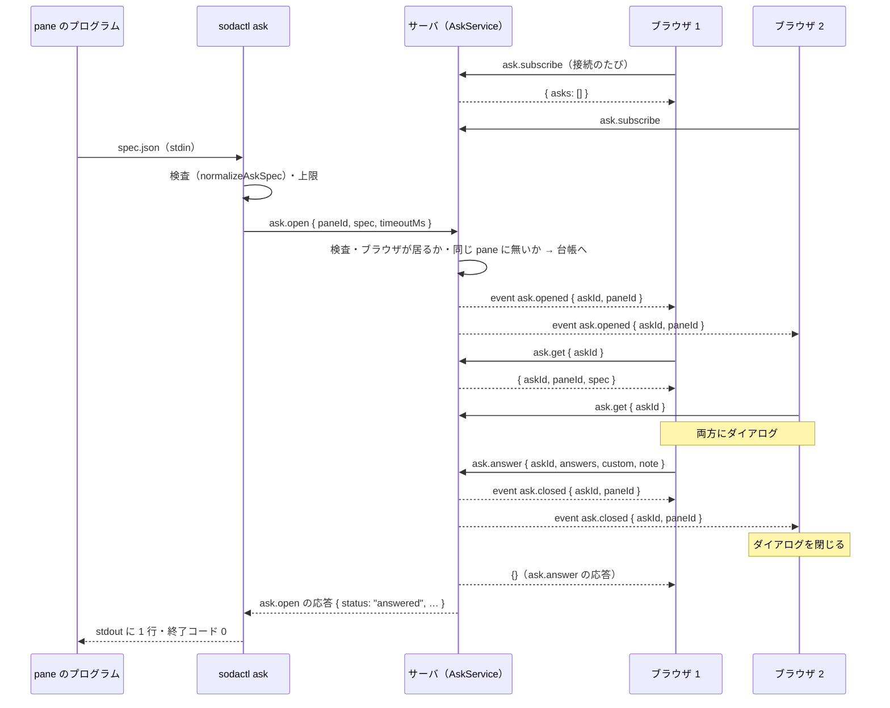
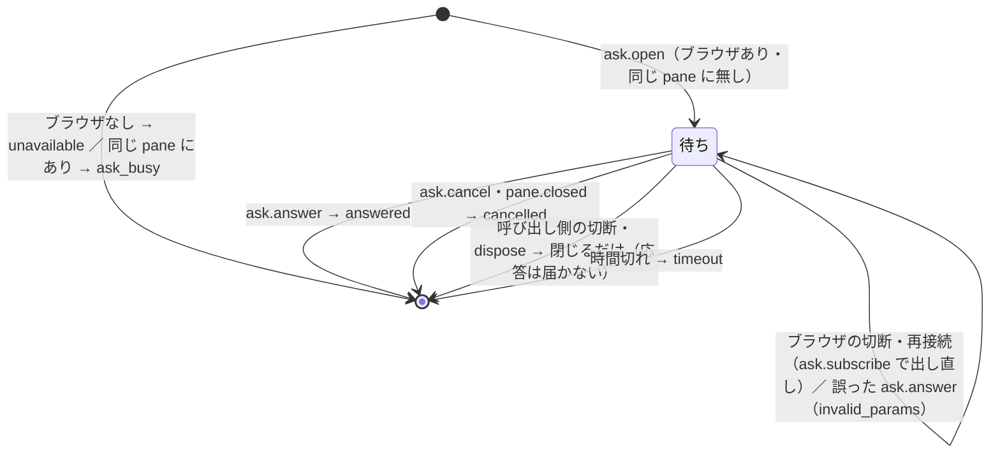

# 仕様: `sodactl ask`（pane のプログラムからブラウザ版の画面へ質問のフォームを出す）

方針は `decisions.md` の D2（(a)〜(q)）と D3（利用者の承認）。事実の出所は `research.md`（F・A の番号）。

## 概要

pane の中のプログラムが `sodactl ask < spec.json` を呼ぶと、sodactl が定義を検査してサーバへ 1 つの長い要求 `ask.open` を送る。サーバ（`AskService`）は pane ごとの
台帳に質問を置き、中身の無いイベント `ask.opened` を配る。「フォームを出せる」と名乗った（`ask.subscribe` を呼んだ）ブラウザは `ask.get` で定義を取り、
画面の上にダイアログ（`AskDialog.vue`）を出す。最初に届いた `ask.answer`／`ask.cancel` で質問を閉じ、`ask.closed` を配ってほかのブラウザのダイアログを閉じ、
`ask.open` の応答として結果を返す。sodactl はそれを stdout に 1 行で出す。



## 設計方針

- **契約は対応指示のまま**（入力・4 つの `status`・終了コード）。足すのは `ask_busy`（同じ pane の 2 つめ。終了コード 1）と上限だけ（D2 (q)）。
- **ブラウザの見分けは `ask.subscribe`**（D2 (a)）。hello・`ClientRegistry` の形は変えない。端末版は `desktop` と名乗る（research F1）が `ask.subscribe` を呼ばないので数えない。
- **中身をイベントに載せない**（D2 (b)）。全接続に配るのは id だけで、定義は `ask.subscribe` 済みの接続が要求で取る。回答は `ask.open` の応答でだけ返る。
- **質問の寿命 ＝ `ask.open` の要求の寿命**（D2 (c)）。閉じる理由（回答・取り消し・時間切れ・pane が閉じた・呼び出し側の切断・サーバの停止）はどれも `AskService.close()` の 1 か所を通り、
  「台帳から外す → `ask.closed` を配る → 応答を返す」を 1 回だけ行う。
- **検査・回答の集め方は protocol の純関数**にして、CLI・サーバ・ブラウザが同じものを使う（D2 (d)）。`form.html` と同じ結果になること（AC3）を、この関数の単体テストで固定する。
- **ダイアログは別枠のストア**（D2 (j)）。既存の単一の枠（`view.openDialog`）を使わないので、開いている設定・確認・popup を潰さない。`view.modalOpen` に含めてキーを止める。
- 退けた案とその理由は `decisions.md` D2 の各項目に書いた（hello の拡張・定義をイベントに載せる・短い要求＋イベントで待つ・軽い接続へ出す・通知してから出す・入れ替え・猶予つきの `unavailable`）。

## 対象範囲

| パッケージ | 追加 | 変更 |
|---|---|---|
| protocol | `src/ask.ts`・`src/ask.test.ts` | `messages.ts`（方式 5 つ）・`events.ts`（イベント 2 つ）・`errors.ts`（code 3 つ）・`index.ts` |
| client-core | — | `net/clientError.ts`（code 3 つの文言） |
| server | `ask/AskService.ts`・`ask/AskService.test.ts`・`ask/ask.integration.test.ts`・`surface/methods/ask.ts` | `surface/methods/deps.ts`・`surface/methods/index.ts`・`composeServer.ts`・`machine/machines.integration.test.ts`（AC7 のケースを足す） |
| cli | `commands/ask.ts`・`commands/ask.test.ts` | `cliArgs.ts`・`main.ts`・`wsClient.ts`（要求ごとの時間切れ）・`skills/sodactl/SKILL.md`・`cliArgs.test.ts` |
| web | `components/AskDialog.vue`・`components/AskDialog.test.ts`・`store/ask.ts`・`store/ask.test.ts`・`ask/AskController.ts`・`ask/AskController.test.ts` | `store/view.ts`（`modalOpen`）・`store/StoreAdapter.ts`（イベントの口）・`main.ts`（配線）・`App.vue`（マウント） |
| e2e | `specs/ask-form.spec.ts` | — |
| docs | — | `docs/sodactl.md`・`docs/tui-parity.md`・`docs/machines.md`・`docs/verification.md` |

端末版（`packages/tui`）は変えない。

## 依拠する既存の事実

- 端末版は `kind: "desktop"` で hello する（`packages/tui/src/net/TuiNet.ts:119`）。接続は hello の前から既定の `desktop` で registry に載る（`packages/server/src/clients/ClientRegistry.ts:62`）。
- `ClientRegistry` は `get(clientId)`・`list()` を持ち、`ClientRecord.kind` を読める（`packages/server/src/clients/ClientRegistry.ts:19-37, 47-48`）。
- サーバは全イベントを全接続へ送る（`packages/server/src/ws/WsGateway.ts:107-109`）。`sodactl watch` はイベントの data をそのまま出力する（`packages/cli/src/commands/session.ts:35-42`）。
- 中継の接続（`/ws?machine=`）は、リモートの 2 つめの `WsGateway` に同じ `surface`・`clients`・`bus` で載る（`packages/server/src/composeServer.ts:391-392`、`packages/server/src/machine/BridgeEndpoint.ts:224`）。
  ブラウザの軽い接続は `external`（`packages/client-core/src/net/MachineSummaryClient.ts:96`）。
- 切断は `conn.onClose` → `clients.unregister` → `onClientGone(clientId)`（`packages/server/src/ws/WsGateway.ts:155-168`）。配線は 2 か所（`packages/server/src/composeServer.ts:383-388, 392-397`）。
- サーバは 1 通ごとに独立に処理し、保留中のハンドラが同じ接続のほかの要求を止めない（`packages/server/src/ws/WsGateway.ts:149-153, 171-190`）。
- `ControlSurface.invoke` は `RpcError` をそのまま返し、ほかの例外は method と stack をログに書く（`packages/server/src/surface/ControlSurface.ts:33-50`）。未知の方式は `not_found`。
- `MethodContext` は `clientId` と `sink` を持つ（`packages/server/src/surface/ControlSurface.ts:9-13`）。
- `pane.closed` はどの閉じ方でも出る（`packages/server/src/session/SessionService.ts:467-477`）。bus の購読の手本は `MetadataService`（`packages/server/src/metadata/MetadataService.ts:80-83, 97-100`）。
- `close()` は接続を閉じた後、finally で各サービスを dispose する（`packages/server/src/composeServer.ts:681-739`）。handoff は `closeAll(1012)` だけ（`:436-441`）。
- sodactl の要求は 10 秒固定で時間切れ（`packages/cli/src/wsClient.ts:62, 140-161` `requestRaw`）。切断しても保留の要求は reject されない（`:98-101`）。hello は `external`（`:163-166`）。
- sodactl の終了コード: `CliUsageError` → 2、ほか → stderr に `{"error":{code,message}}` で 1（`packages/cli/src/output.ts:94-128`）。成功は `printJson`（`:10-12`）。
- 呼び出し元の pane: `resolveCallerPane` が接続の前に `caller_pane_unknown` を投げる（`packages/cli/src/paneTarget.ts:15-34`）。`--machine <local 以外>` は `caller` を捨てる（`packages/cli/src/cliArgs.ts:943-954`）。
- コマンドの足し方: `USAGE_LINES`・`Command`・`parseArgs`・`main.ts` の switch（`packages/cli/src/cliArgs.ts:25-66, 167, 339-384`、`packages/cli/src/main.ts:74-138`）。
  SKILL.md は `USAGE_LINES` と突き合わせる（`packages/cli/src/skill.test.ts:70-81`）。`--timeout` の解釈は `parseTimerMs`（`packages/cli/src/cliArgs.ts:611-620`）。
- 認証と Origin/Host は `withSession` → `connect`（`packages/cli/src/withSession.ts:15-45`、`packages/cli/src/wsClient.ts:216-229`）。
- ブラウザは接続のたびに取り直す（`packages/web/src/main.ts:273` の `connection.onOpened`）。イベントは `StoreAdapter.applyEvent`（`packages/web/src/store/StoreAdapter.ts:83, 112-191`）。
  イベントの switch に網羅の検査は無い（`satisfies never` はイベントに使っていない——`packages/web/src`・`packages/client-core/src`・`packages/tui/src` を grep して確かめた）。
- ダイアログの状態は単一の枠＋グラフの別枠で、`modalOpen = openDialog !== null || graphOpen`（`packages/web/src/store/view.ts:309-323`）。キーは `modalOpen` で止まる（`packages/web/src/main.ts:420-436`）。
- マシンの切り替えは `view.resetForMachineSwitch()` を通る（`packages/web/src/main.ts:353-357`、`packages/web/src/store/view.ts:439-442`）。
- 既存のダイアログはネイティブ `<dialog>` + `showModal()`。背景クリックで閉じない先例・見出しへのフォーカス・`immediate` は `OnboardingDialog.vue`（`packages/web/src/components/OnboardingDialog.vue:152-162, 226-232`）。
- `TerminalPane` は `focusedPaneId` の変化でだけ端末へフォーカスする（`packages/web/src/components/TerminalPane.vue:62-68`）。明示の戻しは `TerminalRegistry.focus`（`packages/web/src/term/TerminalRegistry.ts:180-182`）と
  `focusPaneIfShown`（`packages/web/src/actions/paneFocus.ts:14-19`）。
- pane の呼び名は `paneNameOf`（`packages/client-core/src/workspace/paneName.ts:11-13`）、場所つきは `describeTarget`（`packages/client-core/src/notify/describe.ts:31, 44`）。
- CSP はインラインの style を許す（`packages/server/src/http/HttpServer.ts:28-29`）。色の値を検証する既存の仕組みは無い（research F41。`packages/web/src` を探して無し）。
- ask-form の検査と回答の集め方: `ask.py` の `normalize()`（`/workspaces/public_docs/docs/ClaudeCode/skills/other/ask-form/ask.py:54-89`）、`form.html` の `collect()`・`visible()`・`missing()`・`valueOf()`
  （同 `form.html`。research F46・F47）。別リポジトリなので、テストでは挙動を写した期待値を持つ（ファイルは参照しない）。
- 確かめ用の定義は 7 問・テーマ 13 件・`showIf` 2 つ・8.4 KiB、`colors` は `#rrggbb`（`generate.py --ask-spec` を実際に出して確かめた。対応指示は「8 問」と書くが、出力は 7 問）。
- `/ws`・bridge の 1 通の上限は 4 MiB（`packages/server/src/ws/WsServerWs.ts:16, 66`、`packages/server/src/machine/bridgeFrames.ts:28`）。JSON の UTF-8 の大きさを測る `jsonBytes` は
  `packages/protocol/src/messages.ts:461`（今は `messages.ts` の中だけの関数。`ask.ts` から使うので外へ出す）。
- 切り離し（`client.detach`）は、応答の後にサーバがその接続を閉じる（`packages/server/src/ws/WsGateway.ts:186`）。ログイン待ちの画面は `/ws` に繋がっていない。
  どちらも接続が無いので、`onClientGone` で購読者から外れている。ブラウザ側は `.app-shell` ごと unmount される（`packages/web/src/App.vue:58-60`）。
- ブラウザの接続の閉じは `Connection.onClosed`（`packages/client-core/src/net/Connection.ts:235`）、sodactl の切断の検知は `client.onClose`（`packages/cli/src/commands/agent.ts:115`）。
- `invalid_params`（zod で落ちた要求）はクライアントへ返すだけで、ログに書かれない（`packages/server/src/surface/ControlSurface.ts:34-37`）。
- `MethodDeps` の任意の依存（無ければその方式を登録しない）の先例は `images`（`packages/server/src/surface/methods/deps.ts:40-41`、`packages/server/src/surface/methods/image.ts:15-17`）。
- 未確認: iOS Safari で、画面のキーボードが出たときのネイティブ `<dialog>` の高さ（`100dvh` の扱い）。E2E はモバイルのエミュレーションだけなので、実機は `docs/verification.md` に残す。
- 未確認: 切断後に解決した `ask.open` のハンドラが閉じた接続へ `sendText` したときの `ws` の挙動（research の同項）。`AskService` は切断で先に閉じるので、応答は「閉じた接続への送信」になる。
  coding で `WsConnectionImpl.sendText` が投げないことを確かめ、投げるなら `WsGateway.handleText` の既存の catch（`packages/server/src/ws/WsGateway.ts:149-153`）で拾われることを確かめる。

## インターフェース / データ構造

### protocol: `packages/protocol/src/ask.ts`

```ts
// 上限（D2 (n)）
export const ASK_SPEC_MAX_BYTES = 256 * 1024;        // 定義全体（JSON の UTF-8）
export const ASK_QUESTIONS_MAX = 100;
export const ASK_OPTIONS_MAX = 200;                  // 1 つの質問の選択肢
export const ASK_ID_MAX = 200;                       // id・value（文字数）
export const ASK_LABEL_MAX = 500;                    // title・submit・label・otherLabel・placeholder・otherPlaceholder・note（入力例）・選択肢の label
export const ASK_TEXT_MAX = 4000;                    // intro・help・desc
export const ASK_COLORS_MAX = 16;                    // 1 つの選択肢で使う色の数（超えた分は捨てる。誤りにしない）
export const ASK_ANSWER_TEXT_MAX = 10_000;           // 自由入力・text の回答・補足（文字数）
export const ASK_TIMEOUT_DEFAULT_MS = 540_000;
export const ASK_TIMEOUT_MIN_MS = 1_000;
export const ASK_TIMEOUT_MAX_MS = 86_400_000;

export interface AskOption { value: string; label: string; desc?: string; recommended?: true; colors?: string[] }
export interface AskQuestion {
  id: string; label: string; type: "single" | "multi" | "text";
  help?: string; options: AskOption[];               // text は []
  default?: string | string[];                       // multi は配列
  allowOther: boolean; otherLabel?: string; otherPlaceholder?: string;
  showIf?: Record<string, string[]>;                 // 値は配列に揃える
  required: boolean; multiline: boolean; placeholder?: string; minWidth?: number;
}
/** 検査を通った定義（知らない項目は落としてある）。 */
export interface AskSpec { title: string; intro?: string; submit: string; note: boolean; notePlaceholder?: string; questions: AskQuestion[] }

export type AskAnswers = Record<string, string | string[]>;
export type AskResult =
  | { status: "answered"; answers: AskAnswers; custom?: string[]; note?: string }
  | { status: "cancelled" } | { status: "timeout" } | { status: "unavailable"; reason: string };

export function normalizeAskSpec(raw: unknown): { ok: true; spec: AskSpec } | { ok: false; message: string };
export interface AskFormState { picked: Record<string, string[]>; otherPicked: Record<string, boolean>; otherText: Record<string, string>; text: Record<string, string>; note: string }
export function initialAskState(spec: AskSpec): AskFormState;        // default を選択済みにする
export function collectAsk(spec: AskSpec, state: AskFormState): { answers: AskAnswers; custom: string[]; note?: string; visible: string[]; lacking: string[] };
export function checkAskAnswer(spec: AskSpec, a: { answers: AskAnswers; custom?: string[]; note?: string }): string | null; // 誤りの理由（null は可）
export function isAskColor(s: unknown): s is string;                 // #rgb・#rgba・#rrggbb・#rrggbbaa
```

- `normalizeAskSpec` は `ask.py` の `normalize()` と同じ検査（research F46）に上限を足したもの。`message` は英語で、場所（`questions[2].options[0]`）と理由だけ——定義の文字列の中身は入れない
  （id の重複のときの id を除く。これは CLI の stderr にだけ出て、サーバのログには書かれない）。
  - **誤りにするもの**（`ok: false`）:
    1. オブジェクトでない／`questions` が配列でない・空。
    2. 定義全体が `ASK_SPEC_MAX_BYTES` を超える（`jsonBytes(raw)`＝詰めた JSON の UTF-8 の大きさ。**測るのはこの関数の中だけ**——CLI もサーバも同じ値で判定する）。
    3. 質問が `ASK_QUESTIONS_MAX` を超える。
    4. 質問がオブジェクトでない／`id`・`label` が空でない文字列でない／`id` の重複／`id` が `ASK_ID_MAX` を、`label` が `ASK_LABEL_MAX` を超える。
    5. `type` があって `single`・`multi`・`text` のどれでもない（無ければ `single`）。
    6. `text` 以外で `options` が配列でない・空・`ASK_OPTIONS_MAX` を超える。
    7. 選択肢が文字列でもオブジェクトでもない／オブジェクトに `value` が無い／`value`（文字列化した後）の重複・`ASK_ID_MAX` の超過／選択肢の `label` が `ASK_LABEL_MAX` を超える。
    8. `showIf` がオブジェクトでない／そのキーが実在する `id` でない（**下の質問を指すのは誤りにしない**。D2 (d)）。
    9. 文字列の項目が上限を超える: `title`・`submit`・`otherLabel`・`placeholder`・`otherPlaceholder`・`note`（文字列のとき）は `ASK_LABEL_MAX`、`intro`・`help`・`desc` は `ASK_TEXT_MAX`。
  - **既定と丸め**（誤りにしない）: `title` → `"質問"`／`submit` → `"決定"`／`note` は `false` のときだけ false（文字列なら `notePlaceholder`）／`type` → `single`／
    `allowOther`・`required`・`multiline` → 真偽値でなければ `false`／選択肢の文字列 → `{value, label}`／`value` は文字列化／選択肢の `label` の既定は `value`／
    `multi` の `default` の文字列 → 配列（`single` の `default` の配列は先頭）／`showIf` の値 → 文字列の配列／`minWidth` は 60〜600 の整数だけ採る／
    `recommended` は `true` のときだけ／知らない項目は落とす／型の違う任意の文字列の項目（`help` が数値等）は捨てる。
  - **`colors` だけは上限でも誤りにしない**: `isAskColor` を通るものだけを残し、先頭 `ASK_COLORS_MAX` 個で切る（見本の帯で、回答の意味を変えないため。`docs/sodactl.md` に書く）。
- `checkAskAnswer(spec, a)`（サーバが `ask.answer` に当てる。ブラウザの誤り・改変した要求から、呼び出し側へ返す形を守る）: `collectAsk` と同じ順で上から見て、
  (1) `answers` のキーは、その `answers` 自身で `showIf` を満たす（表示される）質問の `id` だけ。(2) 表示される `single` は必ずあり文字列、`multi` は文字列の配列（`required` なら 1 つ以上）、
  `text` は文字列（`required` なら空でない）。(3) `custom` に無い質問の値は選択肢の `value` のどれか。`custom` にある質問は `allowOther` が真で、値のうち選択肢に無いものは 1 つまで・空でない。
  (4) `custom` は `single`・`multi` の表示される質問の `id` だけ・重複なし。(5) `note` は `spec.note` が真のときだけ。どれかに反したら理由（英語・中身を含めない）を返す。
- `collectAsk` は `form.html` の `collect()` と同じ（research F47）: 上から順に `showIf` を判定（依存先が answers にあり、その値のどれかが欲しい値に含まれる）。隠れた質問は入れない。
  `single` は未選択が未回答、`multi`・`text` は `required` のときだけ空が未回答。「その他」は入力欄の trim した文字列（空なら無いもの）で、`custom` に id を足す。
  `text` は trim。`note` は trim して空でなければ返す。未回答の `single` は answers に入れない。

### protocol: 方式・イベント・エラー

```ts
// messages.ts
export const AskOpenParams = z.object({
  paneId,
  spec: z.record(z.string(), z.unknown()),      // 大きさ・中身は handler の normalizeAskSpec が見る（どの誤りも invalid_ask_spec に揃える）
  timeoutMs: z.number().int().min(ASK_TIMEOUT_MIN_MS).max(ASK_TIMEOUT_MAX_MS),
});
export const AskSubscribeParams = z.object({});
export interface AskPending { askId: string; paneId: string; spec: AskSpec }
export interface AskSubscribeResult { asks: AskPending[] }
export const AskGetParams = z.object({ askId });
export const AskAnswerParams = z.object({
  askId,
  answers: z.record(z.string().max(ASK_ID_MAX), z.union([answerText, z.array(answerText).max(ASK_OPTIONS_MAX + 1)])),
  custom: z.array(z.string().max(ASK_ID_MAX)).max(ASK_QUESTIONS_MAX).optional(),
  note: answerText.optional(),
});                                   // answerText = z.string().max(ASK_ANSWER_TEXT_MAX)、askId = z.string().min(1).max(64)
export const AskCancelParams = z.object({ askId });
// METHOD_SCHEMAS / MethodResultMap
"ask.open": AskResult; "ask.subscribe": AskSubscribeResult; "ask.get": AskPending; "ask.answer": {}; "ask.cancel": {}

// events.ts（中身なし。全接続へ配る）
export interface AskOpenedEvent { event: "ask.opened"; data: { askId: string; paneId: string } }
export interface AskClosedEvent { event: "ask.closed"; data: { askId: string; paneId: string } }

// errors.ts
| "invalid_ask_spec"   // 定義の誤り・上限の超過（sodactl は自分で先に検査するので、通常はここへ来ない）
| "ask_busy"           // 同じ pane に待っている質問がある
| "ask_closed"         // その質問はもう無い（回答済み・取り消し・時間切れ）。ask.subscribe していない接続への答えも同じ
```

### server: `packages/server/src/ask/AskService.ts`

```ts
export interface AskServiceOptions {
  paneExists(paneId: string): boolean;
  /** その接続が画面（desktop / mobile）か。 */
  isBrowserKind(clientId: string): boolean;
  bus: EventBus;                       // pane.closed の購読と ask.opened / ask.closed の配布
  clock?: { setTimeout(fn: () => void, ms: number): unknown; clearTimeout(h: unknown): void };
  random?: () => string;               // askId（既定は randomBytes(16) の hex）
  logger?: Pick<Logger, "info">;
}
export class AskService {
  subscribe(clientId: string): AskPending[];                                   // 購読者に加え、待っている質問を返す
  open(clientId: string, p: { paneId: string; spec: unknown; timeoutMs: number }): Promise<AskResult>;
  get(clientId: string, askId: string): AskPending;
  answer(clientId: string, p: { askId: string; answers: AskAnswers; custom?: string[]; note?: string }): void;
  cancel(clientId: string, askId: string): void;
  onClientGone(clientId: string): void;
  dispose(): void;
}
```

- 台帳: `byPane: Map<paneId, Entry>`・`byId: Map<askId, Entry>`、`Entry = { askId, paneId, spec, ownerClientId, timer, resolve }`。購読者: `subscribers: Set<clientId>`。
- `MethodDeps.asks?: AskService`（無ければ `ask.*` を登録しない。`images` と同じ流儀）。

### cli

```
sodactl ask [--timeout <ms>] < spec.json
```

```ts
// cliArgs.ts
| { type: "ask"; timeoutMs: number }                       // Command に足す
// wsClient.ts（SodaClient）
request<M extends MethodName>(method: M, params: ParamsOf<M>, opts?: { timeoutMs?: number }): Promise<ResultOf<M>>;
// commands/ask.ts
export async function runAsk(cmd, opts, deps: { readStdin(): Promise<Buffer>; withSession; print(line: string): void }): Promise<void>;
```

### web

```ts
// store/ask.ts（pinia）
export const useAskStore = defineStore("ask", () => {
  const queue = ref<AskPending[]>([]);                       // 受けた順。先頭を出す
  const current = computed(() => queue.value[0] ?? null);
  function replaceAll(asks: AskPending[]): void;             // ask.subscribe の応答
  function add(ask: AskPending): void;                       // ask.get の応答（同じ askId は足さない）
  function remove(askId: string): void;                      // ask.closed・回答／取り消しの後
  function clear(): void;                                    // 切断・マシンの切り替え
});
// ask/AskController.ts
export class AskController {
  constructor(opts: { conn: Pick<ConnectionPort, "request">; store; toast(message: string): void });
  onOpened(): void;                                          // ask.subscribe → replaceAll（失敗＝古いサーバなら何もしない）
  onClosed(): void;                                          // clear
  onEvent(e: AskOpenedEvent | AskClosedEvent): void;         // opened → ask.get → add ／ closed → remove
  answer(askId: string, result: { answers; custom: string[]; note?: string }): Promise<void>;
  cancel(askId: string): Promise<void>;
  resetForMachineSwitch(): void;
}
// store/view.ts
const modalOpen = computed(() => openDialog.value !== null || graphOpen.value || askOpen.value);   // askOpen は AskDialog が開閉で書く
```

## 振る舞いの詳細

### sodactl ask

1. 引数: `--timeout <ms>`（既定 540000。1000〜86400000 の整数。外れたら使い方の誤り）。`--machine <local 以外>`・位置引数・知らないオプションは使い方の誤り（終了コード 2）。
2. `resolveCallerPane` で呼び出し元の pane を確かめる（接続の前。pane の外なら `caller_pane_unknown`・終了コード 1）。
3. stdin を EOF まで読む。端末（TTY）なら読まずに使い方の誤り（「定義を標準入力で渡してください」）。生のバイト数が 1 MiB を超えたら読み止めて使い方の誤り
   （際限なく読まないための保険。定義の上限 `ASK_SPEC_MAX_BYTES` の判定は次の `normalizeAskSpec` が行う）。
4. JSON として解釈 → `normalizeAskSpec`。誤りは `CliUsageError`（終了コード 2。stderr に `sodactl: invalid ask spec: <理由>`。hint は `sodactl ask [--timeout <ms>] < spec.json` の 1 行）。
5. `withSession` で接続し、`client.request("ask.open", { paneId, spec: <読んだままのオブジェクト>, timeoutMs }, { timeoutMs: timeoutMs + 15_000 })`。
   - 送るのは検査を通った**元の**オブジェクト（サーバが同じ関数で検査し直す）。
   - 待つ間、`client.onClose` を見て、切れたら `connection_closed`（終了コード 1）。
6. 応答（`AskResult`）を `printJson` で 1 行出して終了コード 0。サーバの `invalid_ask_spec` は `CliUsageError` に写す（終了コード 2。版の違いで CLI の検査を抜けたとき）。
   `ask_busy`・`not_found`（古いサーバ・pane が無い）・認証の失敗は既存どおり stderr に JSON・終了コード 1。
7. SIGINT・SIGTERM: 何もしない（既定の動作でプロセスが終わり、接続が閉じる → サーバが取り消す）。

### AskService

- **`subscribe(clientId)`**: `isBrowserKind` が偽なら `RpcError("invalid_params")`。`subscribers` に足し、台帳の全ての質問を `AskPending[]`（受けた順）で返す。何度呼んでもよい。
  購読を外すのは接続が閉じたとき（`onClientGone`）だけ——切り離し・ログアウト・ログイン待ちは接続が無いので、購読者に残らない（requirements 未確定 4）。
  接続したまま画面を出せない状態（再接続の途中）は接続が無いので同じ。**購読者＝いま `/ws`（か中継）につながっていて、ダイアログを描ける画面**。
- **`open(clientId, p)`**: 順に
  1. `normalizeAskSpec(p.spec)` → 誤りは `invalid_ask_spec`（message は関数の理由）。
  2. `paneExists` → 無ければ `not_found`。
  3. `byPane.has(paneId)` → `ask_busy`。
  4. `subscribers.size === 0` → `{ status: "unavailable", reason: "no browser is connected to show the form" }` を**すぐ返す**（台帳に置かない）。
  5. `askId` を作り、台帳に置き、`timeoutMs` のタイマーを掛け、`ask.opened` を配り、Promise を返す（`resolve` は台帳に持つ）。ログは `ask opened { askId, paneId, questions: <数> }`。
- **`get(clientId, askId)`**: 購読者でない・無い id は `ask_closed`。あれば `{askId, paneId, spec}`。
- **`answer(clientId, p)`**: 購読者でない・無い id は `ask_closed`。`checkAskAnswer(spec, p)` が理由を返したら `invalid_params`（質問は閉じない——ほかのブラウザ・同じブラウザが答え直せる）。
  通れば `close(entry, { status: "answered", answers, custom（空なら省く）, note（あれば） })`。
- **`cancel(clientId, askId)`**: 購読者でなければ `ask_closed`。無い id は成功（何もしない。2 つのブラウザが同時に取り消しても誤りにしない）。あれば `close(entry, { status: "cancelled" })`。
- **`close(entry, result)`**（内部・1 回だけ）: タイマーを止め、台帳から外し、`ask.closed` を配り、`resolve(result)`。ログは `ask closed { askId, paneId, status }`。
- **時間切れ**: `close(entry, { status: "timeout" })`。
- **`pane.closed`**（bus）: その pane の質問を `close(entry, { status: "cancelled" })`。
- **`onClientGone(clientId)`**: `subscribers` から外す。その接続が `ownerClientId` の質問を `close(entry, { status: "cancelled" })`（応答は閉じた接続へ行くだけ。目的は `ask.closed` を配ること）。
  購読者が 0 になっても、待っている質問はそのまま（D3 (g)。戻ってきたブラウザが `ask.subscribe` で受け取る）。
- **`dispose()`**: 全ての質問を `close(entry, { status: "cancelled" })`、bus の購読を外す（`close()` は接続を閉じた後に呼ぶので、この応答と `ask.closed` は誰にも届かない——
  目的はタイマーと台帳の後始末。**サーバの停止でブラウザのダイアログを閉じるのは、ブラウザの側の切断の処理**〔`AskController.onClosed` → ストアを空に〕）。以後の `open` は `{ status: "unavailable", reason: "the server is shutting down" }`。
- 状態は再起動・handoff をまたがない（メモリだけ）。handoff は全接続を閉じるので、`onClientGone` で全て閉じる。



### 配線（composeServer）

- `AskService` を `images` の近くで作る（`paneExists: session.getPane`、`isBrowserKind: (id) => ["desktop","mobile"].includes(clients.get(id)?.kind)`、`bus`、`logger`）。`registerAllMethods` に `asks` を渡す。
- 2 つの `WsGateway` の `onClientGone` の両方に `asks.onClientGone(clientId)` を足す。`close()` の finally で `asks.dispose()`（`commands.dispose()` の隣）。

### ブラウザ: AskController と配線

- `connection.onOpened(() => askController.onOpened())`・`connection.onClosed(() => askController.onClosed())`。イベントは `StoreAdapter` のオプションのコールバック（`onAskEvent`）へ回す。
- `onOpened`: `ask.subscribe` → `store.replaceAll(asks)`。失敗（`not_found`＝古いサーバ・中継先が古い）は黙って何もしない——そのサーバは購読者 0 として `unavailable` を返すので、呼び出し側は待たない。
- `ask.opened`: `ask.get` → `store.add`（`ask_closed` は無視——取りに行く間に閉じた）。`ask.closed`: `store.remove`。
- マシンの切り替え: 切り替えの処理（`main.ts` の `resetForMachineSwitch` の並び）で `askController.resetForMachineSwitch()`（`store.clear()` と世代の更新——切り替えの前の `ask.get` の応答を捨てる）。
  新しい接続の `onOpened` が、切り替え先の質問を取り直す。
- 保存した SSH のマシン: 画面の接続（選択中のマシン）だけが `ask.subscribe` する。軽い接続は何もしない（D2 (h)）。

### ブラウザ: AskDialog.vue

- **マウント**: `App.vue` の `.app-shell` の中、ほかのダイアログの後ろ（後から `showModal` するので上に重なる）。ログイン・切り離しの間は unmount される。
- **開閉**: `watch(() => askStore.current?.askId, …, { immediate: true })`。値があれば `nextTick` で `showModal()`・`view.setAskOpen(true)`・見出しへフォーカス。null なら `close()`・`view.setAskOpen(false)`。
  askId が替わったら（次の質問）フォームの状態を作り直し、スクロールを先頭へ戻し、見出しへフォーカス。unmount では `view.setAskOpen(false)`。
- **構成**（上から）:
  1. 出どころの行（固定。定義の外）: `pane「<paneNameOf(pane)>」（<workspace の名前>／<tab の名前>）のプログラムからの質問`。pane がストアに無ければ `pane <id>`。`tabindex="-1"` の見出し（`aria-labelledby` の先）。
     アプリの配色（`--soda-accent`）の帯で、定義の内容と見分けられる見た目にする。
  2. 定義の `title`（文字）・`intro`（あれば）。
  3. 質問ごとの `<fieldset>`（`<legend>` に番号＋`label`、`help`）。表示中のものだけ番号を振り直す。`showIf` で隠れたものは描かない。
     - `single`: ネイティブの radio（`name` は `ask-<askId>-<質問の位置>`——定義の id を属性に使わない）。`multi`: checkbox。選択肢は `label`・`desc`・「おすすめ」の札（`recommended`）・
       `colors` の帯（`isAskColor` を通ったものを `:style="{ background: c }"`）。並びは CSS grid（`minmax(<minWidth ?? 180>px, 1fr)`）。
     - `allowOther`: 「その他」の radio/checkbox と 1 行の入力欄。入力欄に打つ・フォーカスすると「その他」が選ばれる。
     - `text`: `multiline` なら `<textarea>`、そうでなければ `<input type="text">`。`maxlength` は `ASK_ANSWER_TEXT_MAX`。
  4. 補足欄（`note` が false でなければ。`<textarea>`）。
  5. 下部（sticky）: 「未回答 N 件／すべて回答済み」・［キャンセル］・［<submit>］。
- **確定**: 決定ボタン・`Ctrl+Enter`／`Cmd+Enter`・1 行の入力欄での `Enter`。どれも `ev.isComposing || ev.keyCode === 229` なら何もしない。
  `collectAsk` の `lacking` があれば確定せず、その質問を強調（`ask-missing`）して最初の未回答へ `scrollIntoView`、下部に「未回答 N 件 — 選んでから決定してください」。
  無ければ `askController.answer(askId, { answers, custom, note })`。送っている間はボタンを無効にする。成功したら `store.remove(askId)`。
  失敗: `ask_closed` → 「この質問は既に閉じられました」のトーストと `store.remove`。ほか → トースト（`clientErrorMessage`）でダイアログは開いたまま。
- **即確定**（D3 (l)）: 質問が 1 つ・`single`・`note: false` のとき、選択肢（「その他」以外）の `click`（マウス・タップ。`ev.detail > 0`）と、選択肢にフォーカスがあるときの `Space`／`Enter` で確定する。
  矢印キーによる選択の移動（`change` だけが起き、`click` の `detail` は 0）では確定しない。
- **取り消し**: ［キャンセル］・`Esc`（`@cancel` を `preventDefault` して自前の処理）→ `askController.cancel(askId)` → `store.remove(askId)`。背景クリックでは閉じない。
- **フォーカスの戻り先**: 開く直前の `document.activeElement` を覚える。閉じた（キューが空になった）とき、
  (1) ほかのモーダル（`view.openDialog !== null || view.graphOpen`）が開いていれば、覚えた要素へ戻す（ネイティブの `close()` の復帰に任せ、要素が消えていれば何もしない）。
  (2) そうでなく、質問の pane が表示中（`focusPaneIfShown` と同じ判定: その pane の tab が表示中の tab）なら、`view.focusedPaneId` をその pane にして `registry.focus(paneId)`。
  (3) どちらでもなければ、覚えた要素へ戻す（端末の textarea なら `focus()`）。表示（workspace・tab）は切り替えない。
- **キーとホイール**: `view.modalOpen` に `askOpen` が入るので、`KeyRouter` は dialog モード・window の keydown は素通り。フォーカスはダイアログ内で、背面は `showModal()` により inert——
  ポインタのイベント（クリック・ホイール）は背面の端末へ届かない。ダイアログの本体には `overscroll-behavior: contain` を付け、端までスクロールしても背面へ連鎖させない。
- **寸法とスクロール**: `width: min(720px, calc(100% - 16px))`・`max-height: calc(100% - 16px)`（`100vh` を使わない）。本体が `overflow-y: auto`、出どころの行と下部は sticky。
  モバイル（幅 768px 未満）は幅いっぱい・選択肢は 1 列。入力欄の `font-size` は 16px 以上（iOS の自動ズームを避ける）。
- **安全**: 定義の文字は全て `{{ }}`（文字の差し込み）。`v-html` は使わない。`colors` は `isAskColor` を通ったものだけを style に使う。
- **ほかのモーダルとの重なり**: 質問が開いている間に利用者の操作で別のダイアログを開く経路は、キーが止まっているので起きない（マウスは背面が inert で届かない）。
  応答待ちで後から開く既存のダイアログ（worktree の一覧等）が質問の上に `showModal` された場合は、そのダイアログが上に出て、閉じると質問へ戻る（どちらも操作不能にならない）。

### docs

- `docs/sodactl.md`: コマンド一覧に `ask`、節「質問のフォーム（`ask`）」（入力の項目・結果・終了コード・どのブラウザに出るか・表示していない pane・2 つめ・待っている間の切断・リモートの pane・
  `form.html` との違い〔即確定は矢印キーでは起きない〕）、「サーバ側の上限」に 1 項目。
- `packages/cli/skills/sodactl/SKILL.md`: `sodactl ask` の使い方と `status` の読み方（`unavailable` なら別の手段で聞く）。
- `docs/tui-parity.md`: 行を 1 つ（端末版は対象外。端末版だけがつながっているときは `unavailable`）。
- `docs/machines.md`: リモートの pane の質問は、そのマシンを表示中のブラウザに出る・リモートで `sodactl login` が要る。
- `docs/verification.md`: 手元で確かめる項目（実機のスマートフォン・別のマシン・SSH のマシン・ask-form との同じ結果）。

## ドメイン固有の考慮

- **pane のプログラムは信用しない**: 定義は文字としてだけ出す・出どころの行はアプリが描く・上限・色の検証。定義で「Sodashitsu のログイン」を装っても、最上部に「pane のプログラムからの質問」と出る。
  回答は呼び出した pane のプログラムへ渡る——これは機能そのもの（利用者が出どころを見て答える）。
- **ほかの接続へ漏らさない**: イベントは id だけ。`ask.get`・`ask.subscribe` は画面（desktop / mobile）にだけ返す。端末版は `desktop` なので `ask.subscribe` を呼べば取れるが、端末版は呼ばない
  （同じ利用者の同じ権限の接続なので、漏えいにはならない）。
- **認証**: 新しい入口は無い。`ask.*` は認証済みの `/ws`（と bridge）の方式。pane の環境に token は入れない——sodactl は `~/.sodactl` の Cookie を使う（既存）。
- **ログ**: `AskService` は askId・paneId・質問の数・結果の種類だけを書く。検査の失敗は `RpcError`（ログに書かれない）。
- **中継**: `ask.open` の定義（256 KiB まで）と `ask.get` の応答は、`/ws`・bridge の 1 通の上限（4 MiB）に収まる。
- **版の違い**: 古いサーバ → `ask.open` は `not_found`（待たない）。古い画面（手元のサーバが古く、リモートが新しい）→ `ask.subscribe` を呼ばないので購読者 0 → `unavailable`。
  古い sodactl → `ask` を知らない（使い方の誤り）。
- **PJ の規約**: E2E はブラウザの側で合否を見る（`e2e-observe-browser`）——ダイアログの DOM・ブラウザが送った `ask.answer`（CDP）・フォーカス。テストのクライアントに `ask.opened` が届いたことを、
  ブラウザに出た合図にしない。

## エラー処理 / 異常系

| 場面 | 扱い |
|---|---|
| stdin が TTY・空・JSON でない・検査に落ちる・上限の超過・`--timeout` が範囲外・`--machine` | sodactl: 終了コード 2（stderr に理由）。何も送らない |
| pane の外から呼ぶ | `caller_pane_unknown`（終了コード 1）。接続しない |
| 未ログイン | 既存どおり（`unauthenticated`・終了コード 1） |
| 古いサーバ | `not_found`（終了コード 1） |
| ブラウザが 1 つも無い（受け付けた時点） | `{"status":"unavailable","reason":…}`・終了コード 0 |
| 同じ pane の 2 つめ | `ask_busy`・終了コード 1 |
| 待っている間にブラウザが全て切れる | そのまま待つ。戻れば出し直す。戻らなければ時間切れ |
| pane が閉じた・キャンセル | `cancelled` |
| 時間切れ（サーバ） | stdout に `{"status":"timeout"}`・終了コード 0 |
| サーバが応答しない（sodactl 側の要求の時間切れ。`--timeout`＋15 秒） | stderr に既存の code `timeout`・終了コード 1。**stdout の `status: "timeout"` とは別物**（`docs/sodactl.md` に書く） |
| sodactl の切断・Ctrl+C | サーバが質問を閉じ、`ask.closed` を配る。結果は誰にも渡らない |
| サーバの停止・handoff | 全ての質問を閉じる。sodactl は `connection_closed`（終了コード 1） |
| 2 つのブラウザが同時に答える | 先に届いた方を採る。後の方は `ask_closed` → そのブラウザに「既に閉じられました」 |
| 誤った形の `ask.answer` | `invalid_params`。質問は閉じない |
| `ask.get` の間に閉じた | `ask_closed` を無視する |
| ダイアログを出している間に切断 | ストアを空にしてダイアログを閉じる。再接続の `ask.subscribe` で、まだ待っていれば出し直す（入力しかけの内容は捨てる） |

## 受け入れ基準との対応

- AC1: 入力は pane の中の `sodactl ask < spec.json`（stdin）。サーバから見た接続元のアドレスに依らない経路（`/ws` の方式とイベント）だけで出すので、別のマシンのブラウザでも同じ。
  E2E は実物の Chromium で、テストが `sodactl`（ビルドした `packages/cli/dist/main.js`）を `SODA_PANE_ID`・`SODA_SERVER_URL` つきで子プロセスとして起動し、ダイアログの DOM と stdout の 1 行・終了コード 0 を見る。
  「ループバックでない接続」そのものは `docs/verification.md` の手元の項目で確かめる（E2E のブラウザは 127.0.0.1）。
- AC2: `AskDialog` は `<dialog>` で、`window.open`・タブを使わない。E2E で、決定までの間に新しいページが開かないこと（`context.waitForEvent("page")` が来ない）を見る。
- AC3: `collectAsk`・`normalizeAskSpec` の単体テストで、`form.html` の規則（research F47）を写した期待値と一致させる。入力は確かめ用の定義（`generate.py --ask-spec` の出力をテストの fixture に写したもの）と、
  `showIf`・`multi`・「その他」・`note`・`required`・既定を含む手書きの定義。E2E で fixture の定義を操作し、stdout の JSON を期待値と比べる。
- AC4: fixture の定義（テーマ 13 件）を、デスクトップとモバイルのエミュレーション（`mobile.spec.ts` と同じ設定）の E2E で、最後の選択肢までスクロールして選び、決定する。
- AC5: `AskService` の単体テスト（偽の時計）と `/ws` の結合テスト: キャンセル・`pane.close`・時間切れ・購読者なし（sodactl だけ／`desktop` で hello しただけで `ask.subscribe` しない接続＝端末版の形）。
  sodactl の終了コードは `commands/ask.test.ts`（偽のクライアント）と E2E。
- AC6: `normalizeAskSpec` の単体テスト（誤りの各種・上限・知らない項目）と `commands/ask.test.ts`（終了コード 2・stderr・何も送らない・`caller_pane_unknown`）。入力は stdin のバイト列。
- AC7: 決定は D2 (h)。`packages/server/src/machine/machines.integration.test.ts` の形（2 つのサーバを偽の ssh でつなぐ）で、中継越しの `desktop` の接続が `ask.subscribe` すると、リモートの pane の `ask.open` が
  その接続へ `ask.opened` を出し、`ask.answer` で結果が返ること／軽い接続（`external`）だけのときは `unavailable` がすぐ返ることを確かめる。入力はリモートのサーバへ直接つないだテストのクライアントの `ask.open`。
- AC8: `AskService` の単体テスト（2 つの購読者・先の回答だけ採る・後は `ask_closed`）と、E2E（2 つのブラウザコンテキスト。片方で決定するともう片方の `dialog.ask-dialog` が消える）。
- AC9: E2E: ダイアログが出た後に `page.reload()` → 同じ質問のダイアログが出直す → 決定 → stdout に結果。入力は再接続の `ask.subscribe` の応答。
- AC10: E2E: 子プロセスの sodactl に SIGINT → ダイアログが消える。時間切れ（`--timeout 1500`）→ 消える。サーバの停止 → E2E で `appServer.restart()` するとダイアログが消える
  （入力はブラウザの接続の閉じ → `AskController.onClosed`。`AskController.test.ts` でも確かめる）。サーバ側の後始末（タイマー・台帳）は `AskService.dispose` の単体テスト。
  「表示されていない pane でも分かる」は、別の tab を表示中のブラウザにもダイアログが出ることを E2E で見る（D3 (e)）。
- AC11: `AskDialog.test.ts`: 出どころの行に `paneNameOf` の名前・workspace・tab が出る。`title` に同じ文言・空文字・長い文字列を入れても、出どころの行はそのまま出る。pane がストアに無いときは `pane <id>`。
  入力は `ask.get` の `paneId` とセッションのストア。
- AC12: `AskDialog.test.ts`: 定義の各文字列（`title`・`intro`・`label`・`help`・`desc`・選択肢の `label`・`value`・`submit`・`otherLabel`・placeholder）に `<script>`・`` を入れ、
  `script`・`img` の要素が生まれず、`textContent` に文字のまま出ること。`isAskColor` の単体テスト（`red; background:url(x)`・`javascript:`・`expression(...)` 等を捨てる）。E2E で `window.__askXss` が立たないこと。
- AC13: 結合テスト: 質問を出して答えた後の `server.log` に、定義の文字列（目印の文字列）と回答・補足の文字列が無いこと。2 つめは `ask_busy`（`AskService` の単体・結合）。
- AC14: `docs/sodactl.md`・`SKILL.md`・`docs/tui-parity.md` の更新。`skill.test.ts`（`USAGE_LINES` との突き合わせ）と smoke の `sodactl skill | cmp` が通ること。
- AC15: 入力は stdin の定義（`type` が `edit`・`rank`・`table`・知らない文字列の質問を含む）。`normalizeAskSpec` が `unsupportedType` つきの失敗として返し（`ask.test.ts`）、CLI は接続せずサーバへ送らず `unavailable` を出す（`commands/ask.test.ts`・E2E）。
  サーバも同じ判定で、`ask.open` に届いても台帳に置かず `unavailable` を返す（`AskService.test.ts`）。型の名前は短い識別子だけ理由に入れる。
- AC-I1: `AskDialog.test.ts`: ストアに質問が入ると開き、空になると閉じる。`@click.self` で閉じない（背景クリックを模して開いたまま）。`ask.closed` で閉じると入力しかけは捨てられる（次の質問は既定から）。
- AC-I2: `AskDialog.test.ts`: 決定ボタン・`Ctrl+Enter`・`Cmd+Enter`・1 行の入力欄の `Enter` で `ask.answer`、IME 中（`isComposing`・`keyCode 229`）は送らない。未回答があれば送らず `ask-missing` が付く。
  即確定はクリックと `Space`／`Enter` だけで、矢印（`change` のみ）では送らない。`Esc`（`cancel` イベント）・［キャンセル］で `ask.cancel`。
- AC-I3: E2E: キーボードだけ（`Tab`・矢印・`Space`・文字・`Ctrl+Enter`）で fixture の定義に答える。モバイルのエミュレーションではタップと `fill` で答える。
- AC-I4: 開いたときの行き先は、requirements の「最初の質問」ではなく**出どころの見出し**（D2 (k)・D3 で利用者が承認。打っている途中のキーが回答として効かないため。requirements の AC-I4 に注記を足した）。
  E2E: 開いたら `document.activeElement` が出どころの見出し。`Tab` を回してもダイアログの外へ出ない。閉じたら、(2) 質問の pane が表示中ならその pane の端末（`.xterm-helper-textarea`）にフォーカス。
  (1) 設定のダイアログを開いている間に質問が来て閉じた場合は、設定のダイアログの中へ戻る。(3) 質問の pane が別の tab にあるときは、表示が切り替わらず、開く前にフォーカスのあった pane の端末へ戻る。
- AC-I5: E2E: ダイアログが開いている間に打った文字・`Ctrl+B`＋キー・`Ctrl+V` が pane へ送られない（ブラウザが送った INPUT を CDP で見る。`keys-mouse-dialogs.spec.ts:101` と同じ手法）。
  ホイール: pane で scrollback を溜めておき、ダイアログの上と背景の上でホイールを回しても、端末のスクロール位置（`.xterm-viewport` の `scrollTop`）が変わらず、マウスの報告も送られない。
  設定のダイアログが開いているときに質問が来ても、質問に答えられ、閉じた後に設定を操作できる。質問が出ている間も、テストのクライアントから別の pane へ送った入力の出力がブラウザに届く
  （ほかの pane の入出力は止まらない）。
