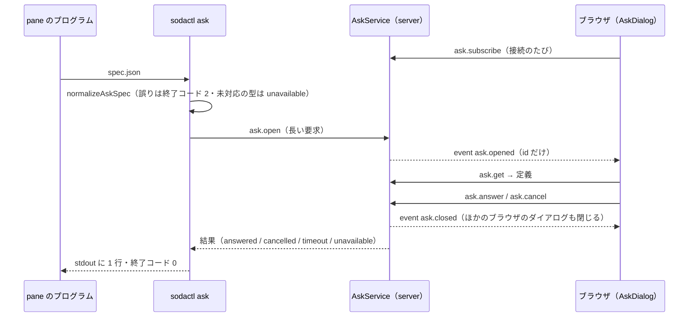

# レビューガイド: `sodactl ask`（pane のプログラムからブラウザ版の画面へ質問のフォームを出す）

## 変更概要 / 目的
pane の中のプログラム（エージェント）が `sodactl ask < spec.json` で質問の定義を渡すと、**その pane を見ているブラウザの画面の上**にフォーム（ダイアログ）が出て、答えが stdout の 1 行の JSON で戻る。
ブラウザが別のマシンでも動く（今の ask-form はサーバ側の画面にウィンドウを開いて見えなかった）。入出力は ask-form と同じ。判断は `decisions.md`（D2〜D9）。差分は protocol・server・cli・web・e2e・docs にまたがる（約 4,000 行。半分はテスト）。

## 重要ポイント
- **ブラウザの見分けは `ask.subscribe`**（D2 (a)）。端末版も `desktop` と名乗るので kind では見分けられない。ブラウザは接続のたびに名乗り、応答で待っている質問を受け取る（再読み込み・再接続の出し直し）。
- **定義・回答はイベントに載せない**（D2 (b)）。全接続に配るイベントは id だけで、定義は `ask.get`（購読済みの画面だけ）で取る。
- **質問の寿命 ＝ `ask.open` の長い要求の寿命**（D2 (c)）。閉じる理由は全部 `AskService.close()` の 1 か所を通る。
- **検査・回答の集め方は protocol の純関数 1 組**（`ask.ts`）。ask-form の `normalize()`・`form.html` の `collect()` と同じ結果になることをテストで固定している。
- **ダイアログは既存の単一の枠とは別枠**（`view.askOpen`）。ほかのダイアログを潰さず重なる。フォーカスは見出し（打っている途中のキーが回答として効かない）。
- 追補（D9）: 対応していない質問の型は黙って落とさず `unavailable`。新しい型の画面は backlog。

## 処理フロー

## 主要な変更箇所
- `packages/protocol/src/ask.ts` — 定義の検査・回答の集め方・回答の検査・上限（`normalizeAskSpec`・`collectAsk`・`checkAskAnswer`）。`messages.ts`・`events.ts`・`errors.ts` に方式 5 つ・イベント 2 つ・code 3 つ。
- `packages/server/src/ask/AskService.ts` — 回答待ちの台帳・購読者・時間切れ・`pane.closed`・切断・数の上限。`composeServer.ts` の配線（2 つの `onClientGone`・`close()` の dispose）。
- `packages/cli/src/commands/ask.ts` — stdin の読み取り・検査・`ask.open`・切断の検知・終了コード。`wsClient.ts` に要求ごとの時間切れ。
- `packages/web/src/components/AskDialog.vue` — ダイアログ本体（出どころの行・確定のキー・即確定・フォーカスの戻り先）。`ask/AskController.ts`（通信）・`store/ask.ts`（待ち行列）・`store/view.ts`（`askOpen`・`modalOpen`）・`StoreAdapter.ts`・`main.ts`・`App.vue` の配線。
- `packages/e2e/src/specs/ask-form*.spec.ts` — ビルドした sodactl を子プロセスで起動し、ブラウザの側で判定する。
- `docs/sodactl.md`「質問のフォーム」・`SKILL.md`・`docs/verification.md`・`docs/machines.md`・`docs/tui-parity.md`。

## リスク / 確認したい点
- **PR #73（ファイルのリンクとドロップ。未マージ）と `messages.ts`・`errors.ts`・`clientError.ts`・`main.ts`・`composeServer.ts` 等の同じ付近を触る**。マージ順で衝突しうる（どちらも「隣に足す」変更）。
- **ループバックでないブラウザ・実機のスマートフォン・Firefox/Safari・実際の ssh 越し・ask-form 本体との突き合わせは未検証**（`docs/verification.md` に手順）。
- `aidev smoke` の 1 本目は、作業ディレクトリ `/workspaces/sodashitsu` で変更前の `main` でも落ちる（既存。test-result 参照）。既存の E2E 19 件も `main` で落ちる。
- hello 前の接続が `ask.subscribe` できる点は許容した（D6。認証済みの接続は pane のシェルを操作できるのと同じ権限）。
- ask-form 側の `ask.py` の変更（`sodactl ask` への切り替え）はこのリポジトリの対象外。契約は `docs/sodactl.md`。`form.html` との違いは「質問が 1 つだけの即確定が矢印キーでは起きない」の 1 点。
