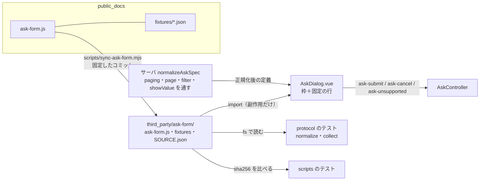

# 仕様: ask-form の部品（`<ask-form>`）の取り込みと、sodactl ask の画面の置き換え

## 概要

public_docs の `ask-form.js`（カスタム要素 `<ask-form>`）と共通の試験データを `third_party/ask-form/` に写し、`AskDialog.vue` を「ダイアログの枠＋固定の行」にして中身を部品に任せる。
protocol は定義の `paging`・`page`・`filter`・`showValue` を検査して通し、誤りに分類（`reason`）を付け、共通の試験データを読むテストを持つ。



## 設計方針

`decisions.md` D3 の 1〜16 が方針と、採らなかった案の理由。要点:

- 写した先は `third_party/ask-form/`。同期は手元の clone から `git show`。手で直していないことは vitest がハッシュで見る。
- 枠は今までの決まり（固定の行・開いたときのフォーカス・`Esc`・背景クリック・閉じたときの戻し先）を持ち続ける。部品はボタン・未回答の表示・ページ・キーを持つ。
- 部品の外にフォーカスがある間の `Ctrl+Enter`・`Alt+PageDown/Up` は、枠が部品へ取り次ぐ。
- ダイアログの高さは `form.html` と同じ手順（最大を与える → `relayout()` → `contentHeight` に合わせる）。
- `spec` は `watch` の中で命令的に 1 回だけ入れる（`structuredClone(toRaw(…))`）。
- 即確定の `Space`・`__other__` は ask-form の側へ依頼済み。直った版に固定し直す。

## 対象範囲

- 追加
  - `third_party/ask-form/ask-form.js`・`fixtures/normalize.json`・`fixtures/collect.json`（写したもの。手で直さない）
  - `third_party/ask-form/SOURCE.json`（同期スクリプトが書く）・`third_party/ask-form/README.md`（出どころ・更新の手順・決まり）
  - `scripts/sync-ask-form.mjs`・`scripts/sync-ask-form.test.ts`
  - `packages/web/src/ask/askFormElement.ts`（部品の読み込みと、要素の型）
  - `packages/protocol/src/ask.fixtures.test.ts`（共通の試験データを読むテスト）
  - `.gitattributes` に 1 行
- 変更
  - `packages/protocol/src/ask.ts`（型・`normalizeAskSpec`・`valueOf`）・`ask.test.ts`
  - `packages/web/src/components/AskDialog.vue`・`AskDialog.test.ts`
  - `packages/web/vite.config.ts`・`packages/web/vitest.config.ts`（`isCustomElement`）
  - `packages/e2e/src/specs/ask-form.spec.ts`・`ask-form-mobile.spec.ts`（セレクタ・ページングの件）
  - `packages/server/src/ask/ask.integration.test.ts`（テストを 1 件足すだけ。AC13）
  - `NOTICE`・`docs/sodactl.md`・`docs/verification.md`・`packages/cli/skills/sodactl/SKILL.md`・`AGENTS.md`（案内に 1 行）
- 触れない（製品のコード）: `AskController.ts`・`store/ask.ts`・`App.vue`・サーバ（`AskService`）・sodactl（`commands/ask.ts`）・`packages/e2e/src/support/ask.ts`・`packages/protocol/src/ask.fixture.json`（E2E の確かめ用の定義）。

## 依拠する既存の事実

出所は `research.md` の F 番号（そこに `file:line` がある）。`js:` は `ask-form.js`。
**research が調べた部品は 94a5ef6（version 1.0.0）**。固定するコミットは 29bfd09（1.0.1。差は `unsupported()` が定義へ書き込まなくなった 2 行。`decisions.md` D2）で、ask-form の側の直しが入ればさらに進む。
取り込むコミットを替えるたびに、94a5ef6 からの `ask-form.js` の差分を読み、下の事実（とくに F10・F11 の安全・F4 のキー）が変わっていないかを確かめて、結果を `decisions.md` に 1 件ずつ残す。

- 部品の受け渡し: `spec`（入れるたびに全部描き直す）・`busy`・`submit()`・`relayout()`・`contentHeight`・`pageCount`・イベント `ask-submit`（`{answers, custom?, edited?, note?}`）・`ask-cancel`（［キャンセル］だけ）・`ask-unsupported`（`{reason}`。マイクロタスクで遅れて出る。ボタンは描かれない）。ページを移る公開のメソッドは無い（F1・F2）。
- 部品のキーは部品の要素に付き、扱ったキーは `preventDefault`＋`stopPropagation`。部品の外にフォーカスがあるときのキーは届かない。`Esc` を取るのは絞り込みの欄に文字があるときだけで、そのとき `<dialog>` の `cancel` は起きない（Chromium の実測）（F4・F14）。
- 即確定: 既に選ばれている選択肢での `Space`・クリックでは確定しない（F4 の実測）。
- フォーカスを動かすのは `go()` の「そのページの番号のボタン」だけ。決定して未回答があったときは、ページは移るがフォーカスは動かさない（F5・F8）。
- ページ分けの優先は `page` → 数の `paging` → 高さ（`paging` が無い／`"auto"`／`true`）。高さでの分割は、部品に高さが付いた最初の 1 回と `relayout()`。中身に合わせて伸びるダイアログでも `max-height` で判定される（F6）。
- 部品に無いもの: `innerHTML` 系・通信・`window`・`location`・保存領域・`cssText`・`href`。`document` は `createElement` だけ。Sodashitsu の CSP で違反 0 件（Chromium の実測）（F10〜F12）。
- 渡していなくても効くもの: 選択肢 12 件以上で絞り込み（`filter ?? options.length >= 12`）・表示名≠値で値の表示（`showValue`）。部品は定義に `_image`・`_audio` を書き込む（F2）。
- 枠に残る責務と部品へ移る責務の切り分け・いまと部品の違い（文言・最小幅・`Ctrl+Enter` の範囲）（F16）。`AskController.answer` は失敗でトーストを出して false を返す（F17）。
- 単体テストの環境（happy-dom 20.14.5）でカスタム要素・Shadow DOM・`showModal` は動く。`wrapper.get` は Shadow DOM を越えない。大きさは全部 0（F19）。`vue()` に `isCustomElement` の設定は無い（F20）。
- E2E: Playwright の CSS ロケータは open の Shadow DOM を越える。変わるセレクタは F22 の表（`.ask-other-text`・`label.ask-opt`・`[data-ask-question]` の数・`script, img` の数・`evaluate` の中の `querySelector`）。
- `normalizeAskSpec` は出力を作り直す（知っている項目だけ写す）。`str()` は文字列でない値を黙って捨てる。空の `showIf: {}` が残る（`ask.ts:278-284`）。`Fail` に分類は無い（F25）。`collectAsk` の複数選択の順は `valueOf`（`ask.ts:338-345`）が `picked` の並びのまま返す。`checkAskAnswer` は順を見ない（F26）。
- sodactl は読んだままの定義を送り、サーバが正規化後の定義を持つ（F28）。古い画面は知らない項目を読まない（F42）。
- 試験データの形: `normalize.json` は `{about, reasons, cases[{name, spec, expect, sodashitsu?}]}`、比べるのは `expect.spec` に書いた項目だけ・誤りは `reason`。`collect.json` は `{about, cases[{name, spec, state, expect}]}`（F29）。固定するコミット 29bfd09 では、`sodashitsu` の欄は「誤り: 知らない型」だけ（`decisions.md` D2 で確かめた）。
- `paging`・`page` の検査の仕様は `ask.py:129-131, 140-141`（F30）。
- `third_party/herdr/` の先例・`scripts/package.mjs` が `third_party` を丸ごと写すこと・`scripts/` のテストの作り（F31・F32・F35）。Web が `third_party/` を読む先例は無い（F31）。
- テーマの変数は `document.documentElement` に付き、CSS の変数は Shadow DOM を越えて届く（F37・F38）。
- 未確認（coding で確かめる）: 値が `__other__` の選択肢があるときの部品の動き（F15 は推測。「既定でその値が選ばれていると描いた直後に例外 → `ask-unsupported`」のほか、利用者が後から選んだときにどうなるかを、単体テストで実際に走らせて確かめる——結果で下の「`__other__`」の扱いを確定する）。
- 未確認（coding で確かめる。research R10・R14）: `packages/web` の外の素の JS を副作用だけで `import` したときに `vue-tsc`・`vite build`・`vite dev`（`server.fs`）が通ること／`toBeFocused` が Shadow DOM の中の要素で通ること／実物の `AskDialog.vue` での高さでのページ分けの出方／Firefox・Safari。

## インターフェース / データ構造

### protocol（`packages/protocol/src/ask.ts`）

```ts
export type AskPaging = "auto" | boolean | number;   // 数は 1 以上の整数

export interface AskQuestion {
  // …今までの項目…
  /** ページの題。書いた質問から新しいページ（空文字も「書いた」）。 */
  page?: string;
  /** 絞り込みの欄を出すか（無ければ部品の既定: 選択肢 12 件以上で出す）。 */
  filter?: boolean;
  /** 表示名と値が違う選択肢に、値を出すか（無ければ部品の既定: 出す）。 */
  showValue?: boolean;
}
export interface AskSpec {
  // …今までの項目…
  paging?: AskPaging;   // 無ければ無いまま（部品の既定は "auto"）
}

/** 定義の誤りの分類。共通の試験データ `normalize.json` の `reasons` の名前のうち Sodashitsu が出すものに、Sodashitsu だけの 2 つ（`not_object`: 定義がオブジェクトでない／`invalid`: 試験データに名前の無い誤り）を足したもの。 */
export type AskSpecFailReason =
  | "not_object" | "questions_empty" | "id_label_required" | "id_duplicate" | "unsupported_type"
  | "options_empty" | "option_value_required" | "option_value_duplicate"
  | "showif_unknown_id" | "showif_invalid" | "paging_invalid" | "page_invalid" | "too_large" | "invalid";
type Fail = { ok: false; message: string; reason: AskSpecFailReason; unsupportedType?: string };
```

- `reason` の割り当て: 既存の各 `fail(...)` に分類を付ける。上限の超過（大きさ・件数・文字数）は全部 `too_large`。試験データに名前の無い Sodashitsu だけの誤り（`__proto__` という id・`type` が文字列でない 等）は `invalid`、定義がオブジェクトでないのは `not_object`。`unsupportedType` があるときは `unsupported_type`。
- `paging`: `undefined`・`null` → 項目なし／`"auto"`・`true`・`false` → そのまま／1 以上の整数（`Number.isInteger`）→ そのまま／それ以外 → `paging_invalid`。
- `page`: `undefined`・`null` → 項目なし／文字列 → 500 文字までそのまま（超えたら `too_large`）／それ以外 → `page_invalid`。検査の位置は「id の重複の後・`type` の前」（対応していない型の質問でも `page` の誤りは誤りにする。`ask.py` と同じ順）。
- `filter`・`showValue`: 真偽のときだけ写す（それ以外は落とす。誤りにしない——知らない値を落とす今までの流儀）。`text` の質問では落とす（選択肢が無い）。
- 空の `showIf`: 正規化した結果が 1 つも残らなければ、項目ごと落とす。
- **`__other__`**: 部品は値が `__other__` の入力を「その他」とみなす（F15）。ask-form の側の直しが入るまで、Sodashitsu は**選択肢の `value` が `__other__` の定義を誤り（`invalid`。終了コード 2）にする**——部品が取り違えると、利用者が選んだ値と違う回答が送られうるため（取り消しで受けるだけでは足りない。上の「未確認」の結果で、断らなくてよいと分かれば外す）。ask-form の側が検査で断る形に直したら、その分類の名前に合わせる。
- `valueOf`（複数選択）: `picked` のうち選択肢にある値を**定義の順**に並べ、「その他」の入力を最後に足す。

### 写した先（`third_party/ask-form/`）と同期

```
third_party/ask-form/
  ask-form.js            写したもの
  fixtures/normalize.json  写したもの
  fixtures/collect.json    写したもの
  SOURCE.json            { "repository": "https://github.com/asaomaro/public_docs", "commit": "<40 桁>", "path": "docs/ClaudeCode/skills/other/ask-form",
                           "retrieved": "<日付>", "version": "<static version>", "files": { "ask-form.js": "<sha256>", "fixtures/normalize.json": "…", "fixtures/collect.json": "…" } }
  README.md              出どころ・決まり（手で直さない）・更新の手順・通す項目を足すときに直す場所
```

`scripts/sync-ask-form.mjs`:

```
node scripts/sync-ask-form.mjs --from <public_docs の clone> --commit <コミット>   # 写して SOURCE.json を書く
node scripts/sync-ask-form.mjs --check [--from <clone>]                          # 写した先が SOURCE.json と一致するか（--from があれば元とも）
```

- 取り方は `git -C <from> show <commit>:<path>/<file>`（作業ツリーの状態に依らない）。コミットは `git rev-parse` で 40 桁にして記録。`version` は写した `ask-form.js` の `const VERSION = '…'` の行から読む（`js:20`。`AskFormElement.version` はこの定数。F1）。読めなければ `"unknown"` と書く（誤りにしない）。
- 終了コード: 0 成功／1 食い違い（`--check`）／2 使い方の誤り・取れない。
- ネットワークは使わない。`.mjs`（`scripts/package.mjs` と同じ流儀）。
- `.gitattributes`: `third_party/ask-form/** -text`（改行の変換でバイトを変えない）。

### Web（`packages/web/src/ask/askFormElement.ts`）

```ts
import "../../../../third_party/ask-form/ask-form.js";   // 副作用: customElements.define("ask-form", …)

/** `<ask-form>` の要素（部品の公開の受け渡しのうち、Sodashitsu が使うもの）。 */
export interface AskFormElement extends HTMLElement {
  spec: unknown;
  busy: boolean;
  submit(): void;
  relayout(): void;
  readonly contentHeight: number;
  readonly pageCount: number;
}
export interface AskFormSubmitDetail { answers: AskAnswers; custom?: string[]; note?: string }
```

### `AskDialog.vue`（枠）

テンプレート:

```html
<dialog id="soda-ask-dialog" class="ask-dialog" aria-labelledby="ask-origin" @cancel="onNativeCancel" @keydown="onKeydown">
  <template v-if="ask">
    <header class="ask-header"><h2 id="ask-origin" ref="titleEl" tabindex="-1" data-ask-origin>{{ origin }}</h2></header>
    <ask-form ref="formEl" class="ask-form" @ask-submit="onSubmit" @ask-cancel="cancel" @ask-unsupported="onUnsupported" />
  </template>
</dialog>
```

- 残すもの: `origin`・開閉の `watch`・`closeDialog`・`restoreFocus`・`onNativeCancel`・`cancel`・`view.setAskOpen`（今のまま）。
- 消すもの: 入力の状態・`collectAsk`／`initialAskState`／`isAskColor` の利用・選択肢と入力欄のテンプレート・下のボタン・それらの CSS（部品へ移る）。
- 足すもの:
  - **`spec` を入れる**: `watch` の「新しい `askId`」の枝で、`nextTick` の中、`showModal()` の後に `el.busy = false; el.spec = structuredClone(toRaw(a.spec))`。同じ `askId` のままの再描画では入れない。
  - **高さ**（`fit()`）: **`spec` を入れる前に** (1) 部品の高さ（`el.style.height`）を「使える最大」にする。それから `spec` を入れる（部品は高さが付いていれば、入れた直後に 1 回ページ分けをする。F6）。続けて (2) `el.relayout()`（高さがまだ 0 で分けられていなかった場合の保険。分け方は同じ結果になる）、(3) `h = el.contentHeight` が 0 より大きければ部品の高さを `min(使える最大, h)` に、**0 なら `el.style.height` を消す**（単体テストの環境・大きさが取れないとき。部品は `flex: 1 1 auto` で中身に合わせる）。
    - 「使える最大」= `window.innerHeight − 16`（`.ask-dialog` の `max-height: calc(100% - 16px)` と同じ）`− ダイアログの上下の枠線 − 固定の行（`.ask-header`）の高さ`。固定の行の高さは `getBoundingClientRect()` で読む。
    - `window` の `resize` では「使える最大」を計算し直し、`min(最大, 前に読んだ contentHeight)` を当て直すだけ（`relayout()` はしない——部品の決まり）。リスナーは開いている間だけ付ける。
  - **`onSubmit(ev)`**: `ev.detail` から `{answers, custom?, note?}` を取り、`el.busy = true` → `controller.answer(askId, body)` → 偽で、まだ同じ質問なら `el.busy = false`（トーストは `AskController` が出す）。
  - **`onUnsupported(ev)`**: `controller.cancel(askId)` を呼び、トースト「このフォームは、この画面では出せません（質問は取り消しました）」（`decisions.md` D3-3 の文言に「質問は取り消しました」を足した）。トーストは `AskController` と同じ手段（toast の store）で枠が出す——`AskController.ts` は変えない。`reason` は画面に出さず、`console.warn` に出す（`reason` には質問の id・型の名前・例外の文が入りうる＝定義に由来する文字列を含む。コンソールに文字として出るだけ）。
  - **`onKeydown(ev)`**（枠が取り次ぐキー）: `ev.target` が部品（`<ask-form>`）のとき、または `Teleport` されたトースト等の中のときは何もしない。それ以外（固定の行にフォーカスがあるとき）で、IME の変換中でなければ:
    - `Ctrl/Cmd+Enter` → `preventDefault()`・`el.submit()`
    - `Alt+PageDown`／`Alt+PageUp` → `preventDefault()`・部品の `shadowRoot` の `[data-ask-next]`／`[data-ask-prev]` が `hidden` でなければ `click()`
- CSS: `.ask-dialog`（今のまま。`display:flex; flex-direction:column`・`max-height: calc(100% - 16px)`）・`.ask-header`・`.ask-origin`、部品に:

```css
.ask-form {
  flex: 1 1 auto; min-height: 0;
  --ask-bg: var(--soda-menu-bg, #282a36); --ask-fg: var(--soda-fg, #f8f8f2); --ask-border: var(--soda-menu-border, #44475a);
  --ask-accent: var(--soda-accent, #6070a1); --ask-accent-fg: var(--soda-accent-fg, #f8f8f2);
  --ask-error: var(--soda-error-fg, #ff5555); --ask-warn: var(--soda-warn-fg, #ffb86c);
}
```

### `isCustomElement`

`packages/web/vite.config.ts`・`vitest.config.ts` の `vue()` に `{ template: { compilerOptions: { isCustomElement: (tag) => tag === "ask-form" } } }`。

## 振る舞いの詳細

- **開く**: 質問が届く → `showModal()` → 固定の行へフォーカス → `spec` を入れる → 高さを合わせる。部品は自分でフォーカスを取らない。
- **ページ**: 部品の動きのまま（`page` → 数の `paging` → 高さ）。高さでの分割は、`fit()` で高さを与えてから `spec` を入れたときに行われる（その後の `relayout()` は同じ高さでのやり直しで、結果は変わらない）。ページを移っても、ダイアログの高さは変わらない（一番高いページに合わせてある）。
- **決定**: 部品の［決定］・部品の中の `Ctrl/Cmd+Enter`・1 行の入力欄の `Enter`（途中のページでは次へ）、または固定の行にフォーカスがあるときの `Ctrl/Cmd+Enter`（枠 → `el.submit()`）。未回答があれば部品が示し、`ask-submit` は出ない。
- **決定して未回答のページへ移されたときのフォーカス**: 部品は動かさない（F5。ページを替え、未回答の質問へスクロールし、状態の行に警告を出す）。AC-I4 が「design に書く」とした行き先はこれ（**部品の動きを受け入れる**。`decisions.md` D4）。AC-I4 の「ページを移ったら番号」は、利用者がページを移ったとき（［次へ］［戻る］・キー・番号・入力欄の `Enter`）の決まり。別のページの入力欄にフォーカスがあるまま決定して移された場合、その欄は見えなくなる（フォーカスがどこに残るかは未確認——E2E で確かめ、見えない要素に残るなら ask-form の側へ伝える）。
- **取り消し**: 部品の［キャンセル］（`ask-cancel`）・`Esc`（`<dialog>` の `cancel`）。絞り込みの欄に文字があるときの `Esc` は絞り込みを消すだけ。
- **送信中**: `el.busy = true` で［決定］［キャンセル］が押せない。`Esc` は今までどおり効く（`cancel` は `sending` を見ない。F16）。
- **次の質問**: `askId` が替わると `spec` を入れ直す（部品が描き直し、ページ分けもやり直す）。
- **再接続**: 今までどおり（切断で一度閉じ、戻ると `ask.subscribe` の一覧から描き直す。入力は消える）。
- **`page` と整数の `paging` を両方書いたとき**: `page` が優先（部品の優先順。F6）。
- **部品が定義に書き込む**: 渡すのは写し（`structuredClone`）なので、store の定義は変わらない。
- **互換**: 古い画面 × 新しいサーバ → 項目が増えても読まない（F42）。古い sodactl × 新しいサーバ → 読んだままを送るので `paging`・`page` が届き、ページに分かれる。不正な値はサーバが `invalid_ask_spec`（終了コード 2）（F43）。新しい sodactl × 古いサーバ → 古いサーバが落とす。新しい画面は高さで分ける（F44）。
- **見た目の違い（部品に替わることで変わるもの。受け入れる）**: 質問の種類の表示（`single` は無し・必須でない `text` は「任意」）／未回答の警告の文言／選択肢の最小幅の既定（150px・説明があれば 220px）／下のボタンに `kbd`（「Esc」「Ctrl+Enter」）／題が `h1`／表示名≠値の選択肢に値／12 件以上で絞り込み／入力欄の 16px は指で触る端末だけ／1 行の入力欄の `Enter` は `Shift` を押していても効く／「その他」の入力欄の `aria-label` は「<その他>の内容」。
- **いままで 1 枚で出ていた定義が、高さに収まらなければページに分かれる**（R1・F23。受け入れる。`decisions.md` D3-7）。既存の E2E への効き方: 補足欄は最後のページ（分かれると `fill` の前にページを移る必要がある）／`Tab` の最初の行き先は番号のボタン／`[data-ask-question]` は隠れた質問・ほかのページの質問も数える。既存の E2E は、**画面の大きさ（1280×720）での実際の出方に合わせて**書き直す（分かれるならページを移る操作を足す。`paging: false` を足して逃げない——AC2 は「同じ回答が出る」こと、AC4 は自動で分かれること）。

## ドメイン固有の考慮

- **安全**: 定義は敵対的な入力。部品は定義の文字を `textContent`・テキストノードでだけ出す（F11。取り込むコミットごとに確かめる——`third_party/ask-form/README.md` の更新の手順に「禁止する語の検索と、スタイル・`src` へ値を入れる箇所の確認」を書く。ask-form の側のテスト `test_ask_form.py` も同じ検索をしている）。CSP は変えない。固定の行は部品の外（Shadow DOM の外）にあり、定義から触れない。
- **`ask-unsupported` の `reason`** は画面に出さない（トーストは固定の文言）。
- **AGENTS.md の条項**: E2E の合否はブラウザの DOM と sodactl の stdout・終了コード（`e2e-observe-browser`）。不具合の修正（空の `showIf`・複数選択の順）には回帰テストを足し、直す前に落ちることを確かめる（`regression-negative-control`。共通の試験データの 2 例がそれに当たる）。
- **ライセンス**: public_docs に `LICENSE` が無い。`NOTICE` には事実を書き、PR で利用者に確認を求める（D3-15）。

## エラー処理 / 異常系

- 同期スクリプト: `--from` が git のリポジトリでない・コミットが無い・ファイルが無い → 終了コード 2 と理由。`--check` の食い違い → 終了コード 1 と、どのファイルか。
- 写したファイルが `SOURCE.json` と違う → `scripts/sync-ask-form.test.ts` が落ちる（どのファイルか・期待と実際のハッシュ）。
- 部品が描けない（`ask-unsupported`）→ 取り消し＋トースト（D3-3）。
- `controller.answer` の失敗 → トースト（今まで）＋`busy` を戻す。
- `structuredClone` が投げる（起きない見込み。定義は JSON 由来）→ `ask-unsupported` と同じ扱い。
- 高さが取れない（`contentHeight` が 0）→ `fit()` の (3) のとおり、与えた高さを消して中身に合わせる。

## 受け入れ基準との対応

- AC1: `scripts/sync-ask-form.mjs` が `--from`・`--commit` から 3 ファイルを写し `SOURCE.json` を書く。`scripts/sync-ask-form.test.ts`: (1) 写した先の各ファイルの sha256 が `SOURCE.json` と一致、(2) 一時ディレクトリに作った小さな git リポジトリから写せて `SOURCE.json` が出来る、(3) 写した後に 1 バイト変えると `--check` が終了コード 1。入力: public_docs の clone とコミット（29bfd09、または依頼した直しの入ったコミット）。
- AC2: 既存の E2E（`ask-form.spec.ts`）の各件を、部品の DOM に合わせたセレクタで通す（回答の JSON は変えない）。色の帯・おすすめ・既定は単体テスト（`AskDialog.test.ts`。`shadowRoot` の中を見る）。定義がページに分かれる場合は、ページを移って答える（上の「見た目の違い」）。入力: 既存の `SPEC`・`ask.fixture.json`。
- AC3: 固定の行は `AskDialog.vue` のテンプレート（Shadow DOM の外）。E2E: 定義の `title` に何を書いても `[data-ask-origin]` の文言が変わらず、部品の題より上にある。単体: 部品の `shadowRoot` の中に `data-ask-origin` が無い。入力: `session` の pane・workspace・tab。
- AC4: protocol が `page`・`paging` を通し（`ask.fixtures.test.ts`・`ask.test.ts`）、部品が分ける。E2E: `page` を書いた定義で `[data-ask-page]` が題つきで並ぶ／`paging: 2` で 2 問ずつ／`paging: false` で番号が出ない／`page`・`paging` 無しで高さに収まらない定義（質問を多く）がページに分かれ、収まる定義は 1 枚／`page` を書くと高さでは分かれない／`page` と `paging: 1` を両方書くと `page` の題で分かれる。入力: 定義の `page`・`paging`、`fit()` が与える高さ（`window.innerHeight` から。「`AskDialog.vue`」の節）。
- AC5: 部品の動き。E2E: 2 ページ目の必須の質問を答えずに 1 ページ目で決定 → 2 ページ目へ移り未回答の表示／答えて決定 → 両方のページの回答が stdout に出る／`showIf` の条件が 1 ページ目・対象が 2 ページ目。入力: 部品の `ask-submit` の `detail`。
- AC6: `packages/protocol/src/ask.fixtures.test.ts` が `third_party/ask-form/fixtures/*.json` を `fs` で読み、全例を回す: normalize は `sodashitsu.expect ?? expect` と、`ok`・`reason`・（あれば）`expect.spec` に書いた項目を比べる／collect は正規化 → `state` を `initialAskState` に重ねる → `collectAsk` の `answers`・`lacking`・`custom`・`note` を比べ、`lacking` が空の例は `checkAskAnswer` が通ることも見る。空の `showIf`・複数選択の順の 2 例は、直す前に落ちることを確かめる。入力: 写した試験データ。
- AC7: `.ask-form` の規則で 7 つの変数を割り当てる。E2E: テーマを切り替え、部品の地の色・文字の色（`getComputedStyle(askForm)` の `backgroundColor`・`color`）・質問の枠の色（`fieldset` の `borderColor`）・選択中の選択肢の枠の色が、そのテーマの `--soda-menu-bg`・`--soda-fg`・`--soda-menu-border`・`--soda-accent` の値になる。入力: `document.documentElement` の変数。
- AC8: `ask-form-mobile.spec.ts`（セレクタを `label.opt` に）。ダイアログが幅に収まる・1 列・最後までスクロールしてタップ・［決定］が見える。高さでページに分かれた場合は、分かれたページの中で同じことを見る（確かめ用の定義に `paging: false` は足さない——実際の出方を見る）。入力: `devices["iPhone 13"]`。
- AC9: 部品の動き。E2E: クリック・タップ・`Enter`・（選ばれていない選択肢での）`Space` で確定／矢印で移っただけでは確定しない。**既に選ばれている選択肢での `Space`・クリック**は、ask-form の側の直しが入ったコミットで通す（入らなければ、その 1 点を既知の差として記録。D3-5）。入力: 部品の `ask-submit`。
- AC10: E2E: 題・説明・質問・選択肢・ページの題に ``・`<script>` を書いた定義で、文字として見える・`dialog` の中に `script` が無い・`src` を持つ `img` が無い（部品が常に描く拡大表示の `img` は `src` 無し）・`window` に印が付かない。CSP: ページの `securitypolicyviolation` を数えて 0（`page.addInitScript` でリスナーを置く。何を観測したかを spec に書く）。入力: 定義の文字列。
- AC11: `normalizeAskSpec` が `paging_invalid`・`page_invalid`・`too_large` を返す（`ask.fixtures.test.ts` の 2 例＋`ask.test.ts` に `page` の長さ・`paging: 0`・`1.5`・`"many"`・`true`〔通る〕）。sodactl は今までどおり終了コード 2（`readAskSpec` は `normalizeAskSpec` の誤りをそのまま使い方の誤りにする——sodactl のコードは変えない。確かめは E2E に 1 件: `paging: "many"` の定義 → 終了コード 2）。入力: 定義。
- AC12: docs の書き換え（`docs/sodactl.md`「質問のフォーム」に `page`・`paging`・`filter`・`showValue`・ページを移るキー・絞り込みの `Esc`・「画面の部品と同期」の節、`docs/verification.md` にページングの手順、skill に `page`・`paging`、`NOTICE`・`third_party/ask-form/README.md`）。`docs/sodactl.md` の「`form.html` は矢印キーで移っただけでも決定する」（research「実装時の注意」の `:286`）は、部品では矢印で決定しないので直す。AC14 の「写し直すたびに確かめる手順」は `third_party/ask-form/README.md` に書き、`docs/sodactl.md` の「画面の部品と同期」の節からそこへ案内する。skill を変えるので、`.aidev/config.yml` の 4 本目の smoke（`sodactl skill | cmp`）と `packages/cli/src/skill.test.ts` を通す。
- AC13: 古い画面は知らない項目を読まない（F42——この作業の前のコミットの `AskDialog.vue` と `collectAsk`・`initialAskState` が、定義の決まった項目しか読まないことをコードで示す。古い画面の実物を並べたテストは作れないので、テストは無い——`test-result.md` の未検証の穴に書く）。古い sodactl × 新しいサーバは、既存のサーバの統合テスト `packages/server/src/ask/ask.integration.test.ts` に 1 件足す（読んだままの定義に `page`・`paging` を入れて `ask.open` → 画面役が受け取る定義に項目がある／不正な `paging` は `invalid_ask_spec`）。サーバの製品のコードは変えない（テストだけ）。新しい sodactl × 古いサーバは、古い `normalizeAskSpec` が知らない項目を落とすこと（この作業の前の `ask.test.ts` の「知らない項目は落とす」の件が示す）。実物の古い版を並べた確認はしない（`test-result.md` に書く）。
- AC14: `pnpm build` の後、`packages/web/dist/assets/*.js` に部品の印（`customElements.define` と `ask-form`）がある（E2E が実物の `dist` で動くことが根拠。あわせて grep で確かめて `test-result.md` に残す）。`scripts/package.mjs` は `third_party` と `packages/web/dist` を写す（F32——配布物を作って `third_party/ask-form/` があることを確かめる）。部品が通信・ページ全体への操作をしないことは、固定するコミットの `ask-form.js` を読んで確かめる（research F10・F11。直しの入ったコミットに替えたら差分を読む）。
- AC15: `onUnsupported` → `controller.cancel`。単体テスト: 部品に描けない定義（知らない型）を入れると `cancel` が呼ばれ `answer` は呼ばれない。入力: 部品の `ask-unsupported`。
- AC16: `normalizeAskSpec` は `edit`・`rank`・`table` を `unsupported_type` で返す（試験データの「誤り: 知らない型」と `ask.test.ts`）。`code`・`group`・`image`・`audio`・`preview`・`thumb` は写さない（`ask.test.ts`: 正規化後に項目が無い）。**`filter`・`showValue` はこの作業で通す**（`decisions.md` D3-12・D4。AC16 の「`filter` は落とされ、絞り込みの欄が出ない」は読み替える: 絞り込みの欄は選択肢 12 件以上か `filter: true` で出て、`filter: false` で出ない）。`ask.test.ts`: `filter`・`showValue` は真偽のときだけ残る・文字列などは落ちる・`text` の質問では落ちる／値が `__other__` の選択肢は誤り。E2E: 13 件の選択肢で絞り込みの欄が出る・`filter: false` で出ない・`showValue: false` で値が出ない。E2E の既存の件（対応していない型 → `unavailable`）。入力: 定義。
- AC-I1: 枠の今までの動き。E2E の既存の件（開く・背景クリックで閉じない・`Esc`・pane が閉じる・sodactl が終わる）。
- AC-I2: 部品（決定・入力欄の `Enter`）＋枠（`Esc`・`Ctrl+Enter` の取り次ぎ）。E2E: 途中のページの入力欄で `Enter` → 次のページ、最後で `Enter` → 決定／ページを移って戻ると答えが残っている。
- AC-I3: E2E: キーだけで「`Tab` → 選ぶ → `Alt+PageDown` → 選ぶ → `Ctrl+Enter`」。固定の行にフォーカスがあるままの `Alt+PageDown`・`Ctrl+Enter` も効く（枠の取り次ぎ）。
- AC-I4: E2E: 開いた直後 `[data-ask-origin]` にフォーカス／［次へ］・［戻る］・`Alt+PageDown`・番号のクリック・途中のページの入力欄の `Enter`、のそれぞれでページを移ると、そのページの番号のボタンにフォーカス／決定して未回答のページへ移されたときは、ページが替わり未回答の質問が見える（フォーカスは部品が動かさない）／閉じると端末へ（既存の件）。
- AC-I5: E2E の既存の件（キーが端末へ流れない・設定のダイアログを潰さない）。`Alt+PageDown`: 枠と部品の両方が `preventDefault` する（E2E で `keydown` の `defaultPrevented` を、固定の行・部品の中の両方で見る）。Firefox・Safari は未検証として残す。

## 実装で変わった点

- **部品は 1.1.1（public_docs 029e17f）に固定**（`decisions.md` D7・D9・D11）。94a5ef6（research が読んだ版）→ 816bf82 → 029e17f の差分は、そのつど全部読んで安全面を確かめた。
- **`__other__` を断る検査は無い**（部品が直り、値が `__other__` の選択肢はふつうの選択肢）。値が空文字の選択肢も回答になる（`valueOf` を直した）。
- **枠が取り次ぐページ移動は、部品の公開のメソッド `el.step(±1)`**（ボタンを押す形ではない）。
- **未回答のフォーカス**: 部品 1.1.0 以降は、最初の未回答の質問の入力へフォーカスを移す（上の「フォーカスは動かさない」は 1.0.1 の動き。E2E は移ることを合否にしている）。
- **即確定**: 1.1.1 で `Space`・`Enter`・クリックは、既に選ばれている選択肢でも 1 回だけ確定する（実際のキー入力で確かめた。`decisions.md` D10・D11）。
- **`sending` の ref は無く、`el.busy` だけ**（`decisions.md` D8）。`structuredClone` が投げたら `el.spec = null` にしてから取り消し＋トースト。描けない定義の取り消し先は、`spec` を入れたときの `askId`（質問が無くなったら戻す）。
- **同期スクリプトに `--dest <フォルダ>`**（テスト用）。書き込みは一時の名前で書いてから rename で置き換え、失敗は終了コード 2。`.prettierignore` に `third_party/ask-form/`。
- **E2E の補助**: `support/askSent.ts`（ブラウザが送った `ask.answer`／`ask.cancel` のフレームを数える）。新しい spec は `ask-form-paging.spec.ts`・`ask-form-extras.spec.ts`。
- **配布物**: `scripts/package.mjs` で作った配布物に `third_party/ask-form/ask-form.js`（リポジトリと同じバイト）と、部品を含む `packages/web/dist` があることを確かめた（`test-result.md`）。
