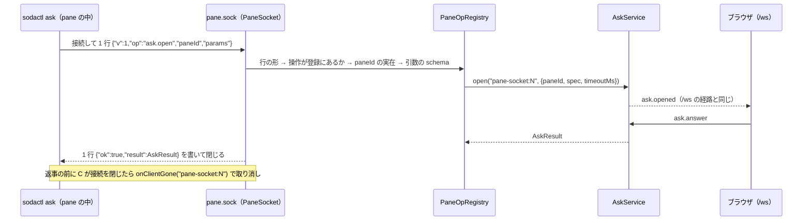

# 仕様: pane の中のプログラム向けのログイン不要の受け口（pane.sock）と、sodactl ask のログイン不要化

## 概要

サーバが状態ディレクトリに unix socket `pane.sock`（0600）を立て、pane の環境に `SODA_PANE_SOCKET` でその場所を知らせる。
受け口は「登録した操作」だけを受ける（`PaneOpRegistry`）。この作業で登録するのは `ask.open` だけ。
`sodactl ask` は、受け口を使える条件のときは受け口へ 1 行の JSON で要求を送り、返事の 1 行を結果にする。使えないときは今までの `/ws` の経路（session cookie）で動く。



## 設計方針

`decisions.md` D3 の (a)〜(p) が方針と、採らなかった案の理由。要点:

- 新しい socket にする（既存の `agent-report.sock` は形が違い、hook の動きを変えない）。1 接続 1 要求・1 行の JSON・返事 1 行。
- 受け口は汎用（操作の登録）。`/ws` の RPC は通さない。受け口専用の code `unknown_op`・`bad_request` で「知らない操作」を見分ける。
- `AskService` は変えない。持ち主は接続ごとの文字列で、接続が切れたら `onClientGone`。
- 0600 になってから見える場所に置く。Windows では出さない。起動に失敗しても `soda serve` は続ける。
- sodactl の経路の選択は共通の 1 か所。`/ws` へ落ちるのは「繋げなかった」「`unknown_op`・`bad_request`」のときだけ。

## 対象範囲

- 追加
  - `packages/protocol/src/paneSocket.ts` — 受け口のやりとりの型・定数・要求の schema（`index.ts` から再輸出）。
  - `packages/server/src/infra/privateUnixSocket.ts` — 0700 の一時ディレクトリで listen → 0600 → rename する共通関数（`infra/` は実在する〔`FsManifestSource.ts`・`GitRunner.ts`・`OsNetworkInfo.ts` がある。design で `ls` した〕）。
  - `packages/server/src/panesocket/PaneOpRegistry.ts`・`PaneSocket.ts`・`askOp.ts` と各テスト。
  - `packages/cli/src/paneSocket.ts`（受け口のクライアントと経路の選択）とテスト。
- 変更
  - `packages/server/src/config.ts` — `paneSocketPathFor(stateDir, os)`。
  - `packages/server/src/session/paneEnv.ts`・`SessionService.ts` — `SODA_PANE_SOCKET` を入れる・落とす。
  - `packages/server/src/composeServer.ts` — 受け口の組み立て・起動・停止・handoff の依存。
  - `packages/cli/src/cliArgs.ts` — `GlobalOpts.urlExplicit`・`GlobalOpts.paneSocket`。
  - `packages/cli/src/commands/ask.ts` — 経路の選択を通す。
  - `packages/cli/src/smoke.ts`・`packages/e2e/src/support/ask.ts`・`packages/e2e/src/specs/ask-form.spec.ts` — 環境の漏れを止める・ログインなしの経路を足す。
  - `packages/server/src/handoffSmoke.ts` — handoff の後のログインなしの ask。`packages/server/src/testkit.ts` — `PaneSocket`・`PaneOpRegistry` を cli の結合テストへ輸出。
  - 既存のテスト: `config.test.ts`・`paneEnv.test.ts`・`packages/cli/src/paneEnv.integration.test.ts`・`ask.test.ts`・`cliArgs` のテスト。
  - 追加のテスト: `packages/cli/src/paneSocket.integration.test.ts`（実物の受け口 × 実物のクライアント）。
  - docs: `docs/sodactl.md`・`docs/machines.md`・`docs/verification.md`・`docs/tls-setup.md`（socket の一覧に 1 行）・`packages/cli/skills/sodactl/SKILL.md`・`AGENTS.md`（案内に 1 行）。
- 触れない: `AskService.ts`・ブラウザ側（`packages/web`）・`AgentReportSocket.ts`・`agent-hook-report.cjs`・`BridgeEndpoint.ts`・`HandoffSocket.ts`・`/ws` の `ask.*` の RPC。

## 依拠する既存の事実

出所は `research.md` の F 番号（そこに `file:line` がある）と、design で読み直した場所。

- `AskService.open(clientId, {paneId, spec, timeoutMs})` は第 1 引数の文字列を持ち主にし、検査の誤り（`invalid_ask_spec`・`not_found`・`ask_busy`）は同期の throw、結果は `Promise<AskResult>`（F2。`packages/server/src/ask/AskService.ts:100-114`）。
- 総数 32 と「1 つの pane に 1 つ」は 1 つの台帳で数えるので、同じ `AskService` を通せば経路が違っても合算される。「接続あたり 8」は持ち主の文字列ごと（F3。`AskService.ts:104-109`）。
- 持ち主の質問を閉じる入口は `onClientGone(clientId)`（F4。`AskService.ts:159-162`）。`open` は askId を返さない。
- `timeoutMs`・`spec` の型の検査は `AskService` に無く、`/ws` の schema `AskOpenParams` が行う（F5。`packages/protocol/src/messages.ts:393-397`）。
- 「どの pane からの質問か」はブラウザが `paneId` から作るので、経路に依らない（F10。`packages/web/src/components/AskDialog.vue:68-77`）。
- 既存の socket のパスは状態ディレクトリから決まり、名前付き session ごとに別（F14・F17。`packages/server/src/config.ts:82-88`・`packages/server/src/persist/namedSession.ts:45-49`）。
- 起動時の unix socket のパスの長さの検査は `agent-report.sock` のパスだけを測る（F15。`config.ts:156-167`）。
- 0600 になってから見える場所に置く手順は `BridgeEndpoint.listen`（F22。`packages/server/src/machine/BridgeEndpoint.ts:91-123`。design で読み直した: `mkdtemp(join(dirname(path), ".b-"))` → listen → `chmod 0o600` → `rename` → 一時ディレクトリを `rm`）。
- 1 行の JSON を読んで返事を書く受け口の前例は `HandoffSocket`（F24。`packages/server/src/handoff/HandoffSocket.ts:49-126`）。
- Windows では立てない・失敗は warn で続ける書き方の前例（F18・F58。`packages/server/src/composeServer.ts:673-689`）。
- pane の環境は `buildPaneEnv` が作り、サーバが管理する変数は `PANE_ENV_DROPPED` にも載せる（F25・F26。`packages/server/src/session/paneEnv.ts:14-29`・`50-71`）。`agentReportSocketPath` は組み立て時に `SessionService` へ渡る（F19。`composeServer.ts:238`・`253`）。
- handoff は `closeClients` で `/ws` を閉じ、socket は閉じずに execve する。元に戻すときは `reopenClients`（F11・F21。`composeServer.ts:448-477`）。引き継いだ pane の環境は起動時のまま（F29）。
- `close()` の順序: `agentReportSocket` は `setReady(false)` の直後に閉じる（F20。`composeServer.ts:731`）。起動失敗時の後始末は `composeServer.ts:704-706`。
- sodactl の `opts.caller` は `SODA_PANE_ID` と `SODA_SERVER_URL` の両方があるときだけ入り、`opts.url` は `--url` → `SODACTL_URL` → `SODA_SERVER_URL` → 既定の順で 1 つの文字列になる。明示したかの印は無い（F34。`packages/cli/src/cliArgs.ts:307-316`。design で読み直した）。
- `runAsk` は pane の外なら標準入力を読む前に `caller_pane_unknown`、定義の誤り・対応していない型では接続しない（F30。`packages/cli/src/commands/ask.ts:80-97`）。`requestAsk` は `timeoutMs + 15 秒` で諦め、サーバの `invalid_ask_spec` を使い方の誤りに読み替える（F31）。
- エラーの終了コード: `CliUsageError` → 2、`RpcFailure(code)` → stderr に `{"error":{code,message}}` で 1（F37。`packages/cli/src/output.ts:94-128`）。`RpcFailure` の code は自由な文字列（F44）。
- E2E の `runAsk` と smoke は `...process.env` を子へ渡し、E2E は必ず token を渡す。smoke の ask はキャッシュがある状態（F47・F49）。
- Node から unix socket へ繋ぐ既存の例は `net.connect(path)`（F40。`packages/server/assets/agent-hook-report.cjs:52-63`）。sodactl 本体には無い。
- 未確認: `parseArgs` に platform を渡す口があるか（coding で確かめる。無ければ既定つきの引数を足す）。`/ws` の経路で `SODA_PANE_ID` を書き換えて別の pane を名乗れること（`resolveCallerPane` は環境の値を信じる、という F34・F35 からの推測。docs に書く前に coding で確かめる）。一時ディレクトリの残骸の扱いが `BridgeEndpoint` と同じであること（F22 は正常時の手順だけ。rename が既存のファイルを置き換えるのは POSIX の rename の動作で、`PaneSocket.test.ts` の「残骸があっても起動できる」で確かめる）。Node が `server.close()` で rename 後の socket のファイルを消すか（`BridgeEndpoint.close` は自分で消している〔F20・A12〕ので、同じく自分で消す）。macOS での動作（手元に無い。`docs/verification.md` の手動の手順に回す）。

## インターフェース / データ構造

### やりとり（`packages/protocol/src/paneSocket.ts`）

```ts
export const PANE_SOCKET_VERSION = 1;
export const PANE_SOCKET_MAX_LINE_BYTES = 1024 * 1024; // 要求 1 行の上限（改行を除く UTF-8 のバイト数）
export const PANE_SOCKET_MAX_CONNECTIONS = 64;         // 同時に開いている接続の上限
export const PANE_SOCKET_REQUEST_WAIT_MS = 10_000;     // 接続してから要求の 1 行が揃うまでの上限

/** 要求（1 行の JSON。末尾は改行）。 */
export const PaneSocketRequest = z.object({
  v: z.literal(PANE_SOCKET_VERSION),
  op: z.string().min(1).max(64),
  paneId: z.string().min(1).max(64),
  params: z.record(z.string(), z.unknown()).optional(), // 省略は {}
});

export type PaneSocketErrorCode = ErrorCode | "unknown_op" | "bad_request" | "pane_socket_busy";
/** 返事（1 行の JSON。書いたら受け口が接続を閉じる）。 */
export type PaneSocketResponse =
  | { ok: true; result: unknown }
  | { ok: false; error: { code: PaneSocketErrorCode; message: string } };

/** この受け口に載せる操作の名前（足すときはここに 1 行）。 */
export const PANE_OP_ASK_OPEN = "ask.open";
export const PaneAskOpenParams = AskOpenParams.omit({ paneId: true }); // { spec, timeoutMs }
```

- 1 接続 1 要求。受け口は改行までを 1 行として読み、返事を 1 行書いて `end` する。2 行目以降は読まない。
- `v` が違う・JSON でない・形が違う・行が上限を超える → `bad_request`。上限の超過は返事を書いてから `destroy`。
- 知らない項目は無視する（`z.object` の既定）。

### サーバ: 操作の登録（`packages/server/src/panesocket/PaneOpRegistry.ts`）

```ts
export interface PaneOpContext {
  /** 要求が名乗った pane（受け口が実在を確かめた後の値）。 */
  paneId: string;
  /** 接続ごとの名前 `pane-socket:<連番>`（持ち主として使える。ほかの接続と重ならない）。 */
  connId: string;
  /** 返事の前に接続が切れた・受け口が閉じた、で abort する。 */
  signal: AbortSignal;
}
export interface PaneOpDef<P> {
  name: string;
  params: z.ZodType<P>;
  /** 結果は JSON にできる値。`RpcError` を投げれば、その code の返事になる。 */
  handler(ctx: PaneOpContext, params: P): Promise<unknown> | unknown;
}
export class PaneOpRegistry {
  register<P>(def: PaneOpDef<P>): void;      // 同じ名前の二重登録は throw（起動時の誤りを早く出す）
  has(name: string): boolean;
  /** 検査して呼ぶ。知らない操作 → unknown_op、schema 違反 → invalid_params、RpcError → その code、想定外 → internal（詳細はログだけ）。 */
  invoke(name: string, ctx: PaneOpContext, rawParams: unknown): Promise<PaneSocketResponse>;
}
```

- `invoke` は handler を `try` の中で `await` する（`AskService.open` の同期の throw を拾う。research「実装時の注意」）。
- 載せてよい操作の条件（docs にも書く）: (1) 対象が呼び出し元の pane に限られる、(2) pane のプログラムがもともと出来ることを超えない（pane の入出力・ほかの pane・設定・認証に触れない）、(3) 秘密を返さない、(4) 量の上限がある。`/ws` の handler をそのまま登録しない。

### サーバ: 受け口（`packages/server/src/panesocket/PaneSocket.ts`）

```ts
export interface PaneSocketDeps {
  registry: PaneOpRegistry;
  paneExists(paneId: string): boolean;
  /** 接続が終わった（返事を書いた・切れた・捨てた）ときに 1 回呼ぶ。ask の取り消しに使う。 */
  onConnectionGone(connId: string): void;
  logger: Logger;
}
export class PaneSocket {
  constructor(deps: PaneSocketDeps);
  listen(path: string): Promise<void>;   // 0700 の一時ディレクトリ → 0600 → rename。失敗したら投げる（呼び出し側が warn で続ける）
  pause(): void;                         // 受け付けを止め、開いている接続を捨てる（handoff の closeClients）
  resume(): void;                        // 受け付けを戻す（handoff の reopenClients）
  close(): Promise<void>;                // 受け付けを止め、接続を捨て、socket のファイルを消す
  readonly connectionCount: number;
}
```

- 接続の扱い: 受け付けが止まっている（`pause` 中）・同時接続が上限以上 → 要求を読まずに `{"ok":false,"error":{"code":"pane_socket_busy",…}}` を 1 行書いて閉じる（質問は出していないと sodactl に分かるようにする。`decisions.md` D3 (e) の code に 1 つ足す）。`pause()`・`close()` が**既に開いている**接続を捨てるときは何も書かない（待っていた質問は取り消されている）。`PANE_SOCKET_REQUEST_WAIT_MS` 以内に 1 行が揃わなければ `destroy`。
- 1 行が揃ったら、次の順で検査する（**この順がこの文書の正**）: (1) JSON と `PaneSocketRequest` の形 → 違えば `bad_request`、(2) `registry.has(op)` が偽 → `unknown_op`、(3) `paneExists(paneId)` が偽 → `not_found`（`pane not found: <id>`）、(4) `registry.invoke`（引数の schema → `invalid_params`、handler）。
  操作を pane より先に見るのは、実在しない pane ＋知らない操作でも `unknown_op` を返して、sodactl が「受け口がその操作を知らない」と見分けられるようにするため（AC14）。`decisions.md` D3 (d) の「共通に行うこと」の並びは順序ではない。
- 返事を書いたら `end`。接続が終わったら（どの終わり方でも）`signal` を abort し、`onConnectionGone(connId)` を 1 回呼ぶ。
- ログ: 操作の名前・paneId・connId・結果の code だけ（引数・結果の中身は書かない）。

### サーバ: ask の操作（`packages/server/src/panesocket/askOp.ts`）

```ts
export function askOpenOp(asks: AskService): PaneOpDef<z.infer<typeof PaneAskOpenParams>> {
  return {
    name: PANE_OP_ASK_OPEN,
    params: PaneAskOpenParams,
    handler: (ctx, p) => asks.open(ctx.connId, { paneId: ctx.paneId, spec: p.spec, timeoutMs: p.timeoutMs }),
  };
}
```

`composeServer` が `onConnectionGone: (connId) => asks.onClientGone(connId)` を渡す（返事を書いた後に呼ばれても、その持ち主の質問はもう無いので何も起きない）。

### サーバ: パス・環境・組み立て

- `paneSocketPathFor(stateDir, os = platform())`（`config.ts`。`agentReportSocketPathFor` と同じく第 2 引数は既定つきで、テストが差し替える）: win32 は `undefined`、それ以外は `join(stateDir, "pane.sock")`。
- `buildPaneEnv` の管理する値に `paneSocketPath?` を足し、あれば `SODA_PANE_SOCKET` を入れる。`PANE_ENV_DROPPED` に `SODA_PANE_SOCKET` を足す。`SessionService` のオプション `paneSocketPath` → `envForPane`・`commandEnv`（`agentReportSocketPath` と同じ通し方）。
- `composeServer`: `paneSocketPath = paneSocketPathFor(options.stateDir)` を組み立て時に決めて `SessionService` へ渡す。`registry.register(askOpenOp(asks))`。`listen()` の 4.5（handoff・bridge の受け口と同じ場所）で `if (paneSocketPath !== undefined) await paneSocket.listen(paneSocketPath).catch(warn)`。
  `close()` では `agentReportSocket?.close()` の隣で `await paneSocket.close()`。起動失敗時の後始末にも足す。handoff の依存 `closeClients` に `paneSocket.pause()`、`reopenClients` に `paneSocket.resume()`。

### sodactl（`packages/cli/src/cliArgs.ts`・`paneSocket.ts`）

```ts
// GlobalOpts に足す
urlExplicit: boolean;      // --url か SODACTL_URL（空でない）を指定した
paneSocket?: string;       // 受け口のパス（環境から決めた。無ければ受け口は使わない）
```

- `globalOptsFrom`: `paneSocket` = `SODA_PANE_SOCKET`（空でなければ）→ 無ければ、`SODA_AGENT_REPORT_SOCKET` の basename が `agent-report.sock` のとき `join(dirname(それ), "pane.sock")` → 無ければ undefined。`platform === "win32"` では常に undefined（`parseArgs` に platform を渡す口が無ければ `process.platform` を既定にした引数を足す）。

```ts
// packages/cli/src/paneSocket.ts
/** 受け口を使うか（使うならパス）。Windows でない・pane の中・パスがある・URL を明示していない・--machine が無い（local は可）。 */
export function paneSocketFor(opts: GlobalOpts): string | undefined;

export type PaneOpOutcome =
  | { kind: "result"; result: unknown }
  | { kind: "fallback"; reason: string };   // 受け口が使えない → 呼び出し側は /ws の経路へ

/** 1 要求を送って返事を待つ。操作のエラーは RpcFailure(code) で投げる。 */
export function callPaneOp(path: string, req: { op: string; paneId: string; params?: Record<string, unknown> }, opts: { timeoutMs: number }): Promise<PaneOpOutcome>;

/** 受け口を使えれば使い、fallback なら viaSession を呼ぶ（操作を足すコマンドはこれだけを使う）。 */
export function viaPaneSocketOrSession<T>(opts: GlobalOpts, paneId: string, op: { name: string; params?: Record<string, unknown>; timeoutMs: number }, viaSession: () => Promise<T>): Promise<T>;
```

`callPaneOp` の分岐:

| 起きたこと | 結果 |
|---|---|
| 接続できない（`connect` が成立する前のエラー: `ENOENT`・`ECONNREFUSED`・`EACCES`・`ENOTSOCK` 等） | `fallback` |
| 返事 `{ok:true}` | `result` |
| 返事 `{ok:false}` で code が `unknown_op`・`bad_request` | `fallback` |
| 返事 `{ok:false}` でそれ以外（`pane_socket_busy` を含む） | `RpcFailure(code, message)`（終了コード 1。`/ws` へ落ちない——handoff の途中は `/ws` も閉じている） |
| 接続できた後、返事の行が揃う前に接続が閉じた（要求の書き込みの途中のエラー〔`EPIPE` 等〕を含む）・返事が JSON でない | `RpcFailure("connection_closed", …)` |
| `timeoutMs` を過ぎた | 接続を捨てて `RpcFailure("timeout", …)` |

`runAsk` は今の流れ（`caller` の確認 → `resolveCallerPane` → `readAskSpec`）の後、`viaPaneSocketOrSession(cmd.opts, paneId, {name: "ask.open", params: {spec, timeoutMs}, timeoutMs: timeoutMs + ASK_REQUEST_SLACK_MS}, () => withSession(…今までの処理…))`。受け口の `invalid_ask_spec` も今までと同じく使い方の誤り（終了コード 2）に読み替える（読み替えは `runAsk` の 1 か所で両方の経路に効かせる）。

## 振る舞いの詳細

- **取り消し**: sodactl が Ctrl+C・kill で終わる → 接続が閉じる → `onConnectionGone` → `asks.onClientGone("pane-socket:N")` → `ask.closed` → ブラウザのダイアログが閉じる（`/ws` と同じ結果）。
- **`--timeout`**: サーバ（`AskService`）が `status: "timeout"` を返す。sodactl 側の保険（`timeoutMs + 15 秒`）は受け口でも同じ。
- **上限**: 総数 32・pane ごと 1 は `/ws` の質問と合算。受け口の同時接続 64 を超えた接続は `pane_socket_busy`（終了コード 1。`/ws` へ落ちない）。「接続あたり 8」（AC4 が design 送りにした数え方）は、持ち主が接続ごとで 1 接続 1 要求なので受け口の質問では必ず 1 になり、効かない。
- **停止（`soda session stop`・SIGTERM）**: 受け口を閉じて接続を捨てる。待っていた sodactl は `connection_closed`（終了コード 1）。socket のファイルは消す。
- **handoff**: `closeClients` で `pause()`（待っていた質問は取り消し・sodactl は `connection_closed`）。pause 中に新しく打った `sodactl ask` は `pane_socket_busy`（終了コード 1）。execve の後、新しい版の `listen()` が rename で置き換える。失敗して元に戻すときは `resume()`。
- **残骸**: 前回の不正終了で `pane.sock` が残っていても、rename が置き換える（unlink は要らない）。一時ディレクトリ（`.p-XXXXXX`）が残っていたら起動時に消さない（害が無い。`BridgeEndpoint` も同じ）。
- **handoff 済みの古い pane**: `SODA_PANE_SOCKET` は無いが `SODA_AGENT_REPORT_SOCKET` から導出したパスで繋がる。
- **独自コマンド（`commandEnv`）**: `SODA_PANE_ID` を入れない実行では `caller` が無いので、今までどおり `caller_pane_unknown`。
- **`sodactl ask` 以外のコマンド**: 何も変わらない（受け口を試さない）。

## ドメイン固有の考慮

- **安全の境界**: 受け口はファイルの権限（同じ利用者）だけで守る。pane のプログラムは `paneId` を自由に名乗れるので、同じ session のほかの pane の名前で質問を出せる（今の `/ws` の経路でも、ログイン済みなら `SODA_PANE_ID` を書き換えて同じことが出来る）。ダイアログには名乗った pane が出る。これを docs に書く。
- **名前付き session**: `pane.sock` は session ごとの状態ディレクトリにあるので、別の session の pane は対象にできない（その session の `paneExists` が見るのは自分の pane だけ）。
- **Windows**: 受け口を出さず、環境にも入れず、sodactl も試さない。今までどおり login が要ることを docs に書く。
- **AGENTS.md の条項**: E2E は合否をブラウザの DOM と sodactl の stdout・終了コードで見る（`e2e-observe-browser`）。今回は不具合の修正ではないが、既存の E2E・smoke の環境の漏れを止める変更（D3 (o)）には回帰テストを付けない（テストの土台の変更で、落ちる条件が開発者の環境に依る。`test-result.md` に確かめ方を書く）。

## エラー処理 / 異常系

- 受け口への壊れた入力: JSON でない・形が違う・`v` が違う → `bad_request` を返して閉じる。1 MiB を超える行 → `bad_request` を書いて `destroy`。途中で切れる → 何もせず後始末。10 秒以内に行が揃わない → `destroy`。どれも例外を外へ出さない（接続ごとの `error` を握る）。
- handler の想定外の例外 → `internal`（message は固定の文言。詳細は warn のログ）。
- 受け口の起動の失敗（権限・パス）→ warn して起動を続ける。pane の環境にはパスが入ったままだが、sodactl は繋げずに `/ws` へ落ちる。
- sodactl: 受け口へ繋げない → 黙って `/ws`。`/ws` が未ログインなら今までどおり `unauthenticated`（終了コード 1）。

## 受け入れ基準との対応

- AC1: ログインなしの pane の中の `sodactl ask` は、`SODA_PANE_SOCKET`（`buildPaneEnv` が入れる）から受け口へ繋ぎ、`ask.open` の結果 `answered` を出す。入力: pane の環境（サーバが入れる）と標準入力の定義。E2E（`support/ask.ts` に token を渡さない呼び方を足す: キャッシュの無い使い捨ての HOME・`SODACTL_TOKEN` なし・`SODA_PANE_SOCKET` はテストが起動したサーバの状態ディレクトリの `pane.sock`。ブラウザで決定）で確かめる。「サーバが pane の環境に入れた値で繋がる」ことは `paneEnv.integration.test.ts` で通しで見る: 実物の pane の中で `printf` した `SODA_PANE_SOCKET` が、そのサーバの `pane.sock`（実在する socket）のパスと一致する。
- AC2: `cancelled`・`timeout`・ブラウザなしの `unavailable` は `AskService.open` の結果がそのまま返事の `result` になる。対応していない型は今までどおり sodactl が接続の前に `unavailable` を出す。入力: 同上。受け口の統合テスト（実物のサーバ＋ `/ws` のブラウザ役。要求はテストが状態ディレクトリの `pane.sock` へ送る）と smoke（キャッシュの無い HOME・`SODA_PANE_SOCKET` はその smoke が起動したサーバの状態ディレクトリの `pane.sock` で `unavailable`）。
- AC3: 受け口は `PaneOpRegistry` に登録した名前しか呼ばない。`pane.write`・`workspace.create` を送ると `unknown_op` が返り、pane の画面と workspace の数が変わらない。入力: 統合テストが受け口へ直接送る行。
- AC4: 表示はブラウザが `paneId` から作る（経路に依らない。E2E でダイアログの最上部の文言を見る）。実在しない `paneId` は受け口が `not_found`。総数 32・pane ごと 1 は同じ `AskService` の台帳で数える（統合テスト: `/ws` で出した質問と同じ pane へ受け口から出すと `ask_busy`）。入力: 要求の `paneId`（sodactl は `SODA_PANE_ID`）。
- AC5: `PaneSocket.listen` は 0600 にしてから rename する。統合テストで `pane.sock` の mode が 0600 であることを見る。Windows では `paneSocketPathFor` が undefined を返し、受け口を立てず環境にも入れない（`config.test.ts`・`paneEnv.test.ts` で platform を差し替えて見る）。別の利用者で繋げないことの実物の確認は `docs/verification.md` の手動の手順。
- AC6: 接続が閉じると `onConnectionGone` → `asks.onClientGone`。統合テスト（受け口へ送って待っている接続を閉じる → `/ws` に `ask.closed`）と E2E（SIGINT でダイアログが閉じる）。入力: sodactl のプロセスの終了。
- AC7: `callPaneOp` が接続できない・`unknown_op` のとき `fallback` → `withSession`。単体テスト（`paneSocket.test.ts`: 無いパス・`unknown_op` を返す偽の受け口）と `ask.test.ts`（fallback で今までの偽の `withSession` が呼ばれる）。未ログインは `withSession` が今までどおり `unauthenticated`。入力: 環境（`SODA_PANE_SOCKET` の有無）と受け口の返事。
- AC8: `paneSocketFor` は `urlExplicit` が真なら undefined。単体テスト（`--url`・`SODACTL_URL` を与えると受け口へ繋がない）。歯止め（`resolveCallerPane`）は経路の選択より前にあるので変わらない。入力: `--url`・`SODACTL_URL`。
- AC9: 「エラー処理」の壊れた入力を `PaneSocket.test.ts` で送り、その後に正しい要求が通ることを見る。入力: テストが送る行。
- AC10: パスは session ごとの状態ディレクトリ（`paneSocketPathFor(resolveSessionStateDir(...))`）。統合テスト: 2 つの状態ディレクトリでサーバを起動し、片方の受け口へもう片方にしか無い `paneId` を送ると `not_found`。入力: 状態ディレクトリ。
- AC11: handoff の smoke（`handoffSmoke.ts`）に足す: handoff の後、ビルドした sodactl（`packages/cli/dist/main.js`）を「handoff 済みの古い pane」の環境——キャッシュの無い HOME・`SODA_PANE_ID`・`SODA_SERVER_URL`・**`SODA_PANE_SOCKET` なし・`SODA_AGENT_REPORT_SOCKET` だけ**——で `ask` させ、`unavailable`・終了コード 0 になる（未ログインなので、受け口を通らなければ `unauthenticated` で 1 になる）。導出そのものは `cliArgs` の単体テスト（`SODA_AGENT_REPORT_SOCKET=/x/agent-report.sock` → `/x/pane.sock`、別の名前・Windows では undefined）。停止後に `pane.sock` が無いこと・残骸があっても起動できることは `PaneSocket.test.ts`。入力: handoff 前に決まった同じパス。
- AC12: docs の書き換え（「対象範囲」の一覧）。`docs/sodactl.md` に節「ログイン不要の受け口（pane.sock）」（使われる条件・落ちる条件・載せてよい操作の条件・登録の仕方・安全の境界・見分け方「`sodactl ask` が `unauthenticated` で終わったら受け口を使えていない」）、`docs/verification.md` にログインなしの ask の手順。4 本目の smoke（`sodactl skill | cmp`）と `skill.test.ts` で skill の整合を見る。
- AC13: `PaneOpRegistry.test.ts`・`PaneSocket.test.ts` で、テスト用の操作 `test.echo`（すぐ返る）を登録し、`callPaneOp` と同じ形の行で呼んで結果とエラーの code（handler が投げた `RpcError`）が返ることを見る。sodactl 側は `packages/cli/src/paneSocket.integration.test.ts` で、実物の `PaneSocket`＋`PaneOpRegistry`（`@sodashitsu/server` の testkit から輸出）に `test.echo` を登録し、実物の `callPaneOp` で呼ぶ——受け口・クライアントのコードに手を入れずに新しい操作が通ることを、この 1 件が示す。入力: テストが登録する操作。
- AC14: 登録に無い名前 → `unknown_op`（`PaneSocket.test.ts`）。sodactl は `unknown_op` で `fallback`（`paneSocket.test.ts`）。入力: 要求の `op`。
- AC15: `SODA_PANE_SOCKET` の値は socket のパスだけ。`paneEnv.test.ts` の「token はどの値にも含まれない」に、`local-auth.json` の秘密と cookie を含めて見る。入力: `buildPaneEnv` の結果。
- AC16: `PaneOpContext.paneId` に要求の `paneId` が入る（AC13 の `test.echo` が受け取った `paneId` を返す）。入力: 要求の `paneId`。
- AC17: 定義の検査は経路の選択より前（`readAskSpec`）なので、ログインなしでも終了コード 2。サーバが断った `invalid_ask_spec`（版の違い）も 2。`ask.test.ts` と smoke（AC2 と同じ環境で `{questions: []}` → 2）。入力: 標準入力の定義。
