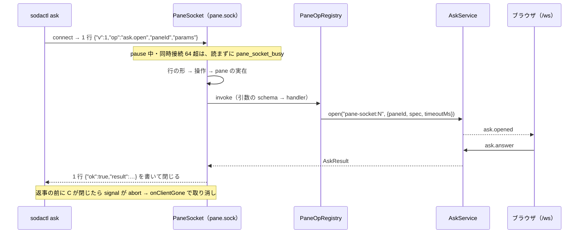
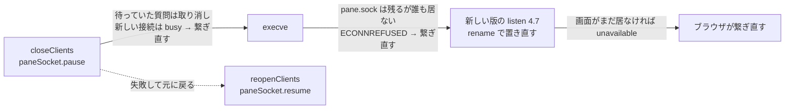

# レビューガイド: pane の中のプログラム向けのログイン不要の受け口（pane.sock）

差分は 62 ファイル・約 +4,900 行。**製品のコードは約 900 行**で、残りはテストと docs。読む順は「受け口の 1 要求の流れ → sodactl の分岐 → handoff の時系列」。

## 変更概要 / 目的

- `sodactl ask` は `/ws`（`sodactl login` の session cookie）を通していたので、pane の中で一度もログインしていないと `unauthenticated` で失敗した。Claude Code の ask-form が pane の中から呼ぶと、黙って別の聞き方（単独のウィンドウ）へ切り替わり、利用者が質問に気づけなかった。
- サーバが状態ディレクトリに unix socket **`pane.sock`（0600）** を立て、pane の環境に `SODA_PANE_SOCKET` を入れる。**ログイン不要・登録した操作だけを受ける汎用の口**で、今載っているのは `ask.open` だけ。
- `sodactl ask` は受け口を使えれば使い、使えなければ今までの `/ws` の経路へ落ちる。ほかのコマンドは何も変わらない。Windows では受け口を出さない。

## 重要ポイント

1. **安全の境界はファイルの権限だけ**（`decisions.md` D3 (h)(j)）。0700 の一時ディレクトリで待ち受け → 0600 → rename で、権限を絞る前に見える場所へ出ない。受け口へ繋げるプロセスは `paneId` を自由に名乗れる（今までの経路でも、ログイン済みなら同じことが出来た。変わったのはログインが要らなくなったこと）。
2. **受け口は `/ws` の RPC を通さない**。`PaneOpRegistry` に登録した名前だけ。検査の順は「行の形（`bad_request`）→ 操作（`unknown_op`）→ pane の実在（`not_found`）→ 引数（`invalid_params`）」——操作を pane より先に見るのは、sodactl が「受け口がその操作を知らない」を見分けるため（D4）。
3. **`/ws` へ落ちる線引き**（D3 (m)・D7・D8）: 落ちるのは「繋がる前のエラー」と `unknown_op`・`bad_request` だけ。繋がった後に返事なしで閉じたら `connection_closed`（落ちない——質問が出ているかもしれず、落ちると二重に出る）。
4. **繋ぎ直し**（D7・D8）: `ECONNREFUSED`（受け口のファイルはあるのに誰も待ち受けていない）と `pane_socket_busy`（受け口が要求を読まずに断った）は、5 秒まで繋ぎ直す。どちらも操作が始まっていないと決まっている場合だけ。
5. **取り消しは `ctx.signal` の abort だけ**（D8）。接続が終わるどの経路でも abort し、`askOpenOp` がその中で `asks.onClientGone(connId)` を呼ぶ。`AskService` は変えていない（持ち主は接続ごとの `pane-socket:<n>`）。
6. **handoff 済みの古い pane**（D3 (b)）: `SODA_PANE_SOCKET` が無くても、`SODA_AGENT_REPORT_SOCKET` が絶対パスで末尾が `/agent-report.sock` なら、同じディレクトリの `pane.sock` を使う。

## 処理フロー

sodactl から見た結果（`callPaneOp`。`packages/cli/src/paneSocket.ts:63`）:

| 起きたこと | 結果 |
|---|---|
| 繋がる前のエラー（`ENOENT`・`EACCES` 等） | `/ws` へ落ちる |
| 繋がる前の `ECONNREFUSED` | 5 秒まで繋ぎ直す → 続いたら `/ws` へ落ちる |
| 返事 `pane_socket_busy` | 5 秒まで繋ぎ直す → 続いたら終了コード 1 |
| 返事 `unknown_op`・`bad_request` | `/ws` へ落ちる |
| 返事 `{ok:true}` | 結果 |
| 返事のそれ以外の code | その code で終了コード 1（`invalid_ask_spec` は 2） |
| 繋がった後、返事の行が揃う前に閉じた・返事が読めない・8 MiB 超 | `connection_closed`（終了コード 1。落ちない） |
| `--timeout` + 15 秒 | `timeout`（終了コード 1） |

handoff の時系列と、その間に打った `sodactl ask`:

## 主要な変更箇所

- `packages/protocol/src/paneSocket.ts` — やりとりの形・定数・code・ファイル名。操作を足すときはここに名前と引数の schema。
- `packages/server/src/infra/privateUnixSocket.ts:22` `listenPrivateUnixSocket` — 0700 の一時ディレクトリ → 0600 → rename（`BridgeEndpoint.listen` と同じ手順。寄せるのは follow-up）。
- `packages/server/src/panesocket/PaneOpRegistry.ts` — 操作の登録と、エラーを code に揃える `invoke`。
- `packages/server/src/panesocket/PaneSocket.ts:120` `listen`・`:149` `pause` — 受け口の本体（行の上限・待ちの上限・同時接続の上限・断り方・後始末）。
- `packages/server/src/panesocket/askOp.ts` — ask の操作（持ち主は `ctx.connId`・pane は `ctx.paneId`・abort で取り消し）。
- `packages/server/src/composeServer.ts:338-343`（組み立て）・`:494`／`:499`（handoff）・`:716`（起動。失敗は warn で続ける）・`:735`／`:764`／`:791`（停止・後始末）。
- `packages/server/src/config.ts` `paneSocketPathFor`・`packages/server/src/session/paneEnv.ts`（`SODA_PANE_SOCKET` を入れる・落とす）。
- `packages/cli/src/cliArgs.ts:153` `paneSocketPathFromEnv`（受け口のパスと導出）・`GlobalOpts.urlExplicit`。
- `packages/cli/src/paneSocket.ts:19` `paneSocketFor`（使う条件）・`:63` `callPaneOp`・`:226` `viaPaneSocketOrSession`。
- `packages/cli/src/commands/ask.ts` — 経路の選択を通す（pane の確認と定義の検査は、どちらの経路でも繋ぐ前）。
- docs: `docs/sodactl.md`「ログイン不要の受け口（`pane.sock`）」、`docs/verification.md`「共通：ログインなしの `sodactl ask`」。

## リスク / 確認したい点

- **実物で確かめていないもの**（`test-result.md`「未検証の穴」）: 別の OS の利用者から繋げないこと・macOS・Windows の実機・版をまたぐ handoff の後の古い pane・Claude Code のサンドボックスを有効にした状態・実物の Claude Code ＋ ask-form でのログインなしの質問（動いているサーバが古い版のため）。
- **この環境での実行**: 既定の Node は v20（`engines` は 24 以上）。合格の根拠にした全体のテスト・smoke は Node 24。smoke は `/workspaces/sodashitsu` から走らせると 1 本目が落ちる（`main` のビルドでも同じ。Web UI の既存の問題の可能性）ので、別のパスの checkout で走らせた。E2E 全体の 18 件と lint の 22 件は `main` と同じ失敗。
- **判断を仰ぎたい点**:
  - `paneId` を名乗れること（重要ポイント 1）を、ログイン不要で許してよいか。受け口が `paneId` を接続元から確かめる手段は無い。
  - 残骸の `pane.sock`（不正終了の後、受け口を置けないまま起動した場合）があると、`sodactl ask` が `/ws` へ落ちる前に 5 秒待つ。
  - handoff が成功した直後は、ブラウザが繋ぎ直すまで `unavailable` になる（呼び出し側は別の聞き方へ切り替わる）。待つようにするかは follow-up。
  - Windows は今までどおりログインが要る（名前付きパイプを同じ利用者に限れるか確かめられていない）。
