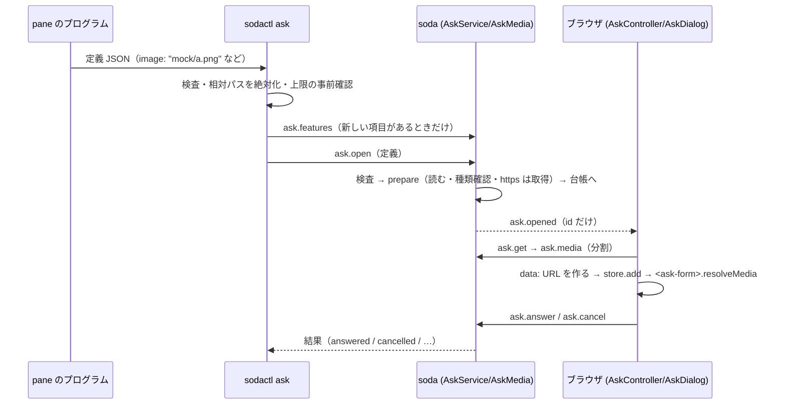

# 仕様: ask-form の画像・音・コード・成果物（view）・edit/rank/table を画面内ダイアログで出す

## 概要

pane の中の `sodactl ask` が受け取る定義に、選択肢のメディア（画像・音・コード）・`group`・`thumb`・`preview`・型 `edit`/`rank`/`table`・成果物 `view` を足し、
すべてダイアログの中で出す。ファイルは **サーバが読んで（外部 URL はサーバが取得して）一時保存し**、ブラウザは新しい `ask.media`（`/ws` の分割取得）で受ける。
成果物の markdown・html は、専用の静的ページ `/ask-view/*`（別ヘッダ・`sandbox`）を **`allow-same-origin` 無しの iframe** で開き、本文は `postMessage` で渡す。
古い sodactl・サーバとの見分けは `ask.features`（サーバ）と `sodactl ask --features`（CLI）で行う。部品 `third_party/ask-form/` は無改変（1.3.0 のまま。写し直さない）。
実装は 3 段（各段で動く状態に保つ）: **S1 メディア**（protocol・server `AskMedia`・`ask.media`・web `resolveMedia`・CSP・外部 URL・機能確認）→ **S2 型**（`edit`/`rank`/`table`）→ **S3 view**（`AskViewer`・静的ページ・キー）。

## 設計方針

採った方針（案 A。依頼元の調査メモ §6）と、退けた案:

- **R2「サーバが読み、`ask.media` で運ぶ」を採る**。退けた案: R1（`sodactl` が data URL にして定義へ入れる）= `pane.sock` の 1 行 1 MiB・定義 256 KiB に当たり画面案の PNG が通らない／R3（サーバが HTTP で配る）= リモートの pane に届かない（中継は `/ws` だけ）・認証面が増える。リモートでも「ファイルを読むのはその pane のサーバ」で一貫する。
- **view の枠は、専用の静的ページ + iframe（`sandbox="allow-scripts"` のみ）+ `postMessage`**。退けた案: `srcdoc`/`blob:`（作成元の CSP を継ぐため、アプリの `script-src 'self'` のもとでインライン script が動かず、親より緩くできない）／ask.py 方式の HTTP 配信（リモートに届かない）。
- **html を含む Markdown の無害化は、枠の隔離と専用 CSP に任せ、DOMPurify 等は足さない**。Markdown の枠は `script-src 'self'`・`default-src 'none'` で、埋め込まれた `<script>`（`innerHTML` では実行されない）も `onerror=` 等のインラインも CSP が止める（実験で確認。下）。サニタイザを足すと mermaid の SVG・表・チェックリストの見え方が変わり、依存が増える割に、CSP が既に止める範囲の上乗せにしかならない。
- **モバイルは縦積み**（枠を上・質問を下。「成果物を見る」の別画面は採らない: 開閉の状態と戻りのフォーカスが増える）。
- **取得に失敗した外部 URL の画像は、質問ごと失敗にせず画像なしで出し、件数を固定の行に出す**。ローカルのファイル・`data:`・`view` の誤りは決定的な呼び出し側の誤りなので、質問を出さず `invalid_ask_spec`（`sodactl` は終了コード 2）にする。
- **機能確認は 2 段**: サーバに新しい RPC `ask.features`（古いサーバは「知らない RPC／操作」を返す＝見分けられる。`requires` のような「古いサーバが黙って無視する項目」は見分けに使えない）、CLI に `sodactl ask --features`（ask.py はこれを 1 回呼ぶ）。

実験（設計の前に実測。Chromium・Playwright。`scratchpad/exp/`）で、★の項目を確かめた:
1. 枠の専用ページが `sandbox allow-scripts; default-src 'none'; script-src 'self'` でも、同じ URL の origin の外部 `<script src>`（marked・mermaid）は読める。
2. 不透明 origin の iframe からの `postMessage` で、親の `event.source === iframe.contentWindow` の検査が成り立つ（`event.origin` は `"null"`）。枠の中から `parent.document`・`localStorage` は SecurityError、`fetch` は `connect-src` で拒否。
3. mermaid（flowchart・sequence・pie・class・gantt）は `script-src 'self'`（eval 無し）で全部 SVG になり、CSP 違反 0。Markdown 内の `<script>` は実行されない。
4. 枠の中のキー（`Escape`・`Ctrl+Enter`）は親の `<dialog>` の `cancel` を起こさない（枠の中で捕まえて `postMessage` で渡す必要がある）。取り次げば親へ届く。
5. html の枠（`script-src 'unsafe-inline' 'unsafe-eval'`・`default-src 'none'`）の `document.write` で、インラインの script が動き、`eval` も動く（スクリプト付き HTML は動く）。

## 対象範囲

- `packages/protocol/src/ask.ts`（型・上限・検査・`collectAsk`・`checkAskAnswer`・参照の分類）、`messages.ts`（`ask.media`・`ask.features`・`ask.answer` の `edited`・回答の値の型）、`errors.ts`（新しい code は足さず `invalid_ask_spec`・`ask_busy`・`ask_closed` を使う）、`paneSocket.ts`（操作 `ask.features`）、`ask.fixture.json`・各 `.test.ts`。
- `packages/server/src/ask/AskMedia.ts`（新設: 読む・検査・保持・分割）・`RemoteImageFetcher.ts`（新設: SSRF 対策つき取得）・`mediaSniff.ts`（新設: 先頭バイトの判定）・`AskService.ts`（`open` の非同期化・保持・破棄・`getMedia`・`features`）・`panesocket/askOp.ts`（`ask.features`）・`surface/methods/ask.ts`・`http/HttpServer.ts`（`/ask-view/*`）・`composeServer.ts`（配線。テスト用の差し替え口）。
- `packages/cli/src/commands/ask.ts`（絶対化・上限の事前確認・`--features`・版の古いサーバ）・`cliArgs.ts`。
- `packages/web`: `ask/AskController.ts`（メディアの取得）・`store/ask.ts`・`components/AskDialog.vue`・`components/AskViewer.vue`（新設）・`public/ask-view/`（静的ページ・同梱ライブラリ）・`ask/mediaUrl.ts`（新設: 組み立て）・CSP（`HttpServer.ts`）。
- `packages/e2e/src/specs/ask-media.spec.ts`・`ask-view.spec.ts`（新設）、`docs/sodactl.md`・`docs/verification.md`・`packages/cli/skills/sodactl/SKILL.md`・`AGENTS.md`（索引）。
- テスト・記録（受け入れ基準が使う置き場所）: `packages/protocol/src/*.test.ts`・`packages/server/src/ask/*.test.ts`・`ask.integration.test.ts`（AC17）・`machines.integration.test.ts`（AC20）・`packages/web/src/ask/*.test.ts`・`components/AskViewer.test.ts`（AC-I5 の取り次ぎの単体テスト）・`askFormElement.test.ts`（部品の `supports.fields` との突き合わせ）・`packages/e2e/src/specs/`・`decisions.md`（AC21）・`test-result.md`（AC22）。
- 触らない: `third_party/ask-form/`・public_docs・TUI（`packages/tui`）。

## 依拠する既存の事実

（出所は `file:行`。依頼元の調査メモの ★ は、この work で確かめたものに「確認」を付けた）

- 検査は sodactl とサーバの 2 か所で同じ `normalizeAskSpec` を使い、サーバは検査後の定義を `AskService` のメモリに保持する: `packages/cli/src/commands/ask.ts` の `readAskSpec`、`packages/server/src/ask/AskService.ts` の `open`（`checked.spec` を `Entry.spec` に保存）。
- 現行の `normalizeAskSpec` は選択肢で `value/label/desc/recommended/colors` しか写さず、`image` 等は黙って捨てる。型は `single|multi|text` 以外を `unsupported_type`（`packages/protocol/src/ask.ts` の選択肢の組み立てと `type` の判定）。
- 定義 256 KiB・質問 100・選択肢 200・同時に待つ質問 32・1 接続 8（`ask.ts` の定数）。`pane.sock` は 1 接続 1 要求・要求 1 MiB・返事 8 MiB（`packages/protocol/src/paneSocket.ts`）、`/ws` の 1 通は 4 MiB（`packages/server/src/ws/WsServerWs.ts` の `MAX_WS_PAYLOAD_BYTES`）。サーバ→ブラウザの 1 通に上限は無い（調査メモ §1。未再確認: 分割で収める前提にするので結論に影響しない）。
- `ask.opened`/`ask.closed` は id だけを配り、定義は `ask.get`/`ask.subscribe`（購読済みの接続だけ）で渡す: `AskService.ts` の `publish`・`get`・`subscribe`。
- 画面: `AskController` が `ask.subscribe` の応答と `ask.get` で定義を取って `store.add` し、`AskDialog.vue` が `structuredClone(toRaw(spec))` を `<ask-form>` に入れる。`resolveMedia` は入れていない（`packages/web/src/ask/AskController.ts`、`AskDialog.vue` の `loadSpec`、`third_party/ask-form/README.md`）。
- 部品 1.3.0 は `edit`/`rank`/`table`・`image`/`audio`/`code`/`lang`/`group`/`thumb`/`preview` を描き、`resolveMedia(ref,"image"|"audio")` を spec を入れた時に**同期で**呼ぶ。返した文字列をそのまま ``・`Audio(src)` に使い、URL の種類を制限しない。`code` は `textContent`（`third_party/ask-form/ask-form.js` の `media()`・`TYPES`・`FIELDS`・`buildEdit`/`buildRank`/`buildTable`・`unsupported()`）。回答の形: edit＝直した文字列（末尾の空白を除く）＋`edited`、rank＝並べた値の配列、table＝`{行の value: 選んだ value}`（同 `ctl[...].get`・`value()`）。
- アプリの CSP は全応答の HTTP ヘッダ `default-src 'self'; connect-src 'self'; img-src 'self' data:; style-src 'self' 'unsafe-inline'; frame-ancestors 'none'` ＋ `X-Frame-Options: DENY`（`packages/server/src/http/HttpServer.ts` の `SECURITY_HEADERS`）。`media-src` は無く `default-src` が効く。静的ファイルは認証なしで配り、無い経路は `index.html` へ落ちる（同 `handleStatic`）。
- 分割転送の先例: `FILE_CHUNK_BYTES = IMAGE_CHUNK_BYTES = 768 KiB`（3 の倍数。base64 の連結が成り立つ）（`packages/protocol/src/file.ts`・`image.ts`）。
- 別のマシン: ブラウザは `/ws?machine=` の中継で、リモートの `ask.subscribe`/`ask.get` を呼ぶ（`packages/server/src/machine/machines.integration.test.ts` の ask の例）。中継は RPC の名前で絞っていない（`ask` を grep して中継側に名前の一覧が無いことを確認。`server/src/machine/` に ask の語は無い）。
- E2E のサーバはプロセス内の `composeServer`（`packages/e2e/src/support/appServer.ts` の `bootServer`）なので、オプションでテスト用の差し替えを渡せる。`sodactl ask` の E2E の道具は `support/ask.ts`（`runAsk`・`runAskWithoutLogin`）。
- ask.py（public_docs origin/main）の `normalize()` が検査する項目・理由の名前: `code_invalid`・`preview_invalid`・`row_default_unknown`・`view_invalid`・`view_missing`・`media_type`・`media_missing`（`fixtures/normalize.json` の `reasons`）。`edit` は `required` が既定で true、`edit` 以外は false（ask.py の `normalize` の `q["required"]`）。`view` は `file`/`text`/`title`/`raw`、Markdown・テキスト 2 MB まで、view があれば `paging` の既定は false（同 `normalize_view`）。
- 共通の試験データ（`third_party/ask-form/fixtures/*.json`）に `edit`/`rank`/`table`・メディア・`view` の例は無い（読んで確認）。Sodashitsu の例は `packages/protocol/src/ask.fixture.json` と各テストに足す。

- 古いサーバの「知らない RPC」は `/ws` で `not_found`（`packages/server/src/surface/ControlSurface.ts:35` `unknown method`）、`pane.sock` で `unknown_op`（`packages/server/src/panesocket/PaneOpRegistry.ts:54`）。確認済み。
- 旧 sodactl は `edit/rank/table` を `normalizeAskSpec` が `unsupportedType` として返し、`runAsk` がサーバへ送らず `{status:"unavailable"}` を印字する（`packages/cli/src/commands/ask.ts` の `readAskSpec`・`runAsk`）。確認済み。旧 sodactl は `image` 等の未知項目を検査で捨てるが、送るのは「読んだままの JSON」（同 `readAskSpec` の `spec: parsed`）。
- 閉じる経路は 5 つ: 回答・取り消し（`ask.cancel`）・時間切れ・pane が閉じた（`pane.closed`）・呼び出し側の切断/停止（`onClientGone`・`dispose`）（`AskService.ts` の `close` の呼び出し元）。
- ダイアログの既存の仕組み: `Esc`→`cancel`→`controller.cancel`・`restoreFocus`・`view.setAskOpen`（質問が開いている間キーが端末へ流れない）は `AskDialog.vue`（`onNativeCancel`・`restoreFocus`・`setAskOpen`）。`origin`（固定の行の文）も同ファイルの computed `origin`。部品の拡大表示は `img` を使う（`ask-form.js` の `lbImg.src`。調査メモ §2）。
- 全応答への共通ヘッダは `handle` の先頭で `res.setHeader` される（`HttpServer.ts:86`）。`/ask-view/*` はその後で同名ヘッダを**上書き**（`Content-Security-Policy`・`X-Frame-Options`）し、js・vendor では `X-Frame-Options` を削除し `Content-Security-Policy` を削除する（`removeHeader`）。
- autofocus: 実験（上の 1〜5 に加えて 6）で、不透明 origin の iframe の中の `autofocus` は「Blocked autofocusing on a <input> element in a cross-origin subframe」で効かないことをコンソールで確認した。調査メモの★は 1〜6 で全部実測済み（未実測の★は無い）。

## インターフェース / データ構造

段の割り当て: **S1** = メディア（`image/audio/code/lang/group/preview/thumb` の検査・`AskMedia`・`RemoteImageFetcher`・`ask.media`・`ask.features`・`sodactl ask --features`・`media-src data:`・`resolveMedia`）／**S2** = 型（`edit/rank/table`・`ask.answer` の `edited`・辞書の回答）／**S3** = view（`view` の検査・静的ページ・`AskViewer`・ヘッダ）。ただし `ask.answer` の型（`edited`・辞書）と `view` の検査は T1・T2 で protocol に先に入れてよい（挙動は S2・S3 で有効になる）。

### 定義（protocol）

```ts
// 型
type AskQuestionType = "single" | "multi" | "text" | "edit" | "rank" | "table";
interface AskOption { value; label; desc?; recommended?; colors?;
  image?: string; audio?: string;   // 参照。入力では path / https URL / data: URI。配る定義では "media:<id>"
  code?: string; lang?: string; group?: string; }
interface AskRow { value: string; label: string; desc?: string; default?: string }
interface AskQuestion { /* 既存 */ preview?: "side"|"inline"; thumb?: number /*20..2000 整数*/;
  text?: string /*edit。最初の文面。無ければ default の文字列*/; rows?: number /*edit: 1..60*/ | AskRow[] /*table*/;
  mono?: boolean; rowLabel?: string; pickLabel?: string; }
interface AskViewSpec { title: string; file?: string; text?: string; raw?: true }   // AskSpec.view（入力の正規化後。配る定義には残さない）
type AskAnswerValue = string | string[] | Record<string, string>;                 // table は辞書
interface AskPending { askId; paneId; spec: AskSpec; media?: AskMediaInfo[]; view?: AskViewItem[]; warnings?: number }
interface AskMediaInfo { id: number; kind: "image"|"audio"|"text"|"markdown"|"html"; mime: string; bytes: number }
interface AskViewItem { title: string; kind: "text"|"image"|"markdown"|"html"; media: number }
```

- `normalizeAskSpec` が足す検査（誤りの分類は共通の試験データの `reasons` の名前に合わせる）: `code`/`lang`/`group`/`image`/`audio` が文字列でなければ `code_invalid`（`image`/`audio` は `media_invalid` を新設）・`preview` が `side`/`inline` でなければ `preview_invalid`・`thumb` は 20〜2000 の整数だけ残す（それ以外は落とす）・`rows`（table）は 1 つ以上で `default` が `options` に無ければ `row_default_unknown`・`edit` の `required` 既定 true・`rank`/`table` は `options` 必須（`options_empty`）・`view` は 1〜8 件（`view_invalid`）で、`file` と `text` はどちらか 1 つ。`view` があり `paging` が無ければ `paging: false`。
- 参照の分類（`classifyMediaRef(ref)`。protocol の純粋関数）: `https://…`（画像だけ）／`data:image/(png|jpeg|gif|webp|avif|svg+xml);base64,…`・`data:audio/…;base64,…`／絶対パス（`/` 始まり。Windows は `X:\` 始まり。`~/` は sodactl が展開済み）／その他（相対・`http:`・`file:`・`media:`・`javascript:` 等）は `media_invalid`。`media:` で始まる参照は pane のプログラムからは受け付けない（サーバが付け直すものと混同させない）。
- 上限の適用先: `ASK_MEDIA_FILE_MAX` はすべての 1 ファイル（html の view を含む）、`ASK_MEDIA_TEXT_MAX` は markdown・text の view、`ASK_CODE_MAX` は `code`、`ASK_LANG_MAX` は `lang`（いずれも `normalizeAskSpec` が超過を `too_large`）。
- 上限（定数）: `ASK_MEDIA_FILE_MAX = 8 MiB`・`ASK_MEDIA_TEXT_MAX = 2 MiB`（markdown・text の view）・`ASK_MEDIA_TOTAL_MAX = 24 MiB`・`ASK_MEDIA_FILES_MAX = 32`・`ASK_MEDIA_SERVER_MAX = 128 MiB`・`ASK_VIEW_MAX = 8`・`ASK_CODE_MAX = 50_000` 文字・`ASK_LANG_MAX = 40`。`ASK_PENDING_MAX` と合わせると、1 質問 24 MiB × 32 質問 = 768 MiB になりうるので、**サーバ全体 128 MiB** を別に持つ。
- 回答: `ask.answer` に `edited?: string[]` を足し、`answers` の値に辞書（`table`）を許す（zod: `z.record(string max 400, z.string().max(ASK_ID_MAX*2))` の枝）。結果 `AskResult.answered` に `edited?: string[]`。`checkAskAnswer` の追加: `edit`＝文字列（`required` が true なら空は断る）・`rank`＝選択肢の value の並べ替え（過不足・重複なし）・`table`＝キーが行の value 全部と一致し、値がすべて選択肢の value・`edited` の id は表示中の `edit` の質問だけ。`collectAsk` は、`AskFormState` に `order`（rank）・`rowPick`（table）を足し、`edit` は `text` から読む（`edited` を返す）。

### 機能確認

- サーバの RPC `ask.features`（`/ws` の `ask.features`・`pane.sock` の操作 `ask.features`）→ `{ features: string[], limits: AskLimits }`。`features` は `"media"`・`"view"`・`"types:edit"`・`"types:rank"`・`"types:table"`・`"remote-image"`。`AskLimits` は上の上限の数。古いサーバは `not_found`（`/ws`）／`unknown_op`（`pane.sock`）を返す。
- `sodactl ask --features`（定義は読まない。標準入力を使わない）→ 標準出力に 1 行の JSON `{ "sodactl": ["media","view",…], "limits": {…}, "server": { "features": […], "limits": {…} } | null }`。サーバへ繋げない・古い（`ask.features` を知らない）ときは `server: null`。終了コード 0。呼び出しは pane の中（`SODA_PANE_ID`）でだけ意味がある（無ければ `server: null` で 0）。
- `sodactl ask`（定義あり）: 新しい項目（型 `edit/rank/table`・メディア・`view`）を含む定義は、**送る前に** `ask.features` で確かめ、無ければ（古いサーバ）`{"status":"unavailable","reason":"this server does not support ..."}` を返す（サーバへは `ask.open` を送らない）。含まない定義は今までどおり（`ask.features` を呼ばない）。
- ask.py 側の使い方（public_docs への改修案。この work では書かない）: `sodactl ask --features` が通り（終了コード 0）かつ `server` に必要な機能があれば `sodactl ask` へ渡す。通らない（古い sodactl は `--features` を知らず終了コード 2）なら窓へ。上限は `limits` で事前確認し、超えるなら窓へ落とさずエラー（終了コード 1）にする。

### サーバ: `AskMedia`

```ts
class AskMedia {
  constructor(opts: { fetcher: RemoteImageFetcher; reader?: FileReaderPort; logger? })
  /** 定義の参照を解決して読み、{spec(参照を media:N に付け替え), media: Map<number, Buffer+info>, view, warnings} を返す。誤りは RpcError("invalid_ask_spec", …) */
  prepare(spec: AskSpec, signal: AbortSignal): Promise<Prepared>
}
```

- 走査: 選択肢の `image`/`audio`、`view` の `file`/`text`。合計・個数・全体の上限は読む前の `stat` と読んだ後のバイト数の両方で数える（`open` の後の `fstat` で通常ファイルと大きさを確認。FIFO・デバイス・ディレクトリは拒否。読むのは最大 `上限+1` バイトまで）。同じパス・同じ URL・同じ `data:` は 1 つにまとめる（合計に 1 回だけ数える）。
- 種類の判定: 拡張子の許可リスト（画像 png/jpg/jpeg/gif/webp/avif/svg、音 wav/mp3/ogg/oga/opus/m4a/aac/flac、view は html/htm/md/markdown/画像/UTF-8 のテキスト）**と**先頭バイト（`mediaSniff.ts`: PNG・JPEG・GIF・RIFF+WEBP・`ftyp`+avif/avis・`<svg`（BOM・空白・XML 宣言・コメント・DOCTYPE の後）、RIFF+WAVE・ID3/MPEG のフレーム同期・OggS・`ftyp`・ADTS・`fLaC`）が合うこと。MIME は**判定した種類**から決める（拡張子や Content-Type を信用しない）。テキスト・Markdown・HTML は NUL バイトが無く UTF-8 として正しいこと（`TextDecoder` の fatal）。
- 外部 URL: `RemoteImageFetcher`（下）。失敗は `warnings++` で、その `image` の項目を定義から外す（選択肢は残る）。
- 配る定義: 参照を `media:<id>`（id は 0 から。メディアごとに 1 つ）に付け替え、`view` は `AskPending.view` に分けて持つ（定義からは外す）。付け替えた後の定義を `AskService` が保持する。
- 保持: `Entry.media`（Buffer の Map）。質問を閉じる（`close`）で破棄し、サーバ全体の合計（`AskService.mediaBytes`）から引く。`prepare` の最中に質問が取り消された（`signal`）なら、読んだ分を捨てる。
- 全体の 128 MiB は、個別・合計（質問内）・個数は読む前の `stat` と読んだ後のバイト数の両方で検査するのに対し、サーバ全体は `prepare` が確定した（保持する）時点で足して検査し、超えるなら `ask_busy`（「too much media is waiting」）。読んでいる最中の分は数えない（確定は同期処理なので、同時に 2 つが確定しても片方だけが通る）。

### サーバ: `RemoteImageFetcher`（SSRF 対策）

- `https:` のみ・ポート 443 のみ・URL に認証情報（`user:pass@`）があれば拒否・ホスト名は `dns.lookup(host, {all:true})` で**全アドレス**を検査し、1 つでも拒否の範囲なら拒否。拒否の範囲: IPv4 `0.0.0.0/8`・`10/8`・`100.64/10`・`127/8`・`169.254/16`・`172.16/12`・`192.0.0/24`・`192.168/16`・`198.18/15`・`224/4`・`240/4`、IPv6 `::`・`::1`・`fc00::/7`・`fe80::/10`・`ff00::/8`・`64:ff9b::/96`・IPv4 射影（`::ffff:a.b.c.d` は埋め込んだ IPv4 で判定）、IP 直書きのホスト（`http://[::1]`・`0x7f.1`・10 進整数の `2130706433`）は URL 解析（`new URL` が正規化する）後に同じ検査。
- 接続は、検査した IP に固定する（`https.request` の `lookup` で検査済みのアドレスを返す＝DNS リバインディングで接続時に別のアドレスへ変わらない）。TLS の SNI・証明書の検証は元のホスト名で行う。プロキシの環境変数は使わない（直接）。
- リダイレクト（301/302/303/307/308）は最大 3 回、各回で上記を再検査（`Location` は絶対化し、`https:` 以外・別の検査違反は拒否）。**Cookie・Authorization・Referer・Origin は付けない**（付けるのは `Accept`・`User-Agent: sodashitsu-ask`・`Accept-Encoding: identity`）。
- 全体の時間 10 秒（リダイレクトを含む。`AbortSignal.timeout`）・本文 8 MiB（受信しながら数え、超えたら中断）・`Content-Type` が許可する画像の MIME（`image/png|jpeg|gif|webp|avif|svg+xml`）であること**かつ**先頭バイトが同じ種類であること。同時 4 件まで。
- テスト用の差し替え口: `AskMediaOptions.fetcher`（インターフェース `fetchImage(url, signal): Promise<{bytes: Buffer, contentType: string}>`）。`composeServer(args, { askImageFetcher: fetcher })`（実装した名前。coding で決定）（E2E・結合テストが偽の取得を渡す）。IP の検査（`isBlockedAddress`）・リダイレクトの規則・上限は、`RemoteImageFetcher` を実物のまま、`lookup`・`request` を差し替えて単体テストする。

### `ask.media`・配布

- `ask.media { askId, id, offset }` → `{ base64: string, size: number, eof: boolean }`（`FILE_CHUNK_BYTES` ごと。`ask.subscribe` 済みの画面だけ。`ask_closed` は知らない askId・購読していない接続、`invalid_params` は範囲外の id・offset）。`AskPending.media` に id・種類・MIME・バイト数を載せる（バイト列は載せない）。`ask.opened` は**メディアが全部揃ってから**配る（`prepare` が終わってから台帳に載せる）。
- `ask.open` の流れ: ①検査 ②pane の実在・同時数の上限（`prepare` の前に確かめる＝無駄に読まない）③`prepare`（非同期）④購読者の確認 ⑤台帳へ。`prepare` の最中に呼び出しの接続が閉じたら中断する（`onClientGone`）。同じ pane への 2 つ目の `ask.open` は、`prepare` の最中でも `ask_busy`（占有を ② で先に取る）。

### web

- `AskController`: `ask.subscribe` の応答・`ask.opened`→`ask.get` の後に、`AskPending.media` を `ask.media` で全部取る（3 並列。1 つのメディアの片を順に）。base64 の片を連結し（片は 3 の倍数なので文字列のまま連結できる）、`data:<mime>;base64,<…>` の URL を作る。`text`/`markdown`/`html` は UTF-8 の文字列に復号する（`atob`→`TextDecoder`）。取得に失敗した画像・音は参照を捨てる（プレビューなし）。**`view` のメディアが取れなければ質問を取り消す**（成果物を見ないまま答えさせない）。揃ってから `store.add`（`resolveMedia` が同期で呼ばれるため）。取得の最中に `ask.closed`・切断・マシンの切り替えが来たら破棄（世代管理は既存の `generation`）。
- `store/ask.ts`: `AskPending` に `resolved: { urls: Record<string,string>; views: AskViewLoaded[] }`（`AskViewLoaded = { title; kind: "text"|"image"|"markdown"|"html"; text?: string; url?: string }`。text/markdown/html は復号した文字列、image は `data:` URL） を足した形を持つ（`ask.subscribe` の応答の置き換えは取得が終わってから）。
- `AskDialog.vue`: `el.resolveMedia = (ref) => resolved.urls[ref] ?? null`（`media:` 以外は null）。`view` があれば、固定の行の下に `AskViewer` を左（モバイルは上）に置く。幅 `min(1400px, 100% - 16px)`・高さは使える最大（`max-height` いっぱい）・部品の幅 430px。部品の高さを中身に縮めない（枠の高さに合わせる）。
- `AskViewer.vue`: 固定のラベル行（アプリが描く。「pane『…』の成果物（隔離表示）」。pane の名前は `origin` と同じ出どころ）＋タブ（`role="tablist"`・矢印キー）＋ステージ。text＝`<pre>`（`textContent`）・image＝``（`alt=""`）・markdown/html＝`<iframe sandbox="allow-scripts" referrerpolicy="no-referrer" src="/ask-view/<markdown|html>.html">`。**`allow-same-origin` を付けない**（属性は定数で、テストが `allow-same-origin` の不在を見る）。iframe が `{type:"ready"}` を送ってきたら（`ev.source === iframe.contentWindow`）、`{type:"ask-view", kind, source, dark}` を `postMessage(…, "*")`（不透明 origin のため `"*"`。内容は利用者に見せる成果物だけ）。キー: 枠から `{type:"key", key, ctrl, meta, alt}` が来たら（`ev.source` が自分の iframe のときだけ）、`Escape`→取り消し・`Ctrl/Cmd+Enter`→`submit()`・`Alt+PageUp/Down`→`step()` に取り次ぐ（それ以外は無視）。
- CSP: `media-src data:` を足す（`HttpServer.ts` の `SECURITY_HEADERS`。ほかは変えない）。`frame-src` は `default-src 'self'` のまま（同じ origin の `/ask-view/*`）。

### 静的ページ `/ask-view/*`

- `packages/web/public/ask-view/`: `markdown.html`・`markdown.js`・`html.html`・`html.js`・`vendor/marked.umd.js`・`vendor/mermaid.min.js`・`vendor/SOURCE.json`（版・出どころ・sha256）・`vendor/LICENSE-*.txt`（public_docs の origin/main の `vendor/` から配布元のまま写す。単体テストが sha256 を固定）。Vite は `public/` をそのまま `dist` に出す。
- 配信（`HttpServer.handleStatic` の前に `/ask-view/` の経路を設ける）: 許可リストにある名前だけ（それ以外は 404 で `index.html` へ落とさない）・GET/HEAD のみ。`markdown.html`: `Content-Security-Policy: sandbox allow-scripts; default-src 'none'; script-src 'self'; style-src 'unsafe-inline'; img-src data:; frame-ancestors 'self'; base-uri 'none'; form-action 'none'` ＋ `X-Frame-Options: SAMEORIGIN`。`html.html`: `sandbox allow-scripts; default-src 'none'; script-src 'self' 'unsafe-inline' 'unsafe-eval'; style-src 'unsafe-inline'; img-src data: blob:; font-src data:; media-src data: blob:; frame-ancestors 'self'; base-uri 'none'; form-action 'none'` ＋ `X-Frame-Options: SAMEORIGIN`（`connect-src` は `default-src 'none'` に従い拒否＝外へ送れない）。js・vendor は `X-Frame-Options` を付けず、CSP は付けない（スクリプトの読み込みだけ）。いずれも `X-Content-Type-Options: nosniff`・`Referrer-Policy: no-referrer`。
- `allow-popups`・`allow-downloads` は**付けない**（ask.py は付けるが、popup の URL に本文を載せて外へ出せるため。外への通信を止める決定に合わせる。外部リンクは開けない＝許容。理由は decisions）。
- `markdown.js`: `message` を受け（`ev.source === parent` のときだけ）、`marked.parse(src,{gfm:true})` を `innerHTML`（枠の中。不透明 origin・CSP の内側）、リンクは `target=_blank rel=noopener` は付けない（開けないので `href` を残さず文字にする）、`mermaid` のコードは `mermaid.initialize({securityLevel:'strict'})` で SVG に差し替える（描けない図はコードのまま理由を添える）。`html.js`: `message` を受け（同じ検査）、`document.open(); document.write(html); document.close()` の後に `window` の `keydown`（capture）で `Escape`・`Ctrl/Cmd+Enter`・`Alt+PageUp/Down` を親へ `postMessage` する。どちらも読み込み後に `{type:"ready"}` を親へ送る。

## 振る舞いの詳細



- 参照の解決は、サーバのマシンで行う（別のマシンの pane ではそのマシンの soda が読む）。`sodactl` は cwd からの絶対パスにして送る（`~/` は展開）。`/ws` 経由でも同じ（サーバが別のマシンなら、パスはそのサーバのファイルシステムで解かれる＝既存の挙動と同じ前提を docs に書く）。
- `view` の `file` のパスの扱いも同じ。`text` は定義の中の文字列。
- 失敗の扱い: ローカルのファイル・`data:`・`view` の誤りと上限の超過は `invalid_ask_spec`（理由に場所 `questions[i].options[j].image` と種類 `file not found`/`type mismatch`/`too large` 等）。外部 URL の取得失敗・種類違い・サイズ超過は、その画像だけ外して `warnings`（件数）に数える。
- ダイアログの固定の行は `warnings > 0` のとき「（画像 N 件を取得できませんでした）」を足す（アプリが描く文字。定義の文字を使わない）。
- 既存の質問（新しい項目なし）は経路を変えない: `prepare` は走査して何も無ければ即座に返る。

## ドメイン固有の考慮

- AGENTS.md の「点検とテストの掛け方」: 壊れやすいタスク（protocol の検査・`AskMedia`・SSRF・HTTP のヘッダ・`AskService` の台帳）だけに `taskcheck` を掛け、文書・見た目だけのタスクは掛けない。差分が大きいので全体の点検（`cross`）を最後に 1 回。全体テストは実装セッションが 1 度流して、二重に流さない。
- 条項: `e2e-observe-browser`（合否は DOM の実測・ブラウザが受けたフレーム。音は代わりに `Audio` の呼び出しを観測し、spec のコメントに書く）、`regression-negative-control`（負の対照: 種類確認・IP 検査・`allow-same-origin`・SVG のスクリプトを外すと落ちる）。
- 識別子: `askId`・pane の id の形に依存しない（文字列として扱う）。
- `third_party/ask-form/` は触らない。部品の `supports.fields` を `AskFormElement` 側のテストで、protocol が通す項目の一覧と突き合わせる（既存のテストがあれば拡張）。

## エラー処理 / 異常系

- `ask.open` で `prepare` が失敗: `invalid_ask_spec`（`sodactl` は終了コード 2。標準エラーに `invalid ask spec: <理由>`）。取り消し・切断で中断: 何も返さない（呼び出しが終わっている）。
- 古いサーバ（`ask.features` を知らない）× 新しい項目: `unavailable` ＋理由。古い sodactl × 新しいサーバ: 古い sodactl は新しい項目を検査で落とさず（旧 `normalizeAskSpec` は項目を無視）そのまま送るので、`edit/rank/table` は旧 sodactl 自身が `unavailable`（既存の挙動）、`image` 等は旧 sodactl が送り、新しいサーバが相対パスを `media_invalid`（絶対でない）にして終了コード 2。この組み合わせは ask.py が `--features` で見分けて使わない（旧 sodactl は `--features` を知らず窓へ）。
- ブラウザ: `ask.media` の失敗（`ask_closed` 以外）は、画像・音は参照を捨てて出す、`view` は質問を取り消してトースト「成果物を読み込めませんでした」。
- 枠の読み込み失敗（静的ページが 404 等）: ステージに固定の文「成果物を表示できませんでした」。質問の回答は続けられる（成果物なしで承認されうる点は docs に注意として書く）。
- メモリ: 質問が閉じるたび破棄・全体 128 MiB。

## 受け入れ基準との対応

- AC1: 入力＝定義の `image`（sodactl が絶対化したパス）→ `AskMedia` が読み `media:N` に付け替え → `AskController` が `ask.media` で取り `data:` URL にして `resolveMedia`。E2E: 部品の Shadow DOM の `img` の `naturalWidth`・`currentSrc` が `data:`・`securitypolicyviolation` が増えない。
- AC2: `audio` は `media-src data:`（CSP）＋ `resolveMedia(ref,"audio")`。E2E は `window.Audio` を包んで `src` と `play()` を記録（音は聞けないので、代わりに観測したものを spec に書く）。`code`/`lang`/`group`/`thumb`/`preview` は protocol が通し、部品が描く。
- AC3: `AskMedia`（拡張子の許可リスト＋先頭バイト＋通常ファイル）。負の対照: `.png` の名のテキスト・`/etc/passwd` 相当・存在しないファイル。入力の出所は定義の `image` の文字列。
- AC4: `AskMedia` の個数・個別・合計・サーバ全体の検査。境界値（ちょうど・+1）を単体テストで。E2E は巨大ファイルで `sodactl` の終了コード 2 と `unavailable` でないことを見る。
- AC5: SVG は `image/svg+xml` として ``／`resolveMedia` の `data:` URL だけで出る（`<iframe>`・`window.open`・`<a>` を作らない。拡大表示は部品が `img` を使う）。E2E: スクリプト入りの SVG で `window.__x` が未定義。
- AC6: `normalizeAskSpec`（型・項目）・`checkAskAnswer`・`collectAsk`・`AskController`→`ask.answer`（`edited`・辞書）。E2E: 3 型を操作して `sodactl` の出力 JSON を見る。
- AC7: AC1・AC6 の定義を混ぜた 1 つのフォームの E2E（窓に落ちる経路が無いことは、`sodactl ask` が `unavailable` を返さずダイアログが出ること）。
- AC8: `AskViewer`・静的ページ。E2E: `frameLocator` で markdown の見出し・表・mermaid の `svg`、text の `<pre>`、image の `img`、タブの切り替え。
- AC9: iframe の `sandbox` 属性（実測）・枠の中で評価した `parent.document`（SecurityError）・`localStorage`・`fetch`（拒否）。負の対照: テスト用に `allow-same-origin` を足した iframe で同じ検査が落ちる（検査の関数を使い回す）。
- AC10: ラベルはアプリが描く（`AskViewer.vue` の固定の文＋pane の名前）。定義の `title` はタブの名前にしか使わない。E2E でラベルの文と、定義の `title` に偽のラベル文を入れても枠のラベルが変わらないこと。
- AC11: Markdown に `<script>`・`` を入れ、`window` に印が付かない・枠の `securitypolicyviolation`（`script-src`）が出る。
- AC12: `RemoteImageFetcher`＋`composeServer(args, {askImageFetcher})` で偽の取得を渡し、ブラウザが画像のリクエストを外へ出さない（Playwright の `page.on('request')` で `https://` 宛が 0・`img` の `src` が `data:`）。アプリの CSP の `img-src` は変えない（ヘッダのテスト）。
- AC13: 偽の取得を失敗させ、質問が出て（画像なし）固定の行に件数。
- AC14: `isBlockedAddress` の表・`RemoteImageFetcher` の単体テスト（`lookup`・`request` を差し替え、`request` が呼ばれないこと）。E2E: ローカルの待ち受け（`127.0.0.1` の `net.createServer`）に接続が届かない。
- AC15: 単体テストで `request` に渡るヘッダに Cookie・Authorization・Referer が無い。
- AC16: `AskService` の単体テスト（閉じる 5 経路〔回答・取り消し・時間切れ・pane が閉じた・切断/停止〕ごとに `mediaBytes` が 0 に戻る）。
- AC17: `AskService`・`ask.integration.test.ts`（購読していない接続・知らない askId・範囲外）。
- AC18: `sodactl ask --features` の単体テスト・結合テスト、古いサーバの偽（`ask.features` が `not_found`）での `unavailable`。
- AC19: docs の表＋ `sodactl ask` の単体テストに、4 つの組み合わせ（新 sodactl×新サーバ／新 sodactl×旧サーバ＝`unavailable`／旧 sodactl×新サーバ＝相対パスが `media_invalid`（終了コード 2）・`edit/rank/table` は旧 sodactl が `unavailable`／旧×旧＝今まで）。
- AC20: `machines.integration.test.ts` の方式（偽の ssh・2 つの状態ディレクトリ）で、リモートの `ask.media` を中継越しに取る結合テスト。
- AC21: docs・SKILL.md・AGENTS.md の更新と `decisions.md` の記録。
- AC22: test 工程で、対策を外した版のテストの失敗の生の出力を `test-result.md` に残す。
- AC-I1: 既存の `cancel`/`Esc` の仕組み＋枠からの `Escape` の取り次ぎ（E2E: 枠の中にフォーカスを置いて `Escape` → `sodactl` が `cancelled`）。
- AC-I2: `Ctrl/Cmd+Enter` の取り次ぎ（E2E: 枠の中でキー → `answered`）。
- AC-I3: タブの矢印キー・部品のキー（E2E: キーボードだけで通す）。
- AC-I4: 固定の行にフォーカス（既存）・閉じたら端末へ（既存の `restoreFocus`）。`autofocus` は枠の中で効かない（実験で `Blocked autofocusing on a <input> element in a cross-origin subframe`）。
- AC-I5: 取り次ぎの 3 種以外は親へ postMessage しない（枠の中のスクリプトの `postMessage` で `type:"key"` 以外・形が違うものを送っても何も起きない単体テスト）。質問が開いている間は端末へキーが流れない既存の仕組み（`view.askOpen`）を変えない。
