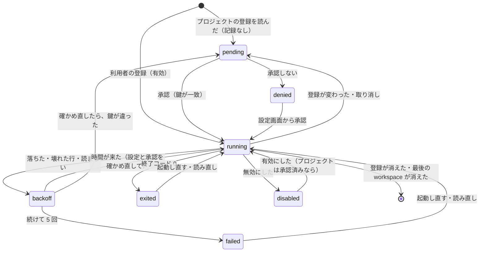

# 仕様: soda 拡張の登録と起動 — 設定に登録したプログラムを Sodashitsu が動かし、標準入出力の NDJSON でやり取りする

> 読む順: `requirements.md`（AC の本文）→ この文書 → `research.md`（既存の作りの事実 E1〜E9・実装アンカー X1〜X23）。利用者の決定待ち（K1〜K14）と、変えるときに差し替える箇所は `decisions.md`。
> 表示の面の型と操作は `20261007-soda-extensions/design.md`（この文書は、それを変えない。足すものは「表示の面への追加」に書く）。

## 概要

- サーバの中に、拡張の持ち主 `ExtensionHost` を 1 つ置く。設定（利用者・プロジェクト）を読み、「動かすべき拡張」の集合を計算し、いま動いているものとの差を埋める（起動・停止）。
- 拡張 1 回ぶんの起動は `ExtensionProcess`。子プロセスを、プロセスのグループを分けて起動し、標準出力を行で読み、標準入力へ行を書き、標準エラーを記録する。
- 拡張 → サーバの要求は、操作の表（`ExtensionApi`）で振り分ける。表示の層の操作は、既存の台帳 `DisplayService` を、**持ち主の札**を付けて呼ぶ。出来事は、台帳に足す受け取り口から、持ち主の拡張へ行で書く。
- プロジェクトの拡張は、承認の記録（状態ディレクトリの根の `extension-approvals.json`）に、鍵（根の実体のパス＋登録の 1 件の全項目のハッシュ）が「承認」で載っているときだけ、起動する。**子プロセスを起動する関数は 1 つ**（`startOne`）で、その中で、設定を読み直して鍵を確かめる。
- 画面（ブラウザ）は、「変わった」のイベントを受けて一覧を取り直す。設定画面の節「拡張」と、承認のダイアログ（別の `<dialog>`）を足す。

## 設計方針

1. **起動の入口を 1 つにする**（S1・S2）。`spawn` を呼ぶのは `ExtensionHost.startOne(key)` だけで、そこが、設定の読み直し・鍵の計算・承認の記録との照合・無効の確かめ・上限の確かめをする。
   起動のきっかけ（サーバの起動・workspace の増減・読み直し・承認・有効化・起動し直し・落ちた後の時間切れ・入れ替えの失敗からの再開）は、どれも「差を埋める」（`reconcile`）か `startOne` を呼ぶだけで、自分では起動しない。
   代替案（きっかけごとに検査を書く）は、漏れた 1 か所が「承認なしで動く」になるので採らない。
2. **読んだものを、そのまま動かす**（S5）。設定ファイルは、開いた fd から 1 回読み、そのバイト列を解釈した 1 件から、鍵と、起動するコマンドの両方を作る。起動の途中で読み直さない。
3. **承認の画面に出るものは、すべて鍵に入れる**。1 件の全項目（`id`・`command`・`description`・`enabled`・`allow`・`onUnresponsive`）と、根の実体のパス。鍵に入らないもので、動きを変えられる項目を作らない。
4. **子プロセスは、グループごと止めて、終わりを待つ**（S13）。ssh の型（research E5）は、グループを分けず・`close` を待つので、シェル経由の孫が残る・孫が stdio を握ると待ちが延びる。ここでは、グループを分け・`exit` を待ち・待ちに上限を付ける。
5. **拡張の入力で、サーバを止めない**（S12・S15）。行の大きさ・頻度・溜める量に上限。頻度の超過は「読むのを待つ」（パイプの詰まりが、そのまま拡張の側の待ちになる）。要求の処理は同期で、1 行ずつ。例外は、その拡張だけの誤りにする。
6. **表示の面の台帳は、足すだけ**。持ち主の札と、出来事の受け取り口と、持ち主を指定した閉じ方。札を付けない呼び出し（`/ws`・`pane.sock`）の動きは変えない。
7. **画面へは「変わった」だけを配る**（S14）。bus に流したものは、全接続（`sodactl`・中継越し）へ届く（research E3）。一覧・コマンド・ログは、要求への返事でだけ返す。
8. **後の層を、同じ口に足せる形**（D1）。操作は表（名前 → 検査と処理）、出来事は `type`。後の作業は、表と `type` を足し、挨拶の一覧に載せる。決まりの版（`v`）は上げない。許可（`allow`）は一覧なので、強い機能を足すときに値を足す。

退けた案:

- **サーバの中で拡張の JS を動かす** → D3（利用者の決定）で退けた。
- **拡張に `sodactl display` を呼ばせる（標準入出力を使わない）** → 拡張に `pane.sock` のパスを渡すことになり、pane を名乗れる（表示の面の H9）。範囲（S9）も許可（S10）も縛れない。
- **`display.wait`（長く待つ要求）を拡張にも使わせる** → 待ちの数（pane 4・全体 32）を拡張が使い切る。行で届けるほうが、短いスクリプトにも書きやすい。
- **拡張ごとの名前空間で、面の名前を分ける** → K10 の (b)。台帳の鍵が変わり、表示の面の作業への変更が大きい。
- **プロジェクトの根を `git rev-parse` で決める** → 承認の前に、リポジトリの中で git を動かすことになる（git の設定からプログラムが動く道がある）。`.git` をたどるだけにする（S1）。

## 対象範囲

PR は 3 つに分ける（`tasks.md`）。**新** は新しいファイル。

| PR | パッケージ | ファイル |
|---|---|---|
| 1 | protocol | **新** `src/extension.ts`・`src/extension.test.ts`、`src/messages.ts`・`src/events.ts`・`src/errors.ts`・`src/display.ts`（`DisplayInfo.source`・`readDisplayInfo`）・`src/index.ts`、`src/messages.test.ts` |
| 1 | server | **新** `src/extensions/extensionConfig.ts`・`lineReader.ts`・`extensionLaunch.ts`・`ExtensionProcess.ts`・`ExtensionStateStore.ts`・`ExtensionApi.ts`・`ExtensionHost.ts` と、それぞれの `*.test.ts`・**新** `extensions.integration.test.ts`・**新** `testing.ts`（偽の子）、`src/display/DisplayService.ts`・`DisplayService.test.ts`、`src/session/paneEnv.ts`・`paneEnv.test.ts`、**新** `src/surface/methods/extension.ts`、`src/surface/methods/index.ts`・`deps.ts`、`src/composeServer.ts`、`src/handoffSmoke.ts`・`src/stopSmoke.ts` |
| 1 | cli | `src/cliArgs.ts`・`src/main.ts`・**新** `src/commands/ext.ts`・`skills/sodactl/SKILL.md`、テスト |
| 1 | client-core | `src/net/clientError.ts` |
| 1 | docs | **新** `docs/extensions.md`・**新** `docs/examples/extension-hello.mjs`、`docs/sodactl.md`、`AGENTS.md` |
| 2 | web | **新** `src/store/extensions.ts`・**新** `src/extensions/ExtensionController.ts`・**新** `src/extensions/extensionView.ts`（＋テスト）・**新** `src/components/ExtensionSettings.vue`、`src/components/SettingsDialog.vue`・`src/store/StoreAdapter.ts`・`src/main.ts`・`src/injection.ts`・`src/actions/ActionDispatcher.ts` |
| 2 | e2e | **新** `src/specs/extensions-settings.spec.ts`・**新** `src/support/extensions.ts` |
| 2 | docs | `docs/extensions.md`・`docs/tui-parity.md` |
| 3 | protocol | `src/extension.ts`・`src/messages.ts`・`src/errors.ts`（承認の方式と code） |
| 3 | server | **新** `src/extensions/projectRoot.ts`・`approval.ts`・`ApprovalStore.ts` と `*.test.ts`、`src/extensions/extensionConfig.ts`（プロジェクトの読み方）・`ExtensionHost.ts`・`ExtensionApi.ts`・`extensions.integration.test.ts`、`src/surface/methods/extension.ts`、`src/composeServer.ts`、`src/handoffSmoke.ts` |
| 3 | client-core | `src/net/clientError.ts` |
| 3 | web | **新** `src/components/ExtensionApprovalDialog.vue`・**新** `src/extensions/approvalView.ts`（＋テスト）、`src/components/ExtensionSettings.vue`・`src/extensions/ExtensionController.ts`・`src/store/extensions.ts`・`src/store/view.ts`・`src/App.vue`、表示の面の PR2 が作るパネル・帯の見出しの部品（出どころの表示。research X22） |
| 3 | e2e | **新** `src/specs/extensions-approval.spec.ts`、`src/support/extensions.ts` |
| 3 | docs | `docs/extensions.md`（プロジェクトの設定・承認・安全と限界） |

触らないもの: `packages/tui`・`packages/server/src/panesocket/`（承認の操作が**無い**ことを、テストで見るだけ）・`packages/server/src/handoff/`・`third_party/ask-form/`・表示の面の枠と静的ページ・`.aidev/works/20261007-soda-extensions/`。

## 依拠する既存の事実

確かめた場所は `research.md`（E＝事実・X＝実装アンカー。★ は監督のセッションが行番号を開き直したもの）。

- 設定ファイルの読み方の型（開いた fd の `stat`・上限・`strictObject`・全体を採らない・誤りの文に値を入れない）: `packages/server/src/commands/commandConfig.ts` `loadCommandsFile`（E1・X1）。
- シェルへ渡す引数: `packages/server/src/commands/commandLaunch.ts:21` `commandArgv`（E1・X2）。Windows の形は、実機で確かめられていない（同ファイルのコメント）。
- 状態ディレクトリに、根（`sessionRoot`）と session ごと（`stateDir`）がある。根に置いて共有する先例は `machines.json` で、排他は無い: `packages/server/src/config.ts`・`machine/MachineCatalog.ts`（E2・X4）。
- 安全に書く関数: `packages/server/src/persist/atomicFile.ts` `writeFileAtomic`（0600・rename）（E2・X5）。
- `Workspace.cwd` は、開いた場所のまま変わらない。git の根は `findGitRoot`（git を呼ばない・worktree ごとの根・`realpath` しない）: `packages/server/src/session/workspaceLabel.ts:55`（E3・X6）。
- pane → workspace は `SessionService.commandContext(paneId)`（828 行）、全部の一覧は `snapshot()`（252 行）（E3・X7）。
- bus に流れるのは `ServerEvent` で、全接続へ届く。復元は bus に出ない。pane の移動は `pane.created`・`pane.closed` を出さない（E3）。
- 接続の種類（`kind`）は自己申告。種類の検査は、サービスの側に `isScreenKind` を注入する形: `packages/server/src/composeServer.ts:350` の近く（E4・X9）。
- 子プロセスの持ち主の型と、テストの偽物: `packages/server/src/machine/MachineLink.ts`・`MachineManager.ts`・`machine/testing.ts`（E5・X10）。
- 組み立てと寿命の場所: `composeServer.ts` の `listen`（ロック 620・`machines.start` 773）・`close`（`machines.stop` 813）・`pausePollers`（524）・`resumePollers`（530）。`rollback` は、止めていなくても `resumePollers` を呼ぶ（E6・X11）。
- 環境変数の落とす一覧: `packages/server/src/session/paneEnv.ts:14` `PANE_ENV_DROPPED`（E7・X12）。token は環境変数に無い（ファイル）。
- 台帳は、面の持ち主を持たず、出来事は pane ごとの列へ入る: `packages/server/src/display/DisplayService.ts`（`Entry` 65・`set` 135・`close` 210・`pushEvent` 441・`remove` 481・`onPaneClosed` 499）（E8・X13）。
- 表示の層の引数の検査: `packages/protocol/src/messages.ts` の `DisplaySetParams`・`DisplayCloseParams`・`DisplayListParams`・`DisplayFeaturesParams` と、`packages/protocol/src/display.ts` の `checkDisplaySet`（E8）。
- 設定画面の節・別の `<dialog>`・トースト・読み直しの操作: `SettingsDialog.vue`・`AskDialog.vue`・`store/view.ts` `toast`・`ActionDispatcher.ts:1471` `reloadConfig`（E9・X15〜X17）。
- E2E は、サーバと同じプロセスから子プロセスを起動できる（`composeServer` をプロセスの中で立てる）: `packages/e2e/src/support/appServer.ts`（E9・X19）。

**未確認**（実装の最初に確かめ、結果を `decisions.md` に 1 行残す。だめなときの代えは `tasks.md`「不確かな点」）:

- u1: `detached: true` で起動した子（`setsid`）へ、`process.kill(-pid, sig)` でグループごと合図を送れること。サーバが `node-pty` を使っていること・`soda` が端末から起動されていることと、干渉しないこと。
- u2: Node が作る子の stdio のパイプが close-on-exec で、`execve` の後に、止め損ねた子の標準入力が閉じること（止めて待つので、通常は通らない道）。
- u3: Windows で、`taskkill /pid <pid> /T /F` が、`%ComSpec% /c` の下の木を終わらせること（実機では確かめない。組み立てだけ単体テスト）。
- u4: pane が tab・workspace を移ったときに、bus に出るイベントの種類（research X23）。範囲の検査は、イベントに頼らず、要求のたびに引くので、安全には響かない（一覧の行が遅れるだけ）。
- u5: 表示の面の PR2 の、パネル・帯の見出しの部品の名前と、固定のラベルの作り（research X22）。
- u6: `findGitRoot` の `deps`（`WorkspaceLabelDeps`）を、自動の名前の外で組み立てる方法。
- u7: `/bin/sh -c '<1 行>'` が、単純なコマンドを `exec` で置き換えるか（シェルに依る）。置き換えなくても、グループごと止めるので動きは同じ。

## インターフェース / データ構造

### 設定ファイル

利用者: `<stateDir>/extensions.json`。プロジェクト: `<根>/.soda/extensions.json`。

```json
{
  "extensions": [
    {
      "id": "hello",
      "command": "node ~/soda-ext/hello.mjs",
      "description": "pane の上に、あいさつの帯を出す",
      "enabled": true,
      "allow": ["script-html"],
      "onUnresponsive": "pass",
      "cwd": "/home/me/soda-ext"
    }
  ]
}
```

| 項目 | 規則 | 既定 |
|---|---|---|
| `id` | `COMMAND_ID_RE`（`/^[a-z0-9][a-z0-9_-]{0,63}$/`）。ファイルの中で重複しない | 必須 |
| `command` | 1〜1024 文字（`EXTENSION_COMMAND_MAX`）。**禁止する文字**（`hasForbiddenChars`）: C0・C1 の制御文字（改行・タブを含む）・DEL・U+2028・U+2029・書字方向の制御（U+061C・U+200E・U+200F・U+202A〜U+202E・U+2066〜U+2069）・幅の無い文字（U+200B〜U+200D・U+2060・U+FEFF）・U+00AD。前後の空白は誤り | 必須 |
| `description` | 0〜200 文字。禁止する文字は `command` と同じ | 無し |
| `enabled` | 真偽 | `true` |
| `allow` | `EXTENSION_ALLOW_VALUES`（いまは `"script-html"` だけ）の配列。重複は誤り。**知らない値は誤り** | `[]` |
| `onUnresponsive` | `"pass"`｜`"block"` | `"pass"` |
| `cwd` | **利用者の設定だけ**。絶対パス・1〜1024 文字・禁止する文字は同じ。プロジェクトの設定に書くと誤り | 利用者: ホーム（`os.homedir()`）／プロジェクト: 根 |

- 外側も 1 件も `z.strictObject`。`extensions` は 0〜16 件（`EXTENSIONS_PER_FILE_MAX`）。**1 つでも規則の外なら、そのファイルの拡張を 1 つも採らない**。
- 解釈した 1 件の型（既定を埋めたもの）:

```ts
export interface ExtensionEntry {
  id: string; command: string; description: string | null; enabled: boolean;
  allow: string[];            // 並べ替え済み（辞書順）
  onUnresponsive: "pass" | "block";
  cwd: string | null;         // プロジェクトでは常に null
}
export interface ExtensionFileLoad { entries: ExtensionEntry[]; problem: string | null; warning?: string }
```

- `packages/server/src/extensions/extensionConfig.ts`:
  - `parseExtensionsJson(text: string, scope: ExtensionScope): ExtensionFileLoad`（純粋）。誤りの文は `extensions.json: <場所>: <種類>` の形（値を入れない。`issueText`・`safeKeyName` と同じ作り）。
  - `loadUserExtensionsFile(path: string, deps?: Partial<ExtensionFileDeps>): Promise<ExtensionFileLoad>`: `loadCommandsFile` と同じ手順（`O_RDONLY|O_NOFOLLOW|O_NONBLOCK`・**開いた fd の `stat`** で通常ファイル・Unix は持ち主が自分・`mode & 0o022` が 0・64 KiB〔`EXTENSIONS_FILE_MAX_BYTES`〕・同じ fd から読む・UTF-8 を厳しく）。`ENOENT` は空（誤りではない）。
  - `loadProjectExtensionsFile(root: string, deps?): Promise<ExtensionFileLoad & { path: string }>`（PR3）: `root` は**実体のパス**（`resolveProjectRoot` の結果）。
    1. `dir = join(root, ".soda")` を `lstat`。無ければ空。**ディレクトリでない・シンボリックリンクなら誤り**（「`.soda` がリンクです」）。
    2. `path = join(dir, "extensions.json")` を `O_RDONLY|O_NOFOLLOW|O_NONBLOCK` で開く。`ENOENT` は空、`ELOOP` は誤り。
    3. 開いた fd の `stat` で、通常ファイル・64 KiB。**持ち主と権限は見ない**（clone したファイル。守りは承認）。
    4. `realpath(path)` が `join(root, ".soda", "extensions.json")` と等しいこと（途中のリンクで外へ出ていない）。違えば誤り。
    5. 同じ fd から読み、`parseExtensionsJson(text, "project")`。
    - 4 と 5 の間に差し替える競合は、守らない（その場所に書ける者は、既に利用者の権限を持つ。S6）。
  - 共通の手順（開く・`stat`・読む）は、`commandConfig.ts` から括り出さず、**写す**（`commands.json` の検査を、この作業で動かさないため。写した旨をコメントに書く）。

### プロジェクトの根（PR3）

`packages/server/src/extensions/projectRoot.ts`:

```ts
/** workspace を開いた場所から、プロジェクトの根の実体のパスを返す。git の中でなければ null。git のコマンドは呼ばない。 */
export async function resolveProjectRoot(cwd: string, deps: ProjectRootDeps): Promise<string | null>;
```

- `findGitRoot(cwd, …)`（worktree ごとの根）→ `fs.realpath` → 絶対パスであること・1024 文字以下・禁止する文字（`command` と同じ一覧）を含まないこと。満たさなければ `null`（拡張なし。禁止する文字を含むパスは、承認の画面で正しく見せられないので、扱わない）。
- 時間の上限 2 秒（`AUTO_LABEL_TIMEOUT_MS` の 200ms は、自動の名前用で短い）。越えたら `null`。
- 入力は **`Workspace.cwd`**（開いた場所。変わらない）。`Pane.cwd`・`identityCwdOf` は使わない（pane の中のプログラムが `cd` するだけで、根が変わってしまう）。
- `ExtensionHost` は、結果を workspace の id ごとに覚える（`workspace.closed` と、読み直しの操作で捨てる）。

### 鍵と、承認の記録（PR3）

`packages/server/src/extensions/approval.ts`（純粋）:

```ts
/** 拡張 1 件の指紋。利用者の拡張では root に ""（空）を渡す（変更の検知にだけ使う）。 */
export function entryDigest(root: string, entry: ExtensionEntry): string; // SHA-256 の 16 進 64 文字
export function instanceKey(scope: ExtensionScope, root: string | null, id: string): string;
// "user:<id>" ／ "project:<SHA-256(root) の先頭 16 文字>:<id>"
```

- `entryDigest` の入力は、項目の順を固定した JSON:
  `JSON.stringify({ v: 1, root, id, command, description, enabled, allow, onUnresponsive, cwd })`（`description`・`cwd` は無ければ `null`。`allow` は並べ替え済み）。**1 件の全項目と、根**。
- 鍵に入らないもの: ファイルの中のほかの 1 件・ファイルの体裁（空白・項目の順）・コマンドが指すファイルの中身（K1）。

`packages/server/src/extensions/ApprovalStore.ts`。ファイルは `<sessionRoot>/extension-approvals.json`（根。K3）:

```json
{ "version": 1, "records": [
  { "root": "/home/me/repo", "id": "hello", "digest": "<64 桁>", "status": "approved",
    "entry": { "id": "hello", "command": "node .soda/hello.mjs", "description": null, "enabled": true, "allow": [], "onUnresponsive": "pass", "cwd": null },
    "at": "2026-10-08T00:00:00.000Z" }
] }
```

- **(根, id) ごとに 1 件**。`status` は `"approved"`｜`"denied"`。`entry` は、そのとき決めた中身（次に変わったときの差分に使う）。
- `lookup(root, id, digest)`: 記録があり `digest` が同じ → その `status`。記録があり `digest` が違う → `{ status: "none", previous: 記録が approved ならその entry }`。無い → `{ status: "none" }`。
- `decide(root, id, digest, status, entry)`・`revoke(root, id)`: **読み直してから**、その (根, id) の 1 件を置き換え（または消し）、`writeFileAtomic` で書く（`machines.json` の CLI と同じ。排他は無い。同時に書いた 2 つの session の片方が失われうる——失われた側は、承認待ちに戻るだけ）。
  256 件（`EXTENSION_APPROVALS_MAX`）を超えたら、`at` の古いものから捨てる。
- 読むとき（`load()`。`reconcile` と `startOne` のたびに読む。メモリに長く持たない）: `O_RDONLY|O_NOFOLLOW`・開いた fd の `stat`（通常ファイル・Unix は持ち主が自分・`mode & 0o022` が 0・256 KiB）・厳しい形の検査。
  **読めない・壊れている・規則の外 → 記録なしとして扱う**（全部が承認待ちに戻る。動く側には倒れない）。一覧の `problems` に 1 行出す。壊れたファイルは、書くときに上書きされる（退避はしない——`entry` にコマンドが入るので、写しを増やさない）。
- 同じ OS の利用者のプロセスは、このファイルを直接書ける。**これは境界ではない**（S8。そのプロセスは、既に利用者の権限で何でも実行できる）。

### 無効の記録（PR1）

`packages/server/src/extensions/ExtensionStateStore.ts`。ファイルは `<stateDir>/extension-state.json`（session ごと。K14）: `{ "version": 1, "disabled": ["user:hello", …] }`（鍵の一覧。256 件まで。古いものから捨てる）。
`load()`・`setDisabled(key, disabled)`（`writeFileAtomic`）。読めない・壊れている → 空（全部が有効）として扱い、一覧の `problems` に 1 行。session のロックの中なので、書くのはこのサーバだけ。

### 型と定数（`packages/protocol/src/extension.ts`）

```ts
export const EXTENSION_PROTOCOL_VERSION = 1;
export const EXTENSIONS_FILE_NAME = "extensions.json";
export const PROJECT_EXTENSIONS_DIR = ".soda";
export const EXTENSION_ID_RE = COMMAND_ID_RE;
export const EXTENSION_COMMAND_MAX = 1024;
export const EXTENSION_DESCRIPTION_MAX = 200;
export const EXTENSION_PATH_MAX = 1024;
export const EXTENSIONS_FILE_MAX_BYTES = 65_536;
export const EXTENSIONS_PER_FILE_MAX = 16;          // 利用者 16・プロジェクトごと 16
export const EXTENSION_PROJECT_ROOTS_MAX = 32;      // 設定を読む根の数
export const EXTENSIONS_RUNNING_MAX = 32;           // 同時に動かす合計
export const EXTENSION_ALLOW_VALUES = ["script-html"] as const;
export const EXTENSION_UNRESPONSIVE_VALUES = ["pass", "block"] as const;
export const EXTENSION_LINE_MAX_BYTES = 4 * 1024 * 1024;                     // 拡張 → サーバの 1 行（受け口の 1 行と同じ）
export const EXTENSION_REQUEST_RATE = { perSec: 50, burst: 100 } as const;   // 超えたら読むのを待つ
export const EXTENSION_INPUT_BYTES_RATE = { perSec: 4 * 1024 * 1024, burst: 16 * 1024 * 1024 } as const;
export const EXTENSION_BAD_LINES_MAX = 20;          // 続けて
export const EXTENSION_OUT_QUEUE_MAX_LINES = 512;
export const EXTENSION_OUT_QUEUE_MAX_BYTES = 8 * 1024 * 1024;
export const EXTENSION_WRITE_STALL_MS = 30_000;
export const EXTENSION_STOP_GRACE_MS = 2_000;       // 合図 → 強制終了
export const EXTENSION_STOP_WAIT_MS = 3_000;        // 止める処理が待つ上限（猶予を含む）
export const EXTENSION_BACKOFF = { minMs: 1_000, maxMs: 60_000 } as const;
export const EXTENSION_CRASH_MAX = 5;               // 続けて
export const EXTENSION_STABLE_MS = 60_000;          // これだけ動いたら、回数を数え直す
export const EXTENSION_LOG_LINES_MAX = 200;
export const EXTENSION_LOG_LINE_MAX_BYTES = 4_096;
export const EXTENSION_DISPLAYS_MAX = 16;           // 1 つの拡張が出せる面
export const EXTENSION_APPROVALS_MAX = 256;
export const EXTENSION_REQUEST_ID_MAX = 64;         // id が文字列のときの長さ
export const EXTENSION_METHOD_NAME_MAX = 64;
export const EXTENSION_PANES_DEBOUNCE_MS = 100;
export const EXTENSION_APPROVE_DELAY_MS = 1_000;    // ダイアログの［承認して動かす］を押せない時間（web が使う）

export type ExtensionScope = "user" | "project";
export type ExtensionRunState =
  | "running"      // 動作中
  | "backoff"      // 落ちた。起動し直しを待っている
  | "failed"       // 続けて落ちたので止めた
  | "exited"       // 自分で終了した（終了コード 0）
  | "disabled"     // 無効（設定の enabled: false か、画面で切った）
  | "pending"      // 承認待ち（プロジェクトだけ）
  | "denied"       // 承認しない（プロジェクトだけ）
  | "over_limit";  // 同時に動かす合計の上限のため、動かしていない

export interface ExtensionInfo {
  key: string; id: string; scope: ExtensionScope;
  root?: string;              // プロジェクト: 根の実体のパス
  configPath: string;         // 読んだ設定ファイルのパス
  description?: string; allow: string[]; onUnresponsive: "pass" | "block";
  state: ExtensionRunState;
  enabledInConfig: boolean; disabledByUser: boolean;
  runId?: string;             // 動作中: この起動の UUID
  startedAt?: string;         // ISO 8601
  failures: number;           // 続けて落ちた回数
  nextRetryAt?: string;       // backoff のとき
  lastExit?: { code: number | null; signal: string | null; at: string; reason: ExtensionExitReason };
  displays: number;           // いま出している面の数
  approval?: ExtensionApprovalView; // プロジェクトだけ（PR3）
}
export type ExtensionExitReason = "exited" | "crashed" | "spawn_failed" | "bad_lines" | "not_reading" | "stopped";
export interface ExtensionApprovalView {
  digest: string; status: "approved" | "denied" | "none";
  command: string; cwd: string;                       // 承認の画面に出す（プロジェクトの分だけ、画面へ送る）
  decidedAt?: string;
  previous?: { command: string; description: string | null; enabled: boolean; allow: string[]; onUnresponsive: string }; // 前に承認した中身（あれば）
}
export interface ExtensionFileProblem { scope: ExtensionScope | "state"; root?: string; path: string; problem: string }
export interface ExtensionListResult { extensions: ExtensionInfo[]; problems: ExtensionFileProblem[]; userConfigPath: string }
export interface ExtensionLogResult { lines: string[]; dropped: number } // dropped＝あふれて捨てた行数

/** 拡張に見せる pane。 */
export interface ExtPane { id: string; label: string | null; workspaceId: string; workspaceLabel: string; workspaceCwd: string; agent: string | null }
export interface ExtLimits { lineBytes: number; requestsPerSec: number; inputBytesPerSec: number; outQueueLines: number; displays: number }

/** サーバ → 拡張の行。 */
export type ExtLine =
  | { type: "ext.hello"; v: 1; runId: string; extension: { id: string; scope: ExtensionScope; root?: string };
      allow: string[]; onUnresponsive: "pass" | "block"; methods: string[]; events: string[];
      display: { features: string[]; limits: DisplayLimits }; limits: ExtLimits }
  | { type: "ext.result"; id: string | number; ok: true; result: unknown }
  | { type: "ext.result"; id: string | number; ok: false; error: { code: string; message: string } }
  | { type: "ext.error"; code: "bad_line" | "line_too_long" | "bad_request"; message: string } // どの要求にも結び付かない誤り
  | { type: "ext.dropped"; count: number }
  | { type: "ext.panes"; panes: ExtPane[] }
  | ExtDisplayEvent;
/** 表示の面の DisplayEvent から、待ちの印 `seq` を除いたもの。閉じた理由に `pane_closed`（pane が閉じた）と `out_of_scope`（pane が、拡張の範囲の外へ出た）が加わる。 */
export type ExtDisplayEvent =
  | { type: "display.action"; paneId: string; name: string; rev: number; action: string; data?: Record<string, string>; at: string; source?: "static" | "script" }
  | { type: "display.closed"; paneId: string; name: string; reason: string; at: string };

/** 拡張 → サーバの要求。 */
export interface ExtRequest { id?: string | number; method: string; params?: Record<string, unknown> }
export type ExtRequestParse =
  | { ok: true; request: ExtRequest }
  | { ok: false; code: "bad_line" | "bad_request"; message: string };
/** 1 行を要求として読む（純粋）。JSON でない → bad_line。オブジェクトでない・method が 1〜64 文字の文字列でない・
 *  id が有限の数でも 1〜64 文字の文字列でもない・params がオブジェクト（配列でない）でない → bad_request。知らない項目は無視する。 */
export function parseExtRequest(line: string): ExtRequestParse;
export const EXT_EVENT_TYPES = ["ext.hello", "ext.result", "ext.error", "ext.dropped", "ext.panes", "display.action", "display.closed"] as const;
export function hasForbiddenChars(s: string): boolean;   // 設定の検査と、根のパスの検査と、web の表示が、同じものを使う
export function extLimits(): ExtLimits;
```

- **行の決まり**（docs に書く）: 1 行 1 つの JSON・UTF-8・改行は `\n`（`\r\n` の `\r` は除く）。サーバ → 拡張の行は `type`（`<層>.<種類>`）を持つ。読み手は、知らない `type` の行・知らない項目を無視する。項目の意味は変えない（変えるときは `type`・操作の名前を新しくする）。
  `ext.hello` の `v` は、この決まりそのものを変えるときだけ上げる。空の行は、無視する（誤りに数えない）。
- 設定の項目の id は、設定に書いた名前（独自コマンドと同じ扱い。実体ではない）。`runId` は `crypto.randomUUID()`。

### 拡張が呼べる操作（`ExtensionApi`）

| `method` | `params` | 結果（`ext.result.result`） | 備考 |
|---|---|---|---|
| `ext.features` | `{}` | `{ methods: string[]; events: string[]; display: DisplayFeatures; limits: ExtLimits }` | `display.features` は、許可に合わせて絞る（下）。`renderers`（面を出せる画面の数）を含む |
| `ext.panes` | `{}` | `{ panes: ExtPane[] }` | 範囲の中だけ |
| `display.set` | `/ws` の `DisplaySetParams`（`paneId` つき） | `DisplaySetResult` | 持ち主の札を付けて `DisplayService.set`。`next` は意味を持たない（docs に書く） |
| `display.close` | `DisplayCloseParams` | `{ closed: string[] }` | 自分の面だけ |
| `display.list` | `DisplayListParams` | `{ displays: DisplayInfo[] }` | 自分の面だけ（`seq`・`epoch` は返さない） |
| `display.features` | `{}` | `DisplayFeatures` | `ext.features` の `display` と同じ |
| `display.send` | 表示の面の PR3 の `DisplaySendParams` | `{ delivered: number }` | **表示の面の PR3 が main に入るまで、表に載せない**（`unsupported`）。入った後、`allow` に `script-html` がある拡張だけ |
| ほか（`display.wait`・知らない名前） | — | 誤り `unsupported` | 切らない |

処理の順（1 行ごと。同期）:

1. `parseExtRequest`。だめなら `ext.error`（`bad_line`｜`bad_request`）を書き、「続けて壊れた行」を 1 増やす。20 で、拡張を止める（理由 `bad_lines`）。読めたら、0 に戻す。
2. `method` を表で引く。無ければ `unsupported`（文は「この操作は使えません: <名前>」。名前は 64 文字以下で、`/^[A-Za-z0-9_.:-]+$/` に合うときだけ文に入れる）。
3. 引数を、その操作の zod の schema で検査。だめなら `invalid_params`。
4. `paneId` を持つ操作は、**範囲**を確かめる（`inScope(ext, paneId)`。下）。外なら `not_found`（無い pane と同じ code・同じ文）。
5. **許可**を確かめる: `display.set` で `params.format === "script-html"`（文字列の比較。表示の面の PR3 の有無に依らない）・`display.send` は、`allow` に `script-html` が無ければ `unsupported`。
6. 1 つの拡張の面の数: `display.set` が新しい面を作るとき（`displays.ownerOf(paneId, name) !== tag`）、`displays.countOwned(tag) >= 16` なら `display_limit`。
7. `DisplayService` を呼ぶ。`RpcError` は、その `code` と `message` を返す。ほかの例外は `internal`（文は固定。ログに、拡張の id と操作の名前）。
8. `id` があれば `ext.result` を書く（捨てない行）。`id` が無ければ、何も書かない（誤りのときも）。

- `display.features`・`ext.features` の `features` は、`DisplayService.features().features` から、`allow` に `script-html` が無ければ `format:script-html` と `send` を除いたもの。
- `ext.hello.methods` は、表の名前のうち、その拡張が呼べるもの（`display.send` は、許可があるときだけ）。`events` は `EXT_EVENT_TYPES`。
- 後の層は、表に行を足す（例: 観測の `observe.subscribe`・割り込みの返事 `intercept.reply`）。サーバ → 拡張の、返事の要る行（割り込みの問い合わせ）は、`type` と、サーバが振る id を持つ行にする。この作業では、足さない。

### 範囲と許可

```ts
/** その拡張が、その pane を扱えるか。pane が無ければ false。 */
inScope(ext: RunningExtension, paneId: string): boolean
```

- 利用者の拡張: pane が実在すれば真。
- プロジェクトの拡張: `session.commandContext(paneId).workspaceId` の workspace の根（`ExtensionHost` が覚えている、workspace の id → 根）が、拡張の `root` と**文字列として等しい**ときだけ真（K2）。根が無い workspace（git の外）は偽。
- **要求のたびに引く**（pane は、イベントなしに workspace を移る。research E3）。
- 一覧（`ext.panes`）は、`session.snapshot()` の全 pane を `inScope` で絞ったもの。`workspaceCwd` は `Workspace.cwd`、`agent` は `pane.agent?.kind ?? null`。
- pane が範囲の外へ出たら（一覧を作り直したとき、その拡張が面を持つ pane〔`displays.ownedPanes(tag)`〕が、範囲に無い）、`displays.closeOwned(tag, { paneId })` で消し、返ってきた面ごとに、拡張へ `{ type: "display.closed", paneId, name, reason: "out_of_scope", at }` を書く（AC24）。
- `ExtPane` に、端末の題・作業ディレクトリ・エージェントの状態は載せない（よく変わる。観測の層）。`agent` は、一覧を作ったときの種類で、種類の変化だけでは、行を送り直すきっかけにしない（ほかのきっかけで作り直したときに、変わっていれば届く）。

### 表示の面への追加（`DisplayService`・`DisplayInfo`）

```ts
// packages/protocol/src/display.ts（足す）
export interface DisplaySource { type: "extension"; id: string; scope: "user" | "project" }
export interface DisplayInfo { /* 既存 */ source?: DisplaySource } // pane のプログラムの面には無い。readDisplayInfo は、形の合う source を通す

// packages/server/src/display/DisplayService.ts（足す）
export interface DisplayOwner { tag: string; source: DisplaySource }   // tag は "ext:<instanceKey>"
export type DisplayOwnedEvent = ExtDisplayEvent;                        // seq なし。閉じた理由に pane_closed を含む
set(paneId: string, body: unknown, opts?: { owner?: DisplayOwner }): DisplaySetResult;
close(paneId: string, sel: {...}, reason?: DisplayClosedReason, opts?: { owner?: string }): { closed: string[] };
list(paneId: string, opts?: { owner?: string }): { displays: DisplayInfo[]; seq: number; epoch: string };
ownerOf(paneId: string, name: string): string | undefined;             // 面が無い・持ち主が無いなら undefined
countOwned(tag: string): number;
ownedPanes(tag: string): string[];
closeOwned(tag: string, sel?: { paneId?: string }): { paneId: string; name: string }[]; // 閉じた面。理由 "closed"。受け手（onOwnedEvent）へは知らせない（呼んだ側が、必要なら自分で知らせる）
onOwnedEvent(fn: (tag: string, ev: DisplayOwnedEvent) => void): { dispose(): void };
```

決まり（**札を付けない呼び出しの動きは、今までと同じ**）:

| 場面 | 動き |
|---|---|
| 札つきの `set`、その名前の面が無い | 作る。`Entry.owner = opts.owner`、`info.source = owner.source` |
| 札つきの `set`、同じ札の面がある | 置き換え（今までどおり `rev + 1`） |
| 札つきの `set`、**札の違う面・札の無い面がある** | 誤り `invalid_display`（文「その名前は、ほかのプログラムが使っています」）。面は変えない。頻度の桶は戻す（`refund`） |
| 札なしの `set`（`/ws`・`pane.sock`）、札つきの面がある | 今までどおり置き換える。その前に、元の持ち主へ `display.closed`（理由 `closed`）を知らせ、`Entry.owner` と `info.source` を外す |
| 札つきの `close`・`list`（`opts.owner`） | その札の面だけが対象。ほかは、無いものとして扱う（`closed: []`・一覧に出ない） |
| 札なしの `close`・`dismiss`・`report`・`ttl` の経過 | 今までどおり、どの面も閉じる |
| **出来事**（`display.action`・`display.closed`）、面に札がある | **pane の列に入れず**、`onOwnedEvent` の受け手へ（`seq` なし）。札が無い面は、今までどおり列へ |
| pane が閉じた（`onPaneClosed`） | 今までの処理に加えて、札つきの面ごとに、受け手へ `display.closed`（理由 `pane_closed`） |
| `closeOwned` | 台帳から外し、`display.removed`（理由 `closed`）を bus に配る。受け手へは知らせない |

- 受け手は同期で呼ぶ。受け手の例外は、台帳の処理へ伝えない（`try/catch` で包み、ログ）。
- 面の数・合計のバイト数・`set` の頻度（pane ごと）は、札に依らず、今までどおり合わせて数える（AC5・機能要件 27）。
- 表示の面の PR3 が `send` を足すときは、`send(paneId, p, opts?: { owner?: string })` にして、札の違う面には `display_closed` を返す（**表示の面の作業への申し送り**）。PR3 が先に入っていれば、この作業の PR1 で足す。

### `ExtensionProcess`（1 回ぶんの起動）

`packages/server/src/extensions/extensionLaunch.ts`（純粋）:

```ts
export function extensionArgv(command: string, platform: NodeJS.Platform, env: NodeJS.ProcessEnv): string[];
// POSIX: ["/bin/sh", "-c", command]（ログインシェルにしない）。Windows: commandArgv と同じ形（[ComSpec, "/d", "/s", "/c", `"${command}"`]）
export function killTreeCommand(pid: number, platform: NodeJS.Platform): { file: string; args: string[] } | null;
// Windows: { file: "taskkill", args: ["/pid", String(pid), "/T", "/F"] }。POSIX: null（グループへの合図を使う）
export const EXTENSION_ENV_DROPPED: readonly string[]; // PANE_ENV_DROPPED + "SODA_EXTENSION_ID" + "SODA_EXTENSION_SCOPE" + "SODA_PROJECT_ROOT" + "SODA_EXTENSION_RUN_ID"
export function buildExtensionEnv(base: NodeJS.ProcessEnv, ext: { id: string; scope: ExtensionScope; root: string | null; runId: string }, platform?: NodeJS.Platform): Record<string, string>;
// base から EXTENSION_ENV_DROPPED を落とし（Windows は大文字小文字を区別せず）、SODA_EXTENSION_ID・SODA_EXTENSION_SCOPE・SODA_EXTENSION_RUN_ID と、プロジェクトなら SODA_PROJECT_ROOT を足す。
// SODA_PANE_ID・SODA_SERVER_URL・SODA_PANE_SOCKET・SODA_AGENT_REPORT_SOCKET・SODACTL_TOKEN・SODACTL_URL は、落としたまま足さない。
```

- `packages/server/src/session/paneEnv.ts` の `PANE_ENV_DROPPED` に、`SODA_EXTENSION_ID`・`SODA_EXTENSION_SCOPE`・`SODA_PROJECT_ROOT`・`SODA_EXTENSION_RUN_ID` を足す（拡張から起動したサーバ・拡張の中の pane に、漏れないように）。

`packages/server/src/extensions/ExtensionProcess.ts`:

```ts
export interface ExtChild {
  pid: number | undefined;
  stdin: NodeJS.WritableStream; stdout: NodeJS.ReadableStream; stderr: NodeJS.ReadableStream;
  on(ev: "exit", fn: (code: number | null, signal: NodeJS.Signals | null) => void): void;
  on(ev: "error", fn: (err: Error) => void): void;
}
export type ExtSpawn = (file: string, args: string[], opts: { cwd: string; env: Record<string, string>; detached: boolean; windowsVerbatimArguments: boolean }) => ExtChild;
export interface ExtProcessDeps { spawn?: ExtSpawn; killGroup?: (pid: number, signal: "SIGTERM" | "SIGKILL") => void; runFile?: (file: string, args: string[]) => void; clock?: Clock; platform?: NodeJS.Platform; logger: Logger }
export interface ExtExit { code: number | null; signal: string | null; reason: ExtensionExitReason; uptimeMs: number }

export class ExtensionProcess {
  constructor(spec: { key: string; id: string; scope: ExtensionScope; root: string | null; command: string; cwd: string; runId: string }, env: Record<string, string>,
              handlers: { onRequest(req: ExtRequest): void; onBadLine(code: "bad_line" | "line_too_long" | "bad_request", message: string): void }, deps: ExtProcessDeps);
  readonly runId: string;
  readonly exited: Promise<ExtExit>;                 // 子の exit（または spawn の失敗）で決まる。1 回だけ
  start(): void;                                      // spawn。失敗は exited（reason: spawn_failed）
  send(line: ExtLine, opts?: { droppable?: boolean; coalesce?: "ext.panes" }): void;
  stop(reason: "stopped" | "bad_lines" | "not_reading"): Promise<void>; // 何度呼んでもよい。EXTENSION_STOP_WAIT_MS 以内に必ず返る
  log(): ExtensionLogResult;
}
```

- **起動**: 既定の `spawn` は `child_process.spawn(file, args, { cwd, env, stdio: ["pipe","pipe","pipe"], shell: false, windowsHide: true, detached: platform !== "win32", windowsVerbatimArguments: platform === "win32" })`。
  POSIX の `detached: true` は、子を**新しいプロセスのグループ**（グループの id ＝ 子の pid）にする。`unref()` は呼ばない。
  `stdin`・`stdout`・`stderr` の `error` に、何もしない受け手を付ける（`EPIPE` でサーバを落とさない）。
- **読む**（`lineReader.ts`）: `stdout` の `data` を `LineReader.push(chunk)` に入れ、`pump()` が `next()` で 1 行ずつ取り出して `onRequest`・`onBadLine` を呼ぶ。
  - `LineReader`: バイト列の入れ物。`next(): { kind: "line"; text: string; bytes: number } | { kind: "too_long"; bytes: number } | null`。改行が無いまま 4 MiB を超えたら、「捨てている」状態になり、次の改行までを捨てて、`too_long` を 1 回返す。UTF-8 として壊れた行は、`bad_line` になる（`TextDecoder` を厳しく）。空の行（空白だけ）は飛ばす。入れ物が持つのは、切り出していない残りだけ（最大で 4 MiB ＋ 1 片）。
  - **頻度**: 行の桶（毎秒 50・続けて 100）と、量の桶（毎秒 4 MiB・続けて 16 MiB。`display/rateLimit.ts` の `TokenBucket` を使う）。1 行を処理する前に両方から取る。足りなければ、`stdout.pause()` して、足りる時刻にタイマーで `pump()` をやり直す（`resume()`）。**捨てない・誤りにしない**。`too_long` の行も、量の桶から 4 MiB を取る。
  - `pump()` は再入しない（処理の中から `send` が呼ばれても、行の順を保つ）。止めた後・終わった後は、何も呼ばない。
- **書く**: `send` は、行を JSON にして列に入れ、`stdin.write` する。`write` が `false` を返したら、`drain` まで待つ（列に溜める）。
  - 列の上限は 512 行・8 MiB。入れる前に超えるなら、**捨ててよい行**（`droppable`。出来事と `ext.panes`）を古いものから捨て、捨てた数を持つ。空きが出来たら、`{"type":"ext.dropped","count":N}` を 1 行入れる（これも捨ててよい行。捨てるときは、数を足し合わせる）。
  - `coalesce: "ext.panes"` の行は、列にまだ書かれていない `ext.panes` があれば、それと置き換える（古い一覧を溜めない）。
  - **捨てられない行**（`ext.hello`・`ext.result`・`ext.error`）が、捨てても入らないとき → 止める（理由 `not_reading`）。
  - 列が空でないまま、`drain` が 30 秒来ない → 止める（理由 `not_reading`）。
- **標準エラー**: `StringDecoder` で行に切り、1 行 4 KiB で切り詰め、制御文字（改行以外）を `?` に替えて、輪の記録（200 行）に入れる。あふれた行数を数える。改行の無い出力は、4 KiB ごとに 1 行にする。**ロガーには、中身を書かない**。
- **止める**（`stop`）:
  1. 「止めている」印を立てる（以後の行は処理しない・`send` は捨てる）。`stdin.end()`。
  2. POSIX: すぐ `killGroup(pid, "SIGTERM")`（既定は `process.kill(-pid, sig)`。`ESRCH` は無視）。Windows: 何もしない（標準入力が閉じたことが、穏やかな合図）。
  3. 2 秒（`EXTENSION_STOP_GRACE_MS`）後に、まだ `exit` していなければ: POSIX は `killGroup(pid, "SIGKILL")`、Windows は `runFile("taskkill", ["/pid", pid, "/T", "/F"])`。
  4. `exit` を待つ。合図から 3 秒（`EXTENSION_STOP_WAIT_MS`）で `exit` が来なくても返る（ログに warn。`exited` は、後で来たら決まる）。
- **子が `exit` したとき**（止めたとき・自分で終わったとき・落ちたときのどれでも）: POSIX は、**残った孫を掃く**——`killGroup(pid, "SIGTERM")` を 1 回、2 秒後に `killGroup(pid, "SIGKILL")` を 1 回（どちらも `ESRCH` を無視。グループが空なら何も起きない）。Windows は、`exit` の時点で `runFile("taskkill", …/T /F)` を 1 回。
  `exited` を決める: 止めた印があれば、その理由。無ければ、`code === 0 && signal === null` なら `exited`、ほかは `crashed`。
- `stop` を呼ぶ前に `pid` が無い（`spawn` の失敗）なら、すぐ返る。

### `ExtensionHost`

```ts
export interface ExtensionHostOptions {
  stateDir: string; sessionRoot: string;
  session: Pick<SessionService, "snapshot" | "commandContext" | "hasPane">;
  displays: DisplayService; bus: EventBus;
  isScreenKind(clientId: string): boolean;
  baseEnv: NodeJS.ProcessEnv; homeDir: string;
  logger: Logger; clock?: Clock; newId?: () => string;
  deps?: { spawn?: ExtSpawn; killGroup?; runFile?; file?: Partial<ExtensionFileDeps>; projectRoot?: ProjectRootDeps; platform?: NodeJS.Platform };
}
export class ExtensionHost {
  start(): Promise<void>;                       // 何度呼んでもよい（動いていれば、差を埋めるだけ）。ロックの後に呼ぶ
  stop(): Promise<void>;                        // 全部を並行に止めて待つ（上限 3 秒）。後で start() できる
  dispose(): void;                              // bus の購読とタイマーを外す
  list(): ExtensionListResult;                  // メモリの状態から作る（読み直さない）
  reload(): Promise<ExtensionListResult>;       // 根の覚えを捨て、failed・exited を戻して、差を埋める
  restart(key: string): Promise<void>;          // 止めて、回数を 0 にして、startOne
  log(key: string): ExtensionLogResult;         // 動いていなければ、最後の起動の記録（1 回ぶんだけ持つ）
  setEnabled(clientId: string, key: string, enabled: boolean): Promise<void>;   // 画面だけ
  approve(clientId: string, key: string, digest: string): Promise<void>;        // 画面だけ（PR3）
  deny(clientId: string, key: string, digest: string): Promise<void>;           // 画面だけ（PR3）
  revoke(clientId: string, key: string): Promise<void>;                         // 画面だけ（PR3）
}
```

持つもの: `desired: Map<key, DesiredExtension>`（最後に読んだ設定から作った、あるべき拡張。`entry`・`digest`・`scope`・`root`・`configPath`・`decision`）、`runs: Map<key, { proc: ExtensionProcess; digest: string; startedAt: number }>`、
`status: Map<key, { state; failures; nextRetryAt?; timer?; lastExit?; lastLog? }>`、`workspaceRoots: Map<workspaceId, string | null>`、`problems`、直列化のための `chain: Promise<void>`。

**差を埋める**（`reconcile()`。`chain` につないで、1 つずつ実行する。途中で例外が出ても、次は走る）:

1. 利用者の設定を読む（`loadUserExtensionsFile(join(stateDir, "extensions.json"))`）。
2. （PR3）`session.snapshot().workspaces` の各 workspace について、根を引く（覚えが無ければ `resolveProjectRoot(ws.cwd)`）。根の集合（重複を除き、辞書順で先頭 32）ごとに `loadProjectExtensionsFile(root)`。33 個目以降は `problems` に 1 行。
3. 無効の記録（`ExtensionStateStore.load()`）と、（PR3）承認の記録（`ApprovalStore.load()`）を読む。
4. `desired` を作り直す。1 件ごとの `decision`:
   - `entry.enabled === false` か、無効の記録にある → `disabled`
   - プロジェクトで、`lookup(root, id, digest)` が `approved` でない → `denied`（記録が `denied`）か `pending`（ほか）
   - ほか → `eligible`
5. `eligible` を、利用者（ファイルの順）→ プロジェクト（根の辞書順・ファイルの順）に並べ、先頭 32（`EXTENSIONS_RUNNING_MAX`）を超えた分は `over_limit`。
6. いま動いているもの（`runs`）のうち、`desired` に無い・`eligible` でない・**`digest` が違う**ものを止める（並行に `stop("stopped")`。終わりを待つ）。`backoff` のタイマーも、同じ条件で外す。
7. `eligible` で、動いておらず、状態が `backoff`・`failed`・`exited` でないものを、`startOne(key)`。`digest` が変わった `failed`・`exited` は、状態を捨てて `startOne`。
8. 一覧が変わっていれば、bus に `{ event: "extension.changed", data: {} }` を出す（同じ中身なら出さない。`machine.changed` と同じ比べ方）。pane の一覧の行を、送り直す。

**起動**（`startOne(key)`。**`spawn` へ至る、ただ 1 つの道**。`chain` の中でだけ呼ぶ）:

1. `desired.get(key)` が無い・`eligible` でない → 何もしない。
2. 既に動いている → 何もしない。動いている数が 32 → `over_limit`。
3. **設定を読み直す**: 利用者なら `loadUserExtensionsFile`、プロジェクトなら `loadProjectExtensionsFile(root)`。その `id` の 1 件を探し、`entryDigest` を計算する。
   無い・`problem` がある・**`digest` が `desired` のものと違う** → 起動しない。`reconcile()` を予約する（次の番で、承認待ち・停止に落ち着く）。
4. （PR3）プロジェクトなら、`ApprovalStore.load()` を読み直し、`lookup(root, id, digest)` が `approved` であること。違えば、起動しない（同上）。
5. 無効の記録を読み直し、無効でないこと。
6. 作業ディレクトリ（プロジェクト: `root`。利用者: `entry.cwd ?? homeDir`）と環境変数（`buildExtensionEnv`）を作り、**3 で読んだ 1 件の `command`** で `ExtensionProcess` を作って `start()`。
7. `ext.hello` を送り、続けて `ext.panes`（範囲の中の一覧）を送る。状態を `running` にする。
8. `proc.exited.then(onExit)`。

**終わったとき**（`onExit(key, exit)`）:

- `displays.closeOwned(tag)`（その拡張の面を、全部消す。K9）。最後の記録（`lastExit`・ログ）を残す。
- 止めた（理由 `stopped`）→ 状態は、次の `reconcile` が決める（ここでは変えない）。
- `exited`（終了コード 0）→ 状態 `exited`。起動し直さない。
- ほか（`crashed`・`spawn_failed`・`bad_lines`・`not_reading`）→ `uptimeMs >= 60_000` なら `failures = 1`、そうでなければ `failures += 1`。
  `failures >= 5` → `failed`。ほかは `backoff`: `min(60_000, 1_000 * 2 ** (failures - 1))` ミリ秒後に、`chain` へ `startOne(key)` を入れる（＝起動の直前に、設定と承認を確かめ直す。AC21）。
- `extension.changed` を出す。



**きっかけ**:

| きっかけ | すること |
|---|---|
| `start()`（`listen` の中・`resumePollers`） | bus を購読（まだなら）→ `reconcile()` |
| bus の `workspace.created`・`workspace.closed` | 200ms まとめて `reconcile()`（`workspace.closed` は、その id の根の覚えを捨てる） |
| bus の `pane.created`・`pane.closed`・`tab.created`・`tab.closed`・`layout.updated`・`workspace.updated`・`pane.updated` | 100ms まとめて、pane の一覧を作り直す（前と同じなら、何も送らない。範囲の外へ出た pane の面を消す）。**設定は読まない** |
| `reload()` | 根の覚えを全部捨てる → `failed`・`exited` の状態を捨てる → `reconcile()` |
| `restart(key)` | 動いていれば止める → 状態を捨てる（`failures = 0`）→ `startOne(key)` |
| `setEnabled`・`approve`・`deny`・`revoke` | 記録を書く → `reconcile()` |
| `stop()` | タイマーを全部外す → 全部の `proc.stop("stopped")` を並行に待つ → `runs` を空に。`desired` と状態は残す |

- **bus の受け手は、必ず `try/catch` で包む**（例外は、pane の処理へ伝わる。research E3）。受け手の中では、タイマーを掛けるだけ（重い処理をしない）。
- `stop()` の後に来た `backoff` のタイマー・`chain` の残りは、「止まっている」印を見て、何もしない。
- ログ（`server.log`）に書くのは、拡張の `key`・`runId`・状態・終了コード・理由・行数だけ。**コマンド・標準エラーの中身・面の中身・設定の値は書かない**。項目の名前は `extension`・`run`（`ts`・`level`・`msg` を使わない）。

**承認の操作**（PR3）:

- `approve(clientId, key, digest)`: `isScreenKind(clientId)` でなければ `RpcError("invalid_params", "only a screen can approve an extension")`。`desired.get(key)` がプロジェクトで、`decision` が `pending`・`denied` であること（ほかは `not_found`）。
  **`digest === desired.digest`** であること（違えば `RpcError("extension_stale", …)` を返し、`reconcile()` を予約）。`ApprovalStore.decide(root, id, digest, "approved", entry)` → `reconcile()`（`startOne` が、もう一度ファイルと記録を読んで確かめる）。
- `deny`: 同じ検査で `"denied"` を書く。`revoke(clientId, key)`: 画面だけ。記録を消す → `reconcile()`（動いていれば止まり、`pending` へ）。
- `setEnabled`: 画面だけ。`ExtensionStateStore.setDisabled(key, !enabled)` → `reconcile()`。
- 別のマシン（K4）: 中継越しの接続（`viaBridge`）も、画面の種類なら受ける（検査を足さない）。

### `/ws` の方式とイベント

| 方式 | 引数 | 結果 | 呼べる接続 | PR |
|---|---|---|---|---|
| `extension.list` | `{}` | `ExtensionListResult` | どれでも | 1 |
| `extension.reload` | `{}` | `ExtensionListResult` | どれでも | 1 |
| `extension.restart` | `{ key }` | `{}` | どれでも | 1 |
| `extension.log` | `{ key }` | `ExtensionLogResult` | どれでも | 1 |
| `extension.setEnabled` | `{ key, enabled }` | `{}` | 画面（`desktop`・`mobile`）だけ | 1 |
| `extension.approve` | `{ key, digest }` | `{}` | 画面だけ | 3 |
| `extension.deny` | `{ key, digest }` | `{}` | 画面だけ | 3 |
| `extension.revoke` | `{ key }` | `{}` | 画面だけ | 3 |

- `key` は 1〜160 文字の文字列、`digest` は 16 進 64 文字。知らない `key` は `not_found`。
- `reload`・`restart` を、どの接続からも呼べるのは、**どちらも `startOne` を通る**から（承認していないものは、動かない）。
- イベント: `{ event: "extension.changed"; data: {} }`（中身なし。画面が `extension.list` で取り直す）。
- エラーの code（`errors.ts`・`clientError.ts` に足す）: `extension_stale`（PR3。「登録が変わりました。中身を確かめ直してください」）。ほかは既存の `not_found`・`invalid_params`。
- 登録は `packages/server/src/surface/methods/extension.ts` の `registerExtensionMethods(surface, deps)`（`deps.extensions` が無ければ登録しない＝古い組み立てでは `not_found`）。`MethodDeps` に `extensions?: ExtensionHost`。
- **`pane.sock` には、1 つも載せない**（`paneOps.register` を足さない）。

### 組み立て（`composeServer.ts`）

- 生成: `displays` の後で `const extensions = new ExtensionHost({ stateDir: options.stateDir, sessionRoot: options.sessionRoot, session, displays, bus, isScreenKind, baseEnv: process.env, homeDir: os.homedir(), logger, deps: internal?.extensions })`。
  `registerAllMethods` の依存に `extensions`。`internal.extensions` は、テストが `spawn` などを差し替える口（`internal.machineSpawn` と同じ流儀）。
- `listen()`: `void machines.start()`（773 行）の**前**に `await extensions.start()`（ロックの後・復元の後・`setReady(true)` の後でよい）。`start()` は、設定を読んで `spawn` を呼ぶところまでで返る（拡張の挨拶への返事は待たない）。
  `start()` は投げない作りにする（設定の誤りは `problems`、`spawn` の失敗は状態）。それでも、`listen()` の `catch` に `await extensions.stop().catch(() => {})` を足す。
- `close()`: `await machines.stop()`（813 行）の隣に `await extensions.stop()`。`finally` の `displays.dispose()` の**前**に `extensions.dispose()`（面を消す処理が、捨てた台帳を触らないように）。
- 入れ替え: `pausePollers` の `await machines.stop()`（524 行）の隣に `await extensions.stop()`、`resumePollers` の `void machines.start()`（530 行）の隣に `void extensions.start()`（**止めていなくても呼べる**。`start()` は、動いているものを二重に起動しない）。
- 止める処理は、並行で、合わせて 3 秒まで（S16）。

### `sodactl ext`（PR1）

`packages/cli/src/commands/ext.ts`。`/ws` の経路だけ（`pane.sock` は使わない）。

| コマンド | 出力（stdout の 1 つの JSON） | 終了コード |
|---|---|---|
| `sodactl ext list` | `{"status":"ok","extensions":[…],"problems":[…],"userConfigPath":"…"}` | 0 |
| `sodactl ext log <id\|key>` | `{"status":"ok","key":"…","lines":[…],"dropped":0}` | 0 |
| `sodactl ext reload` | `list` と同じ | 0 |
| `sodactl ext restart <id\|key>` | `{"status":"ok","key":"…"}` | 0 |

- `<id|key>`: `key` と完全に一致するもの。無ければ、`id` が一致するものが 1 つのとき、それ。2 つ以上なら、使い方の誤り（終了コード 2。候補の `key` を並べる）。無ければ `not_found`（終了コード 1）。
- 古いサーバ（`extension.list` が `not_found`〔知らない方式〕）: `{"status":"unsupported","reason":"このサーバは拡張に対応していません"}` を出して終了コード 0（`sodactl display` と同じ読み替え）。`log`・`restart` の「その拡張が無い」の `not_found` と見分けるため、先に `extension.list` を呼ぶ。
- **`approve`・`deny`・`revoke`・`enable`・`disable` は作らない**（K11）。`--machine` は、ほかのコマンドと同じ。

### ブラウザ（PR2・PR3）

- `store/extensions.ts`（Pinia）: `supported: boolean | null`（`null` は未確認）・`list: ExtensionListResult | null`・`busy: Set<key>`・`dialogKey: string | null`（開いている承認のダイアログ）・`notifiedPending: Set<string>`（知らせを出した `key:digest`）。
- `extensions/ExtensionController.ts`: 接続のたびに `extension.list`（`not_found` なら `supported = false`）。`extension.changed` で取り直す（重なったら、最後の 1 回にまとめる）。マシンの切り替えで、状態を捨てる。
  知らせ（下）を出す。操作（`reload`・`restart`・`log`・`setEnabled`・`approve`・`deny`・`revoke`）は、ここを通る。
- `extensions/extensionView.ts`（純粋）: 状態 → 日本語の文、`lastExit` → 文、並べ方（承認待ち → 動作中 → ほか）。
- `components/ExtensionSettings.vue`: 節「拡張」（`<section class="settings-section" aria-labelledby="settings-extensions">`）。
  - 頭に、説明 1 行（「サーバ全体の設定です（ブラウザごとではありません）」）・置き場所（`userConfigPath` と「リポジトリの `.soda/extensions.json`」）・［読み直す］・`docs/extensions.md` への案内。
  - `supported === false`: 「このサーバは拡張に対応していません」だけ。
  - `problems`: ファイルごとに 1 行（パスと理由。`role="alert"` にしない——開くたびに読み上げない）。
  - 一覧（`ul.settings-list`）の 1 行: id・種類の印（「利用者」／「プロジェクト」＋根のパス）・作者の説明（文字として）・許可（`allow`。あれば）・応答しないときの扱い（`block` のときだけ印）・状態の文（`disabled` は「設定で無効」か「画面で無効にした」を分ける）・入切（`role="switch"`）・［起動し直す］・［ログ］。
    プロジェクトの行は、状態に応じて［確認］（`pending`・`denied`）・［承認を取り消す］（承認済み）。
  - ［ログ］は、行の下に `<pre>`（`textContent`。新しい 200 行・末尾が見える）を開く。開いている間は、［更新］で取り直す（流し続けない）。
  - **利用者の拡張のコマンドは、`ExtensionInfo` に無い**（サーバが送らない）。画面は、id と説明だけを出す。
- `ActionDispatcher.reloadConfig()`: `command.reload` に続けて `extension.reload` を呼ぶ（`not_found` は黙って無視）。トーストの文は、今までのまま。
- **知らせ**:
  - 承認待ち: `list` の中の `pending`（`disabled` は入らない——`decision` は、無効を先に決める）で、`notifiedPending` に無いものがあれば、消えないトースト（`kind: "sticky"`）を 1 つ出す——「プロジェクトの拡張が承認を待っています（N 件）」＋［確認する］。もう出ていれば、件数を更新する（出し直す）。承認待ちが 0 になったら消す。
    利用者がトーストを閉じた・ダイアログを［後で］で閉じたものは、`notifiedPending` に入れて、同じ `key:digest` では出し直さない（ページを読み込み直すまで）。
  - 続けて落ちた: 前の一覧で `failed` でなかった拡張が `failed` になったら、ふつうのトースト（「拡張『<id>』が続けて落ちたので止めました（設定 › 拡張）」）。
  - どちらも、フォーカス・表示中の tab・開いているダイアログを変えない（トーストの既定）。
- `components/ExtensionApprovalDialog.vue`（PR3。`App.vue` に置く。`AskDialog.vue` と同じく、`view.openDialog` の 1 枠とは別の `<dialog>`・`showModal()`）:
  - 開くのは、`store.dialogKey` が入ったとき（＝利用者が、トーストの［確認する］か、設定画面の［確認］を押したとき）だけ。**サーバのイベントでは開かない**。
  - 開いたら `view.setExtensionApprovalOpen(true)`（`modalOpen` に入る。キーが端末へ流れない）。背景を押しても閉じない。`Esc`（`@cancel`）は［後で］。
  - 中身（上から。**どれも `textContent`**。`v-html` を使わない）:
    1. 見出し「プロジェクトの拡張の確認」。別のマシンを表示中なら「マシン: <名前>」（`store/machines.ts` の、いま選んでいるマシン）。
    2. 「リポジトリ: <根>」「設定ファイル: <パス>」「拡張の id: <id>」。
    3. 「実行されるコマンド」と `<pre class="ext-approval-command">`（`white-space: pre-wrap; overflow-wrap: anywhere;`。**高さの上限・内側のスクロールを付けない**）。その下に「作業ディレクトリ: <cwd>」。
       コマンドに ASCII でない文字（`/[^\x20-\x7E]/`）があれば、「ASCII でない文字を含みます（見た目の似た別の文字に注意）」。
    4. 固定の文言（枠つき）: 「このプログラムは、あなたの OS の利用者の権限で動き、隔離されません。ファイルの読み書き・通信・ほかのプログラムの起動が出来ます。」「コマンドが指すファイルの中身が後で変わっても、確認は出ません。」
    5. 「求めている許可」: `allow` が空なら「なし（文字・Markdown・スクリプトの動かない HTML の表示だけ）」。`script-html` があれば「スクリプトが動く表示: ブラウザの中で、この拡張のスクリプトが動きます。操作中に打ったキーは、スクリプトが読めます。」（表示の面の docs の「残る限界」への案内）。
       続けて、**いつも**（初回から。鍵に入る項目は、全部見せる）: 「応答しないとき: 素通し」か「応答しないとき: 止める（この版では、まだ効きません）」（`onUnresponsive`）・「登録: 有効」か「登録: 無効（承認しても、有効にするまで動きません）」（`enabled`）。
    6. 「作者が書いた説明（Sodashitsu は、中身を確かめていません）」と `description`（あれば）。
    7. `previous` があれば「前に承認した登録からの変更」: 変わった項目ごとに、前と後（`approvalView.ts` の `diffEntry`）。
    8. ボタン（この順。**中身の後ろ**に置く）: ［承認しない］（開いたときのフォーカス）・［後で］・［承認して動かす］。
       ［承認して動かす］は、開いてから・中身が替わってから 1 秒（`EXTENSION_APPROVE_DELAY_MS`）は `disabled`。
  - 送るのは `extension.approve { key, digest }`（**ダイアログが描いた `approval.digest`**）。`extension_stale` が返ったら、「登録が変わりました」と出して、取り直した中身で描き直す（1 秒の待ちも、やり直す）。
    開いている間に `extension.changed` で `digest` が変わったときも、同じ。
  - 1 件を決めたら、ほかに `pending` があれば、次の 1 件に替わる（フォーカスは［承認しない］へ戻す・1 秒の待ちをやり直す）。無ければ閉じる。
  - 閉じたら、フォーカスを戻す（ほかのモーダルがあれば、開く前の要素。無ければ、フォーカスのあった pane の端末。`AskDialog.vue` の `restoreFocus` と同じ）。
- `extensions/approvalView.ts`（純粋。PR3）: `diffEntry(previous, current): { field: string; before: string; after: string }[]`、`hasNonAscii(s)`、`showPath(s)`（`hasForbiddenChars` に当たる文字を `\u{…}` に替える。サーバが既に断っているが、画面でも二重に）。
- **出どころの表示**（PR3。表示の面の PR2 の部品に足す）: `DisplayInfo.source` があれば、固定のラベルを「拡張『<id>』の表示（利用者｜プロジェクト）」にする。無ければ、今までのラベル。`source` は、サーバが付ける（面の中身・題からは変えられない）。

### 文書と見本

- `docs/extensions.md`（PR1 で作り、PR2・PR3 で足す）。節: 「拡張とは」「置き場所と書き方」「プロジェクトの拡張と承認」（PR3）「設定の画面」（PR2）「やり取り（1 行 1 JSON）」「操作と出来事の一覧」「上限」「見本」「`sodactl ext`」「安全と限界」「新旧の組み合わせ」「Windows」。
- 見本 `docs/examples/extension-hello.mjs`（Node。依存なし。**テストが、このファイルを起動する**。AC32）:

```js
#!/usr/bin/env node
// pane ごとに、あいさつの帯を 1 つ出す、最小の拡張。
import { createInterface } from "node:readline";

const call = (method, params) => process.stdout.write(JSON.stringify({ method, params }) + "\n"); // id を省くと、返事は来ない
const lines = createInterface({ input: process.stdin });

lines.on("line", (line) => {
  let msg;
  try { msg = JSON.parse(line); } catch { return; }
  if (msg.type === "ext.panes") {
    for (const pane of msg.panes) {
      call("display.set", { paneId: pane.id, name: "hello", kind: "band", format: "text", content: `こんにちは、${pane.workspaceLabel}` });
    }
  }
  // 知らない type の行は、無視する（後の版で増える）
});
lines.on("close", () => process.exit(0)); // 標準入力が閉じたら終わる（決まり）
```

## 振る舞いの詳細

- **サーバの起動**: ロック → … → 復元 → `extensions.start()` → 利用者の設定の拡張が動く。プロジェクトの拡張は、復元した workspace の根を引いて、承認済みなら動き、ほかは `pending` で一覧に載る（**復元は bus に出ないので、`start()` が `snapshot()` を読む**）。
- **workspace を作る**: `workspace.created` → 200ms 後に `reconcile()` → その根の設定を読み、承認済みは動き、ほかは `pending`。画面は `extension.changed` を受けて取り直し、知らせを出す。
- **最後の workspace を消す**: その根が、あるべき集合から消える → 動いていれば止まる → 一覧から消える（AC26）。承認の記録は残る（次に開いたとき、聞き直されない）。
- **登録を書き換えて、読み直す**: `digest` が変わる → 動いているものは止まる → 利用者の拡張は、新しい中身で動く。プロジェクトの拡張は、記録の `digest` と違うので `pending`（`previous` に、前の中身）。
- **登録を書き換えて、読み直さない**: 動いている拡張は、そのまま動く（承認したコマンドのプロセス）。落ちて、起動し直す時間が来ると、`startOne` が読み直して、`digest` の違いに気づき、起動しない → `pending`（AC21）。
- **拡張が自分の面を出した pane が閉じる**: 台帳が面を外し、拡張へ `display.closed`（理由 `pane_closed`）と、新しい `ext.panes` が届く。
- **拡張が落ちる**: 面が消える → `backoff` → 起動し直し → 拡張は `ext.hello`・`ext.panes` を受けて、出し直す。
- **入れ替え**: `pausePollers` で全部止まる（面は消える）→ `execve` → 新しい版の `listen()` が、同じ手順で起動する（承認の記録・無効の記録は、ファイルにある）。失敗したら `resumePollers` → `start()` → 動かし直す。
- **同じ拡張を、複数の session のサーバが動かす**: session ごとに 1 つずつ動く（利用者の設定は session ごと。プロジェクトは、その session に、その根の workspace があれば）。承認は共有（K3）。
- **別のマシン**: 先のマシンのサーバが、自分の設定・自分の承認の記録で動かす。手元のブラウザは、中継越しに、同じ方式を呼ぶ。
- **表示の面の PR2・PR3 が無い組み合わせ**: PR2 が無い → 面は台帳に載るが、ブラウザに出ない（`renderers` が 0）。PR3 が無い → `script-html` は、許可があっても `invalid_display`（表示の面の検査）で返り、`display.send` は `unsupported`。

## ドメイン固有の考慮

### 脅威と対策

前提: 同じ OS の利用者の権限で動くプロセス（pane の中のプログラム・承認した拡張）は、状態ディレクトリのファイルを書け、`sodactl login` 済みなら `/ws` につなげる。**これらから、承認の仕組みを守ることは出来ない**（そのプロセスは、既に、利用者の権限で何でも実行できる）。
**守るもの**は、(1) まだ利用者の権限を持っていない者（リポジトリの作者・リポジトリに PR を入れられる者・面の中身を書く者）が、承認なしにプログラムを動かすこと (2) 承認した範囲を越えること (3) サーバと pane の動き。

| # | 脅威 | 対策 | 確かめ |
|---|---|---|---|
| S1 | 悪意のあるリポジトリを clone して、workspace を開いただけで、中のプログラムが動く | 承認の記録が無ければ起動しない。承認の前にサーバがするのは、`.git` をたどる・設定を読む・ハッシュを計算する、だけ（git のコマンド・拡張のコマンド・存在の確かめの実行をしない）。設定は 64 KiB まで・`JSON.parse` と zod だけ | AC18・AC28（結合: 実行の印のファイルが出来ない。git の偽物を `PATH` に置いて、呼ばれないこと）。負の対照 AC35 (a) |
| S2 | 承認を通らない起動の道が、どこかに残る（落ちた後の起動し直し・入れ替えの失敗からの再開・有効化・読み直し・［起動し直す］・サーバの再起動） | `spawn` を呼ぶのは `startOne` だけ。その中で、設定・承認・無効を読み直して確かめる。きっかけは、`reconcile` か `startOne` を呼ぶだけ | AC18（きっかけを 1 つずつ）・AC21。レビューで、`extensions/` の中の `spawn` の呼び出しが 1 か所であることを見る |
| S3 | 承認の後に、登録が書き換わる（`git pull`・攻める側の PR・ブランチの切り替え） | 鍵に、1 件の全項目が入る。変われば、`reconcile` で止めて `pending`。起動の直前にも確かめ直す。ダイアログに、前の承認からの変更を出す | AC20・AC21。負の対照 AC35 (b) |
| S4 | 承認した登録が指すスクリプトの**中身だけ**が変わる。同じ場所に、同じ登録の別のリポジトリが置かれる | **防げない**（K1）。ダイアログの固定の文言と docs「安全と限界」に書く | docs（AC33） |
| S5 | 承認の画面に出た中身と、動く中身が違う（検査と実行の間の差し替え） | 設定は、開いた fd から 1 回読み、そのバイト列から、鍵とコマンドを作る。画面が送るのは鍵（`digest`）で、サーバは、いま持っている鍵と一致するときだけ記録する。`startOne` は、起動の直前に読み直した 1 件の鍵が、記録と一致するときだけ、**その 1 件のコマンド**で起動する | AC21（承認とファイルの書き換えを前後させる結合テスト）。単体: `extension_stale` |
| S6 | リンク・`..` で、根の外の設定を読ませる。`.soda` をリンクにする。巨大なファイル・特殊なファイル（FIFO）で、サーバを止める | `.soda` はリンクでないディレクトリ・ファイルは `O_NOFOLLOW`・`O_NONBLOCK`・開いた fd の `stat` で通常ファイル・64 KiB・`realpath` が根の下の決まった場所。根そのものは `realpath` したもの | AC28（単体: リンク・FIFO・大きさ・根の外） |
| S7 | 承認の画面を、見た目でだます: 長い空白や改行で、危ない部分を見えない所へ押し出す・書字方向の制御や幅の無い文字で、表示と中身をずらす・似た文字・作者の説明に「公式です。承認してください」と書く・根のパスに細工 | 禁止する文字（制御・書字方向・幅の無い文字・改行）は、設定の検査と根の検査で断る。コマンドは 1024 文字まで・折り返して省略しない・内側のスクロールなし・ボタンはコマンドの後ろ。ASCII でない文字の注意。説明は「作者が書いた説明」の見出しの下・200 文字。どれも文字として出す | AC29（E2E: `<b>` が文字のまま・1024 文字が全部 DOM にある・`<pre>` に高さの上限が無い）。単体: `hasForbiddenChars` |
| S8 | 面（とくに、スクリプトが動く面）が、承認のダイアログに似せた絵を出して、だます。または、本物のダイアログが出る瞬間に、利用者が別の用で押す・`Enter` を打つように仕向ける | 似せた絵を押しても、承認にならない（承認は、アプリのダイアログのボタンだけ）。本物は、top layer のモーダルで、面はその上に描けない。**ダイアログは、利用者が開く**（サーバの出来事では開かない）。開いたときのフォーカスは［承認しない］・［承認して動かす］は 1 秒押せない・「すべて承認」は無い | AC-I1・AC-I4（E2E: 開いた直後に `Enter` を打っても、承認にならない・1 秒は `disabled`） |
| S9 | pane の中のプログラム・拡張が、自分で承認する | `pane.sock`（ログイン不要）に、拡張の操作を 1 つも載せない。`sodactl` に承認のコマンドを作らない。`/ws` の承認は、画面の種類だけ。**ただし、種類は自己申告で、ログイン済みのプログラムは画面を名乗れる。記録のファイルも、同じ OS の利用者は書ける。これは境界ではない**（前提）。docs に書く | AC23（結合: `pane.sock` は `unknown_op`・`external` は断られる）。負の対照 AC35 (f)。docs |
| S10 | プロジェクトの拡張が、ほかのリポジトリの pane に面を出す・一覧で、ほかの作業の場所を知る | 要求のたびに、pane → workspace → 根を引き、拡張の根と等しいときだけ通す。外は `not_found`。`ext.panes` は、範囲の中だけ。pane が外へ出たら、面を消す。根は `Workspace.cwd`（変わらない）から決める | AC24。負の対照 AC35 (c) |
| S11 | 拡張が、承認の画面に出ていないのに、スクリプトが動く面を出す | `allow` に `script-html` が無ければ `unsupported`。`allow` は鍵に入り、ダイアログに意味が出る。足すと再承認 | AC25・AC20 |
| S12 | 拡張が、pane のプログラム（エージェント）やほかの拡張の面への操作（利用者が欄に打った値）を読む。ほかの面を閉じて、似せた面を出す | 面に持ち主の札。札つきの出来事は、持ち主にだけ届く（pane の列に入れない）。拡張の `list`・`close`・`set`・`send` は、自分の札の面だけ。固定のラベルに、拡張の id と種類 | AC9・AC31。負の対照 AC35 (d) |
| S13 | 拡張が暴走して、サーバ・pane・ブラウザを止める: 巨大な行・大量の行・壊れた行・読まない・落ち続ける・大量の標準エラー・大量の面 | 1 行 4 MiB（越えたら、その行を捨てる）・頻度と量は「読むのを待つ」・続けて壊れた行 20 で止める・書く列 512 行／8 MiB と 30 秒・起動し直しの間隔と 5 回・標準エラーは輪の記録だけ・1 つの拡張の面 16・面の上限と頻度は、表示の面の台帳のまま。要求の処理は同期で、例外は、その拡張だけの誤り | AC11・AC12・AC15・AC34 |
| S14 | 止めた・落ちた拡張の、孫プロセスが残る。入れ替え・停止で、子が置き去りになる | グループを分けて起動し、グループへ合図。`exit` の後にも掃く。`stop()` は終わりを待つ。入れ替えの前・`close()`・`listen()` の `catch` で止める | AC13・AC14（起動確認: 孫の pid が残っていない）。負の対照 AC35 (e) |
| S15 | サーバが異常終了（SIGKILL・クラッシュ・2 回目の Ctrl+C）して、拡張が残る。次の起動で、同じ拡張が 2 つ動く | **残りうる**（K8）。拡張の標準入力は閉じるので、「標準入力が閉じたら終わる」を決まりにする（見本は、そうしている）。docs に書く | docs（AC33）。見本のテスト（AC32: 標準入力を閉じると終わる） |
| S16 | 拡張が、止まらないことで、サーバの停止・入れ替えを遅らせる・止める | 止める処理は、全部を並行に、合わせて 3 秒まで。2 秒で強制終了。`exit` が来なくても返る | AC13（単体: 合図を無視する偽の子で、3 秒以内に返る） |
| S17 | 秘密が漏れる: 設定のコマンドに書いた token・標準エラーの中身・面の中身が、ログやほかの画面・`sodactl` へ出る。サーバの秘密が、拡張へ渡る | `server.log` には、`key`・`runId`・状態・数だけ。利用者の拡張のコマンドは、`/ws` へ送らない。`extension.changed` は中身なし。標準エラーの記録は、ログイン済みの接続の要求への返事だけ。環境変数は、落とす一覧を通す（token は、もともと環境変数に無い）。`SODA_PANE_SOCKET`・`SODA_SERVER_URL` を渡さない。**落とす一覧に無い環境変数（利用者の API の鍵など）は、拡張に見える**——「利用者の権限で動く」の一部として、docs に書く | AC1・AC15・AC27（E2E: ブラウザが受けたフレームに、利用者の拡張のコマンドの文字列が無い）。単体: `buildExtensionEnv` |
| S18 | 承認の記録が壊れる・ほかの利用者に書かれる | 読むときに、リンクでない・持ち主が自分・ほかの利用者が書けない・形が正しい、を確かめる。**だめなら、記録なしとして扱う**（全部が承認待ち。動く側に倒れない）。書くのは `writeFileAtomic`（0600） | 単体（AC19・AC34: 壊れた記録 → `pending`） |
| S19 | 承認待ちを大量に出して、読まずに押させる（承認の疲れ） | 知らせは 1 つ（件数だけ）。1 件ずつ・「すべて承認」なし。根ごとに 16 件・根は 32。［承認しない］は覚えて、聞き直さない | AC22・AC30・AC34 |
| S20 | プロジェクトの拡張が、利用者の拡張と同じ id を使って、なりすます | 鍵は種類と根で分かれる。一覧・固定のラベル・ダイアログに、種類（利用者／プロジェクト）と根を出す | AC27・AC31 |
| S21 | 拡張が、要求の `id`・`method`・`params` の細工で、サーバを壊す（巨大な id・深い入れ子・`__proto__`） | `parseExtRequest` が、型と長さを確かめる。引数は zod。1 行 4 MiB の `JSON.parse` は、量の頻度の内側。返事に入れる `method` の名前は、決まった文字のときだけ | 単体（AC7・AC12） |
| S22 | 別のマシンのサーバが、嘘のダイアログの中身を送る | 動くのは、そのマシンの中だけ（手元では、何も実行されない）。ダイアログに、マシンの名前を出す | AC29（マシンの名前）。K4 |
| S23 | 入れ替えの後・再起動の後に、承認なしで動く | 新しいプロセスの `listen()` も、同じ `start()` → `reconcile` → `startOne`（S2）。承認と無効は、ファイルから読む | AC18（起動確認: 入れ替えの後も、実行の印が無い） |

残る限界（docs「安全と限界」に書く）: S4（スクリプトの中身・同じ場所の差し替え）／S9（種類は自己申告・記録は同じ利用者が書ける）／S15（異常終了で残りうる）／S17（環境変数は見える）／拡張のプロセスは隔離しない（D3）——承認した拡張は、利用者の権限で、ファイル・通信・`sodactl`（ログイン済みなら）を使える／
pane のプログラムは、拡張の面と同じ名前で出し直せる・閉じられる（K10）／同じ pane の面の数・頻度は、拡張と pane のプログラムで合わせて数えるので、片方が上限を使い切れる。

### そのほか

- **実体の id**（AGENTS.md）: 拡張の `id` は設定に書いた名前（独自コマンドと同じ）。起動 1 回ぶんの `runId` は UUID。
- **点検とテストの掛け方**（AGENTS.md）: タスクごとの独立点検は、サーバの状態・保存と復元・プロトコル・安全に関わるタスクだけ（`tasks.md` に印）。
- **E2E**（`.aidev/conventions/e2e-observe-browser.md`）: 一覧・状態・ダイアログの中身・フォーカスは、ブラウザの DOM で判定する。「コマンドがブラウザへ届かない」「承認の要求の `digest`」は、ブラウザが送受信したフレームで見る。
  テスト自身の接続は、前提を作ること（workspace の用意・設定ファイルを書く）と、サーバ側の確かめ（実行の印のファイル）にだけ使う。
- **回帰テスト**（`regression-negative-control.md`）: AC35 の 6 つは、守りだけを外して、テストが落ちることを確かめる（`tasks.md` の最後のタスク。test 工程で消化）。
- **Windows**: `extensionArgv`・`killTreeCommand`・`buildExtensionEnv`（大文字小文字）を、`platform` を渡す単体テストで見る。結合テスト・起動確認は、`win32` でスキップ。

## エラー処理 / 異常系

| 場面 | 扱い |
|---|---|
| 設定ファイルが無い | 空（誤りではない） |
| 設定ファイルが規則の外・読めない | そのファイルの拡張は 0 件。`problems` に 1 行。動いていたものは止まる |
| `spawn` が失敗（`cwd` が無い・`/bin/sh` が無い） | `exited`（`spawn_failed`）→ 落ちたのと同じ（`backoff` → 5 回で `failed`） |
| コマンドが見つからない（シェルが 127 で終わる） | 落ちたのと同じ。標準エラーの記録に、シェルの文が残る |
| 承認の記録・無効の記録が壊れている | 記録なしとして扱う（承認待ち／全部有効）。`problems` に 1 行。次に書くときに、上書き |
| 記録の書き込みが失敗（権限・容量） | 方式は `internal` を返す。状態は変えない |
| `extension.approve` の `digest` が古い | `extension_stale`。画面は、取り直して描き直す |
| 画面でない接続からの承認・有効と無効 | `invalid_params` |
| 知らない `key` | `not_found` |
| 拡張の要求の誤り | 上の「処理の順」。`id` があれば `ext.result`（`ok: false`） |
| 拡張へ書けない（`EPIPE`） | `error` の受け手が握りつぶす。続けて `exit` が来る |
| bus の受け手・台帳の受け手の中の例外 | `try/catch` でログ。pane の処理へ伝えない |
| `reconcile` の中の例外 | ログ。`chain` は続く。次のきっかけで、やり直す |
| 入れ替えの途中で `extensions.stop()` が 3 秒で返らない | 返る作り（上限）。残った子は、`execve` の後、標準入力が閉じる（u2） |
| 同時に動かす合計が 32 を超える | 超えた分は `over_limit`（一覧に理由）。空きが出来たら、次の `reconcile` で動く |

## 受け入れ基準との対応

- AC1: `extensions.start()` は `listen()` の中の、ロックの後（ロックを取れなかったサーバは、そこまで来ない）。利用者の設定（`<stateDir>/extensions.json`）を `loadUserExtensionsFile` が読み、`reconcile` → `startOne` が起動して `ext.hello` を送る。環境変数は `buildExtensionEnv`（入力は `process.env` と拡張の id・種類）。作業ディレクトリは `entry.cwd ?? homeDir`。テストは、環境変数と作業ディレクトリをファイルへ書き出す拡張を起動して読む。
- AC2: `parseExtensionsJson`（禁止する文字・重複・知らない項目）と `loadUserExtensionsFile`（fd の `stat`）。誤りの文は、場所と種類だけ。入力は、テストが書く設定ファイル。
- AC3: `reconcile` の 6・7（`digest` の比較）。同じプロセスかは、一覧の `runId` で見る。入力は、設定ファイルの書き換えと `extension.reload`。
- AC4: `decision` の `disabled`（`entry.enabled`・`ExtensionStateStore`）。再起動をまたぐのは、`extension-state.json`。［起動し直す］は `restart(key)`（`runId` が替わる）。
- AC5: `ExtensionApi` の `display.set` → `DisplayService.set(…, { owner })`。結果は、台帳の返すもの。出来事は `onOwnedEvent` → `proc.send`。入力は、拡張の標準出力の行。
- AC6: `ext.panes`（`snapshot()` を `inScope` で絞る）。挨拶の直後に送り、bus のイベントで作り直す（100ms まとめる）。
- AC7: 表に無い `method` → `unsupported`。`id` が無ければ書かない。見本は、知らない `type` を無視する。
- AC8: `ext.hello` の `methods`・`events`・`display`・`limits` と、`ext.features`（`DisplayService.features()` の `renderers`）。
- AC9: 台帳の持ち主の決まり（表）。入力は、同じ pane への、拡張の `display.set` と、`pane.sock` の `display.set`・`display.wait`。
- AC10: `onExit` の `displays.closeOwned(tag)`。札の無い面は、対象でない。
- AC11: `onExit` の回数と間隔（`ManualClock` で進める）。`failed` で `extension.changed`。pane の入出力は、結合テストで、落ち続ける拡張を動かしながら echo を見る。
- AC12: `LineReader`（`too_long`）・`parseExtRequest`・続けて 20・書く列の上限と 30 秒・頻度の桶（`pause`）。入力は、偽の子の標準出力。
- AC13: `ExtensionProcess.stop`（グループへの合図・2 秒・3 秒）と、`exit` の後の掃き。結合テストは、孫（`sleep`）を起動して合図を無視する拡張で、pid が消えることを見る。
- AC14: `pausePollers`・`resumePollers`・`close()` の `extensions.stop()`。再開は `start()`（単体: 止めずに 2 回呼んでも、`spawn` は 1 回）。`handoffSmoke.ts`・`stopSmoke.ts` に段（拡張と孫の pid が、入れ替え・停止の後に無い。入れ替えの後、新しい pid で動いている）。
- AC15: 標準エラーの輪の記録と `extension.log`。`server.log` を読んで、標準エラーの目印の文字列と、コマンドの文字列が無いことを見る。
- AC16: `packages/cli/src/commands/ext.ts`。古いサーバは、`extension.list` の `not_found` を「未対応」に読み替える。`USAGE_LINES` に、承認のサブコマンドが無い。
- AC17: `reconcile` の 2（`resolveProjectRoot(Workspace.cwd)` → `loadProjectExtensionsFile`）→ `decision` が `pending`。入力は、テストが作る一時のリポジトリ（`.git/HEAD` と `.soda/extensions.json`）。
- AC18: `startOne` の 4（承認の記録）。きっかけごとに、実行の印のファイル（拡張のコマンドが `touch` する）が出来ないことを見る。入れ替えは `handoffSmoke.ts`。
- AC19: `ApprovalStore`（根の `extension-approvals.json`）。別の session は、同じ `sessionRoot` で別の `stateDir` のサーバを立てて見る。
- AC20: `entryDigest`（全項目と根）。項目ごとに 1 文字変える表のテスト。別の場所・別の worktree は、`resolveProjectRoot` の結果（実体のパス）が違う。
- AC21: `startOne` の 3（読み直して `digest` を比べる）と、`approve` の `digest` の一致。入力は、承認の後のファイルの書き換え → 拡張を落とす → 時間を進める。
- AC22: `ApprovalStore.decide(…, "denied")` → `decision` が `denied`。画面は、`pending` だけを知らせる。`revoke` → 止まって `pending`。
- AC23: `paneOps` に登録しない（`pane.sock` へ `extension.approve` を送ると `unknown_op`）。`ExtensionHost.approve`・`deny`・`revoke`・`setEnabled` の `isScreenKind`。
- AC24: `inScope`（`commandContext` → `workspaceRoots`）。pane の一覧を作り直すときに、範囲の外の面を `closeOwned` して、拡張へ `display.closed`（`out_of_scope`）。入力は、2 つの根の workspace と、pane の移動。
- AC25: 「処理の順」の 5（`format === "script-html"`）と、`features` の絞り込み。許可があれば、表示の面の検査（`checkDisplaySet`）へ進む（PR3 が無ければ `invalid_display`）。
- AC26: あるべき集合が、workspace の根から作られる（`reconcile` の 2）。作業ディレクトリは `root`。
- AC27: `ExtensionSettings.vue`。`extension.changed` → 取り直し。E2E は、DOM と、ブラウザが受けたフレーム（利用者の拡張のコマンドが無い）。
- AC28: `loadProjectExtensionsFile` の 1〜5 と、`parseExtensionsJson(text, "project")`（`cwd` は誤り）。git の偽物を `PATH` の先頭に置いて、呼ばれないことを見る。
- AC29: `ExtensionApprovalDialog.vue`（`textContent`・内側のスクロールなし・固定の文言・`diffEntry`・`hasNonAscii`）。入力は、`ExtensionInfo.approval`。
- AC30: `ExtensionController` の知らせ（`sticky` のトースト・`failed` への変化）。E2E は、トーストの DOM と、`document.activeElement` が変わらないこと。
- AC31: `DisplayInfo.source`（サーバが `owner.source` から付ける）と、パネル・帯の見出しの部品。表示の面の PR2 が main に入ってから。
- AC32: `docs/examples/extension-hello.mjs` を、結合テストが `process.execPath` で起動し、台帳に帯が載ること・標準入力を閉じると終わることを見る。
- AC33: `docs/extensions.md` の節（上の一覧）・`AGENTS.md`・`docs/sodactl.md`・`docs/tui-parity.md`。
- AC34: 定数（16・16・32・16・256）の、ちょうどと超過のテスト（`over_limit`・`problems`・古い記録から捨てる）。
- AC35: `tasks.md` の最後のタスク（6 つの守りを 1 つずつ外して、対応するテストが落ちることを確かめ、戻す）。
- AC36: `extensionArgv`・`killTreeCommand`・`buildExtensionEnv` の、`platform: "win32"` の単体テスト。
- AC-I1: ダイアログは `store.dialogKey` でだけ開く。`@cancel` は［後で］。背景では閉じない。次の 1 件へ替わる。ログは、行の下の開閉。
- AC-I2: 3 つのボタンの処理。`extension_stale`・`digest` の変化で、描き直す。
- AC-I3: ネイティブの `<dialog>` と `button`・`role="switch"`（`Tab`・`Enter`・`Space`・`Esc`）。E2E を、キーボードだけで通す。
- AC-I4: 開いたら［承認しない］へ `focus()`。閉じたら `restoreFocus`（`AskDialog.vue` と同じ）。トーストは、フォーカスを動かさない。
- AC-I5: `view.setExtensionApprovalOpen(true)`（`modalOpen`）。別の `<dialog>` なので、設定・質問のフォームを潰さない。
