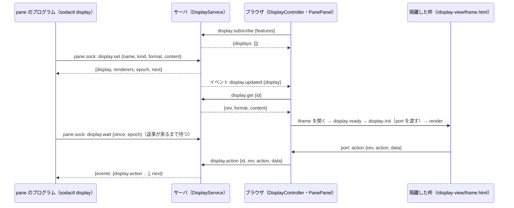

# 仕様: soda 拡張の表示の面（ブラウザ版）— `sodactl display`・パネルと帯・隔離した枠

## 概要

pane ごとの「面」（パネル・帯）を、サーバのメモリの台帳 `DisplayService` が持つ。pane の中のプログラムは `sodactl display` で、ログイン不要の受け口 `pane.sock`（無ければ `/ws`）から
面を出す・更新する・閉じる・操作を待つ。ブラウザは、接続のたびに「面を出せる」と名乗って（`display.subscribe`）一覧を受け取り、表示中の pane の面の中身を取って（`display.get`）、
`PaneFrame` の中（端末の上と右）に描く。中身は、専用の静的ページ `/display-view/frame.html` を sandbox の iframe で開き、`postMessage` で渡した専用の通り道（`MessagePort`）で送る。
作者のスクリプトは動かさず、`data-soda-action` を付けた要素の操作だけを、枠 → ブラウザ → サーバ → 待っている `sodactl` へ返す。



## 設計方針

1. **ask と同じ型に乗せる**（research R1・R2・R5・R7）: 受け口の操作は `PaneOpRegistry` に登録し、引数から `paneId` を除く。`/ws` の方式は別に登録する。画面は購読して一覧を取り、中身は別の要求で取る。
   枠は、同じ origin の静的ページを専用のヘッダで開き、中身を `postMessage` で渡す。sodactl は `viaPaneSocketOrSession` で経路を選ぶ。
2. **作者のスクリプトを動かさない**（decisions D13）: 枠の CSP は `script-src 'self'`。動くのは静的ページ自身のスクリプトだけで、それが中身を取り除いて差し込み、宣言された操作を拾う。
   これで、枠からキー入力のフォーカスを奪う・外へ通信する・枠を別のページへ移す、の 3 つの道を、ブラウザの仕組み（CSP）と取り除きの二重で塞ぐ。
3. **サーバにファイルを読ませない・外へ通信させない**: 中身は sodactl が読み、要求の 1 行に載せる（256 KiB まで。受け口の 1 行の上限 1 MiB の内側）。ask の `image`・`view.file` で受け口に足された権限
   （サーバの権限での読み出し・外部への取得）を、この操作では足さない。
4. **出来事は「長く待つ要求」で受ける**: 受け口は 1 接続 1 要求・返事 1 行（R1）。この形を変えずに、`display.wait` が「次の出来事が来るまで待って、まとめて返す」。sodactl が繰り返して NDJSON にする
   （`pane observe` と同じく、NDJSON にするのは sodactl の側。R7）。pane ごとの通し番号（`seq`）と、サーバの起動ごとの印（`epoch`）で、取りこぼしと入れ替えを見分ける。
5. **面はメモリだけ**（D15）: 保存しない。再起動・`soda handoff` で消える。
6. **出せる画面は名乗りで数える**（D16）。
7. **後の作業が足せる形**: 操作・出来事の型は `packages/protocol/src/display.ts` の 1 か所。出来事の行は `type`（`<層>.<種類>`）で分け、読み手は知らない `type`・項目を無視する。
   作業 B（拡張のプロセス）は、同じ操作の名前と引数（`paneId` つきの `/ws` の形）を標準入出力の行に載せるだけで済む。観測・割り込みは `type` を足す。端末版は `display.subscribe` で名乗る。

退けた案:

- **面を `Pane` に載せてスナップショットで配る**（独自トークンの型）: 中身が大きく（最大 256 KiB × 64）、全接続へ毎回配ることになる。名乗りも別に要る。
- **受け口の返事を複数行にして流す**: 受け口の約束（返事は 1 行）と、sodactl の `callPaneOp`・繋ぎ直しの型を変えることになる。
- **枠の中身を URL（`srcdoc`・`blob:`・クエリ）で渡す**: `srcdoc` は親の CSP を継ぐ・`blob:` は親の origin になる。ask と同じ「静的ページ＋`postMessage`」が、専用の CSP を HTTP ヘッダで確実に付けられる。
- **サーバで HTML を取り除く**: サーバに HTML のパーサを入れることになる。取り除きは描く場所（枠の中。ブラウザのパーサ）で行い、すり抜けても CSP が止める二重にする。

## 対象範囲

- 追加:
  - `packages/protocol/src/display.ts`（型・定数・検査）と `display.test.ts`
  - `packages/server/src/display/DisplayService.ts`・`rateLimit.ts` と各 `.test.ts`、`display.integration.test.ts`
  - `packages/server/src/panesocket/displayOps.ts`、`packages/server/src/surface/methods/display.ts`
  - `packages/cli/src/commands/display.ts` と `display.test.ts`、`packages/cli/src/display.integration.test.ts`
  - `packages/web/src/display/DisplayController.ts`・`frameMessages.ts`・`displayLayout.ts`・`themeVars.ts` と各 `.test.ts`、`packages/web/src/store/display.ts` と `.test.ts`
  - `packages/web/src/components/DisplayFrame.vue`・`PanePanel.vue`・`PaneBands.vue`、`packages/web/src/mobile/MobileDisplaySheet.vue` と各 `.test.ts`
  - `packages/web/public/display-view/frame.html`・`frame.js`・`sanitize.js`、`packages/web/src/display/displayViewSanitize.test.ts`
  - `packages/e2e/src/specs/display.spec.ts`・`display-isolation.spec.ts`・`display-mobile.spec.ts`、`packages/e2e/src/support/display.ts`
  - `docs/display.md`
- 変更:
  - `packages/protocol/src/messages.ts`・`events.ts`・`errors.ts`・`paneSocket.ts`・`index.ts`
  - `packages/server/src/composeServer.ts`・`surface/methods/index.ts`・`surface/methods/deps.ts`・`http/HttpServer.ts`・`testkit.ts`・`handoffSmoke.ts`
  - 既存のテストへの追加: `packages/server/src/http/HttpServer.integration.test.ts`（`/display-view/*` のヘッダと許可リスト。H16）・`packages/server/src/panesocket/paneSocket.integration.test.ts`・`packages/server/src/machine/machines.integration.test.ts`（中継越し。AC26）・
    `packages/protocol/src/messages.test.ts`・`paneSocket.test.ts`・`packages/cli/src/cliArgs.test.ts`
  - `packages/cli/src/cliArgs.ts`・`main.ts`・`skills/sodactl/SKILL.md`
  - `packages/web/src/components/PaneFrame.vue`・`ContextMenu.vue`、`mobile/MobileShell.vue`、`main.ts`・`injection.ts`・`store/StoreAdapter.ts`・`actions/ActionDispatcher.ts`
  - `packages/client-core/src/keys/bindings.ts`・`keys/actions.ts`、`packages/client-core/src/net/clientError.ts`（新しい 4 つの code の日本語の文言）、`packages/tui/src/actions/TuiDispatcher.ts`（新しい操作を「ブラウザで使えます」と知らせる。`openGraph` の case〔257 行〕と同じ形）
  - `docs/sodactl.md`・`docs/verification.md`・`docs/tui-parity.md`・`docs/tui.md`・`AGENTS.md`
- 触らない: `third_party/ask-form/`・`packages/web/public/ask-view/`（読むだけ。`links.js` と `vendor/marked.umd.js` を枠から読み込む）・`/ask-view/*` の応答ヘッダ・`packages/server/src/handoff/`・`packages/server/src/ask/`。

## 依拠する既存の事実

出所は `research.md` の追補（R1〜R9・実装アンカー A1〜A18。main の `165f88b` を読んだもの）。

- 受け口は 1 接続 1 要求・返事 1 行。操作は `PaneOpDef { name, params, handler(ctx, params) }` で、`ctx` は `{ paneId, connId, signal }`。受け口が確かめるのは pane の実在だけで、`paneId` は自己申告（R1。`packages/server/src/panesocket/PaneOpRegistry.ts`・`PaneSocket.ts`・`askOp.ts`）。
- 受け口の要求の 1 行は 1 MiB・返事は 8 MiB・同時接続 64。sodactl は `ECONNREFUSED` と `pane_socket_busy` を 5 秒まで繋ぎ直す。`unknown_op`・`bad_request`・接続前の失敗は `/ws` へ落ちる（R1・R6・R7。`packages/protocol/src/paneSocket.ts`・`packages/cli/src/paneSocket.ts` の `viaPaneSocketOrSession`・`callPaneOp`）。
- `/ws` の方式は `METHOD_SCHEMAS` と `MethodResultMap` に載せ、`surface/methods/*.ts` で登録する。知らない方式は `not_found`（R5・R7。`packages/protocol/src/messages.ts:920`・`1017` 付近、`packages/cli/src/commands/ask.ts` の `probeServer`）。
- 「画面」を見分ける既存の手段は、`ask.subscribe` を送った接続（`desktop`・`mobile`）で、端末版も `desktop` と名乗るが `ask.subscribe` は送らない（R4。`packages/server/src/ask/AskService.ts:102`・`157`）。
- 接続が切れたときの後始末は、2 つの `WsGateway` の `onClientGone`（`packages/server/src/composeServer.ts:460-464`・`471-475`）。pane が閉じたことは bus の `pane.closed`（R6）。
- 静的ページの配信は `HttpServer.handle` の中の、許可リストつきの専用の経路（`packages/server/src/http/HttpServer.ts:132` `handleAskView`・`ASK_VIEW_FILES`）。全応答に `SECURITY_HEADERS` が付き、専用の経路だけ CSP と `X-Frame-Options` を差し替える。
  アプリ本体の CSP に `frame-src` は無く、同じ origin の枠だけ開ける（R2）。
- Markdown の枠のヘッダ（`sandbox allow-scripts allow-popups allow-popups-to-escape-sandbox; default-src 'none'; script-src 'self'; …`）で、静的ページ自身のスクリプト（同じ origin の `.js`）は動き、インラインは動かない（R2。`ask-view.spec.ts` が実測している、と research の調査の報告にある。**この設計の書き手は、その spec を実行していない**）。
- 枠の文書が別のページへ移っても `contentWindow` は同じ（R2。**ブラウザの仕様としての理解で、実測していない**。E2E で確かめる。下の「脅威と対策」H4）。
- 端末の大きさは、葉（`.pane-layout-leaf`）の箱の変化に 100ms のまとめで追従する。葉の外で箱を縮めれば、追加のコードは要らない（R3。`packages/web/src/components/PaneLayout.vue`・`term/ViewSync.ts`）。
- pane の差し込み場所は `.pane-frame-body`（`PaneFrame.vue:305`）。モバイルは `MobileShell.vue` の別の作りで、`PaneFrame` は `enabled=false`（R3）。
- ブラウザのイベントの振り分けは `StoreAdapter`（`packages/web/src/store/StoreAdapter.ts:200-202`）、配線は `main.ts`（`133`・`198`・`298-299`・`398`・`519`）（R5）。
- キーの操作は `packages/client-core/src/keys/bindings.ts` の `ACTIONS` に足し、種類は `keys/actions.ts`。`prefix+i` は既定に無い。端末版で使えない操作は「ブラウザで使えます」と知らせる先例がある（`open_graph`。`bindings.ts:79-86`・`actions.ts:94`・`docs/tui.md:137`）。
  prefix を外から入れる口は `KeyInputController.injectPrefix()`（`packages/web/src/keys/KeyInputController.ts:190`）。pane の端末へフォーカスを戻す関数は `packages/web/src/actions/paneFocus.ts` の `focusPaneIfShown`（`AskDialog.vue:6`・`133` が使っている）。
- 枠の中で動く `.js` を vitest で試す型は、`?raw` で読み込む（`packages/web/src/ask/askViewLinks.test.ts:1`）。
- handoff で引き継ぐのは pane の PTY だけ（R6。`packages/server/src/handoff/HandoffManifest.ts`）。
- 未確認: クロスオリジンの枠の中の `autofocus` をブラウザが無視するか（無視しても、取り除きで消すので設計は依らない）／`MessagePort` を sandbox の不透明 origin の枠へ渡せること（仕様上は渡せる。`tasks.md` の T14 の最初の E2E で確かめ、だめなら下の「代替」に切り替える）／sandbox に `allow-forms` があれば、枠の中の `form` の `submit` のイベントが起きること（`allow-forms` が無いと、ブラウザは `submit` のイベントを起こす前に送信を止める、という仕様の理解。実測していない。`tasks.md` の T14 (8) で確かめる）／
  marked が、Markdown の中の HTML（`<button data-soda-action>`）をそのまま通すこと（同じく T14 (8)）／Playwright の `frame.evaluate` が、`script-src 'self'` の枠の文書の中で式を評価できること（`tasks.md` の T15 (1)。だめなときの代えも、そこに書いた）／`ControlSurface` が handler の想定外の例外を `internal` にすること（`PaneOpRegistry.invoke` は R1 で確認）。

## インターフェース / データ構造

### 定数と型（`packages/protocol/src/display.ts`）

```ts
export const DISPLAY_KINDS = ["panel", "band"] as const;
export const DISPLAY_FORMATS = ["text", "markdown", "html"] as const;
export const DISPLAY_NAME_RE = /^[A-Za-z0-9_-]{1,32}$/;
export const DISPLAY_TITLE_MAX = 80;                    // 文字。制御文字は不可
export const DISPLAY_CONTENT_MAX_BYTES = 256 * 1024;    // UTF-8
export const DISPLAY_PANELS_PER_PANE_MAX = 4;
export const DISPLAY_BANDS_PER_PANE_MAX = 2;
export const DISPLAY_TOTAL_MAX = 64;                    // サーバ全体の面の数
export const DISPLAY_SERVER_BYTES_MAX = 8 * 1024 * 1024; // サーバ全体の中身の合計
export const DISPLAY_SIZE = { panel: { min: 160, max: 800, default: 320 }, band: { min: 24, max: 96, default: 32 } } as const; // px
export const DISPLAY_TTL_MIN_MS = 1_000;
export const DISPLAY_TTL_MAX_MS = 86_400_000;
export const DISPLAY_SET_RATE = { perSec: 10, burst: 10 } as const;       // pane ごと（続けて 10 回まで通り、11 回目は誤り。1 秒に 10 回ぶん戻る）
export const DISPLAY_ACTION_NAME_RE = /^[A-Za-z0-9_.:-]{1,64}$/;
export const DISPLAY_ACTION_FIELDS_MAX = 64;            // 添える値の組の数
export const DISPLAY_ACTION_KEY_MAX = 64;               // 欄の名前の文字数
export const DISPLAY_ACTION_DATA_MAX_BYTES = 8 * 1024;  // 添える値の JSON（UTF-8）
export const DISPLAY_ACTION_RATE = { perSec: 20, burst: 20 } as const;    // 接続ごと
export const DISPLAY_EVENT_QUEUE_MAX = 64;              // pane ごとに溜める出来事
export const DISPLAY_WAITERS_PER_PANE_MAX = 4;
export const DISPLAY_WAITERS_MAX = 16;                  // サーバ全体
export const DISPLAY_WAIT_MIN_MS = 1_000;
export const DISPLAY_WAIT_MAX_MS = 60_000;
export const DISPLAY_WAIT_DEFAULT_MS = 30_000;
export const DISPLAY_WAIT_NAMES_MAX = 8;
export const DISPLAY_FEATURES = ["panel", "band", "format:text", "format:markdown", "format:html", "actions"] as const;
export const DISPLAY_RENDER_FEATURES = ["panel", "band", "actions"] as const; // 画面が名乗れる種類
export const DISPLAY_LINE_VERSION = 1;

export type DisplayKind = (typeof DISPLAY_KINDS)[number];
export type DisplayFormat = (typeof DISPLAY_FORMATS)[number];

/** 面の見出し（中身は含まない）。 */
export interface DisplayInfo {
  id: string;        // UUID。同じ pane・同じ名前で出ている間は変わらない。閉じて出し直すと変わる
  paneId: string;
  name: string;
  kind: DisplayKind;
  format: DisplayFormat;
  title: string;     // 省いたら name
  size: number;      // px（panel は幅・band は高さ）
  rev: number;       // 1 から。set のたびに 1 増える
  bytes: number;     // 中身の UTF-8 のバイト数
  updatedAt: string; // ISO 8601
}
export interface DisplayContent { id: string; rev: number; format: DisplayFormat; content: string }
/** その種類を出せると名乗った画面の数。 */
export interface DisplayRenderers { panel: number; band: number; actions: number }
export interface DisplayLimits {
  contentBytes: number; titleChars: number; panelsPerPane: number; bandsPerPane: number; total: number; serverBytes: number;
  panelSize: { min: number; max: number; default: number }; bandSize: { min: number; max: number; default: number };
  setPerSec: number; actionDataBytes: number; waitersPerPane: number; eventQueue: number; waitMaxMs: number;
}
export interface DisplayFeatures { features: string[]; limits: DisplayLimits; renderers: DisplayRenderers; epoch: string }
/** `set` の中身（`paneId` を除いたもの）。`checkDisplaySet` が返す形で、受け口の `PaneDisplaySetParams` と同じ項目。`/ws` の `DisplaySetParams` は、これに `paneId` を足したもの。 */
export interface DisplaySetBody { name: string; kind: DisplayKind; format: DisplayFormat; content: string; title?: string; size?: number; ttlMs?: number }
export interface DisplaySetResult { display: DisplayInfo; renderers: DisplayRenderers; epoch: string; next: number }
export interface DisplayWaitResult { epoch: string; next: number; events: DisplayEvent[]; dropped: number; reset: boolean }

/** サーバが溜めて `display.wait` で返す出来事。sodactl はそのまま 1 行にする。 */
export type DisplayEvent =
  | { type: "display.action"; seq: number; paneId: string; name: string; rev: number; action: string; data?: Record<string, string>; at: string }
  | { type: "display.closed"; seq: number; paneId: string; name: string; reason: DisplayClosedReason; at: string };
export type DisplayClosedReason = "closed" | "dismissed" | "expired";
// "closed"＝プログラムの close（自分の close も届く）／"dismissed"＝利用者が閉じた／"expired"＝--ttl-ms
// pane が閉じたときは、溜めた出来事ごと捨てる。待っている wait は not_found で終わり、sodactl が display.end（pane_closed）にする

/** sodactl が stdout に書く行（`display wait`・`display events`・`set --wait`）。上の DisplayEvent に、sodactl が作る行を足したもの。 */
export type DisplayLine =
  | DisplayEvent
  | { type: "display.ready"; v: 1; paneId: string; epoch: string; features: string[]; renderers: DisplayRenderers }
  | { type: "display.dropped"; count: number }
  | { type: "display.reset"; reason: "server_restarted"; epoch: string }
  | { type: "display.timeout" }
  | { type: "display.end"; reason: "pane_closed" | "connection_closed" | "unsupported" };
```

- 検査の関数（純粋。サーバ・sodactl・ブラウザが同じものを使う）:
  `checkDisplaySet(raw): { ok: true; value: DisplaySetBody } | { ok: false; reason: string }`（名前・種類・形・題・大きさの範囲・中身のバイト数・`ttlMs`）、
  `checkDisplayAction(raw): { ok: true; value: { action: string; data?: Record<string,string> } } | { ok: false; reason: string }`（操作の名前・値はすべて文字列・組の数・欄の名前の長さ・JSON のバイト数）、
  `displayLimits(): DisplayLimits`、`parseDisplayLine(line: string): DisplayLine | null`（`type` が文字列の JSON の 1 行なら、**知らない `type`・知らない項目があっても落とさず**返す。JSON でない・`type` が無ければ `null`。型は読み手の利便のためで、知らない行は `{type: string}` として通す）。
- 行の決まり（docs に書く。AC23）: 1 行 1 つの JSON。`type` は `<層>.<種類>`。読み手は知らない `type` の行・知らない項目を無視する。項目の意味は変えない（変えるときは `type` を新しくする）。
  `display.ready` の `v` は、この決まりそのものを変えるときだけ上げる。

### 操作（`/ws` の方式と、`pane.sock` の操作）

| 名前 | 引数（`/ws`） | 結果 | `pane.sock` | 呼べる接続（`/ws`） |
|---|---|---|---|---|
| `display.set` | `{paneId, name, kind, format, content, title?, size?, ttlMs?}` | `DisplaySetResult { display: DisplayInfo; renderers: DisplayRenderers; epoch: string; next: number }` | 載せる（`paneId` を除く） | どれでも |
| `display.close` | `{paneId, name?, all?}`（`name` か `all: true` のどちらか 1 つ） | `{ closed: string[] }`（閉じた名前。無ければ空） | 載せる | どれでも |
| `display.list` | `{paneId}` | `{ displays: DisplayInfo[] }` | 載せる | どれでも |
| `display.wait` | `{paneId, since?, epoch?, names?, timeoutMs}` | `DisplayWaitResult { epoch: string; next: number; events: DisplayEvent[]; dropped: number; reset: boolean }` | 載せる | どれでも |
| `display.features` | `{}` | `DisplayFeatures` | 載せる | どれでも |
| `display.subscribe` | `{features: string[]}`（`DISPLAY_RENDER_FEATURES` のうち出せるもの。知らない値は捨てる。8 個まで） | `{ displays: DisplayInfo[] }`（全 pane の分） | 載せない | 種類が `desktop`・`mobile` の接続だけ（ほかは `invalid_params`） |
| `display.get` | `{id}` | `DisplayContent` | 載せない | 名乗った接続だけ（ほかは `display_closed`） |
| `display.action` | `{id, rev, action, data?}` | `{}` | 載せない | 名乗った接続だけ |
| `display.dismiss` | `{id}` か `{paneId}`（その pane の全部）のどちらか 1 つ | `{ closed: string[] }` | 載せない | 名乗った接続だけ |

- 受け口の操作の名前の定数（`packages/protocol/src/paneSocket.ts`）: `PANE_OP_DISPLAY_SET = "display.set"`・`PANE_OP_DISPLAY_CLOSE`・`PANE_OP_DISPLAY_LIST`・`PANE_OP_DISPLAY_WAIT`・`PANE_OP_DISPLAY_FEATURES`。
  引数の schema は `PaneDisplaySetParams = DisplaySetParams.omit({ paneId: true })` の形（`PaneAskOpenParams` と同じ作り）。**受け口の操作は、対象の pane を引数で受け取らない**。
- サーバ → 画面のイベント（`packages/protocol/src/events.ts`。bus で全接続へ配る。名乗っていない接続は無視する）:
  `{ event: "display.updated"; data: { display: DisplayInfo } }`（出た・更新された）、`{ event: "display.removed"; data: { id: string; paneId: string; name: string } }`。
- エラーの code（`packages/protocol/src/errors.ts` に足す）:
  - `invalid_display`: `set` の引数が規則の外（名前・種類・形・題・大きさ・中身の上限・`ttlMs`）。sodactl は使い方の誤り（終了コード 2）に読み替える（`invalid_ask_spec` と同じ扱い）。
  - `display_limit`: 数・合計の上限（pane のパネル 4・帯 2、サーバ全体 64・8 MiB）。終了コード 1。
  - `display_busy`: 頻度の上限（`set` が毎秒 10 回）・待ちの上限（pane 4・全体 16）。終了コード 1。
  - `display_closed`: その面はもう無い・名乗っていない接続からの `get`・`action`・`dismiss`。
  - 既存のもの: `not_found`（pane が無い・古いサーバが方式を知らない）・`invalid_params`（`set` 以外の引数の形の誤り。`display.wait` の `timeoutMs` が 1,000〜60,000 の外・`names` が 8 個を超える・`display.action` の `rev` が 1〜今の `rev` の整数でない・操作の名前や値が規則の外、を含む）。

### サーバ: `DisplayService`（`packages/server/src/display/DisplayService.ts`）

```ts
export interface DisplayServiceOptions {
  bus: EventBus;
  paneExists(paneId: string): boolean;
  isScreenKind(clientId: string): boolean;   // 接続の種類が desktop か mobile（AskService の isBrowserKind と同じもの）
  clock?: { now(): number; setTimeout; clearTimeout };  // テストで差し替える
  newId?: () => string;                       // 既定 crypto.randomUUID
  logger: Logger;
}
export class DisplayService {
  readonly epoch: string;                                   // 作るたびに randomUUID
  set(paneId: string, body: unknown): DisplaySetResult;      // 投げる: invalid_display / display_limit / display_busy / not_found
  close(paneId: string, sel: { name?: string; all?: boolean }, reason?: DisplayClosedReason): { closed: string[] };
  list(paneId: string): { displays: DisplayInfo[] };
  /** owner: 受け口は `{ signal }`（接続が終わると abort）、`/ws` は `{ clientId }`（`onClientGone` がその接続の待ちを外す）。 */
  wait(paneId: string, p: { since?: number; epoch?: string; names?: string[]; timeoutMs: number }, owner: { signal?: AbortSignal; clientId?: string }): Promise<DisplayWaitResult>;
  features(): DisplayFeatures;
  subscribe(clientId: string, features: string[]): { displays: DisplayInfo[] };
  get(clientId: string, id: string): DisplayContent;
  action(clientId: string, p: { id: string; rev: number; action: string; data?: unknown }): void;
  dismiss(clientId: string, sel: { id?: string; paneId?: string }): { closed: string[] };
  onClientGone(clientId: string): void;
  dispose(): void;
}
```

- 持つもの: `byPane: Map<paneId, Map<name, Entry>>`（`Entry` は `DisplayInfo`・中身・`ttl` のタイマー）、`byId: Map<id, Entry>`、`queues: Map<paneId, { seq: number; events: DisplayEvent[]; waiters: Set<Waiter> }>`、
  `subscribers: Map<clientId, Set<string>>`（名乗った種類）、待ち 1 つの記録（内部の型。起こす関数・`names`・時間切れのタイマー・持ち主）、`totalBytes`、pane ごと・接続ごとの頻度の桶（`rateLimit.ts` の `TokenBucket`）。
- `set`: 検査（`checkDisplaySet`）→ pane の実在 → 頻度（pane の桶）→ 新規なら数の上限（その pane の同じ種類・サーバ全体）→ 合計のバイト数（置き換えなら差分で見る）→ 台帳を更新（新規は `rev: 1`・`id` を振る。
  置き換えは `rev + 1`。`kind` は置き換えで変えられる〔数の上限は変えた後の種類で見る〕）→ `ttlMs` があればタイマーを張り直す（無ければ外す）→ bus に `display.updated`。結果の `next` は、その pane の今の `seq`（この後の出来事だけを待つための印）。
- `close`・`dismiss`・`ttl` の経過: 台帳から外す → `totalBytes` を戻す → その pane の列に `display.closed`（理由つき）を足す → bus に `display.removed`。無い名前は何もせず `closed: []`。
- 出来事の列: pane ごとに `seq` を 1 から振り、新しいもの 64 件を残す。足すたびに、待っている `wait` を起こす。
- `wait`:
  1. 引数の `epoch` があり、サーバの `epoch` と違う → すぐ `{ epoch, next: 今の seq, events: [], dropped: 0, reset: true }`。
  2. `since` を省いたら、今の `seq`（この後の出来事だけ）。
  3. `seq > since` の出来事（`names` があれば、その名前のものだけ）があれば、すぐ返す。列の最も古い `seq` が `since + 1` より大きければ、その差を `dropped` に入れる。`next` は返した最後の `seq`（無ければ今の `seq`）。
  4. 無ければ待つ。待ちの数が pane 4・全体 16 を超えるなら `display_busy`。`timeoutMs` で空の結果、`owner.signal` の abort・`owner.clientId` の切断で待ちを外す（返事は書かれない）、pane が閉じたら `not_found`、`dispose` で空の結果。
- `action`: 名乗った接続か → 面があるか（`display_closed`）→ `format` が `text` なら `invalid_params` → `checkDisplayAction` → `rev` が 1〜今の `rev` の整数か → 頻度（接続の桶。**超えた分は、誤りにせず捨てて成功を返す**。ログに数だけ）→ 列に `display.action` を足す（`rev` は画面が送った値＝押した時点の中身の版）。
- bus の `pane.closed`: その pane の面をすべて外し（`display.removed` を配る）、列を捨て、待っている `wait` を `not_found` で終わらせる。
- `renderers()`: 名乗った接続のうち、まだつながっているものを種類ごとに数える。`onClientGone` で外す。
- ログ: 面の名前・pane・バイト数・理由だけ。**中身・題・操作に添えた値は書かない**。

### 受け口と `/ws` の登録

- `packages/server/src/panesocket/displayOps.ts`: `displaySetOp(displays)`・`displayCloseOp`・`displayListOp`・`displayWaitOp`・`displayFeaturesOp`。どれも `ctx.paneId` を対象にして `DisplayService` を呼ぶ。`displayWaitOp` は `ctx.signal` を渡す。
- `packages/server/src/surface/methods/display.ts`: `registerDisplayMethods(surface, deps)`。上の表の 9 つ。`/ws` の方式に渡る文脈（`MethodContext`。`packages/server/src/surface/ControlSurface.ts:9`）には signal が無いので、`display.wait` は `{ clientId: ctx.clientId }` を渡し、`DisplayService.onClientGone` がその接続の待ちを外す。
- `packages/server/src/composeServer.ts`: `AskService` の近くで `DisplayService` を作り（`isScreenKind` は ask に渡しているものと同じ関数）、`paneOps.register(...)` を 5 つ、`registerAllMethods` の依存に `displays`、2 つの `onClientGone` に `displays.onClientGone(clientId)`、`close()` の `finally` に `displays.dispose()`。
  handoff の `closeClients`・`pausePollers`（`composeServer.ts:496`・`516`。R6）には足さない（接続が切れれば待ちは外れ、面は execve で消える）。

### sodactl（`packages/cli/src/commands/display.ts`）

```
sodactl display set <名前> --kind panel|band [--title <文字>] [--size <px>] [--ttl-ms <ms>]
                    (--text <文字> | --markdown-file <パス> | --html-file <パス> | --format text|markdown|html < 標準入力)
                    [--wait [--timeout <ms>]] [--pane <id>]
sodactl display close (<名前> | --all) [--pane <id>]
sodactl display list [--pane <id>]
sodactl display wait [<名前>] [--since <seq> --epoch <印>] [--timeout <ms>] [--pane <id>]
sodactl display events [<名前>…] [--since <seq> --epoch <印>] [--pane <id>]
sodactl display --features
```

- 対象の pane: `--pane` を省くと呼び出し元の pane（`resolveCallerPane`。確かめられなければ `caller_pane_unknown`）。経路は `viaPaneSocketOrSession`。`--pane` で**呼び出し元と違う pane** を指したときは、受け口を使わず `/ws`（受け口は名乗った pane しか扱えないため）。
  `--machine <名前|id>` は `/ws` の中継で、`--pane` が必須（省いたら使い方の誤り）。
- 中身: `--markdown-file`・`--html-file` は sodactl が読む（通常のファイルだけ・256 KiB まで・UTF-8）。`--text`・2 つの `--…-file` のどれも無ければ、標準入力を読む（1 MiB まで読んで、256 KiB を超えたら使い方の誤り）。そのときの形は `--format`（**省いたら `text`**）。
  `--format` は標準入力のときだけ付けられる。指定が 2 つ以上・どれも無くて標準入力が端末（何も流し込まれていない）は、使い方の誤り。
  検査は送る前に `checkDisplaySet` で行う（上限の誤りが、サーバへ行く前に終了コード 2 になる）。あわせて、**組み立てた要求の 1 行が受け口の上限（1 MiB）を超えないか**を送る前に確かめる（中身は JSON の文字列として載るので、制御文字などエスケープの要る文字ばかりの中身は、256 KiB 以内でも 1 行が膨らむ）。
  超えたら使い方の誤り（「中身に、エスケープの要る文字が多すぎる」）。普通の文字（ASCII・日本語）の 256 KiB ちょうどは、1 行が 1 MiB に届かない。
- stdout と終了コード:

| コマンド | stdout（1 行の JSON） | 終了コード |
|---|---|---|
| `set` | `{"status":"ok","display":{…DisplayInfo},"renderers":{"panel":1,"band":1,"actions":1},"epoch":"…","next":12}` | 0 |
| `set --wait` | `set` の行は出さず、その面の最初の出来事の行（`display.action`・`display.closed`・`display.timeout`・`display.reset`） | 0 |
| `close` | `{"status":"ok","closed":["名前"]}` | 0 |
| `list` | `{"status":"ok","displays":[…]}` | 0 |
| `wait` | 出来事の行を 1 つ（名前を付ければその面のもの。`--timeout` が過ぎたら `{"type":"display.timeout"}`、入れ替えを見つけたら `display.reset`） | 0 |
| `events` | 最初に `display.ready`、以後は出来事の行を出し続ける。終わるときは `display.end` | `pane_closed`・`unsupported` は 0、`connection_closed` は 1 |
| `--features` | `{"sodactl":[…DISPLAY_FEATURES],"limits":{…},"server":DisplayFeatures|null}` | 常に 0 |
| 古いサーバ（`set`・`close`・`list`・`wait`） | `{"status":"unsupported","reason":"this server does not support display surfaces (update soda)"}` | 0 |

  - 「古いサーバ」の判定（5 つのコマンドに共通。`events` も同じ）:
    - **受け口が `unknown_op` を返したら、`/ws` へ落ちずに「古いサーバ」とする**。受け口はその pane のサーバのものなので、そこが知らなければ古いと決まる（ask は `/ws` へ落ちるが、`display` は落ちない。
      ログインしていない pane の中でも、`unsupported`・終了コード 0 になる）。そのために、`viaPaneSocketOrSession` をそのまま使わず、`callPaneOp` の結果の `fallback`（理由が `unknown_op`）をこの判定に回す小さな包みを `commands/display.ts` に置く。
      受け口へ繋げない・`bad_request` は、今までどおり `/ws` へ落ちる（落ちた先で未ログインなら `unauthenticated`・終了コード 1）。
    - `/ws` の経路では、`not_found` が「知らない方式」と「pane が無い」の両方で返る。**`not_found` を受けたら `display.features` を 1 回呼び**、それも `not_found` なら古いサーバ、通れば pane が無い。
    - 古いサーバのとき: `set`・`close`・`list`・`wait` は `{"status":"unsupported",…}`、`events` は `display.end`（`unsupported`）。どれも終了コード 0。
    - pane が無いとき: `set`・`close`・`list`・`wait` は `not_found`（終了コード 1）、`events` は `display.end`（`pane_closed`）で終了コード 0。
  - エラー: `invalid_display` と使い方の誤りは 2、ほかは 1（stderr に `{"error":{"code","message"}}`）。
- `wait`・`events` の繰り返し（`runWaitLoop`）: `display.wait {since, epoch, names, timeoutMs: 30_000}` を繰り返す。
  - 結果の `dropped > 0` → `display.dropped` の行。`events` → そのまま行に。`reset: true` → `display.reset` の行を出し、`epoch`・`since` を新しい値にして続ける（`wait` はそこで終わる）。
  - 始め方: `events`・`wait` は、まず `display.features` を呼んで `epoch` を得る（ここで古いサーバも分かる）。`events` は `display.ready`（その `epoch`・`features`・`renderers`）を出す。最初の `display.wait` は、その `epoch` を渡し、`since` を省く（＝この後の出来事だけ。`--since`・`--epoch` があればそれ）。
    以後は、返ってきた `epoch`・`next` を渡す。**`epoch` を必ず渡す**ので、待っている最中にサーバが入れ替わっても、繋ぎ直した先で `reset` になる。`set --wait` は `set` の結果の `epoch`・`next` を使う（`set` と `wait` の間の出来事を落とさない）。
  - 1 回の `display.wait` の `timeoutMs` は `DISPLAY_WAIT_DEFAULT_MS`（30 秒）。空で返ったら、すぐ次を呼ぶ。`sodactl display wait`・`set --wait` の `--timeout <ms>`（1,000〜86,400,000）は、全体の待ち時間で、**省くと待ち続ける**。過ぎたら `display.timeout` の行。
  - 繋ぎ直し: 受け口の経路の `connection_closed`（返事なしで閉じた）・`ECONNREFUSED`・`pane_socket_busy` は、**最初の失敗から 5 秒まで** 150ms おきに繋ぎ直す（`callPaneOp` の繋ぎ直しに加えて、`connection_closed` もこの繰り返しの中で 1 回の失敗として扱う）。
    `/ws` の経路は、接続が切れたら 5 秒まで接続し直す。5 秒で戻らなければ、`events` は `display.end`（`connection_closed`）で終了コード 1、`wait` は `connection_closed`（終了コード 1）。
    戻った先のサーバの `epoch` が違えば、上の `reset` になる（入れ替え・再起動）。
  - 待っている途中の `not_found` → 上の「古いサーバ」の判定のとおり（`display.features` が通るので、pane が無い: `events` は `display.end`〔`pane_closed`〕で終了コード 0、`wait` は `not_found`・終了コード 1）。
  - `display_busy`（待ちの上限）→ そのままエラー（終了コード 1）。
  - stdout に書けなくなったら（読み手が閉じた）、行を出さずに終了コード 1（`pane observe` の `output_closed` と同じ）。
- `--features` の `server`: `display.features` を受け口（無ければ `/ws`）で呼ぶ。失敗（古い・つなげない・未ログイン）は `null`。

### ブラウザ

- `packages/web/src/store/display.ts`（Pinia `useDisplayStore`）: `infos: Map<id, DisplayInfo>`、`contents: Map<id, DisplayContent>`（`rev` つき）、`collapsed: Set<paneId>`（その画面だけ。保存しない）、`activePanel: Map<paneId, id>`。
  導出: `panelsOf(paneId)`・`bandsOf(paneId)`（`updatedAt` ではなく、最初に出た順〔`id` を受け取った順〕で並べる）。
- `packages/web/src/display/DisplayController.ts`（`AskController` に当たる通信の係）: `onOpened()`（`display.subscribe {features: ["panel","band","actions"]}` → 一覧で置き換え）・`onClosed()`（消す）・`resetForMachineSwitch()`・
  `onEvent(e)`（`display.updated`／`display.removed`）・`ensureContent(id)`（表示中の面の中身が無い・版が古ければ `display.get`。同じ id の取得は 1 本にまとめる。古い世代の応答は捨てる）・
  `sendAction(id, rev, action, data)`（ブラウザ側でも毎秒 20 回で捨てる）・`dismiss(sel)`。古いサーバ（`display.subscribe` が `not_found`）では、何もしない（面は出ない。トーストも出さない）。
- `packages/web/src/components/DisplayFrame.vue`: 枠 1 つ。props `info: DisplayInfo`・`content: DisplayContent | undefined`。下の「枠とのやりとり」を担う。`defineExpose({ focusInside() })`。
- `packages/web/src/components/PanePanel.vue`: パネルの領域（`role="complementary"`・`aria-label="pane『…』のパネル"`）。見出しに、固定のラベル（下）・タブ（複数のとき。`role="tablist"`。矢印・`Home`・`End` で移って切り替える）・たたむ・閉じる。本体に、選ばれた面の `DisplayFrame`。
  たたんだときは、縦書きの細い見出し（幅 24px。押すと戻る）だけ。
- `packages/web/src/components/PaneBands.vue`: 帯の領域。帯 1 本ごとに、左端に固定の印、`DisplayFrame`（高さ `size`）、右端に閉じる。
- 固定のラベル（アプリが描く。枠の外）: パネルは「pane のプログラムの表示（隔離）· 〈面の名前〉」。その横（複数ならタブ）に題（文字として。`textContent`）。帯は左端に「▍表示」の印（`title`・`aria-label` に「pane のプログラムの表示（隔離）· 〈面の名前〉: 〈題〉」）。
  面の名前は `[A-Za-z0-9_-]` だけなので、ラベルの文言に似せた文字を入れられない。
  題・中身からは、この文言・印の位置・色を変えられない（枠の外の DOM で、枠は自分の箱の外へ描けない）。
- 差し込み（`PaneFrame.vue`。`enabled` のときだけ）:

```
div.pane-frame-body（display:flex; flex-direction:column）
├ PaneBands（帯があるとき。flex:0 0 auto）
└ div.pane-frame-row（flex:1 1 auto; min-height:0; display:flex）
   ├ div.pane-frame-main（flex:1 1 auto; min-width:0; min-height:0; position:relative）← この中に <slot />（葉。100%×100% のまま）
   └ PanePanel（パネルがあるとき。flex:0 0 <幅>px。たたんだら 24px）
```

  葉（`.pane-layout-leaf`）と `TerminalPane` には手を入れない。葉の箱が縮むので、既存の `ResizeObserver` が大きさを申告し直す（R3）。
- 大きさの丸め（`packages/web/src/display/displayLayout.ts`。純粋）: `panelWidth(paneWidthPx, sizePx, cellWidthPx): { width: number; autoCollapsed: boolean }`（幅は `min(size, floor(pane 幅 / 2))`。残りが `40 × セルの幅` を下回るなら `autoCollapsed`）、
  `visibleBands(sizes: number[], paneHeightPx): { shown: number; hidden: number }`（高さの合計が pane の高さの 3 分の 1 以下に収まる先頭の本数。残りは「ほか N 件」の 1 行〔高さ 20px。押すとその pane の帯の名前の一覧をトーストで出す〕）。幅はアニメーションさせない。
- モバイル（`mobile/MobileShell.vue`）: `.mobile-shell-bar` と `.mobile-shell-pane` の間に `PaneBands`（フォーカス中の pane の分）。バーに、パネルがあるときだけボタン（「表示」と件数）。押すと `MobileDisplaySheet.vue`
  （`<dialog>`。上に固定のラベル・タブ・閉じる、下に `DisplayFrame`。`Esc`・［閉じる］でシートだけ閉じる〔面は残る〕。［この表示を消す］で `dismiss`）。パネルは端末の幅に関わらない。
- 右クリックのメニュー（`ContextMenu.vue` の pane の項目。面があるときだけ）: 「表示をすべて閉じる」→ `actions.dismissDisplays(paneId)` → `display.dismiss {paneId}`。
- キーの操作: `ACTIONS` に `{ id: "focus_display", label: "pane の表示（パネル・帯）へ移る", group: "pane", defaults: ["prefix+i"], action: { type: "focusDisplay" } }`（`group: "pane"` は既存の値。`bindings.ts:277`）。
  `ActionDispatcher`: フォーカス中の pane の、選ばれているパネル（たたんであれば戻す。無ければ最初の帯）の `DisplayFrame.focusInside()`。面が無ければトースト「この pane に表示はありません」。端末版は「ブラウザで使えます」と知らせる（`open_graph` と同じ）。
- テーマ: `packages/web/src/display/themeVars.ts` の `readThemeVars(): { dark: boolean; vars: Record<string,string> }`（`document.documentElement` の計算済みのスタイルから、`CSS_VARS`〔`packages/client-core/src/theme/uiTokens.ts`〕の値を読む）。枠へ `render` と一緒に渡す。開いている間のテーマの変更には、次の `render`（中身の更新）で追従する（ask と同じ割り切り）。

### 枠とのやりとり（`DisplayFrame.vue` ↔ `/display-view/frame.html`）

```html
<iframe class="display-frame" sandbox="allow-scripts allow-forms allow-popups allow-popups-to-escape-sandbox"
        referrerpolicy="no-referrer" src="/display-view/frame.html" title="pane のプログラムの表示（隔離）" data-display-frame></iframe>
```

定数 `DISPLAY_VIEW_SANDBOX = "allow-scripts allow-forms allow-popups allow-popups-to-escape-sandbox"`・`DISPLAY_VIEW_PAGE = "/display-view/frame.html"`（`DisplayFrame.vue` から export。負の対照が書き換える）。
`allow-forms` は、枠の中の `form` の `submit` のイベントを起こすためだけに付ける（`frame.js` が必ず `preventDefault()` する。実際の送信は、CSP の `form-action 'none'` と、取り除きで `action` を消すことの三重で起きない）。
`allow-scripts` は静的ページ自身のスクリプトのため、`allow-popups`・`allow-popups-to-escape-sandbox` は `http(s)` のリンクを新しいタブで開くため（Markdown の枠と同じ。作者のスクリプトが無いので、`window.open` は呼ばれない）。`allow-same-origin`・`allow-top-navigation`・`allow-modals`・`allow-downloads` は付けない。

1. 枠のページが読み込みの最後に `parent.postMessage({ type: "display-ready" }, "*")`。
2. 親は `window` の `message` で、**`ev.source === iframe.contentWindow`・状態が「待ち」・その iframe の `load` のイベントがまだ 1 回以下**（0 回＝`load` より先に届いた、も受ける）のときだけ受ける。`MessageChannel` を作り、`contentWindow.postMessage({ type: "display-init", v: 1 }, "*", [port2])`。状態を「つながった」にする。
   **これ以後、その枠からの `window` の `message` は一切受けない**（受けるのは `port1` だけ）。
3. 親 → 枠（`port1.postMessage`）: `{ type: "render", rev, format, source, theme: { dark, vars }, relayKeys: [{ key, ctrl, alt, shift, meta }] }`（`relayKeys` は prefix のキー 1 つ）／`{ type: "focus" }`。
   `render` は、`content` が届いたとき・`rev` が変わったときに送る（枠は作り直さない）。
4. 枠 → 親（`port.postMessage`）: `{ type: "rendered", rev }`／`{ type: "action", rev, action, data? }`／`{ type: "key", key: "escape" | "prefix" }`。
5. 親の検査（`packages/web/src/display/frameMessages.ts` の `readFrameMessage(data): FrameMessage | null`。純粋。
   `type FrameMessage = { type: "rendered"; rev: number } | { type: "action"; rev: number; action: string; data?: Record<string,string> } | { type: "key"; key: "escape" | "prefix" }`）: オブジェクトで、`type` が上の 3 つのどれか。
   `rendered`・`action` の `rev` は正の整数。`action` は `checkDisplayAction` を通る。`key` は 2 つの値のどちらか。それ以外は `null`（捨てる）。
   `action` は、その面の今の `id` と、枠が言う `rev` を付けて `DisplayController.sendAction` へ。`key: "escape"` はその pane の端末へフォーカスを戻す（`focusPaneIfShown`）。`key: "prefix"` は端末へ戻してから `keyInput.injectPrefix()`。
6. **移ったことの検知**: その iframe の `load` が 2 回目に起きたら（＝枠の文書が入れ替わった）、`port1` を閉じ、iframe を捨てて作り直す（`:key` を変える）。1 分に 3 回を超えたら作り直さず、枠の場所に固定の文言「表示を読み込めませんでした」を出す。
7. 片づけ: 面が消えた・部品が外れたら、`port1.close()`。フォーカスがその枠にあったら、その pane の端末へ戻す。

代替（`MessagePort` を不透明 origin の枠へ渡せなかった場合だけ。`tasks.md` の T14 で確かめる）: `display-init` で 128 ビットの乱数（`crypto.getRandomValues`）を渡し、以後の枠 → 親の知らせにその値を添えさせ、親は「送り主の窓・値の一致・`load` が 1 回」で受ける。採ったら `decisions.md` に書く。

### 静的ページ（`packages/web/public/display-view/`）と配信

- `frame.html`: `<meta charset>`・既定のスタイル（インラインの `<style>`。文字・見出し・表・コード・`button`・`input` を、渡された変数 `--soda-bg`・`--soda-fg`・`--soda-accent`・`--soda-menu-border` などで描く。`html, body { margin: 0 }`・帯で 1 行が縦の中央に来る余白）・
  `<script src="/ask-view/vendor/marked.umd.js">`・`<script src="/ask-view/links.js">`・`<script src="/display-view/sanitize.js">`・`<script src="/display-view/frame.js">`。
- `sanitize.js`（`window.__sodaDisplaySanitize(root)`。`<template>` の中身＝文書に入れる前の断片に掛ける）:
  - 消す要素: `script, meta, link, base, iframe, frame, frameset, object, embed, applet, portal, map, area, math, audio, video, source, track, noscript, set, animate, animateTransform, animateMotion, animateColor, foreignObject`。SVG の中の `a` は、中身を残して `a` だけ外す。
  - 消す属性: `on` で始まるもの全部・`autofocus`・`srcdoc`・`action`・`formaction`・`target`・`ping`・`background`・`http-equiv`・`xlink:href`（`a` 以外）。
  - `a[href]`: `#` で始まるものは残す。`self.askViewLinks.openableHref`（`packages/web/public/ask-view/links.js` が枠の中に置く関数）を通るものは `target="_blank" rel="noopener noreferrer"`。ほかは `href` を外し、行き先を `title` に出す。
  - `img[src]`: `data:image/`（png・jpeg・gif・webp・svg+xml）だけ残す。ほかは `src` を外す（`srcset` は常に外す）。
  - `form`: 残す（`action`・`target` は上で消える）。`input[type=file]`・`input[type=image]` は消す。
  - `style` 要素と `style` 属性は残す（外への読み込みは CSP が止める）。
- `frame.js`:
  - `display-init` を、`ev.source === parent` のとき 1 回だけ受け、`ev.ports[0]` を通り道にする。
  - `render`: `text` は `<pre>` に `textContent`。`markdown` は `marked.parse`（mermaid は読み込まない）→ `<template>` → 取り除き。`html` は `DOMParser` で読んで、`head` と `body` の `<style>` と `body` の子を `<template>` へ移す → 取り除き。
    差し替えの前に、スクロールの位置と、利用者が触った欄（`name` があり、値が既定と違う）の値・チェックを控え、差し替えの後に同じ `name` の欄へ戻す。`body` の子を差し替え、テーマの変数を `:root` に当て、`rendered` を送る。
    **フォーカスの持ち越し**: 差し替えの直前に、枠の文書が既にフォーカスを持っていて（`document.hasFocus()` が真＝利用者が枠の中にいる）、フォーカスのある要素に `name` か `id` があるときだけ、差し替えの後に同じ `name`／`id` の要素へ `focus()` する（無ければ `body`）。
    枠の文書がフォーカスを持っていない（利用者が端末にいる）ときは、`focus()` を呼ばない。これは、既に枠にあるフォーカスを保つだけで、端末から奪わない。
  - 操作: `click` を `body` で拾い、`closest("[data-soda-action]")` が `form` でない要素なら `{ action, data: { value: <data-soda-value か value 属性> } }`（値が無ければ `data` なし）。`disabled` の要素は拾わない。
    `submit` を拾って必ず `preventDefault()`。`form[data-soda-action]` なら、`FormData`（文字列の値だけ。同じ名前は最後の値）と、押されたボタンの `name`/`value` を `data` にして送る。`data-soda-action` の無い `form` の送信は何もしない。
    送る前に、名前の形・組の数・バイト数を確かめ、外れたら送らない。
  - キー: `window` のキャプチャの `keydown`。`Escape` は `preventDefault()` して `key: "escape"`。`relayKeys` に一致するものは `key: "prefix"`。変換中（`isComposing`・`keyCode === 229`）は除く。
  - `focus`: 最初の操作できる要素（`button, [href], input, select, textarea, [tabindex]:not([tabindex="-1"])` のうち `disabled` でないもの）へ。無ければ `document.body`（`tabindex="-1"`）へ。**枠のスクリプトが `focus()` を呼ぶのは、この知らせのときと、上の「フォーカスの持ち越し」（枠が既にフォーカスを持つとき）だけ**。
- 配信（`packages/server/src/http/HttpServer.ts`）: `handle` に `if (pathname.startsWith("/display-view/")) return this.handleDisplayView(...)` を足す。許可リスト `DISPLAY_VIEW_FILES = { "frame.html": { type: "text/html; charset=utf-8", csp: DISPLAY_VIEW_CSP }, "frame.js": {…}, "sanitize.js": {…} }`。
  GET・HEAD だけ。`frame.html` は `Content-Security-Policy` を次の値に差し替え、`X-Frame-Options: SAMEORIGIN` に付け直す。`.js` は CSP と `X-Frame-Options` を外す（`handleAskView` と同じ扱い。2 つの経路で重なる部分は、小さな共通の関数にまとめてよい。**`/ask-view/*` の値は変えない**）。

```
sandbox allow-scripts allow-forms allow-popups allow-popups-to-escape-sandbox; default-src 'none'; script-src 'self'; style-src 'unsafe-inline'; img-src data:; font-src data:; frame-ancestors 'self'; base-uri 'none'; form-action 'none'
```

（定数 `DISPLAY_VIEW_CSP`。`HttpServer.ts` から export。）

## 振る舞いの詳細

- **どの画面に出るか**: 名乗った画面の全部に、一覧（見出し）が届く。中身を取るのは、その pane を描いている画面だけ（`PanePanel`・`PaneBands` が載ったときに `ensureContent`）。別の tab・workspace を見ている画面は、切り替えたときに取る。
  たたんであるパネルは、中身を取らない（戻したときに取る）。
- **複数の画面**: 中身は同じ。操作は、どの画面からでも 1 回押せば 1 件。たたむ・選んでいるタブは画面ごと。閉じる（dismiss）は全画面から消える。
- **`set` の置き換えと、古い画面の操作**: 操作には、押した時点の `rev` が付く。プログラムは、今の `rev`（`set` の結果）と違えば、古い中身で押されたと分かる。サーバは捨てない（判断はプログラムに任せる）。
- **大きさの権限**: パネルの開閉で、その画面が申告する列数が変わる。tab の大きさの権限を持つ画面なら PTY が変わり、持たない画面は中央寄せのまま（既存の決まり）。
- **zoom・分割**: `PaneFrame` を通るので、zoom 中も出る。分割の境のドラッグは葉の箱を変えるだけ。pane のドロップ先の判定は、パネルを含む pane 全体の箱のまま。
- **フォーカス**: 面が出る・更新される・消えるとき、アプリは `focus()` を呼ばない。枠の中へ入るのは、利用者が枠を押す・`Tab` で入る・キーの操作（`focus_display`）のどれか。枠にフォーカスのある面が消えたら、その pane の端末へ戻す。
- **枠の中のキー**: 端末へは流れない（別の文書なので、親の `keydown` に届かない）。`Esc` と prefix だけ、通り道で親へ渡る。枠の上のホイールは、枠の中をスクロールする（別の文書なので、端末へ届かない）。
- **`ttl`**: `set` のたびに張り直す。`--ttl-ms` なしの `set` で外れる（`report-metadata` と同じ）。
- **サーバの停止・入れ替え**: `dispose()` で待ちを空の結果で返し（返事が書ければ）、面を捨てる。入れ替えでは接続が先に切れるので、sodactl は繋ぎ直しに入る（上の `runWaitLoop`）。
- **別のマシン**: 先のマシンのサーバが台帳を持つ。手元のブラウザは、そのマシンを表示中の接続で `display.subscribe` する（既存の中継。`DisplayController.resetForMachineSwitch` で、前のマシンの面を捨てる）。
- **古い版の組み合わせ**（docs の表にする）:

| sodactl | サーバ | 画面 | 動き |
|---|---|---|---|
| 新 | 新 | 新 | すべて使える |
| 新 | 旧 | — | `set`・`close`・`list`・`wait` は `unsupported`（終了コード 0）。`events` は `display.end`（`unsupported`）。`--features` の `server` は `null` |
| 旧 | 新 | — | `display` を知らない（使い方の誤り＝終了コード 2） |
| 新 | 新 | 旧（読み込み直していない） | 名乗らないので出ない。`renderers` に数えない。`set` は成功する |
| 新 | 新 | 端末版だけ | 同上（`renderers` はすべて 0） |

## ドメイン固有の考慮

### 脅威と対策

前提（既存と同じ）: 同じ OS の利用者の権限で動くプロセスは、受け口へ繋げる（`pane.sock` は 0600。R1）。pane のプログラムは、その pane の入出力を元から扱える。**守るもの**は、アプリ本体（DOM・Cookie・`/ws`）・ほかの pane・認証の情報・利用者のキー入力・利用者の画面の主導権・サーバとほかの画面の動き。
**信頼しないもの**は、面の中身（pane のプログラムが、外から取ってきた HTML をそのまま出すことがある）と、受け口・`/ws` から届く引数。

| # | 脅威 | 対策 | 確かめ |
|---|---|---|---|
| H1 | 中身のスクリプトが、アプリの DOM・Cookie・`localStorage`・`/ws` に触れる | 枠は `allow-same-origin` なしの sandbox（属性と応答ヘッダの二重）で不透明 origin。中身は `postMessage` で渡し、URL に載せない | AC15（E2E。負の対照: `allow-same-origin` を足す） |
| H2 | 中身のスクリプトが動く（キー入力を読む・フォーカスを奪う・親へ偽の知らせを送る） | CSP `script-src 'self'`（インライン・イベント属性・`javascript:` は動かない）。取り除きで `script`・`on*` も消す（二重） | AC16・AC19（E2E: 実行の印が付かない。負の対照は**層ごと**: 取り除きだけ外す → まだ動かず、CSP の違反が記録される／CSP だけゆるめる → まだ動かない／両方外す → 動いてテストが落ちる） |
| H3 | 中身が外へ通信する（画像・CSS の `url()`・フォント・`fetch`・フォームの送信）。pane のプログラムが、利用者のブラウザを使って外へ持ち出す | CSP `default-src 'none'`・`img-src data:`・`font-src data:`・`form-action 'none'`。取り除きで `link`・`img` の外の `src`・`action` を消す | AC17（E2E。ブラウザの要求の観測が 0） |
| H4 | 枠が別のページへ移り（`meta refresh`・リンク・フォーム）、移った先のページが、同じ枠の窓として親へ知らせを送る・中身を受け取る | 移る手段を取り除く（`meta`・`base`・`area`・`form` の `action`・`a` は新しいタブだけ・SVG の `a` と SMIL）。スクリプトが無いので `location=` は呼べない。**それでも移ったら**: 親は `load` の 2 回目で枠を捨てる。操作は `MessagePort` だけで受け、移った先の文書は port を持たない。`display-ready` は 1 回しか受けない | AC17・AC18（E2E。負の対照: `meta` の取り除きを外すと枠が移り、親が作り直す・操作は届かない、を別々に見る） |
| H5 | 別の窓・別の枠・拡張機能が、同じ形の `message` を親へ送る | `display-ready` は送り主の窓の一致・状態・`load` の回数で受ける。それ以後は port だけ。`readFrameMessage` で形と上限を確かめる | AC18（単体と E2E。負の対照: 送り主の検査を外す） |
| H6 | 中身が Sodashitsu 自身の確認画面を装う（承認のボタンに見せかける） | 枠の外に、アプリが描く固定のラベル（パネルの見出し・帯の印）。題は文字として出す。枠は自分の箱の外へ描けない。面はモーダルにならない（画面全体を覆えない） | AC7（E2E） |
| H7 | 面がフォーカスを奪い、端末に打つはずのキー（パスワードなど）が枠に入る | H2（スクリプトなし）。取り除きで `autofocus` を消す。アプリは面の出現・更新で `focus()` を呼ばない。枠のスクリプトが `focus()` を呼ぶのは、親の `focus` の知らせのときと、枠が既にフォーカスを持つときの持ち越しだけ（`document.hasFocus()` が偽なら呼ばない） | AC19（E2E: 更新を挟んで打った文字が pane に届く。負の対照: H2 と同じ） |
| H8 | 受け口から、ほかの pane の面を出す・閉じる・読む・待つ | 受け口の操作は引数に `paneId` を持たず、`ctx.paneId` だけを対象にする。名前は pane ごとの名前空間。面の `id` を引数に取る操作（`get`・`action`・`dismiss`）は受け口に載せない | AC14（結合テスト。負の対照: handler が引数の `paneId` を使うように変える） |
| H9 | 受け口へ繋げるプロセスが、別の pane を名乗って面を出す（`paneId` は自己申告） | 既存の境界のまま（同じ OS の利用者は信頼する。ask と同じ）。面の固定のラベルは、pane のプログラムの表示だと示すだけで、どのプロセスかは保証しない。**限界として docs に書く** | docs（AC27） |
| H10 | 受け口が、サーバの権限を貸す（ファイルの読み出し・外部への通信） | この操作では、サーバはファイルを読まない・外へ通信しない。中身は要求に載って届くものだけ | 設計（サーバの `display/` に `fs`・`http` の呼び出しが無いことを、レビューで見る） |
| H11 | 大量・巨大な面や、速すぎる更新で、サーバ・ブラウザ・ほかの pane を止める | 中身 256 KiB・pane ごとの数・サーバ全体の数と合計・`set` の頻度・待ちの数・出来事の列 64・操作の頻度と大きさ。中身は、表示中の画面だけが取る。上限の超過は、その要求だけの誤り | AC25（単体・結合。上限ちょうどと超過） |
| H12 | 面が画面を占めて、端末を使えなくする | パネルは pane の半分まで・端末が 40 列相当を下回るなら自動でたたむ・帯は合計で pane の 3 分の 1 まで。利用者は、いつでもたたむ・閉じる・まとめて閉じる。パネルの開閉は pane の中だけに効く | AC8・AC25（E2E） |
| H13 | 操作に添えた値（利用者が欄に打ったもの）が、別のプログラムに渡る | 出来事は、その pane の `wait` にだけ返る。ほかの pane の受け口の要求には返らない。ただし H9 の限界（同じ OS の利用者のプロセスは pane を名乗れる）は同じ。ログに値を書かない。**パスワードなどの秘密を面の欄に打たせない、と docs に書く** | AC14・docs |
| H14 | 利用者の画面の操作で、プログラムが意図しない操作を実行する（古い中身のボタン） | 操作に `rev` を付ける。プログラムが見分けて捨てられる | AC13 |
| H15 | リンクで、利用者を外のページへ誘導する | `http:`・`https:` だけ・新しいタブ・`noopener noreferrer`・利用者が押したときだけ。行き先はブラウザの表示に出る。スクリプトが無いので、`window.open` は呼べない。**限界として docs に書く**（Markdown の枠と同じ） | AC6（E2E） |
| H16 | 静的ページの `.js`（`/display-view/*.js`）が、アプリ本体の origin で配られる | 中身は固定の静的ファイルだけ（許可リスト）。利用者の入力を含まない。`/ask-view/*.js` と同じ扱い | 統合テスト（ヘッダ・許可リストの外は 404） |

残る限界（docs に書く）: H9・H13（同じ OS の利用者の別のプロセスは、pane を名乗って面を出せ、操作を待てる）／H15（利用者が確かめずにリンクを押す危険）／
面の中身が端末や Sodashitsu の画面に似せた絵を**自分の枠の中に**描くことは止められない（H6 のラベルで見分ける）／中身の CSS が重い描画でブラウザを遅くすることは止められない（利用者が閉じる）。

### `pane.sock` に載せる操作の 4 条件

| 条件 | `display.set`・`close`・`list`・`wait`・`features` |
|---|---|
| 対象が呼び出し元の pane に限られる | 引数に `paneId` が無く、`ctx.paneId` の面・出来事だけを扱う。`features` は pane に依らない数だけを返す |
| pane のプログラムが出来ることを超えない | 自分の pane の領域の中に、隔離した枠を出すだけ。pane の入出力・ほかの pane・設定・認証に触れない。サーバの権限での読み出し・外部通信は無い。端末の大きさは変わる（自分の pane だけ。利用者がたたむ・閉じるで戻せる） |
| 秘密を返さない | 返すのは、自分が出した面の見出し・その pane の面への操作・画面の数・上限。中身・ほかの pane の情報・接続の id は返さない |
| 量の上限がある | 上の定数（要求 1 行 1 MiB の内側の 256 KiB・数・合計・頻度・待ちの数と時間） |

### そのほか

- 実体の id は UUID（AGENTS.md）。面の `id` も `crypto.randomUUID()`。人が見るのは名前（`name`）で、`id` は画面とサーバの間だけで使う。
- E2E は `e2e-observe-browser` に従う: 面が出たこと・中身・隔離・フォーカスは、ブラウザの DOM・枠の中の DOM（`frameLocator`）・ブラウザが送った要求（`client.view` の列数・`display.action`）・CSP の違反の記録で判定する。
  テスト自身の接続は、前提を作ること（pane の用意）と、サーバ側の確かめ（PTY の列数）にだけ使う。sodactl は、ビルドしたものを子プロセスで動かす。
- 端末（WebGL）の文字は DOM から読めないので、「打ったキーが pane に届いた」は、ブラウザが送った入力のフレームか、pane の出力（テストの接続）で見る。何を見たかを spec のコメントに書く。
- `soda handoff` の確かめは vitest で出来ないので、`handoffSmoke.ts` に 1 段足す（AC24）。

## エラー処理 / 異常系

- `set` の引数が規則の外 → `invalid_display`（sodactl は送る前に同じ検査をして終了コード 2）。数・合計の上限 → `display_limit`。頻度 → `display_busy`。pane が無い → `not_found`。どれも、既にある面は変えない。
- `get`・`action`・`dismiss` で面が無い・名乗っていない → `display_closed`。画面は、`get` の `display_closed` を「消えた」として扱う（イベントとの前後。トーストは出さない）。
- 枠が読み込めない（静的ページが 404・古いサーバ）: 枠の場所に固定の文言「表示を読み込めませんでした」。10 秒待っても `display-ready` が来ないときも同じ。
- 中身が壊れている（HTML として読めない・Markdown の整形が投げる）: 枠のスクリプトは `try` で受け、`<pre>` に文字のまま出す。`rendered` は送る。
- 画面からの操作が規則の外（名前・大きさ）: 枠が送らない・親が捨てる・サーバが `invalid_params`。三重。頻度の超過は、親とサーバが捨てる。
- `wait` の最中に pane が閉じた → `not_found`。接続が切れた → 待ちを外す。サーバが止まる → 空の結果か、返事なしで切れる（sodactl は繋ぎ直しへ）。
- `DisplayService` の中の想定外の例外は、受け口・`/ws` の入口が `internal` にして、その要求だけを失敗させる（受け口は `PaneOpRegistry.invoke`。R1。`/ws` の側は未確認なので、`registerDisplayMethods` の handler は、`RpcError` 以外を投げない作りにする）。bus の購読の中（`pane.closed`）は `try` で囲み、ログに残して続ける。

## 受け入れ基準との対応

- AC1: sodactl が `SODA_PANE_ID`・`SODA_PANE_SOCKET` から受け口へ `display.set` を送る（ログインなし）。`DisplayService.set` → `display.updated` → 画面が `display.get` → `PanePanel`／`PaneBands` の `DisplayFrame` が `render`。入力は、sodactl の引数と、pane の環境変数。E2E は枠の中の DOM を見る。
- AC2: 同じ名前の `set` は `rev + 1` で置き換え、画面は同じ `DisplayFrame` に `render` を送り直す（枠は作り直さない。`frame.js` がスクロールと欄の値を戻す）。標準入力・`--format`・指定の数・`--size` の範囲は、sodactl の引数の解析と `checkDisplaySet`。
- AC3: `close`・`all`・`ttl` のタイマー・bus の `pane.closed` が、台帳から外して `display.removed` を配る。`list` は `byPane.get(ctx.paneId)` だけを返す。
- AC4: `PaneFrame` の `.pane-frame-row` で、葉の箱がパネルの幅だけ縮む → 既存の `ResizeObserver` → `client.view`。E2E は、ブラウザが送った `client.view` の列数と、サーバの PTY の列数、端末の箱とパネルの箱が重ならないことを見る。
- AC5: `PanePanel` のタブ（`activePanel`）と、`PaneBands` の縦積み。入力は、同じ pane への名前の違う `set`。
- AC6: `frame.js` の 3 つの描き方と、`sanitize.js` のリンクの扱い。mermaid は読み込まないので、コードのまま。
- AC7: `PanePanel`・`PaneBands` が枠の外に描く固定のラベル。題は `textContent`。入力は `DisplayInfo.title`（`set` の `--title`）。
- AC8: 見出し・帯の［×］→ `display.dismiss {id}`、右クリックのメニュー → `display.dismiss {paneId}`。サーバが `display.closed`（`dismissed`）を列に足し、`display.removed` を配る。
- AC9: `MobileShell.vue` の帯の置き場と、バーのボタン → `MobileDisplaySheet`。大きさは `.mobile-shell-pane` の箱を測る（`packages/web/src/mobile/usePaneArea.ts`。R3）。パネルはその箱の外の重ね表示なので、測る箱は変わらない。帯は箱を縮める（高さだけ）。
- AC10: `frame.js` の `click` → port の `action` → `readFrameMessage` → `display.action` → 列 → `display.wait` の結果 → sodactl が 1 行。`set --wait` は `set` の `epoch`・`next` から待つ。`markdown` の中の `<button data-soda-action>` は、marked が HTML をそのまま通す（未確認。上の「依拠する既存の事実」）前提で、取り除きが属性を残すので届く。通さなければ、`markdown` では操作を宣言できないと docs に書き、AC10 の後半を `decisions.md` に記録して外す。
- AC11: `frame.js` の `submit`（`preventDefault`・`FormData`）。CSP の `form-action 'none'` が二重の守り。
- AC12: sodactl の `runWaitLoop`（`display.ready` → 出来事 → `display.dropped`／`display.end`）。入力は `display.wait` の結果の `events`・`dropped`・`reset` と、接続の失敗。
- AC13: どの画面の `display.action` も同じ列に入る。`rev` は画面が持つ中身の版（`DisplayContent.rev`）。
- AC14: `displayOps.ts` の 5 つが `ctx.paneId` だけを使う（引数の schema に `paneId` が無い）。結合テストは、受け口へ pane A を名乗って、pane B の面の名前で `close`・`list`・`wait` しても B の面に届かないことを見る。
- AC15: `DISPLAY_VIEW_SANDBOX` と `DISPLAY_VIEW_CSP`（どちらにも `allow-same-origin` が無い）。E2E は、枠の中で探りを動かす必要があるが、作者のスクリプトは動かないので、Playwright の `frame.evaluate` で枠の文書の中で式を評価して `parent.document`・`localStorage`・`fetch`・`WebSocket` を試す（配るものを変えない。`frame.evaluate` が CSP で使えないときの代えは `tasks.md` の T15 (1)）。
- AC16: CSP `script-src 'self'` と取り除きの二重。E2E は、中身に書いた `<script>`・`onerror`・`onclick`・`javascript:` の印（枠の文書の `document.title` の書き換え・`data-ran` の属性）が付かないことを見る（取り除きが先に消すので、普段は CSP の違反は起きない）。
  CSP の層が単独で効くことは、負の対照（AC28）の「取り除きだけ外した版でも動かず、違反が記録される」で確かめる。
- AC17: CSP の `default-src 'none'` ほかと取り除き。E2E は、ブラウザの要求の記録（`page.on("request")`）に外への要求が無いこと、枠の URL が `/display-view/frame.html` のままであることを見る。
- AC18: `DisplayFrame.vue` の受け方（送り主・状態・`load` の回数・port）と `readFrameMessage`。単体は `frameMessages.test.ts` と `DisplayFrame.test.ts`（別の窓からの `message`・形の違うもの・上限の超過・2 回目の `display-ready`）。E2E は、親のページから別の iframe を作って同じ形を送っても `display.action` が送られないことを見る。
- AC19: H2・H7 の対策。E2E は、端末にフォーカスを置き、`autofocus` つきの中身を `set` し、更新を挟んで打った文字が pane に届く（ブラウザが送った入力のフレーム）ことと、`document.activeElement` が枠でないことを見る。
- AC20: `DisplayService.features()`（`renderers()` は名乗った接続の数）と、sodactl の `--features`。端末版・sodactl は `display.subscribe` を送らないので 0。
- AC21: sodactl の「古いサーバ」の判定（`not_found` → `display.features` の再確認）。テストは、`display.*` を登録しない偽のサーバ（受け口は `unknown_op`・`/ws` は `not_found`）で見る。名乗らない画面は `subscribers` に入らない。
- AC22: `set` は画面の数に依らず台帳に入る。後からの `display.subscribe` の結果に入る。
- AC23: `packages/protocol/src/display.ts` の型と、`parseDisplayLine` のテスト（知らない `type`・知らない項目を落とさない）。docs の「行の決まり」。
- AC24: `handoffSmoke.ts` の段（`tasks.md` の T17）。入れ替えで `epoch` が変わり、`runWaitLoop` が `display.reset` を出す。停止では 5 秒の繋ぎ直しが尽きて `display.end`（`connection_closed`）・終了コード 1。
- AC25: `checkDisplaySet`・`DisplayService` の上限（単体: ちょうどと超過）、`TokenBucket`（偽の時計）、`displayLayout.ts`（単体）と E2E（幅の丸め・自動でたたむ・「ほか N 件」）。
- AC26: sodactl の経路の選択（`--pane` が呼び出し元と違う・`--machine`・`SODA_PANE_SOCKET` なし → `/ws`）と、`/ws` の方式。結合テストは `packages/cli/src/display.integration.test.ts`（実サーバ・ログイン済み）と、`machines.integration.test.ts` の方式の中継越し。
- AC27: `docs/display.md` ほか（`tasks.md` の T18）。
- AC28: 上の表の「負の対照」（H1・H2・H5・H8）。test 工程で、対策を外して落ちること（二重の守りは、片方ずつ外しても落ちず、両方外すと落ちること）を確かめ、生の出力を `test-result.md` に残す（`tasks.md` の T19）。
- AC-I1: 面は `set` でだけ出る。`PanePanel`・`PaneBands` は出現で `focus()` を呼ばない。［×］は `button`（`Tab` で届く）。
- AC-I2: 枠の中の `button`・`form` はブラウザの既定のまま確定する。［×］は確認なし。
- AC-I3: `focus_display`（`prefix+i`）→ `DisplayFrame.focusInside()` → 枠の中の `Tab`・`Enter`・`Space` → `Esc` で `focusPaneIfShown`。タブは `role="tablist"` の矢印。
- AC-I4: 「振る舞いの詳細」のフォーカスの決まり。枠にフォーカスのある面が消えたら端末へ戻す。
- AC-I5: 枠は別の文書なので、キー・ホイールは親へ届かない。渡るのは `Esc` と prefix だけ（`frame.js` の `relayKeys`）。prefix は端末へ戻してから `injectPrefix()`。
