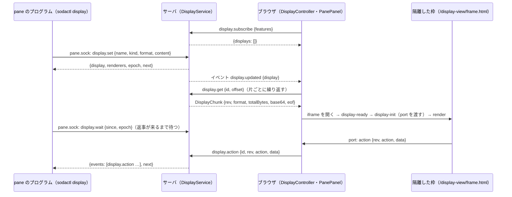

# 仕様: soda 拡張の表示の面（ブラウザ版）— `sodactl display`・パネルと帯・隔離した枠（静的な形式と、スクリプトが動く形式）

## 概要

pane ごとの「面」（パネル・帯）を、サーバのメモリの台帳 `DisplayService` が持つ。pane の中のプログラムは `sodactl display` で、ログイン不要の受け口 `pane.sock`（無ければ `/ws`）から
面を出す・更新する・閉じる・操作を待つ。ブラウザは、接続のたびに「面を出せる」と名乗って（`display.subscribe`）一覧を受け取り、表示中の pane の面の中身を取って（`display.get`）、
`PaneFrame` の中（端末の上と右）に描く。中身は、専用の静的ページ `/display-view/frame.html` を sandbox の iframe で開き、`postMessage` で渡した専用の通り道（`MessagePort`）で送る。
静的な形式（`text`・`markdown`・`html`）では、作者のスクリプトは動かさず、`data-soda-action` を付けた要素の操作だけを、枠 → ブラウザ → サーバ → 待っている `sodactl` へ返す。
**スクリプトが動く形式（`script-html`。利用者の決定。`decisions.md` D21）**は、別の静的ページ `/display-view/script.html` で開き、作者のスクリプトを動かす。操作は小さな API `window.soda` で返し、
キー入力の横取りには 3 つの備え（操作中の表示・覆いと「元の場所へ戻す」〔回数はサーバが pane ごとに数える〕・枠が移ったら閉じて知らせる）を置く。防げないことは「残る限界」に書く（下の「スクリプトが動く形式」）。
パネルの幅は、利用者がつまみで変えられる（下の「パネルの幅のつまみ」）。中身の上限は 2 MiB（下の「大きな中身の運び方」）。



## 設計方針

1. **ask と同じ型に乗せる**（research R1・R2・R5・R7）: 受け口の操作は `PaneOpRegistry` に登録し、引数から `paneId` を除く。`/ws` の方式は別に登録する。画面は購読して一覧を取り、中身は別の要求で取る。
   枠は、同じ origin の静的ページを専用のヘッダで開き、中身を `postMessage` で渡す。sodactl は、`viaPaneSocketOrSession` と同じ条件で経路を選ぶ（`unknown_op` の扱いだけが違う。下の「sodactl」）。
2. **静的な形式では、作者のスクリプトを動かさない**（decisions D13 のうち残る部分）: 枠の CSP は `script-src 'self'`。動くのは静的ページ自身のスクリプトだけで、それが中身を取り除いて差し込み、宣言された操作を拾う。
   これで、枠からキー入力のフォーカスを奪う・外へ通信する・枠を別のページへ移す、の 3 つの道を、ブラウザの仕組み（CSP）と取り除きの二重で塞ぐ。
   **スクリプトが動く形式は、別のページ・別のヘッダ・別の `format`** にして、静的な形式の守りを 1 つもゆるめない（同じページに「スクリプトを許す」の切り替えを持たない）。出す側が形式を選び、アプリは枠の外に固定の印を付ける。
3. **サーバにファイルを読ませない・外へ通信させない**: 中身は sodactl が読み、要求の 1 行に載せる（2 MiB まで。受け口の 1 行の上限を 4 MiB に上げる。D25）。ask の `image`・`view.file` で受け口に足された権限
   （サーバの権限での読み出し・外部への取得）を、この操作では足さない。
4. **出来事は「長く待つ要求」で受ける**: 受け口は 1 接続 1 要求・返事 1 行（R1）。この形を変えずに、`display.wait` が「次の出来事が来るまで待って、まとめて返す」。sodactl が繰り返して NDJSON にする
   （`pane observe` と同じく、NDJSON にするのは sodactl の側。R7）。pane ごとの通し番号（`seq`）と、サーバの起動ごとの印（`epoch`）で、取りこぼしと入れ替えを見分ける。
5. **面はメモリだけ**（D15）: 保存しない。再起動・`soda handoff` で消える。
6. **出せる画面は名乗りで数える**（D16）。
7. **後の作業が足せる形**: 操作・出来事の型は `packages/protocol/src/display.ts` の 1 か所。出来事の行は `type`（`<層>.<種類>`）で分け、読み手は知らない `type`・項目を無視する。
   作業 B（拡張のプロセス）は、同じ操作の名前と引数（`paneId` つきの `/ws` の形）を標準入出力の行に載せるだけで済む。観測・割り込みは `type` を足す。端末版は `display.subscribe` で名乗る。

退けた案:

- **面を `Pane` に載せてスナップショットで配る**（独自トークンの型）: 中身が大きく（最大 2 MiB。全体で 32 MiB）、全接続へ毎回配ることになる。名乗りも別に要る。
- **受け口の返事を複数行にして流す**: 受け口の約束（返事は 1 行）と、sodactl の `callPaneOp`・繋ぎ直しの型を変えることになる。
- **枠の中身を URL（`srcdoc`・`blob:`・クエリ）で渡す**: `srcdoc` は親の CSP を継ぐ・`blob:` は親の origin になる。ask と同じ「静的ページ＋`postMessage`」が、専用の CSP を HTTP ヘッダで確実に付けられる。
- **サーバで HTML を取り除く**: サーバに HTML のパーサを入れることになる。取り除きは描く場所（枠の中。ブラウザのパーサ）で行い、すり抜けても CSP が止める二重にする。
- **スクリプトが動く枠を二重にして、外側の CSP の `frame-src` で枠の移動を止める**: 効くかどうかが実測に依り、内側のページに `frame-ancestors` を付けられなくなる（D24 の 5）。
- **覆いを置かずに、ポインタの位置でフォーカスの横取りを見分ける**: 親は枠の中のクリックを見られないので、見分けられない場合が残る（D24 の 4）。
- **スクリプトが動く形式の「初回の許可」**: 利用者が入れないと決めた（D21）。

## 対象範囲

- 追加:
  - `packages/protocol/src/display.ts`（型・定数・検査）と `display.test.ts`
  - `packages/server/src/display/DisplayService.ts`・`rateLimit.ts` と各 `.test.ts`、`display.integration.test.ts`
  - `packages/server/src/panesocket/displayOps.ts`、`packages/server/src/surface/methods/display.ts`
  - `packages/cli/src/commands/display.ts` と `display.test.ts`、`packages/cli/src/display.integration.test.ts`
  - `packages/web/src/display/DisplayController.ts`・`frameMessages.ts`・`frameRegistry.ts`・`displayLayout.ts`・`themeVars.ts`・`focusGuard.ts` と各 `.test.ts`、`packages/web/src/store/display.ts` と `.test.ts`
  - `packages/web/src/components/DisplayFrame.vue`・`PanePanel.vue`・`PaneBands.vue`、`packages/web/src/mobile/MobileDisplaySheet.vue` と各 `.test.ts`
  - `packages/web/public/display-view/frame.html`・`frame.js`・`sanitize.js`、`packages/web/src/display/displayViewSanitize.test.ts`
  - `packages/web/public/display-view/script.html`（スクリプトが動く形式。土台のスクリプトは、頁の中に書く）、`packages/web/src/display/scriptHost.test.ts`、`packages/web/src/display/framePage.ts`・`engageEntry.ts` と各 `.test.ts`
  - `packages/e2e/src/specs/display.spec.ts`・`display-isolation.spec.ts`・`display-mobile.spec.ts`・`display-resize.spec.ts`・`display-script.spec.ts`、`packages/e2e/src/support/display.ts`
  - `docs/display.md`
- 変更:
  - `packages/protocol/src/messages.ts`・`events.ts`・`errors.ts`・`paneSocket.ts`・`index.ts`
  - `packages/server/src/composeServer.ts`・`surface/methods/index.ts`・`surface/methods/deps.ts`・`http/HttpServer.ts`・`testkit.ts`・`handoffSmoke.ts`
  - 既存のテストへの追加: `packages/server/src/http/HttpServer.integration.test.ts`（`/display-view/*` のヘッダと許可リスト。H16）・`packages/server/src/panesocket/paneSocket.integration.test.ts`・`packages/server/src/machine/machines.integration.test.ts`（中継越し。AC26）・
    `packages/protocol/src/messages.test.ts`・`paneSocket.test.ts`・`packages/cli/src/cliArgs.test.ts`
  - `packages/cli/src/cliArgs.ts`・`main.ts`・`skills/sodactl/SKILL.md`
  - `packages/web/src/components/PaneFrame.vue`・`ContextMenu.vue`、`mobile/MobileShell.vue`、`main.ts`・`injection.ts`・`store/StoreAdapter.ts`・`store/view.ts`（その画面が覚える設定の読み書き）・`actions/ActionDispatcher.ts`
  - `packages/client-core/src/keys/bindings.ts`・`keys/actions.ts`、`packages/client-core/src/net/clientError.ts`（新しい 4 つの code の日本語の文言）、`packages/tui/src/actions/TuiDispatcher.ts`（新しい操作を「ブラウザで使えます」と知らせる。`openGraph` の case〔257 行〕と同じ形）
  - `docs/sodactl.md`・`docs/verification.md`・`docs/tui-parity.md`・`docs/tui.md`・`AGENTS.md`
- 触らない: `third_party/ask-form/`・`packages/web/public/ask-view/`（読むだけ。`links.js` と `vendor/marked.umd.js` を枠から読み込む）・`/ask-view/*` の応答ヘッダ・`packages/server/src/handoff/`・`packages/server/src/ask/`。

## 依拠する既存の事実

出所は `research.md` の追補（R1〜R9・実装アンカー A1〜A18。main の `165f88b` を読んだもの）。

- 受け口は 1 接続 1 要求・返事 1 行。操作は `PaneOpDef { name, params, handler(ctx, params) }` で、`ctx` は `{ paneId, connId, signal }`。受け口が確かめるのは pane の実在だけで、`paneId` は自己申告（R1。`packages/server/src/panesocket/PaneOpRegistry.ts`・`PaneSocket.ts`・`askOp.ts`）。
- 受け口の要求の 1 行は 1 MiB（定数 `PANE_SOCKET_MAX_LINE_BYTES`。**この作業で 4 MiB に上げる**）・返事は 8 MiB・同時接続 64。`/ws` がサーバで受ける 1 通の上限は 4 MiB（`packages/server/src/ws/WsServerWs.ts` の `MAX_WS_PAYLOAD_BYTES`。R5）。
  質問のフォームのメディアは、768 KiB の片に分けて画面へ渡している（`packages/protocol/src/image.ts:13` `IMAGE_CHUNK_BYTES`・`ask.media`。R5）。sodactl は `ECONNREFUSED` と `pane_socket_busy` を 5 秒まで繋ぎ直す。`unknown_op`・`bad_request`・接続前の失敗は `/ws` へ落ちる（R1・R6・R7。`packages/protocol/src/paneSocket.ts`・`packages/cli/src/paneSocket.ts` の `viaPaneSocketOrSession`・`callPaneOp`）。
- `/ws` の方式は `METHOD_SCHEMAS` と `MethodResultMap` に載せ、`surface/methods/*.ts` で登録する。知らない方式は `not_found`（R5・R7。`packages/protocol/src/messages.ts:920`・`1017` 付近、`packages/cli/src/commands/ask.ts` の `probeServer`）。
- 「画面」を見分ける既存の手段は、`ask.subscribe` を送った接続（`desktop`・`mobile`）で、端末版も `desktop` と名乗るが `ask.subscribe` は送らない（R4。`packages/server/src/ask/AskService.ts:102`・`157`）。
- 接続が切れたときの後始末は、2 つの `WsGateway` の `onClientGone`（`packages/server/src/composeServer.ts:460-464`・`471-475`）。pane が閉じたことは bus の `pane.closed`（R6）。
- 静的ページの配信は `HttpServer.handle` の中の、許可リストつきの専用の経路（`packages/server/src/http/HttpServer.ts:132` `handleAskView`・`ASK_VIEW_FILES`）。全応答に `SECURITY_HEADERS` が付き、専用の経路だけ CSP と `X-Frame-Options` を差し替える。
  アプリ本体の CSP に `frame-src` は無く、同じ origin の枠だけ開ける（R2）。
- Markdown の枠のヘッダ（`sandbox allow-scripts allow-popups allow-popups-to-escape-sandbox; default-src 'none'; script-src 'self'; …`）で、静的ページ自身のスクリプト（同じ origin の `.js`）は動き、インラインは動かない（R2。`ask-view.spec.ts` が実測している、と research の調査の報告にある。**この設計の書き手は、その spec を実行していない**）。
- 枠の文書が別のページへ移っても `contentWindow` は同じ（R2。**ブラウザの仕様としての理解で、実測していない**。E2E で確かめる。下の「脅威と対策」H4）。
- 端末の大きさは、葉（`.pane-layout-leaf`）の箱の変化に 100ms のまとめで追従する。葉の外で箱を縮めれば、追加のコードは要らない（R3。`packages/web/src/components/PaneLayout.vue`・`term/ViewSync.ts`）。
- pane の差し込み場所は `.pane-frame-body`（`PaneFrame.vue:305`）。モバイルは `MobileShell.vue` の別の作りで、`PaneFrame` は `enabled=false`（R3）。
- ブラウザのイベントの振り分けは `StoreAdapter`（`packages/web/src/store/StoreAdapter.ts:200-202`）、配線は `main.ts`（`133`・`198`・`298-299`・`398`・`519`）（R5）。
- キーの操作は `packages/client-core/src/keys/bindings.ts` の `ACTIONS` に足し、種類は `keys/actions.ts`。`prefix+i` は既定に無い。端末版で使えない操作は「ブラウザで使えます」と知らせる先例がある（`open_graph`。`bindings.ts:79-86`・`actions.ts:94`・`docs/tui.md:137`）。
  prefix を外から入れる口は `KeyInputController.injectPrefix()`（`packages/web/src/keys/KeyInputController.ts:190`）。pane の端末へフォーカスを戻す関数は `packages/web/src/actions/paneFocus.ts` の `focusPaneIfShown`（`AskDialog.vue:6`・`133` が使っている）。
- 枠の中で動く `.js` を vitest で試す型は、`?raw` で読み込む（`packages/web/src/ask/askViewLinks.test.ts:1`）。
- handoff で引き継ぐのは pane の PTY だけ（R6。`packages/server/src/handoff/HandoffManifest.ts`）。
- ask の `view` の HTML の枠（スクリプトが動く）の作り: `sandbox="allow-scripts"`・応答ヘッダ `sandbox allow-scripts; default-src 'none'; script-src 'self' 'unsafe-inline' 'unsafe-eval'; style-src 'unsafe-inline'; img-src data: blob:; font-src data:; media-src data: blob:; frame-ancestors 'self'; base-uri 'none'; form-action 'none'`・
  枠のページが `document.open(); document.write(本文); document.close()` で中身を入れ、その後も `window` に置いた関数（キーの取り次ぎ）が使えている（R2。`packages/web/public/ask-view/html.js`）。
  その限界（スクリプトはフォーカスを奪える・`location=` で枠を移せる・`inert` などでは防げない）は docs と `20261004-ask-media-popup/decisions.md` D9・D10 に実測として書かれている（**この設計の書き手は再実測していない**）。
- （この項と、上の ask の HTML の枠の項・`IMAGE_CHUNK_BYTES` は、research の追補の後、2026-10-08 の書き直しで、書き手が該当のファイルを開いて確かめた。main の `165f88b`）
- 境目のつまみの既存の部品: `packages/web/src/composables/useResizeDrag.ts`（`useResizeDrag({ axis, enabled?, begin, move, commit, cancel, reset })`。左ボタンだけ・フォーカスを移さない・`Esc` で取り消し・ダブルクリックで `reset`・ドラッグ中のキーを端末へ通さない・ドラッグ中に `<html>` へクラス `soda-resizing`・`soda-resizing-x` を付ける〔`useResizeDrag.ts:65-71`〕）と、
  見た目のクラス `resize-handle`・`resize-handle-x`・`resize-handle-active`（`packages/web/src/styles/resizeHandle.css`）。サイドバーの幅は、ドラッグ中は反映だけで保存は離したときに 1 回、つまみは `role="separator"`・`aria-valuenow/min/max`・`tabindex="0"`（`packages/web/src/components/Sidebar.vue:635-682`・`1011-1020`）。
  その画面が覚える値は `store/view.ts` の `readPrefs`・`writePrefs`（`soda.prefs.v1`）で、共有の設定へ送らない項目は `DEVICE_LOCAL_PREF_KEYS`（protocol）に挙げる（`sidebarWidth` が先例。`packages/web/src/store/view.ts:168-176`・`718-723`）。
- 未確認: クロスオリジンの枠の中の `autofocus` をブラウザが無視するか（無視しても、取り除きで消すので設計は依らない）／`MessagePort` を sandbox の不透明 origin の枠へ渡せること（仕様上は渡せる。`tasks.md` の T14 の最初の E2E で確かめ、だめなら下の「代替」に切り替える）／sandbox に `allow-forms` があれば、枠の中の `form` の `submit` のイベントが起きること（`allow-forms` が無いと、ブラウザは `submit` のイベントを起こす前に送信を止める、という仕様の理解。実測していない。`tasks.md` の T18 (8) で確かめる。だめなときの代えは `decisions.md` D18 の 4）／
  marked が、Markdown の中の HTML（`<button data-soda-action>`）をそのまま通すこと（同じく T18 (8)）／Playwright の `frame.evaluate` が、`script-src 'self'` の枠の文書の中で式を評価できること（`tasks.md` の T14 で試す。だめなときの代えは、`tasks.md`「不確かな点」の 2）／`ControlSurface` が handler の想定外の例外を `internal` にすること（`PaneOpRegistry.invoke` は R1 で確認）。
- 未確認（スクリプトが動く形式・大きな中身。確かめるタスクは `tasks.md`「不確かな点」）:
  (u1) 枠のスクリプトが `window.focus()`・要素の `focus()` を呼んだとき、親の `window` に `blur` が起き、`document.activeElement` がその iframe になること（フォーカスの番の検知の前提）／
  (u2) 親が端末へ `focus()` し直すと、フォーカスが枠から戻ること／(u3) **アプリ本体の CSP（`default-src 'self'`。`frame-src` の指定が無い）が、枠が自分で外の origin へ移ることを止めるかどうか**（止まる・止まらないのどちらでも、設計は成り立つ。docs に書く内容が変わる）／
  (u4) 枠が移ったとき、親から見た iframe の `load` が起きること（主な判定の前提）と、移った先からは port の `ping` に返事が来ないこと（補助）／(u5) スクリプトが動く形式の土台は、中身を `document.write` で入れない（`document.open()` は、`window` と文書のイベントの受け手を消し、親から見た `load` をもう 1 回起こしうる、という HTML の仕様の理解。ask の `html.js` が、キーの受け手を `document.close()` の後に付けているのと合う。実測していない）。
  代わりに、解釈した中身を DOM に差し込み、`<script>` を作り直して順に動かす。**この入れ方で、ふつうの HTML（グラフのライブラリを埋め込んだもの）が期待どおりに動くこと**（スクリプトの実行の順・`DOMContentLoaded` と `load` を待つ部品・`<body onload>`）は、実測していない／
  (u6) CSP の `webrtc 'block'` と、応答ヘッダ `Permissions-Policy` を、対象のブラウザが解釈すること（解釈しなくても害は無い。限界に書く）／(u7) sandbox の枠が、アプリと別のプロセスで動くかどうか（重いスクリプトで画面全体が固まるかに関わる。限界に書く）／
  (u8) 別のマシンの中継（`/ws?machine=`）が、4 MiB 近い 1 通（`--machine` での `display.set`）を通すこと（画面が中身を取る側は小分けにするので、依らない）／
  (u9) 土台が中身を DOM に差し込む入れ方で、親から見た iframe の `load` が 2 回目を起こさないこと（期待する `load` を 1 回だけにする前提）と、文書を置き換えない移動（204 の応答・すぐ止める）で `load` が起きないこと（限界 3）／(u10) ［操作する］を押した後の `pointerup`・`keyup` が、枠へ届かないこと（始めるのを、上がった後にする前提）／
  (u11) 取られたフォーカスを、親の `focus()` で戻せること・戻し先が `body` のときの動き・変換中（IME）の文字の行方／(u12) 兄弟の枠（ほかの面。ほかの pane のものを含む）への `postMessage`・port の受け渡し・`parent.frames[i].location` の書き換え・**`parent.frames[i].focus()`** が出来るか（出来る前提で設計してある）／
  (u13) 「できること・できないこと」の表の「確かでない」の行の全部（WebRTC・`history`・先読み・クリップボード・`window.name`・`focus-without-user-activation`）。

## インターフェース / データ構造

### 定数と型（`packages/protocol/src/display.ts`）

```ts
export const DISPLAY_KINDS = ["panel", "band"] as const;
export const DISPLAY_STATIC_FORMATS = ["text", "markdown", "html"] as const;          // 作者のスクリプトは動かない
export const DISPLAY_SCRIPT_FORMAT = "script-html";                                   // 作者のスクリプトが動く
export const DISPLAY_FORMATS = [...DISPLAY_STATIC_FORMATS, DISPLAY_SCRIPT_FORMAT] as const;
export const DISPLAY_NAME_RE = /^[A-Za-z0-9_-]{1,32}$/;
export const DISPLAY_TITLE_MAX = 80;                    // 文字。制御文字は不可
export const DISPLAY_CONTENT_MAX_BYTES = 2 * 1024 * 1024; // UTF-8（利用者の決定。D22）
export const DISPLAY_PANELS_PER_PANE_MAX = 4;
export const DISPLAY_BANDS_PER_PANE_MAX = 2;
export const DISPLAY_TOTAL_MAX = 64;                    // サーバ全体の面の数
export const DISPLAY_SERVER_BYTES_MAX = 32 * 1024 * 1024; // サーバ全体の中身の合計（D25）
export const DISPLAY_GET_CHUNK_BYTES = IMAGE_CHUNK_BYTES;  // 768 KiB。画面が中身を取るときの 1 片（ask.media と同じ）
export const DISPLAY_SIZE = { panel: { min: 160, max: 800, default: 320 }, band: { min: 24, max: 96, default: 32 } } as const; // px
export const DISPLAY_TTL_MIN_MS = 1_000;
export const DISPLAY_TTL_MAX_MS = 86_400_000;
export const DISPLAY_SET_RATE = { perSec: 10, burst: 10 } as const;       // pane ごと（続けて 10 回まで通り、11 回目は誤り。1 秒に 10 回ぶん戻る）
export const DISPLAY_SET_BYTES_RATE = { perSec: 2 * 1024 * 1024, burst: 8 * 1024 * 1024 } as const; // pane ごとの量（続けて 8 MiB・毎秒 2 MiB 戻る）
export const DISPLAY_SEND_MAX_BYTES = 64 * 1024;        // display.send のデータ（JSON の UTF-8）
export const DISPLAY_SEND_RATE = { perSec: 20, burst: 20 } as const;      // pane ごと
export const DISPLAY_FOCUS_STEAL_MAX = 3;                // **サーバの側で、pane ごとに**数える。これだけ取ったら、その pane のスクリプトが動く面を全部止めて、冷却に入る
export const DISPLAY_RECENT_CLOSED = { ms: 60_000, max: 256 } as const; // サーバ。閉じた・形式が替わった直後の面の id の控え（遅れて着く知らせを、その pane に数えるため）
export const DISPLAY_SCRIPT_COOLDOWN_MS = 300_000;       // 冷却の長さ。この間、その pane は script-html を出せない。入る条件は「サーバ」の「冷却」の 1 か所
export const DISPLAY_PING_INTERVAL_MS = 2_000;           // 画面 → 枠の見回り（画面が見えている間だけ）
export const DISPLAY_UNRESPONSIVE_MS = 10_000;           // 見回りの返事が、見えている間に、これだけ続けて無ければ止める
// PR1 で入れた `DISPLAY_PONG_TIMEOUT_MS`（1 秒）は使わなくなった（移動の判定を `load` の回数にしたため）。PR2 の T11 で消す
export const DISPLAY_ACTION_NAME_RE = /^[A-Za-z0-9_.:-]{1,64}$/;
export const DISPLAY_ACTION_FIELDS_MAX = 64;            // 添える値の組の数
export const DISPLAY_ACTION_KEY_MAX = 64;               // 欄の名前の文字数
export const DISPLAY_ACTION_DATA_MAX_BYTES = 8 * 1024;  // 添える値の JSON（UTF-8）
export const DISPLAY_ACTION_RATE = { perSec: 20, burst: 20 } as const;    // 接続ごと
export const DISPLAY_EVENT_QUEUE_MAX = 64;              // pane ごとに溜める出来事
export const DISPLAY_WAITERS_PER_PANE_MAX = 4;
export const DISPLAY_WAITERS_MAX = 16;                  // サーバ全体
export const DISPLAY_WAIT_MIN_MS = 1_000;
export const DISPLAY_WAIT_MAX_MS = 60_000;
export const DISPLAY_WAIT_DEFAULT_MS = 30_000;
export const DISPLAY_WAIT_NAMES_MAX = 8;
export const DISPLAY_FEATURES = ["panel", "band", "format:text", "format:markdown", "format:html", "format:script-html", "actions", "send"] as const;
export const DISPLAY_RENDER_FEATURES = ["panel", "band", "actions", "script-html"] as const; // 画面が名乗れる種類
export const DISPLAY_LINE_VERSION = 1;

export type DisplayKind = (typeof DISPLAY_KINDS)[number];
export type DisplayFormat = (typeof DISPLAY_FORMATS)[number];
// 読み手の側の型はゆるくする（PR1 の実装。`test-result.md`「設計から外れた点・判断」）: 受け取る `DisplayInfo.format`・`DisplayChunk.format`・`DisplayContent.format` は
// `DisplayFormatValue`（知っている値か、未知の文字列）、閉じた理由は `DisplayClosedReasonValue`、`DisplayRenderers`・`DisplayLimits` は未知の項目を通す。一覧は `readDisplayInfo` で読む（未知の形式・項目の面が混じっても壊れない）。
// 書き手の側（`checkDisplaySet`・`display.set` の `format`）は、その版が出せる形式だけを厳しく検査する。下の interface は、項目の意味を示すもの。

/** 面の見出し（中身は含まない）。 */
export interface DisplayInfo {
  id: string;        // UUID。同じ pane・同じ名前で出ている間は変わらない。閉じて出し直すと変わる
  paneId: string;
  name: string;
  kind: DisplayKind;
  format: DisplayFormat;
  title: string;     // 省いたら name
  size: number;      // px（panel は幅・band は高さ）
  rev: number;       // 1 から。set のたびに 1 増える
  bytes: number;     // 中身の UTF-8 のバイト数
  updatedAt: string; // ISO 8601
}
/** `display.get` の 1 片。`base64` は、中身（UTF-8）の `offset` からの `DISPLAY_GET_CHUNK_BYTES` 以下のバイト列。`totalBytes` は、中身の全体のバイト数（`DisplayInfo.bytes` と同じ値。`DisplayInfo.size` の px とは別物）。 */
export interface DisplayChunk { id: string; rev: number; format: DisplayFormat; totalBytes: number; offset: number; base64: string; eof: boolean }
/** 画面が組み立てた中身（ブラウザの中だけの型）。 */
export interface DisplayContent { id: string; rev: number; format: DisplayFormat; content: string }
/** その種類を出せると名乗った画面の数。 */
export interface DisplayRenderers { panel: number; band: number; actions: number; scriptHtml: number }
export interface DisplayLimits {
  contentBytes: number; titleChars: number; panelsPerPane: number; bandsPerPane: number; total: number; serverBytes: number;
  panelSize: { min: number; max: number; default: number }; bandSize: { min: number; max: number; default: number };
  setPerSec: number; setBytesBurst: number; setBytesPerSec: number; sendBytes: number; actionDataBytes: number; waitersPerPane: number; eventQueue: number; waitMaxMs: number;
  requestLineBytes: number; // このサーバの受け口が受ける 1 行の上限（4 MiB）。sodactl が、送る前に見る
}
export interface DisplayFeatures { features: string[]; limits: DisplayLimits; renderers: DisplayRenderers; epoch: string }
/** `set` の中身（`paneId` を除いたもの）。`checkDisplaySet` が返す形で、受け口の `PaneDisplaySetParams` と同じ項目。`/ws` の `DisplaySetParams` は、これに `paneId` を足したもの。 */
export interface DisplaySetBody { name: string; kind: DisplayKind; format: DisplayFormat; content: string; title?: string; size?: number; ttlMs?: number }
export interface DisplaySetResult { display: DisplayInfo; renderers: DisplayRenderers; epoch: string; next: number }
export interface DisplayWaitResult { epoch: string; next: number; events: DisplayEvent[]; dropped: number; reset: boolean }

/** サーバが溜めて `display.wait` で返す出来事。sodactl はそのまま 1 行にする。 */
export type DisplayEvent =
  | { type: "display.action"; seq: number; paneId: string; name: string; rev: number; action: string; data?: Record<string, string>; at: string;
      source?: "static" | "script" } // PR3 で足す。サーバが、その面の形式から付ける（"script"＝スクリプトが動く面から。利用者が押したとは限らない。`rev` もスクリプトが決められる）。枠は偽れない
  | { type: "display.closed"; seq: number; paneId: string; name: string; reason: DisplayClosedReason; at: string };
export type DisplayClosedReason = "closed" | "dismissed" | "expired" | "navigated" | "focus_steal" | "unresponsive";
// "closed"＝プログラムの close（自分の close も届く）／"dismissed"＝利用者が閉じた／"expired"＝--ttl-ms
// "navigated"＝枠が別のページへ移ったので、アプリが止めた／"focus_steal"＝スクリプトがフォーカスを取り続けたので、アプリが止めた
// "unresponsive"＝枠が 10 秒返事をしないので、アプリが止めた（固まった・load を起こさずに別の文書になった）
// pane が閉じたときは、溜めた出来事ごと捨てる。待っている wait は not_found で終わり、sodactl が display.end（pane_closed）にする

/** sodactl が stdout に書く行（`display wait`・`display events`・`set --wait`）。上の DisplayEvent に、sodactl が作る行を足したもの。 */
export type DisplayLine =
  | DisplayEvent
  | { type: "display.ready"; v: 1; paneId: string; epoch: string; features: string[]; renderers: DisplayRenderers }
  | { type: "display.dropped"; count: number }
  | { type: "display.reset"; reason: "server_restarted"; epoch: string }
  | { type: "display.timeout" }
  | { type: "display.end"; reason: "pane_closed" | "connection_closed" | "unsupported" };
```

- 検査の関数（純粋。サーバ・sodactl・ブラウザが同じものを使う）:
  `checkDisplaySet(raw): { ok: true; value: DisplaySetBody } | { ok: false; reason: string }`（名前・種類・形・題・大きさの範囲・中身のバイト数・`ttlMs`）、
  `checkDisplayAction(raw): { ok: true; value: { action: string; data?: Record<string,string> } } | { ok: false; reason: string }`（操作の名前・値はすべて文字列・組の数・欄の名前の長さ・JSON のバイト数）、
  `checkDisplaySend(data: unknown): { ok: true; json: string } | { ok: false; reason: string }`（JSON にできる値で、直列化して 64 KiB 以下。サーバと sodactl が使う）、
  `displayLimits(): DisplayLimits`、`parseDisplayLine(line: string): DisplayLine | null`（`type` が文字列の JSON の 1 行なら、**知らない `type`・知らない項目があっても落とさず**返す。JSON でない・`type` が無ければ `null`。型は読み手の利便のためで、知らない行は `{type: string}` として通す）。
- 行の決まり（docs に書く。AC23）: 1 行 1 つの JSON。`type` は `<層>.<種類>`。読み手は知らない `type` の行・知らない項目を無視する。項目の意味は変えない（変えるときは `type` を新しくする）。
  `display.ready` の `v` は、この決まりそのものを変えるときだけ上げる。

### 操作（`/ws` の方式と、`pane.sock` の操作）

| 名前 | 引数（`/ws`） | 結果 | `pane.sock` | 呼べる接続（`/ws`） |
|---|---|---|---|---|
| `display.set` | `{paneId, name, kind, format, content, title?, size?, ttlMs?}` | `DisplaySetResult { display: DisplayInfo; renderers: DisplayRenderers; epoch: string; next: number }` | 載せる（`paneId` を除く） | どれでも |
| `display.close` | `{paneId, name?, all?}`（`name` か `all: true` のどちらか 1 つ） | `{ closed: string[] }`（閉じた名前。無ければ空） | 載せる | どれでも |
| `display.list` | `{paneId}` | `{ displays: DisplayInfo[] }` | 載せる | どれでも |
| `display.wait` | `{paneId, since?, epoch?, names?, timeoutMs}` | `DisplayWaitResult { epoch: string; next: number; events: DisplayEvent[]; dropped: number; reset: boolean }` | 載せる | どれでも |
| `display.features` | `{}` | `DisplayFeatures` | 載せる | どれでも |
| `display.subscribe` | `{features: string[]}`（`DISPLAY_RENDER_FEATURES` のうち出せるもの。知らない値は捨てる。8 個まで） | `{ displays: DisplayInfo[] }`（全 pane の分） | 載せない | 種類が `desktop`・`mobile` の接続だけ（ほかは `invalid_params`） |
| `display.send` | `{paneId, name, data}`（`data` は JSON の値。直列化して 64 KiB まで。`script-html` の面だけ） | `{ delivered: number }`（スクリプトが動く形式を出せると名乗った画面の数。0 でも成功） | 載せる | どれでも |
| `display.get` | `{id, offset}`（`offset` は 0 か `DISPLAY_GET_CHUNK_BYTES` の倍数） | `DisplayChunk` | 載せない | 名乗った接続だけ（ほかは `display_closed`） |
| `display.report` | `{id, problem}`（`problem` は `"navigated"`・`"unresponsive"`・`"focus_steal"`） | `{ closed: string[]; steals?: number }`。`navigated`・`unresponsive` は、その面を閉じる。**`focus_steal` は「1 回取られた」の知らせ**で、サーバが pane ごとに数え、3 回目で、その pane のスクリプトが動く面を全部閉じる（下の「冷却」） | 載せない | 名乗った接続だけ |
| `display.action` | `{id, rev, action, data?}` | `{}` | 載せない | 名乗った接続だけ |
| `display.dismiss` | `{id}` か `{paneId}`（その pane の全部）のどちらか 1 つ | `{ closed: string[] }` | 載せない | 名乗った接続だけ |

- 受け口の操作の名前の定数（`packages/protocol/src/paneSocket.ts`）: `PANE_OP_DISPLAY_SET = "display.set"`・`PANE_OP_DISPLAY_CLOSE`・`PANE_OP_DISPLAY_LIST`・`PANE_OP_DISPLAY_WAIT`・`PANE_OP_DISPLAY_FEATURES`・`PANE_OP_DISPLAY_SEND`（6 つ）。
  同じファイルの `PANE_SOCKET_MAX_LINE_BYTES` を `4 * 1024 * 1024` に上げる（受け口の全部の操作に効く。ask の定義は 256 KiB までなので、ask の動きは変わらない）。
  引数の schema は `PaneDisplaySetParams = DisplaySetParams.omit({ paneId: true })` の形（`PaneAskOpenParams` と同じ作り）。**受け口の操作は、対象の pane を引数で受け取らない**。
- サーバ → 画面のイベント（`packages/protocol/src/events.ts`。bus で全接続へ配る。名乗っていない接続は無視する）:
  `{ event: "display.updated"; data: { display: DisplayInfo } }`（出た・更新された）、`{ event: "display.removed"; data: { id: string; paneId: string; name: string; reason: DisplayClosedReason | "pane_closed" } }`、
  `{ event: "display.message"; data: { id: string; data: unknown } }`（`display.send` のデータ。その面の枠を描いている画面だけが、枠へ渡す。ほかは捨てる）。
- エラーの code（`packages/protocol/src/errors.ts` に足す）:
  - `invalid_display`: `set` の引数が規則の外（名前・種類・形・題・大きさ・中身の上限・`ttlMs`）。sodactl は使い方の誤り（終了コード 2）に読み替える（`invalid_ask_spec` と同じ扱い）。
  - `display_limit`: 数・合計の上限（pane のパネル 4・帯 2、サーバ全体 64・32 MiB）。終了コード 1。
  - `display_busy`: 頻度の上限（`set` の回数〔続けて 10 回〕と量〔続けて 8 MiB〕・`send` の回数）・待ちの上限（pane 4・全体 16）・**冷却の間の `script-html` の `set`**（PR3。理由の文で見分ける）。終了コード 1。
  - `display_closed`: その面はもう無い（`send` を含む）・名乗っていない接続からの `get`・`action`・`dismiss`・`report`。
  - 既存のもの: `not_found`（pane が無い・古いサーバが方式を知らない）・`invalid_params`（`set` 以外の引数の形の誤り。`display.wait` の `timeoutMs` が 1,000〜60,000 の外・`names` が 8 個を超える・`display.action` の `rev` が 1〜今の `rev` の整数でない・操作の名前や値が規則の外・`display.send` のデータが 64 KiB を超える・静的な形式の面への `send`・`display.get` の `offset` が片の倍数でない、を含む）。

### サーバ: `DisplayService`（`packages/server/src/display/DisplayService.ts`）

```ts
export interface DisplayServiceOptions {
  bus: EventBus;
  paneExists(paneId: string): boolean;
  isScreenKind(clientId: string): boolean;   // 接続の種類が desktop か mobile（AskService の isBrowserKind と同じもの）
  clock?: { now(): number; setTimeout; clearTimeout };  // テストで差し替える
  newId?: () => string;                       // 既定 crypto.randomUUID
  logger: Logger;
}
export class DisplayService {
  readonly epoch: string;                                   // 作るたびに randomUUID
  set(paneId: string, body: unknown): DisplaySetResult;      // 投げる: invalid_display / display_limit / display_busy / not_found
  close(paneId: string, sel: { name?: string; all?: boolean }, reason?: DisplayClosedReason): { closed: string[] };
  list(paneId: string): { displays: DisplayInfo[] };
  /** owner: 受け口は `{ signal }`（接続が終わると abort）、`/ws` は `{ clientId }`（`onClientGone` がその接続の待ちを外す）。 */
  wait(paneId: string, p: { since?: number; epoch?: string; names?: string[]; timeoutMs: number }, owner: { signal?: AbortSignal; clientId?: string }): Promise<DisplayWaitResult>;
  features(): DisplayFeatures;
  subscribe(clientId: string, features: string[]): { displays: DisplayInfo[] };
  get(clientId: string, id: string, offset: number): DisplayChunk;
  send(paneId: string, p: { name: string; data: unknown }): { delivered: number };   // 投げる: display_closed / invalid_params / display_busy
  report(clientId: string, p: { id: string; problem: "navigated" | "focus_steal" | "unresponsive" }): { closed: string[]; steals?: number };
  action(clientId: string, p: { id: string; rev: number; action: string; data?: unknown }): void;
  dismiss(clientId: string, sel: { id?: string; paneId?: string }): { closed: string[] };
  onClientGone(clientId: string): void;
  dispose(): void;
}
```

- 持つもの: `byPane: Map<paneId, Map<name, Entry>>`（`Entry` は `DisplayInfo`・中身〔UTF-8 の `Buffer`〕・`ttl` のタイマー）、`byId: Map<id, Entry>`、`queues: Map<paneId, { seq: number; events: DisplayEvent[]; waiters: Set<Waiter> }>`、
  `subscribers: Map<clientId, Set<string>>`（名乗った種類）、待ち 1 つの記録（内部の型。起こす関数・`names`・時間切れのタイマー・持ち主）、`totalBytes`、pane ごと・接続ごとの頻度の桶（`rateLimit.ts` の `TokenBucket`）。
- `set`: 検査（`checkDisplaySet`）→ pane の実在 → 頻度（pane の回数の桶と、量の桶〔中身のバイト数ぶんを取る〕。どちらかが足りなければ `display_busy`）→ 新規なら数の上限（その pane の同じ種類・サーバ全体）→ 合計のバイト数（置き換えなら差分で見る）→ 台帳を更新（新規は `rev: 1`・`id` を振る。
  置き換えは `rev + 1`。`kind` は置き換えで変えられる〔数の上限は変えた後の種類で見る〕）→ `ttlMs` があればタイマーを張り直す（無ければ外す）→ bus に `display.updated`。結果の `next` は、その pane の今の `seq`（この後の出来事だけを待つための印）。
- `close`・`dismiss`・`report`・`ttl` の経過: 台帳から外す → `totalBytes` を戻す → その pane の列に `display.closed`（理由つき）を足す → bus に `display.removed`（理由つき）。無い名前は何もせず `closed: []`。
  `report` は、名乗った接続からだけ受ける。**頻度で捨てない**（操作の桶と分ける。中身のスクリプトが `soda.action` を流して桶を空にしても、知らせは落ちない。知らせは、面を閉じる方向にしか働かず、閉じた後は `display_closed` を返すだけなので、量の害が無い）。
  画面の側も、知らせを操作の頻度の制限（毎秒 20 回）に入れない。ログに、面の名前・pane・理由を残す。
  **閉じた直後の知らせも数える**: サーバは、閉じた（または `script-html` から別の形式に替わった）面の id → pane と「スクリプトが動く面だった」ことを、60 秒・256 件まで控える。その id への `focus_steal`・`navigated` は、面がもう無くても、その pane の回数・冷却に数える
  （スクリプトが合図して、プログラムが `close`・形式の置き換えをしてから知らせが着く、という順で逃れられないように）。控えに無い id は `display_closed`。
  - `navigated`・`unresponsive`: その面を閉じる（理由は `problem` のまま）。
  - `focus_steal`: `script-html` の面（上の控えにある、直前までそうだった面を含む）だけ。ほかの形式なら `invalid_params`。**面は閉じず、その pane の「取られた回数」を 1 増やす**。3（`DISPLAY_FOCUS_STEAL_MAX`）に達したら、冷却に入る。結果の `steals` は、今の回数。
- **取られた回数と冷却**（スクリプトが動く形式の、サーバの側の番。**入る条件・戻る条件は、ここだけに書く**）:
  - 回数は **pane ごと**（面の id・名前・画面・接続に依らない）。`close` → `set` のやり直し・別の名前の面・枠の作り直し・画面の再読み込み・利用者が操作を始めたこと、のどれでも 0 に戻らない。
  - 複数の画面が知らせたら、その数だけ増える（同じスクリプトが 2 つの画面で 1 回ずつ取れば 2。**早く閉じる側に倒す**。重複を除く仕組みは持たない——除くと、除いている間に取れる回数が増える）。
  - **冷却に入るのは 2 つだけ**: (i) 回数が 3 に達した、(ii) `script-html` の面（控えにある面を含む）に `navigated` の知らせが来た。`unresponsive`（重いだけの正当なスクリプトがありうる）と、静的な形式の面の `navigated`・`unresponsive` は、冷却に入らない。
  - **冷却に入るとき、その pane の `script-html` の面を全部閉じる**（(i) は理由 `focus_steal`、(ii) は、知らせの面が `navigated`、ほかは `focus_steal` ではなく `navigated` と同じ理由）。冷却の間、その pane にスクリプトが動く面は 1 つも無い（だから、冷却の間に取られることは無く、明けた直後に数え直しても「5 分に 3 回」を超えない）。
  - 冷却の間（5 分）、その pane の `script-html` の `set` は `display_busy`（理由の文に「アプリが止めたので、しばらく出せない」。同じ名前の静的な面を `script-html` に置き換える `set` も断り、既にある面は変えない）。静的な形式の `set` は通る。冷却の間に遅れて届いた知らせは、何も変えない（冷却は延びない）。
  - 回数が 0 に戻るのは、**冷却が明けたとき**と、pane が閉じたとき・サーバの再起動だけ。
  - 受け口へ繋げるプロセスは pane を名乗れる（H9）ので、名乗る pane を替えれば、pane ごとに 3 回ずつ取れる。これは、同じ OS の利用者を信頼する境界の限界（限界 1 に書く）。
- `get`: 名乗った接続か → 面があるか → 中身の `Buffer` の `offset` から 768 KiB 以下を base64 にして返す（`rev`・`totalBytes`・`eof` つき）。途中で `rev` が変わったら、画面が最初から取り直す。
- `send`: 面があるか（`display_closed`）→ `format` が `script-html` か（`invalid_params`）→ データを JSON にして 64 KiB 以下か → 頻度（pane の `send` の桶）→ bus に `display.message`。保存しない。`delivered` は、`script-html` を名乗った接続の数。
- 出来事の列: pane ごとに `seq` を 1 から振り、新しいもの 64 件を残す。足すたびに、待っている `wait` を起こす。
- `wait`:
  1. 引数の `epoch` があり、サーバの `epoch` と違う → すぐ `{ epoch, next: 今の seq, events: [], dropped: 0, reset: true }`。
  2. `since` を省いたら、今の `seq`（この後の出来事だけ）。
  3. `seq > since` の出来事（`names` があれば、その名前のものだけ）があれば、すぐ返す。列の最も古い `seq` が `since + 1` より大きければ、その差を `dropped` に入れる。`next` は返した最後の `seq`（無ければ今の `seq`）。
  4. 無ければ待つ。待ちの数が pane 4・全体 16 を超えるなら `display_busy`。`timeoutMs` で空の結果、`owner.signal` の abort・`owner.clientId` の切断で待ちを外す（返事は書かれない）、pane が閉じたら `not_found`、`dispose` で空の結果。
- `action`: 名乗った接続か → 面があるか（`display_closed`）→ `format` が `text` なら `invalid_params` →（`script-html` の `soda.action` も、同じ道。PR3 から、出来事に `source` を付ける） `checkDisplayAction` → `rev` が 1〜今の `rev` の整数か → 頻度（接続の桶。**超えた分は、誤りにせず捨てて成功を返す**。ログに数だけ）→ 列に `display.action` を足す（`rev` は画面が送った値＝押した時点の中身の版）。
- bus の `pane.closed`: その pane の面をすべて外し（`display.removed` を配る）、列を捨て、待っている `wait` を `not_found` で終わらせる。
- `renderers()`: 名乗った接続のうち、まだつながっているものを種類ごとに数える。`onClientGone` で外す。
- ログ: 面の名前・pane・バイト数・理由だけ。**中身・題・操作に添えた値は書かない**。

### 受け口と `/ws` の登録

- `packages/server/src/panesocket/displayOps.ts`: `displaySetOp(displays)`・`displayCloseOp`・`displayListOp`・`displayWaitOp`・`displayFeaturesOp`・`displaySendOp`。どれも `ctx.paneId` を対象にして `DisplayService` を呼ぶ。`displayWaitOp` は `ctx.signal` を渡す。
- `packages/server/src/surface/methods/display.ts`: `registerDisplayMethods(surface, deps)`。上の表の 11 個（PR1 は 10 個。`send` は PR3）。`/ws` の方式に渡る文脈（`MethodContext`。`packages/server/src/surface/ControlSurface.ts:9`）には signal が無いので、`display.wait` は `{ clientId: ctx.clientId }` を渡し、`DisplayService.onClientGone` がその接続の待ちを外す。
- `packages/server/src/composeServer.ts`: `AskService` の近くで `DisplayService` を作り（`isScreenKind` は ask に渡しているものと同じ関数）、`paneOps.register(...)` を 6 つ（PR1 は 5 つ。`send` は PR3）、`registerAllMethods` の依存に `displays`、2 つの `onClientGone` に `displays.onClientGone(clientId)`、`close()` の `finally` に `displays.dispose()`。
  handoff の `closeClients`・`pausePollers`（`composeServer.ts:496`・`516`。R6）には足さない（接続が切れれば待ちは外れ、面は execve で消える）。

### sodactl（`packages/cli/src/commands/display.ts`）

```
sodactl display set <名前> --kind panel|band [--title <文字>] [--size <px>] [--ttl-ms <ms>]
                    (--text <文字> | --markdown-file <パス> | --html-file <パス> | --script-html-file <パス>
                     | --format text|markdown|html|script-html < 標準入力)
                    [--wait [--timeout <ms>]] [--pane <id>]
sodactl display send <名前> (--json <JSON の文字> | < 標準入力) [--pane <id>]
sodactl display close (<名前> | --all) [--pane <id>]
sodactl display list [--pane <id>]
sodactl display wait [<名前>] [--since <seq> --epoch <印>] [--timeout <ms>] [--pane <id>]
sodactl display events [<名前>…] [--since <seq> --epoch <印>] [--pane <id>]
sodactl display --features
```

- 対象の pane: `--pane` を省くと呼び出し元の pane（`resolveCallerPane`。確かめられなければ `caller_pane_unknown`）。経路は、`viaPaneSocketOrSession` と同じ条件（受け口のパスがある・呼び出し元が分かる・接続先の明示が無い・`--machine` が無い）で受け口、そうでなければ `/ws`（包みは下の「古いサーバ」の判定）。`--pane` で**呼び出し元と違う pane** を指したときは、受け口を使わず `/ws`（受け口は名乗った pane しか扱えないため）。
  `--machine <名前|id>` は `/ws` の中継で、`--pane` が必須（省いたら使い方の誤り）。
- 中身: `--markdown-file`・`--html-file`・`--script-html-file` は sodactl が読む（通常のファイルだけ・2 MiB まで・UTF-8）。`--text`・3 つの `--…-file` のどれも無ければ、標準入力を読む（2 MiB と 1 バイトまで読んで、2 MiB を超えたら使い方の誤り）。そのときの形は `--format`（**省いたら `text`**）。
  `--format` は標準入力のときだけ付けられる。指定が 2 つ以上・どれも無くて標準入力が端末（何も流し込まれていない）は、使い方の誤り。
  検査は送る前に `checkDisplaySet` で行う（上限の誤りが、サーバへ行く前に終了コード 2 になる）。あわせて、**組み立てた要求の 1 行が 4 MiB（受け口の 1 行と、`/ws` の 1 通の上限）を超えないか**を送る前に確かめる（中身は JSON の文字列として載るので、エスケープの要る文字〔`"`・`\`・改行・制御文字〕が多い中身は、2 MiB 以内でも 1 行が膨らむ）。
  超えたら使い方の誤り（「中身に、エスケープの要る文字が多すぎる」）。普通の HTML・スクリプト（エスケープが 2 倍に届かない）の 2 MiB ちょうどは、1 行が 4 MiB に届かない。
  **1 行が 1 MiB を超えるときは、送る前に `display.features` を呼ぶ**（古いサーバの受け口は 1 行 1 MiB で、超えると `bad_request` を返して `/ws` へ落ちてしまう。先に確かめれば、古いサーバは「未対応」と分かる。結果の `limits.requestLineBytes` と `limits.contentBytes` も、ここで見る）。
- `send`: データは `--json` か標準入力（どちらか 1 つ）。JSON として読めない・64 KiB を超えるのは使い方の誤り。結果は `{"status":"ok","delivered":1}`。古いサーバは `unsupported`（`set` と同じ判定）。
- stdout と終了コード:

| コマンド | stdout（1 行の JSON） | 終了コード |
|---|---|---|
| `set` | `{"status":"ok","display":{…DisplayInfo},"renderers":{"panel":1,"band":1,"actions":1,"scriptHtml":1},"epoch":"…","next":12}` | 0 |
| `set --wait` | `set` の行は出さず、その面の最初の出来事の行（`display.action`・`display.closed`・`display.timeout`・`display.reset`） | 0 |
| `close` | `{"status":"ok","closed":["名前"]}` | 0 |
| `list` | `{"status":"ok","displays":[…]}` | 0 |
| `wait` | 出来事の行を 1 つ（名前を付ければその面のもの。`--timeout` が過ぎたら `{"type":"display.timeout"}`、入れ替えを見つけたら `display.reset`） | 0 |
| `events` | 最初に `display.ready`、以後は出来事の行を出し続ける。終わるときは `display.end` | `pane_closed`・`unsupported` は 0、`connection_closed` は 1 |
| `--features` | `{"sodactl":[…DISPLAY_FEATURES],"limits":{…},"server":DisplayFeatures|null}` | 常に 0 |
| `send` | `{"status":"ok","delivered":1}` | 0 |
| 古いサーバ（`set`・`close`・`list`・`wait`・`send`） | `{"status":"unsupported","reason":"this server does not support display surfaces (update soda)"}` | 0 |
| `script-html` を知らないサーバ（静的な形式だけの版）への `set`・`send` | `{"status":"unsupported","reason":"this server does not support script-html displays (update soda)"}`（`display.features` の `features` に `format:script-html`・`send` が無いとき。`script-html` を出す前に、sodactl が必ず確かめる） | 0 |

  - 「古いサーバ」の判定（6 つのコマンドに共通。`events` も同じ）:
    - **受け口が `unknown_op` を返したら、`/ws` へ落ちずに「古いサーバ」とする**。受け口はその pane のサーバのものなので、そこが知らなければ古いと決まる（ask は `/ws` へ落ちるが、`display` は落ちない。
      ログインしていない pane の中でも、`unsupported`・終了コード 0 になる）。そのために、`viaPaneSocketOrSession` をそのまま使わず、`callPaneOp` の結果の `fallback`（理由が `unknown_op`）をこの判定に回す小さな包みを `commands/display.ts` に置く。
      受け口へ繋げない・`bad_request` は、今までどおり `/ws` へ落ちる（落ちた先で未ログインなら `unauthenticated`・終了コード 1）。
    - `/ws` の経路では、`not_found` が「知らない方式」と「pane が無い」の両方で返る。**`not_found` を受けたら `display.features` を 1 回呼び**、それも `not_found` なら古いサーバ、通れば pane が無い。
    - 古いサーバのとき: `set`・`close`・`list`・`wait`・`send` は `{"status":"unsupported",…}`、`events` は `display.end`（`unsupported`）。どれも終了コード 0。
    - pane が無いとき: `set`・`close`・`list`・`wait`・`send` は `not_found`（終了コード 1）、`events` は `display.end`（`pane_closed`）で終了コード 0。
  - エラー: `invalid_display` と使い方の誤りは 2、ほかは 1（stderr に `{"error":{"code","message"}}`）。
- `wait`・`events` の繰り返し（`runWaitLoop`）: `display.wait {since, epoch, names, timeoutMs: 30_000}` を繰り返す。
  - 結果の `dropped > 0` → `display.dropped` の行。`events` → そのまま行に。`reset: true` → `display.reset` の行を出し、`epoch`・`since` を新しい値にして続ける（`wait` はそこで終わる）。
  - 始め方: `events`・`wait` は、まず `display.features` を呼んで `epoch` を得る（ここで古いサーバも分かる）。`events` は `display.ready`（その `epoch`・`features`・`renderers`）を出す。最初の `display.wait` は、その `epoch` を渡し、`since` を省く（＝この後の出来事だけ。`--since`・`--epoch` があればそれ）。
    以後は、返ってきた `epoch`・`next` を渡す。**`epoch` を必ず渡す**ので、待っている最中にサーバが入れ替わっても、繋ぎ直した先で `reset` になる。`set --wait` は `set` の結果の `epoch`・`next` を使う（`set` と `wait` の間の出来事を落とさない）。
  - 1 回の `display.wait` の `timeoutMs` は `DISPLAY_WAIT_DEFAULT_MS`（30 秒）。空で返ったら、すぐ次を呼ぶ。`sodactl display wait`・`set --wait` の `--timeout <ms>`（1,000〜86,400,000）は、全体の待ち時間で、**省くと待ち続ける**。過ぎたら `display.timeout` の行。
  - 繋ぎ直し: 受け口の経路の `connection_closed`（返事なしで閉じた）・`ECONNREFUSED`・`pane_socket_busy` は、**最初の失敗から 5 秒まで** 150ms おきに繋ぎ直す（`callPaneOp` の繋ぎ直しに加えて、`connection_closed` もこの繰り返しの中で 1 回の失敗として扱う）。
    `/ws` の経路は、接続が切れたら 5 秒まで接続し直す。5 秒で戻らなければ、`events` は `display.end`（`connection_closed`）で終了コード 1、`wait` は `connection_closed`（終了コード 1）。
    戻った先のサーバの `epoch` が違えば、上の `reset` になる（入れ替え・再起動）。
  - 待っている途中の `not_found` → 上の「古いサーバ」の判定のとおり（`display.features` が通るので、pane が無い: `events` は `display.end`〔`pane_closed`〕で終了コード 0、`wait` は `not_found`・終了コード 1）。
  - `display_busy`（待ちの上限）→ そのままエラー（終了コード 1）。
  - stdout に書けなくなったら（読み手が閉じた）、行を出さずに終了コード 1（`pane observe` の `output_closed` と同じ）。
- `--features` の `server`: `display.features` を受け口（無ければ `/ws`）で呼ぶ。失敗（古い・つなげない・未ログイン）は `null`。

### ブラウザ

- `packages/web/src/store/display.ts`（Pinia `useDisplayStore`）: `infos: Map<id, DisplayInfo>`、`contents: Map<id, DisplayContent>`（`rev` つき）、`collapsed: Set<paneId>`（その画面だけ。保存しない）、`activePanel: Map<paneId, id>`、`panelWidths: Map<paneId, number>`（利用者が変えた幅。その画面が覚える。下の「パネルの幅のつまみ」）、`focusedDisplayId: string | null`（いまフォーカスが枠にある面）。
  導出: `panelsOf(paneId)`・`bandsOf(paneId)`（`updatedAt` ではなく、最初に出た順〔`id` を受け取った順〕で並べる）。
- `packages/web/src/display/DisplayController.ts`（`AskController` に当たる通信の係）: `onOpened()`（`display.subscribe {features: ["panel","band","actions","script-html"]}` → 一覧で置き換え）・`onClosed()`（消す）・`resetForMachineSwitch()`・
  `onEvent(e)`（`display.updated`／`display.removed`／`display.message`）・`ensureContent(id)`（表示中の面の中身が無い・版が古ければ `display.get` を `offset` を進めて繰り返し、片を `Uint8Array` に積んで、最後に 1 回だけ UTF-8 の文字列にする。
  同じ id の取得は 1 本にまとめる。途中で `rev` が変わったら最初から。古い世代の応答は捨てる）・`report(id, problem)`（`display.report`）・`onMessage(id, fn)`（`display.message` を、その面の枠へ渡すための登録）・
  `sendAction(id, rev, action, data)`（ブラウザ側でも毎秒 20 回で捨てる）・`dismiss(sel)`。古いサーバ（`display.subscribe` が `not_found`）では、何もしない（面は出ない。トーストも出さない）。
- **枠の鍵と、頁の選択**（形式を替える `set` で、前の形式の枠を使い回さない）: `packages/web/src/display/framePage.ts` の 1 つの関数
  `framePage(format: string): { page: string; sandbox: string; kind: "static" | "script" } | null` だけが、形式から、開く静的ページと sandbox を決める（`text`・`markdown`・`html` → 静的な形式の頁、`script-html` → スクリプトの頁〔PR3 で足す〕、**それ以外は `null`**）。
  `DisplayFrame` を置く側（`PanePanel`・`PaneBands`・`MobileDisplaySheet`）は、`:key` を **`<面の id>:<形式>`**（スクリプトが動く形式は、さらに版を足して `<面の id>:script-html:<rev>`。鍵を作るのは `framePage.ts` の `frameKey(info)` の 1 つ）にする。同じ名前・同じ id の `set` で形式が変わったら、部品ごと（iframe・port・覆い・操作中の状態）捨てて作り直す。
  `framePage` が `null` の形式（その版が知らない形式）は、**枠を作らず**、固定の文言「この画面では、この形式の表示を出せません」。知らない形式を、どちらかの頁へ「落とす」ことはしない。固定の印「スクリプト」も、同じ `info.format` から決まる（枠の実際の形式と食い違わない）。
  枠のページの側も二重に守る: `frame.js` は、`render` の `format` が `text`・`markdown`・`html` でなければ描かずに `{ type: "rejected", rev }` を返し、スクリプトの頁の土台は、`script-html` でなければ同じく拒む。親は、`rejected` を受けたら固定の文言にする。
- `packages/web/src/components/DisplayFrame.vue`: 枠 1 つ。props `info: DisplayInfo`・`content: DisplayContent | undefined`。下の「枠とのやりとり」を担う。載っている間、`packages/web/src/display/frameRegistry.ts`（面の id → `{ focusInside() }` の登録簿。
  `registerFrame`・`unregisterFrame`・`focusFrame(id): boolean`）に自分を登録する（キーの操作が、部品の木をたどらずに枠へ届くため）。iframe には、テストが読む `data-display-loads`（`load` の回数）を出す。
- `packages/web/src/components/PanePanel.vue`: パネルの領域（`role="complementary"`・`aria-label="pane『…』のパネル"`）。左の縁に幅のつまみ（下の「パネルの幅のつまみ」）。見出しに、固定のラベル（下）・タブ（複数のとき。`role="tablist"`。矢印・`Home`・`End` で移って切り替える）・たたむ・閉じる。本体に、選ばれた面の `DisplayFrame`。
  たたんだときは、縦書きの細い見出し（幅 24px。押すと戻る）だけ。
- `packages/web/src/components/PaneBands.vue`: 帯の領域。帯 1 本ごとに、左端に固定の印、`DisplayFrame`（高さ `size`）、右端に閉じる。
- 固定のラベル（アプリが描く。枠の外）: パネルは「pane のプログラムの表示（隔離）· 〈面の名前〉」。その横（複数ならタブ）に題（文字として。`textContent`）。帯は左端に「▍表示」の印（`title`・`aria-label` に「pane のプログラムの表示（隔離）· 〈面の名前〉: 〈題〉」）。
  面の名前は `[A-Za-z0-9_-]` だけなので、ラベルの文言に似せた文字を入れられない。
  題・中身からは、この文言・印の位置・色を変えられない（枠の外の DOM で、枠は自分の箱の外へ描けない）。
  **スクリプトが動く面**は、ラベルの先頭に固定の印「スクリプト」（警告の色 `--soda-warn-fg`。`title` に「この表示は、pane のプログラムのスクリプトを動かしています」）を足す。帯も同じ印を足す。`data-display-script` の属性を、テストが読む。
- **操作中の表示**（備え (a)。どの形式でも）: フォーカスが面の枠にある間（`focusedDisplayId` がその面）、パネル・帯の縁を 2px の強調の色（`--soda-accent`）にし、見出しに固定の文言「入力はこの表示に届きます（Esc で端末へ）」を出し、その pane の端末の領域（`.pane-frame-main`）を薄くする（`opacity: 0.55`。カーソルも薄くなる）。
  帯は、印の横に同じ文言を `title`・`aria-live="polite"` の見えない文で出す。フォーカスが枠を離れたら、元に戻す。
- 差し込み（`PaneFrame.vue`。`enabled` のときだけ）:

```
div.pane-frame-body（display:flex; flex-direction:column）
├ PaneBands（帯があるとき。flex:0 0 auto）
└ div.pane-frame-row（flex:1 1 auto; min-height:0; display:flex）
   ├ div.pane-frame-main（flex:1 1 auto; min-width:0; min-height:0; position:relative）← この中に <slot />（葉。100%×100% のまま）
   └ PanePanel（パネルがあるとき。flex:0 0 <幅>px。たたんだら 24px）
```

  葉（`.pane-layout-leaf`）と `TerminalPane` には手を入れない（操作中に薄くするのも `.pane-frame-main` の側）。葉の箱が縮むので、既存の `ResizeObserver` が大きさを申告し直す（R3）。
  丸めに使う pane の幅・高さは、`PaneFrame` が `.pane-frame-body` に張る `ResizeObserver` で測って `PanePanel`・`PaneBands` へ渡す。セルの幅は、その pane の端末から `getCellSize`（`packages/web/src/term/measure.ts:30`）で取り、取れなければ 9（px）。
- 大きさの丸め（`packages/web/src/display/displayLayout.ts`。純粋）: `panelWidthRange(paneWidthPx, cellWidthPx): { min: number; max: number } | null`（`min` は 160、`max` は `min(floor(pane 幅 / 2), pane 幅 − 40 × セルの幅)`。`max < min` なら `null`＝出せないので自動でたたむ）、
  `panelWidth(paneWidthPx, sizePx, cellWidthPx, userPx?): { width: number; autoCollapsed: boolean }`（元の値は `userPx ?? sizePx`。それを `panelWidthRange` の範囲に丸める。範囲が `null` なら `autoCollapsed`）、
  `visibleBands(sizes: number[], paneHeightPx): { shown: number; hidden: number }`（高さの合計が pane の高さの 3 分の 1 以下に収まる先頭の本数。残りは「ほか N 件」の 1 行〔高さ 20px。押すとその pane の帯の名前の一覧をトーストで出す〕）。幅はアニメーションさせない。
- モバイル（`mobile/MobileShell.vue`）: `.mobile-shell-bar` と `.mobile-shell-pane` の間に `PaneBands`（フォーカス中の pane の分）。バーに、パネルがあるときだけボタン（「表示」と件数）。押すと `MobileDisplaySheet.vue`
  （`<dialog>`。上に固定のラベル・タブ・閉じる、下に `DisplayFrame`。`Esc`・［閉じる］でシートだけ閉じる〔面は残る〕。［この表示を消す］で `dismiss`）。パネルは端末の幅に関わらない。
- 右クリックのメニュー（`ContextMenu.vue` の pane の項目。面があるときだけ）: 「表示をすべて閉じる」→ `actions.dismissDisplays(paneId)` → `display.dismiss {paneId}`。
- キーの操作: `ACTIONS` に `{ id: "focus_display", label: "pane の表示（パネル・帯）へ移る", group: "pane", defaults: ["prefix+i"], action: { type: "focusDisplay" } }`（`group: "pane"` は既存の値。`bindings.ts:277`）。
  `ActionDispatcher`: フォーカス中の pane の、選ばれているパネル（たたんであれば戻す。無ければ最初の帯）の面の id で `frameRegistry.focusFrame(id)`。面が無ければトースト「この pane に表示はありません」。端末版は「ブラウザで使えます」と知らせる（`open_graph` と同じ）。
- テーマ: `packages/web/src/display/themeVars.ts` の `readThemeVars(): { dark: boolean; vars: Record<string,string> }`（`document.documentElement` の計算済みのスタイルから、`CSS_VARS`〔`packages/client-core/src/theme/uiTokens.ts`〕の値を読む）。枠へ `render` と一緒に渡す。開いている間のテーマの変更には、次の `render`（中身の更新）で追従する（ask と同じ割り切り）。

### 枠とのやりとり（`DisplayFrame.vue` ↔ `/display-view/frame.html`）

```html
<iframe class="display-frame" sandbox="allow-scripts allow-forms allow-popups allow-popups-to-escape-sandbox"
        referrerpolicy="no-referrer" src="/display-view/frame.html" title="pane のプログラムの表示（隔離）" data-display-frame></iframe>
```

定数 `DISPLAY_VIEW_SANDBOX = "allow-scripts allow-forms allow-popups allow-popups-to-escape-sandbox"`・`DISPLAY_VIEW_PAGE = "/display-view/frame.html"`（`DisplayFrame.vue` から export。負の対照が書き換える）。
`allow-forms` は、枠の中の `form` の `submit` のイベントを起こすためだけに付ける（`frame.js` が必ず `preventDefault()` する。実際の送信は、CSP の `form-action 'none'` と、取り除きで `action` を消すことの三重で起きない）。
`allow-scripts` は静的ページ自身のスクリプトのため、`allow-popups`・`allow-popups-to-escape-sandbox` は `http(s)` のリンクを新しいタブで開くため（Markdown の枠と同じ。作者のスクリプトが無いので、`window.open` は呼ばれない）。`allow-same-origin`・`allow-top-navigation`・`allow-modals`・`allow-downloads` は付けない。

1. 枠のページが読み込みの最後に `parent.postMessage({ type: "display-ready" }, "*")`。
2. 親は `window` の `message` で、**`ev.source === iframe.contentWindow`・状態が「待ち」・その iframe の `load` のイベントがまだ 1 回以下**（0 回＝`load` より先に届いた、も受ける）のときだけ受ける。`MessageChannel` を作り、`contentWindow.postMessage({ type: "display-init", v: 1 }, "*", [port2])`。状態を「つながった」にする。
   **これ以後、その枠からの `window` の `message` は一切受けない**（受けるのは `port1` だけ）。
3. 親 → 枠（`port1.postMessage`）: `{ type: "render", rev, format, source, theme: { dark, vars }, relayKeys: [{ key, ctrl, alt, shift, meta }] }`（`relayKeys` は prefix のキー 1 つ。**静的な形式の枠にだけ渡す**。スクリプトが動く形式の土台は prefix を取り次がないので、渡さない＝信頼しない中身に、利用者のキーの設定を教えない）／`{ type: "focus" }`／`{ type: "ping", n }`。
   **`render` を送ってよいのは、手元の中身が、いまの見出しと同じ面・同じ版・同じ形式のときだけ**（`content.id === info.id && content.rev === info.rev && content.format === info.format`）。`render` の `format` は `content.format`。
   形式・版が替わった直後は、ストアに前の版・前の形式の中身が残っているが、条件が合わないので送らない（前の `html` の中身を、スクリプトの頁へ渡さない。新しい中身が届くまで、新しい枠は空）。
   静的な形式は、同じ枠に、版が替わるたびに送る（枠を作り直さない。新しい版の中身が届くまで、前の版を出したまま）。スクリプトが動く形式は、枠の鍵に版も入れる（`<id>:script-html:<rev>`）ので、版が替わったら枠ごと作り直され、その版の中身を 1 回だけ送る。`relayKeys` の prefix は、設定のストアの解決済みのキーの表の prefix（chord の文字列）を `chordToKeyInput`（`packages/client-core/src/keys/chord.ts:388`）で変えたもの。
4. 枠 → 親（`port.postMessage`）: `{ type: "rendered", rev }`／`{ type: "rejected", rev }`（その頁が描けない形式だった）／`{ type: "foreign-focus" }`（静的な枠だけ。PR3 で足す。下の「静的な枠へ、よそからフォーカスが来たとき」）／`{ type: "action", rev, action, data? }`／`{ type: "key", key: "escape" | "prefix" }`／`{ type: "pong", n }`。
5. 親の検査（`packages/web/src/display/frameMessages.ts` の `readFrameMessage(data): FrameMessage | null`。純粋。
   `type FrameMessage = { type: "rendered"; rev: number } | { type: "action"; rev: number; action: string; data?: Record<string,string> } | { type: "key"; key: "escape" | "prefix" } | { type: "pong"; n: number } | { type: "rejected"; rev: number }`。PR3 で `{ type: "foreign-focus" }` を足す）: オブジェクトで、`type` が上のどれか。
   `rendered`・`action` の `rev` は正の整数。`action` は `checkDisplayAction` を通る。`key` は 2 つの値のどちらか。`pong` の `n` は整数。それ以外は `null`（捨てる）。
   `action` は、その面の今の `id` と、枠が言う `rev` を付けて `DisplayController.sendAction` へ。`key: "escape"` はその pane の端末へフォーカスを戻す（`focusPaneIfShown`）。`key: "prefix"` は端末へ戻してから `keyInput.injectPrefix()`。
   **`key` は、フォーカスがその枠にあるとき（`focused`）だけ受ける**（無いときは捨てる）。**スクリプトが動く形式では、さらに「操作中（`engaged`）」のときだけ受け、`prefix` は受けない**（`escape` だけ。中身のスクリプトは、土台と同じ `window` にいて、キーの知らせを自分で作れる。
   操作中でないのに端末へフォーカスを移す・利用者の次のキーをアプリの操作にする、を起こせないようにする。スクリプトが動く面では、`Esc` で端末へ戻ってから prefix を押す）。
6. **移ったことの検知**（備え (c)。どの形式でも同じ）。**判定は、その iframe の `load` の回数だけ**（枠の言うこと〔`rendered`・`pong`〕には依らない。枠 A が自分の port を別の面の枠 B へ渡せば、A が移った後も B が返事できるので）:
   - **期待する `load` は、どの形式でも、最初の 1 回だけ**。スクリプトが動く形式の土台は、中身を `document.write` で入れず、DOM に差し込む（下の「枠と静的ページ」）ので、土台の側から 2 回目の `load` を起こさない。
     「どの `load` が土台のものか」を、枠に言わせる必要が無い（言わせると、中身のスクリプトがそれを握って、移動を見逃させられる）。
   - **2 回目以降の `load` は、必ず「移った」とする**。画面が見えているかどうかに依らず、すぐ決める。中身のスクリプトが、後から自分で `document.open()`/`document.write()` して `load` が起きた場合も、同じく閉じる（docs に「書き直さない」と書く）。
   - 「移った」と決めたら: `port1` を閉じ、iframe を DOM から外し（作り直さない）、`DisplayController.report(id, "navigated")` を送る。利用者への知らせはトースト「表示『〈面の名前〉』は、別のページへ移ろうとしたので閉じました」
     （出すのは `DisplayController`。`display.removed` の理由が `navigated` のとき、どの画面でも 1 回）。サーバが面を閉じ、プログラムへ `display.closed`（`navigated`）が届く。スクリプトが動く面なら、その pane は冷却に入る。
   - **気づくのは、移った後**（移るときの要求は、もう出ている）。**文書を置き換えない移動**（応答が 204 の宛先・要求を出した直後に止める）は、要求は届くが `load` が起きず、気づけない見込み（実測する。限界 3）。
   - **見回り（補助）**: `load` を起こさずに別の文書になった・固まった、に備えて、親は 2 秒ごと（`DISPLAY_PING_INTERVAL_MS`）に `ping` を送る。
     **数えるのは、画面が見えている間（`document.visibilityState === "visible"`）だけ**。見えなくなったら止め、見えるようになったら、そこから数え直す（裏のタブの凍結・タイマーの間引きの後に、経過が長く見えることで閉じない）。
     見えている間に、返事が 10 秒（`DISPLAY_UNRESPONSIVE_MS`）続けて無ければ、同じ手順で面を閉じる（理由は `unresponsive`。トースト「表示『〈面の名前〉』は、応答しなくなったので閉じました」。冷却には入らない）。
     `unresponsive` と `focus_steal` の知らせは、**見えている画面だけが送る**（見えていない画面は、何も送らない）。重い処理で 10 秒返事ができないスクリプトも閉じられる（docs に書く）。見回りは、移動の判定には使わない（port を渡された別の面が返事できるため）。
7. 片づけ: 面が消えた・部品が外れたら、`port1.close()`。フォーカスがその枠にあったら、その pane の端末へ戻す。

代替（`MessagePort` を不透明 origin の枠へ渡せなかった場合だけ。`tasks.md` の T14 で確かめる）: `display-init` で 128 ビットの乱数（`crypto.getRandomValues`。合言葉）を渡す。以後は、上の 3・4 の知らせを、どちら向きも `window` の `postMessage` で運び、合言葉を添える。
親は「送り主の窓が一致・合言葉が一致」のものだけ受け、枠は「`ev.source === parent`・合言葉が一致」のものだけ受ける。`display-ready` を受けるのは 1 回だけ。`ping`/`pong`・`message`・`scroll`・`focus` も同じ道。移ったことの判定（`load` の回数）は、上の 6 のまま。
移った先の文書は合言葉を知らないので、`pong` を返せず、操作も送れない（port と同じ性質）。スクリプトが動く形式では、中身のスクリプトが合言葉を読めるが、port を呼べるのと同じ（枠の中に、守るものを置かない）。採ったら `decisions.md` に書く。

### 静的ページ（`packages/web/public/display-view/`）と配信

- `frame.html`: `<meta charset>`・既定のスタイル（インラインの `<style>`。文字・見出し・表・コード・`button`・`input` を、渡された変数 `--soda-bg`・`--soda-fg`・`--soda-accent`・`--soda-menu-border` などで描く。`html, body { margin: 0 }`・帯で 1 行が縦の中央に来る余白）・
  `<script src="/ask-view/vendor/marked.umd.js">`・`<script src="/ask-view/links.js">`・`<script src="/display-view/sanitize.js">`・`<script src="/display-view/frame.js">`。
- `sanitize.js`（`self.__sodaDisplaySanitize(root)`。`<template>` の中身＝文書に入れる前の断片に掛ける）:
  - 消す要素: `script, meta, link, base, iframe, frame, frameset, object, embed, applet, portal, map, area, math, audio, video, source, track, noscript, set, animate, animateTransform, animateMotion, animateColor, foreignObject`。SVG の中の `a` は、中身を残して `a` だけ外す。
  - 消す属性: `on` で始まるもの全部・`autofocus`・`srcdoc`・`action`・`formaction`・`target`・`ping`・`background`・`http-equiv`・`xlink:href`（`a` 以外）。
  - `a[href]`: `#` で始まるものは残す。`self.askViewLinks.openableHref`（`packages/web/public/ask-view/links.js` が枠の中に置く関数）を通るものは `target="_blank" rel="noopener noreferrer"`。ほかは `href` を外し、行き先を `title` に出す。
  - `img[src]`: `data:image/`（png・jpeg・gif・webp・svg+xml）だけ残す。ほかは `src` を外す（`srcset` は常に外す）。
  - `form`: 残す（`action`・`target` は上で消える）。`input[type=file]`・`input[type=image]` は消す。
  - `style` 要素と `style` 属性は残す（外への読み込みは CSP が止める）。
- `frame.js`:
  - `display-init` を、`ev.source === parent` のとき 1 回だけ受け、`ev.ports[0]` を通り道にする。`ping` には、同じ番号の `pong` を返す。
  - `render`: `text` は `<pre>` に `textContent`。`markdown` は `marked.parse`（mermaid は読み込まない）→ `<template>` → 取り除き。`html` は `DOMParser` で読んで、`head` と `body` の `<style>` と `body` の子を `<template>` へ移す → 取り除き。
    差し替えの前に、スクロールの位置と、利用者が触った欄（`name` があり、値が既定と違う）の値・チェックを控え、差し替えの後に同じ `name` の欄へ戻す。`body` の子を差し替え、テーマの変数を `:root` に当て、`rendered` を送る。
    **フォーカスの持ち越し**: 差し替えの直前に、枠の文書が既にフォーカスを持っていて（`document.hasFocus()` が真＝利用者が枠の中にいる）、フォーカスのある要素に `name` か `id` があるときだけ、差し替えの後に同じ `name`／`id` の要素へ `focus()` する（無ければ `body`）。
    枠の文書がフォーカスを持っていない（利用者が端末にいる）ときは、`focus()` を呼ばない。これは、既に枠にあるフォーカスを保つだけで、端末から奪わない。
  - 操作: `click` を `body` で拾い、`closest("[data-soda-action]")` が `form` でない要素なら `{ action, data: { value: <data-soda-value か value 属性> } }`（値が無ければ `data` なし）。`disabled` の要素は拾わない。
    `submit` を拾って必ず `preventDefault()`。`form[data-soda-action]` なら、`FormData`（文字列の値だけ。同じ名前は最後の値）と、押されたボタンの `name`/`value` を `data` にして送る。`data-soda-action` の無い `form` の送信は何もしない。
    送る前に、名前の形・組の数・バイト数を確かめ、外れたら送らない。
  - キー: `window` のキャプチャの `keydown`。`Escape` は `preventDefault()` して `key: "escape"`。`relayKeys` に一致するものは `key: "prefix"`。変換中（`isComposing`・`keyCode === 229`）は除く。
  - `focus`: 最初の操作できる要素（`button, [href], input, select, textarea, [tabindex]:not([tabindex="-1"])` のうち `disabled` でないもの）へ。無ければ `document.body`（`tabindex="-1"`）へ。**枠のスクリプトが `focus()` を呼ぶのは、この知らせのときと、上の「フォーカスの持ち越し」（枠が既にフォーカスを持つとき）だけ**。
- 配信（`packages/server/src/http/HttpServer.ts`）: `handle` に `if (pathname.startsWith("/display-view/")) return this.handleDisplayView(...)` を足す。許可リスト `DISPLAY_VIEW_FILES = { "frame.html": { type: "text/html; charset=utf-8", csp: DISPLAY_VIEW_CSP }, "frame.js": {…}, "sanitize.js": {…} }`。
  GET・HEAD だけ。`frame.html` は `Content-Security-Policy` を次の値に差し替え、`X-Frame-Options: SAMEORIGIN` に付け直す。`.js` は CSP と `X-Frame-Options` を外す（`handleAskView` と同じ扱い。2 つの経路で重なる部分は、小さな共通の関数にまとめてよい。**`/ask-view/*` の値は変えない**）。

```
sandbox allow-scripts allow-forms allow-popups allow-popups-to-escape-sandbox; default-src 'none'; script-src 'self'; style-src 'unsafe-inline'; img-src data:; font-src data:; frame-ancestors 'self'; base-uri 'none'; form-action 'none'
```

（定数 `DISPLAY_VIEW_CSP`。`HttpServer.ts` から export。）

### スクリプトが動く形式（`script-html`。利用者の決定 D21。作りの判断は D24・D27・D28）

**土台は、ask の `view` の HTML の枠**（上の「依拠する既存の事実」）。同じところと、強めるところ:

| 項目 | ask の `view` の HTML の枠 | 表示の面の `script-html` |
|---|---|---|
| 枠の origin | 不透明（`allow-same-origin` なし。属性と応答ヘッダの二重） | **同じ** |
| sandbox の値 | `allow-scripts` | **同じ**（`allow-forms`・`allow-popups`・`allow-modals`・`allow-downloads`・`allow-top-navigation` は付けない） |
| CSP | `default-src 'none'; script-src 'self' 'unsafe-inline' 'unsafe-eval'; …` | `script-src` から **`'self'` を外す**（土台を頁の中に書く。同じ origin の URL を `<script src>` で読めなくする）。`webrtc 'block'` を足す |
| そのほかのヘッダ | `X-Frame-Options: SAMEORIGIN` | 同じに、`Permissions-Policy` を足す |
| 中身の渡し方 | `postMessage` → `document.write` | `postMessage` は同じ（URL に載せない）。**`document.write` は使わず、DOM に差し込む**（土台の側から 2 回目の `load` を起こさない＝移動の判定を、枠の言うことに頼らない。キーの受け手を、中身より先に付けられる） |
| 枠 → アプリの知らせ | 送り主の窓で見分ける `window` の `message` | **専用の通り道（`MessagePort`）だけ**。最初の 1 回の合図だけ、送り主の窓で確かめる |
| 枠が別のページへ移ったとき | 固定のラベルが残るだけ | **`load` の回数で気づいて、枠を外し、面を閉じて、利用者と拡張に知らせる**（備え (c)） |
| フォーカス | 奪える（docs の限界） | **覆いと「元の場所へ戻す」。回数はサーバが pane ごとに数える**（備え (b)）。操作中は、はっきり見せる（備え (a)） |
| 出どころの表示 | 枠の上の固定のラベル | 固定のラベルに、**固定の印「スクリプト」** |
| 出ている時間 | 質問に答えるまで | 出しっぱなし（だから、上の 3 行を足す） |

#### 枠と静的ページ

```html
<iframe class="display-frame display-frame-script" sandbox="allow-scripts" referrerpolicy="no-referrer" tabindex="-1"
        src="/display-view/script.html" title="pane のプログラムの表示（隔離・スクリプト）" data-display-frame data-display-script></iframe>
```

- 定数（`framePage.ts` から export）: `DISPLAY_SCRIPT_VIEW_SANDBOX = "allow-scripts"`・`DISPLAY_SCRIPT_VIEW_PAGE = "/display-view/script.html"`。頁と sandbox を選ぶのは `framePage()` だけ（上の「枠の鍵と、頁の選択」）。
- 応答ヘッダ（定数 `DISPLAY_SCRIPT_VIEW_CSP`・`DISPLAY_SCRIPT_VIEW_PERMISSIONS`。`HttpServer.ts` から export。`/display-view/script.html` だけに付ける）:

```
Content-Security-Policy: sandbox allow-scripts; default-src 'none'; script-src 'unsafe-inline' 'unsafe-eval'; style-src 'unsafe-inline'; img-src data: blob:; font-src data:; media-src data: blob:; frame-ancestors 'self'; base-uri 'none'; form-action 'none'; webrtc 'block'
Permissions-Policy: camera=(), microphone=(), geolocation=(), display-capture=(), clipboard-read=(), clipboard-write=(), fullscreen=(), picture-in-picture=(), focus-without-user-activation=()
X-Frame-Options: SAMEORIGIN
```

  `focus-without-user-activation=()` は、解釈するブラウザでは、利用者の操作なしの `focus()` そのものを止める（効けば、検知して戻すより強い。解釈しないブラウザは無視する。害の無い追加として入れ、効くかどうかは実測して docs に書く）。
- `script.html`: `<meta charset>` と、**頁の中に直に書いた土台のスクリプト（`<script>` 1 つ。別のファイルにしない）** だけ。土台を別の `.js` にすると、CSP の `script-src` に `'self'` が要り、中身のスクリプトも同じ origin の URL を `<script src="/…">` で読める（アプリのサーバへの GET）。
  頁の中に書けば、`'self'` を外せる。単体テストは、`script.html` を `?raw` で読み、`<script>` の中身を取り出して評価する。
- 土台のスクリプト（アプリが書いた、小さなもの。中身のスクリプトより先に動く）:
  1. `display-init` を、`ev.source === parent` のとき 1 回だけ受け、`ev.ports[0]` を通り道にする（静的な形式と同じ）。`ping` には `pong` を返す。
  2. 最初の `render` で（**1 つの枠につき 1 回だけ**）: `format` が `script-html` でなければ、何も描かずに `{ type: "rejected", rev }` を返す。`script-html` なら:
     (i) `window.soda` を置く（下の API）。(ii) `window` のキャプチャに `keydown` の取り次ぎ（`Escape` だけ。prefix は取り次がない）を付ける（**中身のスクリプトより先**。あとから付けた受け手に先を越されない）。(iii) テーマの変数を `documentElement` に当てる。
     (iv) **中身を DOM に差し込む**（`document.open()`/`document.write()` は使わない）: `DOMParser` で `source` を解釈し、`head` の子と `body` の子（と `body`・`html` の属性）を、いまの文書へ順に移す。`<script>` は、そのまま移すと動かないので、同じ属性と中身の新しい `<script>` を作って、元の位置に、**文書の順に 1 つずつ**入れる（インラインのスクリプトは、入れた時点で同期に動く）。
     (v) 差し込み終えたら、`document` に `DOMContentLoaded`、`window` に `load` のイベントを 1 回ずつ起こす（それを待って描き始める部品のため。本物の `load` は、中身が入る前に済んでいる）。(vi) port へ `{ type: "rendered", rev }`（親は、表示の合図にだけ使う。安全の判断には使わない）。
     ふつうの頁と違う点（docs に書く）: 中身のスクリプトの `document.write` は、頁を書き直してしまう（`load` が起きれば、アプリが閉じる）・`<script src>` は CSP で読めない（インラインにする）・`defer`/`async`/`type="module"` の順は、文書の順になる。
  3. 2 回目以降の `render` は来ない（中身・形式・版が替わったら、親が枠を作り直す）。来ても無視する。
  4. `{ type: "message", data }` を受けたら、`soda.onMessage` で登録された関数を、登録の順に呼ぶ（1 つが投げても、ほかを呼ぶ）。
  5. `{ type: "scroll", dx, dy }` を受けたら、`window.scrollBy(dx, dy)`（覆いが受けたホイールの分）。
  6. `{ type: "focus" }` を受けたら、`window.focus()` だけ（どの要素にフォーカスを置くかは、中身のスクリプトが決める）。
- 中身のスクリプトは、土台と同じ `window` で動く。**土台が持つもの（port・`soda`）は、中身のスクリプトから書き換えられる・呼べる・ほかの窓へ渡せる、という前提で作る**（守るのは枠の外。枠の中に、守るべきものを置かない。枠の言うことは、親とサーバが確かめる）。

#### スクリプトから拡張へ（`window.soda`）

```ts
interface Soda {
  readonly version: 1;
  /** 操作を拡張へ返す。静的な形式の data-soda-action と同じ出来事（display.action）になる。名前・値の決まりと上限も同じ（値は文字列の組。8 KiB まで）。規則の外は false を返して送らない。 */
  action(name: string, data?: Record<string, string>): boolean;
  /** 拡張からのデータ（sodactl display send）を受ける関数を登録する。戻り値は、登録を外す関数。 */
  onMessage(fn: (data: unknown) => void): () => void;
  /** 配色（アプリのテーマ）。`vars` は `--soda-bg` などの値。同じ値が、文書の :root の CSS の変数にも当たっている。 */
  readonly theme: { dark: boolean; vars: Record<string, string> };
}
```

- `soda.action` は、port へ `{ type: "action", rev, action, data }` を送る。親の検査（`readFrameMessage`）・頻度（毎秒 20 回で捨てる）・サーバの検査は、静的な形式と同じ。
  **サーバは、出来事に `source: "script"` を付ける**（静的な形式の面からは `"static"`。その面の形式から決めるので、枠は偽れない）。`rev` は、スクリプトが好きな値を言える（1〜今の版の範囲で）ので、スクリプトが動く面では、`rev` を「利用者が見ていた版」の証拠にしない。
- 静的な形式の属性（`data-soda-action`）は、この形式では拾わない（スクリプトが `soda.action` を呼ぶ）。
- **拡張からスクリプトへ**: `sodactl display send <名前>` → `display.send` → bus の `display.message` → その面の枠を描いている画面の `DisplayFrame` → port の `message` → `soda.onMessage` の関数。保存しない（あとからつないだ画面・たたんでいた画面には届かない。拡張は、状態の全体を送り直せる形にする、と docs に書く）。
- スクリプトが出来ないこと（API に無い）: アプリの操作・ほかの面への送信・端末への入力・`sodactl` の実行・ファイルの読み書き・外への通信。

#### キー入力の横取りへの備え

状態は、面の枠ごとに 2 つ: **操作中か**（`engaged`。利用者が操作を始めた）と、**フォーカスが枠にあるか**（`focused`。`document.activeElement` がその iframe）。判定は `packages/web/src/display/focusGuard.ts`（純粋な状態機械と、`window` のイベントを聞く薄い包み）。**回数を数えて閉じるのは、サーバ**（上の「取られた回数と冷却」）。

- **(a) 操作中を、はっきり見せる**（どの形式でも）: `focused` の間、上の「操作中の表示」。
- **(b) 利用者が操作するまでは、元の場所へ戻す**（スクリプトが動く形式だけ）:
  - `engaged` でない間、枠の上に**覆い**（`div.display-frame-cover`。`position: absolute; inset: 0`。透明。アプリの DOM）を置き、iframe は `tabindex="-1"`。覆いは、ポインタのイベントを受ける（枠の中へは届かない）。
  - **操作を始める入口は 2 つだけ**（案 B。D28 の 4）: (1) アプリが描く固定の［操作する］ボタン（パネルは見出し、帯は右端の［×］の左、モバイルは重ね表示の見出し。**枠の外**。`button.display-engage`。`Tab` で届く）、(2) キーの操作 `focus_display`（`prefix+i`）。
    **枠の中・覆いを押しても、始まらない**（覆いを押すと、［操作する］ボタンを 1 秒だけ強調して、場所を教える）。
  - **始めた操作の残りのイベントを、枠へ届けない**: ［操作する］をポインタで押したときは、`click`（＝ポインタが上がった後）で始める。`Enter`/`Space` で押したとき・`prefix+i` のときは、**そのキーが上がる（`keyup`）のを親が受けてから**始める。
    始める＝`engaged = true` にして覆いを外し、`iframe.focus()` と port の `focus`。こうすると、同じ押下の `pointerup`・`mouseup`・`touchend`・`keyup` は、枠ではなく親に届く。
  - 入口の決まりは `packages/web/src/display/engageEntry.ts` の 1 か所にまとめる（`ENGAGE_ENTRY: "button"`。利用者が案 A〔覆いを押して始める。覆いは、その押下の `click` が終わるまで外さない〕を選んだら、ここだけを差し替える。どちらの案でも、上の「残りのイベントを届けない」は同じ関数が担う）。
  - 操作を終える: **親の文書で、枠でない要素に `focusin` が起きたら**（`Esc` の取り次ぎ・端末やほかの場所を押す・面が替わる）、または、**`document.activeElement` がその iframe でなくなったら**（フォーカスを受けない余白を押した、など。`focusout` と 250ms の見回りで見る）、`engaged = false` にして覆いを戻す。`window` の `blur`/`focus` では決めない
    （操作中の枠が、自分の `blur` の中で `focus()` を呼んで取り返しても、その時点では、もう操作中でないので、横取りとして扱う）。
  - 覆いの上のホイールは、port の `scroll` で枠へ伝える（文書全体のスクロールだけ。枠の中の入れ子のスクロールは、操作を始めてから）。
  - **元の場所を覚える**: 親の文書の `focusin` で、「最後にフォーカスのあった、**表示の枠（どの面のものでも）・覆い・［操作する］ボタンでない**要素」を覚える（面が続けて取り合っても、枠を覚えない）。
  - **横取りの検知**: `window` の `blur` と `focusin`、それに 250ms ごとの見回りで、「`engaged` でないのに、`document.activeElement` がその iframe」に**変わったこと**（前の見回りでは違った）を見つけたら:
    1. **すぐ戻す**: 覚えた要素へ `focus()`。覚えた要素が無い・もう DOM に無い・`body` のときは、利用者が選んでいる pane（`view.focusedPaneId`）の端末へ（面の pane の端末へ決め打ちで動かさない）。
    2. 戻したことを確かめる（`document.activeElement` が、その iframe でない）。**戻せていなければ**、`iframe.blur()` をしてもう 1 回。それでも戻らなければ、その iframe を、この画面の DOM から外す（この画面だけ。枠の場所に固定の文言「この表示は、キー入力を取ろうとしたので、この画面では止めました」と［もう一度出す］）。
       同じ「取られたまま」を、見回りのたびに数え直さない（数えるのは、変わった時だけ）。
    3. 画面が見えていれば、`DisplayController.report(id, "focus_steal")` を 1 回送る（サーバが pane ごとに数える）。送れなかったとき（切断中）は、この画面の中で数え、3 回で 2 と同じに外す。
  - サーバが 3 回目で閉じたら、`display.removed`（理由 `focus_steal`）が届き、トースト「表示『〈面の名前〉』は、キー入力を取ろうとし続けたので閉じました。この pane は、しばらくスクリプトが動く表示を出せません」（`DisplayController` が出す）。プログラムへ `display.closed`（`focus_steal`）が届く。
  - 静的な形式には、覆いも［操作する］も置かない（スクリプトが動かないので、自分では取れない。枠の中のボタンを、最初の 1 回で押せる）。
  - **静的な枠へ、よそからフォーカスが来たとき**（スクリプトの面が `parent.frames[i].focus()` で、静的な面へフォーカスを移す場合に備える。PR3 で足す）: 静的な枠の `frame.js`（アプリのスクリプト）は、自分の `window` が `focus` を受けたとき、
    直前（500ms 以内）に枠の中で本物の（`isTrusted` の）`pointerdown` があったか・親から `focus` の知らせを受けていたか、を見る。どちらでもなければ、port で `{ type: "foreign-focus" }` を親へ知らせる。親は、直前に自分の文書で `Tab` のキーを受けていた（＝利用者が `Tab` で入った）のでなければ、元の場所へ戻す。
    回数には数えない（誰が移したか、分からない）。戻すまでの短い間のキーは、その面の欄に入りうる（限界 12）。
- **(c) 枠が別のページへ移ったら、捨てて知らせる**（どの形式でも）: 上の「枠とのやりとり」6。

#### できること・できないこと（docs に書く。**「止まる」と書くのは、T28 で確かめた項目だけ**。確かめたブラウザの名前と版を添える）

| | スクリプトから |
|---|---|
| できる | 枠の中の DOM と CSS を自由に書く・`canvas`・`SVG`・`data:`/`blob:` の画像と音・`setInterval`・`requestAnimationFrame`・`eval`・`soda.action` で操作を返す・`soda.onMessage` でデータを受ける |
| できない見込み（ブラウザが止める。**T28 (4) で 1 つずつ実測する**） | アプリの DOM・Cookie・`localStorage`・`sessionStorage`・`IndexedDB`・`/ws`・ほかの pane・ほかの面の枠の中に触れる／`fetch`・XHR・WebSocket・EventSource・外の画像とスタイルシートとフォントとスクリプト（同じ origin の `<script src>` を含む）／フォームの送信／`window.open`・`target="_blank"`／`alert`・`confirm`・`prompt`／ダウンロード／`top.location` でアプリのページ全体を別の URL へ移す／Web Worker・Service Worker／全画面・Picture-in-Picture・カメラ・マイク |
| **確かでない（実測して、結果で書く）** | WebRTC（`RTCPeerConnection`。CSP の `connect-src` は覆わない。`webrtc 'block'` を解釈するブラウザだけ止まる）／`history.back()`・`history.go(-1)`・`pushState` で、アプリのページ全体や枠の履歴を動かせるか／`<link rel="dns-prefetch|preconnect|prefetch">`／クリップボード（`execCommand("copy")` は、利用者の操作の後なら通りうる）／音を鳴らす（利用者の操作の後）／`window.name` に載せたデータを、移った先へ運ぶ／兄弟の枠（ほかの面）への `postMessage`・port の受け渡し・`parent.frames[i].location` の書き換え／`focus-without-user-activation=()` が効くか |
| できない（アプリが止める） | 利用者が操作を始める前に、キー入力を取り続ける（pane ごとに 3 回で、その pane のスクリプトが動く面を全部閉じ、5 分出せない）／別のページへ移った後に、操作を送る・中身を受け取る／操作中でないのに、端末へフォーカスを移す・prefix を押したことにする／静的な形式の枠・印のまま、スクリプトを動かす |
| **止められない（残る限界）** | 下の「残る限界」 |

#### 残る限界（防げないこと。docs の「限界」の節に、この内容を書く）

1. **戻すまでの短い間のキー**: 利用者が操作を始める前でも、スクリプトがフォーカスを取ってから、アプリが元の場所へ戻すまでの短い間に打ったキーは、枠に入りうる。**0 にはできない**。
   - 長さ: ふつうはイベント 1 回ぶん。イベントが起きないブラウザでは、見回りの 250ms まで。**アプリの画面が重いとき（別の処理で詰まっている）は、それより長くなりうる**（保証できる上限は無い。E2E の測定は、軽いときの値）。
   - 回数: サーバが pane ごとに数え、3 回で、その pane のスクリプトが動く面を全部閉じて、5 分出せなくする。漏れうるのは、**pane 1 つにつき、5 分に 3 回ぶんまで**（面の数・名前・出し直し・画面の数・再読み込みでは増えない。複数の画面が同時に取られたら、その数だけ早く閉じる）。
   - pane が複数あれば、pane の数だけ。受け口へ繋げるプロセスは pane を名乗れる（H9）ので、**悪意のあるプロセスは、開いている pane の数 × 3 回まで取れる**。
   - **変換中（IME）**: 取られた時に変換中だった文字は、戻すと、確定前のまま失われる・枠の側に残る、のどちらもありうる（実測していない）。
   - 戻せなかった場合は、その画面の枠を外す（上の検知の 2）。
2. **操作中のキー**: 利用者が操作を始めた後に打ったキーは、すべて枠に届く（それが操作）。スクリプトは、それを読める。操作中の表示（縁の色・文言・端末が薄くなる）に気づかずに、端末のつもりで打つと、枠に入る。`Esc` を押す・端末を押すまで続く。
3. **枠の移動での持ち出しと、居座り**: スクリプトは、`location` を書き換えて、枠を別の URL へ移せる。URL（と `window.name`）に載せたデータは、移るときに送られる。アプリが気づくのは移った後で、面を閉じても、送られたものは戻らない。
   アプリ本体の CSP が、外の origin への移動を止めるかどうかは、**実測して書く**（`tasks.md` の T28。止まる場合も、確かめたブラウザの名前を添え、「ほかのブラウザは未確認」と書く）。**止まらない場合**、アプリが枠を外すまでの間（`load` の直後まで）、外のページ（そのスクリプト）が枠の中で動く。
   また、枠の移動は、**利用者のブラウザから見える先（LAN の機器・`localhost` の別のサービス）への GET** として使える（応答は読めないが、要求は届く。サンドボックスの中のエージェントが、利用者のブラウザを足場にできる）。
   **文書を置き換えない移動**（応答が 204 の宛先・要求を出してすぐ止める）は、要求は届くのに `load` が起きない見込みで、アプリは気づけず、冷却にも入らない（実測して、結果を書く）。この道は、繰り返し使える。
   持ち出せるのは、枠の中にあるもの（中身・`send` で渡したデータ・利用者が枠に打ったもの・1 と 2 で取ったキー）。アプリ・端末・ほかの pane の中身は、枠から読めない。
4. **そのほかの持ち出しの道**: CSP が見ない通信（DNS の先読み・WebRTC〔`webrtc 'block'` を解釈しないブラウザ〕）と、利用者の操作の後に許されるブラウザの機能（クリップボードへの書き込み・音）が残りうる。T28 の実測の結果で、項目ごとに書く。
5. **画面を固める・使い続ける**: スクリプトの重い処理・無限ループ・大量のメモリの確保で、パネルが固まる。固まらなくても、**CPU・電力・メモリを使い続けられる**（暗号通貨の採掘のようなもの。10 秒応答が無ければ閉じるが、応答しながら使い続けるものは止まらない）。
   枠がアプリと同じプロセスで動くブラウザでは、**アプリの画面全体が固まり、［×］も押せない**。そのときは、別の端末から `sodactl display close --all --pane <id>`（ログイン済み）か、端末版（`soda`）・サーバの再起動で消す。
6. **見た目のなりすまし**: スクリプトは、自分の枠の中に、端末や Sodashitsu の画面に似せた絵・偽の入力欄を描ける。見分けるのは、枠の外の固定のラベルと印「スクリプト」。
7. **操作のなりすまし**: `soda.action` は、利用者が押していなくても呼べ、`rev` も偽れる。出来事の `source: "script"` が、その印。プログラムは、スクリプトが動く面からの操作を「利用者が承認した」印として扱わない（危ない操作の承認には、`sodactl ask` を使う）。
   同じプログラムが出した面どうしは、`postMessage` を送り合える（見込み。実測する）。中身のスクリプトが `message` の送り主を確かめずに `soda.action` を呼ぶ作りだと、**別の面（別のプログラムが、同じ pane を名乗って出したものを含む）から、操作を引き出される**。docs に「`message` を受けるなら、送り主を確かめる」と書く。
8. **同じプロセスの中の読み取り**: 枠がアプリと同じプロセスで動くブラウザでは、理屈の上では、プロセッサの隙を突く読み取り（Spectre の類）の対象になりうる。対策は、ブラウザの側（サイトの隔離）に依る。
9. **信頼できない中身を出さない／形式は縛れない**: 外から取ってきた HTML・スクリプトを、そのまま `script-html` で出さない。出すなら、静的な形式（`html`）にする。**pane のプログラム（エージェント）は、どちらの形式を出すかを自分で選べる**ので、利用者が形式を縛る手段は、この作業には無い（作業 B で、プロジェクトの拡張について決める）。
10. **キーボードだけでは、戻れないことがある**: スクリプトが動く面では、prefix のキーは効かない（`Esc` で戻ってから押す）。`Esc` の受け手は、土台が中身より先に付けるが、悪意のある中身は、頁を書き直す・フォーカスを別の枠へ移すなどで、`Esc` が効かない状態を作れる見込みがある（実測していない）。そのときは、マウスで端末を押すか、別の端末から面を閉じる。
11. **誤って閉じることがある・ふつうの頁と違う**: 10 秒応答できない重い処理・自分で `document.write` する中身・読み込みのたびに `focus()` を呼ぶ部品（3 回で、その pane の全部が閉じる。2 つの画面を開いていれば、その数だけ早い）は、悪意が無くても閉じられる。
    中身は DOM に差し込んで動かすので、ふつうに頁を開いたときと、スクリプトの動く順・`load` の時機が少し違う（上の「枠と静的ページ」2）。
12. **ほかの面・ほかの pane を巻き込める**（兄弟の枠に `focus()`・`location` の書き換え・`postMessage` が出来る場合。実測する）: スクリプトは、ほかの面の枠へフォーカスを移せる見込みがある。宛先がスクリプトの面なら、**その面の pane の回数が増え、3 回で、その pane のスクリプトが動く面が閉じて冷却に入る**（ほかの pane のスクリプトに、巻き添えで止められる）。
    宛先が静的な形式の面なら、アプリは「利用者が入ったのではない」と気づいて元へ戻す（下の「静的な枠へ、よそからフォーカスが来たとき」）が、戻すまでの短い間のキーは、その面の欄に入りうる。ほかの面の `location` を書き換えられる場合、書き換えられた面が「移った」として閉じる（スクリプトの面なら、その pane が冷却）。誰がやったかは、アプリには分からない。

### パネルの幅のつまみ（利用者の決定 D22）

- 場所と見た目: `PanePanel.vue` の左の縁（端末との境目）に `div.pane-panel-resize.resize-handle.resize-handle-x`（幅 1px の線。当たり判定 8px と強調の線は、既存の `resize-handle` のクラスが作る）。
  `role="separator"`・`aria-orientation="vertical"`・`aria-label="パネルの幅"`・`aria-valuenow`（いまの幅）・`aria-valuemin`/`aria-valuemax`（`panelWidthRange`）・`tabindex="0"`。たたんでいる間・自動でたたまれている間は出さない。
- ドラッグ（既存の `useResizeDrag` を `axis: "x"` で使う）:
  - `begin`: いまの幅とポインタの x を控える。
  - `move`: **幅は変えない**。境目の位置の案内の線（`.pane-frame-row` の中に絶対配置した 3px の線。色は `--soda-resize-line`）だけを、`start.width − (ev.clientX − start.x)` を `panelWidthRange` に丸めた位置へ動かし、`aria-valuenow` をその値にする。
    こうすると、葉の箱が変わらないので、ドラッグの間は端末の大きさ（`client.view`）が送られない。
  - `commit`（離した）: 案内の線の幅を `store.setPanelWidth(paneId, 幅)` で確定する。ここで 1 回だけ葉の箱が変わり、既存の 100ms のまとめで `client.view` が 1 回送られる。
  - `cancel`（`Esc`）: 案内の線を消す（幅は元のまま）。`reset`（ダブルクリック）: `store.clearPanelWidth(paneId)`（プログラムの指定の幅へ戻る）。
  - ドラッグの間、枠（iframe）がポインタを取らないよう、`html.soda-resizing iframe.display-frame { pointer-events: none }` を当てる。
- キーボード（つまみにフォーカスがあるとき。`keydown` は端末へ流さない）: `←` で 16px 広く・`→` で 16px 狭く（つまみが左の縁にあるため。`Shift` を足すと 64px）・`Home` で最小・`End` で最大・`Enter` で指定の幅へ戻す。1 回押すごとに確定する（続けて押した分は、既存の 100ms のまとめで 1 つになる）。
- 範囲: 最小 160px。最大は `min(floor(pane の幅 / 2), pane の幅 − 40 × セルの幅)`。pane が狭くて最大が 160px を下回るなら、パネルは自動でたたまれる（つまみは出ない）。pane の大きさが変わったら、覚えた幅をその時の範囲に丸めて描く（覚えた値は書き換えない）。
- 覚え方: `useDisplayStore().panelWidths`（pane の id → px）を、その画面の設定（`soda.prefs.v1` の `displayPanelWidths`。`readPrefs`・`writePrefs`）に保存する。共有の設定へ送らない（`DEVICE_LOCAL_PREF_KEYS` に `displayPanelWidths` を足す）。
  64 件まで（超えたら、古い順に捨てる）。スナップショットを受けたとき、もう無い pane の分を捨てる。壊れた値（数でない・範囲の外）は、読み込みで捨てる。
- 優先: 利用者が変えた幅 ＞ プログラムの `--size`（選んでいる面のもの）＞ 既定 320。pane ごとに 1 つ（タブで面を替えても、利用者の幅は同じ）。
- モバイルの重ね表示には、つまみを出さない。帯の高さは、利用者は変えられない。

### 大きな中身の運び方（利用者の決定 D22。値の取り直しは D25）

| 区間 | 運び方 | 上限 |
|---|---|---|
| sodactl → サーバ（受け口） | 要求の 1 行に、中身を JSON の文字列で載せる | 1 行 4 MiB（`PANE_SOCKET_MAX_LINE_BYTES` を上げる）。中身は 2 MiB |
| sodactl → サーバ（`/ws`） | `display.set` の 1 通 | 1 通 4 MiB（既存の `MAX_WS_PAYLOAD_BYTES`。変えない） |
| サーバの中 | UTF-8 の `Buffer` で持つ | 1 つ 2 MiB・全体 32 MiB・面 64 |
| サーバ → 画面 | `display.get` を、768 KiB の片（base64）で繰り返す | 1 つの応答は約 1 MiB（base64 で 4/3 倍） |
| 画面 → 枠 | port の `postMessage` で、文字列を 1 回 | — |

- 頻度: pane ごとに、`set` の回数（続けて 10 回）と量（続けて 8 MiB・毎秒 2 MiB 戻る）。2 MiB の中身を毎秒出し続けることはできるが、それより速くは出せない。
- 画面は、中身を「いま描いている面」だけ取り、同じ面の取得は 1 本にまとめる（速い更新は、最後の版だけを取る）。
- 受け口の同時接続は 64 のまま。読みかけの行は、最悪で 4 MiB × 64。受け口へ繋げるのは同じ OS の利用者だけで、この上限は「誤りでサーバを巻き込まない」ためのもの（安全の境界ではない。`docs/sodactl.md`「サーバ側の上限」の考え方）。
- 別のマシン: 面を持つのは先のマシンのサーバ。そのマシンの pane の中の `sodactl` は、先のマシンの受け口へ送るので、中継を通らない。手元の画面が中身を取る `display.get` は中継を通るが、小分けなので、質問のフォームのメディアと同じ大きさ。
  手元から `--machine` で `set` するときだけ、4 MiB 近い 1 通が中継を通る（未確認 u8。通らなければ、`--machine` での `set` の上限を docs に書く）。

## 振る舞いの詳細

- **どの画面に出るか**: 名乗った画面の全部に、一覧（見出し）が届く。中身を取るのは、その pane を描いている画面だけ（`PanePanel`・`PaneBands` が載ったときに `ensureContent`）。別の tab・workspace を見ている画面は、切り替えたときに取る。
  たたんであるパネルは、中身を取らない（戻したときに取る）。
- **複数の画面**: 中身は同じ。操作は、どの画面からでも 1 回押せば 1 件。たたむ・選んでいるタブは画面ごと。閉じる（dismiss）は全画面から消える。
- **形式を替える `set`**（同じ名前・同じ id で、`html` → `script-html`、またはその逆）: 画面は、枠を部品ごと作り直す（鍵が `<id>:<形式>`）。前の形式の枠・頁・sandbox を使い回さない。固定の印は、新しい形式に合わせて付く・外れる。
  操作中だった・フォーカスが枠にあった場合は、解いて、その pane の端末へ戻す。冷却の間の `script-html` への置き換えは、サーバが断る（面は前のまま）。
- **スクリプトが動く面の `set` の置き換え**: 枠を作り直す（中身のスクリプトの状態は消える。操作中だったら、操作中を解いて端末へ戻す）。作り直さずにデータを渡すには `display.send`。
  スクリプトが動く形式を名乗らない画面（古い画面・後の端末版）は、枠の場所に固定の文言「この画面では、スクリプトが動く表示を出せません」を出す。
- **`set` の置き換えと、古い画面の操作**: 操作には、押した時点の `rev` が付く。プログラムは、今の `rev`（`set` の結果）と違えば、古い中身で押されたと分かる。サーバは捨てない（判断はプログラムに任せる）。
- **大きさの権限**: パネルの開閉で、その画面が申告する列数が変わる。tab の大きさの権限を持つ画面なら PTY が変わり、持たない画面は中央寄せのまま（既存の決まり）。
- **zoom・分割**: `PaneFrame` を通るので、zoom 中も出る。分割の境のドラッグは葉の箱を変えるだけ。pane のドロップ先の判定は、パネルを含む pane 全体の箱のまま。
- **フォーカス**: 面が出る・更新される・消えるとき、アプリは `focus()` を呼ばない。枠の中へ入るのは、利用者が枠を押す・`Tab` で入る・キーの操作（`focus_display`）のどれか（スクリプトが動く面は、枠の外の［操作する］ボタンと `focus_display` だけ。枠・覆いを押しても入らない）。枠にフォーカスのある面が消えたら、その pane の端末へ戻す。
  幅のつまみのドラッグは、フォーカスを動かさない（`useResizeDrag` の決まり）。
- **枠の中のキー**: 端末へは流れない（別の文書なので、親の `keydown` に届かない）。`Esc` と prefix だけ、通り道で親へ渡る。枠の上のホイールは、枠の中をスクロールする（別の文書なので、端末へ届かない。スクリプトが動く面で操作中でないときは、覆いが受けて枠へ伝える）。
  スクリプトが動く面は、`Esc` だけを取り次ぐ（prefix は取り次がない）。取り次ぎの受け手は、土台が `document.close()` の後に付けるので、中身のスクリプトが先に `Esc` を止められる（限界 10。`Esc` が効かなくなったら、端末を押せば戻る）。
- **`ttl`**: `set` のたびに張り直す。`--ttl-ms` なしの `set` で外れる（`report-metadata` と同じ）。
- **サーバの停止・入れ替え**: `dispose()` で待ちを空の結果で返し（返事が書ければ）、面を捨てる。入れ替えでは接続が先に切れるので、sodactl は繋ぎ直しに入る（上の `runWaitLoop`）。
- **別のマシン**: 先のマシンのサーバが台帳を持つ。手元のブラウザは、そのマシンを表示中の接続で `display.subscribe` する（既存の中継。`DisplayController.resetForMachineSwitch` で、前のマシンの面を捨てる）。
- **古い版の組み合わせ**（docs の表にする）:

| sodactl | サーバ | 画面 | 動き |
|---|---|---|---|
| 新 | 新 | 新 | すべて使える |
| 新 | 旧 | — | `set`・`close`・`list`・`wait`・`send` は `unsupported`（終了コード 0）。`events` は `display.end`（`unsupported`）。`--features` の `server` は `null` |
| 旧 | 新 | — | `display` を知らない（使い方の誤り＝終了コード 2） |
| 新 | 新 | 旧（読み込み直していない） | 名乗らないので出ない。`renderers` に数えない。`set` は成功する |
| 新 | 静的な形式だけの版 | — | `script-html` の `set` と `send` は、sodactl が先に `display.features` を見て `unsupported`（終了コード 0）。静的な形式は使える |
| 新 | 新 | `script-html` を名乗らない画面 | 静的な形式は出る。スクリプトが動く面は、固定の文言だけ。`renderers.scriptHtml` に数えない |
| 新 | 新 | 端末版だけ | 同上（`renderers` はすべて 0） |

## ドメイン固有の考慮

### 脅威と対策

H1〜H16 は、どの形式にも当てはまるもの（H2・H3・H7・H15 は、静的な形式についての行）。**H17〜H27 が、スクリプトが動く形式と、大きな中身・幅のつまみ・形式の切り替えの分**。

前提（既存と同じ）: 同じ OS の利用者の権限で動くプロセスは、受け口へ繋げる（`pane.sock` は 0600。R1）。pane のプログラムは、その pane の入出力を元から扱える。**守るもの**は、アプリ本体（DOM・Cookie・`/ws`）・ほかの pane・認証の情報・利用者のキー入力・利用者の画面の主導権・サーバとほかの画面の動き。
**信頼しないもの**は、面の中身（pane のプログラムが、外から取ってきた HTML をそのまま出すことがある）と、受け口・`/ws` から届く引数。

| # | 脅威 | 対策 | 確かめ |
|---|---|---|---|
| H1 | 中身のスクリプトが、アプリの DOM・Cookie・`localStorage`・`/ws` に触れる | 枠は `allow-same-origin` なしの sandbox（属性と応答ヘッダの二重）で不透明 origin。中身は `postMessage` で渡し、URL に載せない | AC15（E2E。負の対照: `allow-same-origin` を足す） |
| H2 | （静的な形式）中身のスクリプトが動く（キー入力を読む・フォーカスを奪う・親へ偽の知らせを送る） | CSP `script-src 'self'`（インライン・イベント属性・`javascript:` は動かない）。取り除きで `script`・`on*` も消す（二重） | AC16・AC19（E2E: 実行の印が付かない。負の対照は**層ごと**: 取り除きだけ外す → まだ動かず、CSP の違反が記録される／CSP だけゆるめる → まだ動かない／両方外す → 動いてテストが落ちる） |
| H3 | （静的な形式）中身が外へ通信する（画像・CSS の `url()`・フォント・`fetch`・フォームの送信）。pane のプログラムが、利用者のブラウザを使って外へ持ち出す | CSP `default-src 'none'`・`img-src data:`・`font-src data:`・`form-action 'none'`。取り除きで `link`・`img` の外の `src`・`action` を消す | AC17（E2E。ブラウザの要求の観測が 0） |
| H4 | 枠が別のページへ移り（`meta refresh`・リンク・フォーム）、移った先のページが、同じ枠の窓として親へ知らせを送る・中身を受け取る | 移る手段を取り除く（`meta`・`base`・`area`・`form` の `action`・`a` は新しいタブだけ・SVG の `a` と SMIL）。静的な形式はスクリプトが無いので `location=` は呼べない。**それでも移ったら**（どの形式でも）: 親は `load` の回数で気づき、枠を外して、面を閉じ（`navigated`）、利用者と拡張に知らせる。操作は `MessagePort` だけで受け、移った先の文書は port を持たない。`display-ready` は 1 回しか受けない | AC17・AC18・AC34（E2E: 通常の版では、静的な形式の枠は移らない〔`load` が 1 回のまま〕。Playwright で枠を移すと、親が面を閉じ、移った先は中身を受け取れず、操作も送れない。負の対照: `meta` の取り除きを外すと枠が移る／`load` の回数の検知を外すと閉じない） |
| H5 | 別の窓・別の枠・拡張機能が、同じ形の `message` を親へ送る | `display-ready` は送り主の窓の一致・状態・`load` の回数で受ける。それ以後は port だけ。`readFrameMessage` で形と上限を確かめる | AC18（単体と E2E。負の対照: 送り主の検査を外す） |
| H6 | 中身が Sodashitsu 自身の確認画面を装う（承認のボタンに見せかける） | 枠の外に、アプリが描く固定のラベル（パネルの見出し・帯の印）。題は文字として出す。枠は自分の箱の外へ描けない。面はモーダルにならない（画面全体を覆えない） | AC7（E2E） |
| H7 | （静的な形式）面がフォーカスを奪い、端末に打つはずのキー（パスワードなど）が枠に入る | H2（スクリプトなし）。取り除きで `autofocus` を消す。アプリは面の出現・更新で `focus()` を呼ばない。枠のスクリプトが `focus()` を呼ぶのは、親の `focus` の知らせのときと、枠が既にフォーカスを持つときの持ち越しだけ（`document.hasFocus()` が偽なら呼ばない） | AC19（E2E: 更新を挟んで打った文字が pane に届く。負の対照: H2 と同じ） |
| H8 | 受け口から、ほかの pane の面を出す・閉じる・読む・待つ | 受け口の操作は引数に `paneId` を持たず、`ctx.paneId` だけを対象にする。名前は pane ごとの名前空間。面の `id` を引数に取る操作（`get`・`action`・`dismiss`・`report`）は受け口に載せない | AC14（結合テスト。負の対照: handler が引数の `paneId` を使うように変える） |
| H9 | 受け口へ繋げるプロセスが、別の pane を名乗って面を出す（`paneId` は自己申告） | 既存の境界のまま（同じ OS の利用者は信頼する。ask と同じ）。面の固定のラベルは、pane のプログラムの表示だと示すだけで、どのプロセスかは保証しない。**限界として docs に書く** | docs（AC27） |
| H10 | 受け口が、サーバの権限を貸す（ファイルの読み出し・外部への通信） | この操作では、サーバはファイルを読まない・外へ通信しない。中身は要求に載って届くものだけ | 設計（サーバの `display/` に `fs`・`http` の呼び出しが無いことを、レビューで見る） |
| H11 | 大量・巨大な面や、速すぎる更新で、サーバ・ブラウザ・ほかの pane を止める | 中身 2 MiB・pane ごとの数・サーバ全体の数と合計・`set` の頻度・待ちの数・出来事の列 64・操作の頻度と大きさ。中身は、表示中の画面だけが取る。上限の超過は、その要求だけの誤り | AC25（単体・結合。上限ちょうどと超過） |
| H12 | 面が画面を占めて、端末を使えなくする | パネルは pane の半分まで・端末が 40 列相当を下回るなら自動でたたむ・帯は合計で pane の 3 分の 1 まで。利用者は、いつでもたたむ・閉じる・まとめて閉じる。パネルの開閉は pane の中だけに効く | AC8・AC25（E2E） |
| H13 | 操作に添えた値（利用者が欄に打ったもの）が、別のプログラムに渡る | 出来事は、その pane の `wait` にだけ返る。ほかの pane の受け口の要求には返らない。ただし H9 の限界（同じ OS の利用者のプロセスは pane を名乗れる）は同じ。ログに値を書かない。**パスワードなどの秘密を面の欄に打たせない、と docs に書く** | AC14・docs |
| H14 | 利用者の画面の操作で、プログラムが意図しない操作を実行する（古い中身のボタン） | 操作に `rev` を付ける。プログラムが見分けて捨てられる | AC13 |
| H15 | リンクで、利用者を外のページへ誘導する | `http:`・`https:` だけ・新しいタブ・`noopener noreferrer`・利用者が押したときだけ。行き先はブラウザの表示に出る。スクリプトが無いので、`window.open` は呼べない。**限界として docs に書く**（Markdown の枠と同じ） | AC6（E2E） |
| H16 | 静的ページの `.js`（`/display-view/*.js`）が、アプリ本体の origin で配られる | 中身は固定の静的ファイルだけ（許可リスト）。利用者の入力を含まない。`/ask-view/*.js` と同じ扱い | 統合テスト（ヘッダ・許可リストの外は 404） |
| H17 | （スクリプト）中身のスクリプトが、アプリの DOM・Cookie・`localStorage`・`/ws`・認証の情報・ほかの pane に触れる | `allow-same-origin` なしの sandbox（属性と応答ヘッダの二重）で不透明 origin。中身は `postMessage` で渡す。枠へ渡すのは、中身・配色・`send` のデータだけ（token・pane の id・接続の情報は渡さない） | AC30（E2E。負の対照: `allow-same-origin` を足す） |
| H18 | （スクリプト）ほかの面の枠の中を読む・ほかの面になりすまして操作を送る・自分の port をほかの面へ渡して、移った後も返事をさせる | 面ごとに別の iframe・別の不透明 origin。枠どうしは `parent.frames[…]` の窓の参照は取れるが、中は読めない。土台は、親以外からの `message` を受けない（`ev.source === parent` の 1 回だけ）。操作は、面ごとの port でしか送れず、親が面の id を付ける。**移ったことは、枠の返事に依らず、`load` の回数だけで決める**（期待するのは最初の 1 回だけ。port を渡しても、ごまかせない）。静的な枠へよそからフォーカスが来たら、枠の `frame.js` が気づいて、親が戻す。兄弟の枠へ `postMessage`・port の受け渡し・`location` の書き換え・`focus()` が出来るかは実測（u12） | AC30・AC34（E2E: 同じ pane の別の面の `document` に触れない・別の面の枠へ `postMessage` しても、その面の操作にならない・port を兄弟へ渡してから移っても、面が閉じる）。**限界 7・12**（ほかの pane の面を、巻き添えで閉じさせられる） |
| H19 | （スクリプト）外へ通信して持ち出す（`fetch`・XHR・WebSocket・画像・フォーム・ポップアップ・ダウンロード・WebRTC・Worker） | CSP `default-src 'none'`・`form-action 'none'`・`webrtc 'block'`。sandbox に `allow-forms`・`allow-popups`・`allow-downloads`・`allow-modals` を付けない。`Permissions-Policy` | AC30（E2E。外への要求が 0）。**限界 4**（CSP が見ない道） |
| H20 | （スクリプト）枠を別の URL へ移して、URL に載せたデータを持ち出す。移った先のページ（外のスクリプトが動くページ・同じ origin のログイン画面）を、枠の中に出す。利用者のブラウザを足場に、LAN・`localhost` へ GET を出す | **止められる前提にしない**。アプリ本体の CSP が外への移動を止めるかを実測する。移ったら、`load` の回数（2 回目は必ず）で気づいて、枠を外し、面を閉じ、知らせる（H4 と同じ仕組み）。知らせは、頻度で捨てず、面が閉じた直後でも数える。移った先からは、操作を送れない。その pane は 5 分、スクリプトが動く面を出せない | AC34（E2E: 面が閉じる・知らせ・`display.closed`・冷却。外への要求が届いたかを**記録する**）。**限界 3**（送られた後になる・止まらなければ居座る・LAN への GET・`load` の起きない移動は気づけない）。負の対照: `load` の回数の検知を外す |
| H21 | （スクリプト）利用者が操作を始める前に、フォーカスを取って、端末（どの pane のものでも）やアプリの欄に打つキーを読む。面を出し直す・名前を替える・複数の面で、回数の上限を逃れる | 覆い（操作を始めるまで、枠はポインタもフォーカスも受けない）。取ったら、すぐ**取られる前の場所**（枠でない要素）へ戻す。戻せなければ、その画面の枠を外す。**回数は、サーバが pane ごとに数える**（面・名前・出し直し・画面・再読み込み・操作の開始で戻らない）。3 回で、その pane のスクリプトが動く面を全部閉じ、5 分出せない。知らせは、操作の頻度の桶と分けて、捨てない。面を閉じた・形式を替えた直後に着いた知らせも、その pane に数える。枠からの `key` の知らせは、操作中だけ受ける。`Permissions-Policy` の `focus-without-user-activation=()`（効くブラウザでは、取ること自体が止まる） | AC32（E2E: 2 回取って `close` → `set` を繰り返しても、合計 3 回で冷却に入る）。**限界 1**。負の対照: 覆いと「戻す」を外す／検知だけを外す／回数を面ごとに数える版 |
| H22 | （スクリプト）利用者が操作を始めた後に打つキーを読む（端末のつもりで打ったキーを含む）。操作を始める押下の残り（`pointerup`・`keyup`）を拾って、利用者が押したことにする | 操作中のキーは**止めない**（それが操作）。操作中を、はっきり見せる（縁の色・文言・端末を薄く）。`Esc` で戻る。フォーカスが枠でない要素へ移ったら、覆いを戻す。**始める入口は、枠の外の［操作する］と `prefix+i` だけ**で、始めるのは、押したポインタ・キーが上がった後（残りのイベントが枠へ届かない） | AC33（E2E: 表示が変わる・戻る・枠の側の `pointerup`/`mouseup`/`keyup` の受け手が、始める操作では呼ばれない）。**限界 2・10** |
| H23 | （スクリプト）利用者が押していないのに、操作を拡張へ送る。`rev` を偽る。キーの知らせ（`Esc`・prefix）を作って、アプリを動かす。別の面から `postMessage` で、操作を引き出す | 操作は、その面を出したプログラムへ返るだけ（ほかへは行かない）。頻度と大きさの上限。**出来事に `source: "script"`**（サーバが付ける）。プログラムは、操作を「利用者の承認」として扱わない、と docs に書く。キーの知らせは、操作中の `escape` だけ受ける（prefix は受けない） | AC29・AC32。**限界 7・10** |
| H24 | （スクリプト）自分の枠の中に、端末・Sodashitsu の画面・偽の入力欄を描いて、利用者をだます | 枠の外の固定のラベルと、固定の印「スクリプト」。枠は自分の箱の外へ描けない。全画面・ポップアップ・`alert` は使えない | AC31。**限界 6** |
| H25 | （スクリプト）重い処理・無限ループ・メモリで、パネルやアプリの画面を固める。固めずに、CPU・電力・メモリを使い続ける | 枠だけが固まる場合は、見回り（見えている画面）が 10 秒で閉じる（`unresponsive`）。アプリの画面ごと固まる場合・応答しながら使い続ける場合は**止められない**。利用者が閉じる。画面全体が固まったときの消し方（別の端末から `sodactl display close`・端末版・再起動）を docs に書く | docs。**限界 5・8・11** |
| H27 | 同じ名前の `set` で `html` ↔ `script-html` を行き来して、静的な形式の枠・印のままスクリプトを動かす（または、スクリプトの頁に静的な中身として入り込む） | 枠の鍵を `<id>:<形式>` にして、形式が変わったら iframe ごと作り直す。頁と sandbox を選ぶのは `framePage()` の 1 つだけ。知らない形式は固定の文言（どちらの頁にも落とさない）。`frame.js` は静的な 3 つ以外の `render` を拒み、スクリプトの頁の土台は `script-html` 以外を拒む。印は `info.format` から決める。冷却の間の `script-html` への置き換えは、サーバが断る | AC37（E2E: 両方向の切り替えで、iframe が別の要素・`src` と `sandbox` が変わる・印が実際の形式と一致。単体: `frame.js`・土台が、相手の形式を拒む）。負の対照: 鍵から形式を外す |
| H26 | 2 MiB の中身・`send`・幅の保存で、サーバ・画面・設定を膨らませる | 中身 2 MiB・全体 32 MiB・`set` の回数と量の頻度・`send` 64 KiB と頻度・画面は描いている面だけを小分けで取る・sodactl は 1 行の大きさを送る前に確かめる・幅の保存は 64 件まで | AC36・AC25・AC35 |

残る限界（docs に書く）。**どの形式でも**: H9・H13（同じ OS の利用者の別のプロセスは、pane を名乗って面を出せ、操作を待てる）／H15（利用者が確かめずにリンクを押す危険）／
面の中身が端末や Sodashitsu の画面に似せた絵を**自分の枠の中に**描くことは止められない（H6 のラベルで見分ける）／中身の CSS が重い描画でブラウザを遅くすることは止められない（利用者が閉じる）／枠が移ったことに気づくのは、移った後。
**スクリプトが動く形式**: 上の「残る限界」の 1〜12（H18〜H25 の「限界」の欄。限界 9〔形式は縛れない・信頼できない中身を出さない〕は、H17〜H27 の全部の前提）。

### `pane.sock` に載せる操作の 4 条件

| 条件 | `display.set`・`close`・`list`・`wait`・`features`・`send` |
|---|---|
| 対象が呼び出し元の pane に限られる | 引数に `paneId` が無く、`ctx.paneId` の面・出来事だけを扱う。`features` は pane に依らない数だけを返す |
| pane のプログラムが出来ることを超えない | 自分の pane の領域の中に、隔離した枠を出すだけ。pane の入出力・ほかの pane・設定・認証に触れない。サーバの権限での読み出し・外部通信は無い。端末の大きさは変わる（自分の pane だけ。利用者がたたむ・閉じる・幅を変えるで戻せる）。
`script-html` は、利用者のブラウザの中でスクリプトを動かす点が、pane のプログラムの元の力（端末への出力）を超える。超える分は、隔離と 3 つの備えで囲い、残る限界を docs に書く（利用者の決定 D21）。`send` は、自分が出した面のスクリプトへデータを渡すだけ |
| 秘密を返さない | 返すのは、自分が出した面の見出し・その pane の面への操作・画面の数・上限。中身・ほかの pane の情報・接続の id は返さない |
| 量の上限がある | 上の定数（要求 1 行 4 MiB の内側の 2 MiB・数・合計 32 MiB・回数と量の頻度・`send` 64 KiB・待ちの数と時間） |

### そのほか

- 実体の id は UUID（AGENTS.md）。面の `id` も `crypto.randomUUID()`。人が見るのは名前（`name`）で、`id` は画面とサーバの間だけで使う。
- E2E は `e2e-observe-browser` に従う: 面が出たこと・中身・隔離・フォーカスは、ブラウザの DOM・枠の中の DOM（`frameLocator`）・ブラウザが送った要求（`client.view` の列数・`display.action`）・CSP の違反の記録で判定する。
  テスト自身の接続は、前提を作ること（pane の用意）と、サーバ側の確かめ（PTY の列数）にだけ使う。sodactl は、ビルドしたものを子プロセスで動かす。
- 端末（WebGL）の文字は DOM から読めないので、「打ったキーが pane に届いた」は、ブラウザが送った入力のフレームか、pane の出力（テストの接続）で見る。何を見たかを spec のコメントに書く。
- `soda handoff` の確かめは vitest で出来ないので、`handoffSmoke.ts` に 1 段足す（AC24）。

## エラー処理 / 異常系

- `set` の引数が規則の外 → `invalid_display`（sodactl は送る前に同じ検査をして終了コード 2）。数・合計の上限 → `display_limit`。頻度 → `display_busy`。pane が無い → `not_found`。どれも、既にある面は変えない。
- `get`・`action`・`dismiss` で面が無い・名乗っていない → `display_closed`。画面は、`get` の `display_closed` を「消えた」として扱う（イベントとの前後。トーストは出さない）。
- 枠が読み込めない（静的ページが 404・古いサーバ）: 枠の場所に固定の文言「表示を読み込めませんでした」。10 秒待っても `display-ready` が来ないときも同じ。
- 中身の取得（`display.get` の繰り返し）が途中で失敗した: 取りかけを捨て、枠の場所に固定の文言と［もう一度］。`rev` が変わっていたら、黙って最初から取り直す。
- スクリプトが動く面で、中身のスクリプトが例外を投げた・`window.soda` を壊した: 何もしない（枠の中のこと）。土台のスクリプトの中の `soda.onMessage` の呼び出しは `try` で囲む。
- `report` を送る前に、面がもう無い（ほかの画面が先に閉じた）: `display_closed` を黙って捨てる。`focus_steal` の知らせを送れない（切断中）ときは、その画面の中で数える（3 回で、その画面の枠を外す）。
- 取られたフォーカスを戻せない: 上の「横取りの検知」の 2（`blur()` してもう 1 回 → だめなら、その画面の枠を外す）。
- 枠のページが `rejected` を返した（頁が描けない形式を受けた。`framePage()` と枠のページの食い違い＝不具合）: 固定の文言にして、ログに残す。
- 覚えた幅が壊れている・範囲の外: 読み込みで捨てて、プログラムの指定の幅で描く。
- 中身が壊れている（HTML として読めない・Markdown の整形が投げる）: 枠のスクリプトは `try` で受け、`<pre>` に文字のまま出す。`rendered` は送る。
- 画面からの操作が規則の外（名前・大きさ）: 枠が送らない・親が捨てる・サーバが `invalid_params`。三重。頻度の超過は、親とサーバが捨てる。
- `wait` の最中に pane が閉じた → `not_found`。接続が切れた → 待ちを外す。サーバが止まる → 空の結果か、返事なしで切れる（sodactl は繋ぎ直しへ）。
- `DisplayService` の中の想定外の例外は、受け口・`/ws` の入口が `internal` にして、その要求だけを失敗させる（受け口は `PaneOpRegistry.invoke`。R1。`/ws` の側は未確認なので、`registerDisplayMethods` の handler は、`RpcError` 以外を投げない作りにする）。bus の購読の中（`pane.closed`）は `try` で囲み、ログに残して続ける。

## 受け入れ基準との対応

- AC1: sodactl が `SODA_PANE_ID`・`SODA_PANE_SOCKET` から受け口へ `display.set` を送る（ログインなし）。`DisplayService.set` → `display.updated` → 画面が `display.get` → `PanePanel`／`PaneBands` の `DisplayFrame` が `render`。入力は、sodactl の引数と、pane の環境変数。E2E は枠の中の DOM を見る。
- AC2: （静的な形式）同じ名前の `set` は `rev + 1` で置き換え、画面は同じ `DisplayFrame` に `render` を送り直す（静的な形式は、枠を作り直さない。`frame.js` がスクロールと欄の値を戻す。スクリプトが動く形式は作り直す＝AC29 の側）。標準入力・`--format`・指定の数・`--size` の範囲は、sodactl の引数の解析と `checkDisplaySet`。
- AC3: `close`・`all`・`ttl` のタイマー・bus の `pane.closed` が、台帳から外して `display.removed` を配る。`list` は `byPane.get(ctx.paneId)` だけを返す。
- AC4: `PaneFrame` の `.pane-frame-row` で、葉の箱がパネルの幅（`panelWidth` の結果）だけ縮む → 既存の `ResizeObserver` → `client.view`。E2E は、ブラウザが送った `client.view` の列数と、サーバの PTY の列数、端末の箱とパネルの箱が重ならないことを見る。
- AC5: `PanePanel` のタブ（`activePanel`）と、`PaneBands` の縦積み。入力は、同じ pane への名前の違う `set`。
- AC6: `frame.js` の 3 つの描き方と、`sanitize.js` のリンクの扱い。mermaid は読み込まないので、コードのまま。
- AC7: `PanePanel`・`PaneBands` が枠の外に描く固定のラベル。題は `textContent`。入力は `DisplayInfo.title`（`set` の `--title`）。
- AC8: 見出し・帯の［×］→ `display.dismiss {id}`、右クリックのメニュー → `display.dismiss {paneId}`。サーバが `display.closed`（`dismissed`）を列に足し、`display.removed` を配る。
- AC9: `MobileShell.vue` の帯の置き場と、バーのボタン → `MobileDisplaySheet`。大きさは `.mobile-shell-pane` の箱を測る（`packages/web/src/mobile/usePaneArea.ts`。R3）。パネルはその箱の外の重ね表示なので、測る箱は変わらない。帯は箱を縮める（高さだけ）。
- AC10: `frame.js` の `click` → port の `action` → `readFrameMessage` → `display.action` → 列 → `display.wait` の結果 → sodactl が 1 行。`set --wait` は `set` の `epoch`・`next` から待つ。`markdown` の中の `<button data-soda-action>` は、marked が HTML をそのまま通す（未確認。上の「依拠する既存の事実」）前提で、取り除きが属性を残すので届く。通さなければ、`markdown` では操作を宣言できないと docs に書き、AC10 の後半を `decisions.md` に記録して外す。
- AC11: `frame.js` の `submit`（`preventDefault`・`FormData`）。CSP の `form-action 'none'` が二重の守り。
- AC12: sodactl の `runWaitLoop`（`display.ready` → 出来事 → `display.dropped`／`display.end`）。入力は `display.wait` の結果の `events`・`dropped`・`reset` と、接続の失敗。
- AC13: どの画面の `display.action` も同じ列に入る。`rev` は画面が持つ中身の版（`DisplayContent.rev`）。
- AC14: `displayOps.ts` の操作（PR1 は 5 つ。PR3 で `send` を足して 6 つ）が `ctx.paneId` だけを使う（引数の schema に `paneId` が無い）。結合テストは、受け口へ pane A を名乗って、pane B の面の名前で `close`・`list`・`wait` しても、さらに引数に `paneId: <B>` を載せても、B の面に届かないことを見る（後者が、負の対照の対になる）。
- AC15: `DISPLAY_VIEW_SANDBOX` と `DISPLAY_VIEW_CSP`（どちらにも `allow-same-origin` が無い）。E2E は、枠の中で探りを動かす必要があるが、作者のスクリプトは動かないので、Playwright の `frame.evaluate` で枠の文書の中で式を評価して `parent.document`・`localStorage`・`fetch`・`WebSocket` を試す（配るものを変えない。`frame.evaluate` が CSP で使えないときの代えと、未検証の穴の記録は、`tasks.md`「作業順序と依存関係」の 2）。
- AC16: CSP `script-src 'self'` と取り除きの二重。E2E は、中身に書いた `<script>`・`onerror`（壊れた `data:` の `img`。操作なしで起きる）・`onclick`・`javascript:` の印（枠の文書の `document.title` の書き換え・`data-ran` の属性）が付かないことを見る（取り除きが先に消すので、普段は CSP の違反は起きない）。
  CSP の層が単独で効くことは、負の対照（AC28）の「取り除きだけ外した版でも動かず、違反が記録される」で確かめる。
- AC17: CSP の `default-src 'none'` ほかと取り除き。E2E は、ブラウザの要求の記録（`page.on("request")`）に外への要求が無いこと、枠が移っていないこと（`data-display-loads` が 1・面が閉じられていない）を見る。
- AC18: `DisplayFrame.vue` の受け方（送り主・状態・`load` の回数・port）と `readFrameMessage`。単体は `frameMessages.test.ts` と `DisplayFrame.test.ts`（別の窓からの `message`・形の違うもの・上限の超過・2 回目の `display-ready`）。E2E は、親のページから別の iframe を作って同じ形を送っても `display.action` が送られないことを見る。
- AC19: H2・H7 の対策。E2E は、端末にフォーカスを置き、`autofocus` つきの中身を `set` し、更新を挟んで打った文字が pane に届く（ブラウザが送った入力のフレーム）ことと、`document.activeElement` が枠でないことを見る。
- AC20: `DisplayService.features()`（`renderers()` は名乗った接続の数）と、sodactl の `--features`。端末版・sodactl は `display.subscribe` を送らないので 0。
- AC21: sodactl の「古いサーバ」の判定（`not_found` → `display.features` の再確認）。テストは、`display.*` を登録しない偽のサーバ（受け口は `unknown_op`・`/ws` は `not_found`）で見る。名乗らない画面は `subscribers` に入らない。
- AC22: `set` は画面の数に依らず台帳に入る。後からの `display.subscribe` の結果に入る。
- AC23: `packages/protocol/src/display.ts` の型と、`parseDisplayLine` のテスト（知らない `type`・知らない項目を落とさない）。docs の「行の決まり」。
- AC24: `handoffSmoke.ts` の段（`tasks.md` の T7）。入れ替えの後の出来事は、出し直した面を `close` して出る `display.closed` で見る（起動確認には画面が無いので、操作は起こせない。操作が届くことは T6 の結合テストと T18）。入れ替えで `epoch` が変わり、`runWaitLoop` が `display.reset` を出す。停止では 5 秒の繋ぎ直しが尽きて `display.end`（`connection_closed`）・終了コード 1。
- AC25: `checkDisplaySet`・`DisplayService` の上限（単体: ちょうどと超過）、`TokenBucket`（偽の時計）、`displayLayout.ts`（単体）と E2E（幅の丸め・自動でたたむ・「ほか N 件」）。
- AC26: sodactl の経路の選択（`--pane` が呼び出し元と違う・`--machine`・`SODA_PANE_SOCKET` なし → `/ws`）と、`/ws` の方式。結合テストは `packages/cli/src/display.integration.test.ts`（実サーバ・ログイン済み）と、`machines.integration.test.ts` の方式の中継越し。
- AC27: `docs/display.md` ほか（`tasks.md` の T21。スクリプトが動く形式の分は T29）。
- AC28: 上の表の「負の対照」（H1・H2・H4・H5・H8 と、スクリプトが動く形式の H17・H20・H21・H22、形式の切り替えの H27）。test 工程で、対策を外して落ちること（二重の守りは、片方ずつ外しても落ちず、両方外すと落ちること）を確かめ、生の出力を `test-result.md` に残す（`tasks.md` の T22・T30）。
- AC29: `script.html` の土台のスクリプトが、中身を DOM に差し込み（`<script>` を作り直して順に動かす）、中身のスクリプトが動く（CSP が `'unsafe-inline'`・`'unsafe-eval'` を許す）。`soda.action` → port の `action` → 静的な形式と同じ道（出来事に `source: "script"`）。`sodactl display send` → `display.send` → `display.message` → `DisplayFrame` → port の `message` → `soda.onMessage`。
  入力は、sodactl の `--script-html-file`（または標準入力と `--format script-html`）と、`send` の `--json`。枠が作り直されていないことは、`data-display-loads` と、スクリプトが持つ変数が残っていることで見る。
- AC30: `DISPLAY_SCRIPT_VIEW_SANDBOX`・`DISPLAY_SCRIPT_VIEW_CSP`・`DISPLAY_SCRIPT_VIEW_PERMISSIONS`。E2E は、**中身のスクリプト自身に探りを書いて**（この形式ではスクリプトが動くので、`frame.evaluate` は要らない）、結果を枠の DOM に書かせて読む:
  `parent.document`・`document.cookie`・`localStorage`・`parent.frames[…].document` は例外、`fetch`・XHR・`WebSocket`・`new Image().src`・フォームの送信・`window.open`・`alert`・`<a download>` は止まる。外への要求は、ブラウザの要求の記録とテストの待ち受けで 0。
- AC31: `PanePanel`・`PaneBands` が枠の外に描く固定の印（`info.format === "script-html"` のとき）。名乗らない画面の固定の文言と、`renderers.scriptHtml`。
- AC32: `focusGuard.ts` の「操作中でないのに、枠がフォーカスを持つ、に変わった」の検知 → 覚えておいた「枠でない」要素へ戻す → `report("focus_steal")` → **サーバが pane ごとに数え**、3 回で、その pane の `script-html` の面を全部閉じて冷却（5 分、その pane の `script-html` の `set` を断る）。
  E2E は、操作なしで起きるスクリプトで、(i) 3 回で面が閉じ・トースト・`events` に `display.closed`（`focus_steal`）、(ii) **2 回取って `close` → `set` をやり直し、3 回目で冷却に入る**（面の id・名前が変わっても、回数が続く）、(iii) 別の名前の面 2 つで合計 3 回でも同じ、(iv) 再読み込みを挟んでも回数が戻らない、
  (v) 別の pane の端末にいて取られたら、その端末へ戻る、(vi) 閉じた後に打ったキーが全部 pane に届く、を見る。閉じるまでに枠へ入ったキーの数は、**合否にせず、数えて `test-result.md` に書く**（限界 1 の実測。軽いときの下限）。
- AC33: 枠の外の［操作する］ボタン（`click`、または `Enter`/`Space` の `keyup` の後）・`focus_display`（キーが上がった後）→ `engaged` → `iframe.focus()`（入口は `engageEntry.ts`）。覆い・枠を押しても始まらない。E2E は、枠の側に置いた `pointerup`・`mouseup`・`keyup` の受け手が、始める操作では呼ばれないことも見る。`focusedDisplayId` で、縁の色・文言・`.pane-frame-main` の `opacity`。E2E は、計算済みのスタイルと文言の有無、枠の中の欄に打った文字が入ること、`Esc` の後に覆いが戻ることを見る。
- AC34: 「枠とのやりとり」6（**`load` の回数だけ**で「移った」を決める。見回りは `unresponsive` のため）→ `report("navigated" | "unresponsive")`。E2E の**合否**は、必ず移れる宛先（同じ origin の静的ページ `/display-view/frame.html?moved`）で見る: (i) スクリプトがそこへ `location.href` を書き換える → 面が閉じ・トースト・`display.closed`（`navigated`）・その pane は冷却、
  (ii) 静的な形式の枠を Playwright で同じ宛先へ移す → 同じく閉じる（冷却には入らない）、(iii) 移った先のページ（同じ静的ページなので、自分で `display-ready` を送る）に、親が中身を渡さない・その後の `action` を受けない、
  (iv) **初期化に 2〜3 秒掛かる正当なスクリプト（差し込みの中で同期に重い処理・その後に非同期の処理）は、閉じられない**（`load` は 1 回のまま）、(v) 自分の port を兄弟の面へ渡してから移っても、閉じる、(vi) 画面を裏に回して 30 秒置いて戻しても、閉じられない。
  **外の origin（テストの待ち受け）への移動は、合否にしない**: 面が閉じたか・そのままか（アプリの CSP が止めて、枠の文書が生きている）と、待ち受けに要求が届いたかを記録して、docs に書く（u3）。
- AC35: `PanePanel.vue` のつまみ（`useResizeDrag`）と `displayLayout.ts` の `panelWidthRange`・`panelWidth`、`useDisplayStore().panelWidths` と `soda.prefs.v1`。E2E は、ドラッグの間に `client.view` が送られず（`watchClientView` の記録が増えない）、離した後に 1 回増えること、
  `aria-valuenow`・パネルの箱の幅・再読み込みの後の幅・`--size` を変えた `set` の後の幅・別のブラウザの幅を見る。
- AC36: `DISPLAY_CONTENT_MAX_BYTES`・`PANE_SOCKET_MAX_LINE_BYTES`・sodactl の 1 行の確かめ・`display.get` の小分け・`DISPLAY_SERVER_BYTES_MAX`・`DISPLAY_SET_BYTES_RATE`。結合テストは、2 MiB ちょうどが受け口と `/ws` の両方を通ること・1 バイト超えは sodactl が終了コード 2・
  `display.get` の 1 つの応答の `base64` が 768 KiB ぶん以下・合計と量の上限の誤り。E2E は、2 MiB の `script-html`（中に埋めたスクリプトが、末尾まで動いた印を書く）が描かれることを見る。
  古いサーバ（1 行 1 MiB）への 1 MiB 超の `set` は、sodactl の単体テスト（`display.features` が `unknown_op` → `unsupported`。`set` を送らない）。
- AC37: `framePage()`・枠の鍵 `<id>:<形式>`・`frame.js` と土台の「相手の形式を拒む」。E2E は、同じ名前の `set` で `html` → `script-html` → `html` と替え、そのたびに、iframe の要素が別のもの・`src` と `sandbox` が形式に合う・固定の印が形式と一致・
  `html` に戻した後は中身の `<script>`・`onerror` が動かない、を見る。PR2 の時点では、`script-html` の面は固定の文言（枠を作らない）。
- AC-I1: 面は `set` でだけ出る。`PanePanel`・`PaneBands` は出現で `focus()` を呼ばない。［×］は `button`（`Tab` で届く）。
- AC-I2: 枠の中の `button`・`form` はブラウザの既定のまま確定する。［×］は確認なし。
- AC-I3: `focus_display`（`prefix+i`）→ `frameRegistry.focusFrame(id)` → 枠の中の `Tab`・`Enter`・`Space` → `Esc` で `focusPaneIfShown`。タブは `role="tablist"` の矢印。幅のつまみは `tabindex="0"` と矢印・`Home`・`End`・`Enter`。
  スクリプトが動く面は、`focus_display` か、枠の外の［操作する］ボタン（`Tab` で届く）で操作中になる。
- AC-I4: 「振る舞いの詳細」のフォーカスの決まり。枠にフォーカスのある面が消えたら端末へ戻す。スクリプトが動く面へ入るときは `window.focus()` だけ（要素は、中身のスクリプトが決める）。つまみのドラッグはフォーカスを動かさない。
- AC-I5: 枠は別の文書なので、キー・ホイールは親へ届かない。渡るのは `Esc` と prefix だけ（`frame.js` の `relayKeys`）。prefix は端末へ戻してから `injectPrefix()`。スクリプトが動く面は `Esc` だけ（prefix は渡さない）。
